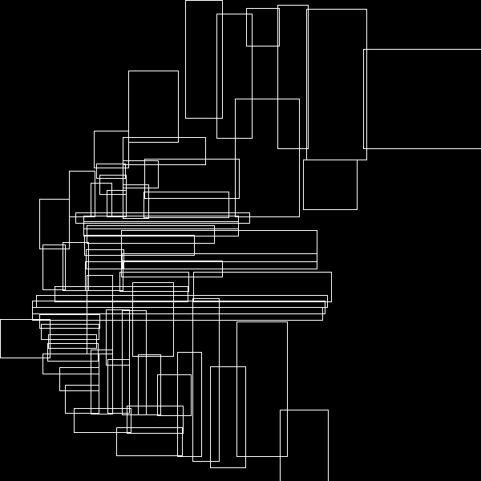

## PostgreSQL multipolygon 空间索引查询过滤精简优化 - IO，CPU放大优化  
                          
### 作者                          
digoal                          
                          
### 日期                          
2017-11-22                        
                          
### 标签                          
PostgreSQL , PostGIS , 空间数据 , 多边形 , bound box , R-Tree , GiST , SP-GiST   
                          
----                          
                          
## 背景     
在PostgreSQL中，目前对于空间对象的索引，采用的是GiST索引方法，空间树结构如下，每个ENTRY都是一个BOX：  
  
  
  
如果对象是多边形，那么在索引结构中，会存储这个多边形的bound box。  
  
那么对于非box类型，一定是会出现空间放大的。  
  
  
  
另一方面，如果输入条件是个多边形，那么同样会将这个多边形的BOUND BOX作为输入条件，根据查询OP（操作符）到索引结构中找到这个输入BOUND BOX的branch。  
  
这样，如果无效面积过多，就出现了索引扫描的IO放大和CPU放大。  
  
例子如下：  
  
优化方法是切割多边形，减少无效空间，使用union all合并结果。  
  
[《PostgreSQL 空间st_contains，st_within空间包含搜索优化 - 降IO和降CPU(bound box) (多边形GiST优化)》](../201710/20171004_01.md)    
  
对于multi polygon对象，BOUND BOX就可能很大。  
  
比如这个图上的三个多边形组成的multi polygon，实际上bound box是很大的。  
  
  
  
```  
select * from tbl where st_contains(multi_polygon, pos);  
```  
  
以上SQL，在使用GiST搜索时，实际上会返回这个bound box包含的所有空间对象，而不是这几个小的多边形包含的空间对象。然后在通过check filter来过滤。这样就导致了IO和CPU放大。  
  
优化方法如上所述，SPLIT空间对象，多个空间搜索结果UNION ALL得到最终结果。  
  
## 例子  
1、创建测试表  
  
```  
create table tbl (id int, pos geometry);  
```  
  
2、写入1000万个空间点  
  
```  
insert into tbl select id,   
st_setsrid(  
  st_makepoint(  
    round((random()*(135.085831-73.406586)+73.406586)::numeric,6),   
    round((random()*(53.880950-3.408477)+3.408477)::numeric,6)  
  ),   
  4326  
) from generate_series(1,10000000) t(id);  
```  
  
3、创建空间索引  
  
```  
create index idx_tbl_pos on tbl using gist(pos);  
```  
  
4、使用多个polygon构造成一个multi polygon  
  
```  
select st_union(  
  array[  
    st_setsrid(st_makepolygon(ST_GeomFromText('LINESTRING(75.15 29.53,77 29,77.6 29.5, 75.15 29.53)')), 4326),   
    st_setsrid(st_makepolygon(ST_GeomFromText('LINESTRING(125.15 29.53,125 29,125.6 29.5, 125.15 29.53)')), 4326)  
  ]  
);  
```  
  
5、使用multi polygon搜索  
  
```  
explain (analyze,verbose,timing,costs,buffers) select * from tbl where st_contains(  
st_union(  
  array[  
    st_setsrid(st_makepolygon(ST_GeomFromText('LINESTRING(75.15 29.53,77 29,77.6 29.5, 75.15 29.53)')), 4326),   
    st_setsrid(st_makepolygon(ST_GeomFromText('LINESTRING(125.15 29.53,125 29,125.6 29.5, 125.15 29.53)')), 4326)  
  ]  
),  
pos  
);  
```  
  
```  
 Bitmap Heap Scan on public.tbl  (cost=156.65..13467.61 rows=3333 width=36) (actual time=41.020..5062.317 rows=2445 loops=1)  
   Output: id, pos  
   Recheck Cond: ('0106000020E610000002000000010300000001000000040000009A99999999C9524048E17A14AE873D4000000000004053400000000000003D4066666666666653400000000000803D409A99999999C9524048E17A14AE873D40010300000001000000040000009A99999999495F4048E17A14AE873D400000000000405F400000000000003D406666666666665F400000000000803D409A99999999495F4048E17A14AE873D40'::geometry ~ tbl.pos)  
   Filter: _st_contains('0106000020E610000002000000010300000001000000040000009A99999999C9524048E17A14AE873D4000000000004053400000000000003D4066666666666653400000000000803D409A99999999C9524048E17A14AE873D40010300000001000000040000009A99999999495F4048E17A14AE873D400000000000405F400000000000003D406666666666665F400000000000803D409A99999999495F4048E17A14AE873D40'::geometry, tbl.pos)  
   Rows Removed by Filter: 83589  
   Heap Blocks: exact=53874  
   Buffers: shared hit=823 read=53873 written=7641  
   ->  Bitmap Index Scan on idx_tbl_pos  (cost=0.00..155.82 rows=10000 width=0) (actual time=22.305..22.305 rows=86034 loops=1)  
         Index Cond: ('0106000020E610000002000000010300000001000000040000009A99999999C9524048E17A14AE873D4000000000004053400000000000003D4066666666666653400000000000803D409A99999999C9524048E17A14AE873D40010300000001000000040000009A99999999495F4048E17A14AE873D400000000000405F400000000000003D406666666666665F400000000000803D409A99999999495F4048E17A14AE873D40'::geometry ~ tbl.pos)  
         Buffers: shared hit=822  
 Planning time: 0.268 ms  
 Execution time: 5062.947 ms  
(12 rows)  
```  
  
6、使用多个polgon搜索，使用union all合并结果  
  
```  
explain (analyze,verbose,timing,costs,buffers)   
select * from tbl where st_contains(st_setsrid(st_makepolygon(ST_GeomFromText('LINESTRING(75.15 29.53,77 29,77.6 29.5, 75.15 29.53)')), 4326), pos)  
union all  
select * from tbl where st_contains(st_setsrid(st_makepolygon(ST_GeomFromText('LINESTRING(125.15 29.53,125 29,125.6 29.5, 125.15 29.53)')), 4326), pos);  
```  
  
```  
 Append  (cost=156.65..27001.89 rows=6666 width=36) (actual time=1.594..11.143 rows=2445 loops=1)  
   Buffers: shared hit=5230  
   ->  Bitmap Heap Scan on public.tbl  (cost=156.65..13467.61 rows=3333 width=36) (actual time=1.594..8.473 rows=2016 loops=1)  
         Output: tbl.id, tbl.pos  
         Recheck Cond: ('0103000020E610000001000000040000009A99999999C9524048E17A14AE873D4000000000004053400000000000003D4066666666666653400000000000803D409A99999999C9524048E17A14AE873D40'::geometry ~ tbl.pos)  
         Filter: _st_contains('0103000020E610000001000000040000009A99999999C9524048E17A14AE873D4000000000004053400000000000003D4066666666666653400000000000803D409A99999999C9524048E17A14AE873D40'::geometry, tbl.pos)  
         Rows Removed by Filter: 2172  
         Heap Blocks: exact=4083  
         Buffers: shared hit=4133  
         ->  Bitmap Index Scan on idx_tbl_pos  (cost=0.00..155.82 rows=10000 width=0) (actual time=1.001..1.001 rows=4188 loops=1)  
               Index Cond: ('0103000020E610000001000000040000009A99999999C9524048E17A14AE873D4000000000004053400000000000003D4066666666666653400000000000803D409A99999999C9524048E17A14AE873D40'::geometry ~ tbl.pos)  
               Buffers: shared hit=50  
   ->  Bitmap Heap Scan on public.tbl tbl_1  (cost=156.65..13467.61 rows=3333 width=36) (actual time=0.429..2.227 rows=429 loops=1)  
         Output: tbl_1.id, tbl_1.pos  
         Recheck Cond: ('0103000020E610000001000000040000009A99999999495F4048E17A14AE873D400000000000405F400000000000003D406666666666665F400000000000803D409A99999999495F4048E17A14AE873D40'::geometry ~ tbl_1.pos)  
         Filter: _st_contains('0103000020E610000001000000040000009A99999999495F4048E17A14AE873D400000000000405F400000000000003D406666666666665F400000000000803D409A99999999495F4048E17A14AE873D40'::geometry, tbl_1.pos)  
         Rows Removed by Filter: 655  
         Heap Blocks: exact=1076  
         Buffers: shared hit=1097  
         ->  Bitmap Index Scan on idx_tbl_pos  (cost=0.00..155.82 rows=10000 width=0) (actual time=0.295..0.295 rows=1084 loops=1)  
               Index Cond: ('0103000020E610000001000000040000009A99999999495F4048E17A14AE873D400000000000405F400000000000003D406666666666665F400000000000803D409A99999999495F4048E17A14AE873D40'::geometry ~ tbl_1.pos)  
               Buffers: shared hit=21  
 Planning time: 0.247 ms  
 Execution time: 11.432 ms  
(24 rows)  
```  
  
7、写UDF，简化写多个UNION ALL  
  
```  
create or replace function q_mp(VARIADIC arr geometry[]) returns setof record as $$  
declare  
  sql text := '';  
  var geometry;  
begin  
  foreach var in array arr loop  
    sql := sql || format(' select * from tbl where st_contains(''%s''::geometry, pos) union all', var);  
  end loop;  
  sql := rtrim(sql, 'union all');  
  return query execute sql;  
end;  
$$ language plpgsql strict;  
```  
  
```  
postgres=# explain (analyze,verbose,timing,costs,buffers) select * from q_mp  
(  
st_setsrid(st_makepolygon(ST_GeomFromText('LINESTRING(75.15 29.53,77 29,77.6 29.5, 75.15 29.53)')), 4326),   
st_setsrid(st_makepolygon(ST_GeomFromText('LINESTRING(125.15 29.53,125 29,125.6 29.5, 125.15 29.53)')), 4326)  
) as t(id int, pos geometry);  
```  
  
```  
 Function Scan on public.q_mp t  (cost=0.25..10.25 rows=1000 width=36) (actual time=11.451..11.707 rows=2445 loops=1)  
   Output: id, pos  
   Function Call: q_mp(VARIADIC '{0103000020E610000001000000040000009A99999999C9524048E17A14AE873D4000000000004053400000000000003D4066666666666653400000000000803D409A99999999C9524048E17A14AE873D40:0103000020E610000001000000040000009A99999999495F4048E17A14AE873D400000000000405F400000000000003D406666666666665F400000000000803D409A99999999495F4048E17A14AE873D40}'::geometry[])  
   Buffers: shared hit=5230  
 Planning time: 0.095 ms  
 Execution time: 11.975 ms  
(6 rows)  
```  
  
## 小结  
使用UDF后，大大简化了SQL写法，同时性能得到了质的飞跃。  
  
尽量的减少搜索条件，或者数据本身的无效面积，可以降低IO和CPU，大幅提升性能。  
  
## 参考  
  
[《PostgreSQL 空间切割(st_split)功能扩展 - 空间对象网格化 (多边形GiST优化)》](../201710/20171005_01.md)    
  
[《PostgreSQL 空间st_contains，st_within空间包含搜索优化 - 降IO和降CPU(bound box) (多边形GiST优化)》](../201710/20171004_01.md)    
  
[《PostgreSQL 黑科技 - 空间聚集存储, 内窥GIN, GiST, SP-GiST索引》](../201709/20170905_01.md)    
  
将一个multigeometry对象展开成多个对象，可以参考PostGIS的文档，例如 :     
  
http://postgis.net/docs/manual-2.4/ST_GeometryN.html   
  
  
<a rel="nofollow" href="http://info.flagcounter.com/h9V1"  ></a>  
  
  
  
  
  
  
## [digoal's 大量PostgreSQL文章入口](https://github.com/digoal/blog/blob/master/README.md "22709685feb7cab07d30f30387f0a9ae")
  
