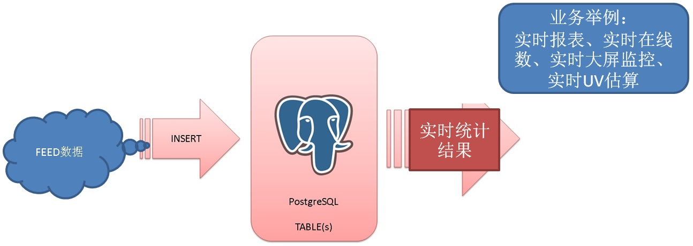

## PostgreSQL 流式统计 - insert on conflict 实现 流式 UV(distinct), min, max, avg, sum, count ...     
                                
### 作者                                
digoal                                
                                
### 日期                                
2017-11-23                              
                                
### 标签                                
PostgreSQL , 流式统计 , insert on conflict , count , avg , min , max , sum       
                                
----                                
                                
## 背景         
流式统计count, avg, min, max, sum等是一个比较有意思的场景，可用于实时大屏，实时绘制统计图表。    
    
比如菜鸟、淘宝、阿里游戏、以及其他业务系统的FEED日志，按各个维度实时统计输出结果。(实时FEED统计，实时各维度在线人数等)    
    
PostgreSQL insert on conflict语法以及rule, trigger的功能，可以实现对数据的实时统计，ECS 56核的性能指标：    
  
**单实例单表单行流式处理性能可以达到39万行/s，批量写入流式处理达到336万行/s的性能。**      
     
    
    
## 例子    
实时统计每个SID的value的min, max, sum，以及记录数。    
    
1、创建测试表，包含统计字段，统计字段的内容由PostgreSQL自动生成。    
    
```    
create table tbl (    
  sid int primary key,     
  v1 int,     
  crt_time timestamp,     
  cnt int8 default 1,                       -- 统计值, 默认为1, 等于1时表示第一条记录    
  sum_v float8 default 0,                   -- 统计值, 默认为0      
  min_v float8 default float8 'Infinity',   -- 统计值, 默认设置为这个类型的最大值      
  max_v float8 default float8 '-Infinity'   -- 统计值, 默认设置为这个类型的最小值      
);    
```    
    
2、创建明细表，用于检查PostgreSQL流计算的结果是否正确    
    
```    
create table tbl_log (    
  sid int,     
  v1 int,     
  crt_time timestamp    
);    
```    
    
3、流计算算法由insert on conflict SQL完成，如下    
    
```    
insert into tbl (sid, v1, crt_time) values (:sid, :v1, now())     
on conflict (sid) do update set     
  v1=excluded.v1,     
  crt_time=excluded.crt_time,     
  cnt=tbl.cnt+1,     
  sum_v=case tbl.cnt when 1 then tbl.v1+excluded.v1 else tbl.sum_v+excluded.v1 end,     
  min_v=least(tbl.min_v, excluded.v1),     
  max_v=greatest(tbl.max_v, excluded.v1)      
;     
```    
    
4、大批量写入测试    
    
```    
vi test.sql    
    
\set sid random(1,1000000)    
\set v1 random(1,100000000)    
insert into tbl (sid, v1, crt_time) values (:sid, :v1, now()) on conflict (sid) do update set v1=excluded.v1, crt_time=excluded.crt_time, cnt=tbl.cnt+1, sum_v=case tbl.cnt when 1 then tbl.v1+excluded.v1 else tbl.sum_v+excluded.v1 end, min_v=least(tbl.min_v, excluded.v1), max_v=greatest(tbl.max_v, excluded.v1);     
insert into tbl_log values (:sid, :v1, now());    
```    
    
```    
pgbench -M prepared -n -r -P 1 -f ./test.sql -c 32 -j 32 -T 120    
```    
    
5、验证算法正确性    
    
```    
postgres=# \timing    
Timing is on.    
postgres=# select sid, count(*), sum(v1), min(v1), max(v1) from tbl_log group by sid order by sid limit 10;    
 sid | count |    sum    |   min    |   max        
-----+-------+-----------+----------+----------    
   1 |    14 | 740544728 | 11165285 | 90619042    
   2 |    10 | 414224202 |  2813223 | 83077953    
   3 |    11 | 501992396 | 13861878 | 79000001    
   4 |    17 | 902219309 |    23429 | 99312338    
   5 |     6 | 374351692 | 25582424 | 96340616    
   6 |    15 | 649447876 | 12987896 | 80478126    
   7 |     8 | 386687697 | 19697861 | 95097076    
   8 |    12 | 657650588 | 11339236 | 97211546    
   9 |    10 | 594843053 |  9192864 | 97362345    
  10 |     9 | 383123573 |  3877866 | 76604940    
(10 rows)    
    
Time: 1817.395 ms (00:01.817)    
    
    
postgres=# select * from tbl order by sid limit 10;    
 sid |    v1    |          crt_time          | cnt |   sum_v   |  min_v   |  max_v       
-----+----------+----------------------------+-----+-----------+----------+----------    
   1 | 26479786 | 2017-11-23 20:27:43.134594 |  14 | 740544728 | 11165285 | 90619042    
   2 | 25755108 | 2017-11-23 20:27:43.442651 |  10 | 414224202 |  2813223 | 83077953    
   3 | 51068648 | 2017-11-23 20:27:48.118906 |  11 | 501992396 | 13861878 | 79000001    
   4 | 81160224 | 2017-11-23 20:27:37.183186 |  17 | 902219309 |    23429 | 99312338    
   5 | 70208701 | 2017-11-23 20:27:35.399063 |   6 | 374351692 | 40289886 | 96340616    
   6 | 77536576 | 2017-11-23 20:27:46.04372  |  15 | 649447876 | 12987896 | 80478126    
   7 | 31153753 | 2017-11-23 20:27:46.54858  |   8 | 386687697 | 19697861 | 95097076    
   8 | 11339236 | 2017-11-23 20:27:40.947561 |  12 | 657650588 | 11339236 | 97211546    
   9 | 46103803 | 2017-11-23 20:27:38.450889 |  10 | 594843053 |  9192864 | 92049544    
  10 | 55630877 | 2017-11-23 20:27:28.944168 |   9 | 383123573 |  3877866 | 76604940    
(10 rows)    
    
Time: 0.512 ms    
```    
    
实时统计后，我们的查询响应时间从1817毫秒降到了0.5毫秒，将近4万倍的性能提升。    
    
## 单表性能压测    
```    
vi test.sql    
    
\set sid random(1,1000000)    
\set v1 random(1,100000000)    
insert into tbl (sid, v1, crt_time) values (:sid, :v1, now()) on conflict (sid) do update set v1=excluded.v1, crt_time=excluded.crt_time, cnt=tbl.cnt+1, sum_v=case tbl.cnt when 1 then tbl.v1+excluded.v1 else tbl.sum_v+excluded.v1 end, min_v=least(tbl.min_v, excluded.v1), max_v=greatest(tbl.max_v, excluded.v1);     
```    
    
```    
pgbench -M prepared -n -r -P 1 -f ./test.sql -c 32 -j 32 -T 300    
```    
    
```    
transaction type: ./test.sql    
scaling factor: 1    
query mode: prepared    
number of clients: 32    
number of threads: 32    
duration: 300 s    
number of transactions actually processed: 57838943    
latency average = 0.166 ms    
latency stddev = 0.057 ms    
tps = 192791.786864 (including connections establishing)    
tps = 192805.650917 (excluding connections establishing)    
script statistics:    
 - statement latencies in milliseconds:    
         0.001  \set sid random(1,1000000)    
         0.000  \set v1 random(1,100000000)    
         0.164  insert into tbl (sid, v1, crt_time) values (:sid, :v1, now()) on conflict (sid) do update set v1=excluded.v1, crt_time=excluded.crt_time, cnt=tbl.cnt+1, sum_v=case tbl.cnt when 1 then tbl.v1+excluded.v1 else tbl.sum_v+excluded.v1 end, min_v=least(tbl.min_v, excluded.v1), max_v=greatest(tbl.max_v, excluded.v1);    
```    
    
```    
top - 20:57:35 up 16 days,  3:44,  2 users,  load average: 8.67, 2.08, 1.68    
Tasks: 497 total,  28 running, 469 sleeping,   0 stopped,   0 zombie    
%Cpu(s): 34.8 us, 13.7 sy,  0.0 ni, 51.3 id,  0.1 wa,  0.0 hi,  0.0 si,  0.0 st    
KiB Mem : 23094336+total, 79333744 free,  1588292 used, 15002134+buff/cache    
KiB Swap:        0 total,        0 free,        0 used. 22219502+avail Mem     
```    
    
## 单实例流式统计性能    
我们这个测试CASE，单个维度，多表，根据CPU剩余，估算得到的性能应该是:    
    
**38.5万行/s**    
  
## 单表，批量写入性能压测  
  
```    
vi test.sql    
    
\set sid random(1,1000000)    
\set v1 random(1,100000000)    
insert into tbl (sid, v1, crt_time) select :sid+id, :v1+id, now() from generate_series(1,100) t(id) on conflict (sid) do update set v1=excluded.v1, crt_time=excluded.crt_time, cnt=tbl.cnt+1, sum_v=case tbl.cnt when 1 then tbl.v1+excluded.v1 else tbl.sum_v+excluded.v1 end, min_v=least(tbl.min_v, excluded.v1), max_v=greatest(tbl.max_v, excluded.v1);     
```    
    
```    
pgbench -M prepared -n -r -P 1 -f ./test.sql -c 28 -j 28 -T 300    
```    
    
```    
scaling factor: 1  
query mode: prepared  
number of clients: 28  
number of threads: 28  
duration: 120 s  
number of transactions actually processed: 1411743  
latency average = 2.380 ms  
latency stddev = 0.815 ms  
tps = 11764.276597 (including connections establishing)  
tps = 11765.715797 (excluding connections establishing)  
script statistics:  
 - statement latencies in milliseconds:  
         0.001  \set sid random(1,1000000)    
         0.000  \set v1 random(1,100000000)    
         2.378  insert into tbl (sid, v1, crt_time) select :sid+id, :v1+id, now() from generate_series(1,100) t(id) on conflict (sid) do update set v1=excluded.v1, crt_time=excluded.crt_time, cnt=tbl.cnt+1, sum_v=case tbl.cnt when 1 then tbl.v1+excluded.v1 else tbl.sum_v+excluded.v1 end, min_v=least(tbl.min_v, excluded.v1), max_v=greatest(tbl.max_v, excluded.v1);  
```    
    
```    
34 processes: 22 running, 11 sleeping, 1 uninterruptable  
CPU states: 28.5% user,  0.0% nice,  6.3% system, 65.0% idle,  0.1% iowait  
Memory: 173G used, 47G free, 247M buffers, 168G cached  
DB activity: 9613 tps,  0 rollbs/s,   0 buffer r/s, 100 hit%, 961050 row r/s, 960824 row w/s  
DB I/O:     0 reads/s,     0 KB/s,     0 writes/s,     0 KB/s    
DB disk: 1455.4 GB total, 441.9 GB free (69% used)  
Swap:   
```   
  
**117.65万行/s。**      
    
我们这个测试CASE，单个维度，单表，批量写入，根据CPU剩余（单ECS使用多实例或者使用UNLOGGED TABLE），估算得到的性能应该是:    
    
**336万行/s**    
    
## 流式统计方案    
因为我们统计的维度可能不止一个，例如明细表中的多个字段，可能都会被统计到。    
    
例如    
    
```    
create table tbl(c1 int, c2 int, c3 int, c4 int, c5 int);    
    
select c1, count(*) from tbl group by c1;    
    
select c2,c3, sum(c5) , count(*) from tbl group by c2,c3;    
    
..... 更多维度    
```    
    
这种情况下，我们需要如何实现流式统计呢？    
    
除了使用pipelinedb，实际上PostgreSQL使用insert on conflict和trigger或rule，也能实现一样的功能。    
    
### 流程设计    
    
1、定义明细表    
    
2、定义每个维度的目标统计表    
    
3、定义维度表的insert on conflict SQL    
    
4、定义明细表trigger或rule，顺序调用insert on conflict 写入多个维度表    
    
#### 例子    
1、定义明细表    
    
```    
create table tbl(c1 int not null, c2 int not null, c3 int not null, c4 int not null, c5 int not null);    
```    
    
2、定义每个维度的目标统计表    
    
```    
create table cv1_tbl (c1 int primary key, cnt int8 default 1);    
    
create table cv2_tbl (c2 int, c3 int, c5 int, sum_v float8 default 0, cnt int8 default 1, primary key (c2,c3)) ;     
    
..... 其他维度    
```    
    
3、定义维度表的insert on conflict SQL    
    
```    
insert into cv1_tbl (c1) values (NEW.c1) on conflict (c1) do update set cnt=cv1_tbl.cnt+1;    
    
insert into cv2_tbl (c2,c3,c5) values (NEW.c2, NEW.c3, NEW.c5) on conflict (c2,c3) do update set cnt=cv2_tbl.cnt+1, sum_v=case cv2_tbl.cnt when 1 then cv2_tbl.c5+excluded.c5 else cv2_tbl.sum_v+excluded.c5 end;    
```    
    
4、定义明细表trigger或rule，顺序调用insert on conflict 写入多个维度表    
    
```    
create rule r1 as on insert to tbl do instead insert into cv1_tbl (c1) values (NEW.c1) on conflict (c1) do update set cnt=cv1_tbl.cnt+1;    
    
create rule r2 as on insert to tbl do instead insert into cv2_tbl (c2,c3,c5) values (NEW.c2, NEW.c3, NEW.c5) on conflict (c2,c3) do update set cnt=cv2_tbl.cnt+1, sum_v=case cv2_tbl.cnt when 1 then cv2_tbl.c5+excluded.c5 else cv2_tbl.sum_v+excluded.c5 end;    
```    
    
5、测试    
    
```    
vi test.sql    
\set c1 random(1,1000000)    
\set c2 random(1,1000000)    
\set c3 random(1,1000000)    
\set c4 random(1,1000000)    
\set c5 random(1,1000000)    
insert into tbl values (:c1, :c2, :c3, :c4, :c5);    
    
    
pgbench -M prepared -n -r -P 1 -f ./test.sql -c 32 -j 32 -T 120    
```    
    
6、测试结果    
    
```    
transaction type: ./test.sql    
scaling factor: 1    
query mode: prepared    
number of clients: 32    
number of threads: 32    
duration: 120 s    
number of transactions actually processed: 18618957    
latency average = 0.206 ms    
latency stddev = 0.212 ms    
tps = 155154.880841 (including connections establishing)    
tps = 155174.283641 (excluding connections establishing)    
script statistics:    
 - statement latencies in milliseconds:    
         0.001  \set c1 random(1,1000000)    
         0.000  \set c2 random(1,1000000)    
         0.000  \set c3 random(1,1000000)    
         0.000  \set c4 random(1,1000000)    
         0.001  \set c5 random(1,1000000)    
         0.203  insert into tbl values (:c1, :c2, :c3, :c4, :c5);    
```    
    
7、验证结果    
    
```    
    
postgres=# select * from cv2_tbl order by cnt desc limit 10;    
   c2   |   c3   |   c5   |  sum_v  | cnt     
--------+--------+--------+---------+-----    
 500568 | 119352 | 173877 |  436710 |   2    
 873168 |  20848 | 730385 | 1688835 |   2    
  90752 | 526912 | 622354 |  734505 |   2    
 273533 | 886999 | 766661 | 1085038 |   2    
 895573 | 466493 | 648095 | 1191965 |   2    
 338402 | 436092 | 940920 | 1372244 |   2    
 915723 | 866856 | 255638 |  947606 |   2    
 586692 | 543596 |  32905 |  996466 |   2    
 839232 | 928197 | 402745 | 1249665 |   2    
 401808 | 997216 | 493644 | 1423618 |   2    
(10 rows)    
    
postgres=# select * from cv1_tbl order by cnt desc limit 10;    
   c1   | cnt     
--------+-----    
 952009 |  44    
 373778 |  43    
 483788 |  42    
  25749 |  42    
  93605 |  41    
 386201 |  41    
 596955 |  40    
 526220 |  40    
  91289 |  40    
 429061 |  40    
(10 rows)    
```    
    
壳子表没有写入，把rule改成do also的话，就会写入本地表。是不是很爽呢？    
    
```    
postgres=# select * from tbl;    
 c1 | c2 | c3 | c4 | c5     
----+----+----+----+----    
(0 rows)    
```    
    
### 实例内并行设计    
    
通过定义明细分区表    
    
#### 例子    
    
1、定义明细分区表    
    
2、定义每个维度的目标统计表    
    
3、定义维度表的insert on conflict SQL    
    
4、定义明细分区表trigger或rule，顺序调用insert on conflict 写入多个维度表    
    
### 实例外并行设计    
    
定义上层哈希分布写    
    
#### 例子    
    
上层应用，或者中间件，实现多个PostgreSQL实例，分布写入。    
  
## 结合Hyperloglog实现实时UV估算  
结合hll数据类型，可以实现实时的UV统计。  
  
```  
create extension hll;  
  
create table tbl (grpid int, userid int, dt date, cnt int8 default 1, hll_userid hll default hll_empty(), primary key (grpid, dt));  
  
insert into tbl (grpid, userid, dt) values () on conflict (grpid, dt) do update set   
cnt=tbl.cnt+1,   
hll_userid=  
  case tbl.cnt   
  when 1 then hll_add(hll_add(tbl.hll_userid, hll_hash_integer(tbl.userid)), hll_hash_integer(excluded.userid))   
  else hll_add(tbl.hll_userid, hll_hash_integer(excluded.userid))  
  end ;  
```  
  
压测，18万TPS。    
  
```  
vi test.sql  
  
\set grpid random(1,1000000)  
\set userid random(1,1000000000)  
insert into tbl (grpid, userid, dt) values (:grpid,:userid,'2017-11-24') on conflict (grpid, dt) do update set cnt=tbl.cnt+1, hll_userid=case tbl.cnt when 1 then hll_add(hll_add(tbl.hll_userid, hll_hash_integer(tbl.userid)), hll_hash_integer(excluded.userid))   else hll_add(tbl.hll_userid, hll_hash_integer(excluded.userid))  end ;  
```  
  
```  
transaction type: ./test.sql  
scaling factor: 1  
query mode: prepared  
number of clients: 28  
number of threads: 28  
duration: 120 s  
number of transactions actually processed: 21713334  
latency average = 0.155 ms  
latency stddev = 0.071 ms  
tps = 180938.313421 (including connections establishing)  
tps = 180959.906404 (excluding connections establishing)  
script statistics:  
 - statement latencies in milliseconds:  
         0.001  \set grpid random(1,1000000)  
         0.000  \set userid random(1,1000000000)  
         0.153  insert into tbl (grpid, userid, dt) values (:grpid,:userid,'2017-11-24') on conflict (grpid, dt) do update set cnt=tbl.cnt+1, hll_userid=  case tbl.cnt   when 1 then hll_add(hll_add(tbl.hll_userid, hll_hash_integer(tbl.userid)), hll_hash_integer(excluded.userid))   else hll_add(tbl.hll_userid, hll_hash_integer(excluded.userid))  end ;  
```  
  
通过hyperloglog类型查询UV估值如下，靠谱：  
  
```  
postgres=# select * from tbl limit 10;  
 grpid  |  userid   |     dt     | cnt |                                                                                hll_userid                                                                                  
--------+-----------+------------+-----+-------------------------------------------------------------------------------------------------------------------  
  71741 | 197976232 | 2017-11-24 |   5 | \x128b7fd534b8dfe5a72bbedd5b6c577ce9fb9fef7835561513628850f173084507f0bd7ed996166036a970  
 801374 | 373207765 | 2017-11-24 |   3 | \x128b7f1dd66eba7e70d9c550284e6d9870994f5f5b52f71f224d6e  
 565216 | 502576520 | 2017-11-24 |   7 | \x128b7f9c4eb2a37de228d8b959a3eb6875033eb9e5dae4c7a7a873037cc095c3f7b01506556992f5aeee9c2a29d4eeb4db71f92ce501619432a864  
  35036 | 868953081 | 2017-11-24 |  10 | \x128b7fa2249c2c7ca51016c477335c6c4e539dd369dd2ea9ab587ce6e3c3c88019dfc33361f5e97ab2db9e3475e0afefc5dc84547c9cc650d2c3ae61b7772ff8a3b36b63bfef7de0eff9f779d598d341edae11  
 950403 | 122708335 | 2017-11-24 |   9 | \x128b7fbb52bc26a18960fec0e5ef0b5d38015dc59f0bad2126d34ce0f19952682a1359257a39cb05a02cf0437f98ce664da1094e8173f33cc1df79547c86939e25bc096179d0a0cfe98b5c  
 173872 | 321068334 | 2017-11-24 |   7 | \x128b7fab5e34d66f513600c19356d876f80d37f13d28f4efc2d6ae0974487c0aa3f5e509affd49827908d35b7c4b009f57ff6376be2b1ea27b1204  
 786334 | 501502479 | 2017-11-24 |   5 | \x128b7f8b5e2d419433c147df779ac0ab34b25a060ecbdd5a896ee229a5ad32a00a060d516c141199609d3f  
 960665 | 855235921 | 2017-11-24 |   7 | \x128b7f95b32567416b5750ecb0c44a76480566f1d98aa6632a3ceeffe5dd8b8de96ffc2447dd5d74e20e993b38a6b242f2c78c678b60d542d68949  
  61741 | 945239318 | 2017-11-24 |   6 | \x128b7f885766f21f40b6b5b3783e764d90fd28c10af4a996cb5dcec8ea749905d0c5cb1de8b191b4f9e6775d597c247710ab71  
  
  
postgres=# select grpid,userid,cnt,hll_cardinality(hll_userid) from tbl limit 10;  
 grpid  |  userid   | cnt | hll_cardinality   
--------+-----------+-----+-----------------  
 775333 | 642518584 |  13 |              13  
  17670 | 542792727 |  11 |              11  
  30079 | 311255630 |  14 |              14  
  61741 | 945239318 |  10 |              10  
 808051 | 422418318 |  14 |              14  
 620850 | 461130760 |  12 |              12  
 256591 | 415325936 |  15 |              15  
 801374 | 373207765 |   9 |               9  
 314023 | 553568037 |  12 |              12  
```  
  
HLL插件的知识参考如下:  
  
https://github.com/aggregateknowledge/postgresql-hll  
   
https://github.com/citusdata/postgresql-hll   (兼容PostgreSQL 10头文件)   
  
[《Greenplum 最佳实践 - 估值插件hll的使用(以及hll分式聚合函数优化)》](../201608/20160825_02.md)    
  
[《PostgreSQL hll (HyperLogLog) extension for "State of The Art Cardinality Estimation Algorithm" - 3》](../201302/20130228_01.md)    
  
[《PostgreSQL hll (HyperLogLog) extension for "State of The Art Cardinality Estimation Algorithm" - 2》](../201302/20130227_01.md)    
  
[《PostgreSQL hll (HyperLogLog) extension for "State of The Art Cardinality Estimation Algorithm" - 1》](../201302/20130226_01.md)   
  
## 结合UDF功能，简化流计算SQL复杂度  
结合PostgreSQL的UDF功能，可以大大的简化SQL的复杂度  
  
例子  
  
```  
create or replace function func1(int, int, date) returns void as $$  
declare  
begin  
  insert into tbl (grpid, userid, dt) values ($1,$2,$3) on conflict (grpid, dt)   
  do update set   
  cnt=tbl.cnt+1,   
  hll_userid=    
    case tbl.cnt     
    when 1   
      then hll_add(hll_add(tbl.hll_userid, hll_hash_integer(tbl.userid)), hll_hash_integer(excluded.userid))     
    else   
      hll_add(tbl.hll_userid, hll_hash_integer(excluded.userid))    
    end ;  
end;  
$$ language plpgsql strict;  
```  
  
使用函数接口写入，不用拼写长长的SQL。  
  
## LOG+实时计算设计
如果要记录明细，同时要实时统计。可以使用rule进行设计。   
    
```
create or replace rule R1 AS on INSERT TO log_table do also XXXXXXXXXXXXXXX;
```
  
如果是增量写，可以通过where来过滤不需要的写入（位点）。    
  
```
create or replace rule R1 AS on INSERT TO log_table WHERE (位点条件,如 id>10000000) do also XXXXXXXXXXXXXXX;
```
  
这种方法，数据既写log_table，同时又会执行流式统计XXXXX COMMAND。   
    
## 同类需求和案例    
[《PostgreSQL 异步消息实践 - Feed系统实时监测与响应(如 电商主动服务) - 分钟级到毫秒级的实现》](../201711/20171111_01.md)      
    
[《HTAP数据库 PostgreSQL 场景与性能测试之 27 - (OLTP) 物联网 - FEED日志, 流式处理 与 阅后即焚 (CTE)》](../201711/20171107_28.md)      
    
[《HTAP数据库 PostgreSQL 场景与性能测试之 22 - (OLTP) merge insert|upsert|insert on conflict|合并写入》](../201711/20171107_23.md)      
    
[《HTAP数据库 PostgreSQL 场景与性能测试之 32 - (OLTP) 高吞吐数据进出(堆存、行扫、无需索引) - 阅后即焚(JSON + 函数流式计算)》](../201711/20171107_33.md)      
    
[《HTAP数据库 PostgreSQL 场景与性能测试之 31 - (OLTP) 高吞吐数据进出(堆存、行扫、无需索引) - 阅后即焚(读写大吞吐并测)》](../201711/20171107_32.md)      
    
[《打造云端流计算、在线业务、数据分析的业务数据闭环 - 阿里云RDS、HybridDB for PostgreSQL最佳实践》](../201707/20170728_01.md)      
    
      
  
<a rel="nofollow" href="http://info.flagcounter.com/h9V1"  ></a>  
  
  
  
  
  
  
## [digoal's 大量PostgreSQL文章入口](https://github.com/digoal/blog/blob/master/README.md "22709685feb7cab07d30f30387f0a9ae")
  
