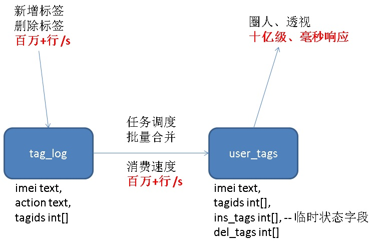

## PostgreSQL手机行业经营分析、决策系统设计 - 实时圈选、透视、估算  
  
### 作者  
digoal  
  
### 日期  
2017-11-26  
  
### 标签  
PostgreSQL , 经营分析系统 , 手机行业 , 标签 , 圈选 , 透视 , 估值 , 决策  
  
----  
  
## 背景  
经营分析、决策支持是现代企业的一个让数据发挥有效价值的分析型系统。  
  
在各个行业中随处可见，例如共享充电宝中，协助销售了解实时的设备租赁情况，销售业绩。在电商中，协助小二和商户发掘目标用户群体。金融行业中，协助输出国民的存款、消费、贷款的画像。  
  
PostgreSQL, Greenplum都是非常适合于经营分析、决策支持的数据库。因为它们具备了一些特性，适合实时的分析透视。**（流式计算、合并写入、阅后即焚、GIN倒排索引、varbit类型、列存储、BITMAP合并扫描、HLL估值类型、采样算法等等）。**  
  
我也写过很多实际的应用案例，可以参考本文末尾。  
  
经营分析系统的需求大同小异，在手机行业中，以imei或imsi为KEY，每个手机根据它的用户的行为，生成一些属性，针对每个属性，划分出不同的标签，形成了手机用户的画像。再针对画像进行人群的圈选、透视，协助分析。  
  
例如，基于PostgreSQL数组以及GIN索引的设计：  
  
  
  
## 经营分析设计示例  
  
1、目标设计  
  
2、表结构设计  
  
3、属性表  
  
4、标签表  
  
5、标签表索引设计  
  
6、打标签（含新增、更新、删除标签）测试  
  
7、圈选测试  
  
8、透视测试  
  
9、决策设计示例  
  
流式+函数式计算  
  
### 结构设计  
  
1、手机用户属性表  
  
```  
create table tbl1 (  
  imei text primary key,     -- 手机唯一标识  
  v1 int,        -- 年龄  
  v2 float8,     -- 收入  
  v3 geometry,   -- 住址经纬  
  v4 geometry,   -- 公司经纬  
  v5 char(1),    -- 性别  
  v6 timestamp,  -- 最后活跃时间  
  v7 int2,       -- 每日在线时长  
  v8 int2,       -- 星座  
  v9 text,       -- 其他标签。。。。。  
  ......  
);  
```  
  
2、标签元数据表  
  
```  
create table tbl2 (  
  tagid int primary key,    -- 标签名  
  desc text,    -- 描述，例如性别，年龄分段，收入分段，区域等等，作为一个标签标识。  
);  
```  
  
3、标签表  
  
```  
create table tbl3 (  
  imei text primary key,   -- 手机唯一标识  
  tagids int[],            -- 标签数组  
  ins_tags int[],          -- 合并操作需要的中间字段  
  del_tags int[]           -- 合并操作需要的中间字段  
);  
  
create index idx_tbl3_tagids on tbl3 using gin (tagids gin__int_ops);  
或
create index idx_tbl3_tagids on tbl3 using gist (tagids gist__intbig_ops);  
或
create index idx_tbl3_tagids on tbl3 using gist (tagids gist__int_ops);  
```  
  
4、标签表与属性表实际上可以合一，在透视时，可以避免一次JOIN（降低透视的耗时），但是会引入更新IO放大的问题，因为属性表可能是宽表。  
  
根据实际的性能情况来选择是否合一。  
  
### 需求与SQL设计  
1、圈人  
  
```  
select imei from tbl3 where tagids @> array[标签1, 标签2];  -- 查找包含标签1，标签2的人群。  
  
select imei from tbl3 where tagids && array[标签1, 标签2];  -- 查找包含标签1，标签2中任意一个或多个的人群。  
  
select imei from tbl3 where tagids && array[标签1, 标签2] and tagid @> array[标签3, 标签4];  -- 查找包含标签3，标签4。同时包含标签1，标签2中任意一个或多个的人群。  
```  
  
2、针对圈出人群的精准透视  
  
```  
select v8,count(*) from tbl1 where  
  imei = any (array(  
                     select imei from tbl3 where tagids @> array[标签1, 标签2]  
             )     )  
group by v8;  
```  
  
3、新增或追加标签  
  
使用intarray插件，简化数组交、并、差操作。  
  
```  
create extension intarray;  
```  
  
```  
insert into tbl3 (imei, tagids) values (?, ?[]) on conflict (imei) do update set tagids=tbl3.tagids|excluded.tagids;  
```  
  
4、删标签  
  
```  
update tbl3 set tagids = tagids - ?[] where imei=?;  
```  
  
5、更新标签  
  
```  
update tbl3 set tagids = ?[] where imei=?;  
```  
  
6、批量并行新增、追加、删除、更新标签优化  
  
如果要一次性操作很多条记录（例如1000万条记录），并且有并行的贴标签操作（同一条用户被多个SQL更新）。需要注意两个问题：  
  
6\.1 大事务导致膨胀的问题，建议分段操作。  
  
6\.2 行锁冲突问题，建议新增（插入），然后合并到标签表。  
  
优化方法，  
  
实现标签最终一致性。  
  
将直接增、删、改标签表，改成写行为日志tag_log，采用任务调度，批量合并到标签表：  
  
```  
create table tag_log (  
  imei text,    -- 手机唯一标识  
  action text,  -- insert, delete  表示增加、删除标签  (更新需求应该没有，如有，直接到标签表操作)  
  tagids int[], -- 标签IDs  
  crt_time timestamp default clock_timestamp()   -- 时间  
);  
  
create index idx_tag_log_1 on tag_log (crt_time);  
  
-- 16个分区表
do language plpgsql $$
declare
begin
  for i in 0..15 loop
    execute format('create table tag_log%s (like tag_log including all) inherits(tag_log)', i);
  end loop;
end;
$$;
```  
  
串行任务，阅后即焚(假设-99999999是一个永远不存在的TAGID)  
  
```  
-- CTE语法，支持阅后即焚的批量合并方法  
with tmp as (delete from tag_log where ctid = any ( array (  
  select ctid from tag_log order by crt_time limit 10000  -- 按时序，批量取1万条  
  )) returning * )  
, tmp1 as (select imei,  
             uniq(sort(array_agg(case when action='insert' then tagids else -99999999 end))) - (-99999999) AS ins_tags,  
             uniq(sort(array_agg(case when action='delete' then tagids else -99999999 end))) - (-99999999) AS del_tags  
           from (select imei, action, unnest(tagids) as tagids from tmp) t group by imei)  
insert into tbl3 (imei, tagids, ins_tags, del_tags)  
select imei, ins_tags-del_tags, ins_tags, del_tags from tmp1  
 on conflict (imei) do update set tagids=((tbl3.tagids | excluded.ins_tags) - excluded.del_tags), ins_tags=excluded.ins_tags, del_tags=excluded.del_tags;  
```  
  
并行任务，阅后即焚  
  
```  
例如开启16个并行  
  
abs(mod(hashtext(imei), 16))=?  
```  
  
```  
-- CTE语法，支持阅后即焚的批量合并方法  
with tmp as (delete from tag_log where ctid = any ( array (  
  select ctid from tag_log where abs(mod(hashtext(imei), 16))=0 order by crt_time limit 10000  -- 按时序，批量取1万条，按HASH并行  
  )) returning * )  
, tmp1 as (select imei,  
             uniq(sort(array_agg(case when action='insert' then tagids else -99999999 end))) - (-99999999) AS ins_tags,  
             uniq(sort(array_agg(case when action='delete' then tagids else -99999999 end))) - (-99999999) AS del_tags  
           from (select imei, action, unnest(tagids) as tagids from tmp) t group by imei)  
insert into tbl3 (imei, tagids, ins_tags, del_tags)  
select imei, ins_tags-del_tags, ins_tags, del_tags from tmp1  
 on conflict (imei) do update set tagids=((tbl3.tagids | excluded.ins_tags) - excluded.del_tags), ins_tags=excluded.ins_tags, del_tags=excluded.del_tags;  
```  
  
写成函数，方便调用  
  
```  
create or replace function consume_tag_log(mo int, mov int, lim int) returns void as $$  
declare  
begin  
  execute format($_$with tmp as (delete from tag_log where ctid = any ( array (  
  select ctid from tag_log where abs(mod(hashtext(imei), %s))=%s order by crt_time limit %s  
  )) returning * )  
, tmp1 as (select imei,  
             uniq(sort(array_agg(case when action='insert' then tagids else -99999999 end))) - (-99999999) AS ins_tags,  
             uniq(sort(array_agg(case when action='delete' then tagids else -99999999 end))) - (-99999999) AS del_tags  
           from (select imei, action, unnest(tagids) as tagids from tmp) t group by imei)  
insert into tbl3 (imei, tagids, ins_tags, del_tags)  
select imei, ins_tags-del_tags, ins_tags, del_tags from tmp1  
 on conflict (imei) do update set tagids=((tbl3.tagids | excluded.ins_tags) - excluded.del_tags), ins_tags=excluded.ins_tags, del_tags=excluded.del_tags$_$,  
 mo, mov, lim);  
end;  
$$ language plpgsql strict;  
  
  
select consume_tag_log(16,0,10000);   -- 并行处理  
select consume_tag_log(16,1,10000);  
.....  
select consume_tag_log(16,15,10000);  
```  
  
```  
create or replace function consume_tag_log(lim int) returns void as $$  
declare  
begin  
  execute format($_$with tmp as (delete from tag_log where ctid = any ( array (  
  select ctid from tag_log order by crt_time limit %s  
  )) returning * )  
, tmp1 as (select imei,  
             uniq(sort(array_agg(case when action='insert' then tagids else -99999999 end))) - (-99999999) AS ins_tags,  
             uniq(sort(array_agg(case when action='delete' then tagids else -99999999 end))) - (-99999999) AS del_tags  
           from (select imei, action, unnest(tagids) as tagids from tmp) t group by imei)  
insert into tbl3 (imei, tagids, ins_tags, del_tags)  
select imei, ins_tags-del_tags, ins_tags, del_tags from tmp1  
 on conflict (imei) do update set tagids=((tbl3.tagids | excluded.ins_tags) - excluded.del_tags), ins_tags=excluded.ins_tags, del_tags=excluded.del_tags$_$,  
 lim);  
end;  
$$ language plpgsql strict;  
  
  
select consume_tag_log(10000);  -- 每次处理1万条  
```  
  
创建调度任务，执行消费函数调度即可。  
  
**阅后即焚的处理速度，每秒 百万行。**  
  
[《(OLTP) 高吞吐数据进出(堆存、行扫、无需索引) - 阅后即焚(读写大吞吐并测)》](../201711/20171107_32.md)  
  
### 性能验证  
1、标签取值范围5万，正态分布  
  
  
  
2、多表批量写入函数    
  
```
create or replace function ins(
  imei text,
  tagids int[]
) returns void as $$
declare
  suffix int := abs(mod(hashtext(imei),16)); 
begin
  execute format($_$insert into tag_log%s values ('%s', 'insert', '%s'::int[])$_$, suffix, imei, tagids);
end;
$$ language plpgsql strict;
```
  
3、多表批量消费  
  
标签表分表    
   
```
do language plpgsql $$
declare
begin
  for i in 0..15 loop
    execute format('create table tbl3_%s (like tbl3 including all) inherits(tbl3)', i);
  end loop;
end;
$$;
```
  
多表批量消费  
  
```
CREATE OR REPLACE FUNCTION public.consume_tag_log(suffix int, lim integer)
 RETURNS void
 LANGUAGE plpgsql
 STRICT
AS $function$
declare
begin
  execute format($_$with tmp as (delete from tag_log%s where ctid = any ( array (  
  select ctid from tag_log%s order by crt_time limit %s  -- 按时序，批量取1万条，按HASH并行
  )) returning * )   
, tmp1 as (select imei, 
             uniq(sort(array_agg(case when action='insert' then tagids else -99999999 end))) - (-99999999) AS ins_tags,   
     uniq(sort(array_agg(case when action='delete' then tagids else -99999999 end))) - (-99999999) AS del_tags
   from (select imei, action, unnest(tagids) as tagids from tmp) t group by imei)  
insert into tbl3_%s (imei, tagids, ins_tags, del_tags) 
select imei, ins_tags-del_tags, ins_tags, del_tags from tmp1 
 on conflict (imei) do update set tagids=((tbl3_%s.tagids | excluded.ins_tags) - excluded.del_tags), ins_tags=excluded.ins_tags, del_tags=excluded.del_tags$_$,
 suffix, suffix, lim, suffix, suffix);
end;
$function$;
```
  
4、数据写入压测脚本  
  
```  
vi test.sql  
  
\set tag1 random_gaussian(1, 50000, 20)  
\set tag2 random_gaussian(1, 50000, 20)  
\set tag3 random_gaussian(1, 50000, 20)  
\set tag4 random_gaussian(1, 50000, 20)  
\set tag5 random_gaussian(1, 50000, 20)  
\set tag6 random_gaussian(1, 50000, 20)  
\set tag7 random_gaussian(1, 50000, 20)  
\set tag8 random_gaussian(1, 50000, 20)  
\set imei random(1,1000000000)  
select ins(:imei, (array[:tag1,:tag2,:tag3,:tag4,:tag5,:tag6,:tag7,:tag8])::int[]);
  
nohup pgbench -M prepared -n -r -P 1 -f ./test.sql -c 28 -j 28 -T 3000 >./tag.log 2>&1 &  
```  
  
5、数据消费，并行调度  
  
用秒杀技术实现并行调度，避免单个HASH被重复调用。  
  
[《HTAP数据库 PostgreSQL 场景与性能测试之 30 - (OLTP) 秒杀 - 高并发单点更新》](../201711/20171107_31.md)  
  
这里直接用分区表写入的话，性能会更爽，原理请看如下：  
  
[《阿里云RDS PostgreSQL OSS 外部表 - (dblink异步调用封装)并行写提速案例》](../201709/20170906_01.md)  
  
```  
vi test1.sql  
  
\set mov random(0,15)  
select consume_tag_log(:mov,10000) where pg_try_advisory_xact_lock(:mov);  
  
nohup pgbench -M prepared -n -r -P 1 -f ./test1.sql -c 16 -j 16 -T 3000 >./consume.log 2>&1 &  
```  
  
6、压测结果  
  
写入速度  
  
```  
单条单步写入，约 14.3万 行/s  
  
改成多表批量写入，可以提高到100万+ 行/s  
```  
  
消费速度  
  
```  
单表并行批量消费，约 25.5万 行/s  
  
改成多表并行批量消费，可以提高到 100万+ 行/s  
```  
  
查询速度，毫秒级    
  
```
postgres=# explain (analyze,verbose,timing,costs,buffers) select count(imei) from tbl3 where tagids @> (array[25281,25288])::int[];
                                                           QUERY PLAN                                                           
--------------------------------------------------------------------------------------------------------------------------------
 Aggregate  (cost=224.50..224.51 rows=1 width=8) (actual time=2.745..2.746 rows=1 loops=1)
   Output: count(imei)
   Buffers: shared hit=193
   ->  Bitmap Heap Scan on public.tbl3  (cost=218.44..224.49 rows=5 width=33) (actual time=2.716..2.738 rows=9 loops=1)
         Output: imei, tagids, ins_tags, del_tags
         Recheck Cond: (tbl3.tagids @> '{25281,25288}'::integer[])
         Heap Blocks: exact=9
         Buffers: shared hit=193
         ->  Bitmap Index Scan on idx_tbl3_tagids  (cost=0.00..218.44 rows=5 width=0) (actual time=2.707..2.707 rows=9 loops=1)
               Index Cond: (tbl3.tagids @> '{25281,25288}'::integer[])
               Buffers: shared hit=184
 Planning time: 0.165 ms
 Execution time: 2.797 ms
(13 rows)
```
  
除了以上基于数组、GIN索引的设计，PostgreSQL还有一些技术，可以用在经营分析系统。  
  
## 技术1 实时透视 - 技术之 - 流式统计  
通过insert on conflict，流式的统计固定模型的维度数据。  
  
[《PostgreSQL 流式统计 - insert on conflict 实现 流式 UV(distinct), min, max, avg, sum, count ...》](../201711/20171123_02.md)  
  
满足这类查询的实时流式统计：  
  
```  
select a,count(*),sum(b),avg(b),min(b),max(b) from tbl group by a;  
```  
  
## 技术2 实时透视、估算 - 技术之 - 流式统计 + HLL  
通过insert on conflict，流式的统计固定模型的维度数据。这里要用到hll插件，存储count(dinstinct x)的估值  
  
[《PostgreSQL 流式统计 - insert on conflict 实现 流式 UV(distinct), min, max, avg, sum, count ...》](../201711/20171123_02.md)  
  
[《PostgreSQL hll (HyperLogLog) extension for "State of The Art Cardinality Estimation Algorithm" - 3》](../201302/20130228_01.md)  
  
[《PostgreSQL hll (HyperLogLog) extension for "State of The Art Cardinality Estimation Algorithm" - 2》](../201302/20130227_01.md)  
  
[《PostgreSQL hll (HyperLogLog) extension for "State of The Art Cardinality Estimation Algorithm" - 1》](../201302/20130226_01.md)  
  
满足这类查询的实时流式统计：  
  
```  
select a, count(distinct b) from tbl group by a;  
```  
  
## 技术3 实时透视、估算 - 技术之 - 计划估算  
  
根据执行计划得到评估行。  
  
[《妙用explain Plan Rows快速估算行》](../201509/20150919_02.md)  
  
如果输入多个字段条件，为了提高行估算准确度，可以定义多字段统计信息，10新增的功能：  
  
[《PostgreSQL 10 黑科技 - 自定义统计信息》](../201709/20170902_02.md)  
  
满足这类查询的估算需求：  
  
```  
select count(*) from tbl where xxxx;  
  
SQL换算成  
  
select * from tbl where xxxx; -- 通过explain的行估算拿结果  
```  
  
## 技术4 实时透视、估算 - 技术之 - 采样估算  
  
[《秒级任意维度分析1TB级大表 - 通过采样估值满足高效TOP N等统计分析需求》](../201709/20170911_02.md)  
  
采样估算，适合求TOP N。  
  
满足这类查询的估算需求：  
  
```  
select a from tbl group by a order by count(*) desc limit N;  
```  
  
## 技术5 实时圈选、透视 - 技术之 - GIN倒排  
  
倒排索引针对多值类型，例如 hstore, array, tsvector, json, jsonb。  
  
主树的K-V分别为：  
  
```  
element-ctid(行号)list or tree  
```  
  
辅树为  
  
```  
ctid list or tree  
```  
  
从而高效的满足这类查询的需求：  
  
```  
-- 包含哪些元素  
select * from tbl where arr @> array[xx,xx];  
  
-- 包含哪些任意元素之一  
select * from tbl where arr && array[xx,xx];  
```  
  
内部使用BITMAP扫描方法，过滤到少量数据块。  
  
[《PostgreSQL 9种索引的原理和应用场景》](../201706/20170627_01.md)  
  
## 技术6 实时圈选、透视 - 技术之 - bitmap  
  
这个方法非常的巧妙，将tag和imei做了倒转，以tag为key, imei为bitmap来存储。  
  
```  
create table tag_users (  
  tagid int primary key, -- 标签  
  imeibitmap varbit,     -- 每个imei用一个BIT位表示  
);  
```  
  
查询换算：  
  
```  
-- 包含某些标签的用户  
select bitand(imeibitmap) from tag_users where tagid in (?,?,...);  
  
-- 包含任意标签的用户  
select bitor(imeibitmap) from tag_users where tagid in (?,?,...);  
```  
  
案例参考：  
  
[《阿里云RDS for PostgreSQL varbitx插件与实时画像应用场景介绍》](../201705/20170502_01.md)  
  
[《基于 阿里云 RDS PostgreSQL 打造实时用户画像推荐系统(varbitx)》](../201610/20161021_01.md)  
  
## 技术7 实时圈选、透视 - 技术之 - 并行计算  
PostgreSQL 10加入了并行计算的能力，在join , filter, seqscan, order by, agg, group等方面都支持并行。  
  
性能指标参考：  
  
[《HTAP数据库 PostgreSQL 场景与性能测试之 23 - (OLAP) 并行计算》](../201711/20171107_24.md)  
  
## 技术8 实时圈选、透视 - 技术之 - MPP, 列存储, 位图索引  
基于PostgreSQL的MPP 数据仓库Greenplum，支持列存储，位图索引。  
  
用资源，暴力解决问题。  
  
没有太多的设计技巧，堆机器就可以，但是本身的效率远比impalar, hive好很多。  
  
Greenplum是非常值得推荐的OLAP数据库。在金融、政府、航空等大数据领域有众多案例。  
  
## 决策支持技术  
流式数据处理+UDF函数计算技术。可以满足实时决策的需求。  
  
案例如下：  
  
[《HTAP数据库 PostgreSQL 场景与性能测试之 32 - (OLTP) 高吞吐数据进出(堆存、行扫、无需索引) - 阅后即焚(JSON + 函数流式计算)》](../201711/20171107_33.md)  
  
[《HTAP数据库 PostgreSQL 场景与性能测试之 27 - (OLTP) 物联网 - FEED日志, 流式处理 与 阅后即焚 (CTE)》](../201711/20171107_28.md)  
  
## 相似案例举例  
1、实时统计 count(distinct)估值，min, max, avg, sum, count精确值。  
  
[《PostgreSQL 流式统计 - insert on conflict 实现 流式 UV(distinct), min, max, avg, sum, count ...》](../201711/20171123_02.md)  
  
2、  
  
[《PostgreSQL 异步消息实践 - Feed系统实时监测与响应(如 电商主动服务) - 分钟级到毫秒级的实现》](../201711/20171111_01.md)  
  
[《(OLTP) 物联网 - FEED日志, 流式处理 与 阅后即焚 (CTE)》](../201711/20171107_28.md)  
  
3、让explain产生精确的多字段输入条件行数估值(```select * from table where a=? and|or b=? ....```)  
  
[《PostgreSQL 10 黑科技 - 自定义统计信息》](../201709/20170902_02.md)  
  
4、[《恭迎万亿级营销(圈人)潇洒的迈入毫秒时代 - 万亿user_tags级实时推荐系统数据库设计》](../201612/20161225_01.md)  
  
[《阿里云RDS for PostgreSQL varbitx插件与实时画像应用场景介绍》](../201705/20170502_01.md)  
  
[《基于 阿里云 RDS PostgreSQL 打造实时用户画像推荐系统(varbitx)》](../201610/20161021_01.md)  
  
5、决策支持，流式函数计算  
  
[《(OLTP) 高吞吐数据进出(堆存、行扫、无需索引) - 阅后即焚(JSON + 函数流式计算)》](../201711/20171107_33.md)  
  
[《(OLTP) 高吞吐数据进出(堆存、行扫、无需索引) - 阅后即焚(读写大吞吐并测)》](../201711/20171107_32.md)  
  
  
6、圈人案例  
  
[《(OLAP) 用户画像圈人场景 - 数组相交查询与聚合》](../201711/20171107_20.md)  
  
[《(OLAP) 用户画像圈人场景 - 数组包含查询与聚合》](../201711/20171107_19.md)  
  
  
7、时间、空间、多维圈人、透视案例  
  
[《空间|时间|对象 圈人 + 透视 - 暨PostgreSQL 10与Greenplum的对比和选择》](../201709/20170918_02.md)  
  
[《PostgreSQL\GPDB 毫秒级海量 时空数据透视 典型案例分享》](../201706/20170629_01.md)  
  
[《PostgreSQL\GPDB 毫秒级海量 多维数据透视 案例分享》](../201706/20170625_01.md)  
  
8、视频网站透视案例  
  
[《音视图(泛内容)网站透视分析 DB设计 - 阿里云(RDS、HybridDB) for PostgreSQL最佳实践》](../201708/20170827_01.md)  
  
9、  
  
[《画像圈人 + 人群行为透视》](../201709/20170918_01.md)  
  
[《奔跑吧，大屏 - 时间+空间 实时四维数据透视》](../201704/20170413_02.md)  
  
[《数据透视 - 商场(如沃尔玛)选址应用》](../201703/20170307_01.md)  
  
[《海量用户实时定位和圈人 - 团圆社会公益系统(位置寻人\圈人)》](../201709/20170915_01.md)  
  
[《万亿级电商广告 - brin黑科技带你(最低成本)玩转毫秒级圈人(视觉挖掘姊妹篇) - 阿里云RDS PostgreSQL, HybridDB for PostgreSQL最佳实践》](../201708/20170823_01.md)  
  
[《多字段，任意组合条件查询(无需建模) - 毫秒级实时圈人 最佳实践》](../201706/20170607_02.md)  
  
10、  
  
[《经营、销售分析系统DB设计之PostgreSQL, Greenplum - 共享充电宝 案例实践》](../201709/20170923_01.md)  
    
  
<a rel="nofollow" href="http://info.flagcounter.com/h9V1"  ></a>  
  
  
  
  
  
  
## [digoal's 大量PostgreSQL文章入口](https://github.com/digoal/blog/blob/master/README.md "22709685feb7cab07d30f30387f0a9ae")
  
