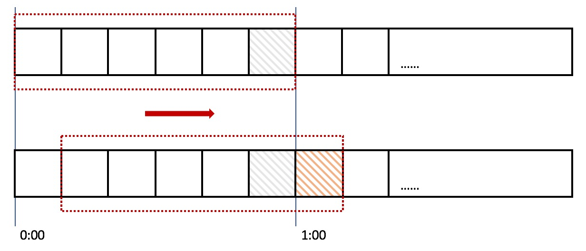

## PostgreSQL、Greenplum 滑动窗口 分析SQL 实践  
            
### 作者            
digoal            
            
### 日期            
2017-11-29            
            
### 标签            
PostgreSQL , Greenplum , 滑动窗口 , 滑窗 , 窗口语法 , window , frame , 帧        
            
----            
            
## 背景            
滑动窗口分析是数据分析中比较常见的需求，例如需要分析每一天的最近7天内的UV、PV、sum, count, avg, min, max等。  
  
  
  
因为每一条记录的最近7天的数据都不一样，不能直接GROUP BY，而需要使用 帧 的技术，得到当前行最近7行的数据，并进行统计。  
  
使用的是PostgreSQL的窗口语法。  
    
## 统计分析 - 滑窗SQL实践  
1、创建测试表，每条记录代表某个GROUP 下的当前VALUE。  
  
使用滑动分析，得到每条记录最近7条的SUM,COUNT,count(distinct),avg,min,max等。  
  
```  
postgres=# create table t_slide (id int, grp int2, val int, crt_time timestamp);  
CREATE TABLE  
```  
  
写入测试数据  
  
```  
postgres=# insert into t_slide select generate_series(1,10000000), random()*100, random()*10000, clock_timestamp();  
INSERT 0 10000000  
```  
  
创建索引  
  
```  
postgres=# create index idx_t_slide_1 on t_slide (grp,crt_time);  
CREATE INDEX  
```  
  
滑窗查询  
  
```  
postgres=# select *, count(*) over s,   -- 窗口统计  
                     sum(val) over s,   
		     avg(val) over s,   
		     min(val) over s,   
		     max(val) over s   
           from t_slide   
	   window s as (partition by grp order by crt_time rows 6 PRECEDING)  -- 定义窗口(帧)  
limit 100;  
  
    
  id   | grp | val  |          crt_time          | count |  sum  |          avg          | min  | max    
-------+-----+------+----------------------------+-------+-------+-----------------------+------+------  
   188 |   0 |   90 | 2017-11-29 20:03:01.62792  |     1 |    90 |   90.0000000000000000 |   90 |   90  
   437 |   0 | 5981 | 2017-11-29 20:03:01.628205 |     2 |  6071 | 3035.5000000000000000 |   90 | 5981  
   720 |   0 | 6932 | 2017-11-29 20:03:01.628541 |     3 | 13003 | 4334.3333333333333333 |   90 | 6932  
   979 |   0 | 4227 | 2017-11-29 20:03:01.628841 |     4 | 17230 | 4307.5000000000000000 |   90 | 6932  
  1642 |   0 | 2754 | 2017-11-29 20:03:01.629642 |     5 | 19984 | 3996.8000000000000000 |   90 | 6932  
  1917 |   0 | 6376 | 2017-11-29 20:03:01.629954 |     6 | 26360 | 4393.3333333333333333 |   90 | 6932  
  2112 |   0 | 2538 | 2017-11-29 20:03:01.63018  |     7 | 28898 | 4128.2857142857142857 |   90 | 6932  
  2170 |   0 | 7598 | 2017-11-29 20:03:01.630235 |     7 | 36406 | 5200.8571428571428571 | 2538 | 7598  
  2173 |   0 | 7168 | 2017-11-29 20:03:01.630237 |     7 | 37593 | 5370.4285714285714286 | 2538 | 7598  
  2495 |   0 | 1026 | 2017-11-29 20:03:01.630611 |     7 | 31687 | 4526.7142857142857143 | 1026 | 7598  
  2656 |   0 | 2522 | 2017-11-29 20:03:01.630799 |     7 | 29982 | 4283.1428571428571429 | 1026 | 7598  
  2850 |   0 | 5016 | 2017-11-29 20:03:01.631038 |     7 | 32244 | 4606.2857142857142857 | 1026 | 7598  
  2876 |   0 | 6510 | 2017-11-29 20:03:01.631073 |     7 | 32378 | 4625.4285714285714286 | 1026 | 7598  
  3289 |   0 | 9566 | 2017-11-29 20:03:01.631524 |     7 | 39406 | 5629.4285714285714286 | 1026 | 9566  
  3413 |   0 |   86 | 2017-11-29 20:03:01.631665 |     7 | 31894 | 4556.2857142857142857 |   86 | 9566  
  3673 |   0 | 7581 | 2017-11-29 20:03:01.631969 |     7 | 32307 | 4615.2857142857142857 |   86 | 9566  
  3745 |   0 | 6976 | 2017-11-29 20:03:01.632037 |     7 | 38257 | 5465.2857142857142857 |   86 | 9566  
  4435 |   0 | 1981 | 2017-11-29 20:03:01.632848 |     7 | 37716 | 5388.0000000000000000 |   86 | 9566  
  4439 |   0 | 3453 | 2017-11-29 20:03:01.632852 |     7 | 36153 | 5164.7142857142857143 |   86 | 9566  
  4555 |   0 | 9474 | 2017-11-29 20:03:01.632983 |     7 | 39117 | 5588.1428571428571429 |   86 | 9566  
  4689 |   0 | 9176 | 2017-11-29 20:03:01.633119 |     7 | 38727 | 5532.4285714285714286 |   86 | 9474  
  4714 |   0 | 7124 | 2017-11-29 20:03:01.633175 |     7 | 45765 | 6537.8571428571428571 | 1981 | 9474  
  5019 |   0 | 6520 | 2017-11-29 20:03:01.633495 |     7 | 44704 | 6386.2857142857142857 | 1981 | 9474  
```  
  
执行计划如下  
  
```  
postgres=# explain select *, count(*) over s, sum(val) over s, avg(val) over s, min(val) over s, max(val) over s from t_slide window s as (partition by grp order by crt_time rows 6 PRECEDING) limit 100;  
                                              QUERY PLAN                                                
------------------------------------------------------------------------------------------------------  
 Limit  (cost=0.43..5.91 rows=100 width=74)  
   ->  WindowAgg  (cost=0.43..547641.44 rows=10000000 width=74)  
         ->  Index Scan using idx_t_slide_1 on t_slide  (cost=0.43..272641.44 rows=10000000 width=18)  
(3 rows)  
```  
  
效率，毫秒级  
  
```  
postgres=# explain (analyze,verbose,timing,costs,buffers,summary) select *, count(*) over s, sum(val) over s, avg(val) over s, min(val) over s, max(val) over s from t_slide window s as (partition by grp order by crt_time rows 6 PRECEDING) limit 100;  
                                                                       QUERY PLAN                                                                          
---------------------------------------------------------------------------------------------------------------------------------------------------------  
 Limit  (cost=0.43..5.91 rows=100 width=74) (actual time=0.038..0.429 rows=100 loops=1)  
   Output: id, grp, val, crt_time, (count(*) OVER (?)), (sum(val) OVER (?)), (avg(val) OVER (?)), (min(val) OVER (?)), (max(val) OVER (?))  
   Buffers: shared hit=74  
   ->  WindowAgg  (cost=0.43..547641.44 rows=10000000 width=74) (actual time=0.037..0.393 rows=100 loops=1)  
         Output: id, grp, val, crt_time, count(*) OVER (?), sum(val) OVER (?), avg(val) OVER (?), min(val) OVER (?), max(val) OVER (?)  
         Buffers: shared hit=74  
         ->  Index Scan using idx_t_slide_1 on public.t_slide  (cost=0.43..272641.44 rows=10000000 width=18) (actual time=0.020..0.176 rows=101 loops=1)  
               Output: id, grp, val, crt_time  
               Buffers: shared hit=74  
 Planning time: 0.115 ms  
 Execution time: 0.498 ms  
(11 rows)  
```  
  
## 估值计算 - 滑窗SQL实践  
PostgreSQL的估值计算插件  
  
https://github.com/aggregateknowledge/postgresql-hll  
  
通过估值计算插件，可以快速的实现UV统计，结合窗口语法，可以快速实现滑动窗口范围的UV统计。  
  
最近7天的HLL估值类型得到的UV。  
  
how about a sliding window of uniques over the past 6 days?  
  
```  
SELECT date, #hll_union_agg(users) OVER seven_days  
FROM daily_uniques  
WINDOW seven_days AS (ORDER BY date ASC ROWS 6 PRECEDING);  
```  
  
the number of uniques you saw yesterday that you didn't see today?  
  
```  
SELECT date, (#hll_union_agg(users) OVER two_days) - #users AS lost_uniques  
FROM daily_uniques  
WINDOW two_days AS (ORDER BY date ASC ROWS 1 PRECEDING);  
```  
  
## 窗口、帧 语法  
帧，指定记录范围，如果只指定了开始，则开始记录到当前记录表示一帧，统计基于这个窗口的话，就是基于这个帧的范围数据进行统计。   
  
窗口，指整个窗口(over partition)范围进行统计。   
  
A window function call represents the application of an aggregate-like function over some portion of   
the rows selected by a query.   
  
Unlike non-window aggregate calls, this is not tied to grouping of the   
selected rows into a single output row — each row remains separate in the query output.   
  
However the window function has access to all the rows that would be part of the current row's group   
according to the grouping specification (PARTITION BY list) of the window function call.   
  
The syntax of a window function call is one of the following:  
  
```  
function_name ([expression [, expression ... ]]) [ FILTER ( WHERE filter_clause ) ] OVER window_name  
function_name ([expression [, expression ... ]]) [ FILTER ( WHERE filter_clause ) ] OVER ( window_definition )  
function_name ( * ) [ FILTER ( WHERE filter_clause ) ] OVER window_name  
function_name ( * ) [ FILTER ( WHERE filter_clause ) ] OVER ( window_definition )  
```  
  
where window_definition has the syntax  
  
```  
[ existing_window_name ]  
[ PARTITION BY expression [, ...] ]  
[ ORDER BY expression [ ASC | DESC | USING operator ] [ NULLS { FIRST | LAST } ] [, ...] ]  
[ frame_clause ]  
```  
  
and the optional frame_clause can be one of  
  
```  
{ RANGE | ROWS } frame_start  
{ RANGE | ROWS } BETWEEN frame_start AND frame_end  
```  
  
where frame_start and frame_end can be one of  
  
```
UNBOUNDED PRECEDING  
value PRECEDING  
CURRENT ROW  
value FOLLOWING  
UNBOUNDED FOLLOWING  
```
  
https://www.postgresql.org/docs/10/static/functions-window.html  
  
https://www.postgresql.org/docs/10/static/tutorial-window.html  
  
https://www.postgresql.org/docs/10/static/sql-expressions.html#SYNTAX-WINDOW-FUNCTIONS  
  
  
<a rel="nofollow" href="http://info.flagcounter.com/h9V1"  ></a>  
  
  
  
  
  
  
## [digoal's 大量PostgreSQL文章入口](https://github.com/digoal/blog/blob/master/README.md "22709685feb7cab07d30f30387f0a9ae")
  
