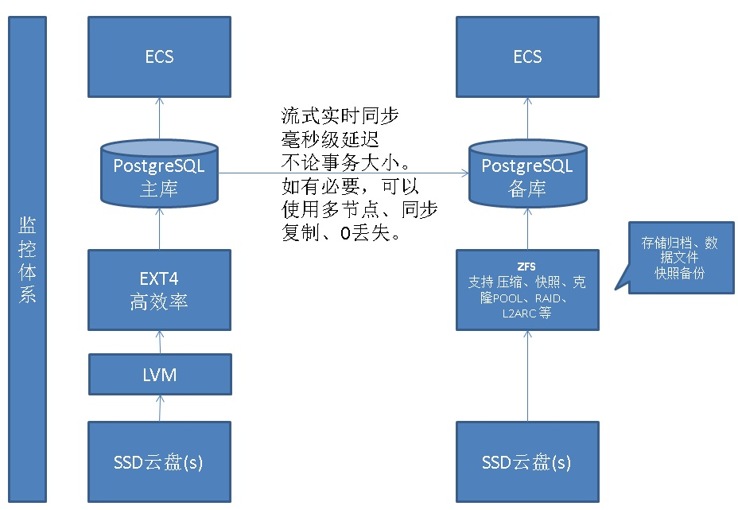

## PostgreSQL 10 on ECS 实施 流复制备库镜像+自动快照备份+自动备份验证+自动清理备份与归档 - 珍藏级     
                    
### 作者                    
digoal                    
                    
### 日期                    
2017-11-29                    
                    
### 标签                    
PostgreSQL , ECS , 阿里云 , 部署 , 物理镜像 , 流复制 , 快照备份 , 备份验证 , 自动清理       
                    
----                    
                    
## 背景         
介绍在阿里云ECS环境中，实现一个非常简单，但是可用性和可靠性满足一般企业要求的PostgreSQL环境。      
      
包括：      
      
1、随ECS自动启动数据库      
      
2、包括一个延迟毫秒以内的物理流复制备库          
      
3、包括自动的秒级快照备份，可以将数据库恢复到过去的任意时间点        
      
4、包括自动备份集有效性验证      
      
5、包括自动清理N天以前的备份集、归档文件      
      
6、监控可结合zabbix, nagios等开源的监控平台      
  
https://github.com/OPMDG/check_pgactivity  这个非常全面，很棒。    
    
7、主库可用性实现  
  
外部监控，发现主机不可用，自动重启ECS。   
  
内部守护进程（实际上PG本身有守护进程，会自动启动），增加一个守护进程，监控PG守护进程存活性，异常情况下，自动启动PG数据库守护进程。    
    
### SLA  
1、可用性  
  
与ECS的可用性对齐。  
  
2、可靠性  
  
与云盘的可靠性对齐。  
  
3、备份效率  
  
秒级快照备份。  
  
4、备份集恢复SLA  
  
可以恢复到过去N天，任意时间点。  
  
恢复效率，时间可控，分钟级。  
  
### 架构  
  
      
## 部署环境介绍      
1、ECS      
      
```      
111.111.111.199 (主)      
      
111.111.111.223 (备)      
```      
      
2、云盘      
      
```      
400 GB      
```      
      
3、软件      
      
```      
OS: CentOS 7.4 x64      
      
PostgreSQL: 10.1      
      
ZFS: 0.7.3      
```      
      
## 部署流程      
### 双机      
1、安装软件      
      
```      
yum -y install coreutils glib2 lrzsz dstat sysstat e4fsprogs \  
xfsprogs ntp readline-devel zlib-devel openssl-devel pam-devel \  
libxml2-devel libxslt-devel python-devel tcl-devel gcc gcc-c++ \  
make smartmontools flex bison perl-devel perl-ExtUtils* \  
openldap-devel jadetex  openjade bzip2      
```      
      
2、修改内核配置      
      
```      
vi /etc/sysctl.conf      
      
# add by digoal.zhou        
fs.aio-max-nr = 1048576        
fs.file-max = 76724600        
          
kernel.sem = 4096 2147483647 2147483646 512000              
kernel.shmall = 107374182              
kernel.shmmax = 274877906944           
kernel.shmmni = 819200                 
        
net.core.netdev_max_backlog = 10000        
net.core.rmem_default = 262144               
# The default setting of the socket receive buffer in bytes.        
net.core.rmem_max = 4194304                  
# The maximum receive socket buffer size in bytes        
net.core.wmem_default = 262144               
# The default setting (in bytes) of the socket send buffer.        
net.core.wmem_max = 4194304                  
# The maximum send socket buffer size in bytes.        
net.core.somaxconn = 4096        
net.ipv4.tcp_max_syn_backlog = 4096        
net.ipv4.tcp_keepalive_intvl = 20        
net.ipv4.tcp_keepalive_probes = 3        
net.ipv4.tcp_keepalive_time = 60        
net.ipv4.tcp_mem = 8388608 12582912 16777216        
net.ipv4.tcp_fin_timeout = 5        
net.ipv4.tcp_synack_retries = 2        
net.ipv4.tcp_syncookies = 1            
net.ipv4.tcp_timestamps = 1            
net.ipv4.tcp_tw_recycle = 0            
net.ipv4.tcp_tw_reuse = 1              
net.ipv4.tcp_max_tw_buckets = 262144        
net.ipv4.tcp_rmem = 8192 87380 16777216        
net.ipv4.tcp_wmem = 8192 65536 16777216        
        
net.nf_conntrack_max = 1200000        
net.netfilter.nf_conntrack_max = 1200000        
        
vm.dirty_background_bytes = 204800000               
        
vm.dirty_expire_centisecs = 3000                     
vm.dirty_ratio = 90                                  
        
vm.dirty_writeback_centisecs = 50                    
        
vm.swappiness = 0        
        
vm.mmap_min_addr = 65536        
vm.overcommit_memory = 0             
        
vm.overcommit_ratio = 90             
vm.swappiness = 0                    
vm.zone_reclaim_mode = 0             
net.ipv4.ip_local_port_range = 40000 65535            
fs.nr_open=20480000        
```      
      
3、修改资源限制      
      
```      
# vi /etc/security/limits.conf      
      
* soft    nofile  1024000        
* hard    nofile  1024000        
* soft    nproc   unlimited        
* hard    nproc   unlimited        
* soft    core    unlimited        
* hard    core    unlimited        
* soft    memlock unlimited        
* hard    memlock unlimited       
```      
      
4、关闭透明大页      
      
```      
chmod +x /etc/rc.d/rc.local        
vi /etc/rc.local        
        
# 追加        
         
if test -f /sys/kernel/mm/transparent_hugepage/enabled; then        
   echo never > /sys/kernel/mm/transparent_hugepage/enabled        
fi        
```      
      
5、分配磁盘      
      
```      
parted -s /dev/vdb mklabel gpt      
parted -s /dev/vdb mkpart primary 1MiB 100%      
```      
      
      
## 主机      
1、创建文件系统      
      
```      
mkfs.ext4 /dev/vdb1 -m 0 -O extent,uninit_bg -E lazy_itable_init=1 -T largefile -L data01      
```      
      
2、加载文件系统      
      
```      
mkdir /data01        
      
vi /etc/fstab        
        
LABEL=data01 /data01     ext4        defaults,noatime,nodiratime,nodelalloc,barrier=0,data=writeback    0 0      
      
      
mount -a       
```      
      
## 备机      
      
1、安装ZFS      
      
```      
yum install -y http://download.zfsonlinux.org/epel/zfs-release.el7_4.noarch.rpm      
      
yum install -y kernel-devel-3.10.0-693.2.2.el7.x86_64           
      
      
yum install -y zfs      
```      
      
2、手动加载zfs模块      
      
```      
/usr/sbin/modprobe zfs      
```      
      
3、创建zpool和zfs for 数据目录，归档目录      
      
```      
zpool create -o ashift=12 zp1 vdb1      
      
zfs set compression=lz4 zp1          
zfs set canmount=off zp1          
zfs set atime=off zp1          
      
      
zfs create -o mountpoint=/data01 zp1/data01           
zfs create -o mountpoint=/pg_arch zp1/pg_arch          
```      
      
4、自动加载zpool      
      
```      
vi /etc/rc.local      
      
/usr/sbin/modprobe zfs      
/usr/sbin/zpool import zp1      
```      
        
## 双机      
1、安装PostgreSQL与EPEL软件 yum 仓库      
      
```      
yum install -y https://dl.fedoraproject.org/pub/epel/epel-release-latest-7.noarch.rpm      
      
yum install -y https://download.postgresql.org/pub/repos/yum/10/redhat/rhel-7-x86_64/pgdg-centos10-10-2.noarch.rpm      
```      
      
2、安装数据库软件与周边软件      
      
```      
yum install -y  postgresql10*  postgis24_10*   pgrouting_10*   \  
osm2pgrouting_10*   plpgsql_check_10*   pgbadger pg_top10* \  
hypopg_10*  citus_10*  cstore_fdw_10*   pg_pathman10* orafce10* \  
pgfincore10* pgbson10*  pgmemcache-10* pldebugger10* plv8_10*  \  
geoip10*  ip4r10*  pg_repack10*  pgsphere10*  plr10*      
```      
      
3、修改环境变量      
      
```      
su - postgres        
        
vi ~/.bash_profile        
        
export PS1="$USER@`/bin/hostname -s`-> "        
export PGPORT=3433        
export PGDATA=/data01/pg_root$PGPORT        
export LANG=en_US.utf8        
export PGHOME=/usr/pgsql-10        
export LD_LIBRARY_PATH=$PGHOME/lib:/lib64:/usr/lib64:/usr/local/lib64:/lib:/usr/lib:/usr/local/lib:$LD_LIBRARY_PATH        
export DATE=`date +"%Y%m%d%H%M"`        
export PATH=$PGHOME/bin:$PATH:.        
export MANPATH=$PGHOME/share/man:$MANPATH        
export PGHOST=$PGDATA        
export PGUSER=postgres        
export PGDATABASE=postgres        
alias rm='rm -i'        
alias ll='ls -lh'        
unalias vi        
```      
      
## 主机      
1、创建数据目录，修改权限      
      
```      
cd /data01      
mkdir pg_root3433      
mkdir -p pg_arch/pg3433      
      
chown postgres:postgres /data01/*      
ln -s /data01/pg_arch /pg_arch      
```      
      
      
      
## 备机      
1、创建数据目录，修改权限      
      
```      
cd /data01      
mkdir pg_root3433      
chown postgres:postgres /data01/*      
      
cd /pg_arch      
mkdir pg3433      
chown postgres:postgres /pg_arch/pg3433      
```      
      
      
## 主机      
1、初始化数据库集群      
      
```      
su - postgres      
initdb -D $PGDATA -U postgres --lc-collate=C --lc-ctype=en_US.utf8 -E UTF8       
```      
      
2、修改数据库参数配置      
      
```      
cd $PGDATA      
      
vi postgresql.auto.conf      
      
listen_addresses = '0.0.0.0'        
port = 3433  # 监听端口        
max_connections = 2000  # 最大允许的连接数        
superuser_reserved_connections = 10        
unix_socket_directories = '.'        
unix_socket_permissions = 0700        
tcp_keepalives_idle = 60        
tcp_keepalives_interval = 60        
tcp_keepalives_count = 10        
shared_buffers = 16GB                  # 共享内存，建议设置为系统内存的1/4  .        
#  vm.nr_hugepages = 102352    
#  建议shared buffer设置超过64GB时 使用大页，页大小 /proc/meminfo Hugepagesize
maintenance_work_mem = 512MB           # 系统内存超过32G时，建议设置为1GB。超过64GB时，建议设置为2GB。超过128GB时，建议设置为4GB。        
work_mem = 64MB                        # 1/4 主机内存 / 256 (假设256个并发同时使用work_mem)      
wal_buffers = 128MB                    # min( 2047MB, shared_buffers/32 )       
dynamic_shared_memory_type = posix        
vacuum_cost_delay = 0        
bgwriter_delay = 10ms        
bgwriter_lru_maxpages = 500        
bgwriter_lru_multiplier = 5.0        
effective_io_concurrency = 0        
max_worker_processes = 128                       
max_parallel_workers_per_gather = 16        # 建议设置为主机CPU核数的一半。        
max_parallel_workers = 16                   # 看业务AP和TP的比例，以及AP TP时间交错分配。实际情况调整。例如 主机CPU cores-2      
wal_level = replica        
fsync = on        
synchronous_commit = off        
full_page_writes = on                  # 支持原子写超过BLOCK_SIZE的块设备，在对齐后可以关闭。或者支持cow的文件系统可以关闭。      
wal_writer_delay = 10ms        
wal_writer_flush_after = 1MB        
checkpoint_timeout = 30min        
max_wal_size = 32GB                    # shared_buffers*2       
min_wal_size = 8GB                     # max_wal_size/4       
archive_mode = always        
archive_command = '/bin/date'        
hot_standby = on      
max_wal_senders = 10        
max_replication_slots = 10        
wal_receiver_status_interval = 1s        
max_logical_replication_workers = 4        
max_sync_workers_per_subscription = 2        
random_page_cost = 1.2        
parallel_tuple_cost = 0.1        
parallel_setup_cost = 1000.0        
min_parallel_table_scan_size = 8MB        
min_parallel_index_scan_size = 512kB        
effective_cache_size = 32GB                 # 建议设置为主机内存的5/8。           
log_destination = 'csvlog'        
logging_collector = on        
log_directory = 'log'        
log_filename = 'postgresql-%a.log'        
log_truncate_on_rotation = on        
log_rotation_age = 1d        
log_rotation_size = 0        
log_min_duration_statement = 5s        
log_checkpoints = on        
log_connections = on                            # 如果是短连接，并且不需要审计连接日志的话，建议OFF。      
log_disconnections = on                         # 如果是短连接，并且不需要审计连接日志的话，建议OFF。      
log_error_verbosity = verbose        
log_line_prefix = '%m [%p] '        
log_lock_waits = on        
log_statement = 'ddl'        
log_timezone = 'PRC'        
log_autovacuum_min_duration = 0         
autovacuum_max_workers = 5        
autovacuum_vacuum_scale_factor = 0.1        
autovacuum_analyze_scale_factor = 0.05        
autovacuum_freeze_max_age = 1000000000        
autovacuum_multixact_freeze_max_age = 1200000000        
autovacuum_vacuum_cost_delay = 0        
statement_timeout = 0                                # 单位ms, s, min, h, d.  表示语句的超时时间，0表示不限制。        
lock_timeout = 0                                     # 单位ms, s, min, h, d.  表示锁等待的超时时间，0表示不限制。        
idle_in_transaction_session_timeout = 2h             # 单位ms, s, min, h, d.  表示空闲事务的超时时间，0表示不限制。        
vacuum_freeze_min_age = 50000000        
vacuum_freeze_table_age = 800000000        
vacuum_multixact_freeze_min_age = 50000000        
vacuum_multixact_freeze_table_age = 800000000        
datestyle = 'iso, ymd'        
timezone = 'PRC'        
lc_messages = 'en_US.UTF8'        
lc_monetary = 'en_US.UTF8'        
lc_numeric = 'en_US.UTF8'        
lc_time = 'en_US.UTF8'        
default_text_search_config = 'pg_catalog.simple'        
shared_preload_libraries='pg_stat_statements,pg_pathman'        
```      
      
2、修改备库将用到的自动流复制参数文件      
      
```      
cp $PGHOME/share/recovery.conf.sample ./      
mv recovery.conf.sample recovery.done      
      
vi recovery.done      
      
recovery_target_timeline = 'latest'      
standby_mode = on      
primary_conninfo = 'host=111.111.111.223 port=3433 user=rep password=xxxxxxxxxx'      
restore_command = 'BASEDIR="/pg_arch/pg3433" ; find $BASEDIR -name %f -exec cp {} %p \\;'       
```      
      
3、修改数据库认证权限访问控制ACL, pg_hba.conf      
      
```      
vi pg_hba.conf      
host all all 0.0.0.0/0 md5      
host replication rep 0.0.0.0/0 md5      
```      
      
4、启动数据库      
      
```      
pg_ctl start      
```      
      
5、创建流复制，数据库角色      
      
```      
psql -n      
      
create role rep replication login encrypted password 'xxxxxxxxxx';      
```      
      
## 备机      
1、创建备库      
      
```      
su - postgres      
pg_basebackup -D $PGDATA -F p -h 111.111.111.199 -p 3433 -U rep       
```      
      
2、修改数据库配置      
      
      
```      
cd $PGDATA      
vi postgresql.auto.conf      
      
archive_command = 'DT="/pg_arch/pg3433/`date +%F`" ; test ! -d $DT && mkdir -p $DT ; test ! -f $DT/%f && cp %p $DT/%f'      
```      
      
3、配置备库的自动同步参数文件      
      
```      
mv recovery.done recovery.conf      
      
vi recovery.conf      
      
primary_conninfo = 'host=111.111.111.199 port=3433 user=rep password=xxxxxxxxxx'      
```      
      
      
5、修改数据目录权限      
      
```      
su - root      
chmod 700 /data01/pg_root3433      
```      
      
## 双机      
1、系统启动时，自动启动数据库      
      
```      
vi /etc/rc.local        
        
# 追加        
        
su - postgres -c "pg_ctl start"        
```      
      
      
2、重启ECS验证      
      
```      
reboot        
        
su - postgres        
        
psql        
        
postgres=# show max_connections ;        
 max_connections         
-----------------        
 2000        
(1 row)        
```      
      
      
## 备机      
1、配置自动备份（快照备份）      
      
```      
su - root      
      
mkdir script      
      
vi /root/script/zfs_snap.sh          
      
#!/bin/bash         
      
date +%F%T      
# 自动创建、清理快照      
/sbin/zfs snapshot zp1/data01@`date +%Y%m%d`          
/sbin/zfs destroy zp1/data01@`date +%Y%m%d -d '-10 day'`          
/sbin/zfs list -t snapshot       
      
# 自动清理归档      
rm -rf /pg_arch/pg3433/`date +%F -d '-11 day'`      
      
date +%F%T      
```      
      
2、设置脚本权限      
      
```      
chmod 500 /root/script/zfs_snap.sh          
```      
      
3、设置自动备份任务，每天备份一次      
      
```      
# crontab -e          
1 8 * * * /root/script/zfs_snap.sh >> /root/zfs_snap.log 2>&1       
```      
      
## 自动恢复验证      
### 备机      
1、创建备份验证用到的配置文件，修改端口号，关闭归档。      
      
```      
su - root      
      
mkdir /root/test_recovery      
      
vi /root/test_recovery/postgresql.auto.conf       
      
# Do not edit this file manually!      
# It will be overwritten by the ALTER SYSTEM command.      
listen_addresses = '0.0.0.0'        
port = 11111  # 监听端口        
max_connections = 2000  # 最大允许的连接数        
superuser_reserved_connections = 10        
unix_socket_directories = '.'        
unix_socket_permissions = 0700        
tcp_keepalives_idle = 60        
tcp_keepalives_interval = 60        
tcp_keepalives_count = 10        
shared_buffers = 16GB                  # 共享内存，建议设置为系统内存的1/4  .        
maintenance_work_mem = 512MB           # 系统内存超过32G时，建议设置为1GB。超过64GB时，建议设置为2GB。超过128GB时，建议设置为4GB。        
work_mem = 64MB                        # 1/4 主机内存 / 256 (假设256个并发同时使用work_mem)      
wal_buffers = 128MB                    # min( 2047MB, shared_buffers/32 )       
dynamic_shared_memory_type = posix        
vacuum_cost_delay = 0        
bgwriter_delay = 10ms        
bgwriter_lru_maxpages = 500        
bgwriter_lru_multiplier = 5.0        
effective_io_concurrency = 0        
max_worker_processes = 128                       
max_parallel_workers_per_gather = 16        # 建议设置为主机CPU核数的一半。        
max_parallel_workers = 16                   # 看业务AP和TP的比例，以及AP TP时间交错分配。实际情况调整。例如 主机CPU cores-2      
wal_level = replica        
fsync = on        
synchronous_commit = off        
full_page_writes = on                  # 支持原子写超过BLOCK_SIZE的块设备，在对齐后可以关闭。或者支持cow的文件系统可以关闭。      
wal_writer_delay = 10ms        
wal_writer_flush_after = 1MB        
checkpoint_timeout = 30min        
max_wal_size = 32GB                    # shared_buffers*2       
min_wal_size = 8GB                     # max_wal_size/4       
archive_mode = off       
archive_command = 'DT="/pg_arch/pg3433/`date +%F`" ; test ! -d $DT && mkdir -p $DT ; test ! -f $DT/%f && cp %p $DT/%f'        
hot_standby = on      
max_wal_senders = 10        
max_replication_slots = 10        
wal_receiver_status_interval = 1s        
max_logical_replication_workers = 4        
max_sync_workers_per_subscription = 2        
random_page_cost = 1.2        
parallel_tuple_cost = 0.1        
parallel_setup_cost = 1000.0        
min_parallel_table_scan_size = 8MB        
min_parallel_index_scan_size = 512kB        
effective_cache_size = 32GB                 # 建议设置为主机内存的5/8。           
log_destination = 'csvlog'        
logging_collector = on        
log_directory = 'log'        
log_filename = 'postgresql-%a.log'        
log_truncate_on_rotation = on        
log_rotation_age = 1d        
log_rotation_size = 0        
log_min_duration_statement = 5s        
log_checkpoints = on        
log_connections = on                            # 如果是短连接，并且不需要审计连接日志的话，建议OFF。      
log_disconnections = on                         # 如果是短连接，并且不需要审计连接日志的话，建议OFF。      
log_error_verbosity = verbose        
log_line_prefix = '%m [%p] '        
log_lock_waits = on        
log_statement = 'ddl'        
log_timezone = 'PRC'        
log_autovacuum_min_duration = 0         
autovacuum_max_workers = 5        
autovacuum_vacuum_scale_factor = 0.1        
autovacuum_analyze_scale_factor = 0.05        
autovacuum_freeze_max_age = 1000000000        
autovacuum_multixact_freeze_max_age = 1200000000        
autovacuum_vacuum_cost_delay = 0        
statement_timeout = 0                                # 单位ms, s, min, h, d.  表示语句的超时时间，0表示不限制。        
lock_timeout = 0                                     # 单位ms, s, min, h, d.  表示锁等待的超时时间，0表示不限制。        
idle_in_transaction_session_timeout = 2h             # 单位ms, s, min, h, d.  表示空闲事务的超时时间，0表示不限制。        
vacuum_freeze_min_age = 50000000        
vacuum_freeze_table_age = 800000000        
vacuum_multixact_freeze_min_age = 50000000        
vacuum_multixact_freeze_table_age = 800000000        
datestyle = 'iso, ymd'        
timezone = 'PRC'        
lc_messages = 'en_US.UTF8'        
lc_monetary = 'en_US.UTF8'        
lc_numeric = 'en_US.UTF8'        
lc_time = 'en_US.UTF8'        
default_text_search_config = 'pg_catalog.simple'        
shared_preload_libraries='pg_stat_statements,pg_pathman'       
```      
      
2、创建自动恢复脚本，根据昨日快照克隆，并使用克隆恢复，判断是否可正常恢复      
      
```      
vi /root/test_recovery/recovery_test.sh           
      
#!/bin/bash          
           
date +%F%T            
          
. /var/lib/pgsql/.bash_profile         
          
DATE=`date -d '-1 day' +%Y%m%d`          
      
zfs clone -o mountpoint=/test_recovery zp1/data01@$DATE zp1/test_recovery          
          
rm -f /test_recovery/pg_root3433/postgresql.auto.conf           
rm -f /test_recovery/pg_root3433/postmaster.pid          
rm -f /test_recovery/pg_root3433/pg_wal/*          
cp -p /root/test_recovery/postgresql.auto.conf /test_recovery/pg_root3433/postgresql.auto.conf          
          
su - postgres -c "pg_ctl start -D /test_recovery/pg_root3433"          
          
for ((i=1;i<180;i++)) do          
  echo $i          
  sleep 20          
  psql -h 127.0.0.1 -p 11111 postgres postgres -c "select now(),* from pg_database;"          
  ret=$?          
  if [ $ret -eq 0 ]; then          
    break          
  fi          
done          
          
su - postgres -c "pg_ctl stop -w -t 6000 -m immediate -D /test_recovery/pg_root3433"          
sleep 60          
          
zfs destroy zp1/test_recovery        
      
date +%F%T         
```      
      
3、配置脚本权限      
      
```      
chmod 500 /root/test_recovery/recovery_test.sh       
```      
      
4、测试自动备份集恢复脚本      
      
```      
/root/test_recovery/recovery_test.sh       
      
2017-11-2923:23:15      
/var/lib/pgsql/.bash_profile: line 24: unalias: vi: not found      
rm: cannot remove ‘/test_recovery/pg_root3433/pg_wal/archive_status’: Is a directory      
/var/lib/pgsql/.bash_profile: line 24: unalias: vi: not found      
waiting for server to start....2017-11-29 23:23:15.879 CST [11051] LOG:  00000: listening on IPv4 address "0.0.0.0", port 11111      
2017-11-29 23:23:15.879 CST [11051] LOCATION:  StreamServerPort, pqcomm.c:593      
2017-11-29 23:23:15.898 CST [11051] LOG:  00000: listening on Unix socket "./.s.PGSQL.11111"      
2017-11-29 23:23:15.898 CST [11051] LOCATION:  StreamServerPort, pqcomm.c:587      
2017-11-29 23:23:16.422 CST [11051] LOG:  00000: redirecting log output to logging collector process      
2017-11-29 23:23:16.422 CST [11051] HINT:  Future log output will appear in directory "log".      
2017-11-29 23:23:16.422 CST [11051] LOCATION:  SysLogger_Start, syslogger.c:634      
 done      
server started      
1      
              now              |  datname  | datdba | encoding | datcollate |  datctype  | datistemplate | datallowconn | datconnlimit | datlastsysoid | datfrozenxid | datminmxid | dattablespace |               datacl                      
-------------------------------+-----------+--------+----------+------------+------------+---------------+--------------+--------------+---------------+--------------+------------+---------------+-------------------------------------      
 2017-11-29 23:23:36.572934+08 | postgres  |     10 |        6 | en_US.UTF8 | en_US.UTF8 | f             | t            |           -1 |         13805 |          548 |          1 |          1663 |       
 2017-11-29 23:23:36.572934+08 | template1 |     10 |        6 | en_US.UTF8 | en_US.UTF8 | t             | t            |           -1 |         13805 |          548 |          1 |          1663 | {=c/postgres,postgres=CTc/postgres}      
 2017-11-29 23:23:36.572934+08 | template0 |     10 |        6 | en_US.UTF8 | en_US.UTF8 | t             | f            |           -1 |         13805 |          548 |          1 |          1663 | {=c/postgres,postgres=CTc/postgres}      
(3 rows)      
      
/var/lib/pgsql/.bash_profile: line 24: unalias: vi: not found      
waiting for server to shut down.... done      
server stopped      
```      
      
## 其他      
1、查看已有备份集      
      
```      
# zfs list -t snapshot      
NAME                  USED  AVAIL  REFER  MOUNTPOINT      
zp1/data01@20171129     0B      -  12.6M  -      
zp1/data01@20171128     0B      -  12.6M  -      
```      
      
2、主动删除备份集      
      
```      
# zfs destroy zp1/data01@20171128      
```      
      
3、根据已有快照克隆zfs      
      
```      
# zfs clone -o mountpoint=/test_recovery zp1/data01@20171128 zp1/test_recovery       
```      
      
4、删除克隆ZFS      
      
```      
# zfs destroy zp1/test_recovery       
```      
        
5、检查主备时间延迟      
      
```      
postgres=# select * from pg_stat_replication ;      
-[ RECORD 1 ]----+------------------------------      
pid              | 11697      
usesysid         | 16384      
usename          | rep      
application_name | walreceiver      
client_addr      | 111.111.111.223      
client_hostname  |       
client_port      | 53622      
backend_start    | 2017-11-29 22:46:17.806483+08      
backend_xmin     |       
state            | streaming      
sent_lsn         | 0/E06B9A30      
write_lsn        | 0/E06B9A30      
flush_lsn        | 0/E06B9A30      
replay_lsn       | 0/E06B9A30      
write_lag        |       
flush_lag        |       
replay_lag       |       
sync_priority    | 0      
sync_state       | async      
```      
      
6、检查主备LSN延迟      
      
```      
postgres=# select *, pg_size_pretty(pg_wal_lsn_diff(pg_current_wal_insert_lsn(), sent_lsn)) as sent_delay, pg_size_pretty(pg_wal_lsn_diff(pg_current_wal_insert_lsn(), replay_lsn)) as replay_delay from pg_stat_replication ;      
-[ RECORD 1 ]----+------------------------------      
pid              | 11697      
usesysid         | 16384      
usename          | rep      
application_name | walreceiver      
client_addr      | 111.111.111.223      
client_hostname  |       
client_port      | 53622      
backend_start    | 2017-11-29 22:46:17.806483+08      
backend_xmin     |       
state            | streaming      
sent_lsn         | 1/39D5C000      
write_lsn        | 1/39000000      
flush_lsn        | 1/39000000      
replay_lsn       | 1/37A58718      
write_lag        | 00:00:00.192577      
flush_lag        | 00:00:00.192577      
replay_lag       | 00:00:00.502927      
sync_priority    | 0      
sync_state       | async      
sent_delay       | 9650 kB      
replay_delay     | 44 MB      
```      
      
7、创建数据库    
    
```    
CREATE DATABASE name    
    [ [ WITH ] [ OWNER [=] user_name ]    
           [ TEMPLATE [=] template ]    
           [ ENCODING [=] encoding ]    
           [ LC_COLLATE [=] lc_collate ]    
           [ LC_CTYPE [=] lc_ctype ]    
           [ TABLESPACE [=] tablespace_name ]    
           [ ALLOW_CONNECTIONS [=] allowconn ]    
           [ CONNECTION LIMIT [=] connlimit ]    
           [ IS_TEMPLATE [=] istemplate ] ]    
```    
    
8、创建数据库模板    
    
```    
Command:     ALTER DATABASE    
Description: change a database    
Syntax:    
ALTER DATABASE name [ [ WITH ] option [ ... ] ]    
    
where option can be:    
    
    ALLOW_CONNECTIONS allowconn    
    CONNECTION LIMIT connlimit    
    IS_TEMPLATE istemplate    
    
ALTER DATABASE name RENAME TO new_name    
    
ALTER DATABASE name OWNER TO { new_owner | CURRENT_USER | SESSION_USER }    
    
ALTER DATABASE name SET TABLESPACE new_tablespace    
    
ALTER DATABASE name SET configuration_parameter { TO | = } { value | DEFAULT }    
ALTER DATABASE name SET configuration_parameter FROM CURRENT    
ALTER DATABASE name RESET configuration_parameter    
ALTER DATABASE name RESET ALL    
    
postgres=# alter database postgres is_template true;    
ALTER DATABASE    
```    
    
9、从模板克隆数据库    
    
```    
create database newdb with template template_db;    
```    
    
8、创建用户    
    
```    
Command:     CREATE ROLE    
Description: define a new database role    
Syntax:    
CREATE ROLE name [ [ WITH ] option [ ... ] ]    
    
where option can be:    
    
      SUPERUSER | NOSUPERUSER    
    | CREATEDB | NOCREATEDB    
    | CREATEROLE | NOCREATEROLE    
    | INHERIT | NOINHERIT    
    | LOGIN | NOLOGIN    
    | REPLICATION | NOREPLICATION    
    | BYPASSRLS | NOBYPASSRLS    
    | CONNECTION LIMIT connlimit    
    | [ ENCRYPTED ] PASSWORD 'password'    
    | VALID UNTIL 'timestamp'    
    | IN ROLE role_name [, ...]    
    | IN GROUP role_name [, ...]    
    | ROLE role_name [, ...]    
    | ADMIN role_name [, ...]    
    | USER role_name [, ...]    
    | SYSID uid    
```    
    
9、创建schema    
    
```    
Command:     CREATE SCHEMA    
Description: define a new schema    
Syntax:    
CREATE SCHEMA schema_name [ AUTHORIZATION role_specification ] [ schema_element [ ... ] ]    
CREATE SCHEMA AUTHORIZATION role_specification [ schema_element [ ... ] ]    
CREATE SCHEMA IF NOT EXISTS schema_name [ AUTHORIZATION role_specification ]    
CREATE SCHEMA IF NOT EXISTS AUTHORIZATION role_specification    
    
where role_specification can be:    
    
    user_name    
  | CURRENT_USER    
  | SESSION_USER    
```    
    
10、配置用户权限    
    
```    
Command:     GRANT    
Description: define access privileges    
Syntax:    
GRANT { { SELECT | INSERT | UPDATE | DELETE | TRUNCATE | REFERENCES | TRIGGER }    
    [, ...] | ALL [ PRIVILEGES ] }    
    ON { [ TABLE ] table_name [, ...]    
         | ALL TABLES IN SCHEMA schema_name [, ...] }    
    TO role_specification [, ...] [ WITH GRANT OPTION ]    
    
......    
```    
    
11、配置库级别参数    
    
```    
Command:     ALTER DATABASE    
Description: change a database    
Syntax:    
ALTER DATABASE name [ [ WITH ] option [ ... ] ]    
    
where option can be:    
    
    ALLOW_CONNECTIONS allowconn    
    CONNECTION LIMIT connlimit    
    IS_TEMPLATE istemplate    
    
ALTER DATABASE name RENAME TO new_name    
    
ALTER DATABASE name OWNER TO { new_owner | CURRENT_USER | SESSION_USER }    
    
ALTER DATABASE name SET TABLESPACE new_tablespace    
    
ALTER DATABASE name SET configuration_parameter { TO | = } { value | DEFAULT }    
ALTER DATABASE name SET configuration_parameter FROM CURRENT    
ALTER DATABASE name RESET configuration_parameter    
ALTER DATABASE name RESET ALL    
```    
    
12、配置用户级别参数    
    
```    
Command:     ALTER ROLE    
Description: change a database role    
Syntax:    
ALTER ROLE role_specification [ WITH ] option [ ... ]    
    
where option can be:    
    
      SUPERUSER | NOSUPERUSER    
    | CREATEDB | NOCREATEDB    
    | CREATEROLE | NOCREATEROLE    
    | INHERIT | NOINHERIT    
    | LOGIN | NOLOGIN    
    | REPLICATION | NOREPLICATION    
    | BYPASSRLS | NOBYPASSRLS    
    | CONNECTION LIMIT connlimit    
    | [ ENCRYPTED ] PASSWORD 'password'    
    | VALID UNTIL 'timestamp'    
    
ALTER ROLE name RENAME TO new_name    
    
ALTER ROLE { role_specification | ALL } [ IN DATABASE database_name ] SET configuration_parameter { TO | = } { value | DEFAULT }    
ALTER ROLE { role_specification | ALL } [ IN DATABASE database_name ] SET configuration_parameter FROM CURRENT    
ALTER ROLE { role_specification | ALL } [ IN DATABASE database_name ] RESET configuration_parameter    
ALTER ROLE { role_specification | ALL } [ IN DATABASE database_name ] RESET ALL    
    
where role_specification can be:    
    
    role_name    
  | CURRENT_USER    
  | SESSION_USER    
```    
    
13、配置函数级别参数    
    
```    
Command:     ALTER FUNCTION    
Description: change the definition of a function    
Syntax:    
ALTER FUNCTION name [ ( [ [ argmode ] [ argname ] argtype [, ...] ] ) ]    
    action [ ... ] [ RESTRICT ]    
ALTER FUNCTION name [ ( [ [ argmode ] [ argname ] argtype [, ...] ] ) ]    
    RENAME TO new_name    
ALTER FUNCTION name [ ( [ [ argmode ] [ argname ] argtype [, ...] ] ) ]    
    OWNER TO { new_owner | CURRENT_USER | SESSION_USER }    
ALTER FUNCTION name [ ( [ [ argmode ] [ argname ] argtype [, ...] ] ) ]    
    SET SCHEMA new_schema    
ALTER FUNCTION name [ ( [ [ argmode ] [ argname ] argtype [, ...] ] ) ]    
    DEPENDS ON EXTENSION extension_name    
    
where action is one of:    
    
    CALLED ON NULL INPUT | RETURNS NULL ON NULL INPUT | STRICT    
    IMMUTABLE | STABLE | VOLATILE | [ NOT ] LEAKPROOF    
    [ EXTERNAL ] SECURITY INVOKER | [ EXTERNAL ] SECURITY DEFINER    
    PARALLEL { UNSAFE | RESTRICTED | SAFE }    
    COST execution_cost    
    ROWS result_rows    
    SET configuration_parameter { TO | = } { value | DEFAULT }    
    SET configuration_parameter FROM CURRENT    
    RESET configuration_parameter    
    RESET ALL    
```    
    
14、配置表级别参数    
    
```    
Command:     ALTER TABLE    
Description: change the definition of a table    
Syntax:    
ALTER TABLE [ IF EXISTS ] [ ONLY ] name [ * ]    
    action [, ... ]    
ALTER TABLE [ IF EXISTS ] [ ONLY ] name [ * ]    
    RENAME [ COLUMN ] column_name TO new_column_name    
ALTER TABLE [ IF EXISTS ] [ ONLY ] name [ * ]    
    RENAME CONSTRAINT constraint_name TO new_constraint_name    
ALTER TABLE [ IF EXISTS ] name    
    RENAME TO new_name    
ALTER TABLE [ IF EXISTS ] name    
    SET SCHEMA new_schema    
ALTER TABLE ALL IN TABLESPACE name [ OWNED BY role_name [, ... ] ]    
    SET TABLESPACE new_tablespace [ NOWAIT ]    
ALTER TABLE [ IF EXISTS ] name    
    ATTACH PARTITION partition_name FOR VALUES partition_bound_spec    
ALTER TABLE [ IF EXISTS ] name    
    DETACH PARTITION partition_name    
    
where action is one of:    
    
    ADD [ COLUMN ] [ IF NOT EXISTS ] column_name data_type [ COLLATE collation ] [ column_constraint [ ... ] ]    
    DROP [ COLUMN ] [ IF EXISTS ] column_name [ RESTRICT | CASCADE ]    
    ALTER [ COLUMN ] column_name [ SET DATA ] TYPE data_type [ COLLATE collation ] [ USING expression ]    
    ALTER [ COLUMN ] column_name SET DEFAULT expression    
    ALTER [ COLUMN ] column_name DROP DEFAULT    
    ALTER [ COLUMN ] column_name { SET | DROP } NOT NULL    
    ALTER [ COLUMN ] column_name ADD GENERATED { ALWAYS | BY DEFAULT } AS IDENTITY [ ( sequence_options ) ]    
    ALTER [ COLUMN ] column_name { SET GENERATED { ALWAYS | BY DEFAULT } | SET sequence_option | RESTART [ [ WITH ] restart ] } [...]    
    ALTER [ COLUMN ] column_name DROP IDENTITY [ IF EXISTS ]    
    ALTER [ COLUMN ] column_name SET STATISTICS integer    
    ALTER [ COLUMN ] column_name SET ( attribute_option = value [, ... ] )    
    ALTER [ COLUMN ] column_name RESET ( attribute_option [, ... ] )    
    ALTER [ COLUMN ] column_name SET STORAGE { PLAIN | EXTERNAL | EXTENDED | MAIN }    
    ADD table_constraint [ NOT VALID ]    
    ADD table_constraint_using_index    
    ALTER CONSTRAINT constraint_name [ DEFERRABLE | NOT DEFERRABLE ] [ INITIALLY DEFERRED | INITIALLY IMMEDIATE ]    
    VALIDATE CONSTRAINT constraint_name    
    DROP CONSTRAINT [ IF EXISTS ]  constraint_name [ RESTRICT | CASCADE ]    
    DISABLE TRIGGER [ trigger_name | ALL | USER ]    
    ENABLE TRIGGER [ trigger_name | ALL | USER ]    
    ENABLE REPLICA TRIGGER trigger_name    
    ENABLE ALWAYS TRIGGER trigger_name    
    DISABLE RULE rewrite_rule_name    
    ENABLE RULE rewrite_rule_name    
    ENABLE REPLICA RULE rewrite_rule_name    
    ENABLE ALWAYS RULE rewrite_rule_name    
    DISABLE ROW LEVEL SECURITY    
    ENABLE ROW LEVEL SECURITY    
    FORCE ROW LEVEL SECURITY    
    NO FORCE ROW LEVEL SECURITY    
    CLUSTER ON index_name    
    SET WITHOUT CLUSTER    
    SET WITH OIDS    
    SET WITHOUT OIDS    
    SET TABLESPACE new_tablespace    
    SET { LOGGED | UNLOGGED }    
    SET ( storage_parameter = value [, ... ] )    
    RESET ( storage_parameter [, ... ] )    
    INHERIT parent_table    
    NO INHERIT parent_table    
    OF type_name    
    NOT OF    
    OWNER TO { new_owner | CURRENT_USER | SESSION_USER }    
    REPLICA IDENTITY { DEFAULT | USING INDEX index_name | FULL | NOTHING }    
    
and table_constraint_using_index is:    
    
    [ CONSTRAINT constraint_name ]    
    { UNIQUE | PRIMARY KEY } USING INDEX index_name    
    [ DEFERRABLE | NOT DEFERRABLE ] [ INITIALLY DEFERRED | INITIALLY IMMEDIATE ]    
```    
    
15、配置认证ACL    
    
```    
vi $PGDATA/pg_hba.conf    
    
# local      DATABASE  USER  METHOD  [OPTIONS]    
# host       DATABASE  USER  ADDRESS  METHOD  [OPTIONS]    
# hostssl    DATABASE  USER  ADDRESS  METHOD  [OPTIONS]    
# hostnossl  DATABASE  USER  ADDRESS  METHOD  [OPTIONS]    
# TYPE  DATABASE        USER            ADDRESS                 METHOD    
    
# "local" is for Unix domain socket connections only    
local   all             all                                     trust    
# IPv4 local connections:    
host    all             all             127.0.0.1/32            trust    
# IPv6 local connections:    
host    all             all             ::1/128                 trust    
# Allow replication connections from localhost, by a user with the    
# replication privilege.    
local   replication     all                                     trust    
host    replication     all             127.0.0.1/32            trust    
host    replication     all             ::1/128                 trust    
host all super_user 0.0.0.0/0 reject    
host all all 0.0.0.0/0 md5    
    
pg_ctl reload    
```    
    
16、使用psql帮助    
    
```    
postgres=# \h SQL命令,支持TAB补齐    
```    
    
17、使用psql本地简化命令    
    
```    
postgres=# \?    
General    
  \copyright             show PostgreSQL usage and distribution terms    
  \crosstabview [COLUMNS] execute query and display results in crosstab    
  \errverbose            show most recent error message at maximum verbosity    
  \g [FILE] or ;         execute query (and send results to file or |pipe)    
  \gexec                 execute query, then execute each value in its result    
  \gset [PREFIX]         execute query and store results in psql variables    
  \gx [FILE]             as \g, but forces expanded output mode    
  \q                     quit psql    
  \watch [SEC]           execute query every SEC seconds    
    
Help    
  \? [commands]          show help on backslash commands    
  \? options             show help on psql command-line options    
  \? variables           show help on special variables    
  \h [NAME]              help on syntax of SQL commands, * for all commands    
    
Query Buffer    
  \e [FILE] [LINE]       edit the query buffer (or file) with external editor    
  \ef [FUNCNAME [LINE]]  edit function definition with external editor    
  \ev [VIEWNAME [LINE]]  edit view definition with external editor    
  \p                     show the contents of the query buffer    
  \r                     reset (clear) the query buffer    
  \s [FILE]              display history or save it to file    
  \w FILE                write query buffer to file    
    
Input/Output    
  \copy ...              perform SQL COPY with data stream to the client host    
  \echo [STRING]         write string to standard output    
  \i FILE                execute commands from file    
  \ir FILE               as \i, but relative to location of current script    
  \o [FILE]              send all query results to file or |pipe    
  \qecho [STRING]        write string to query output stream (see \o)    
    
Conditional    
  \if EXPR               begin conditional block    
  \elif EXPR             alternative within current conditional block    
  \else                  final alternative within current conditional block    
  \endif                 end conditional block    
    
Informational    
  (options: S = show system objects, + = additional detail)    
  \d[S+]                 list tables, views, and sequences    
  \d[S+]  NAME           describe table, view, sequence, or index    
  \da[S]  [PATTERN]      list aggregates    
  \dA[+]  [PATTERN]      list access methods    
  \db[+]  [PATTERN]      list tablespaces    
  \dc[S+] [PATTERN]      list conversions    
  \dC[+]  [PATTERN]      list casts    
  \dd[S]  [PATTERN]      show object descriptions not displayed elsewhere    
  \dD[S+] [PATTERN]      list domains    
  \ddp    [PATTERN]      list default privileges    
  \dE[S+] [PATTERN]      list foreign tables    
  \det[+] [PATTERN]      list foreign tables    
  \des[+] [PATTERN]      list foreign servers    
  \deu[+] [PATTERN]      list user mappings    
  \dew[+] [PATTERN]      list foreign-data wrappers    
  \df[antw][S+] [PATRN]  list [only agg/normal/trigger/window] functions    
  \dF[+]  [PATTERN]      list text search configurations    
  \dFd[+] [PATTERN]      list text search dictionaries    
  \dFp[+] [PATTERN]      list text search parsers    
  \dFt[+] [PATTERN]      list text search templates    
  \dg[S+] [PATTERN]      list roles    
  \di[S+] [PATTERN]      list indexes    
  \dl                    list large objects, same as \lo_list    
  \dL[S+] [PATTERN]      list procedural languages    
  \dm[S+] [PATTERN]      list materialized views    
  \dn[S+] [PATTERN]      list schemas    
  \do[S]  [PATTERN]      list operators    
  \dO[S+] [PATTERN]      list collations    
  \dp     [PATTERN]      list table, view, and sequence access privileges    
  \drds [PATRN1 [PATRN2]] list per-database role settings    
  \dRp[+] [PATTERN]      list replication publications    
  \dRs[+] [PATTERN]      list replication subscriptions    
  \ds[S+] [PATTERN]      list sequences    
  \dt[S+] [PATTERN]      list tables    
  \dT[S+] [PATTERN]      list data types    
  \du[S+] [PATTERN]      list roles    
  \dv[S+] [PATTERN]      list views    
  \dx[+]  [PATTERN]      list extensions    
  \dy     [PATTERN]      list event triggers    
  \l[+]   [PATTERN]      list databases    
  \sf[+]  FUNCNAME       show a function's definition    
  \sv[+]  VIEWNAME       show a view's definition    
  \z      [PATTERN]      same as \dp    
    
Formatting    
  \a                     toggle between unaligned and aligned output mode    
  \C [STRING]            set table title, or unset if none    
  \f [STRING]            show or set field separator for unaligned query output    
  \H                     toggle HTML output mode (currently off)    
  \pset [NAME [VALUE]]   set table output option    
                         (NAME := {border|columns|expanded|fieldsep|fieldsep_zero|    
                         footer|format|linestyle|null|numericlocale|pager|    
                         pager_min_lines|recordsep|recordsep_zero|tableattr|title|    
                         tuples_only|unicode_border_linestyle|    
                         unicode_column_linestyle|unicode_header_linestyle})    
  \t [on|off]            show only rows (currently off)    
  \T [STRING]            set HTML <table> tag attributes, or unset if none    
  \x [on|off|auto]       toggle expanded output (currently off)    
    
Connection    
  \c[onnect] {[DBNAME|- USER|- HOST|- PORT|-] | conninfo}    
                         connect to new database (currently "postgres")    
  \conninfo              display information about current connection    
  \encoding [ENCODING]   show or set client encoding    
  \password [USERNAME]   securely change the password for a user    
    
Operating System    
  \cd [DIR]              change the current working directory    
  \setenv NAME [VALUE]   set or unset environment variable    
  \timing [on|off]       toggle timing of commands (currently off)    
  \! [COMMAND]           execute command in shell or start interactive shell    
    
Variables    
  \prompt [TEXT] NAME    prompt user to set internal variable    
  \set [NAME [VALUE]]    set internal variable, or list all if no parameters    
  \unset NAME            unset (delete) internal variable    
    
Large Objects    
  \lo_export LOBOID FILE    
  \lo_import FILE [COMMENT]    
  \lo_list    
  \lo_unlink LOBOID      large object operations    
```    
    
18、使用pg_stat_statements查看TOP SQL    
    
```    
create extension pg_stat_statements;    
    
select query,calls,total_time,total_time/calls from pg_stat_statements order by total_time desc limit 10;    
```    
    
19、查看膨胀对象    
    
```    
[《PostgreSQL、Greenplum 日常监控 和 维护任务 - 最佳实践》](../201709/20170913_01.md)      
```    
    
20、查看锁等待    
    
```    
[《PostgreSQL 锁等待监控 珍藏级SQL - 谁堵塞了谁》](../201705/20170521_01.md)      
```    
    
21、查看错误日志    
    
```    
cd $PGDATA/log    
    
see it    
```    
    
22、查看慢SQL、长事务、长2PC事务    
    
```    
select * from pg_stat_activity where now()-xact_start > interval '10s' or now()-query_start > interval '10s';    
    
select * from pg_prepared_xacts ;    
```    
    
23、查看活跃连接    
    
```    
select count(*) from pg_stat_activity where query <>'IDLE';    
```    
    
24、查看有多少数据库    
    
```    
select * from pg_database;    
```    
    
25、查看有多少schema    
    
```    
select * from pg_namespace ;    
```    
    
26、查看schema下的对象    
    
```    
\d schema_name.*    
```    
    
27、修改默认schema搜索路径    
    
```    
set search_path=.............;    
```    
    
更多请参考PostgreSQL手册。      
         
## 参考文档    
[《PostgreSQL 10 + PostGIS + Sharding(pg_pathman) + MySQL(fdw外部表) on ECS 部署指南(适合新用户)》](../201710/20171018_01.md)       
      
[《PostgreSQL、Greenplum 日常监控 和 维护任务 - 最佳实践》](../201709/20170913_01.md)      
    
[《PostgreSQL 锁等待监控 珍藏级SQL - 谁堵塞了谁》](../201705/20170521_01.md)      
    
[《PostgreSQL nagios monitor script (archive, vacuum, age, conn, rollback, standby, lock, xact, seq, index...)》](../201402/20140227_01.md)      
    
[《PostgreSQL monitor - customize nagios script》](../201306/20130605_03.md)      
    
[《PostgreSQL monitor - check_postgres usage - 2》](../201306/20130605_02.md)      
    
[《PostgreSQL monitor - check_postgres usage - 1》](../201306/20130605_01.md)      
    
[《PostgreSQL monitor - nagios client installation》](../201306/20130603_02.md)      
    
[《PostgreSQL monitor - nagios server installation》](../201306/20130603_01.md)      
    
[《PostgreSQL 最佳实践 - 块级增量备份(ZFS篇)验证 - recovery test script for zfs snapshot clone + postgresql stream replication + archive》](../201608/20160823_09.md)      
    
[《PostgreSQL 最佳实践 - 块级增量备份(ZFS篇)双机HA与块级备份部署》](../201608/20160823_08.md)      
    
[《PostgreSQL 最佳实践 - 块级增量备份(ZFS篇)单个数据库采用多个zfs卷(如表空间)时如何一致性备份》](../201608/20160823_07.md)      
    
[《PostgreSQL 最佳实践 - 块级增量备份(ZFS篇)备份集自动校验》](../201608/20160823_06.md)      
    
[《PostgreSQL 最佳实践 - 块级增量备份(ZFS篇)方案与实战》](../201608/20160823_05.md)      
    
[《zfs 快照增量恢复 vs PostgreSQL xlog增量恢复 速度》](../201601/20160104_02.md)      
    
[《zfs 快照增量大小 vs PostgreSQL产生的XLOG大小》](../201601/20160104_01.md)      
    
[《fast & safe upgrade to PostgreSQL 9.4 use pg_upgrade & zfs》](../201412/20141219_01.md)      
      
[《PostgreSQL 逻辑结构 和 权限体系 介绍》](../201605/20160510_01.md)        
     
  
<a rel="nofollow" href="http://info.flagcounter.com/h9V1"  ></a>  
  
  
  
  
  
  
## [digoal's 大量PostgreSQL文章入口](https://github.com/digoal/blog/blob/master/README.md "22709685feb7cab07d30f30387f0a9ae")
  
