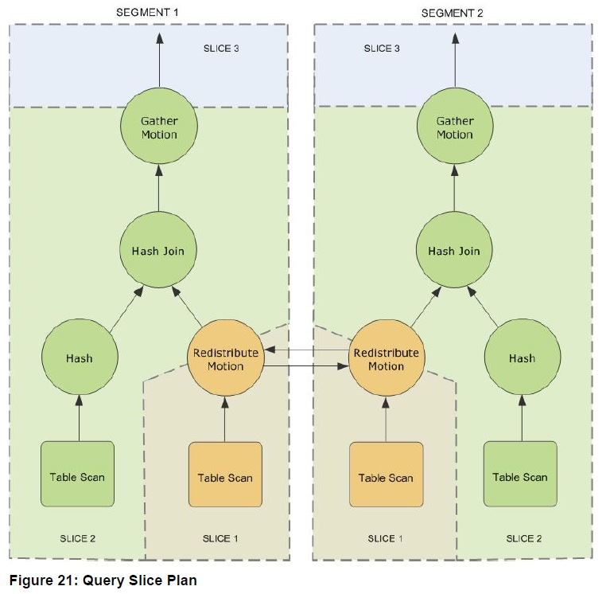
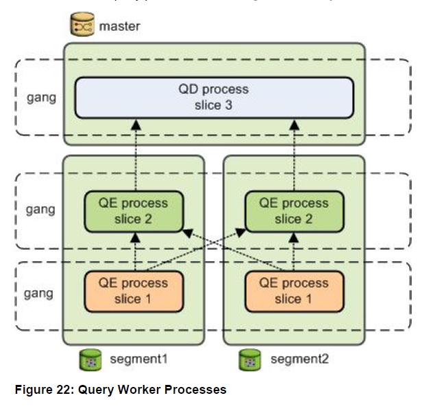

## Greenplum explain analyze 解读 + 深度明细开关 - 珍藏级 
                          
### 作者                          
digoal                          
                          
### 日期                          
2017-12-04                   
                          
### 标签                          
PostgreSQL , Greenplum , explain analyze , 解读 , 深度明细 , explain_memory_verbosity , gp_enable_explain_allstat     
                          
----                          
                          
## 背景           
解读Greenplum 的explain analyze输出。同时介绍两个深度明细开关explain_memory_verbosity , gp_enable_explain_allstat   。  
  
例如，我们的一个QUERY是什么地方有瓶颈，是网络瓶颈还是CPU瓶颈，都可以从里面打印的时间观之一二。  
  
  
## 例子  
如果不打开详细开关，那么统计信息中，rows out后面的明细，实际上输出的是返回行数最多的SEGMENT，并不一定是最慢的segment（请务必注意）。因此我们看到上面的offset甚至有一些比下面的offset更小的，原因就在此。  
  
解释请参考如下：  
  
其中，start offset 表示从query dispatcher(QD)发起，到返回这个NODE的第一条有效tuple的时间。  
  
可以说明几个问题：  
  
1、query dispatch下发执行计划到segment，启动segment 的worker process。这之间有一定的时间差，体现在start offset层面。  
  
开始时间是qd下发分布式执行计划，如果有一些offset比较大，可能是worker process fork较慢引起。  
  
2、结束时间是获取到当前NODE的第一条有效记录是结束点，如果有一些offset比较大，也可能是当前worker处理较慢，获得第一条有效记录时间较久。  
  
3、又或者，数据较倾斜，得到第一条有效记录，需要过滤很多无效记录。  
  
```  
postgres=# explain analyze select count(*),c1 from a group by c1 limit 1;  
                                                                            QUERY PLAN                                                                              
------------------------------------------------------------------------------------------------------------------------------------------------------------------  
 Limit  (cost=1561155.53..1561155.57 rows=1 width=12)  
   Rows out:  1 rows with 0.003 ms to first row, 0.031 ms to end, start offset by 522 ms.  
   ->  Gather Motion 48:1  (slice2; segments: 48)  (cost=1561155.53..1561155.57 rows=1 width=12)  
         Rows out:  1 rows at destination with 3994 ms to end, start offset by 522 ms.  
         ->  Limit  (cost=1561155.53..1561155.55 rows=1 width=12)  
               Rows out:  Avg 1.0 rows x 41 workers.  Max 1 rows (seg0) with 0.006 ms to end, start offset by 538 ms.  
               ->  HashAggregate  (cost=1561155.53..1561156.80 rows=3 width=12)  
                     Group By: a.c1  
                     Rows out:  Avg 1.0 rows x 41 workers.  Max 1 rows (seg0) with 0.003 ms to first row, 1252 ms to end, start offset by 538 ms.  
                     ->  Redistribute Motion 48:48  (slice1; segments: 48)  (cost=1561152.00..1561154.02 rows=3 width=12)  
                           Hash Key: a.c1  
                           -- 平均返回多少行，返回最多行的节点，Rows out:  Avg 118.2 rows x 41 workers at destination.  Max 192 rows  
			   -- 从这个worker第一次Entry to this plan node时间到返回这个NODE的第一条有效tuple，with xxx ms to first row   
			   -- 从这个worker第一次Entry to this plan node时间到返回这个NODE的最后一条有效tuple，(seg9) with 2669 ms to end  
			   -- 从query dispatcher(QD)发起，到返回这个NODE的第一条有效tuple，start offset by 595 ms.  
			   Rows out:  Avg 118.2 rows x 41 workers at destination.  Max 192 rows (seg9) with 2669 ms to end, start offset by 595 ms.  
                           ->  HashAggregate  (cost=1561152.00..1561152.00 rows=3 width=12)  
                                 Group By: a.c1  
                                -- appendStringInfo(str,  
                                --                               "Rows in:  Avg %.1f rows x %d workers."  
                                --                               "  Max %.0f rows%s",  
                                --                               ntuples_avg,  
                                --                               ns->ntuples.vcnt,  
                                --                               ns->ntuples.vmax,  
                                --                               segbuf);  
			        -- Rows out:  {noRowRequested} rows{ns->ntuples.vmax}    
			        -- with {Time from this worker's first InstrStartNode() to its first result row} to first row  
				-- {Time from this worker's first InstrStartNode() to end of its results} to end  
				-- start offset by {Time from start of query on qDisp to this worker's first result row}   
				 Rows out:  Avg 101.0 rows x 48 workers.  Max 101 rows (seg0) with 0.005 ms to first row, 2706 ms to end, start offset by 572 ms.  
                                 ->  Append-only Columnar Scan on a  (cost=0.00..1061152.00 rows=2083334 width=4)  
                                       -- 不同的planstate->type，输出的内容可能不一样，参考 cdbexplain_showExecStats   
				       -- Rows out:  {noRowRequested} rows{ns->ntuples.vmax}    
				       -- with {Time from this worker's first InstrStartNode() to end of its results} to end  
				       -- start offset by {Time from start of query on qDisp to this worker's first result row}  
				       Rows out:  0 rows (seg0) with 34 ms to end, start offset by 568 ms.  
 -- 每一个分片的内存使用情况, 一个分片指在整个执行计划中，在segment内可以独立运行的连续的步骤集，后面有术语介绍  
 Slice statistics:  
   (slice0)    Executor memory: 327K bytes.  
   (slice1)    Executor memory: 828K bytes avg x 48 workers, 828K bytes max (seg0).  
   (slice2)    Executor memory: 353K bytes avg x 48 workers, 356K bytes max (seg0).  
 -- 当gp_resqueue_memory_policy != RESQUEUE_MEMORY_POLICY_NONE时，打印内存统计信息  
 Statement statistics:  
   --   /* What is the memory reserved for this query's execution? */  
   --    uint64          query_mem;  
   --   PlannedStmt @ pgsql/src/include/nodes/plannodes.h   
   Memory used: 128000K bytes  
 -- 设置了哪些影响执行计划的非默认参数  
 Settings:  enable_bitmapscan=off; enable_seqscan=off; optimizer=off  
 Optimizer status: legacy query optimizer  
 -- 总执行时长  
 Total runtime: 4518.864 ms  
(26 rows)  
```  
  
以上解释，详见代码 cdbexplain_showExecStats  
  
```  
  
        switch (planstate->type)  
        {  
                case T_BitmapAndState:  
                case T_BitmapOrState:  
                case T_BitmapIndexScanState:  
                        s_row = "";  
                        if (ns->ntuples.vcnt > 1)  
                                appendStringInfo(str,  
                                                                 "Bitmaps out:  Avg %.1f x %d workers."  
                                                                 "  Max %.0f%s",  
                                                                 ntuples_avg,  
                                                                 ns->ntuples.vcnt,  
                                                                 ns->ntuples.vmax,  
                                                                 segbuf);  
                        else  
                                appendStringInfo(str,  
                                                                 "Bitmaps out:  %s%.0f%s",  
                                                                 noRowRequested,  
                                                                 ns->ntuples.vmax,  
                                                                 segbuf);  
                        break;  
                case T_HashState:  
                        if (ns->ntuples.vcnt > 1)  
                                appendStringInfo(str,  
                                                                 "Rows in:  Avg %.1f rows x %d workers."  
                                                                 "  Max %.0f rows%s",  
                                                                 ntuples_avg,  
                                                                 ns->ntuples.vcnt,  
                                                                 ns->ntuples.vmax,  
                                                                 segbuf);  
                        else  
                                appendStringInfo(str,  
                                                                 "Rows in:  %s%.0f rows%s",  
                                                                 noRowRequested,  
                                                                 ns->ntuples.vmax,  
                                                                 segbuf);  
                        break;  
                case T_MotionState:  
                        if (ns->ntuples.vcnt > 1)  
                                appendStringInfo(str,  
                                                                 "Rows out:  Avg %.1f rows x %d workers"  
                                                                 " at destination.  Max %.0f rows%s",  
                                                                 ntuples_avg,  
                                                                 ns->ntuples.vcnt,  
                                                                 ns->ntuples.vmax,  
                                                                 segbuf);  
                        else  
                                appendStringInfo(str,  
                                                                 "Rows out:  %s%.0f rows at destination%s",  
                                                                 noRowRequested,  
                                                                 ns->ntuples.vmax,  
                                                                 segbuf);  
                        break;  
                default:  
                        if (ns->ntuples.vcnt > 1)  
                                appendStringInfo(str,  
                                                                 "Rows out:  Avg %.1f rows x %d workers."  
                                                                 "  Max %.0f rows%s",  
                                                                 ntuples_avg,  
                                                                 ns->ntuples.vcnt,  
                                                                 ns->ntuples.vmax,  
                                                                 segbuf);  
                        else  
                                appendStringInfo(str,  
                                                                 "Rows out:  %s%.0f rows%s",  
                                                                 noRowRequested,  
                                                                 ns->ntuples.vmax,  
                                                                 segbuf);  
        }  
  
  
        /*  
         * Show elapsed time just once if they are the same or if we don't have  
         * any valid elapsed time for first tuple.  
         */  
        if ((instr->ntuples > 0) && (strcmp(firstbuf, totalbuf) != 0))  
                appendStringInfo(str,  
                                                 " with %s to first%s, %s to end",  
                                                 firstbuf,  
                                                 s_row,  
                                                 totalbuf);  
        else  
                appendStringInfo(str,  
                                                 " with %s to end",  
                                                 totalbuf);  
  
  
        /* Number of rescans */  
        if (instr->nloops > 1)  
                appendStringInfo(str, " of %.0f scans", instr->nloops);  
  
        /* Time from start of query on qDisp to this worker's first result row */  
        if (!(INSTR_TIME_IS_ZERO(instr->firststart)))  
        {  
                INSTR_TIME_SET_ZERO(timediff);  
                INSTR_TIME_ACCUM_DIFF(timediff, instr->firststart, ctx->querystarttime);  
                cdbexplain_formatSeconds(startbuf, sizeof(startbuf), INSTR_TIME_GET_DOUBLE(timediff));  
                appendStringInfo(str, ", start offset by %s", startbuf);  
        }  
```  
  
## Greenplum Query Plans 术语  
取自《greenplum administrator guide》 Understanding Greenplum Query Plans 章节。  
  
  
  
1、tree  
  
Plans are read and executed from bottom to top.  
  
2、node  
  
Each node or step in the plan represents a database operation such as a table scan, join, aggregation, or  
sort.  
  
3、slice  
  
To achieve maximum parallelism during query execution, Greenplum divides the work of the query plan  
into slices. A slice is a portion of the plan that segments can work on independently. A query plan is sliced  
wherever a motion operation occurs in the plan, with one slice on each side of the motion.  
  
4、motion  
  
Greenplum Database  
has an additional operation type called motion. A motion operation involves moving tuples between the  
segments during query processing.  
  
4\.1、redistribute motion  
  
The query plan for this example has a redistribute motion that moves tuples between the segments to  
complete the join. The redistribute motion is necessary because the customer table is distributed across  
the segments by cust_id, but the sales table is distributed across the segments by sale_id. To perform  
the join, the sales tuples must be redistributed by cust_id. The plan is sliced on either side of the  
redistribute motion, creating slice 1 and slice 2.  
  
4\.2、gather motion  
  
This query plan has another type of motion operation called a gather motion. A gather motion is when the  
segments send results back up to the master for presentation to the client.  
  
Not  
all query plans involve a gather motion. For example, a CREATE TABLE x AS SELECT... statement would  
not have a gather motion because tuples are sent to the newly created table, not to the master.  
  
  
  
1、query dispatcher (QD)  
  
Greenplum creates a number of database processes to handle the work of a query. On the master,  
the query worker process is called the query dispatcher (QD). The QD is responsible for creating and  
dispatching the query plan. It also accumulates and presents the final results.  
  
2、query executor (QE)  
  
On the segments, a query  
worker process is called a query executor (QE). A QE is responsible for completing its portion of work and  
communicating its intermediate results to the other worker processes.  
  
3、worker process  
  
There is at least one worker process assigned to each slice of the query plan. A worker process works on  
its assigned portion of the query plan independently. During query execution, each segment will have a  
number of processes working on the query in parallel.  
  
4、gangs  
  
Related processes that are working on the same slice of the query plan but on different segments are  
called gangs. As a portion of work is completed, tuples flow up the query plan from one gang of processes  
to the next.  
  
5、interconnect  
  
This inter-process communication between the segments is referred to as the interconnect  
component of Greenplum Database.  
  
## 深度明细参数  
https://discuss.pivotal.io/hc/en-us/articles/205752208-Options-to-gather-more-information-from-EXPLAIN-ANALYZE  
  
There are two GUCs that can add additional information to the EXPLAIN ANALYZE output.   
Both of these can be set at the session level and can be used to find skew,   
excessive processing time or memory consumption:  
  
### gp_enable_explain_allstat  
设置为true or false。用于打印每个segment的执行耗时详情。  
  
This is a useful way to see if there is any skew during the processings of your query.   
This will, for each operator, list the individual segment,   
the number of rows it processed as well as the time it took to do so.  
  
Below we have one of the lines that the gp_enable_explain_allstat option added to the  
  
```  
allstat: seg_firststart_total_ntuples/seg0_19 ms_1.028 ms_1334/seg1_19 ms_2.283 ms_3333//end  
```  
  
Let's break it down - the format of this is for each segment we have the following:   
  
```  
segment number _ time to start ms _ time to complete ms _ number of tuples  
```  
  
Using this we see that:  
  
```  
seg0 waiting 19 ms before starting  
  
it took 1.028 ms to complete it's work  
  
and it processed 1334 tuples  
```  
  
### explain_memory_verbosity  
设置为SUPPRESS, SUMMARY, and DETAIL。用于打印内存使用详情。  
  
This option uses the new memory accounting framework introduced in   
GPDB 4.3.2.0 and will show the memory usage per operator node.   
  
This GUC takes three values: SUPPRESS, SUMMARY, and DETAIL with SUPPRESS being the default.  
  
With the SUMMARY setting there is only one additional row being added per node, the 'Memory' node:  
  
```  
Memory:  47K bytes avg, 47K bytes max (seg0).  
```  
  
This option will add the average and max memory used for each operator.  
  
### 使用深度明细参数例子  
  
```  
postgres=# set explain_memory_verbosity =detail;  
SET  
postgres=# set gp_enable_explain_allstat=on;  
SET  
```  
  
```  
信息过多，截断部分展示  
postgres=# explain analyze select count(*),c1 from a group by c1 limit 1;  
  
 Limit  (cost=1561155.53..1561155.57 rows=1 width=12)  
   Rows out:  1 rows with 0.002 ms to first row, 0.021 ms to end, start offset by 242 ms.  
   Memory:  4K bytes.  
   ->  Gather Motion 48:1  (slice2; segments: 48)  (cost=1561155.53..1561155.57 rows=1 width=12)  
         Rows out:  1 rows at destination with 3997 ms to end, start offset by 242 ms.  
         slice 2, seg 0  
           Root: Peak 0K bytes. Quota: 0K bytes.  
             Top: Peak 0K bytes. Quota: 0K bytes.  
               Main: Peak 3K bytes. Quota: 0K bytes.  
                 Executor: Peak 246K bytes. Quota: 0K bytes.  
                 Deserializer: Peak 16K bytes. Quota: 0K bytes.  
                 Deserializer: Peak 15K bytes. Quota: 0K bytes.  
               X_Alien: Peak 209K bytes. Quota: 0K bytes.  
                 X_Motion: Peak 5K bytes. Quota: 100K bytes.  
                   X_Limit: Peak 3K bytes. Quota: 100K bytes.  
                     X_Agg: Peak 10K bytes. Quota: 63900K bytes.  
                       X_Motion: Peak 5K bytes. Quota: 100K bytes.  
             MemAcc: Peak 0K bytes. Quota: 0K bytes.  
             Rollover: Peak 887K bytes. Quota: 0K bytes.  
             SharedHeader: Peak 16K bytes. Quota: 0K bytes.  
         slice 2, seg 1  
.....................................  
  
                               SharedHeader: Peak 18K bytes. Quota: 0K bytes.  
                           slice 1, seg 47  
                             Root: Peak 0K bytes. Quota: 0K bytes.  
                               Top: Peak 0K bytes. Quota: 0K bytes.  
                                 Main: Peak 3K bytes. Quota: 0K bytes.  
                                   Executor: Peak 809K bytes. Quota: 0K bytes.  
                                   Deserializer: Peak 16K bytes. Quota: 0K bytes.  
                                   Deserializer: Peak 15K bytes. Quota: 0K bytes.  
                                 X_Alien: Peak 20K bytes. Quota: 0K bytes.  
                                   X_Motion: Peak 5K bytes. Quota: 100K bytes.  
                                     X_Agg: Peak 152K bytes. Quota: 63900K bytes.  
                                       X_TableScan: Peak 81K bytes. Quota: 100K bytes.  
                               MemAcc: Peak 0K bytes. Quota: 0K bytes.  
                               Rollover: Peak 887K bytes. Quota: 0K bytes.  
                               SharedHeader: Peak 18K bytes. Quota: 0K bytes.  
                           Memory:  6K bytes avg, 6K bytes max (seg0).  
                           allstat: seg_firststart_total_ntuples/seg0_248 ms_2727 ms_144/seg1_248 ms_2727 ms_48/seg2_254 ms_2721 ms_96/seg3_254 ms_2721 ms_96/seg4_248 ms_2727 ms_96/seg5_254 ms_2721 ms_144/seg6_270 ms_2705 ms_96/seg7_254   
ms_2721 ms_144/seg8_270 ms_2705 ms_48/seg9_254 ms_2721 ms_192/seg10_270 ms_2705 ms_48/seg11_254 ms_2721 ms_192/seg12_254 ms_3963 ms_0/seg13_254 ms_2721 ms_144/seg14_254 ms_3963 ms_0/seg15_271 ms_2705 ms_144/seg16_272 ms_3945 ms_0/seg17_2  
85 ms_2691 ms_192/seg18_308 ms_3909 ms_0/seg19_302 ms_2673 ms_192/seg20_303 ms_2672 ms_96/seg21_286 ms_2690 ms_144/seg22_286 ms_2690 ms_48/seg23_286 ms_2689 ms_144/seg24_308 ms_2668 ms_48/seg25_284 ms_2691 ms_96/seg26_288 ms_2688 ms_96/s  
eg27_287 ms_2689 ms_96/seg28_285 ms_2691 ms_96/seg29_285 ms_2691 ms_96/seg30_291 ms_2684 ms_144/seg31_286 ms_2690 ms_48/seg32_287 ms_2688 ms_144/seg33_291 ms_2684 ms_48/seg34_286 ms_2690 ms_192/seg35_285 ms_3932 ms_0/seg36_286 ms_2690 ms  
_144/seg37_285 ms_2691 ms_48/seg38_286 ms_2690 ms_144/seg39_286 ms_3932 ms_0/seg40_287 ms_2689 ms_192/seg41_287 ms_2689 ms_48/seg42_286 ms_2692 ms_192/seg43_290 ms_3928 ms_0/seg44_286 ms_2690 ms_192/seg45_286 ms_2693 ms_48/seg46_288 ms_2  
688 ms_144/seg47_295 ms_2681 ms_144//end  
                           ->  HashAggregate  (cost=1561152.00..1561152.00 rows=3 width=12)  
                                 Group By: a.c1  
                                 Rows out:  Avg 101.0 rows x 48 workers.  Max 101 rows (seg0) with 0.006 ms to first row, 2506 ms to end, start offset by 295 ms.  
                                 Memory:  153K bytes avg, 153K bytes max (seg0).  
                                 allstat: seg_firststart_total_ntuples/seg0_295 ms_2506 ms_101/seg1_287 ms_2697 ms_101/seg2_285 ms_1907 ms_101/seg3_288 ms_2622 ms_101/seg4_290 ms_2632 ms_101/seg5_286 ms_2482 ms_101/seg6_293 ms_2861 ms_10  
1/seg7_287 ms_2094 ms_101/seg8_287 ms_2676 ms_101/seg9_293 ms_2644 ms_101/seg10_286 ms_2865 ms_101/seg11_287 ms_2631 ms_101/seg12_287 ms_2714 ms_101/seg13_287 ms_1913 ms_101/seg14_286 ms_2640 ms_101/seg15_288 ms_1922 ms_101/seg16_285 ms_  
2689 ms_101/seg17_286 ms_1946 ms_101/seg18_284 ms_2655 ms_101/seg19_286 ms_2709 ms_101/seg20_289 ms_1890 ms_101/seg21_291 ms_1894 ms_101/seg22_286 ms_2742 ms_101/seg23_288 ms_1903 ms_101/seg24_283 ms_2636 ms_101/seg25_286 ms_1948 ms_101/  
seg26_286 ms_2094 ms_101/seg27_283 ms_2181 ms_101/seg28_285 ms_2628 ms_101/seg29_282 ms_2503 ms_101/seg30_285 ms_2636 ms_101/seg31_290 ms_2636 ms_101/seg32_293 ms_2621 ms_101/seg33_297 ms_2552 ms_101/seg34_293 ms_2704 ms_101/seg35_293 ms  
_2633 ms_101/seg36_293 ms_1972 ms_101/seg37_305 ms_2615 ms_101/seg38_298 ms_2783 ms_101/seg39_293 ms_2624 ms_101/seg40_297 ms_2618 ms_101/seg41_295 ms_2183 ms_101/seg42_295 ms_1905 ms_101/seg43_298 ms_1955 ms_101/seg44_297 ms_1904 ms_101  
/seg45_294 ms_2781 ms_101/seg46_296 ms_2434 ms_101/seg47_298 ms_2632 ms_101//end  
                                 ->  Append-only Columnar Scan on a  (cost=0.00..1061152.00 rows=2083334 width=4)  
                                       Rows out:  0 rows (seg0) with 28 ms to end, start offset by 283 ms.  
                                       Memory:  82K bytes avg, 82K bytes max (seg0).  
                                       allstat: seg_firststart_total_ntuples/seg0_295 ms_22 ms_0/seg1_287 ms_16 ms_0/seg2_285 ms_13 ms_0/seg3_288 ms_16 ms_0/seg4_290 ms_22 ms_0/seg5_286 ms_16 ms_0/seg6_293 ms_27 ms_0/seg7_287 ms_18 ms_0/  
seg8_287 ms_16 ms_0/seg9_293 ms_23 ms_0/seg10_286 ms_17 ms_0/seg11_287 ms_26 ms_0/seg12_287 ms_19 ms_0/seg13_287 ms_23 ms_0/seg14_286 ms_16 ms_0/seg15_288 ms_17 ms_0/seg16_285 ms_17 ms_0/seg17_286 ms_23 ms_0/seg18_284 ms_19 ms_0/seg19_28  
6 ms_22 ms_0/seg20_289 ms_19 ms_0/seg21_291 ms_27 ms_0/seg22_286 ms_17 ms_0/seg23_288 ms_25 ms_0/seg24_283 ms_28 ms_0/seg25_286 ms_17 ms_0/seg26_286 ms_17 ms_0/seg27_283 ms_26 ms_0/seg28_285 ms_16 ms_0/seg29_282 ms_19 ms_0/seg30_285 ms_1  
8 ms_0/seg31_290 ms_16 ms_0/seg32_293 ms_24 ms_0/seg33_297 ms_16 ms_0/seg34_293 ms_16 ms_0/seg35_293 ms_18 ms_0/seg36_293 ms_15 ms_0/seg37_305 ms_15 ms_0/seg38_298 ms_21 ms_0/seg39_293 ms_16 ms_0/seg40_297 ms_16 ms_0/seg41_295 ms_20 ms_0  
/seg42_295 ms_14 ms_0/seg43_298 ms_20 ms_0/seg44_297 ms_22 ms_0/seg45_294 ms_23 ms_0/seg46_296 ms_16 ms_0/seg47_298 ms_16 ms_0//end  
 Slice statistics:  
   (slice0)    Executor memory: 327K bytes.  Peak memory: 1827K bytes.  
   (slice1)    Executor memory: 828K bytes avg x 48 workers, 828K bytes max (seg0).  Peak memory: 1939K bytes avg x 48 workers, 1939K bytes max (seg10).  
   (slice2)    Executor memory: 353K bytes avg x 48 workers, 356K bytes max (seg0).  Peak memory: 1375K bytes avg x 48 workers, 1375K bytes max (seg11).  
 Statement statistics:  
   Memory used: 128000K bytes  
 Settings:  enable_bitmapscan=off; enable_seqscan=off; optimizer=off  
 Optimizer status: legacy query optimizer  
 Total runtime: 4219.754 ms  
(1430 rows)  
```  
  
### 其他开关，类似PG
```
set client_min_messages=debug5;
set log_checkpoints = on;
set log_error_verbosity = verbose ;
set log_lock_waits = on;                  
set log_replication_commands = off;
set log_temp_files = 0;
set track_activities = on;
set track_counts = on;
set track_io_timing = on;
set track_functions = 'all';
set trace_sort=on;
set log_statement_stats = off;
set log_parser_stats = on;
set log_planner_stats = on;
set log_executor_stats = on;
set log_autovacuum_min_duration=0;
set deadlock_timeout = '1s';
set debug_print_parse = off;
set debug_print_rewritten = off;
set debug_print_plan = off;
set debug_pretty_print = on;
explain (analyze,verbose,timing,costs,buffers) select count(*),relkind from pg_class group by relkind order by count(*) desc limit 1;
```
    
## 参考  
src/backend/cdb/cdbexplain.c   
  
```  
/* EXPLAIN ANALYZE statistics for one plan node of a slice */  
typedef struct CdbExplain_StatInst  
{  
        NodeTag         pstype;                 /* PlanState node type */  
        bool            running;                /* True if we've completed first tuple */  
        instr_time      starttime;              /* Start time of current iteration of node */  
        instr_time      counter;                /* Accumulated runtime for this node */  
        double          firsttuple;             /* Time for first tuple of this cycle */  
        double          startup;                /* Total startup time (in seconds) */  
        double          total;                  /* Total total time (in seconds) */  
        double          ntuples;                /* Total tuples produced */  
        double          nloops;                 /* # of run cycles for this node */  
        double          execmemused;    /* executor memory used (bytes) */  
        double          workmemused;    /* work_mem actually used (bytes) */  
        double          workmemwanted;  /* work_mem to avoid workfile i/o (bytes) */  
        bool            workfileCreated;        /* workfile created in this node */  
        instr_time      firststart;             /* Start time of first iteration of node */  
        double          peakMemBalance; /* Max mem account balance */  
        int                     numPartScanned; /* Number of part tables scanned */  
        int                     bnotes;                 /* Offset to beginning of node's extra text */  
        int                     enotes;                 /* Offset to end of node's extra text */  
} CdbExplain_StatInst;  
  
  
/* EXPLAIN ANALYZE statistics for one process working on one slice */  
typedef struct CdbExplain_SliceWorker  
{  
        double          peakmemused;    /* bytes alloc in per-query mem context tree */  
        double          vmem_reserved;  /* vmem reserved by a QE */  
        double          memory_accounting_global_peak;  /* peak memory observed during  
                                                                                                 * memory accounting */  
} CdbExplain_SliceWorker;  
  
  
/* Header of EXPLAIN ANALYZE statistics message sent from qExec to qDisp */  
typedef struct CdbExplain_StatHdr  
{  
        NodeTag         type;                   /* T_CdbExplain_StatHdr */  
        int                     segindex;               /* segment id */  
        int                     nInst;                  /* num of StatInst entries following StatHdr */  
        int                     bnotes;                 /* offset to extra text area */  
        int                     enotes;                 /* offset to end of extra text area */  
  
        int                     memAccountCount;        /* How many mem account we serialized */  
        int                     memAccountStartOffset;  /* Where in the header our memory  
                                                                                 * account array is serialized */  
  
        CdbExplain_SliceWorker worker;          /* qExec's overall stats for slice */  
  
        /*  
         * During serialization, we use this as a temporary StatInst and save  
         * "one-at-a-time" StatInst into this variable. We then write this  
         * variable into buffer (serialize it) and then "recycle" the same inst  
         * for next plan node's StatInst. During deserialization, an Array  
         * [0..nInst-1] of StatInst entries is appended starting here.  
         */  
        CdbExplain_StatInst inst[1];  
  
        /* extra text is appended after that */  
} CdbExplain_StatHdr;  
  
  
/* One node's EXPLAIN ANALYZE statistics for all the workers of its segworker group */  
typedef struct CdbExplain_NodeSummary  
{  
        /* Summary over all the node's workers */  
        CdbExplain_Agg ntuples;  
        CdbExplain_Agg execmemused;  
        CdbExplain_Agg workmemused;  
        CdbExplain_Agg workmemwanted;  
        CdbExplain_Agg totalWorkfileCreated;  
        CdbExplain_Agg peakMemBalance;  
        /* Used for DynamicTableScan, DynamicIndexScan and DynamicBitmapTableScan */  
        CdbExplain_Agg totalPartTableScanned;  
  
        /* insts array info */  
        int                     segindex0;              /* segment id of insts[0] */  
        int                     ninst;                  /* num of StatInst entries in inst array */  
  
        /* Array [0..ninst-1] of StatInst entries is appended starting here */  
        CdbExplain_StatInst insts[1];           /* variable size - must be last */  
} CdbExplain_NodeSummary;  
  
  
/* One slice's statistics for all the workers of its segworker group */  
typedef struct CdbExplain_SliceSummary  
{  
        Slice      *slice;  
  
        /* worker array */  
        int                     nworker;                /* num of SliceWorker slots in worker array */  
        int                     segindex0;              /* segment id of workers[0] */  
        CdbExplain_SliceWorker *workers;        /* -> array [0..nworker-1] of  
                                                                                 * SliceWorker */  
  
        /*  
         * We use void ** as we don't have access to MemoryAccount struct, which  
         * is private to memory accounting framework  
         */  
        void      **memoryAccounts; /* Array of pointers to serialized memory  
                                                                 * accounts array, one array per worker  
                                                                 * [0...nworker-1]. */  
        MemoryAccountIdType *memoryAccountCount;        /* Array of memory account  
                                                                                                 * counts, one per slice */  
  
        CdbExplain_Agg peakmemused; /* Summary of SliceWorker stats over all of  
                                                                 * the slice's workers */  
  
        CdbExplain_Agg vmem_reserved;           /* vmem reserved by QEs */  
  
        CdbExplain_Agg memory_accounting_global_peak;           /* Peak memory  
                                                                                                                 * accounting balance by  
                                                                                                                 * QEs */  
  
        /* Rollup of per-node stats over all of the slice's workers and nodes */  
        double          workmemused_max;  
        double          workmemwanted_max;  
  
        /* How many workers were dispatched and returned results? (0 if local) */  
        CdbExplain_DispatchSummary dispatchSummary;  
} CdbExplain_SliceSummary;  
```  
  
  
<a rel="nofollow" href="http://info.flagcounter.com/h9V1"  ></a>  
  
  
  
  
  
  
## [digoal's 大量PostgreSQL文章入口](https://github.com/digoal/blog/blob/master/README.md "22709685feb7cab07d30f30387f0a9ae")
  
