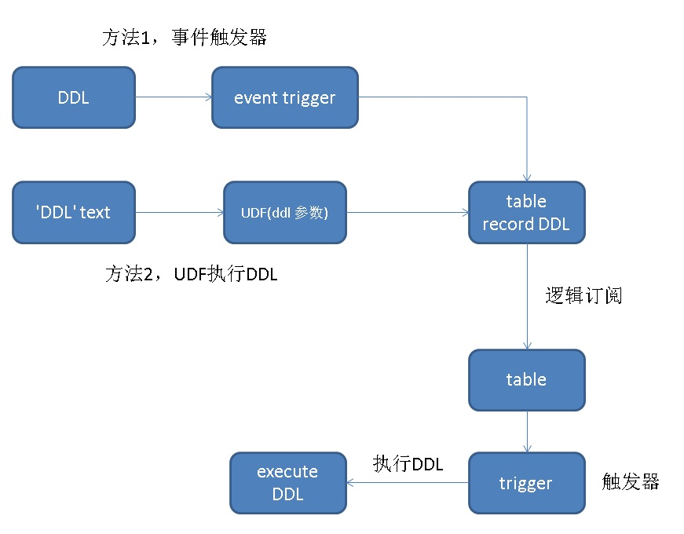

## PostgreSQL 逻辑订阅 - DDL 订阅 实现方法    
                          
### 作者                          
digoal                          
                          
### 日期                          
2017-12-04                          
                          
### 标签                          
PostgreSQL , 逻辑订阅 , 逻辑复制 , DDL 复制 , udf , 触发器 , 事件触发器    
                          
----                          
                          
## 背景    
逻辑订阅是PostgreSQL 10内置的功能，通过逻辑订阅，可以实现部分数据的同步要求。例如可以做到行级、表级、库级的订阅。  
  
[《使用PostgreSQL逻辑订阅实现multi-master》](../201706/20170624_01.md)    
  
[《PostgreSQL 逻辑订阅 - 给业务架构带来了什么希望？》](../201704/20170413_01.md)    
  
[《PostgreSQL 10.0 preview 逻辑订阅 - 原理与最佳实践》](../201702/20170227_01.md)  
  
逻辑订阅实际上和MySQL binglog复制类似，但是DDL是不写表的，那么DDL如何复制呢？  
  
    
  
有两种方法，将DDL记录下来，写入表中，在订阅端对这个表创建触发器，在触发器内执行DDL即可。  
  
需要被订阅的对象，建上对应的触发器即可。  
  
注意：  
  
使用这种方法，目标端建议schema, 表结构都与订阅端一样。如果schema不一样，那么在触发器中，设置一下search_path再执行对应的DDL。  
  
## event trigger方法  
略，用法请参考PostgreSQL手册。  
  
## 封装UDF的方法  
本文重点介绍这个方法。  
  
1、主库：创建存储DDL的目标表  
  
```  
create table ddl_record(  
  id serial8 primary key,   -- 主键  
  content text,             -- DDL内容  
  tbl_name name,            -- 表名  
  sub     boolean,          -- 是否需要发布此表, true 表示发布, false 表示不发布  
  pub_name name[],          -- 发布到哪些publication, 使用数组表示  
  crt_time timestamp        -- 时间  
);  
```  
  
2、主库：创建测试表  
  
```  
create table t_test (  
  id serial primary key,  
  info text,  
  crt_time timestamp  
);  
```  
  
3、主库：创建封装DDL的UDF  
  
```  
create or replace function exec_ddl(v_content text, v_tbl_name name default null, v_sub boolean default null, v_pub_name name[] default null) returns void as $$  
declare  
  pub_name name;  
begin  
    
  -- 检查DDL与tbl_name中对象名是否一致。初略检查。  
  if v_content !~* v_tbl_name then  
    raise exception 'you must specify correct table name with $1 and $2';  
  end if;  
    
  -- 执行DDL  
  execute v_content;  
    
  -- 插入订阅表  
  insert into ddl_record(content, tbl_name, sub, pub_name, crt_time) values (v_content, v_tbl_name, v_sub, v_pub_name, clock_timestamp());  
    
  -- 如果包含create table，并选择了发布，那么发布此表  
  if v_sub and lower(v_content) ~ 'create +table' then  
    foreach pub_name in array v_pub_name loop  
      execute format ('ALTER PUBLICATION %s add table %s', pub_name, v_tbl_name);  
    end loop;  
  end if;  
end;  
$$ language plpgsql strict;  
```  
  
4、主库：创建发布  
  
```  
CREATE PUBLICATION pub1;  
  
ALTER PUBLICATION pub1 ADD TABLE ddl_record, t_test;  
```  
  
5、备库：创建初次订阅  
  
初次订阅，需要订阅ddl_RECORD和t_test  
  
首先要创建TABLE  
  
```  
create table ddl_record(  
  id serial8 primary key,   -- 主键  
  content text,             -- DDL内容  
  tbl_name name,            -- 表名  
  sub     boolean,          -- 是否需要订阅此表  
  pub_name name[],          -- 发布到哪些publication  
  crt_time timestamp        -- 时间  
);  
  
create table t_test (  
  id serial primary key,  
  info text,  
  crt_time timestamp  
);  
```  
  
订阅，指定发布端的连接地址，注意如果需要密码，也请输入。（具体的发布详细用法，可以参考本文末尾）  
  
```  
create subscription sub1 connection 'hostaddr=127.0.0.1 port=1999 user=postgres dbname=postgres' publication pub1;  
```  
  
创建ddl_record触发器函数，用DBLINK来调用DDL（可能是BUG，后面能修复），确保127.0.0.1访问不需要密码。      
  
不要使用这个触发器函数：  
  
```  
create or replace function tg_exec_ddl() returns trigger as $$  
declare  
  sub_name text := TG_ARGV[0];  
  v_port text;  
  conn text;  
begin  
  -- dblink  
  CREATE EXTENSION if not exists dblink;  
    
  show port into v_port;  
  conn := format('hostaddr=127.0.0.1 port=%s user=%s dbname=%s', v_port, current_user, current_database);  
  -- set search_path=xxx;  
  if NEW.sub then                        -- 仅复制UDF中设置为发布=true了的DDL  
    execute NEW.content;  
    perform pg_sleep(1);  
      
    if NEW.content ~* 'create +table' then  
      -- 刷新订阅，否则新增的发布表不会被订阅到  
      -- copy_data (boolean)  
      -- Specifies whether the existing data in the publications that are being subscribed   
      -- to should be copied once the replication starts. The default is true.  
      -- 新增的订阅表，是否需要copy数据。(老的不管)  
      execute format('ALTER SUBSCRIPTION %s REFRESH PUBLICATION with (copy_data=true)', sub_name) ;    
    end if;  
  end if;  
  --   
  return null;  
end;  
$$ language plpgsql strict;  
```  
  
请使用这个触发器函数：  
  
```  
create or replace function tg_exec_ddl() returns trigger as $$  
declare  
  sub_name text := TG_ARGV[0];  
  v_port text;  
  conn text;  
begin  
  -- dblink  
  CREATE EXTENSION if not exists dblink;  
    
  show port into v_port;  
  conn := format('hostaddr=127.0.0.1 port=%s user=%s dbname=%s', v_port, current_user, current_database);  
  -- set search_path=xxx;  
  if NEW.sub then                        -- 仅复制UDF中设置为发布=true了的DDL  
    execute format('select dblink_exec(''%s'', ''%s'')', conn, NEW.content);  
    perform pg_sleep(1);  
      
    if NEW.content ~* 'create +table' then  
      -- 刷新订阅，否则新增的发布表不会被订阅到  
      -- copy_data (boolean)  
      -- Specifies whether the existing data in the publications that are being subscribed   
      -- to should be copied once the replication starts. The default is true.  
      -- 新增的订阅表，是否需要copy数据。(老的不管)  
      execute format('select dblink_exec(''%s'', ''ALTER SUBSCRIPTION %s REFRESH PUBLICATION with (copy_data=true)'')', conn, sub_name) ;    
    end if;  
  end if;  
  --   
  return null;  
end;  
$$ language plpgsql strict;  
```  
  
创建ddl_record插入触发器，指定subscript的名称    
  
```  
create trigger tg_exec_ddl after insert on ddl_record for each row execute procedure tg_exec_ddl('sub1');  
```  
  
**设置允许replica执行触发器，一定要执行，否则订阅端不会触发。**  
  
```  
alter table ddl_record enable always trigger tg_exec_ddl  ;  
  
  
  
  
DISABLE/ENABLE [ REPLICA | ALWAYS ] TRIGGER  
  
These forms configure the firing of trigger(s) belonging to the table.   
  
A disabled trigger is still known to the system,   
but is not executed when its triggering event occurs.   
  
For a deferred trigger, the enable status is checked when the event occurs,   
not when the trigger function is actually executed.   
  
One can disable or enable a single trigger specified by name,   
or all triggers on the table,   
or only user triggers (this option excludes internally generated constraint   
triggers such as those that are used to implement foreign key constraints   
or deferrable uniqueness and exclusion constraints).   
  
Disabling or enabling internally generated constraint triggers requires   
superuser privileges; it should be done with caution since of course   
the integrity of the constraint cannot be guaranteed if the triggers   
are not executed.   
  
The trigger firing mechanism is also affected by the configuration variable   
session_replication_role.   
  
Simply enabled triggers will fire when the replication role is “origin”   
(the default) or “local”.   
  
Triggers configured as ENABLE REPLICA will only fire if the session is in “replica” mode,   
and triggers configured as ENABLE ALWAYS will fire regardless of the current replication mode.  
  
This command acquires a SHARE ROW EXCLUSIVE lock.  
```  
  
6、主库：使用UDF执行DDL，修改已有被订阅表的表结构  
  
```  
select exec_ddl(  
$_$  
alter table t_test add column c1 int  
$_$,  
't_test',  
true,  
array['pub1']  
);  
```  
  
备库：订阅端也自动添加了这个字段  
  
```  
postgres=# \d t_test  
                                       Table "public.t_test"  
  Column  |            Type             | Collation | Nullable |              Default                 
----------+-----------------------------+-----------+----------+------------------------------------  
 id       | integer                     |           | not null | nextval('t_test_id_seq'::regclass)  
 info     | text                        |           |          |   
 crt_time | timestamp without time zone |           |          |   
 c1       | integer                     |           |          |   
Indexes:  
    "t_test_pkey" PRIMARY KEY, btree (id)  
```  
  
7、主库：使用UDF执行DDL，新增一张表  
  
```  
select exec_ddl($_$  
create table t123 (id int primary key, info text, crt_time timestamp)  
$_$,  
't123',  
true,  
array['pub1']  
);  
```  
  
备库：订阅端也自动创建了这张表  
  
```  
postgres=# \dt  
           List of relations  
 Schema |    Name    | Type  |  Owner     
--------+------------+-------+----------  
 public | ddl_record | table | postgres  
 public | t123       | table | postgres  
 public | t_test     | table | postgres  
 public | test       | table | postgres  
(4 rows)  
```  
  
## 精细化  
可以将以上过程再精细化一下，例如通过标记，设置为是否需要将此DDL在目标端执行，是否需要在目标端执行订阅。  
  
如果有多个订阅端，可以按订阅端精细化管理。  
  
最终实现在主库通过UDF执行DDL，订阅端自动识别：  
  
是否需要执行DDL，是否需要将此次新增的对象执行订阅等。  
  
以上功能都可以在这套方法中实现，无非就是加一些参数、ddl_record的字段以及目标端trigger逻辑修改等。  
  
## 参考  
[《use event trigger function record user who alter table's SQL》](../201412/20141211_02.md)    
  
[《PostgreSQL 事件触发器 - PostgreSQL 9.3 Event Trigger》](../201303/20130313_01.md)    
  
[《PostgreSQL 事件触发器应用 - DDL审计记录》](../201709/20170925_02.md)    
  
[《PostgreSQL Oracle 兼容性之 - 事件触发器实现类似Oracle的回收站功能》](../201504/20150429_01.md)    
  
[《PostgreSQL 事件触发器 - DDL审计 , DDL逻辑复制 , 打造DDL统一管理入》](../201412/20141211_01.md)    
    
另一种实现方法：   
  
https://github.com/citusdata/pgmasq#limitations   
  
<a rel="nofollow" href="http://info.flagcounter.com/h9V1"  ></a>  
  
  
  
  
  
  
## [digoal's 大量PostgreSQL文章入口](https://github.com/digoal/blog/blob/master/README.md "22709685feb7cab07d30f30387f0a9ae")
  
