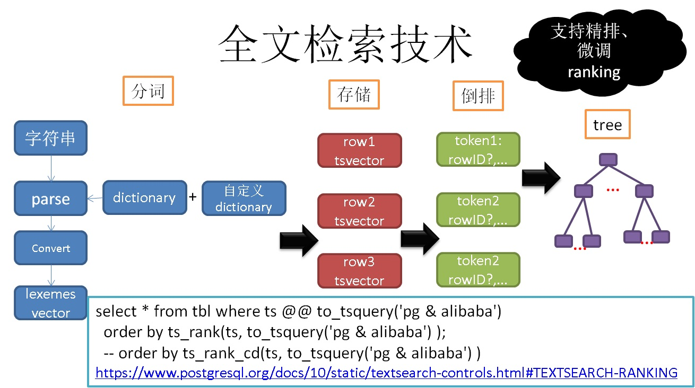
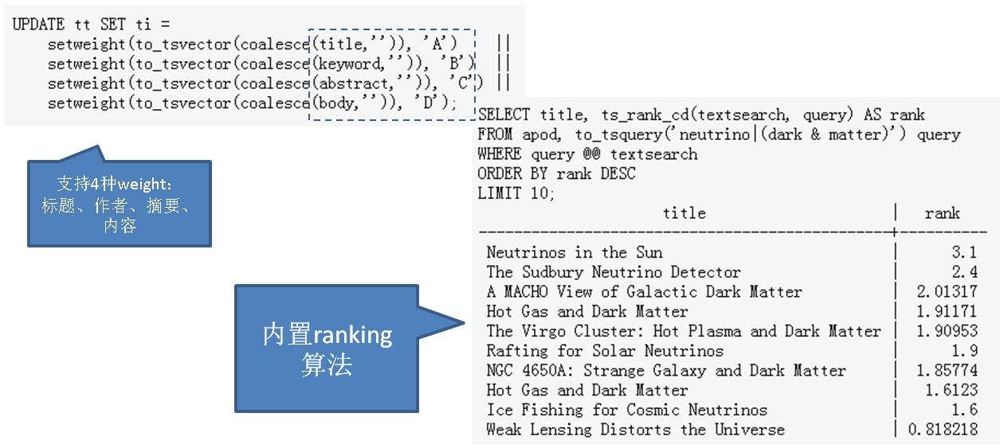
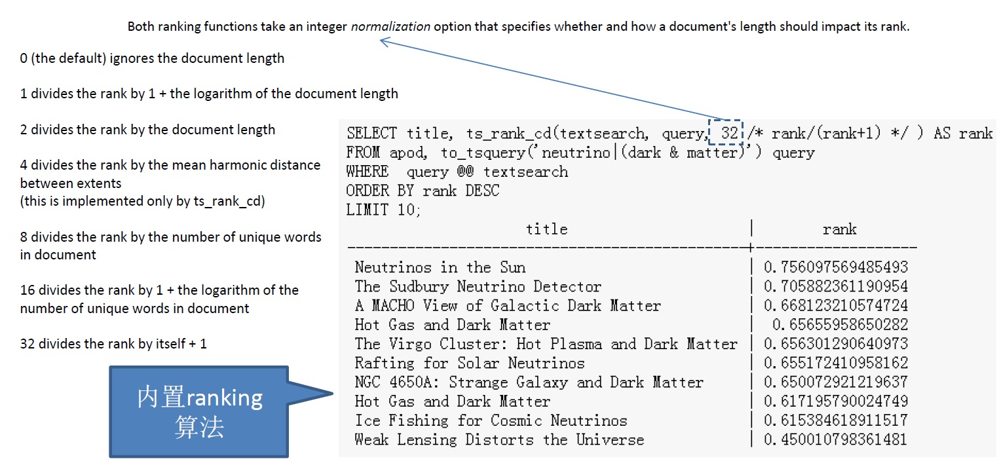
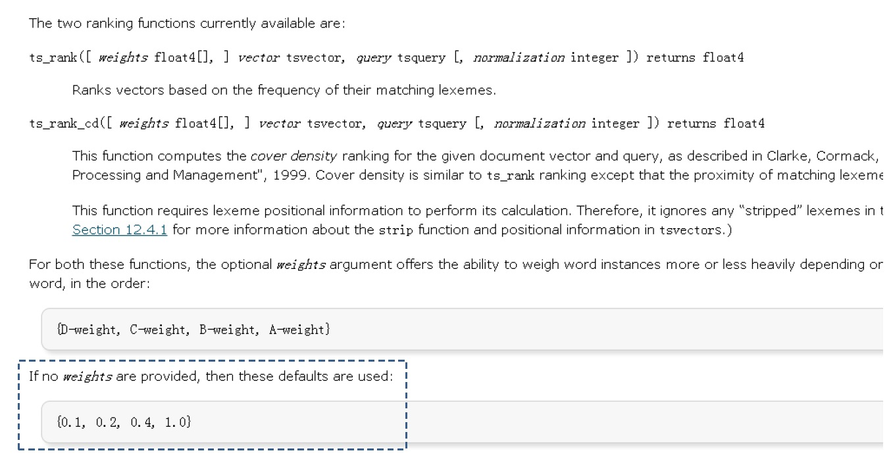
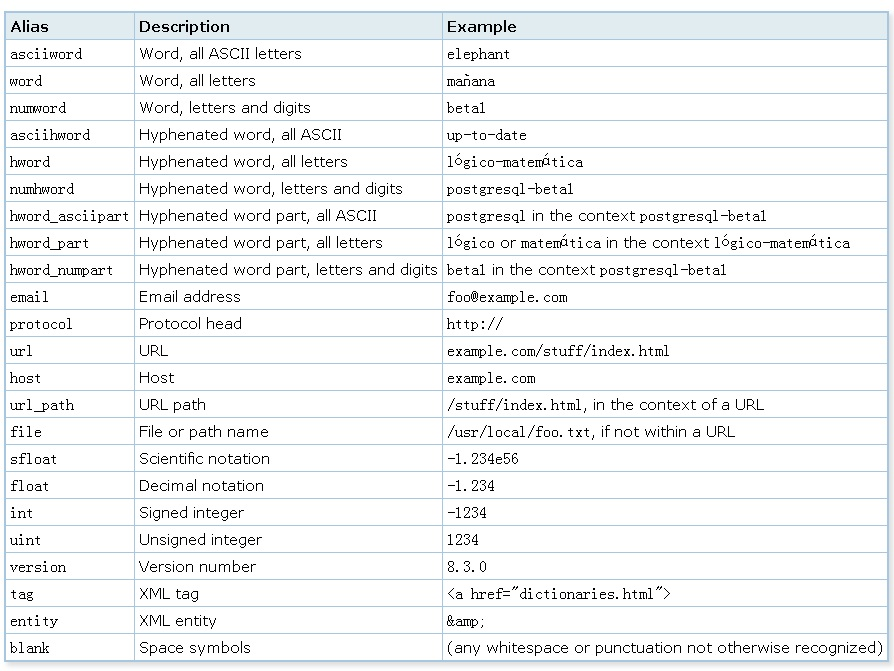
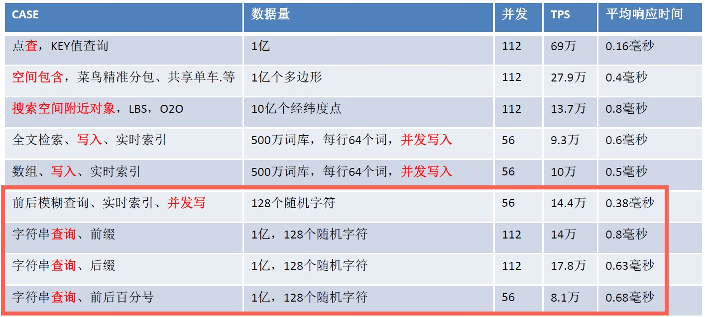
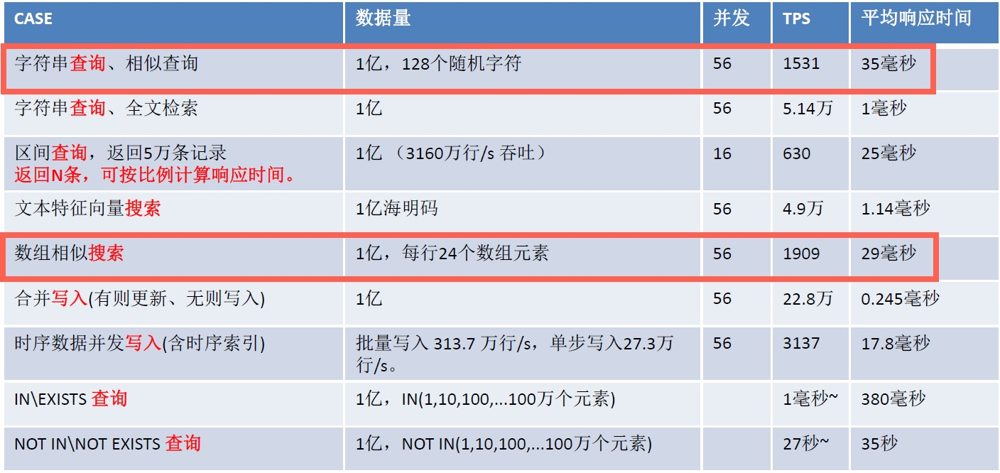
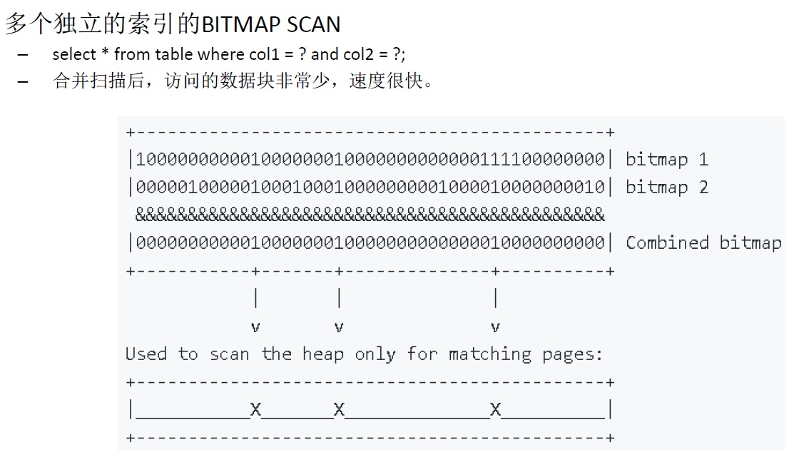
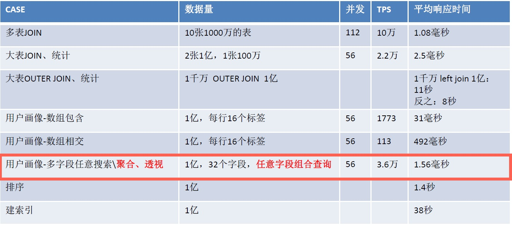

## 用PostgreSQL 做实时高效 搜索引擎 - 全文检索、模糊查询、正则查询、相似查询、ADHOC查询  
                            
### 作者                            
digoal                            
                            
### 日期                            
2017-12-05                           
                            
### 标签                            
PostgreSQL , 搜索引擎 , GIN , ranking , high light , 全文检索 , 模糊查询 , 正则查询 , 相似查询 , ADHOC查询     
                            
----                            
                            
## 背景      
字符串搜索是非常常见的业务需求，它包括：      
      
1、前缀+模糊查询。（可以使用b-tree索引）      
  
```  
select * from tbl where col like 'ab%';  
  
或  
  
select * from tbl where col ~ '^ab';  
```  
      
2、后缀+模糊查询。（可以使用reverse(col)表达式b-tree索引）      
  
```  
select * from tbl where col like '%ab';  
  
或  
  
select * from tbl where col ~ 'ab$';  
  
写法  
  
select * from tbl where reverse(col) like 'ba%';  
  
或  
  
select * from tbl where reverse(col) ~ '^ba';  
```  
      
3、前后模糊查询。（可以使用pg_trgm和gin索引）      
      
https://www.postgresql.org/docs/10/static/pgtrgm.html    
  
```  
select * from tbl where col like '%ab%';  
  
或  
  
select * from tbl where col ~ 'ab';  
```  
      
4、全文检索。（可以使用全文检索类型以及gin或rum索引）     
  
```  
select * from tbl where tsvector_col @@ 'postgres & china | digoal:A' order by ts_rank(tsvector_col, 'postgres & china | digoal:A') limit xx;  
  
详细语法后面介绍  
```  
      
5、正则查询。（可以使用pg_trgm和gin索引）      
  
```  
select * from tbl where col ~ '^a[0-9]{1,5}\ +digoal$';  
```  
      
6、相似查询。（可以使用pg_trgm和gin索引）    
  
```  
select * from tbl order by similarity(col, 'postgre') desc limit 10;  
```  
  
7、ADHOC查询，任意字段组合查询。（通过bloom index, multi-index bitmap scan, gin-index bitmap scan 等索引都可以实现）     
  
```  
select * from tbl where a=? and b=? or c=? and d=? or e between ? and ? and f in (?);  
```  
      
通常来说，数据库并不具备3以后的加速能力，但是PostgreSQL的功能非常强大，它可以非常完美的支持这类查询的加速。（是指查询和写入不冲突的，并且索引BUILD是实时的。）      
      
用户完全不需要将数据同步到搜索引擎，再来查询，而且搜索引擎也只能做到全文检索，并不你做到正则、相似、前后模糊这几个需求。      
      
使用PostgreSQL可以大幅度的简化用户的架构，开发成本，同时保证数据查询的绝对实时性。      
     
## 一、全文检索  
全文检索中几个核心的功能：  
  
词典、分词语法、搜索语法、排序算法、效率、命中词高亮等。  
  
PostgreSQL都已经实现，并支持扩展。例如扩展词典、扩展排序算法等。  
  
  
  
支持4种文档结构（标题、作者、摘要、内容），可以在生成tsvector时指定。在一个tsvector中允许多个文档结构。  
  
文档结构在ranking算法中，被用于计算权值，例如在标题中命中的词权值可以设更大一些。  
  
  
  
支持掩码，主要用于调和很长的文本，调和ranking的输出。  
  
  
  
通过设置不同文档结构权值，调和ranking的输出。  
  
  
  
### 词典  
默认PG没有中文分词，但是好在我们可以基于text search框架扩展，例如开源的zhparser, jieba等中文分词插件。  
  
https://github.com/jaiminpan/pg_jieba  
  
https://github.com/jaiminpan/pg_scws  
  
甚至可以通过pljava, plpython等来实现对中文的分词，这个实际上是对应编程体系内的分词能力，通过PostgreSQL的过程语言引入，是不是很炫酷。  
  
[《使用阿里云PostgreSQL zhparser中文分词时不可不知的几个参数》](../201603/20160310_01.md)    
  
[《如何加快PostgreSQL结巴分词加载速度》](../201607/20160725_02.md)    
  
[《PostgreSQL Greenplum 结巴分词(by plpython)》](../201508/20150824_01.md)     
  
### 分词介绍  
1、parser，功能是将字符串转换为token（可以自定义parser）。  
  
default parser的token类别如下：  
  
    
  
例子  
  
```  
SELECT alias, description, token FROM ts_debug('http://example.com/stuff/index.html');  
  alias   |  description  |            token               
----------+---------------+------------------------------  
 protocol | Protocol head | http://  
 url      | URL           | example.com/stuff/index.html  
 host     | Host          | example.com  
 url_path | URL path      | /stuff/index.html  
```  
  
创建text parser的语法  
  
https://www.postgresql.org/docs/10/static/sql-createtsparser.html  
  
2、配合text search configuration 和dictionary，将token转换为lexemes  
  
例如创建了一个同义词字典  
  
```  
postgres        pgsql  
postgresql      pgsql  
postgre pgsql  
gogle   googl  
indices index*  
```  
  
然后用这个字典来将token转换为lexemes，转换后得到的是lexeme. (tsvector中存储的也是lexeme，并不是原始token)  
  
```  
mydb=# CREATE TEXT SEARCH DICTIONARY syn (template=synonym, synonyms='synonym_sample');  
mydb=# SELECT ts_lexize('syn','indices');  
 ts_lexize  
-----------  
 {index}  
(1 row)  
  
mydb=# CREATE TEXT SEARCH CONFIGURATION tst (copy=simple);  
mydb=# ALTER TEXT SEARCH CONFIGURATION tst ALTER MAPPING FOR asciiword WITH syn;  
mydb=# SELECT to_tsvector('tst','indices');  
 to_tsvector  
-------------  
 'index':1  
(1 row)  
  
mydb=# SELECT to_tsquery('tst','indices');  
 to_tsquery  
------------  
 'index':*  
(1 row)  
  
mydb=# SELECT 'indexes are very useful'::tsvector;  
            tsvector               
---------------------------------  
 'are' 'indexes' 'useful' 'very'  
(1 row)  
  
mydb=# SELECT 'indexes are very useful'::tsvector @@ to_tsquery('tst','indices');  
 ?column?  
----------  
 t  
(1 row)  
```  
  
创建text dictionary的语法  
  
https://www.postgresql.org/docs/10/static/sql-createtsdictionary.html  
  
3、将lexemes存储为tsvector  
  
text search configuration 决定了要存哪些东西。  
  
convert过程中，parser得到的token依次与configuration配置的dictionary匹配，并存储从dictionary中对应的lexeme。  
  
```  
ALTER TEXT SEARCH CONFIGURATION tsconfig名  
    ADD MAPPING FOR token类型1 WITH 字典1, 字典2, 字典3;  
  
如果使用这个tsconfig来转换文本为tsvector，那么对于 token类型1，首先与字典1匹配，如果匹配上了，会存储字典1中对应的lexeme，如果没有对应上，则继续搜索字典2......  
```  
  
创建text search configuration的语法  
  
https://www.postgresql.org/docs/10/static/sql-createtsconfig.html  
  
创建text search template的语法   
  
https://www.postgresql.org/docs/10/static/sql-createtstemplate.html  
  
4、控制参数  
  
通常parser有一些控制参数，例如是否输出单字、双字等。例如zhparser这个parser的参数如下：  
  
[《使用阿里云PostgreSQL zhparser中文分词时不可不知的几个参数》](../201603/20160310_01.md)    
  
5、文档结构  
  
标题、作者、摘要、内容  
  
使用ABCD来表示。  
  
### 搜索语法  
1、tsquery为搜索输入，支持与、或、反、距离语法，如下  
  
to_tsquery creates a tsquery value from querytext, which must consist of   
single tokens separated by the tsquery operators   
  
```  
& (AND), | (OR), ! (NOT), and <-> (FOLLOWED BY) and <?> (距离多少?),    
```  
  
possibly grouped using parentheses.   
In other words, the input to to_tsquery must already follow the general   
rules for tsquery input, as described in Section 8.11.2.   
  
The difference is that while basic tsquery input takes the tokens at face value,   
to_tsquery normalizes each token into a lexeme using the specified or default configuration,   
and discards any tokens that are stop words according to the configuration.   
For example:  
   
```
c有两个位置，在匹配距离时，两个都可以。
postgres=# select to_tsvector('a b c c');
     to_tsvector     
---------------------
 'a':1 'b':2 'c':3,4
(1 row)

相邻
postgres=# select to_tsvector('a b c c') @@ to_tsquery('a <-> b');
 ?column? 
----------
 t
(1 row)

相邻, 实际上就是position相减=1
postgres=# select to_tsvector('a b c c') @@ to_tsquery('a <1> b');
 ?column? 
----------
 t
(1 row)

距离为2，实际上就是position相减=2
postgres=# select to_tsvector('a b c c') @@ to_tsquery('a <2> c');
 ?column? 
----------
 t
(1 row)

距离为3，实际上就是position相减=3
postgres=# select to_tsvector('a b c c') @@ to_tsquery('a <3> c');
 ?column? 
----------
 t
(1 row)

距离为2，实际上就是position相减=2
postgres=# select to_tsvector('a b c c') @@ to_tsquery('a <2> b');
 ?column? 
----------
 f
(1 row)
```
  
2、支持文档结构，语法如下  
  
As in basic tsquery input, weight(s) can be attached to each lexeme to restrict it to match only tsvector lexemes of those weight(s). For example:  
  
```  
SELECT to_tsquery('english', 'Fat | Rats:AB');  
    to_tsquery      
------------------  
 'fat' | 'rat':AB  
```  
  
3、支持前缀匹配，语法如下  
  
  
Also, * can be attached to a lexeme to specify prefix matching:  
  
```  
SELECT to_tsquery('supern:*A & star:A*B');  
        to_tsquery          
--------------------------  
 'supern':*A & 'star':*AB  
```  
  
4、支持thesaurus字典嵌套，自动翻译。例如    
  
to_tsquery can also accept single-quoted phrases. This is primarily useful when the configuration includes a thesaurus dictionary that may trigger on such phrases. In the example below, a thesaurus contains the rule supernovae stars : sn:  
  
```  
SELECT to_tsquery('''supernovae stars'' & !crab');  
  to_tsquery  
---------------  
 'sn' & !'crab'  
```  
  
5、搜索操作符为```@@```    
  
```  
select * from tbl where $tsvector_col @@ $tsquery;  
```  
  
### 排序算法  
通常全文检索分为两个层面，一个层面是匹配，另一个层面是亲和（rank）。  
  
1、内置了几个RANKING算法，代码如下  
  
src/backend/utils/adt/tsrank.c  
  
2、ts_rank和ts_rank_cd介绍  
  
PostgreSQL provides two predefined ranking functions, which take into account lexical, proximity, and structural information; that is, they consider how often the query terms appear in the document, how close together the terms are in the document, and how important is the part of the document where they occur.  
  
You can write your own ranking functions and/or combine their results with additional factors to fit your specific needs.  
  
The two ranking functions currently available are:  
  
```  
ts_rank([ weights float4[], ] vector tsvector, query tsquery [, normalization integer ]) returns float4  
```  
  
Ranks vectors based on the frequency of their matching lexemes.  
  
```  
ts_rank_cd([ weights float4[], ] vector tsvector, query tsquery [, normalization integer ]) returns float4  
```  
  
ts_rank_cd为cover density ranking  
  
described in Clarke, Cormack, and Tudhope's "Relevance Ranking for One to Three Term Queries" in the journal "Information Processing and Management", 1999. Cover density is similar to ts_rank ranking except that the proximity of matching lexemes to each other is taken into consideration.  
  
2\.1、以上两个ranking计算函数都支持文档结构权重。支持权重微调，作为数组参数输入。不输入则使用默认值。  
  
For both these functions, the optional weights argument offers the ability to weigh word instances more or less heavily depending on how they are labeled. The weight arrays specify how heavily to weigh each category of word, in the order:  
  
```  
{D-weight, C-weight, B-weight, A-weight}  
```  
  
If no weights are provided, then these defaults are used:  
  
```  
{0.1, 0.2, 0.4, 1.0}  
```  
  
2\.2、支持掩码参数，对付长文本  
  
Since a longer document has a greater chance of containing a query term it is reasonable to take into account document size,   
  
e.g.,   
  
a hundred-word document with five instances of a search word is probably more relevant than a thousand-word document with five instances.   
  
Both ranking functions take an integer normalization option that specifies whether and how a document's length should impact its rank.   
  
The integer option controls several behaviors, so it is a bit mask:   
  
you can specify one or more behaviors using | (for example, 2|4).  
  
掩码如下  
  
```  
0 (the default) ignores the document length  
  
1 divides the rank by 1 + the logarithm of the document length  
  
2 divides the rank by the document length  
  
4 divides the rank by the mean harmonic distance between extents (this is implemented only by ts_rank_cd)  
  
8 divides the rank by the number of unique words in document  
  
16 divides the rank by 1 + the logarithm of the number of unique words in document  
  
32 divides the rank by itself + 1  
```  
  
If more than one flag bit is specified, the transformations are applied in the order listed.  
  
Here is an example that selects only the ten highest-ranked matches:  
  
例子  
  
```  
SELECT title, ts_rank_cd(textsearch, query) AS rank  
FROM apod, to_tsquery('neutrino|(dark & matter)') query  
WHERE query @@ textsearch  
ORDER BY rank DESC  
LIMIT 10;  
                     title                     |   rank  
-----------------------------------------------+----------  
 Neutrinos in the Sun                          |      3.1  
 The Sudbury Neutrino Detector                 |      2.4  
 A MACHO View of Galactic Dark Matter          |  2.01317  
 Hot Gas and Dark Matter                       |  1.91171  
 The Virgo Cluster: Hot Plasma and Dark Matter |  1.90953  
 Rafting for Solar Neutrinos                   |      1.9  
 NGC 4650A: Strange Galaxy and Dark Matter     |  1.85774  
 Hot Gas and Dark Matter                       |   1.6123  
 Ice Fishing for Cosmic Neutrinos              |      1.6  
 Weak Lensing Distorts the Universe            | 0.818218  
```  
  
This is the same example using normalized ranking:  
  
```  
SELECT title, ts_rank_cd(textsearch, query, 32 /* rank/(rank+1) */ ) AS rank  
FROM apod, to_tsquery('neutrino|(dark & matter)') query  
WHERE  query @@ textsearch  
ORDER BY rank DESC  
LIMIT 10;  
                     title                     |        rank  
-----------------------------------------------+-------------------  
 Neutrinos in the Sun                          | 0.756097569485493  
 The Sudbury Neutrino Detector                 | 0.705882361190954  
 A MACHO View of Galactic Dark Matter          | 0.668123210574724  
 Hot Gas and Dark Matter                       |  0.65655958650282  
 The Virgo Cluster: Hot Plasma and Dark Matter | 0.656301290640973  
 Rafting for Solar Neutrinos                   | 0.655172410958162  
 NGC 4650A: Strange Galaxy and Dark Matter     | 0.650072921219637  
 Hot Gas and Dark Matter                       | 0.617195790024749  
 Ice Fishing for Cosmic Neutrinos              | 0.615384618911517  
 Weak Lensing Distorts the Universe            | 0.450010798361481  
```  
  
Ranking can be expensive since it requires consulting the tsvector of each matching document, which can be I/O bound and therefore slow. Unfortunately, it is almost impossible to avoid since practical queries often result in large numbers of matches.  
  
### 效率  
  
1、写入效率  
  
500万个词的词库，随机提取64个，组成一个含64个词的分词字符串。包含全文检索GIN索引。  
  
**56个并发写入，每秒写入93955行，平均响应时间0.6毫秒。**  
  
[《HTAP数据库 PostgreSQL 场景与性能测试之 7 - (OLTP) 全文检索 - 含索引实时写入》](../201711/20171107_08.md)    
  
2、查询效率  
  
1亿条文本记录，并发全文检索查询。  
  
**56个并发查询，每秒查询51369次，平均响应时间1.1毫秒。**  
  
[《HTAP数据库 PostgreSQL 场景与性能测试之 14 - (OLTP) 字符串搜索 - 全文检索》](../201711/20171107_15.md)    
  
### 特殊功能 - HTML 高亮  
对于匹配上的文本，将其高亮显示.  
  
```  
ts_headline([ config regconfig, ] document text, query tsquery [, options text ]) returns text  
```  
  
例子  
  
```  
SELECT ts_headline('english',  
  'The most common type of search  
is to find all documents containing given query terms  
and return them in order of their similarity to the  
query.',  
  to_tsquery('query & similarity'));  
  
                        ts_headline                           
------------------------------------------------------------  
 containing given <b>query</b> terms  
 and return them in order of their <b>similarity</b> to the  
 <b>query</b>.  
  
SELECT ts_headline('english',  
  'The most common type of search  
is to find all documents containing given query terms  
and return them in order of their similarity to the  
query.',  
  to_tsquery('query & similarity'),  
  'StartSel = <, StopSel = >');  
                      ts_headline                        
-------------------------------------------------------  
 containing given <query> terms  
 and return them in order of their <similarity> to the  
 <query>.  
```  
  
### 特殊功能 - 生成文档统计信息  
sqlquery返回tsvector一列，统计这一列中，有哪些lexeme，每个lexeme出现在多少文本中，每个lexeme总共出现了多少次。  
  
```  
ts_stat(sqlquery text, [ weights text, ]  
        OUT word text, OUT ndoc integer,  
        OUT nentry integer) returns setof record  
```  
  
返回值  
  
```  
word text — the value of a lexeme  
  
ndoc integer — number of documents (tsvectors) the word occurred in  
  
nentry integer — total number of occurrences of the word  
```  
  
例子  
  
For example, to find the ten most frequent words in a document collection:  
  
```  
SELECT * FROM ts_stat('SELECT vector FROM apod')  
ORDER BY nentry DESC, ndoc DESC, word  
LIMIT 10;  
```  
  
The same, but counting only word occurrences with weight A or B:  
  
```  
SELECT * FROM ts_stat('SELECT vector FROM apod', 'ab')  
ORDER BY nentry DESC, ndoc DESC, word  
LIMIT 10;  
```  
  
### 特殊功能 - 设置文档结构  
设置tsvector属于哪个文档结构（标题、作者、摘要、内容）。  
  
```  
1、  
setweight(vector tsvector, weight "char")	  
  
assign weight to each element of vector	  
  
setweight('fat:2,4 cat:3 rat:5B'::tsvector, 'A')	  
'cat':3A 'fat':2A,4A 'rat':5A  
  
2、  
setweight(vector tsvector, weight "char", lexemes text[])  
  
assign weight to elements of vector that are listed in lexemes	  
  
setweight('fat:2,4 cat:3 rat:5B'::tsvector, 'A', '{cat,rat}')	  
'cat':3A 'fat':2,4 'rat':5A  
```  
  
### 特殊功能 - 调试文本  
1、调试token  
  
https://www.postgresql.org/docs/10/static/textsearch-debugging.html  
  
例子  
  
```  
ts_debug([ config regconfig, ] document text,  
         OUT alias text,  
         OUT description text,  
         OUT token text,  
         OUT dictionaries regdictionary[],  
         OUT dictionary regdictionary,  
         OUT lexemes text[])  
         returns setof record  
```  
  
```  
alias text — short name of the token type  
  
description text — description of the token type  
  
token text — text of the token  
  
dictionaries regdictionary[] — the dictionaries selected by the configuration for this token type  
  
dictionary regdictionary — the dictionary that recognized the token, or NULL if none did  
  
lexemes text[] — the lexeme(s) produced by the dictionary that recognized the token,   
or NULL if none did; an empty array ({}) means it was recognized as a stop word  
```  
  
2、调试 lexeme，可以使用ts_lexize判断某个token是否在某个字典里面有与之匹配的条目（lexeme）。  
  
```  
ts_lexize(dict regdictionary, token text) returns text[]  
```  
  
例子  
  
```  
SELECT ts_lexize('english_stem', 'stars');  
 ts_lexize  
-----------  
 {star}  
  
SELECT ts_lexize('english_stem', 'a');  
 ts_lexize  
-----------  
 {}  
```  
  
### 限制  
The length of each lexeme must be less than 2K bytes，单个lexeme不能大于2K字节。     
  
The length of a tsvector (lexemes + positions) must be less than 1 megabyte，单个tsvector不能大于1MB。      
  
```  
postgres=# select length(to_tsvector(string_agg(md5(random()::text), ' '))) from generate_series(1,100000);  
ERROR:  54000: string is too long for tsvector (3624424 bytes, max 1048575 bytes)  
LOCATION:  make_tsvector, to_tsany.c:185  
```  
  
The number of lexemes must be less than 2^64，单个tsvector中不能存储超过2的64次方个lexeme。  
  
Position values in tsvector must be greater than 0 and no more than 16,383，单个tsvector中，lexeme的位置值不能大于16,383  
  
The match distance in a <N> (FOLLOWED BY) tsquery operator cannot be more than 16,384，单个tsquery中，lexeme的距离值不能大于16,383  
  
No more than 256 positions per lexeme，同一个lexeme不能超过256个位置。  
  
The number of nodes (lexemes + operators) in a tsquery must be less than 32,768，单个tsvector不能存储超过32765个node(lexemes+位置)。     
  
超过限制的话，可以使用多个字段。  
  
## 二、模糊查询\正则查询\相似查询  
模糊查询、相似查询、正则匹配查询，都属于文本匹配的范畴，PostgreSQL通过gin和pg_trgm实现了这三种搜索的索引加速。  
  
性能如下：  
  
  
  
  
  
下面是实际的案例：  
  
[《HTAP数据库 PostgreSQL 场景与性能测试之 13 - (OLTP) 字符串搜索 - 相似查询》](../201711/20171107_14.md)    
  
[《HTAP数据库 PostgreSQL 场景与性能测试之 12 - (OLTP) 字符串搜索 - 前后模糊查询》](../201711/20171107_13.md)    
  
[《HTAP数据库 PostgreSQL 场景与性能测试之 11 - (OLTP) 字符串搜索 - 后缀查询》](../201711/20171107_12.md)    
  
[《HTAP数据库 PostgreSQL 场景与性能测试之 10 - (OLTP) 字符串搜索 - 前缀查询》](../201711/20171107_11.md)    
  
[《HTAP数据库 PostgreSQL 场景与性能测试之 9 - (OLTP) 字符串模糊查询、相似查询索引实时BUILD - 含索引实时写入》](../201711/20171107_10.md)    
  
  
## 三、ADHOC搜索  
  
ADHOC搜索，指任意字段组合搜索。例如一张表有N个列，N个列都可能被作为查询条件，因此有N！种组合，为了实现这种场景的高效率搜索，在PostgreSQL中提供了几种方法。  
  
1、分区表，可以实现一些字段搜索时的收敛。  
  
2、BLOOM过滤索引，支持任意组合的等值搜索。lossy 过滤。  
  
3、GIN多列复合索引，BITMAP SCAN。支持任意组合搜索，过滤到BLOCK级别。  
  
4、多个单列索引，BITMAP SCAN。数据库自动优化，根据COST评估选择index scan或bitmap scan，支持任意组合搜索，过滤到BLOCK级别。  
  
  
  
性能如下：  
  
  
  
下面是实际的案例：  
  
[《HTAP数据库 PostgreSQL 场景与性能测试之 20 - (OLAP) 用户画像圈人场景 - 多个字段任意组合条件筛选与透视》](../201711/20171107_21.md)    
  
[《PostgreSQL 多字段任意组合搜索的性能》](../201711/20171102_01.md)    
  
[《时间、空间、对象多维属性 海量数据任意多维 高效检索 - 阿里云RDS PostgreSQL最佳实践》](../201707/20170722_01.md)    
  
[《多字段，任意组合条件查询(无需建模) - 毫秒级实时圈人 最佳实践》](../201706/20170607_02.md)    
  
[《宝剑赠英雄 - 任意组合字段等效查询, 探探PostgreSQL多列展开式B树 (GIN)》](../201702/20170205_01.md)    
  
[《PostgreSQL 如何高效解决 按任意字段分词检索的问题 - case 1》](../201607/20160725_05.md)    
  
[《PostgreSQL 9.6 黑科技 bloom 算法索引，一个索引支撑任意列组合查询》](../201605/20160523_01.md)    
  
[《PostgreSQL bitmapAnd, bitmapOr, bitmap index scan, bitmap heap scan》](../201702/20170221_02.md)    
  
## 参考  
1、全文检索  
  
https://www.postgresql.org/docs/10/static/textsearch.html  
  
https://www.postgresql.org/docs/10/static/textsearch-controls.html#TEXTSEARCH-PARSING-QUERIES  
  
2、模糊、正则、相似查询  
  
https://www.postgresql.org/docs/10/static/pgtrgm.html  
  
3、ADHOC 查询  
  
https://www.postgresql.org/docs/10/static/indexes-bitmap-scans.html  
  
https://www.postgresql.org/docs/10/static/bloom.html  
  
https://www.postgresql.org/docs/10/static/gin.html  
  
4、  
  
[《从难缠的模糊查询聊开 - PostgreSQL独门绝招之一 GIN , GiST , SP-GiST , RUM 索引原理与技术背景》](../201612/20161231_01.md)    
  
[《PostgreSQL 全文检索加速 快到没有朋友 - RUM索引接口(潘多拉魔盒)》](../201610/20161019_01.md)    
  
[《PostgreSQL 全表 全字段 模糊查询的毫秒级高效实现 - 搜索引擎颤抖了》](../201701/20170106_04.md)    
  
  
  
<a rel="nofollow" href="http://info.flagcounter.com/h9V1"  ></a>  
  
  
  
  
  
  
## [digoal's 大量PostgreSQL文章入口](https://github.com/digoal/blog/blob/master/README.md "22709685feb7cab07d30f30387f0a9ae")
  
