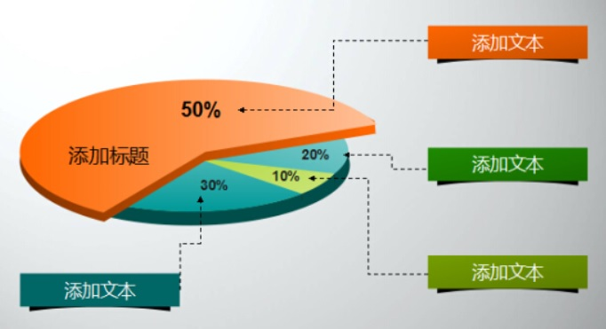
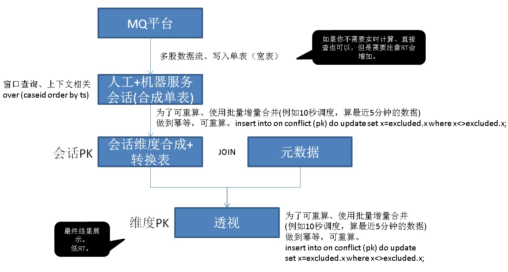

## 人、机客户服务质量 - 实时透视分析 - (多股数据流上下文相关实时分析,窗口保持) 
                        
### 作者                          
digoal                         
                           
### 日期                           
2017-12-08                      
                                    
### 标签                    
PostgreSQL , 多输入流 , 人工客服 , 机器客服 , 服务质量 , 多维透视 , 实时透视 , 窗口查询 , 流式计算 , 流式SQL , 阅后即焚 , 上下文相关 , 流式窗口 , 到达时间错乱 , 窗口保持 , 可重算 , 幂等      
                    
----                    
                     
## 背景         
通常一个服务型的产品，面向很多用户时，都会提供多种服务渠道：  
  
电话、WEB、人工客服。机器人客服。  
  
如何从各个维度（问题分类、地区分类。。。。）了解问题的 ： 解决率、解决时长柱状图、一次解决率（例如电话机器人、转人工、转机器人等，如果多次流转说明一次解决率太低）。  
  
  
  
这个透视分析，可以作为检验客户服务质量，提升用户体验的一个重要参考。  
  
以电商为例，一次问题，可能涉及：  
  
1、多股数据流表：  
  
电话、WEB、人工客服。机器人客服。  
  
2、数据流的内容涉及：  
  
卖家ID  
  
买家ID  
  
商品ID  
  
小二ID  
  
时间。  
  
3、多个元数据表可能包括：  
  
买家、买家、商品、问题、小二 属性、标签。  
  
4、透视维度包括：  
  
时间。  
  
地区。  
  
商品类别。  
  
问题类别。  
  
等。  
  
5、透视指标可能包括：  
  
解决率、解决时长柱状图、一次解决率（例如电话机器人、转人工、转机器人等，如果多次流转说明一次解决率太低）。  
  
  
  
如何做到实时透视？可以使用PostgreSQL的流式处理（实时、或异步阅后即焚）功能，以及insert on conflict幂等操作的功能。  
  
## 多股数据流的到达时间问题  
通常在一个大型的企业中，业务会拆得很细，甚至对于客服这样的系统，人工处理和电话处理都属于两个业务线。  
  
而数据流转往往通过MQ平台，也就是说不同业务线的数据流可能存在到达的时间差，或者消费的时间差。  
  
为了透视客户服务质量相关数据，需要用到多个数据流，势必面临到达时间差的问题。  
  
例如，对于某个CASE：  
  
人工服务是9点发生的。  
  
机器服务是9点01分发生的。  
  
但是他们属于多个数据流，最后的到达时间反过来了。那么在统计一解率时，可能出现误差。  
  
为了解决这个误差，需要做窗口保持的重复计算操作，做到实时统计结果可调整，可增量重算。（这个可以使用```insert on conflict do update xx=exclude.xx where xx<>excluded.xx```来实现）  
  
## demo  
以一解率维度为例，其他维度可以参考模仿。  
  
数据流如下：  
  
```  
会话流（多表） -> 流合并表 -> 转换表 -> (转换表+元数据表) 透视结果表  
```  
  
1、会话数据流  
  
流1，机器人  
  
```  
create table tbl_robot (  
  caseid int8,             -- 会话ID  
  crt_time timestamp,      -- 消息时间  
  message text,            -- 交互信息  
  custom_id int8,          -- 消费者ID  
  pro_id int,              -- 问题ID  
  others text              -- 其他字段  
);  
```  
  
流2，人工  
  
```  
create table tbl_human (  
  caseid int8,             -- 会话ID  
  crt_time timestamp,      -- 消息时间  
  message text,            -- 交互信息  
  custom_id int8,          -- 消费者ID  
  xiao2_id  int8,          -- 小二ID  
  pro_id int,              -- 问题ID  
  others text              -- 其他字段  
);  
```  
  
2、合并数据流表(这里可以使用分区表，便于维护)  
  
```  
create table tbl_session (  
  caseid int8,             -- 会话ID  
  crt_time timestamp,      -- 消息时间  
  message text,            -- 交互信息  
  custom_id int8,          -- 消费者ID  
  xiao2_id  int8,          -- 小二ID  
  pro_id int,              -- 问题ID  
  stream_id int,           -- 流ID, 1 表示robot, 2 表示human   
  others1 text,            -- 流1，其他字段  
  others2 text             -- 流2，其他字段  
);  
  
create index idx_tbl_session_1 on tbl_session (crt_time);  
create index idx_tbl_session_2 on tbl_session (caseid, crt_time);  
```  
  
3、创建源头规则，自动将会话数据流，合并到合并数据流表单表。  
  
通过规则，自动将数据合并到合并表。  
  
```  
create or replace rule r1 as on insert to tbl_robot do instead   
  insert into tbl_session   
    (caseid, crt_time, message, custom_id, pro_id, others1, stream_id)  
    values (NEW.caseid, NEW.crt_time, NEW.message, NEW.custom_id, NEW.pro_id, NEW.others, 1);  
  
create or replace rule r1 as on insert to tbl_human do instead   
  insert into tbl_session   
    (caseid, crt_time, message, custom_id, pro_id, others2, xiao2_id, stream_id)  
    values (NEW.caseid, NEW.crt_time, NEW.message, NEW.custom_id, NEW.pro_id, NEW.others, NEW.xiao2_id, 2);  
```  
  
4、元数据表  
  
略。  
  
5、会话状态转换表（批量可重算转换表）  
  
打个会话会涉及多条记录，这个DEMO的目的是找到人工回复后，用户从机器人找答案，从而识别人工回复的效率。  
  
也可以反之，求机器人回复的效率。  
  
```  
create table tbl_session_etl (  
  caseid int8 primary key,   -- 会话ID  
  s_crt_time timestamp,      -- 会话最开始的时间  
  e_crt_time timestamp,      -- 会话最后一条记录的时间  
  robot_to_human boolean,    -- 是否包含 从机器人切到人工  
  human_to_robot boolean     -- 是否包含 从人工切到机器人  
);  
```  
  
会话转换SQL，调度，可以重复执行。  
  
窗口大小可调整，容忍不同数据流的到达时间差异。  
  
```  
select caseid, max(s_crt_time) s_crt_time, max(e_crt_time) e_crt_time,   
       bool_or(lag=1 and stream_id=2) as robot_to_human,   
       bool_or(lag=2 and stream_id=1) as human_to_robot  
from  
(  
select caseid, min(crt_time) over w1 as s_crt_time, max(crt_time) over w1 as e_crt_time,   
       (case when (row_number() over w1) = 1 then stream_id else lag(stream_id) over w1 end) as lag,  
       stream_id   
from tbl_session   
where crt_time > now() - interval '10 min'           -- 10分钟内的会话数据, 可以自由调整这个窗口  
window w1 as (partition by caseid order by crt_time)   
) t  
group by caseid;  
```  
  
合并写入，使用如下SQL，可以重复执行。  
  
窗口大小可调整，容忍不同数据流的到达时间差异。  
  
```  
insert into tbl_session_etl (caseid, s_crt_time, e_crt_time, robot_to_human, human_to_robot)  
select caseid, max(s_crt_time) s_crt_time, max(e_crt_time) e_crt_time,   
       bool_or(lag=1 and stream_id=2) as robot_to_human,     
       bool_or(lag=2 and stream_id=1) as human_to_robot      
from  
(  
select caseid, min(crt_time) over w1 as s_crt_time, max(crt_time) over w1 as e_crt_time,   
       (case when (row_number() over w1) = 1 then stream_id else lag(stream_id) over w1 end) as lag,  
       stream_id   
from tbl_session    
where crt_time > now() - interval '10 min'             -- 10分钟内的会话数据, 可以自由调整这个窗口  
window w1 as (partition by caseid order by crt_time)   -- 开窗查询  
) t  
group by caseid  
on conflict (caseid)  
do update set   
  s_crt_time = excluded.s_crt_time,   
  e_crt_time = excluded.e_crt_time,   
  robot_to_human = excluded.robot_to_human,   
  human_to_robot = excluded.human_to_robot  
where       -- 当数据转换后的值，发送变化时，合并写入。  
  tbl_session_etl.s_crt_time<>excluded.s_crt_time  
or   
  tbl_session_etl.e_crt_time<>excluded.e_crt_time  
or  
  tbl_session_etl.robot_to_human<>excluded.robot_to_human  
or  
  tbl_session_etl.human_to_robot<>excluded.human_to_robot  
;  
```  
  
创建函数便于调用  
  
```  
create or replace function f_tbl_session_etl(interval) returns void as $$  
insert into tbl_session_etl (caseid, s_crt_time, e_crt_time, robot_to_human, human_to_robot)  
select caseid, max(s_crt_time) s_crt_time, max(e_crt_time) e_crt_time,   
       bool_or(lag=1 and stream_id=2) as robot_to_human,     
       bool_or(lag=2 and stream_id=1) as human_to_robot      
from  
(  
select caseid, min(crt_time) over w1 as s_crt_time, max(crt_time) over w1 as e_crt_time,   
       (case when (row_number() over w1) = 1 then stream_id else lag(stream_id) over w1 end) as lag,  
       stream_id   
from tbl_session    
where crt_time > now() - $1             -- n分钟内的会话数据, 可以自由调整这个窗口  
window w1 as (partition by caseid order by crt_time)   -- 开窗查询  
) t  
group by caseid  
on conflict (caseid)  
do update set   
  s_crt_time = excluded.s_crt_time,   
  e_crt_time = excluded.e_crt_time,   
  robot_to_human = excluded.robot_to_human,   
  human_to_robot = excluded.human_to_robot  
where       -- 当数据转换后的值，发送变化时，合并写入。  
  tbl_session_etl.s_crt_time<>excluded.s_crt_time  
or   
  tbl_session_etl.e_crt_time<>excluded.e_crt_time  
or  
  tbl_session_etl.robot_to_human<>excluded.robot_to_human  
or  
  tbl_session_etl.human_to_robot<>excluded.human_to_robot  
;  
$$ language sql strict;  
```  
  
调度方法如下，完成自动修正：  
  
每10秒，统计10分钟内的数据。（不同流的到达时间差异，容忍度为10分钟。）    
  
每小时，统计全天内的数据。（不同流的到达时间差异，容忍度为全天。）    
  
6、会话统计表，统计一解率 (可选，如果不统计的话，就直接查询)    
  
天维度表  
  
```  
create table tbl_session_stat_day (  
  stat_dim text primary key,  
  robot_to_human_cnt int8,  
  human_to_robot_cnt int8  
);  
```  
  
分钟维度表  
  
```  
create table tbl_session_stat_min (  
  stat_dim text primary key,  
  robot_to_human_cnt int8,  
  human_to_robot_cnt int8  
);  
```  
  
统计调度SQL，可以重复执行。  
  
天  
  
```  
select to_char(s_crt_time, 'yyyymmdd') as stat_dim,   
       sum(case when robot_to_human then 1 else 0 end) robot_to_human_cnt,   
       sum(case when human_to_robot then 1 else 0 end) human_to_robot_cnt  
from tbl_session_etl  
group by 1;  
```  
  
分钟维度  
  
```  
select to_char(s_crt_time, 'yyyymmddhh24mi') as stat_dim,   
       sum(case when robot_to_human then 1 else 0 end) robot_to_human_cnt,   
       sum(case when human_to_robot then 1 else 0 end) human_to_robot_cnt  
from tbl_session_etl  
group by 1;  
```  
  
写入并合并，可以重复执行。  
  
```  
insert into tbl_session_stat_day   
select to_char(s_crt_time, 'yyyymmdd') as stat_dim,   
       sum(case when robot_to_human then 1 else 0 end) robot_to_human_cnt,   
       sum(case when human_to_robot then 1 else 0 end) human_to_robot_cnt  
from tbl_session_etl  
group by 1  
on conflict (stat_dim) do update  
set  
  robot_to_human_cnt = excluded.robot_to_human_cnt,  
  human_to_robot_cnt = excluded.human_to_robot_cnt  
where  
  tbl_session_stat_day.robot_to_human_cnt <> excluded.robot_to_human_cnt  
or  
  tbl_session_stat_day.human_to_robot_cnt <> excluded.human_to_robot_cnt  
;  
  
  
  
  
insert into tbl_session_stat_min    
select to_char(s_crt_time, 'yyyymmddhh24mi') as stat_dim,   
       sum(case when robot_to_human then 1 else 0 end) robot_to_human_cnt,   
       sum(case when human_to_robot then 1 else 0 end) human_to_robot_cnt  
from tbl_session_etl  
group by 1  
on conflict (stat_dim) do update  
set  
  robot_to_human_cnt = excluded.robot_to_human_cnt,  
  human_to_robot_cnt = excluded.human_to_robot_cnt  
where  
  tbl_session_stat_min.robot_to_human_cnt <> excluded.robot_to_human_cnt  
or  
  tbl_session_stat_min.human_to_robot_cnt <> excluded.human_to_robot_cnt  
;  
```  
  
创建函数便于调用  
  
```  
create or replace function f_tbl_session_stat_day() returns void as $$  
insert into tbl_session_stat_day   
select to_char(s_crt_time, 'yyyymmdd') as stat_dim,   
       sum(case when robot_to_human then 1 else 0 end) robot_to_human_cnt,   
       sum(case when human_to_robot then 1 else 0 end) human_to_robot_cnt  
from tbl_session_etl  
group by 1  
on conflict (stat_dim) do update  
set  
  robot_to_human_cnt = excluded.robot_to_human_cnt,  
  human_to_robot_cnt = excluded.human_to_robot_cnt  
where  
  tbl_session_stat_day.robot_to_human_cnt <> excluded.robot_to_human_cnt  
or  
  tbl_session_stat_day.human_to_robot_cnt <> excluded.human_to_robot_cnt  
;  
$$ language sql strict;  
  
  
  
create or replace function f_tbl_session_stat_min() returns void as $$  
insert into tbl_session_stat_min    
select to_char(s_crt_time, 'yyyymmddhh24mi') as stat_dim,   
       sum(case when robot_to_human then 1 else 0 end) robot_to_human_cnt,   
       sum(case when human_to_robot then 1 else 0 end) human_to_robot_cnt  
from tbl_session_etl  
group by 1  
on conflict (stat_dim) do update  
set  
  robot_to_human_cnt = excluded.robot_to_human_cnt,  
  human_to_robot_cnt = excluded.human_to_robot_cnt  
where  
  tbl_session_stat_min.robot_to_human_cnt <> excluded.robot_to_human_cnt  
or  
  tbl_session_stat_min.human_to_robot_cnt <> excluded.human_to_robot_cnt  
;  
$$ language sql strict;  
```  
  
### 性能压测  
  
1、高并发写入会话信息  
  
```  
vi test.sql  
  
\set caseid1 random(1,1000000)  
\set caseid2 random(1,1000000)  
\set custom_id1 random(1,100000)  
\set pro_id1 random(1,1000)  
\set custom_id2 random(1,100000)  
\set pro_id2 random(1,1000)  
\set xiao2_id random(1,100)  
insert into tbl_robot values (:caseid1, now(), 'test', :custom_id1, :pro_id1, 'test');  
insert into tbl_human values (:caseid2, now(), 'test', :custom_id2, :xiao2_id, :pro_id2, 'test');  
\sleep 500 us  
```  
  
```  
pgbench -M prepared -n -r -P 1 -f ./test.sql -c 32 -j 32 -T 120  
```  
  
**单条写入，约17.6万行/s.**  
  
**如果批量写入，可以做到100万+ 行/s**  
  
```  
transaction type: ./test.sql  
scaling factor: 1  
query mode: prepared  
number of clients: 32  
number of threads: 32  
duration: 120 s  
number of transactions actually processed: 10655120  
latency average = 0.360 ms  
latency stddev = 0.466 ms  
tps = 88792.101825 (including connections establishing)  
tps = 88804.892722 (excluding connections establishing)  
script statistics:  
 - statement latencies in milliseconds:  
         0.001  \set caseid1 random(1,1000000)  
         0.001  \set caseid2 random(1,1000000)  
         0.000  \set custom_id1 random(1,100000)  
         0.000  \set pro_id1 random(1,1000)  
         0.000  \set custom_id2 random(1,100000)  
         0.000  \set pro_id2 random(1,1000)  
         0.000  \set xiao2_id random(1,100)  
         0.178  insert into tbl_robot values (:caseid1, now(), 'test', :custom_id1, :pro_id1, 'test');  
         0.178  insert into tbl_human values (:caseid2, now(), 'test', :custom_id2, :xiao2_id, :pro_id2, 'test');  
```  
  
2、实时转换调度  
  
同时开启写入，（写入速度14.2万行/s。）  
  
```  
psql  
  
select f_tbl_session_etl(interval '5 sec');  
  
\watch 1  
  
Sat 09 Dec 2017 07:05:42 PM CST (every 1s)  
  
 f_tbl_session_etl   
-------------------  
   
(1 row)  
  
Time: 4515.817 ms (00:04.516)  
```  
  
处理最近71万行, 耗时4.5秒。处理速度约15.7万行/s。  
  
3、实时统计调度  
  
```  
postgres=# select f_tbl_session_stat_day();  
 f_tbl_session_stat_day   
------------------------  
   
(1 row)  
  
Time: 926.839 ms  
postgres=# select f_tbl_session_stat_min();  
 f_tbl_session_stat_min   
------------------------  
   
(1 row)  
  
Time: 1162.713 ms (00:01.163)  
```  
  
4、数据量  
  
**1.79亿。**  
  
```  
postgres=# select count(*) from tbl_session;  
   count     
-----------  
 179639156  
(1 row)  
  
Time: 1635.908 ms (00:01.636)  
  
postgres=# select count(*) from tbl_session_etl;  
  count    
---------  
 1000000  
(1 row)  
  
Time: 47.540 ms  
```  
  
5、性能指标：  
  
并发度|写入吞吐|写入延迟  
---|---|---  
32 | 17.6万行/s | 0.178毫秒  
  
1.79亿数据打散到全天写入的话，响应速度会更快。  
  
并发度|转换吞吐|转换延迟  
---|---|---  
1 | 15.7万行/s | 1秒  
  
并发度|统计吞吐|统计延迟  
---|---|---  
1 | 1000000行 | 1秒  
  
**统计信息查询性能，毫秒级延迟**  
  
```  
postgres=# select * from tbl_session_stat_day ;  
 stat_dim | robot_to_human_cnt | human_to_robot_cnt   
----------+--------------------+--------------------  
 20171209 |              80160 |              80453  
(1 row)  
  
Time: 6.476 ms  
  
postgres=# select * from tbl_session_stat_min;  
   stat_dim   | robot_to_human_cnt | human_to_robot_cnt   
--------------+--------------------+--------------------  
 201712091758 |              56558 |              56531  
 201712091800 |                  4 |                  4  
 201712091759 |                509 |                501  
 201712091757 |             236638 |             236657  
 201712091802 |               7273 |               7177  
 201712091817 |               8336 |               8358  
 201712091812 |                  0 |                  0  
 201712091814 |                 12 |                  8  
 201712091815 |                127 |                144  
 201712091813 |                  1 |                  1  
 201712091816 |               1688 |               1761  
 201712091905 |              56645 |              57046  
 201712091904 |                411 |                391  
 201712091906 |              23104 |              23015  
 201712091902 |                  0 |                  1  
(15 rows)  
  
Time: 6.695 ms  
```  
  
## 小结
本文的场景可以抽象为，数据来自多股数据流，数据流的到达时间可能有差异，目标是根据多股数据流的上下文相关，进行实时透视计算。   
   
需要用到数据流合并、窗口保持。   
  
需要可以重算和覆盖，数据流的合并用到了RULE技术，窗口保持和可重算用到了可设定范围窗口查询(window)和insert on conflict(合并写)技术。   
  
## 参考  
[《PostgreSQL 流式统计 - insert on conflict 实现 流式 UV(distinct), min, max, avg, sum, count ...》](../201711/20171123_02.md)    
  
[《HTAP数据库 PostgreSQL 场景与性能测试之 27 - (OLTP) 物联网 - FEED日志, 流式处理 与 阅后即焚 (CTE)》](../201711/20171107_28.md)    
  
[《经营、销售分析系统DB设计之PostgreSQL, Greenplum - 共享充电宝 案例实践》](../201709/20170923_01.md)   
  
[《HTAP数据库 PostgreSQL 场景与性能测试之 23 - (OLAP) 并行计算》](../201711/20171107_24.md)    
  
<a rel="nofollow" href="http://info.flagcounter.com/h9V1"  ></a>  
  
  
  
  
  
  
## [digoal's 大量PostgreSQL文章入口](https://github.com/digoal/blog/blob/master/README.md "22709685feb7cab07d30f30387f0a9ae")
  
