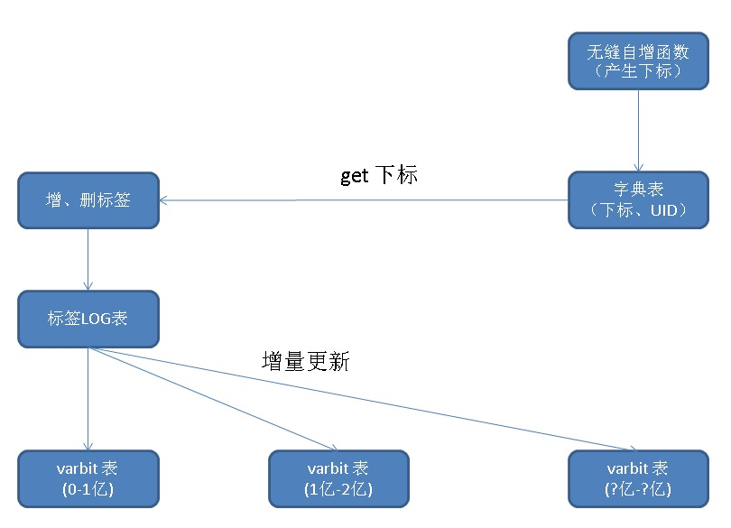

## 阿里云RDS PostgreSQL varbitx实践 - 流式标签 (阅后即焚流式批量计算) - 万亿级，任意标签圈人，毫秒响应  
                          
### 作者                          
digoal                          
                          
### 日期                          
2017-12-12                         
                          
### 标签                          
PostgreSQL , 阅后即焚 , 流计算 , 标签     
                          
----                          
                          
## 背景           
varbitx是阿里云RDS PG提供的一个BIT操作插件，使用这个插件已经成功的帮助用户提供了万亿级的毫秒级实时圈人功能。  
  
[《阿里云RDS for PostgreSQL varbitx插件与实时画像应用场景介绍》](../201705/20170502_01.md)   
  
[《基于 阿里云 RDS PostgreSQL 打造实时用户画像推荐系统(varbitx)》](../201610/20161021_01.md)    
  
结合阅后即焚的流式批量处理，schemaless UDF，可以实现高效的增、删标签，以及毫秒级别的按标签圈人。  
  
[《PostgreSQL 在铁老大订单系统中的schemaless设计和性能压测》](../201709/20170927_03.md)    
  
目标是百亿级用户体量，千万级标签。  
  
## 架构图  
  
  
  
## 阿里云varbitx 添加标签的函数接口  
  
1\. set_bit_array  
   
```  
set_bit_array (  
  varbit,  
  int,   -- 目标BIT (0|1)  
  int,   -- 填充BIT (0|1)  
  int[]  -- 目标位置  
) returns varbit  
   
  将指定位置的BIT设置为0|1，(起始位=0)，超出原始长度的部分填充0|1  
  例如 set_bit_array('111100001111', 0, 1, array[1,15]) 返回 1011000011111110  
```  
    
正在添加这个函数，用于一次性处理添加和删除的BIT的设置  
  
2\. set_bit_array    
    
```  
set_bit_array (  
  varbit,  
  int,     -- 1目标BIT (0|1)  
  int[]    -- 1目标位置  
  int,     -- 2目标BIT (0|1)  
  int[],   -- 2目标位置  
  int      -- 填充BIT (0|1)  
) returns varbit  
  
  将指定位置的BIT设置为0|1，(起始位=0)，超出原始长度的部分填充0|1  
  例如 set_bit_array('111100001111', 0, array[1,15], 1, array[0,4], 0) 返回 1011100011111110  
```  
  
## 阿里云varbitx 从bitmap得到字典ID  
  
1\. bit_posite    
    
```    
bit_posite (    
  varbit,     
  int,      -- (0|1)    
  boolean     
) returns int[]      
    
  返回 0|1 的位置，(起始位=0), true时正向返回，false时反向返回        
  例如 bit_posite ('11110010011', 1, true) 返回 [0,1,2,3,6,9,10]      
       bit_posite ('11110010011', 1, false) 返回 [10,9,6,3,2,1,0]     
```    
  
## 从字典ID得到USERID    
    
```  
select uid from dict where id = any ( bit_posite(x,x,x) );      
```  
  
## demo  
  
### 1 字典表  
  
将USERID转换为ARRAY下标，即字典表  
  
首先需要用到无缝自增ID  
  
[《PostgreSQL 无缝自增ID的实现 - by advisory lock》](../201610/20161020_02.md)    
  
1、字典表如下  
  
```  
create table dict(id int8 primary key, uid int8 not null);    
  
create unique index idx_dict_uid on dict (uid);    
```  
  
### 2 生成已有用户  
  
```  
create table t_uid (  
  uid int8 primary key  -- 已有用户的USER ID  
);  
```  
  
插入一批 USERID (一亿)  
  
```  
insert into t_uid select id from generate_series(1,100000000) t(id) order by random() ;  
```  
  
### 3 已有用户，一次性生成mapping下标  
  
```  
create sequence seq minvalue 0 start 0;    
  
  
insert into dict select nextval('seq'), uid from t_uid;    
  
  
select min(id),max(id),count(*) from dict;    
 min |   max    |   count     
-----+----------+-----------  
   0 | 99999999 | 100000000  
(1 row)  
```  
  
### 4 无缝自增下标 函数  
  
新增的用户，通过这个函数写入，确保无缝自增下标：  
  
```  
create or replace function f_uniq(i_uid int8) returns int as $$  
declare  
  newid int;    
  i int := 0;    
  res int;    
begin  
  loop   
    if i>0 then   
      perform pg_sleep(0.2*random());  
    else  
      i := i+1;  
    end if;  
  
    -- 获取已有的最大ID+1 (即将插入的ID)  
    select max(id)+1 into newid from dict;    
    if newid is not null then  
      -- 获取AD LOCK  
      if pg_try_advisory_xact_lock(newid) then  
        -- 插入  
        insert into dict (id,uid) values (newid,i_uid) ;    
        -- 返回此次获取到的UID  
        return newid;    
      else  
        -- 没有获取到AD LOCK则继续循环  
        continue;    
      end if;    
    else  
      -- 表示这是第一条记录，获取AD=0 的LOCK  
      if pg_try_advisory_xact_lock(0) then  
        insert into dict (id, uid) values (0, i_uid) ;    
        return 0;    
      else  
        continue;     
      end if;    
    end if;    
  end loop;    
    
  -- 如果因为瞬态导致PK冲突了，继续调用  
  exception when others then  
    select f_uniq(i_uid) into res;    
    return res;    
end;  
$$ language plpgsql strict;  
```  
  
例如，新增一个USERID。  
  
```  
select f_uniq(?);  
```  
  
### 5 从ID或者USERID或从USERID获得ID  
  
```  
create or replace function get_id_from_uid (int8) returns int8 as $$  
  select id from dict where uid=$1;  
$$ language sql strict;  
  
create or replace function get_uid_from_id (int8) returns int8 as $$  
  select uid from dict where id=$1;  
$$ language sql strict;  
```  
  
### 6 标签描述表  
  
```  
create table t_tags(tagid int primary key, desc text);    
```  
  
### 7 流式标签表  
  
1、UID范围映射表，落在什么区间的ID，对应什么后缀的表名  
  
建议在写入时，自动写到不同的t_tag_log表，这样的话，不需要在消费时过滤。  
  
```  
create table t_mapping (  
  dict_id int8range,      -- 字典ID区间  
  suffix text unique             -- 表名后缀  
);  
  
alter table t_mapping add constraint ck_exclude_dict_id exclude using gist(dict_id with &&);  -- 防止交叉区间  
```  
  
```  
insert into t_mapping values (int8range(0,100000000), '0');  
insert into t_mapping values (int8range(100000000,200000000), '1');  
insert into t_mapping values (int8range(200000000,300000000), '2');  
insert into t_mapping values (int8range(300000000,400000000), '3');  
```  
  
2、流式标签主表  
  
```  
create table t_tag_log (  
  dict_id int8,        -- 用户下标ID    
  action int2,         -- 删除0、新增1    
  tagid int,           -- 标签ID   
  crt_time timestamp   -- 时间    
);  
  
create index idx_t_tag_log on t_tag_log (crt_time);  
```  
  
3、创建流式标签子表  
  
按tagid分区，按t_mapping后缀对应关系分区。  
  
```  
do language plpgsql $$  
declare  
  x text;  
begin  
  for i in 0..63 loop  
    for x in select suffix from t_mapping loop  
      execute format('create table t_tag_log_%s_%s (like t_tag_log including all) inherits (t_tag_log)', i, x);  
    end loop;  
  end loop;  
end;  
$$;  
  
postgres=# \dt t_tag_log_*  
             List of relations  
 Schema |      Name      | Type  |  Owner     
--------+----------------+-------+----------  
 public | t_tag_log_0_0  | table | postgres  
 public | t_tag_log_0_1  | table | postgres  
 public | t_tag_log_0_2  | table | postgres  
 public | t_tag_log_0_3  | table | postgres  
 public | t_tag_log_10_0 | table | postgres  
 public | t_tag_log_10_1 | table | postgres  
 public | t_tag_log_10_2 | table | postgres  
 public | t_tag_log_10_3 | table | postgres  
 public | t_tag_log_11_0 | table | postgres  
 public | t_tag_log_11_1 | table | postgres  
.....................
```  
  
4、使用schema lessUDF写入标签信息  
  
```  
create or replace function ins_tag(v_uid int8, v_action int2, v_tagid int, v_crt_time timestamp) returns void as $$  
declare  
  i int := mod(v_tagid, 64);  
  x text;   
begin  
  select suffix into x from t_mapping where dict_id @> $1;  
  execute format ('insert into t_tag_log_%s_%s (dict_id, action, tagid, crt_time) values (%s, %s, %s, %L)', i, x, get_id_from_uid(v_uid), v_action, v_tagid, v_crt_time);  
end;  
$$ language plpgsql strict;  
```  
  
### 8 高速写入贴标签、删除标签  
  
```  
vi test.sql  
  
\set uid random(1,100000000)  
\set tagid random(1,100000)  
\set action random(0,1)  
select ins_tag (:uid::int8, :action::int2, :tagid, now()::timestamp);  
  
pgbench -M prepared -n -r -P 1 -f ./test.sql -c 32 -j 32 -T 120  
```  
  
单表单条写入性能：  
  
单表或多表 批量写入 性能可以超过100万行/s。     
  
```  
transaction type: ./test.sql  
scaling factor: 1  
query mode: prepared  
number of clients: 32  
number of threads: 32  
duration: 120 s  
number of transactions actually processed: 19013298  
latency average = 0.202 ms  
latency stddev = 0.267 ms  
tps = 158442.952245 (including connections establishing)  
tps = 158449.386772 (excluding connections establishing)  
script statistics:  
 - statement latencies in milliseconds:  
         0.001  \set uid random(1,100000000)  
         0.000  \set tagid random(1,100000)  
         0.000  \set action random(0,1)  
         0.200  insert into t_tag_log (dict_id, action, tagid, crt_time) values (get_id_from_uid(:uid), :action, :tagid, now());  
```  
  
### 9 标签反转表  
对应到前面的拆分模式，有两种模式，一种模式，使用多表存储。另一种模式使用单表存储。   
  
1、多表存储。  
  
标签反转主表  
  
```  
create table tag_userbitmap (  
  tagid int primary key,             -- 标签ID  
  usrebitmap varbit                  -- 用户bitmap  
);  
```  
  
标签反转子表  
  
```  
do language plpgsql $$  
declare  
  x text;  
begin  
  for x in select suffix from t_mapping loop  
    execute format('create table tag_userbitmap_%s (like tag_userbitmap including all) inherits (tag_userbitmap)', x);  
  end loop;  
end;  
$$;  
```  
  
tag不需要分区，因为增量更新时，没有行锁冲突，而且表大小也足够。  
  
```  
postgres=# \dt tag_userbitmap*  
              List of relations  
 Schema |       Name       | Type  |  Owner     
--------+------------------+-------+----------  
 public | tag_userbitmap   | table | postgres  
 public | tag_userbitmap_0 | table | postgres  
 public | tag_userbitmap_1 | table | postgres  
 public | tag_userbitmap_2 | table | postgres  
 public | tag_userbitmap_3 | table | postgres  
(5 rows)  
```  
  
2、单表存储，则加一列区分OFFSET。   
   
```
create table tag_userbitmap_single (
  tagid int ,               -- 标签ID
  bitmap_offset int ,       -- bit号段offset 值
  usrebitmap varbit,        -- 当前号段的bitmap
  primary key (tagid, bitmap_offset)
);
```
  
### 10 阅后即焚-流式消费标签，合并到标签反转表   
  
不考虑分区表时，这样来进行消费。  
  
```  
with tmp as (delete from t_tag_log     -- 查询哪个表  
  where ctid = any ( array (  
    select ctid from t_tag_log order by crt_time limit 100000       -- 批量处理10万条  
  )) returning *  
)   
select tagid, action, array_agg(dict_id) as dict_id from    
(  
  select row_number() over w1 as rn, *   
  from tmp   
  window w1 as (partition by dict_id, tagid order by crt_time desc)  -- 每个ID，每个标签，取最后一条  
) t where rn=1  
group by tagid, action                                               -- 聚合为下标数组  
;  
```  
  
### 11 schemaless UDF, 阅后即焚-流式消费标签，合并到标签反转表   
对应tag_userbimap表的设计（单表、或多表），schemaless UDF也有不同。   
    
1、多表：在UDF中自动拼接表名，将BITMAP合并到对应子表。  
      
```  
create or replace function merge_tags(v_limit int, v_suffix1 int, v_suffix2 int) returns void as $$  
declare  
  v_tagid int;  
  v_action int2;  
  v_dict_id int[];  
  v_offset int;  
  v_fixed_dict_id int[];  
begin  
  select substring(dict_id::text,'(\d+),') into v_offset from t_mapping where suffix=v_suffix2::text;   
  
  for v_tagid, v_action, v_dict_id in   
    execute format   
('  
with tmp as (delete from t_tag_log_%s_%s     -- 查询哪个表  
  where ctid = any ( array (  
    select ctid from t_tag_log_%s_%s order by crt_time limit %s       -- 批量处理N条  
  )) returning *  
)   
select tagid, action, array_agg(dict_id) as dict_id from    
(  
  select row_number() over w1 as rn, *   
  from tmp   
  window w1 as (partition by dict_id, tagid order by crt_time desc)   -- 每个ID，每个标签，取最后一条  
) t where rn=1  
group by tagid, action                                               
',   
v_suffix1, v_suffix2, v_suffix1, v_suffix2, v_limit)    
  
loop  
  select array(select unnest(v_dict_id)-v_offset) into v_fixed_dict_id;    
  -- raise notice '% ,% ,% ,%', v_tagid, v_action, v_dict_id, v_fixed_dict_id;  
  execute format('insert into tag_userbitmap_%s (tagid, usrebitmap) values (%s, set_bit_array(''0'', %s, %s, %L))   
                  on conflict (tagid)   
                  do update set usrebitmap=set_bit_array(tag_userbitmap_%s.usrebitmap, %s, %s, %L)',   
                  v_suffix2, v_tagid, v_action, 0, v_fixed_dict_id, v_suffix2, v_action, 0, v_fixed_dict_id);  
end loop;  
end;  
$$ language plpgsql strict;  
```  
  
2、单表：   
  
```  
create or replace function merge_tags(v_limit int, v_suffix1 int, v_suffix2 int) returns void as $$  
declare  
  v_tagid int;  
  v_action int2;  
  v_dict_id int[];  
  v_offset int;  
  v_fixed_dict_id int[];  
begin  
  select substring(dict_id::text,'(\d+),') into v_offset from t_mapping where suffix=v_suffix2::text;   
  
  for v_tagid, v_action, v_dict_id in   
    execute format   
('  
with tmp as (delete from t_tag_log_%s_%s     -- 查询哪个表  
  where ctid = any ( array (  
    select ctid from t_tag_log_%s_%s order by crt_time limit %s       -- 批量处理N条  
  )) returning *  
)   
select tagid, action, array_agg(dict_id) as dict_id from    
(  
  select row_number() over w1 as rn, *   
  from tmp   
  window w1 as (partition by dict_id, tagid order by crt_time desc)   -- 每个ID，每个标签，取最后一条  
) t where rn=1  
group by tagid, action                                               
',   
v_suffix1, v_suffix2, v_suffix1, v_suffix2, v_limit)    
  
loop  
  select array(select unnest(v_dict_id)-v_offset) into v_fixed_dict_id;    
  -- raise notice '% ,% ,% ,%', v_tagid, v_action, v_dict_id, v_fixed_dict_id;  
  execute format('insert into tag_userbitmap (tagid, bitmap_offset, usrebitmap) values (%s, %s, set_bit_array(''0'', %s, %s, %L))   
                  on conflict (tagid, bitmap_offset)   
                  do update set usrebitmap=set_bit_array(tag_userbitmap.usrebitmap, %s, %s, %L)',   
                  v_suffix2, v_suffix1, v_action, 0, v_fixed_dict_id, v_action, 0, v_fixed_dict_id);  
end loop;  
end;  
$$ language plpgsql strict;  
```  
  
3、单表和多表的函数接口是一样的，都是调用merge_tags函数，增量更新TAG，不同组合，允许并行调用。  
  
以下QUERY可以并行调用：  
  
```  
select merge_tags(100000, 0, 0);  
select merge_tags(100000, 0, 1);  
select merge_tags(100000, 0, 2);  
select merge_tags(100000, 0, 3);  
.....  
select merge_tags(100000, 63, 0);  
select merge_tags(100000, 63, 1);  
select merge_tags(100000, 63, 2);  
select merge_tags(100000, 63, 3);  
```  
  
### 12 查询包含哪些TAG的USEID  
这个SQL可以略微修改，包括coalesce，补齐varbit长度到固定长度等。     
  
full outer JOIN 得到最终的varbit。   
  
根据bitmap求dict_id, 再根据dict_id求user_id。      
  
```
多表：

select bit_posite(t1.usrebitmap||t2.usrebitmap||t3.usrebitmap||t4.usrebitmap, '1', true) 
from tag_userbitmap_0 t1 , ....
where tx.tagid in (....);

或单表：

create aggregate bit_agg (varbit order by offset) (sfunc = bitcat, stype=varbit) ;
select bit_posite(bit_and(tag), '1', true) from (
  select bit_agg(usrebitmap) from tag_userbitmap where tagid in (...) group by tagid
) t
```
     
详见用法  
  
[《阿里云RDS for PostgreSQL varbitx插件与实时画像应用场景介绍》](../201705/20170502_01.md)   
  
## 其他  
  
1、维护字典表（删除僵尸用户）  
  
2、同时收缩VARBITX  
  
## 查询某个用户有哪些标签  
这种点查，建议使用以下结构，数组作为标签。与本文相反。  
  
```  
create table t_user_tags(   
  uid int8 primary key,   -- 用户ID  
  tagid int[]             -- 标签ID  
);  
```  
  
## 性能优化案例续，分段、并行、游标
[《惊天性能！单RDS PostgreSQL实例 支撑 2000亿 - 实时标签透视案例》](../201712/20171223_01.md)  
  
## 相似案例  
  
[《PostgreSQL手机行业经营分析、决策系统设计 - 实时圈选、透视、估算》](../201711/20171126_01.md)    
  
[《阿里云RDS for PostgreSQL varbitx插件与实时画像应用场景介绍》](../201705/20170502_01.md)   
  
[《基于 阿里云 RDS PostgreSQL 打造实时用户画像推荐系统(varbitx)》](../201610/20161021_01.md)    
  
[《HTAP数据库 PostgreSQL 场景与性能测试之 32 - (OLTP) 高吞吐数据进出(堆存、行扫、无需索引) - 阅后即焚(JSON + 函数流式计算)》](../201711/20171107_33.md)    
  
[《HTAP数据库 PostgreSQL 场景与性能测试之 31 - (OLTP) 高吞吐数据进出(堆存、行扫、无需索引) - 阅后即焚(读写大吞吐并测)》](../201711/20171107_32.md)    
  
[《HTAP数据库 PostgreSQL 场景与性能测试之 27 - (OLTP) 物联网 - FEED日志, 流式处理 与 阅后即焚 (CTE)》](../201711/20171107_28.md)    
  
[《在PostgreSQL中实现update | delete limit - CTID扫描实践  (高效阅后即焚)》](../201608/20160827_01.md)    
  
[《PostgreSQL 异步消息实践 - Feed系统实时监测与响应(如 电商主动服务) - 分钟级到毫秒级的实现》](../201711/20171111_01.md)    
   
  
  
<a rel="nofollow" href="http://info.flagcounter.com/h9V1"  ></a>  
  
  
  
  
  
  
## [digoal's 大量PostgreSQL文章入口](https://github.com/digoal/blog/blob/master/README.md "22709685feb7cab07d30f30387f0a9ae")
  
