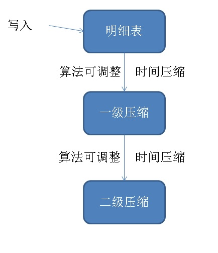

## PostgreSQL 时序数据案例 - 时间流逝, 自动压缩(时间粒度老化), 同比\环比     
      
### 作者      
digoal       
      
### 日期                                                                                                           
2017-12-25    
                                           
### 标签                                        
PostgreSQL , 时序数据 , rrd , rrdtool , round robin database , 自动压缩 , CTE , dml returning , 环比 , 同比 , KNN     
     
----     
     
## 背景     
时序数据库一个重要的特性是时间流逝压缩，例如1天前压缩为5分钟一个点，7天前压缩为30分钟一个点。    
  
PostgreSQL 压缩算法可定制。例如简单的平均值、最大值、最小值压缩，或者基于旋转门压缩算法的压缩。  
  
[《[未完待续] SQL流式案例 - 旋转门压缩(前后计算相关滑窗处理例子)》](../201712/20171205_01.md)    
  
[《旋转门数据压缩算法在PostgreSQL中的实现 - 流式压缩在物联网、监控、传感器等场景的应用》](../201608/20160813_01.md)    
  
本文介绍一种简单压缩的场景，类似RRD数据库，按时间维度，压缩为 平均值、最大值、最小值、总和、记录数 等维度。  
  
本文还介绍了窗口查询、同比、环比UDF(含KNN计算)、按时间分组均匀写入、等高级SQL用法。    
  
## 设计  
  
  
### 明细表  
  
```  
create table tbl (  
  id serial8 primary key,  -- 主键  
  sid int,                 -- 传感器ID  
  hid int,                 -- 指标ID  
  val float8,              -- 采集值  
  ts timestamp             -- 采集时间  
);   
  
create index idx_tbl on tbl(ts);  
```  
  
### 压缩表  
  
1、5分钟级压缩表  
  
```  
create table tbl_5min (  
  id serial8 primary key,  -- 主键  
  sid int,                 -- 传感器ID  
  hid int,                 -- 指标ID  
  val float8,              -- 继承，平均值，方便做环比分析  
  ts timestamp,            -- 继承，开始时间，方便做环比分析  
  val_min float8,              -- 最小值  
  val_max float8,              -- 最大值  
  val_sum float8,              -- 和  
  val_count float8,            -- 采集次数  
  ts_start timestamp,      -- 区间开始时间  
  ts_end timestamp         -- 区间结束时间  
);   
  
alter table tbl_5min inherit tbl;  
```  
  
2、30分钟级压缩表  
  
```  
create table tbl_30min (  
  id serial8 primary key,  -- 主键  
  sid int,                 -- 传感器ID  
  hid int,                 -- 指标ID  
  val float8,              -- 继承，平均值，方便做环比分析  
  ts timestamp,            -- 继承，开始时间，方便做环比分析  
  val_min float8,              -- 最小值  
  val_max float8,              -- 最大值  
  val_sum float8,              -- 和  
  val_count float8,            -- 采集次数  
  ts_start timestamp,      -- 区间开始时间  
  ts_end timestamp         -- 区间结束时间  
);   
  
alter table tbl_30min inherit tbl;  
```  
  
3、5分钟级压缩语句  
  
```  
with tmp1 as (  
  delete from only tbl where ts <= now()-interval '1 day' returning *  
)  
insert into tbl_5min  
  (sid, hid, val, ts, val_min, val_max, val_sum, val_count, ts_start, ts_end)   
select sid, hid, avg(val) as val, min(ts) as ts, min(val) as val_min, max(val) as val_max, sum(val) as val_sum, count(*) as val_count, min(ts) as ts_start, max(ts) as ts_end from   
tmp1  
group by sid, hid, substring(to_char(ts, 'yyyymmddhh24mi'), 1, 10) || lpad(((substring(to_char(ts, 'yyyymmddhh24mi'), 11, 2)::int / 5) * 5)::text, 2, '0');  
```  
  
4、30分钟级压缩语句  
  
```  
with tmp1 as (  
  delete from only tbl_5min where ts_start <= now()-interval '1 day' returning *  
)  
insert into tbl_30min  
  (sid, hid, val_min, val_max, val_sum, val_count, ts_start, ts_end)  
select sid, hid, min(val_min) as val_min, max(val_max) as val_max, sum(val_sum) as val_sum, sum(val_count) as val_count, min(ts_start) as ts_start, max(ts_end) as ts_end from   
tmp1     
group by sid, hid, substring(to_char(ts_start, 'yyyymmddhh24mi'), 1, 10) || lpad(((substring(to_char(ts_start, 'yyyymmddhh24mi'), 11, 2)::int / 30) * 30)::text, 2, '0');  
```  
  
## DEMO  
  
1、写入明细测试数据，1亿条，分布到10天。  
  
```  
insert into tbl (sid, hid, val, ts) select random()*1000, random()*5, random()*100,   -- 1000个传感器，每个传感器5个指标。  
  now()-interval '10 day' + (id * ((10*24*60*60/100000000.0)||' sec')::interval)   -- 倒推10天为起点 + (id * 每条记录的耗时)  
from generate_series(1,100000000) t(id);   
```  
  
2、5分钟压缩调度，1天前的数据，每隔1小时调度一次以下SQL。  
  
```  
with tmp1 as (  
  delete from only tbl where ts <= now()-interval '1 day' returning *  
)  
insert into tbl_5min  
  (sid, hid, val, ts, val_min, val_max, val_sum, val_count, ts_start, ts_end)   
select sid, hid, avg(val) as val, min(ts) as ts, min(val) as val_min, max(val) as val_max, sum(val) as val_sum, count(*) as val_count, min(ts) as ts_start, max(ts) as ts_end from   
tmp1  
group by sid, hid, substring(to_char(ts, 'yyyymmddhh24mi'), 1, 10) || lpad(((substring(to_char(ts, 'yyyymmddhh24mi'), 11, 2)::int / 5) * 5)::text, 2, '0');  
```  
  
3、30分钟压缩调度，7天前的数据，每隔1天调度一次以下SQL。  
  
```  
with tmp1 as (  
  delete from only tbl_5min where ts_start <= now()-interval '1 day' returning *  
)  
insert into tbl_30min  
  (sid, hid, val_min, val_max, val_sum, val_count, ts_start, ts_end)  
select sid, hid, min(val_min) as val_min, max(val_max) as val_max, sum(val_sum) as val_sum, sum(val_count) as val_count, min(ts_start) as ts_start, max(ts_end) as ts_end from   
tmp1     
group by sid, hid, substring(to_char(ts_start, 'yyyymmddhh24mi'), 1, 10) || lpad(((substring(to_char(ts_start, 'yyyymmddhh24mi'), 11, 2)::int / 30) * 30)::text, 2, '0');  
```  
  
## 小结  
1、根据interval取时间分组，用整型除法+乘法。    
  
例子：        
  
5分钟：  
  
```  
substring(to_char(ts, 'yyyymmddhh24mi'), 1, 10) || lpad(((substring(to_char(ts, 'yyyymmddhh24mi'), 11, 2)::int / 5) * 5)::text, 2, '0');  
```  
  
30分钟：  
  
```  
substring(to_char(ts_start, 'yyyymmddhh24mi'), 1, 10) || lpad(((substring(to_char(ts_start, 'yyyymmddhh24mi'), 11, 2)::int / 30) * 30)::text, 2, '0')  
```  
  
2、生成均匀分布的时序数据，使用PG的interval和generate_series，可以将写入时间均匀分配到对应区间。  
  
```  
insert into tbl (sid, hid, val, ts) select random()*1000, random()*5, random()*100,   -- 1000个传感器，每个传感器5个指标。  
  now()-interval '10 day' + (id * ((10*24*60*60/100000000.0)||' sec')::interval)   -- 倒推10天为起点 + (id * 每条记录的耗时)  
from generate_series(1,100000000) t(id);   
```  
  
3、时序数据库一个重要的特性是时间流逝压缩，例如1天前压缩为5分钟一个点，7天前压缩为30分钟一个点。    
  
PostgreSQL 压缩算法可定制。例如简单的平均值、最大值、最小值压缩，或者基于旋转门压缩算法的压缩。  
  
本文介绍了一种简单压缩的场景，类似RRD数据库，按时间维度，压缩为 平均值、最大值、最小值、总和、记录数 等维度。  
  
加上调度即可：  
  
[《PostgreSQL 定时任务方法2》](../201305/20130531_02.md)    
  
[《PostgreSQL Oracle 兼容性之 - DBMS_JOBS - Daily Maintenance - Timing Tasks(pgagent)》](../201305/20130531_01.md)    
  
4、压缩后包含区间、最大值、最小值、平均值、点数等值，可以用于绘制图形。     
  
5、结合PG的窗口函数，很容易绘制同比、环比的图形，SQL例句：  
  
索引，加速   
  
```  
create index idx_tbl_2 on tbl using btree (sid, hid, ts);  
create index idx_tbl_5min_2 on tbl_5min using btree (sid, hid, ts);  
create index idx_tbl_30min_2 on tbl_30min using btree (sid, hid, ts);  
```  
  
复合类型，返回环比值   
  
```  
create type tp as (id int8, sid int, hid int, val float8, ts timestamp);  
```  
  
获取环比值函数，返回指定SID,HID在某个时间点附近的一条记录，含KNN算法      
  
```  
create or replace function get_val(v_sid int, v_hid int, v_ts timestamp) returns tp as $$  
select t.tp from 
(
select 
(select (id, sid, hid, val, ts)::tp tp from only tbl where sid=1 and hid=1 and ts>= now() limit 1) 
union all 
select 
(select (id, sid, hid, val, ts)::tp tp from only tbl where sid=1 and hid=1 and ts< now() limit 1)
) t
order by (t.tp).ts limit 1;
$$ language sql strict;  
```  
  
同比、周环比、月环比(这些值也可以自动生成，避免每次查询时计算)：  
  
```  
select   
sid,   
hid,   
val,   
lag(val) over w1,                           -- 同比  
get_val(sid, hid, ts-interval '1 week'),    -- 周环比  
get_val(sid, hid, ts-interval '1 month')    -- 月环比  
  from tbl         -- where ...  ，时间区间打点。   
window w1 as (partition by sid, hid order by ts)   
;   
```  
  
6、结合PG的线性回归，可以绘制预测指标。以下为详细介绍的例子：  
  
[《PostgreSQL 多元线性回归 - 2 股票预测》](../201512/20151214_01.md)    
  
[《在PostgreSQL中用线性回归分析linear regression做预测 - 例子2, 预测未来数日某股收盘价》](../201503/20150305_01.md)    
  
[《PostgreSQL 线性回归 - 股价预测 1》](../201503/20150304_01.md)    
  
[《在PostgreSQL中用线性回归分析(linear regression) - 实现数据预测》](../201503/20150303_01.md)    
  
7、将压缩表继承到明细表，方便开发的使用，不需要再写UNION的SQL，直接查明细表，即可得到所有数据(包括压缩数据)。   
  
### 相关案例  
[《超时流式处理 - 没有消息流入的数据异常监控》](../201712/20171222_02.md)    
  
[《阿里云RDS PostgreSQL varbitx实践 - 流式标签 (阅后即焚流式批量计算) - 万亿级，任意标签圈人，毫秒响应》](../201712/20171212_01.md)    
  
[《PostgreSQL 流式统计 - insert on conflict 实现 流式 UV(distinct), min, max, avg, sum, count ...》](../201711/20171123_02.md)    
  
[《HTAP数据库 PostgreSQL 场景与性能测试之 32 - (OLTP) 高吞吐数据进出(堆存、行扫、无需索引) - 阅后即焚(JSON + 函数流式计算)》](../201711/20171107_33.md)    
  
[《HTAP数据库 PostgreSQL 场景与性能测试之 31 - (OLTP) 高吞吐数据进出(堆存、行扫、无需索引) - 阅后即焚(读写大吞吐并测)》](../201711/20171107_32.md)    
  
[《HTAP数据库 PostgreSQL 场景与性能测试之 27 - (OLTP) 物联网 - FEED日志, 流式处理 与 阅后即焚 (CTE)》](../201711/20171107_28.md)    
  
[《基于PostgreSQL的流式PipelineDB, 1000万/s实时统计不是梦》](../201510/20151015_01.md)    
    
## 参考  
1、https://en.wikipedia.org/wiki/RRDtool  
  
2、https://oss.oetiker.ch/rrdtool/  
  
RRD is round robin database.   
  
RRDtool is the OpenSource industry standard, high performance data logging and graphing system for time series data.   
  
RRDtool can be easily integrated in shell scripts, perl, python, ruby, lua or tcl applications.  
  
3、https://www.postgresql.org/docs/10/static/sql-expressions.html#SYNTAX-WINDOW-FUNCTIONS  
  
https://www.postgresql.org/docs/10/static/functions-window.html  
  
  
  
  
  
  
  
  
  
  
  
  
  
  
  
  
  
  
  
  
  
  
  
  
  
  
  
  
  
  
  
  
  
  
  
  
  
  
  
  
  
  
  
  
  
  
  
  
  
  
  
  
  
  
  
  
  
  
  
  
  
  
  
  
  
  
  
  
  
  
  
  
  
#### [PostgreSQL 许愿链接](https://github.com/digoal/blog/issues/76 "269ac3d1c492e938c0191101c7238216")
您的愿望将传达给PG kernel hacker、数据库厂商等, 帮助提高数据库产品质量和功能, 说不定下一个PG版本就有您提出的功能点. 针对非常好的提议，奖励限量版PG文化衫、纪念品、贴纸、PG热门书籍等，奖品丰富，快来许愿。[开不开森](https://github.com/digoal/blog/issues/76 "269ac3d1c492e938c0191101c7238216").  
  
  
#### [9.9元购买3个月阿里云RDS PostgreSQL实例](https://www.aliyun.com/database/postgresqlactivity "57258f76c37864c6e6d23383d05714ea")
  
  
#### [PostgreSQL 解决方案集合](https://yq.aliyun.com/topic/118 "40cff096e9ed7122c512b35d8561d9c8")
  
  
#### [德哥 / digoal's github - 公益是一辈子的事.](https://github.com/digoal/blog/blob/master/README.md "22709685feb7cab07d30f30387f0a9ae")
  
  

  
  
#### [PolarDB 学习图谱: 训练营、培训认证、在线互动实验、解决方案、生态合作、写心得拿奖品](https://www.aliyun.com/database/openpolardb/activity "8642f60e04ed0c814bf9cb9677976bd4")
  
  
#### [购买PolarDB云服务折扣活动进行中, 55元起](https://www.aliyun.com/activity/new/polardb-yunparter?userCode=bsb3t4al "e0495c413bedacabb75ff1e880be465a")
  
  
#### [About 德哥](https://github.com/digoal/blog/blob/master/me/readme.md "a37735981e7704886ffd590565582dd0")
  
