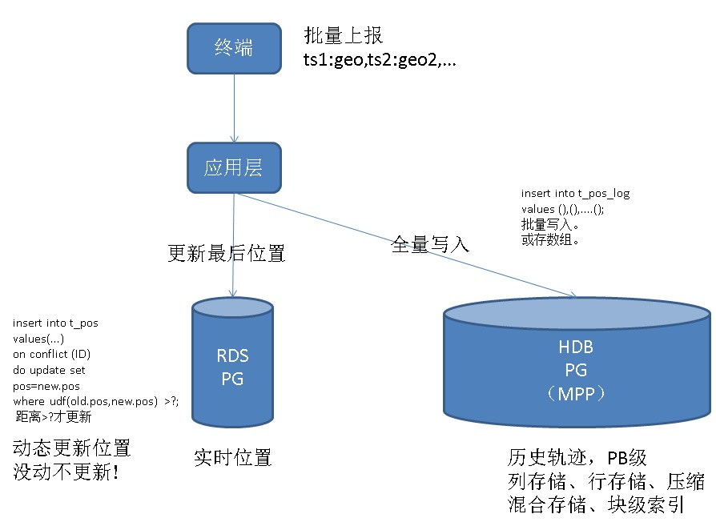

## PostgreSQL 实时位置跟踪+轨迹分析系统实践 - 单机顶千亿轨迹/天     
          
### 作者          
digoal           
          
### 日期                                                                                                               
2017-12-31     
                                               
### 标签                                            
PostgreSQL , PostGIS , 动态更新位置 , 轨迹跟踪 , 空间分析 , 时空分析    
         
----         
         
## 背景     
随着移动设备的普及，越来越多的业务具备了时空属性，例如快递，试试跟踪包裹、快递员位置。例如实体，具备了空间属性。  
  
例如餐饮配送，送货员位置属性。例如车辆，实时位置。等等。  
  
其中两大需求包括：  
  
1、对象位置实时跟踪，例如实时查询某个位点附近、或某个多边形区域内的送货员。  
  
2、对象位置轨迹记录和分析。结合地图，分析轨迹，结合路由算法，预测、生成最佳路径等。  
  
## DEMO  
以快递配送为例，GPS设备实时上报快递员轨迹，写入位置跟踪系统，同时将轨迹记录永久保存到轨迹分析系统。  
  
由于快递员可能在配送过程中停留时间较长（比如在某个小区配送时），上报的多条位置可能变化并不大，同时考虑到数据库更新消耗，以及位置的时效性，可以避免一些点的更新（打个比方，上一次位置和当前位置变化量在50米时，不更新）。  
  
动态更新可以减少数据库的更新量，提高整体吞吐能力。  
  
### 设计  
  
  
### 实时位置更新  
  
1、建表  
  
```  
create table t_pos (  
  uid int primary key,   -- 传感器、快递员、车辆、。。。对象ID  
  pos point,             -- 位置  
  mod_time timestamp     -- 最后修改时间  
);  
  
create index idx_t_pos_1 on t_pos using gist (pos);  
```  
  
真实环境中，我们可以使用PostGIS空间数据库插件，使用geometry数据类型来存储经纬度点。  
  
```  
create extension postgis;  
  
create table t_pos (  
  uid int primary key,   -- 传感器、快递员、车辆、。。。对象ID  
  pos geometry,          -- 位置  
  mod_time timestamp     -- 最后修改时间  
);  
  
create index idx_t_pos_1 on t_pos using gist (pos);  
```  
  
2、上报位置，自动根据移动范围，更新位置。  
  
例如，移动距离50米以内，不更新。  
  
```  
insert into t_pos values (?, st_setsrid(st_makepoint($lat, $lon), 4326), now())  
on conflict (uid)  
do update set pos=excluded.pos, mod_time=excluded.mod_time  
where st_distancespheroid(t_pos.pos, excluded.pos, 'SPHEROID["WGS84",6378137,298.257223563]') > ?;  -- 超过多少米不更新  
```  
  
### 历史轨迹保存  
  
通常终端会批量上报数据，例如每隔10秒上报10秒内采集的点，一次上报的数据可能包含多个点，在PostgreSQL中可以以数组存储。  
  
```  
create table t_pos_hist (  
  uid int,                  -- 传感器、快递员、车辆、。。。对象ID  
  pos point[],              -- 批量上报的位置  
  crt_time timestamp[]      -- 批量上报的时间点  
);   
  
create index idx_t_pos_hist_uid on t_pos_hist (uid);                 -- 对象ID  
create index idx_t_pos_hist_crt_time on t_pos_hist ((crt_time[1]));    -- 对每批数据的起始时间创建索引  
```  
  
有必要的话，可以多存一个时间字段，用于分区。  
  
### 历史轨迹分析  
  
## 动态位置变更压测  
写入并合并，同时判断当距离大于50时，才更新，否则不更新。  
  
（测试）如果使用point类型，则使用如下SQL  
  
```  
insert into t_pos values (1, point(1,1), now())  
on conflict (uid)  
do update set pos=excluded.pos, mod_time=excluded.mod_time  
where t_pos.pos <-> excluded.pos > 50;  
```  
  
（实际生产）如果使用PostGIS的geometry类型，则使用如下SQL  
  
```  
insert into t_pos values (1, st_setsrid(st_makepoint(120, 71), 4326), now())  
on conflict (uid)  
do update set pos=excluded.pos, mod_time=excluded.mod_time  
where st_distancespheroid(t_pos.pos, excluded.pos, 'SPHEROID["WGS84",6378137,298.257223563]') > 50;  
```  
  
### 压测  
  
首先生成1亿随机空间对象数据。  
  
```  
postgres=# insert into t_pos select generate_series(1,100000000), point(random()*10000, random()*10000), now();  
INSERT 0 100000000  
Time: 250039.193 ms (04:10.039)  
```  
  
压测脚本如下，1亿空间对象，测试动态更新性能（距离50以内，不更新）。  
   
```  
vi test.sql    
  
\set uid random(1,100000000)    
insert into t_pos    
select uid, point(pos[0]+random()*100-50, pos[1]+random()*100-50), now() from t_pos where uid=:uid   
on conflict (uid)   
do update set pos=excluded.pos, mod_time=excluded.mod_time   
where t_pos.pos <-> excluded.pos > 50;   
```  
  
  
压测结果，动态更新 21.6万点/s，187亿点/天。        
  
```  
pgbench -M prepared -n -r -P 1 -f ./test.sql -c 64 -j 64 -T 120   
  
number of transactions actually processed: 26014936
latency average = 0.295 ms
latency stddev = 0.163 ms
tps = 216767.645838 (including connections establishing)
tps = 216786.403543 (excluding connections establishing)
```  
  
## 轨迹写入压测  
  
每个UID，每批写入50条：写入速度约 467.5万点/s，4039亿点/天。    
  
压测时，写多表，压测使用动态SQL。  
  
```  
do language plpgsql $$  
declare  
begin  
  for i in 0..127 loop  
    execute 'create table t_pos_hist'||i||' (like t_pos_hist including all)';  
  end loop;  
end;  
$$;  
```  
  
```  
create or replace function import_test(int) returns void as $$  
declare  
begin  
  execute format('insert into t_pos_hist%s values (%s, %L, %L)', mod($1, 128), $1,   
  array[point(1,1), point(1,1), point(1,1), point(1,1), point(1,1), point(1,1), point(1,1), point(1,1), point(1,1), point(1,1), point(1,1), point(1,1), point(1,1), point(1,1), point(1,1), point(1,1), point(1,1), point(1,1), point(1,1), point(1,1), point(1,1), point(1,1), point(1,1), point(1,1), point(1,1), point(1,1), point(1,1), point(1,1), point(1,1), point(1,1), point(1,1), point(1,1), point(1,1), point(1,1), point(1,1), point(1,1), point(1,1), point(1,1), point(1,1), point(1,1), point(1,1), point(1,1), point(1,1), point(1,1), point(1,1), point(1,1), point(1,1), point(1,1), point(1,1), point(1,1)] ,  
  array['2018-01-01 10:10:10', '2018-01-01 10:10:10', '2018-01-01 10:10:10', '2018-01-01 10:10:10', '2018-01-01 10:10:10', '2018-01-01 10:10:10', '2018-01-01 10:10:10', '2018-01-01 10:10:10', '2018-01-01 10:10:10', '2018-01-01 10:10:10', '2018-01-01 10:10:10', '2018-01-01 10:10:10', '2018-01-01 10:10:10', '2018-01-01 10:10:10', '2018-01-01 10:10:10', '2018-01-01 10:10:10', '2018-01-01 10:10:10', '2018-01-01 10:10:10', '2018-01-01 10:10:10', '2018-01-01 10:10:10', '2018-01-01 10:10:10', '2018-01-01 10:10:10', '2018-01-01 10:10:10', '2018-01-01 10:10:10', '2018-01-01 10:10:10', '2018-01-01 10:10:10', '2018-01-01 10:10:10', '2018-01-01 10:10:10', '2018-01-01 10:10:10', '2018-01-01 10:10:10', '2018-01-01 10:10:10', '2018-01-01 10:10:10', '2018-01-01 10:10:10', '2018-01-01 10:10:10', '2018-01-01 10:10:10', '2018-01-01 10:10:10', '2018-01-01 10:10:10', '2018-01-01 10:10:10', '2018-01-01 10:10:10', '2018-01-01 10:10:10', '2018-01-01 10:10:10', '2018-01-01 10:10:10', '2018-01-01 10:10:10', '2018-01-01 10:10:10', '2018-01-01 10:10:10', '2018-01-01 10:10:10', '2018-01-01 10:10:10', '2018-01-01 10:10:10', '2018-01-01 10:10:10', '2018-01-01 10:10:10']);  
end;  
$$ language plpgsql strict;  
```  
  
```  
vi test1.sql  
  
\set uid random(1,100000000)  
select import_test(:uid);  
```  
  
```  
pgbench -M prepared -n -r -P 1 -f ./test1.sql -c 56 -j 56 -T 120   
  
  
number of transactions actually processed: 11220725  
latency average = 0.599 ms  
latency stddev = 5.452 ms  
tps = 93504.532256 (including connections establishing)  
tps = 93512.274135 (excluding connections establishing)  
```  
  
## 黑科技  
  
1、块级索引（BRIN），在时序属性字段上，建立块级索引，既能达到高效检索目的，又能节约索引空间，还能加速写入。  
  
[《PostgreSQL BRIN索引的pages_per_range选项优化与内核代码优化思考》](../201708/20170824_01.md)    
  
[《万亿级电商广告 - brin黑科技带你(最低成本)玩转毫秒级圈人(视觉挖掘姊妹篇) - 阿里云RDS PostgreSQL, HybridDB for PostgreSQL最佳实践》](../201708/20170823_01.md)    
  
[《PostGIS空间索引(GiST、BRIN、R-Tree)选择、优化 - 阿里云RDS PostgreSQL最佳实践》](../201708/20170820_01.md)    
  
[《自动选择正确索引访问接口(btree,hash,gin,gist,sp-gist,brin,bitmap...)的方法》](../201706/20170617_01.md)    
  
[《PostgreSQL 并行写入堆表，如何保证时序线性存储 - BRIN索引优化》](../201706/20170611_02.md)    
  
[《PostgreSQL 9种索引的原理和应用场景》](../201706/20170627_01.md)    
  
2、阿里云HDB PG特性：sort key , metascan   
  
与BRIN类似，适合线性数据，自动建立块级元数据(取值范围、平均值、CNT、SUM等)进行过滤。  
  
3、空间索引  
  
GiST, SP-GiST空间索引，适合空间数据、以及其他异构数据。  
  
4、动态合并写，根据位置变化量，自动判断是否需要合并更新。  
  
insert on conflict语法，在do update里面，可以进行条件过滤，当位置变化超过N米时，才进行更新。  
  
5、数组、JSON、KV等多值类型。  
  
特别适合多值属性，例如批量上传的轨迹，通常GPS终端上报位置并不是实时的，可能存在一定的 延迟（例如批量上报）。使用数组、JSON都可以存储。  
  
如果使用数组存储，将来分析轨迹时，依旧可以unnest解开，绘制轨迹。  
  
## 性能  
1、动态位置变更：1亿被跟踪对象，TPS：21.6万，动态更新21.6万点/s，187亿点/天。  
  
2、轨迹写入：tps约10万，写入467.5万点/s，4039亿点/天。  
  
## 参考  
  
[《PostGIS 空间数据学习建议》](../201708/20170809_01.md)    
  
[《PostgreSQL + PostGIS + SFCGAL 优雅的处理3D数据》](../201710/20171026_02.md)    
  
[《PostGIS 距离计算建议 - 投影 与 球 坐标系, geometry 与 geography 类型》](../201710/20171018_02.md)    
  
[《PostgreSQL 10 + PostGIS + Sharding(pg_pathman) + MySQL(fdw外部表) on ECS 部署指南(适合新用户)》](../201710/20171018_01.md)    
  
[《PostGIS 空间索引(GiST、BRIN、R-Tree)选择、优化 - 阿里云RDS PostgreSQL最佳实践》](../201708/20170820_01.md)    
  
[《PostGIS 坐标转换(SRID)的边界问题引发的专业知识 - ST_Transform》](../201706/20170622_01.md)    
  
[《无人驾驶背后的技术 - PostGIS点云(pointcloud)应用 - 2》](../201705/20170523_01.md)    
  
[《无人驾驶背后的技术 - PostGIS点云(pointcloud)应用 - 1》](../201705/20170519_02.md)    
  
[《geohash vs PostGIS》](../201704/20170422_01.md)    
  
[《视觉挖掘与PostGIS空间数据库的完美邂逅 - 广告营销\圈人》](../201703/20170328_04.md)    
  
[《PostGIS 点面叠加视觉判断输出》](../201709/20170914_01.md)    
  
[《PostGIS 多点几何类型 空字符构造异常CASE》](../201703/20170328_03.md)    
  
[《开放地图OpenStreetMap与PostGIS的三生三世十里桃花》](../201703/20170327_01.md)    
  
[《PostGIS 地理信息、栅格数据 多核并行处理(st_memunion, st_union)》](../201703/20170307_03.md)    
  
[《蜂巢的艺术与技术价值 - PostgreSQL PostGIS's hex-grid》](../201701/20170124_01.md)    
  
[《如何建立GIS测试环境 - 将openstreetmap的样本数据导入PostgreSQL PostGIS库》](../201609/20160906_01.md)    
  
[《GIS附近查找性能优化 - PostGIS long lat geometry distance search tuning using gist knn function》](../201308/20130806_01.md)    
  
  
  
<a rel="nofollow" href="http://info.flagcounter.com/h9V1"  ></a>  
  
  
  
  
  
  
## [digoal's 大量PostgreSQL文章入口](https://github.com/digoal/blog/blob/master/README.md "22709685feb7cab07d30f30387f0a9ae")
  
