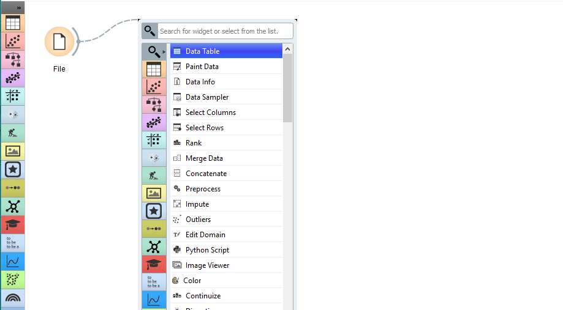
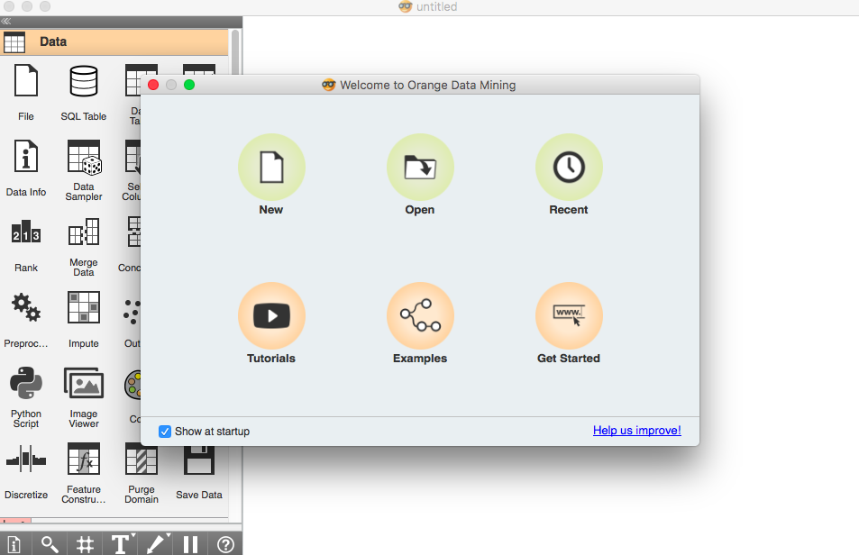
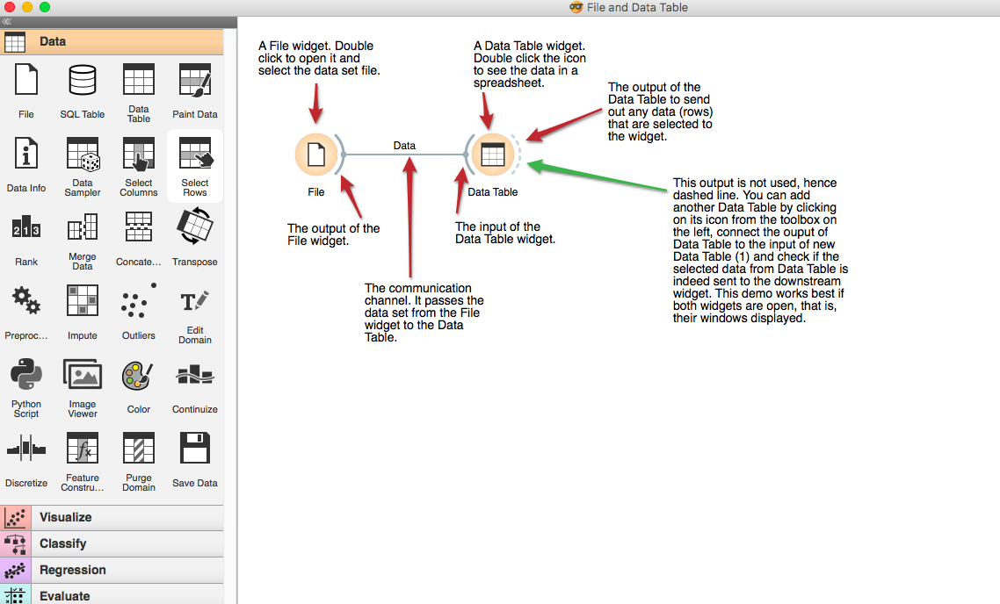
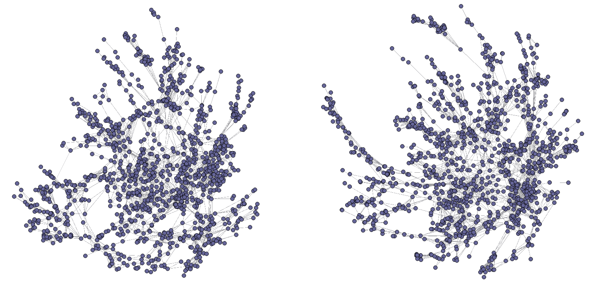
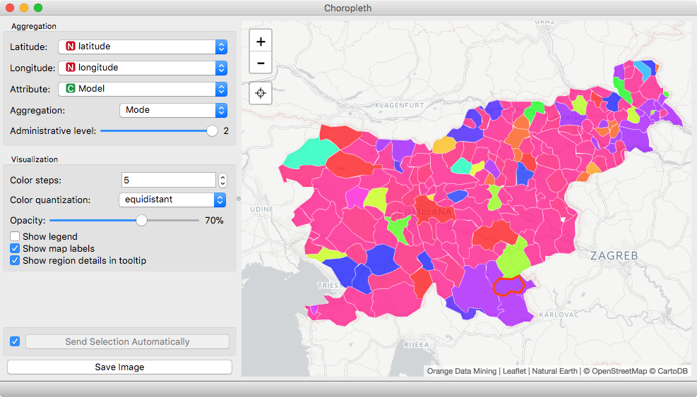
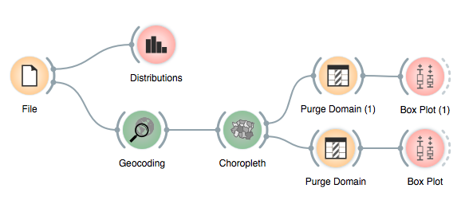
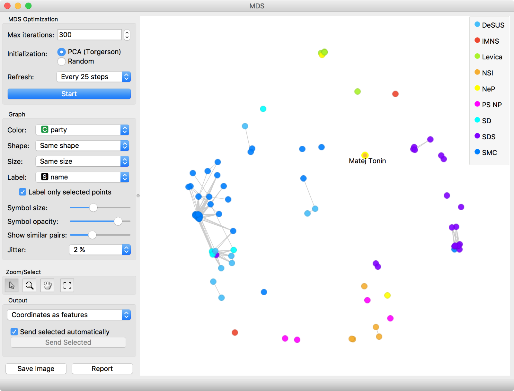
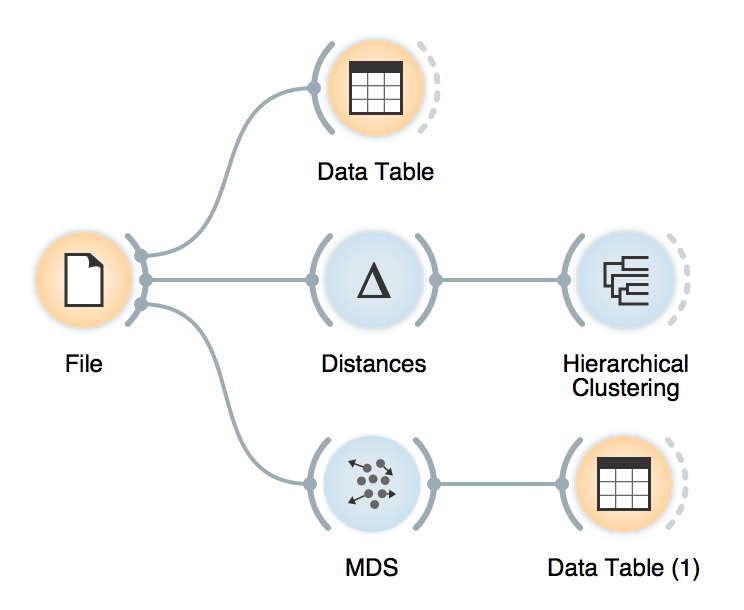
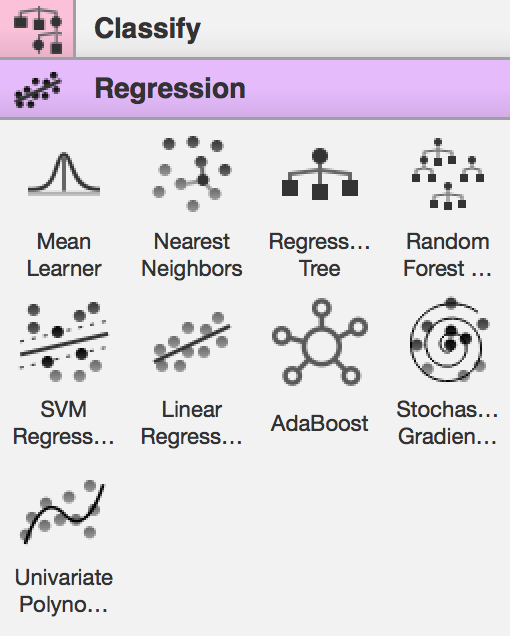
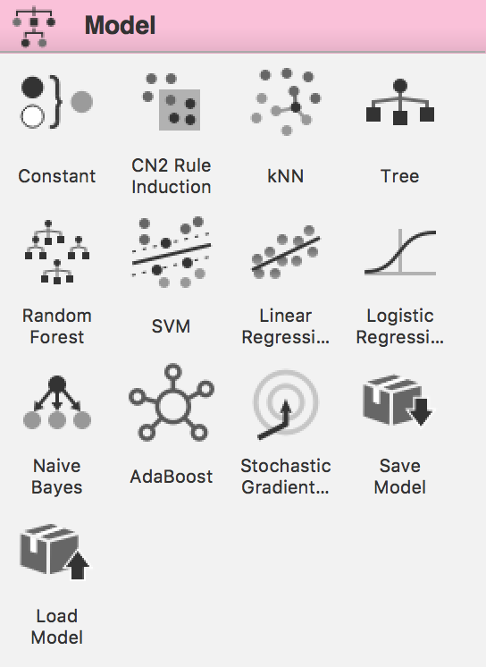

## [转载]易上手的数据挖掘、可视化与机器学习工具: Orange介绍
                        
### 作者                        
转载
                        
### 日期                        
2018-01-02                       
                        
### 标签                        
PostgreSQL , Orange3 , 可视化 , 时空数据  
                        
----                        
                        
## 背景     
可视化分析会是一个让枯燥的数据说话的快捷途径，降低可视化分析门槛，同时又保留它的编程能力，是非常重要的。   
  
如今数据种类越来越多，除了常见的数值、文本，还有数组、K-V、图像、空间数据、波、基因   等等。对可视化分析软件的要求也越来越高。    
        
## 原文  
http://blog.just4fun.site/Orange-startup.html
  
  
  
之前陆续写过几篇介绍数据挖掘/可视化项目[Caravel](https://github.com/airbnb/superset)的文章：  
  
- [caravel系列之安装与入门](http://blog.just4fun.site/caravel-startup-and-install.html)  
- [caravel系列之简易配置/定制](http://blog.just4fun.site/caravel-config.html)  
- [caravel系列之案例讲解与分析](http://blog.just4fun.site/caravel-demo-analysis.html)  
- [caravel系列之架构与源码浅析](http://blog.just4fun.site/caravel-code.html)  
  
如今直接去github搜索caravel已经搜不到它了。它最近换了新马甲，改叫[superset](https://github.com/apache/incubator-superset)，至于为何频繁改名（分别叫过Panoramix，Caravel，Superset），我猜核心作者早年混迹论坛，与人吵架，常换马甲：）  
  
对数据可视化的兴趣一直未减，近期发现两个有趣的项目，其一就是这篇文章的主角:[Orange](https://github.com/biolab/orange3),另一个是google发布的Embedding Projector（基于Tensorflow）  
  
## Orange初体验  
  
现在，你可以直接在[这里](http://orange.biolab.si/download/)下载到最新的Orange软件，Orange发布了各个平台的安装包，选择你当前平台的安装包，双击安装即可，安装过程十分友好。  
  
  
  
和许多数据分析的项目不同，其他项目多数面向数据分析从业人员、软件开发者。而Orange让各行各业对数据挖掘和可视化感兴趣的人都能参与其中，而不必有编程基础  
  
安装完毕打开软件，跟着以下教程即可对它做大致了解  
  
  
  
## 简介  
官方首页对这个项目的介绍是：  
  
>Open source machine learning and data visualization for novice and expert. Interactive data analysis workflows with a large toolbox.  
  
  
该项目源码开放，对新手友好，同时也胜任专业的数据分析工作。  
  
Orange是一个基于组件的数据挖掘软件，它包含了一组数据可视化、探索、预处理和建模的技术。  
  
它不但带有一个新手友好的用户界面，老司机们也可以把它用作Python的一个模块。  
  
## 标签  
如果要用一些简单的词描述它，我想到以下标签:  
  
- 开源  
- python  
- 数据可视化  
- 数据模式探索  
- 机器学习  
- 拖曳式  
- 积木化  
  
## 特点  
- 交互式的数据可视化探索：你可以用它做简单的分析，诸如统计分布、箱形图（Box plot）、散点图。也可以做深入挖掘，诸如使用决策树、聚类、热图等。通过智能的属性选择，你可以在2维平面上探索多维数据  
- 可视化编程：图形化界面允许你专注于探索数据，而不是编码。你要做的事只是在画布上拖曳小部件、连接它们、加载数据集，如此便可获得数据洞察力！  
- 适合用于教学（jupyter出自生物学家之手，Orange似乎也和生物学领域有关，他们都让数据分析工作的协作交流变得简单有趣）  
- 附加扩展功能：通过使用各种插件，我们可以做各种各样的事：  
  
```
 *  对外部数据源进行数据挖掘（数据库/网络）  
 *  自然语言处理以及文本挖掘  
 *  网络分析  
 *  关联规则分析  
```
  
  
  
## 优势  
我折腾过的数据可视化工具多而杂， 以下是我偏好Orange的几个原因  
  
- 安装极其建议（二进制安装包）  
- 对新手友好，易于上手，许多操作凭直觉即可甚至不需要文档  
- 让普通用户能使用机器学习去发现数据模式，这项工作之前往往需要技术背景  
- 支持excel文件直接导入  
- 对中文支持良好（目前尚未遇到乱码）  
- 可视化的编程方式，用户无需编码，数据在各个组件里流动，通过拖曳组件即可开始探索数据  
- 交互式的探索过程，每一个组件叠加都能及时得到反馈。如同REPL(读取﹣求值﹣输出循环)般敏捷顺滑  
  
## 不足  
同时也简单列出我认为不足的地方  
  
- 对数据源的支持不够丰富，目前Orange3只支持PostgreSQL数据库，当然这是站在开发者的角度的挑刺，普通用户对此没有需求  
- 无法像tableau一样把探索结果作为网页发布。不过浏览了一遍官方源码库，他们似乎有这个计划。把它和superset整合在一起，指不定能折腾出一个商业应用  
  
关于对数据库的支持，估计随着项目的推进，会慢慢完备起来，这块基本只是时间的问题。（PS：不过PostgreSQL, Greenplum实际上都非常强大，不仅仅能够完美的展现时空数据，还支持并行计算。）  
  
## 后续  
接下来有空我们分析下，这个项目在技术层面有哪些有趣的东西  
  
此外我还有兴趣对它做些本地化改进，包括但不限于汉化，有兴趣的小伙伴可以一起来折腾，我已经fork了一份源码：[orange3](https://github.com/openEduClub/orange3)  
  
## 参考  
- [orange3](https://github.com/biolab/orange3)  
- [orange.biolab.si](http://orange.biolab.si/)  
- [Orange-数据挖掘和机器学习软件](https://my.oschina.net/u/2306127/blog/548833)  
- [Orange：通过可视化编程或 Python 脚本进行数据挖掘、数据可视化、分析和机器学习](http://hao.jobbole.com/orange/)  
- [2UDA, 打包了Orange和PG](https://www.2ndquadrant.com/en/resources/pgpredict-predictive-analytics-postgresql/)  
  
## 补充
这里有大量的例子：  
  
http://blog.biolab.si/  
  
  
  
  
  
  
  
  
  
  
  
  
  
  
  
  
<a rel="nofollow" href="http://info.flagcounter.com/h9V1"  ></a>  
  
  
  
  
  
  
## [digoal's 大量PostgreSQL文章入口](https://github.com/digoal/blog/blob/master/README.md "22709685feb7cab07d30f30387f0a9ae")
  
