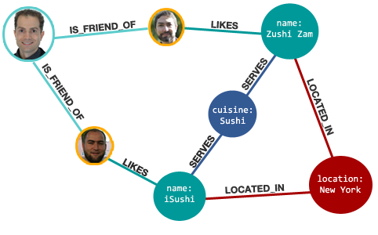

## PostgreSQL 图式搜索(graph search)实践 - 百亿级图谱，毫秒响应       
                              
### 作者                              
digoal                              
                              
### 日期                              
2018-01-02                             
                              
### 标签                              
PostgreSQL , CTE , 递归查询 , cycle , depth , loop , deep , level , 层级 , array , row array , JSON , 图式搜索 , graph search        
                              
----                              
                              
## 背景           
图式搜索是PostgreSQL在（包括流计算、全文检索、图式搜索、K-V存储、图像搜索、指纹搜索、空间数据、时序数据、推荐等）诸多特性中的一个。      
      
采用CTE语法，可以很方便的实现图式搜索（N度搜索、最短路径、点、边属性等）。      
      
其中图式搜索中的：层级深度，是否循环，路径，都是可表述的。      
      
      
      
      
      
## 例子      
创建1000万用户，每5万作为一个有牵连的群体，平均每个用户牵连500个用户，形成50亿的大规模关系网。         
      
在此基础上，演示如下      
      
1、如何实现N度搜索，边的属性查看，以及最短路径搜索等需求。      
      
2、如何去除循环点，如何控制深度，如何展示路径等。      
      
3、如何生成绘图数据。      
      
### 创建50亿测试数据      
创建1000万用户，每5万作为一个有牵连的群体，平均每个用户牵连500个用户，形成50亿的大规模关系网。         
        
1、建表，表结构如下，可以描述点、边。      
      
```      
create table a(      
  c1 int,                -- 点1      
  c2 int,                -- 点2      
  prop jsonb,            -- 点1,2对应的边的属性，使用JSON存储，包括权重，关系等等。      
  primary key (c1,c2)    -- 主键      
);      
      
create index idx_a_2 on a(c1, COALESCE(((prop ->> 'weight'::text))::float8, 0));    
```      
      
2、生成测试数据：      
      
```      
vi test.sql      
      
\set id random(1,10000000)      
insert into a select :id, ((width_bucket(:id,1,10000000,2000)-1)*50000 + (random()*50000)::int) from generate_series(1,1000) on conflict (c1,c2) do nothing;      
```      
      
      
```      
pgbench -M prepared -n -r -P 5 -f ./test.sql -c 50 -j 50 -t 100000        
```      
        
3、数据约340GB          
      
### 如何去除循环点、控制深度、展示路径      
      
1、当路径中重复出现某个点时，说明发生了循环。      
      
2、每递归一次，深度加1。      
      
3、使用数组存储路径。单列数组，或多列（ROW数组），多列路径参考:  https://www.postgresql.org/docs/10/static/queries-with.html         
      
SQL如下：      
      
```      
WITH RECURSIVE search_graph(      
  c1,   -- 点1      
  c2,   -- 点2      
  prop, -- 边的属性      
  depth, -- 深度，从1开始      
  path  -- 路径，数组存储      
) AS (      
        SELECT    -- ROOT节点查询      
          g.c1,   -- 点1      
          g.c2,   -- 点2      
          g.prop,   -- 边的属性      
          1 as depth,        -- 初始深度=1      
          ARRAY[g.c1] as path  -- 初始路径         
        FROM a AS g       
        WHERE       
          c1 = ?         -- ROOT节点=?      
      UNION ALL      
        SELECT     -- 递归子句      
          g.c1,    -- 点1      
          g.c2,    -- 点2      
          g.prop,          -- 边的属性      
          sg.depth + 1 as depth,    -- 深度+1      
          path || g.c1 as path   -- 路径中加入新的点      
        FROM a AS g, search_graph AS sg   -- 循环 INNER JOIN      
        WHERE       
          g.c1 = sg.c2         -- 递归JOIN条件      
          AND (g.c1 <> ALL(sg.path))        -- 防止循环      
          AND sg.depth <= ?    -- 搜索深度=?         
)      
SELECT * FROM search_graph;    -- 查询递归表，可以加LIMIT输出，也可以使用游标      
```      
        
### N度搜索      
N度搜索，如上SQL，输入sg.depth <= N。        
      
例如，搜索ROOT=31208的三度数据。      
      
```      
WITH RECURSIVE search_graph(      
  c1,   -- 点1      
  c2,   -- 点2      
  prop, -- 边的属性      
  depth, -- 深度，从1开始      
  path  -- 路径，数组存储      
) AS (      
        SELECT    -- ROOT节点查询      
          g.c1,   -- 点1      
          g.c2,   -- 点2      
          g.prop,   -- 边的属性      
          1 as depth,        -- 初始深度=1      
          ARRAY[g.c1] as path  -- 初始路径         
        FROM a AS g       
        WHERE       
          c1 = 31208         -- ROOT节点=?      
      UNION ALL      
        SELECT     -- 递归子句      
          g.c1,    -- 点1      
          g.c2,    -- 点2      
          g.prop,          -- 边的属性      
          sg.depth + 1 as depth,    -- 深度+1      
          path || g.c1 as path   -- 路径中加入新的点      
        FROM a AS g, search_graph AS sg   -- 循环 INNER JOIN      
        WHERE       
          g.c1 = sg.c2         -- 递归JOIN条件      
          AND (g.c1 <> ALL(sg.path))        -- 防止循环      
          AND sg.depth <= 3    -- 搜索深度=?         
)      
SELECT * FROM search_graph;    -- 查询递归表，可以加LIMIT输出，也可以使用游标          
```      
      
### 最短路径      
去掉搜索深度，并且在查询递归表的语句中，加上WHERE条件（过滤C2）以及LIMIT 1 即可。        
      
SQL如下：      
      
```      
WITH RECURSIVE search_graph(      
  c1,   -- 点1      
  c2,   -- 点2      
  prop, -- 边的属性      
  depth, -- 深度，从1开始      
  path  -- 路径，数组存储      
) AS (      
        SELECT    -- ROOT节点查询      
          g.c1,   -- 点1      
          g.c2,   -- 点2      
          g.prop,   -- 边的属性      
          1 as depth,        -- 初始深度=1      
          ARRAY[g.c1] as path  -- 初始路径         
        FROM a AS g       
        WHERE       
          c1 = ?         -- ROOT节点=?      
      UNION ALL      
        SELECT     -- 递归子句      
          g.c1,    -- 点1      
          g.c2,    -- 点2      
          g.prop,          -- 边的属性      
          sg.depth + 1 as depth,    -- 深度+1      
          path || g.c1 as path   -- 路径中加入新的点      
        FROM a AS g, search_graph AS sg   -- 循环 INNER JOIN      
        WHERE       
          g.c1 = sg.c2         -- 递归JOIN条件      
          AND (g.c1 <> ALL(sg.path))        -- 防止循环      
--          AND sg.depth <= ?    -- 搜索深度=?   也可以保留，防止搜索太深影响性能，比如深入10以后就不返回了        
)      
SELECT * FROM search_graph      
  where c2 = ?   -- 最短路径的终点      
  limit 1;       -- 查询递归表，可以加LIMIT输出，也可以使用游标      
```      
      
例如搜索 1 到 100 的最短路径。        
      
```      
WITH RECURSIVE search_graph(      
  c1,   -- 点1      
  c2,   -- 点2      
  prop, -- 边的属性      
  depth, -- 深度，从1开始      
  path  -- 路径，数组存储      
) AS (      
        SELECT    -- ROOT节点查询      
          g.c1,   -- 点1      
          g.c2,   -- 点2      
          g.prop,   -- 边的属性      
          1 as depth,        -- 初始深度=1      
          ARRAY[g.c1] as path  -- 初始路径         
        FROM a AS g       
        WHERE       
          c1 = 1         -- ROOT节点=?      
      UNION ALL      
        SELECT     -- 递归子句      
          g.c1,    -- 点1      
          g.c2,    -- 点2      
          g.prop,          -- 边的属性      
          sg.depth + 1 as depth,    -- 深度+1      
          path || g.c1 as path   -- 路径中加入新的点      
        FROM a AS g, search_graph AS sg   -- 循环 INNER JOIN      
        WHERE       
          g.c1 = sg.c2         -- 递归JOIN条件      
          AND (g.c1 <> ALL(sg.path))        -- 防止循环      
--          AND sg.depth <= ?    -- 搜索深度=? 也可以保留，防止搜索太深影响性能，比如深入10以后就不返回了        
)      
SELECT * FROM search_graph      
  where c2 = 100   -- 最短路径的终点      
  limit 1;       -- 查询递归表，可以加LIMIT输出，也可以使用游标     
```      
      
如果要控制深度，比如5度以内搜不到就不搜了，把搜索深度的条件再加进去即可。      
      
### 如何生成绘图数据      
为了提高响应速度，使用游标返回。      
      
```      
begin;      
declare cur1 cursor for $query;      
FETCH 1000 from cur1;      
....      
close cur1;      
end;      
```      
      
响应时间飞快，毫秒级响应。      
      
### 控制每一层的返回记录数      
层级越深，返回的记录就越多，而实际上在图搜索中，并不需要返回每个层级的所有记录，（例如只返回相关性较高的前N条，或者是满足权重大于多少的，前N条），从而控制每个层级的记录数。      
      
```      
WITH RECURSIVE search_graph(      
  c1,     -- 点1      
  c2,     -- 点2      
  prop,   -- 边的属性      
  depth,  -- 深度，从1开始      
  path   -- 路径，数组存储      
) AS (      
        select c1,c2,prop,depth,path,cycle from (      
        SELECT    -- ROOT节点查询      
          g.c1,   -- 点1      
          g.c2,   -- 点2      
          g.prop,   -- 边的属性      
          1 depth,        -- 初始深度=1      
          ARRAY[g.c1] path   -- 初始路径      
        FROM a AS g       
        WHERE       
          c1 = ?             -- ROOT节点=?      
          -- AND coalesce((prop->>'weight')::float8,0) >= ?        -- 相关性权重      
          -- ORDER BY coalesce((prop->>'weight')::float8,0) desc   -- 可以使用ORDER BY，例如返回权重排在前面的N条。      
          limit ?            -- 每个层级限制多少条？      
        ) t      
      UNION ALL      
        select c1,c2,prop,depth,path,cycle from (      
        SELECT     -- 递归子句       
          g.c1,    -- 点1      
          g.c2,    -- 点2      
          g.prop,          -- 边的属性      
          sg.depth + 1 depth,    -- 深度+1      
          path || g.c1 path    -- 路径中加入新的点      
        FROM a AS g, search_graph AS sg   -- 循环 INNER JOIN      
        WHERE       
          g.c1 = sg.c2         -- 递归JOIN条件      
          AND (g.c1 <> ALL(sg.path))        -- 防止循环      
          AND sg.depth <= ?    -- 搜索深度=?        
          -- AND coalesce((prop->>'weight')::float8,0) >= ?   -- 相关性权重      
          -- ORDER BY coalesce((prop->>'weight')::float8,0) desc   -- 可以使用ORDER BY，例如返回权重排在前面的N条。      
          limit ?            -- 每个层级限制多少条？                 
        ) t      
)      
SELECT * FROM search_graph;    -- 查询递归表，可以加LIMIT输出，也可以使用游标      
```      
      
例如，搜索root=31208的3度数据，同时限制每个层级返回100条。       
      
```      
WITH RECURSIVE search_graph(      
  c1,     -- 点1      
  c2,     -- 点2      
  prop,   -- 边的属性      
  depth,  -- 深度，从1开始      
  path   -- 路径，数组存储      
) AS (      
        select c1,c2,prop,depth,path from (      
        SELECT    -- ROOT节点查询      
          g.c1,   -- 点1      
          g.c2,   -- 点2      
          g.prop,   -- 边的属性      
          1 depth,        -- 初始深度=1      
          ARRAY[g.c1] path   -- 初始路径      
        FROM a AS g       
        WHERE       
          c1 = 31208            -- ROOT节点=?      
          -- AND coalesce((prop->>'weight')::float8,0) >= ?        -- 相关性权重      
          -- ORDER BY coalesce((prop->>'weight')::float8,0) desc   -- 可以使用ORDER BY，例如返回权重排在前面的N条。      
          limit ?            -- 每个层级限制多少条？      
        ) t      
      UNION ALL      
        select c1,c2,prop,depth,path from (      
        SELECT     -- 递归子句       
          g.c1,    -- 点1      
          g.c2,    -- 点2      
          g.prop,          -- 边的属性      
          sg.depth + 1 depth,    -- 深度+1      
          path || g.c1 path    -- 路径中加入新的点      
        FROM a AS g, search_graph AS sg   -- 循环 INNER JOIN      
        WHERE       
          g.c1 = sg.c2         -- 递归JOIN条件      
          AND (g.c1 <> ALL(sg.path))        -- 防止循环      
          AND sg.depth <= 3    -- 搜索深度=?        
          -- AND coalesce((prop->>'weight')::float8,0) >= ?   -- 相关性权重      
          -- ORDER BY coalesce((prop->>'weight')::float8,0) desc   -- 可以使用ORDER BY，例如返回权重排在前面的N条。      
          limit 100            -- 每个层级限制多少条？                 
        ) t      
)      
SELECT * FROM search_graph;    -- 查询递归表，可以加LIMIT输出，也可以使用游标     
```      
      
```      
   c1    |    c2    | prop | depth |          path          | cycle       
---------+----------+------+-------+------------------------+-------      
   31208 |   300008 |      |     1 | {31208}                | f      
   31208 |   300040 |      |     1 | {31208}                | f      
   31208 |   300046 |      |     1 | {31208}                | f      
   31208 |   300050 |      |     1 | {31208}                | f      
   31208 |   300061 |      |     1 | {31208}                | f      
   31208 |   300082 |      |     1 | {31208}                | f      
   31208 |   300093 |      |     1 | {31208}                | f      
.................  
 3032152 | 30347906 |      |     3 | {31208,300008,3032152} | f      
 3032152 | 30300272 |      |     3 | {31208,300008,3032152} | f      
 3032152 | 30316175 |      |     3 | {31208,300008,3032152} | f      
 3032152 | 30309844 |      |     3 | {31208,300008,3032152} | f      
 3032152 | 30336508 |      |     3 | {31208,300008,3032152} | f      
 3032152 | 30322201 |      |     3 | {31208,300008,3032152} | f      
 3032152 | 30312579 |      |     3 | {31208,300008,3032152} | f      
(300 rows)      
      
Time: 3.245 ms      
```      
      
响应速度3.2毫秒。(理由很简单，因为每一个层级都是索引命中，结合PG的cluster特性(按c1排序存储)，可以降低块数，再次提高性能)      
      
```    
                                                                      QUERY PLAN                                                                           
-------------------------------------------------------------------------------------------------------------------------------------------------------    
 CTE Scan on search_graph  (cost=25460.78..25482.78 rows=1100 width=77) (actual time=0.044..2.009 rows=300 loops=1)    
   Output: search_graph.c1, search_graph.c2, search_graph.prop, search_graph.depth, search_graph.path, search_graph.cycle    
   Buffers: shared hit=522    
   CTE search_graph    
     ->  Recursive Union  (cost=0.58..25460.78 rows=1100 width=77) (actual time=0.042..1.755 rows=300 loops=1)    
           Buffers: shared hit=522    
           ->  Limit  (cost=0.58..402.52 rows=100 width=77) (actual time=0.040..0.183 rows=100 loops=1)    
                 Output: g.c1, g.c2, g.prop, 1, (ARRAY[g.c1]), false    
                 Buffers: shared hit=97    
                 ->  Index Scan using a_pkey on public.a g  (cost=0.58..393024.56 rows=97782 width=77) (actual time=0.038..0.166 rows=100 loops=1)    
                       Output: g.c1, g.c2, g.prop, 1, ARRAY[g.c1], false    
                       Index Cond: (g.c1 = 31208)    
                       Buffers: shared hit=97    
           ->  Limit  (cost=2249.76..2502.53 rows=100 width=77) (actual time=0.372..0.473 rows=67 loops=3)    
                 Output: g_1.c1, g_1.c2, g_1.prop, ((sg.depth + 1)), ((sg.path || g_1.c1)), ((g_1.c1 = ANY (sg.path)))    
                 Buffers: shared hit=425    
                 ->  Nested Loop  (cost=2249.76..41872589.09 rows=16564685 width=77) (actual time=0.372..0.462 rows=67 loops=3)    
                       Output: g_1.c1, g_1.c2, g_1.prop, (sg.depth + 1), (sg.path || g_1.c1), (g_1.c1 = ANY (sg.path))    
                       Buffers: shared hit=425    
                       ->  WorkTable Scan on search_graph sg  (cost=0.00..22.50 rows=167 width=40) (actual time=0.001..0.011 rows=35 loops=3)    
                             Output: sg.c1, sg.c2, sg.prop, sg.depth, sg.path, sg.cycle    
                             Filter: ((NOT sg.cycle) AND (sg.depth <= 3))    
                       ->  Bitmap Heap Scan on public.a g_1  (cost=2249.76..248006.21 rows=99190 width=40) (actual time=0.010..0.010 rows=2 loops=104)    
                             Output: g_1.c1, g_1.c2, g_1.prop    
                             Recheck Cond: (g_1.c1 = sg.c2)    
                             Heap Blocks: exact=3    
                             Buffers: shared hit=425    
                             ->  Bitmap Index Scan on a_pkey  (cost=0.00..2224.96 rows=99190 width=0) (actual time=0.009..0.009 rows=19 loops=104)    
                                   Index Cond: (g_1.c1 = sg.c2)    
                                   Buffers: shared hit=422    
 Planning time: 0.436 ms    
 Execution time: 2.128 ms    
(32 rows)    
    
Time: 3.301 ms    
```    
      
压测，TPS：1.2万，平均响应时间5.2毫秒。          
      
```    
transaction type: ./test.sql    
scaling factor: 1    
query mode: prepared    
number of clients: 64    
number of threads: 64    
duration: 120 s    
number of transactions actually processed: 1463760    
latency average = 5.239 ms    
latency stddev = 1.171 ms    
tps = 12196.876360 (including connections establishing)    
tps = 12201.718092 (excluding connections establishing)    
script statistics:    
 - statement latencies in milliseconds:    
         5.295  WITH RECURSIVE search_graph(    
```    
      
## 图式搜索UDF封装例子    
将冗长的SQL封装成UDF，可以简化应用调用的接口。       
      
### 1、UDF1 ，返回记录      
      
```    
create or replace function graph_search1(    
  IN i_root int,                       -- 根据哪个节点开始搜      
  IN i_depth int  default 99999,       -- 搜索层级、深度限制    
  IN i_limit int8 default 2000000000,  -- 限制每一层返回的记录数    
  IN i_weight float8 default 0,        -- 限制权重    
  OUT o_path int[],                    -- 输出：路径, ID 组成的数组    
  OUT o_point1 int,                    -- 输出：点1 ID    
  OUT o_point2 int,                    -- 输出：点2 ID    
  OUT o_link_prop jsonb,               -- 输出：当前两点之间的连接属性    
  OUT o_depth int                      -- 输出：当前深度、层级    
) returns setof record as $$    
declare    
  sql text;    
begin    
sql := format($_$    
WITH RECURSIVE search_graph(      
  c1,     -- 点1      
  c2,     -- 点2      
  prop,   -- 当前边的属性       
  depth,  -- 当前深度，从1开始       
  path   -- 路径，数组存储       
) AS (      
        select c1,c2,prop,depth,path from (      
        SELECT                               -- ROOT节点查询      
          g.c1,                              -- 点1      
          g.c2,                              -- 点2      
          g.prop,                            -- 边的属性      
          1 depth,                           -- 初始深度=1      
          ARRAY[g.c1] path                  -- 初始路径      
        FROM a AS g       
        WHERE       
          c1 = %s                                                    -- ROOT节点=?      
          AND coalesce((g.prop->>'weight')::float8,0) >= %s          -- 相关性权重      
          ORDER BY coalesce((g.prop->>'weight')::float8,0) desc      -- 可以使用ORDER BY，例如返回权重排在前面的N条。      
          limit %s                           -- 每个层级限制多少条？      
        ) t      
      UNION ALL      
        select c1,c2,prop,depth,path from (      
        SELECT                               -- 递归子句       
          g.c1,                              -- 点1      
          g.c2,                              -- 点2      
          g.prop,                            -- 边的属性      
          sg.depth + 1 depth,                -- 深度+1      
          path || g.c1 path                 -- 路径中加入新的点      
        FROM a AS g, search_graph AS sg      -- 循环 INNER JOIN      
        WHERE       
          g.c1 = sg.c2                       -- 递归JOIN条件      
          AND (g.c1 <> ALL(sg.path))                      -- 防止循环      
          AND sg.depth <= %s                 -- 搜索深度=?        
          AND coalesce((g.prop->>'weight')::float8,0) >= %s          -- 相关性权重      
          ORDER BY coalesce((g.prop->>'weight')::float8,0) desc      -- 可以使用ORDER BY，例如返回权重排在前面的N条。      
          limit %s                           -- 每个层级限制多少条？                 
        ) t      
)      
SELECT path||c2 as o_path, c1 as o_point1, c2 as o_point2, prop as o_link_prop, depth as o_depth    
FROM search_graph;                           -- 查询递归表，可以加LIMIT输出，也可以使用游标     
$_$, i_root, i_weight, i_limit, i_depth, i_weight, i_limit    
);    
    
return query execute sql;    
    
end;    
$$ language plpgsql strict;    
```    
    
使用举例：    
    
```    
postgres=# select * from graph_search1(31208, 3, 100, 0);    
             o_path              | o_point1 | o_point2 | o_link_prop | o_depth     
---------------------------------+----------+----------+-------------+---------    
 {31208,344710}                  |    31208 |   344710 |             |       1    
 {31208,319951}                  |    31208 |   319951 |             |       1    
 {31208,340938}                  |    31208 |   340938 |             |       1    
 {31208,325272}                  |    31208 |   325272 |             |       1    
 {31208,346519}                  |    31208 |   346519 |             |       1    
 {31208,314594}                  |    31208 |   314594 |             |       1    
 {31208,307217}                  |    31208 |   307217 |             |       1    
 {31208,348009}                  |    31208 |   348009 |             |       1    
 {31208,300046}                  |    31208 |   300046 |             |       1    
 {31208,344359}                  |    31208 |   344359 |             |       1    
 {31208,318790}                  |    31208 |   318790 |             |       1    
 {31208,321034}                  |    31208 |   321034 |             |       1    
 {31208,301609}                  |    31208 |   301609 |             |       1    
 {31208,344339}                  |    31208 |   344339 |             |       1    
 {31208,314087}                  |    31208 |   314087 |             |       1    
......    
 {31208,319951,3199647,31991191} |  3199647 | 31991191 |             |       3    
 {31208,319951,3199647,31954904} |  3199647 | 31954904 |             |       3    
 {31208,319951,3199647,31986691} |  3199647 | 31986691 |             |       3    
 {31208,319951,3199647,31986448} |  3199647 | 31986448 |             |       3    
 {31208,319951,3199647,31993624} |  3199647 | 31993624 |             |       3    
 {31208,319951,3199647,31997771} |  3199647 | 31997771 |             |       3    
 {31208,319951,3199647,31982764} |  3199647 | 31982764 |             |       3    
 {31208,319951,3199647,31993420} |  3199647 | 31993420 |             |       3    
 {31208,319951,3199647,31962666} |  3199647 | 31962666 |             |       3    
 {31208,319951,3199647,31957536} |  3199647 | 31957536 |             |       3    
(300 rows)    
```    
      
### 2、UDF2，返回游标       
       
```    
create or replace function graph_search2(    
  IN i_root int,                       -- 根据哪个节点开始搜      
  IN i_res name,                       -- 游标名    
  IN i_depth int  default 99999,       -- 搜索层级、深度限制    
  IN i_limit int8 default 2000000000,  -- 限制每一层返回的记录数    
  IN i_weight float8 default 0         -- 限制权重    
) returns refcursor as $$    
declare    
  sql text;    
  res refcursor := i_res;    
begin    
sql := format($_$    
WITH RECURSIVE search_graph(      
  c1,     -- 点1      
  c2,     -- 点2      
  prop,   -- 当前边的属性       
  depth,  -- 当前深度，从1开始       
  path   -- 路径，数组存储       
) AS (      
        select c1,c2,prop,depth,path from (      
        SELECT                               -- ROOT节点查询      
          g.c1,                              -- 点1      
          g.c2,                              -- 点2      
          g.prop,                            -- 边的属性      
          1 depth,                           -- 初始深度=1      
          ARRAY[g.c1] path                  -- 初始路径      
        FROM a AS g       
        WHERE       
          c1 = %s                                                    -- ROOT节点=?      
          AND coalesce((g.prop->>'weight')::float8,0) >= %s          -- 相关性权重      
          ORDER BY coalesce((g.prop->>'weight')::float8,0) desc      -- 可以使用ORDER BY，例如返回权重排在前面的N条。      
          limit %s                           -- 每个层级限制多少条？      
        ) t      
      UNION ALL      
        select c1,c2,prop,depth,path from (      
        SELECT                               -- 递归子句       
          g.c1,                              -- 点1      
          g.c2,                              -- 点2      
          g.prop,                            -- 边的属性      
          sg.depth + 1 depth,                -- 深度+1      
          path || g.c1 path                 -- 路径中加入新的点      
        FROM a AS g, search_graph AS sg      -- 循环 INNER JOIN      
        WHERE       
          g.c1 = sg.c2                       -- 递归JOIN条件      
          AND (g.c1 <> ALL(sg.path))                      -- 防止循环      
          AND sg.depth <= %s                 -- 搜索深度=?        
          AND coalesce((g.prop->>'weight')::float8,0) >= %s          -- 相关性权重      
          ORDER BY coalesce((g.prop->>'weight')::float8,0) desc      -- 可以使用ORDER BY，例如返回权重排在前面的N条。      
          limit %s                           -- 每个层级限制多少条？                 
        ) t      
)      
SELECT path||c2 as o_path, c1 as o_point1, c2 as o_point2, prop as o_link_prop, depth as o_depth    
FROM search_graph;                           -- 查询递归表，可以加LIMIT输出，也可以使用游标     
$_$, i_root, i_weight, i_limit, i_depth, i_weight, i_limit    
);    
    
open res for execute sql;    
return res;    
    
end;    
$$ language plpgsql strict;    
```    
    
使用举例，    
    
```    
postgres=# begin;    
BEGIN    
postgres=# select * from graph_search2(31208, 'cur1', 3, 100, 0);    
 graph_search2     
---------------    
 cur1    
(1 row)    
    
postgres=# fetch 10 from cur1;    
     o_path     | o_point1 | o_point2 | o_link_prop | o_depth     
----------------+----------+----------+-------------+---------    
 {31208,344710} |    31208 |   344710 |             |       1    
 {31208,319951} |    31208 |   319951 |             |       1    
 {31208,340938} |    31208 |   340938 |             |       1    
 {31208,325272} |    31208 |   325272 |             |       1    
 {31208,346519} |    31208 |   346519 |             |       1    
 {31208,314594} |    31208 |   314594 |             |       1    
 {31208,307217} |    31208 |   307217 |             |       1    
 {31208,348009} |    31208 |   348009 |             |       1    
 {31208,300046} |    31208 |   300046 |             |       1    
 {31208,344359} |    31208 |   344359 |             |       1    
(10 rows)    
    
postgres=# close cur1;    
CLOSE CURSOR    
postgres=# end;    
COMMIT    
```    
    
### 3、UDF3，返回某两个点的最短路径  
返回某两个点的最短路径，同时限定深度，超过深度则认为不可达。      
      
例如搜索 1 到 100 的最短路径。        
      
```     
create or replace function graph_search3(    
  IN i_p1 int,                       -- 根据哪个节点开始搜      
  IN i_p2 int,                       -- 游标名      
  IN i_depth int  default 99999,     -- 搜索层级、深度限制      
  OUT o_path int[],                    -- 输出：路径, ID 组成的数组    
  OUT o_point1 int,                    -- 输出：点1 ID    
  OUT o_point2 int,                    -- 输出：点2 ID    
  OUT o_link_prop jsonb,               -- 输出：当前两点之间的连接属性    
  OUT o_depth int                      -- 输出：当前深度、层级    
) returns record as $$    
declare    
  sql text;    
begin    
sql := format($_$    
WITH RECURSIVE search_graph(      
  c1,   -- 点1      
  c2,   -- 点2      
  prop, -- 边的属性      
  depth, -- 深度，从1开始      
  path  -- 路径，数组存储      
) AS (      
        SELECT    -- ROOT节点查询      
          g.c1,   -- 点1      
          g.c2,   -- 点2      
          g.prop,   -- 边的属性      
          1 depth,        -- 初始深度=1      
          ARRAY[g.c1] path   -- 初始路径      
        FROM a AS g       
        WHERE       
          c1 = %s         -- ROOT节点=?      --（最短路径的起点）      
      UNION ALL      
        SELECT     -- 递归子句      
          g.c1,    -- 点1      
          g.c2,    -- 点2      
          g.prop,          -- 边的属性      
          sg.depth + 1 as depth,    -- 深度+1      
          path || g.c1 as path    -- 路径中加入新的点      
        FROM a AS g, search_graph AS sg   -- 循环 INNER JOIN      
        WHERE       
          g.c1 = sg.c2                      -- 递归JOIN条件      
          AND (g.c1 <> ALL(sg.path))        -- 防止循环      
          AND sg.depth <= %s    -- 搜索深度=?      
  
)      
SELECT   
  c1 as o_point1,  
  c2 as o_point2,   
  path as o_path,  
  prop as o_link_prop,  
  depth as o_depth  
FROM search_graph      
  where c2 = %s   -- 最短路径的终点      
  limit 1         -- 查询递归表，可以加LIMIT输出，也可以使用游标      
$_$, i_p1, i_depth, i_p2);  
  
execute sql into o_point1,o_point2,o_path,o_link_prop,o_depth;  
return;  
end;  
$$ language plpgsql strict;  
```      
      
如果要控制深度，比如5度以内搜不到就不搜了，把搜索深度的条件再加进去即可。      
    
例子  
  
```  
postgres=# select * from graph_search3(31208, 31957536, 3);  
         o_path         | o_point1 | o_point2 | o_link_prop | o_depth   
------------------------+----------+----------+-------------+---------  
 {31208,319951,3199647} |  3199647 | 31957536 |             |       3  
(1 row)  
```  
  
### 4、UDF4，返回某两个点的最短路径，同时允许设置weight条件作为过滤条件，允许设置每一层的搜索限制  
返回某两个点的最短路径，同时限定深度，限定每一层的搜索限制，超过深度则认为不可达。      
  
```     
create or replace function graph_search4(    
  IN i_p1 int,                       -- 根据哪个节点开始搜      
  IN i_p2 int,                       -- 游标名      
  IN i_depth int  default 99999,     -- 搜索层级、深度限制      
  IN i_limit int8 default 2000000000,  -- 限制每一层返回的记录数    
  IN i_weight float8 default 0,        -- 限制权重    
  OUT o_path int[],                    -- 输出：路径, ID 组成的数组    
  OUT o_point1 int,                    -- 输出：点1 ID    
  OUT o_point2 int,                    -- 输出：点2 ID    
  OUT o_link_prop jsonb,               -- 输出：当前两点之间的连接属性    
  OUT o_depth int                      -- 输出：当前深度、层级    
) returns record as $$    
declare    
  sql text;    
begin    
sql := format($_$    
WITH RECURSIVE search_graph(      
  c1,   -- 点1      
  c2,   -- 点2      
  prop, -- 边的属性      
  depth, -- 深度，从1开始      
  path,  -- 路径，数组存储      
  cycle  -- 是否循环      
) AS (      
        select c1,c2,prop,depth,path,cycle from (      
        SELECT    -- ROOT节点查询      
          g.c1,   -- 点1      
          g.c2,   -- 点2      
          g.prop,   -- 边的属性      
          1 as depth,        -- 初始深度=1      
          ARRAY[g.c1] path,   -- 初始路径      
          false as cycle         -- 是否循环(初始为否)      
        FROM a AS g       
        WHERE       
          c1 = %s         -- ROOT节点=?      --（最短路径的起点）      
          AND coalesce((g.prop->>'weight')::float8,0) >= %s          -- 相关性权重      
          -- ORDER BY coalesce((g.prop->>'weight')::float8,0) desc      -- 可以使用ORDER BY，例如返回权重排在前面的N条。      
          limit %s                           -- 每个层级限制多少条？   
        ) t      
      UNION ALL      
        select c1,c2,prop,depth,path,cycle from (      
        SELECT     -- 递归子句      
          g.c1,    -- 点1      
          g.c2,    -- 点2      
          g.prop,          -- 边的属性      
          sg.depth + 1 as depth,    -- 深度+1      
          path || g.c1 as path,    -- 路径中加入新的点      
          (g.c1 = ANY(sg.path)) as cycle    -- 是否循环，判断新点是否已经在之前的路径中      
        FROM a AS g, search_graph AS sg   -- 循环 INNER JOIN      
        WHERE       
          g.c1 = sg.c2         -- 递归JOIN条件      
          AND (g.c1 <> ALL(sg.path))       -- 防止循环      
          AND sg.depth <= %s    -- 搜索深度=?      
          AND coalesce((g.prop->>'weight')::float8,0) >= %s          -- 相关性权重      
          -- ORDER BY coalesce((g.prop->>'weight')::float8,0) desc      -- 可以使用ORDER BY，例如返回权重排在前面的N条。      
          limit %s                           -- 每个层级限制多少条？         
        ) t      
)      
SELECT   
  c1 as o_point1,  
  c2 as o_point2,   
  path as o_path,  
  prop as o_link_prop,  
  depth as o_depth  
FROM search_graph      
  where c2 = %s   -- 最短路径的终点      
  limit 1         -- 查询递归表，可以加LIMIT输出，也可以使用游标      
$_$, i_p1, i_weight, i_limit, i_depth, i_weight, i_limit, i_p2);  
  
execute sql into o_point1,o_point2,o_path,o_link_prop,o_depth;  
return;  
end;  
$$ language plpgsql strict;  
```      
    
例子  
  
```  
postgres=# select * from graph_search4(31208, 31957536, 3, 1000, 0);  
         o_path         | o_point1 | o_point2 | o_link_prop | o_depth   
------------------------+----------+----------+-------------+---------  
 {31208,319951,3199647} |  3199647 | 31957536 |             |       3  
(1 row)  
  
Time: 7.900 ms  
```  
        
## 小结      
      
使用PostgreSQL的CTE语法，可以非常方便的实现图式搜索的需求，包括N度搜索、最短路径搜索，路径、点、边属性(边的属性使用JSON存储，方便架构设计。)展示，层级深度控制和展示，控制每一层的返回数，控制每一层的返回顺序和权重等 等）。         
      
性能方面，PG 10 ON ECS的环境，50亿的点边网络，N度搜索、最短路径搜索，响应时间都在毫秒级（其中3度搜索，每层100条限制，仅2.1毫秒，TPS达到1.2万）。         
      
以上查询，可以封装成PostgreSQL的plpgsql UDF接口，便于业务调用（暴露一些输入条件即可）。        
        
## 参考      
[《小微贷款、天使投资(风控助手)业务数据库设计(图式搜索\图谱分析) - 阿里云RDS PostgreSQL, HybridDB for PostgreSQL最佳实践》](../201708/20170801_01.md)    
  
[《金融风控、公安刑侦、社会关系、人脉分析等需求分析与数据库实现 - PostgreSQL图数据库场景应用》](../201612/20161213_01.md)    
  
[《PostgreSQL 图式搜索(graph search)实践 - 百亿级图谱，毫秒响应》](../201801/20180102_04.md)    
  
[《PostgreSQL 实践 - 内容社区(如论坛)图式搜索应用》](../201710/20171009_01.md)    
  
[《PostgreSQL 家谱、族谱类应用实践 - 图式关系存储与搜索》](../201804/20180408_03.md)    
      
https://www.postgresql.org/docs/10/static/queries-with.html      
      
      
  
<a rel="nofollow" href="http://info.flagcounter.com/h9V1"  ></a>   
  
  
  
  
  
## [digoal's 大量PostgreSQL文章入口](https://github.com/digoal/blog/blob/master/README.md "22709685feb7cab07d30f30387f0a9ae")
  
