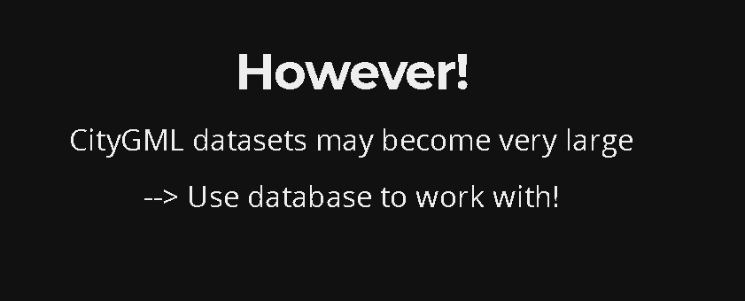
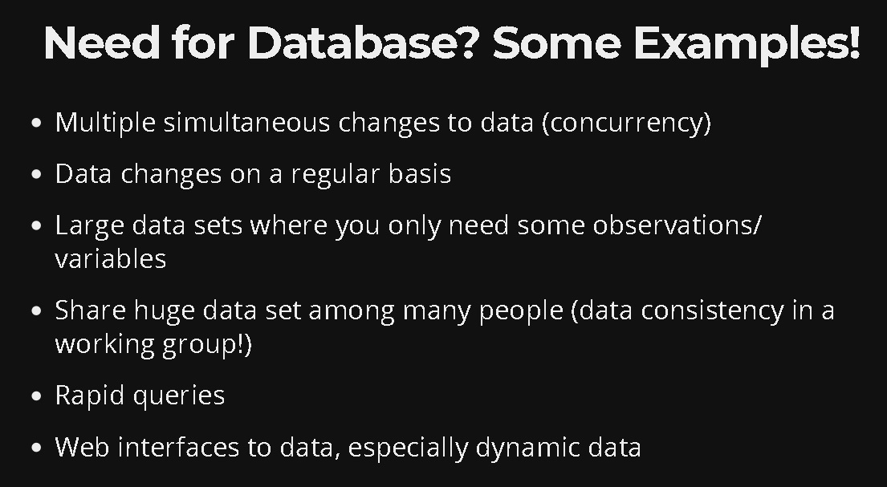
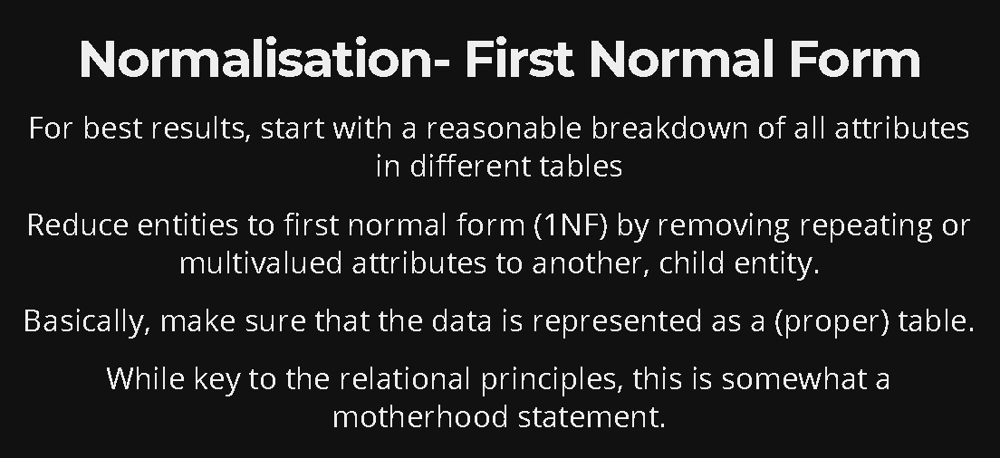
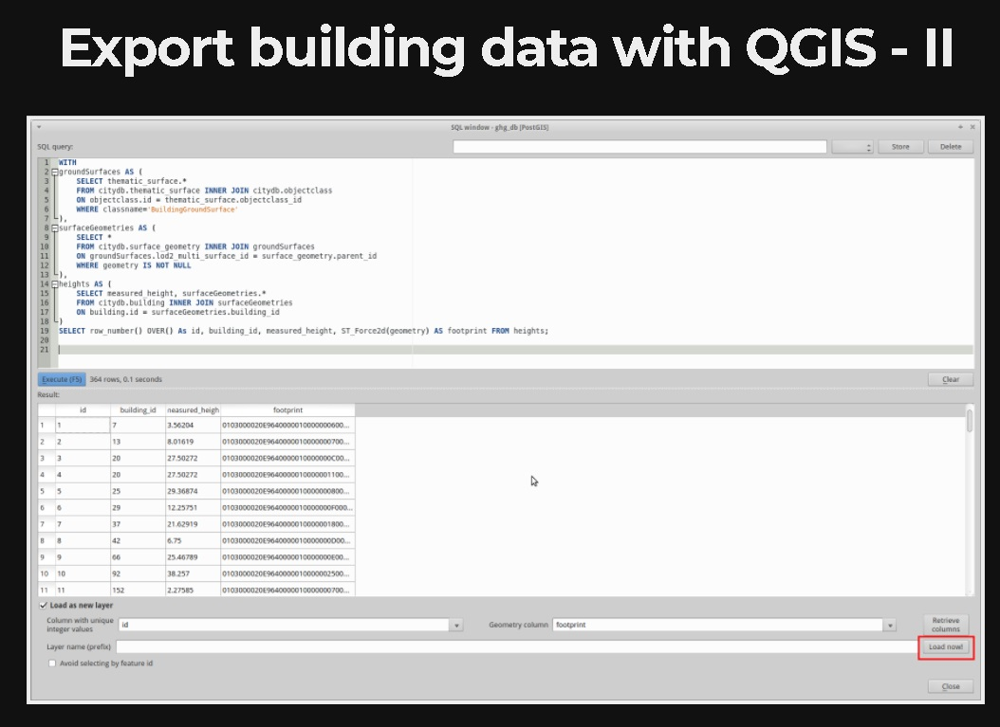
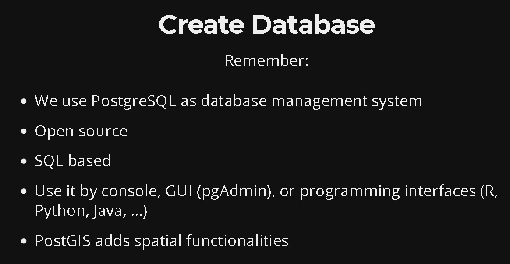
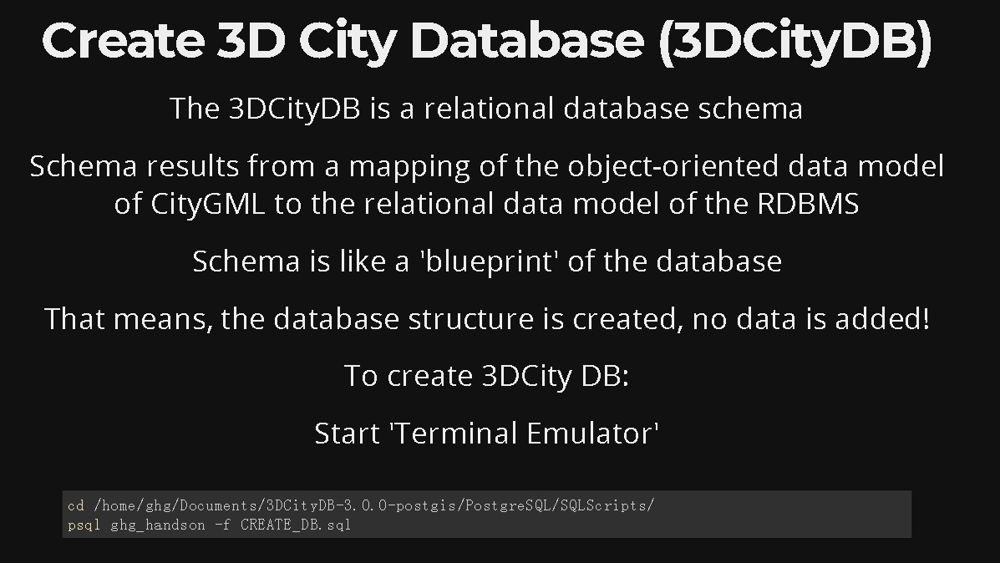
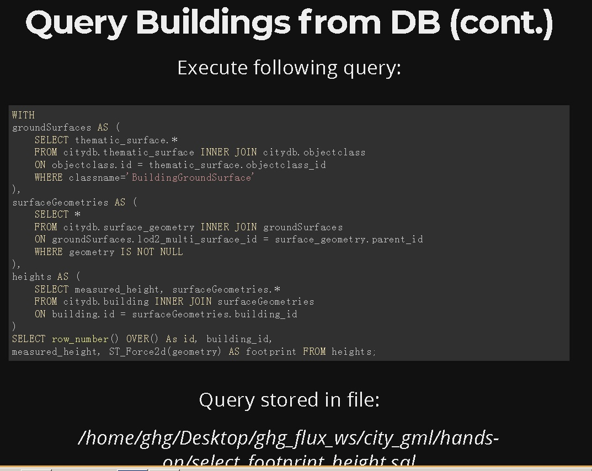
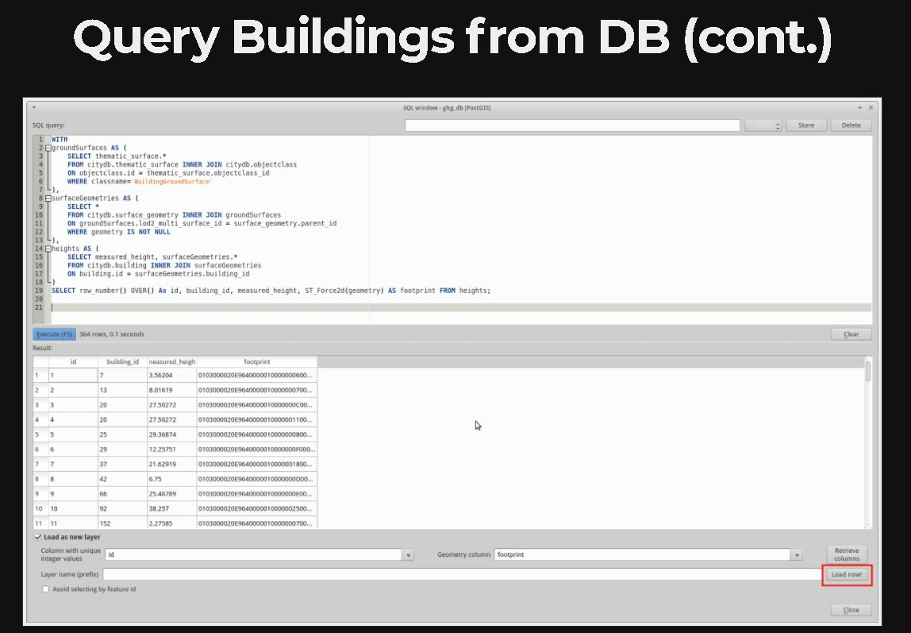

## PostgreSQL 3D City 应用   
       
### 作者    
digoal     
     
### 日期                          
2018-01-03    
      
### 标签     
PostgreSQL , CityJSON , CityGML , 3D City , 3D City Database , Geometrical Model , Semantic Model , COLLADA , VRML , X3D , IFC , gbXML , KML , OGC (Open Geospatial Consortium)开放地理空间协会        
     
----     
     
## 背景   
空间应用在城市规划建设中，在发挥越来越重要的作用！  
  
  
  
  
  
  
  
PostGIS是一个开源的PostgreSQL空间数据库插件，遵循OGC的SQL协定设计，应用广泛。  
  
PostGIS is an open source software program that adds support for geographic objects to the PostgreSQL object-relational database. PostGIS follows the Simple Features for SQL specification from the Open Geospatial Consortium (OGC).  
  
http://www.opengeospatial.org/  
  
- Geometry types for Points, LineStrings, Polygons, MultiPoints, MultiLineStrings, MultiPolygons and GeometryCollections.  
- Spatial predicates for determining the interactions of geometries using the 3x3 DE-9IM (provided by the GEOS software library).  
- Spatial operators for determining geospatial measurements like area, distance, length and perimeter.  
- Spatial operators for determining geospatial set operations, like union, difference, symmetric difference and buffers (provided by GEOS).  
- R-tree-over-GiST (Generalized Search Tree) spatial indexes for high speed spatial querying.  
- Index selectivity support, to provide high performance query plans for mixed spatial/non-spatial queries.  
- For raster data, PostGIS WKT Raster (now integrated into PostGIS 2.0+ and renamed PostGIS Raster)  
- The PostGIS implementation is based on "light-weight" geometries and indexes optimized to reduce disk and memory footprint. Using light-weight geometries helps servers increase the amount of data migrated up from physical disk storage into RAM, improving query performance substantially.  
- PostGIS is registered as "implements the specified standard" for "Simple Features for SQL" by the OGC.[3] PostGIS has not been certified as compliant by the OGC.  
  
  
  
PostGIS支持的空间构造接口如下，兼容各种geometry格式的导入。  
  
http://postgis.net/docs/manual-2.4/reference.html  
  
```  
8.4. Geometry Constructors  
  
ST_GeogFromText — Return a specified geography value from Well-Known Text representation or extended (WKT).  
ST_GeographyFromText — Return a specified geography value from Well-Known Text representation or extended (WKT).  
ST_GeogFromWKB — Creates a geography instance from a Well-Known Binary geometry representation (WKB) or extended Well Known Binary (EWKB).  
ST_GeomFromTWKB — Creates a geometry instance from a TWKB ("Tiny Well-Known Binary") geometry representation.  
ST_GeomCollFromText — Makes a collection Geometry from collection WKT with the given SRID. If SRID is not given, it defaults to 0.  
ST_GeomFromEWKB — Return a specified ST_Geometry value from Extended Well-Known Binary representation (EWKB).  
ST_GeomFromEWKT — Return a specified ST_Geometry value from Extended Well-Known Text representation (EWKT).  
ST_GeometryFromText — Return a specified ST_Geometry value from Well-Known Text representation (WKT). This is an alias name for ST_GeomFromText  
ST_GeomFromGeoHash — Return a geometry from a GeoHash string.  
ST_GeomFromGML — Takes as input GML representation of geometry and outputs a PostGIS geometry object  
ST_GeomFromGeoJSON — Takes as input a geojson representation of a geometry and outputs a PostGIS geometry object  
ST_GeomFromKML — Takes as input KML representation of geometry and outputs a PostGIS geometry object  
ST_GMLToSQL — Return a specified ST_Geometry value from GML representation. This is an alias name for ST_GeomFromGML  
ST_GeomFromText — Return a specified ST_Geometry value from Well-Known Text representation (WKT).  
ST_GeomFromWKB — Creates a geometry instance from a Well-Known Binary geometry representation (WKB) and optional SRID.  
```  
  
PostGIS支持的空间构造接口如下，兼容各种geometry格式的导出。  
  
```  
8.7. Geometry Outputs  
  
ST_AsBinary — Return the Well-Known Binary (WKB) representation of the geometry/geography without SRID meta data.  
ST_AsEncodedPolyline — Returns an Encoded Polyline from a LineString geometry.  
ST_AsEWKB — Return the Well-Known Binary (WKB) representation of the geometry with SRID meta data.  
ST_AsEWKT — Return the Well-Known Text (WKT) representation of the geometry with SRID meta data.  
ST_AsGeoJSON — Return the geometry as a GeoJSON element.  
ST_AsGML — Return the geometry as a GML version 2 or 3 element.  
ST_AsHEXEWKB — Returns a Geometry in HEXEWKB format (as text) using either little-endian (NDR) or big-endian (XDR) encoding.  
ST_AsKML — Return the geometry as a KML element. Several variants. Default version=2, default precision=15  
ST_AsLatLonText — Return the Degrees, Minutes, Seconds representation of the given point.  
ST_AsSVG — Returns a Geometry in SVG path data given a geometry or geography object.  
ST_AsText — Return the Well-Known Text (WKT) representation of the geometry/geography without SRID metadata.  
ST_AsTWKB — Returns the geometry as TWKB, aka "Tiny Well-Known Binary"  
ST_AsX3D — Returns a Geometry in X3D xml node element format: ISO-IEC-19776-1.2-X3DEncodings-XML  
ST_GeoHash — Return a GeoHash representation of the geometry.  
ST_AsGeobuf — Return a Geobuf representation of a set of rows.  
ST_AsMVTGeom — Transform a geometry into the coordinate space of a Mapbox Vector Tile.  
ST_AsMVT — Return a Mapbox Vector Tile representation of a set of rows.  
```  
   
结合PostGIS与空间应用软件，可以推动城市规划建设的空间应用。  
  
## 物料  
一些相关物料  
  
1、[3D GIS and Application](20180103_01_pdf_001.pdf)  
  
2、[3D City Database for CityGML](20180103_01_pdf_002.pdf)  
  
3、[DATABASE DEVELOPMENT WITH “3D-CITYGML”AND “ENERGYADE”- SCHEMA FOR CITY-DISTRICT-SIMULATION MODELLING ](20180103_01_pdf_003.pdf)  
  
4、环境监控  
  
http://www.openforis.org/home.html  
  
5、[Collect_Earth_User_Manual](20180103_01_pdf_004.pdf)  
  
6、[可视化城市](http://www.virtualcitysystems.de/en/)  
  
7、[3D 城市 数据库](https://www.3dcitydb.org)  
  
8、[虚拟城市 database](20180103_01_pdf_005.pdf)  
  
9、[虚拟城市 数据格式兼容](20180103_01_pdf_006.pdf)  
  
  
## 标准  
一些标准  
  
1、The OGC (Open Geospatial Consortium) is an international not for profit organization committed to making quality open standards for the global geospatial community.  
  
http://www.opengeospatial.org/  
  
  
2、CityGML - City Geography Markup Language  
  
http://www.citygmlwiki.org/index.php?title=Citygml_Wiki  
  
3、CityJSON is a format for encoding a subset of the CityGML data model using JavaScript Object Notation (JSON)  
  
http://www.cityjson.org  
  
  
## <CityGML Applications, Open Data and Open Source Tools> PPT转载  
  
http://rchr.github.io/slides_ghg_gfz/#/data-modelling  
  
  
  
  
  
  
  
  
  
  
  
  
  
  
  
  
  
  
  
  
实际上已经支持到SQL:2011标准  
  
  
  
  
  
  
  
  
  
  
  
  
  
  
  
  
  
  
  
  
  
  
  
  
  
  
  
http://www.businesslocationcenter.de/en/downloadportal  
  
  
  
  
  
  
  
  
  
  
  
  
http://www.codeguru.com/csharp/.net/net_data/article.php/c19615/Introduction-to-Relational-Databases--Part-1-Theoretical-Foundation.htm  
  
  
  
  
  
  
  
  
  
  
  
  
  
  
  
  
  
  
  
  
  
  
  
  
  
  
  
  
  
  
  
  
  
  
  
  
  
  
  
  
  
  
  
  
  
  
  
  
  
  
  
  
https://gist.github.com/sluedtke/c69b545a0937f560245f  
  
## 参考  
  
1、https://en.wikipedia.org/wiki/PostGIS  
  
2、https://goldsaucer.co.uk/projects/#content  
  
3、https://github.com/TerriaJS/terriajs/issues/673  
  
4、http://www.bluemarblegeo.com/about-us/index.php  
  
5、https://github.com/3dcitydb  
  
6、https://www.3dcitydb.org/3dcitydb/3dcitydb-in-action/  
  
7、https://www.citygml.org/  
  
8、http://www.virtualcitysystems.de/en/  
  
9、利用 OpenScales+MapServer+PostGIS 快速构建 GIS 应用  
  
https://www.ibm.com/developerworks/cn/opensource/os-cn-gis-dev/index.html  
  
10、WebGIS(PostgreSQL+GeoServer+OpenLayers)之二 GeoServer安装与数据配置(转)  
  
http://hbluojiahui.blog.163.com/blog/static/31064767200911179523287/  
  
11、使用Geoserver和Google Earth打造三维GIS展示系统  
  
http://blog.csdn.net/iwillsw/article/details/4733300  
  
12、ST_AsCollada / ST_GeomFromCollada  
  
https://trac.osgeo.org/postgis/ticket/873#no1  
  
http://postgis3d.blogspot.com/  
  
  
<a rel="nofollow" href="http://info.flagcounter.com/h9V1"  ></a>  
  
  
  
  
  
  
## [digoal's 大量PostgreSQL文章入口](https://github.com/digoal/blog/blob/master/README.md "22709685feb7cab07d30f30387f0a9ae")
  
