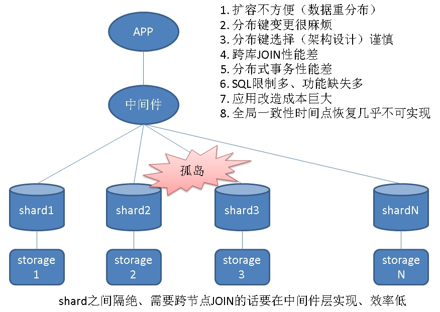

## 传统分库分表(sharding)的缺陷与破解之法  
                          
### 作者                          
digoal                          
                          
### 日期                          
2018-01-04                         
                          
### 标签                          
PostgreSQL , Greenplum , HybridDB for PostgreSQL , MPP , DIRECT-IO    
                          
----                          
                          
## 背景     
随着互联网的发展，数据爆炸性的增长，数据库逐渐成为了很多业务的绊脚石，很多业务也哭着喊着要上分布式数据库。  
  
  
  
但是，传统的分库分表（sharding）带来的问题较多，得不偿失  
  
## 传统分库分表问题
  
1、 扩容不方便（需要重分布数据）  
  
2、 分布键变更很麻烦  
  
3、 分布键选择（架构设计）需要谨慎，甚至很多sharding产品不支持多个分布键、或者不支持随机分布，导致业务不得不使用没有任何意义的自增序列来作为分布键。  
  
4、 无法支持复杂查询。跨库JOIN性能差，甚至只能按分布键JOIN，其他字段不支持JOIN。（因为这种产品架构数据节点之间是孤岛，数据需要在孤岛之间交互，需要通过上层的中间件节点，而这样的话，如果有跨库JOIN，就需要将数据收到中间件节点再JOIN，性能差是可想而知的，甚至打爆中间节点。）  
  
5、 当需要写入、返回大量结果集时，可能把中间件打爆。可能性非常大。  
  
6、 分布式事务性能差，甚至不支持分布式事务。  
  
7、 由于各个数据节点各自为政，实际上这种模式带来的SQL限制多、功能缺失多  
  
8、 SQL功能缺失，导致应用改造成本巨大，（实际上就是限制多）。  
  
9、 全局一致性时间点恢复几乎不可实现，不同的数据节点处于不同的状态，没有一个全局统一的快照管理和恢复机制。  
  
传统分库分表最大的问题实际上还是孤岛问题，导致了一系列的问题。  
  
## HybridDB for PG如何破解这些问题  
  
  
1、实时写入，通过直接写segment(可以做成对业务透明)，实现了单机25万行/s的写入能力。通过扩展计算节点，可以扩展整个集群的写入能力。  
  
  
2、批量导入，通过OSS_EXT，走OSS通道实时写入，我们测试过50台机器的机器，达到了100亿（5.5TB）数据，1251秒导入的性能。   
  
  
3、全局一致性，HDB PG基于数据库的ACID标准设计，是一个整体，支持全局事务。支持全局一致性。  
  
4、点查，点查能力，每个节点可以实现100万TPS。通过扩展计算节点，可以扩展整个集群的点查TPS能力。  
  
5、复杂查询，核心是MASTER节点的分布式执行计划，MASTER节点收到用户请求后，生成分布式执行计划，并下发给计算节点并行执行。  
  
6、大结果集查询，通过游标，实现大结果集的查询，分页，接收等。  
  
7、UDF，用户可以使用java, python, plpgsql等语言，在HDB PG中实现业务逻辑，实现复杂的查询场景需求。  
  
8、任意列JOIN，由于HDB PG数据节点直接可以重分布数据，不需要走MASTER节点，因此，不需要维表，就可以实现任意列的JOIN，GROUP BY，DISTINCT等。  
  
9、任意distinct，同上。  
  
10、任意group by，同上。  
  
[《HybridDB PostgreSQL "Sort、Group、distinct 聚合、JOIN" 不惧怕数据倾斜的黑科技和原理 - 多阶段聚合》](../201711/20171123_01.md)    
  
11、MASTER不承担计算，由于MASTER节点不承担计算，所以不会成为计算瓶颈，包括排序在内（MASTER节点采用MERGE SORT，几乎不耗费资源）。  
  
12、机器学习，通过madlib插件，实现了数据库内部的机器学习。  
  
相关资料  
  
http://madlib.incubator.apache.org/  
  
https://pypi.python.org/pypi/pymadlib/0.1.4  
  
https://github.com/pivotalsoftware/PivotalR  
  
https://cran.r-project.org/web/packages/PivotalR/PivotalR.pdf  
  
https://cran.r-project.org/web/packages/PivotalR/vignettes/pivotalr.pdf  
  
13、扩展功能：  
  
资源隔离，通过资源队列，可以管理不同的用户资源使用情况。  
  
HLL，是一个估值插件，可以存储估值数据。  
  
行列混合存储，行列混合存储，支持压缩。  
  
分布键，支持任意键作为分布键，同时支持随机分布，支持多列作为分布键。不需要强制分布键。  
  
分区表，支持多级分区，范围分区，枚举分区。  
  
空间数据，支持PostGIS，可以管理空间数据。  
  
JSON，支持JSON数据类型。  
  
数组，支持多值类型。  
  
全文检索，支持全文检索类型。  
  
正则表达式，支持正则表达式查询语法。  
  
OSS，支持冷热分离存储。  
  
### 总结
HybridDB for PostgreSQL属于MPP架构，解决了几类问题，实现了HTAP（OLTP和OLAP混合业务）：  
  
  
1、高并发小事务（实时写入、点查），  
  
2、实时复杂大型计算，  
  
3、批处理，  
  
4、冷热数据分离，  
  
5、资源隔离，  
  
6、容量、功能扩展性，  
  
容量水平扩展(支持两种扩容模式，一种原地扩容，一种跨集群扩容)，功能（UDF，plpython, pljava, plpgsql，插件）。  
  
7、机器学习。  
  
  
## HybridDB for PG 性能指标  
50台机器的集群，一些性能指标如下：  
  
通过增加机器，可以实现线性性能提升。  
  
  
  
  
  
  
  
  
## 参考  
  
[《HTAP数据库(OLTP+OLAP) - sharding 和 共享分布式存储 数据库架构 优缺点》](../201710/20171013_04.md)    
  
  
  
  
  
  
  
  
  
  
## [digoal's 大量PostgreSQL文章入口](https://github.com/digoal/blog/blob/master/README.md "22709685feb7cab07d30f30387f0a9ae")
  
