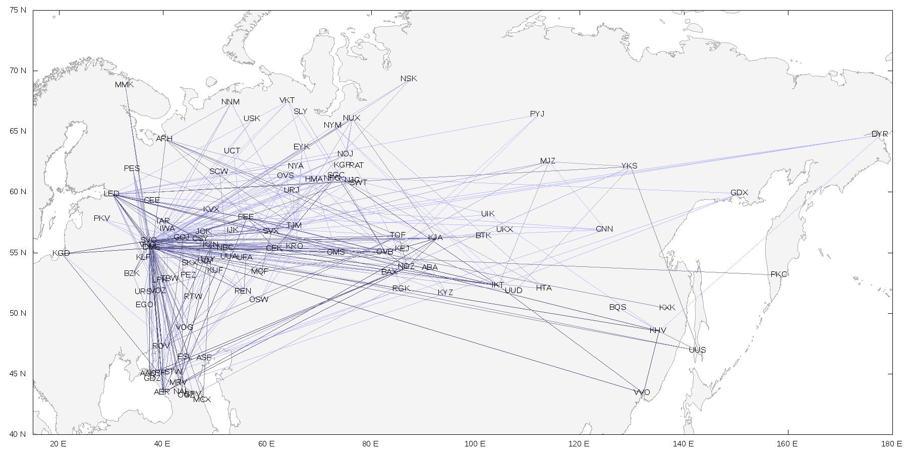
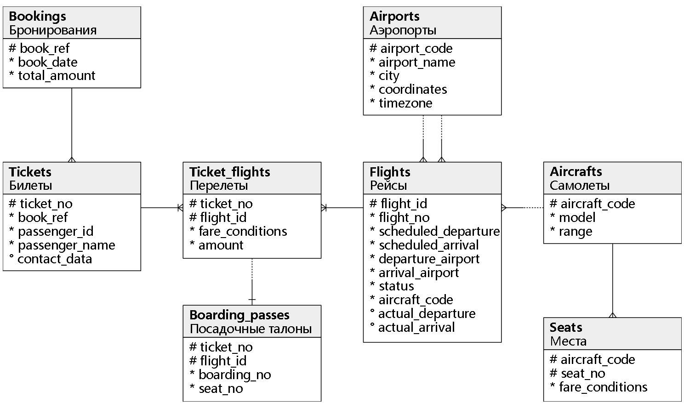

## 航空公司数据库设计  
                          
### 作者                          
digoal                          
                          
### 日期                          
2018-01-04                         
                          
### 标签                          
PostgreSQL , 航空公司数据库设计   
                          
----                          
                          
## 背景        
通过学习航空公司数据库设计，学习PostgreSQL的使用。  
  
这个DEMO来自postgrespro：  
  
https://postgrespro.com/docs/postgrespro/10/demodb-bookings.html    
  
  
  
## 加载航空公司数据  
可以任选一个数据集，使用pg_restore还原到你的PostgreSQL数据库中，还原时，会新建一个demo数据库，数据导入demo数据库中。  
  
[demo-small.zip](https://edu.postgrespro.ru/demo-small.zip) (21 MB) — flight data for one month (DB size is about 300 MB)  
  
[demo-medium.zip](https://edu.postgrespro.ru/demo-medium.zip) (62 MB) — flight data for three months (DB size is about 700 MB)  
  
[demo-big.zip](https://edu.postgrespro.ru/demo-big.zip) (232 MB) — flight data for one year (DB size is about 2.5 GB)  
  
## 航空公司数据库schema  
  
  
### 描述  
  
主要的实体是bookings(demo库里的schema)，所有的对象都在这里。  
  
一个booking可以包括几名乘客，每位乘客一张票。票有一个独特的号码，包括乘客的信息。因此，乘客不是一个单独的实体。乘客的姓名和身份证件号码都可以随时间变化，因此不可能唯一地识别某一个人的所有票; 为了简单起见，假设所有乘客都是唯一的。     
  
机票包括一个或多个飞行段(ticket_flights)。如果在起飞点和目的地之间没有直达航班，或者是往返机票，可以将几个航班段包括在单张机票中。尽管在模式中没有约束，但是假设预订中的所有机票都有相同的航班段。  
  
每个航班(flights)从一个机场飞往另一个机场(airports)。同一航班号的航班有相同的出发点和目的地，但不同的起飞日期。  
  
在飞行登记时，乘客需要打印登机牌(boarding_pass)，包含座位号码信息。旅客可以办理登机手续，只有在这趟航班被列入ticket的情况下才能办理登机手续。飞行座椅的组合必须是唯一的，以避免为同一个座位签发两个登机牌。  
  
飞机上的座位(seats)和不同的旅行等级之间的分配取决于飞机(aircrafts)的飞行模式。假设每个飞行器模型只有一个舱位结构。数据库中不检查登机牌上的座位号是否有相应的飞机座位(这样的验证可以使用表触发器，或者在应用程序中调度)。  
  
## Schema Objects  
大量的使用了JSON类型，视图。  
  
```  
       Name      |     Type      |  Small | Medium |   Big  |       Description  
-----------------+---------------+--------+--------+--------+-------------------------  
 aircrafts       | view          |        |        |        | Aircraft  
 aircrafts_data  | table         |  16 kB |  16 kB |  16 kB | Aircraft (translations)  
 airports        | view          |        |        |        | Airports  
 airports_data   | table         |  56 kB |  56 kB |  56 kB | Airports (translations)  
 boarding_passes | table         |  31 MB | 102 MB | 427 MB | Boarding passes  
 bookings        | table         |  13 MB |  30 MB | 105 MB | Bookings  
 flights         | table         |   3 MB |   6 MB |  19 MB | Flights  
 flights_v       | view          |        |        |        | Flights  
 routes          | view          |        |        |        | Routes  
 seats           | table         |  88 kB |  88 kB |  88 kB | Seats  
 ticket_flights  | table         |  64 MB | 145 MB | 516 MB | Flight segments  
 tickets         | table         |  47 MB | 107 MB | 381 MB | Tickets  
```  
  
### 对象解释  
1、视图bookings.aircrafts  
  
包括飞机编号，飞机机型，飞机最大飞行公里数。  
  
```  
    Column     |  Type   | Modifiers    |             Description  
---------------+---------+--------------+-----------------------------------  
 aircraft_code | char(3) | not null     | Aircraft code, IATA  
 model         | text    | not null     | Aircraft model  
 range         | integer | not null     | Maximal flying distance, km  
View definition:  
 SELECT ml.aircraft_code,  
    ml.model ->> lang() AS model,  
    ml.range  
   FROM aircrafts_data ml;  
```  
  
2、表bookings.aircrafts_data  
  
机型使用JSON存储，包含更多内容。  
  
```  
    Column     |  Type   | Modifiers    |             Description  
---------------+---------+--------------+-----------------------------------  
 aircraft_code | char(3) | not null     | Aircraft code, IATA  
 model         | jsonb   | not null     | Aircraft model  
 range         | integer | not null     | Maximal flying distance, km  
Indexes:  
    PRIMARY KEY, btree (aircraft_code)  
Check constraints:  
    CHECK (range > 0)  
Referenced by:  
    TABLE "flights" FOREIGN KEY (aircraft_code)  
        REFERENCES aircrafts_data(aircraft_code)  
    TABLE "seats" FOREIGN KEY (aircraft_code)  
        REFERENCES aircrafts_data(aircraft_code) ON DELETE CASCADE  
```  
  
3、视图bookings.airports  
  
机场信息，机场代码，机场名，城市，经纬度，时区。  
  
```  
   Column     |  Type   | Modifiers    |                 Description  
--------------+---------+--------------+--------------------------------------------  
 airport_code | char(3) | not null     | Airport code  
 airport_name | text    | not null     | Airport name  
 city         | text    | not null     | City  
 coordinates  | point   | not null     | Airport coordinates (longitude and latitude)  
 timezone     | text    | not null     | Airport time zone  
View definition:  
 SELECT ml.airport_code,  
    ml.airport_name ->> lang() AS airport_name,  
    ml.city ->> lang() AS city,  
    ml.coordinates,  
    ml.timezone  
   FROM airports_data ml;  
```  
  
4、表bookings.airports_data  
  
机场代码，机场名（JSON存储），城市（JSON存储），经纬度，时区。  
  
```  
   Column     |  Type   | Modifiers    |                 Description  
--------------+---------+--------------+--------------------------------------------  
 airport_code | char(3) | not null     | Airport code  
 airport_name | jsonb   | not null     | Airport name  
 city         | jsonb   | not null     | City  
 coordinates  | point   | not null     | Airport coordinates (longitude and latitude)  
 timezone     | text    | not null     | Airport time zone  
Indexes:  
    PRIMARY KEY, btree (airport_code)  
Referenced by:  
    TABLE "flights" FOREIGN KEY (arrival_airport)   
        REFERENCES airports_data(airport_code)  
    TABLE "flights" FOREIGN KEY (departure_airport)   
        REFERENCES airports_data(airport_code)  
```  
  
5、表bookings.boarding_passes  
  
CHECK IN信息，机票ID，飞行ID，登机口，座位号。  
  
```  
   Column    |    Type    | Modifiers    |         Description  
-------------+------------+--------------+--------------------------  
 ticket_no   | char(13)   | not null     | Ticket number  
 flight_id   | integer    | not null     | Flight ID  
 boarding_no | integer    | not null     | Boarding pass number  
 seat_no     | varchar(4) | not null     | Seat number  
Indexes:  
    PRIMARY KEY, btree (ticket_no, flight_id)  
    UNIQUE CONSTRAINT, btree (flight_id, boarding_no)  
    UNIQUE CONSTRAINT, btree (flight_id, seat_no)  
Foreign-key constraints:  
    FOREIGN KEY (ticket_no, flight_id)   
        REFERENCES ticket_flights(ticket_no, flight_id)  
```  
  
6、表bookings.bookings  
  
一条记录代表一趟行程，日期，该行程所有机票加起来的金额。  
  
```  
   Column     |      Type     | Modifiers    |         Description  
--------------+---------------+--------------+---------------------------  
 book_ref     | char(6)       | not null     | Booking number  
 book_date    | timestamptz   | not null     | Booking date  
 total_amount | numeric(10,2) | not null     | Total booking cost  
Indexes:  
    PRIMARY KEY, btree (book_ref)  
Referenced by:  
    TABLE "tickets" FOREIGN KEY (book_ref) REFERENCES bookings(book_ref)  
```  
  
7、表bookings.flights  
  
航班信息，编号，状态等。  
  
```  
        Column       |     Type    | Modifiers    |         Description  
---------------------+-------------+--------------+-----------------------------  
 flight_id           | serial      | not null     | Flight ID  
 flight_no           | char(6)     | not null     | Flight number  
 scheduled_departure | timestamptz | not null     | Scheduled departure time  
 scheduled_arrival   | timestamptz | not null     | Scheduled arrival time  
 departure_airport   | char(3)     | not null     | Airport of departure  
 arrival_airport     | char(3)     | not null     | Airport of arrival  
 status              | varchar(20) | not null     | Flight status  
 aircraft_code       | char(3)     | not null     | Aircraft code, IATA  
 actual_departure    | timestamptz |              | Actual departure time  
 actual_arrival      | timestamptz |              | Actual arrival time  
Indexes:  
    PRIMARY KEY, btree (flight_id)  
    UNIQUE CONSTRAINT, btree (flight_no, scheduled_departure)  
Check constraints:  
    CHECK (scheduled_arrival > scheduled_departure)  
    CHECK ((actual_arrival IS NULL)  
       OR  ((actual_departure IS NOT NULL AND actual_arrival IS NOT NULL)  
            AND (actual_arrival > actual_departure)))  
    CHECK (status IN ('On Time', 'Delayed', 'Departed',   
                      'Arrived', 'Scheduled', 'Cancelled'))  
Foreign-key constraints:  
    FOREIGN KEY (aircraft_code)   
        REFERENCES aircrafts(aircraft_code)  
    FOREIGN KEY (arrival_airport)   
        REFERENCES airports(airport_code)  
    FOREIGN KEY (departure_airport)   
        REFERENCES airports(airport_code)  
Referenced by:  
    TABLE "ticket_flights" FOREIGN KEY (flight_id)   
        REFERENCES flights(flight_id)  
```  
  
8、表bookings.seats  
  
座位信息  
  
```  
      Column     |     Type    | Modifiers    |      Description  
-----------------+-------------+--------------+--------------------  
 aircraft_code   | char(3)     | not null     | Aircraft code, IATA  
 seat_no         | varchar(4)  | not null     | Seat number  
 fare_conditions | varchar(10) | not null     | Travel class  
Indexes:  
    PRIMARY KEY, btree (aircraft_code, seat_no)  
Check constraints:  
    CHECK (fare_conditions IN ('Economy', 'Comfort', 'Business'))  
Foreign-key constraints:  
    FOREIGN KEY (aircraft_code)  
        REFERENCES aircrafts(aircraft_code) ON DELETE CASCADE  
```  
  
9、表bookings.ticket_flights  
  
机票与航班关联的信息  
  
```  
     Column      |     Type      | Modifiers    |    Description  
-----------------+---------------+--------------+---------------------  
 ticket_no       | char(13)      | not null     | Ticket number  
 flight_id       | integer       | not null     | Flight ID  
 fare_conditions | varchar(10)   | not null     | Travel class  
 amount          | numeric(10,2) | not null     | Travel cost  
Indexes:  
    PRIMARY KEY, btree (ticket_no, flight_id)  
Check constraints:  
    CHECK (amount >= 0)  
    CHECK (fare_conditions IN ('Economy', 'Comfort', 'Business'))  
Foreign-key constraints:  
    FOREIGN KEY (flight_id) REFERENCES flights(flight_id)  
    FOREIGN KEY (ticket_no) REFERENCES tickets(ticket_no)  
Referenced by:  
    TABLE "boarding_passes" FOREIGN KEY (ticket_no, flight_id)   
        REFERENCES ticket_flights(ticket_no, flight_id)  
```  
  
  
10、表bookings.tickets  
  
机票销售记录。  
  
```  
     Column     |     Type    | Modifiers    |          Description  
----------------+-------------+--------------+-----------------------------  
 ticket_no      | char(13)    | not null     | Ticket number  
 book_ref       | char(6)     | not null     | Booking number  
 passenger_id   | varchar(20) | not null     | Passenger ID  
 passenger_name | text        | not null     | Passenger name  
 contact_data   | jsonb       |              | Passenger contact information  
Indexes:  
    PRIMARY KEY, btree (ticket_no)  
Foreign-key constraints:  
    FOREIGN KEY (book_ref) REFERENCES bookings(book_ref)  
Referenced by:  
    TABLE "ticket_flights" FOREIGN KEY (ticket_no) REFERENCES tickets(ticket_no)  
```  
  
11、视图bookings.flights_v  
  
航班视图  
  
```  
          Column           |    Type     |              Description  
---------------------------+-------------+--------------------------------------  
 flight_id                 | integer     | Flight ID  
 flight_no                 | char(6)     | Flight number  
 scheduled_departure       | timestamptz | Scheduled departure time  
 scheduled_departure_local | timestamp   | Scheduled departure time,   
                           |             | local time at the point of departure  
 scheduled_arrival         | timestamptz | Scheduled arrival time  
 scheduled_arrival_local   | timestamp   | Scheduled arrival time,  
                           |             | local time at the point of destination  
 scheduled_duration        | interval    | Scheduled flight duration  
 departure_airport         | char(3)     | Departure airport code  
 departure_airport_name    | text        | Departure airport name  
 departure_city            | text        | City of departure  
 arrival_airport           | char(3)     | Arrival airport code  
 arrival_airport_name      | text        | Arrival airport name  
 arrival_city              | text        | City of arrival  
 status                    | varchar(20) | Flight status  
 aircraft_code             | char(3)     | Aircraft code, IATA  
 actual_departure          | timestamptz | Actual departure time  
 actual_departure_local    | timestamp   | Actual departure time,   
                           |             | local time at the point of departure  
 actual_arrival            | timestamptz | Actual arrival time  
 actual_arrival_local      | timestamp   | Actual arrival time,   
                           |             | local time at the point of destination  
 actual_duration           | interval    | Actual flight duration  
```  
  
12、视图bookings.routes  
  
航班路由信息  
  
```  
        Column          |   Type    |              Description  
------------------------+-----------+-------------------------------------  
 flight_no              | char(6)   | Flight number  
 departure_airport      | char(3)   | Departure airport code  
 departure_airport_name | text      | Departure airport name  
 departure_city         | text      | City of departure  
 arrival_airport        | char(3)   | Arrival airport code  
 arrival_airport_name   | text      | Arrival airport name  
 arrival_city           | text      | City of arrival  
 aircraft_code          | char(3)   | Aircraft code, IATA  
 duration               | interval  | Flight duration  
 days_of_week           | integer[] | Days of the week on which flights are performed  
```  
  
13、函数bookings.now  
  
回退到数据集的快照时间函数。  
  
14、含bookings.lang  
  
显示语言。  
  
## 使用  
1、修改参数，适配测试样本。（注释语言、now函数回溯快照（倒推到数据集的时间节点））  
  
```  
ALTER DATABASE demo SET bookings.lang = en;  
  
alter role all set search_path=bookings, public;  
```  
  
2、查询（略），详见参考链接  
  
3、购票  
  
```  
BEGIN;  
  
INSERT INTO bookings (book_ref, book_date, total_amount)  
VALUES      ('_QWE12', bookings.now(), 0);  
  
INSERT INTO tickets (ticket_no, book_ref, passenger_id, passenger_name)  
VALUES      ('_000000000001', '_QWE12', '1749 051790', 'ALEKSANDR RADISHCHEV');  
  
INSERT INTO ticket_flights (ticket_no, flight_id, fare_conditions, amount)  
VALUES      ('_000000000001', 8525, 'Business', 0),  
            ('_000000000001', 4967, 'Business', 0);  
  
COMMIT;  
```  
  
...略  
  
## 参考  
  
https://postgrespro.com/docs/postgrespro/10/demodb-bookings.html    
  
<a rel="nofollow" href="http://info.flagcounter.com/h9V1"  ></a>  
  
  
  
  
  
  
## [digoal's 大量PostgreSQL文章入口](https://github.com/digoal/blog/blob/master/README.md "22709685feb7cab07d30f30387f0a9ae")
  
