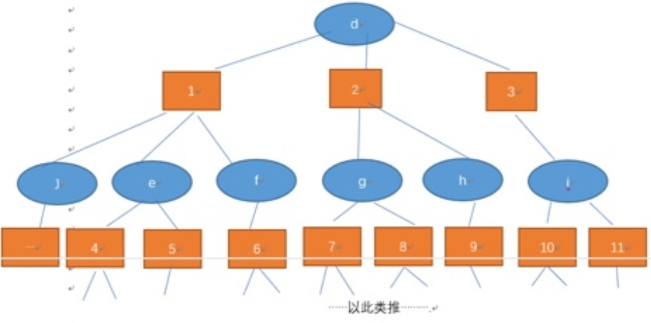

## PostgreSQL 大学选课相关性应用实践  
                              
### 作者                              
digoal                              
                              
### 日期                              
2018-01-05                             
                              
### 标签                              
PostgreSQL , 选课 , UDF , 数组 , 相关性 , 图式搜索     
                              
----                              
                              
## 背景    
大学生选课，一门课程可同时有若干学生选修，一个学生可能同时选多门课程，学生和课程的关系是多对多的关系。  
  
1、如何找出每一门课程相关的课程（即这门课程的学生，还选了其他一些什么课程？）同时要求按相关性排序。  
  
2、如何找出每一门课程相关的课程（即这门课程的学生，还选了其他一些什么课程？这些课程的学生又选了一些什么课程，递归）同时要求按相关性排序。  
  
  
  
## DEMO  
对于第一个要求，实现很简单：  
  
10万位学生，1000门课，平均每个学生选5门课。  
  
求每门课程的相关课程，并按相关性排序（选了该课程的学生中，还选了什么课程，按被选次数倒排序）。  
  
1、建表，存储的是选课信息：  
  
```  
create table xuanke(  
  std_id int8,  -- 学号  
  cos_id int    -- 课程  
);  
```  
  
2、插入50万记录  
  
```  
insert into xuanke select random()*99999, random()*999 from generate_series(1,500000);  
```  
  
3、单个学生选了什么课，使用数组存储：  
  
```  
create table xuanke_cos_id (  
  std_id int8 primary key,  
  cos_id int[]  
);  
  
insert into xuanke_cos_id select std_id, array_agg(cos_id) from xuanke group by 1;  
```  
  
4、每门课，有哪些学生选了，使用数组存储：  
  
```  
create table xuanke_std_id (  
  cos_id int primary key,   
  std_id int8[]   
);  
  
insert into xuanke_std_id select cos_id, array_agg(std_id) from xuanke group by 1;  
```  
  
5、通过某门课的学生，得到这些学生选了什么课，并聚集，按相关性输出：  
  
```  
create or replace function get_cos_id2(int8[]) returns text[] as $$  
  select array_agg(unnest||':'||cnt order by cnt desc) from 
    (select unnest(cos_id) as unnest, count (*) as cnt 
        from xuanke_cos_id where std_id = any ($1) group by 1
  ) t;  
$$ language sql strict;    
```  
  
6、拿结果：  
  
```  
select cos_id, get_cos_id2(std_id) from xuanke_std_id;   
```  
  
结果例子：  
  
```  
251 | {251:495,348:9,708:8,372:7,816:7,431:6,184:6,600:6,114:6,649:6, .....  
  
453 | {453:499,519:7,750:7,816:7,375:7,109:7,705:7,650:7,908:7,  .....  
```  
  
使用并行计算，以上查询毫秒级。  
  
## 相关案例  
如果是要实现第二个需求，也就是需要递归，可以参考如下方法：  
  
[《PostgreSQL 图式搜索(graph search)实践 - 百亿级图谱，毫秒响应》](../201801/20180102_04.md)    
  
```  
WITH RECURSIVE search_graph(      
  std_id,     -- 点1      
  cos_id,     -- 点2      
  depth,  -- 深度，从1开始      
  path,   -- 路径，数组存储      
  cycle   -- 是否循环      
) AS (      
        select std_id,cos_id,depth,path,cycle from (      
          select   
	    std_id,  
	    cos_id,  
	    1 depth,  
	    array[row(std_id,cos_id)] path,   
	    false as cycle   
	  from xuanke   
	    where cos_id=?  
        ) t      
      UNION ALL      
        select std_id,cos_id,depth,path,cycle from (      
	  select   
	    g.std_id,  
	    g.cos_id,  
	    sg.depth+1 depth,  
	    sg.path||array[row(g.std_id,g.cos_id)] path,   
	    (row(g.std_id,g.cos_id) = ANY(path)) as cycle   
	  from xuanke as g, search_graph AS sg   
	    where   
	      g.std_id = sg.std_id  
	      AND NOT cycle  
	      -- and sg.depth <= ?  
	  ) t  
)  
SELECT * FROM search_graph;   
```  
  
数据量非常庞大，返回时间很久。实际上层级很深后，意义不大。  
  
如果需要限制每个层级的返回数，限制层级，限制相关性权重等，请参考：  
  
[《PostgreSQL 图式搜索(graph search)实践 - 百亿级图谱，毫秒响应》](../201801/20180102_04.md)    
  
<a rel="nofollow" href="http://info.flagcounter.com/h9V1"  ></a>  
  
  
  
  
  
  
## [digoal's 大量PostgreSQL文章入口](https://github.com/digoal/blog/blob/master/README.md "22709685feb7cab07d30f30387f0a9ae")
  
