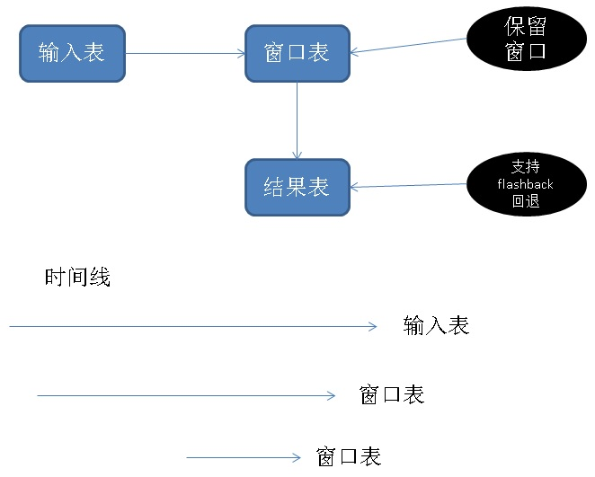

## SQL流式案例 - 旋转门压缩(前后计算相关滑窗处理例子)  
                          
### 作者                          
digoal                          
                          
### 日期                          
2018-01-07                         
                          
### 标签                          
PostgreSQL , 阅后即焚 , 流计算 , 旋转门压缩 , 滑窗分析 , 上下文相关滑窗 , 上下结果相关滑窗    
                          
----                          
                          
## 背景           
  
在流计算应用中，保持窗口和数据可重算（设置起点重新开始算）并覆盖已有计算结果。是两个比较特殊但又很有用的需求。  
  
例如流数据来自多个业务线，数据在现实中的发生有先后逻辑，然而由于系统的问题可能有数据到达差异，例如先发生的事情，数据反而后到达，（比如说订单，先下单，后付款，在发货，这是多个业务线产生的数据，然而是围绕同一笔订单，如果数据到达发生了错乱，可能出现付款、下单、发货的到达顺序，影响流计算的准确性，通过重算可以达到修复的目的。）  
  
抽象成流计算的功能：  
  
1、下一次计算可能依赖上一次计算的结果，  
  
2、下一次计算可能需要用到之前计算用到的源数据，  
  
3、下一次计算可能改变上一次计算的结果，  
  
4、可以回溯到之前的某个时间点开始重算（计算前结果也需要回溯到之前的某个点）。  
  
PostgreSQL UDF、阅后即焚、事务原子性、结果可持久化、支持INSERT ON CONFLICT写合并、flash back(可将计算结果回退到某个时间点)等技术点，可以很好的支撑上面的需求。  
  
本文以旋转门压缩计算为例，给一个PostgreSQL处理这类流计算需求的设计思路和DEMO。  
  
旋转门压缩的背景技术请参考：  
  
[《PostgreSQL 三角函数的用法举例 - 已知3点求任意夹角（旋转门续）》](../201608/20160816_01.md)    
  
[《旋转门数据压缩算法在PostgreSQL中的实现 - 流式压缩在物联网、监控、传感器等场景的应用》](../201608/20160813_01.md)    
  
## DEMO  
  
  
1、建输入表  
  
2、建窗口保留表  
  
3、建结果表  
  
4、往输入表写入数据（开启pgbench，压测，实时写入）  
  
5、编写批量消费、旋转门压缩函数(plpgsql)  
  
包括重算逻辑：  
  
```  
结果表，无记录：  
  
  输入表，按时间顺序，删除记录集R1，LIMIT N条。  
  
  窗口表，插入R1  
  
  计算，R1，并写入结果表。  
  
结果表，有记录(判断是否有需要重算的结果)：  
  
  窗口表，取出最小时间T2，最大时间T3  
  
  输入表，直接删除小于T2的数据。  
  
  输入表，取出最小时间T1  
  
  结果表，取出最大时间T4  
  
  如果T1 <= T4：  
  
    结果表，删除>=T1的数据。  
  
    窗口表，取出>=T1的数据集R2  
  
    输入表，按时间顺序，删除记录集R3（where ts <=T3）  
  
    窗口表，插入R3  
  
    输入表，按时间顺序，删除记录集R4，LIMIT N条。  
  
    窗口表，插入R4  
  
    计算，R2+R3+R4，并写入结果表。  
  
  如果T1 > T4：  
      
    窗口表，取出>=T4的数据集R5  
  
    输入表，按时间顺序，删除记录集R6，LIMIT N条。  
  
    窗口表，插入R6  
  
    计算，R5+R6，并写入结果表。  
```  
  
6、调度旋转门压缩函数  
  
## 相似案例  
[《人、机客户服务质量 - 实时透视分析 - (多股数据流上下文相关实时分析,窗口保持)》](../201712/20171208_05.md)    
  
[《PostgreSQL 三角函数的用法举例 - 已知3点求任意夹角（旋转门续）》](../201608/20160816_01.md)    
  
[《旋转门数据压缩算法在PostgreSQL中的实现 - 流式压缩在物联网、监控、传感器等场景的应用》](../201608/20160813_01.md)    
  
[《HTAP数据库 PostgreSQL 场景与性能测试之 32 - (OLTP) 高吞吐数据进出(堆存、行扫、无需索引) - 阅后即焚(JSON + 函数流式计算)》](../201711/20171107_33.md)    
  
[《HTAP数据库 PostgreSQL 场景与性能测试之 31 - (OLTP) 高吞吐数据进出(堆存、行扫、无需索引) - 阅后即焚(读写大吞吐并测)》](../201711/20171107_32.md)    
  
[《HTAP数据库 PostgreSQL 场景与性能测试之 27 - (OLTP) 物联网 - FEED日志, 流式处理 与 阅后即焚 (CTE)》](../201711/20171107_28.md)    
  
[《在PostgreSQL中实现update | delete limit - CTID扫描实践  (高效阅后即焚)》](../201608/20160827_01.md)    
  
[《PostgreSQL 异步消息实践 - Feed系统实时监测与响应(如 电商主动服务) - 分钟级到毫秒级的实现》](../201711/20171111_01.md)    
  
## 参考  
[《PostgreSQL flashback(闪回) 功能实现与介绍》](../201710/20171010_01.md)    
  
<a rel="nofollow" href="http://info.flagcounter.com/h9V1"  ></a>  
  
  
  
  
  
  
## [digoal's 大量PostgreSQL文章入口](https://github.com/digoal/blog/blob/master/README.md "22709685feb7cab07d30f30387f0a9ae")
  
