## [转]流数据库 概率计算概念 - PipelineDB-Probabilistic Data Structures & Algorithms   
                                       
### 作者                                       
digoal                                       
                                       
### 日期                                       
2018-01-16                                      
                                       
### 标签                                       
PostgreSQL , PPAS , enterprisedb , spin , 锁等待优化           
                                       
----                                       
                                       
## 背景             
原文:   
   
https://mp.weixin.qq.com/s/yDSnk4BzKKu1IuhMRgL7_w   
   
作者: 桑栎   
   
PipelineDB在物理存储的时候，使用了大量的聚合数据类型，在处理持续数据的时候，这些类型起到很重要的左右，我们来了解一下PipelineDB是如何使用这些数据类型的。   
   
官方地址：http://docs.pipelinedb.com/probabilistic.html   
   
   
PipelineDB目前提供的数据类型为：   
   
- Bloom Filter   
   
- Count-Min Sketch   
   
- Filtered-Space Saving Top-K   
   
- HyperLogLog   
   
- T-Digest   
   
   
   
官方地址：   
   
http://docs.pipelinedb.com/builtin.html#pipelinedb-specific-types   
   
http://docs.pipelinedb.com/builtin.html#pipelinedb-specific-functions   
   
对应的数据类型和function。这些数据类型，如果你不想在CV中使用，其实也可以在普通表内使用。   
   
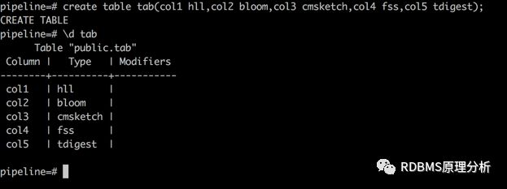   
   
具体的代码实现在:src/backend/utils/adt/   
   
   
   
   
   
## Bloom Filter   
   
   
   
在PipelineDB中，Bloom的实现：src/backend/pipeline/bloom.c   
   
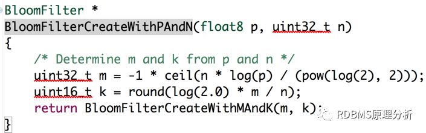   
   
   
   
Bloom这个类型几乎使用的太频繁了，PipelineDB内置这个数据类型，我们在CV中可以很好是用bloom来存储数据   
   
例子：   
   
在创建CV的时候，字段直接能用内置的UDF来生成bloom的类型   
   
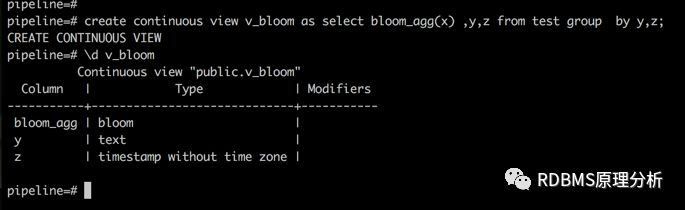   
   
插入测试数据：   
   
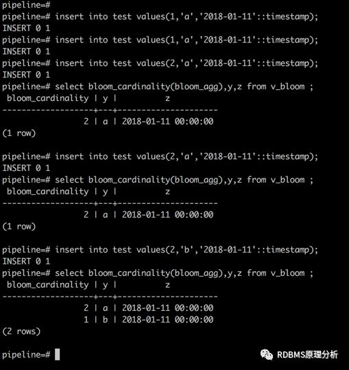   
   
还有很多udf在http://docs.pipelinedb.com/aggregates.html#bloom-filter-aggregates   
   
   
   
   
   
   
   
## HyperLogLog   
   
   
   
在PipelineDB中，HLL的实现:src/backend/pipeline/hll.c   
   
在大部分的实际运用中，HLL是用来解决count(distinct)问题的。在pp中，也是用来存储这种数据的。   
   
例子:   
   
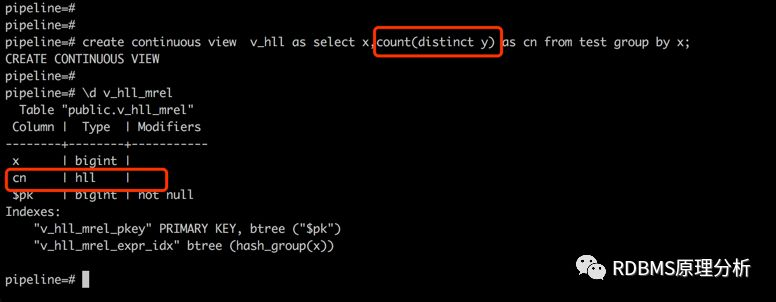   
   
创建的v_hll,对应的字段count(distinct)物理存储格式就是HLL.而在查询过程中，parse会把这个字段解析成一个函数:   
   
            hll_count_distinct_final   
   
我们看看执行计划   
   
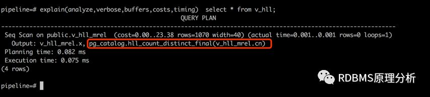   
   
例子：   
   
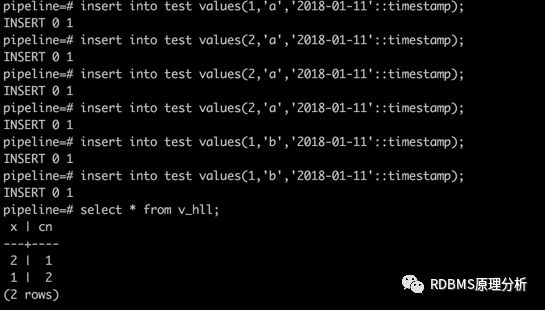   
   
我不管插入几次，结果就是count(distinct)   
   
   
   
在0.9.7之前，这个效率其实很一般，scan会特别消耗性能，在0.9.7对该功能进行了提升   
   
https://www.pipelinedb.com/blog/pipelinedb-0-9-7-delta-streams-and-towards-a-postgresql-extension   
   
   
   
   
   
## Count-Min Sketch   
   
   
   
在PipelineDB中，cmsketch的实现:   
   
src/backend/pipeline/cmsketch.c   
   
   
   
cmsketch主要是解决大流量中元素出现的频率，跟bloom filter其实还蛮类似，不过bloom是记录存在与否。使用cmsketch是有误差的。   
   
例子:   
   
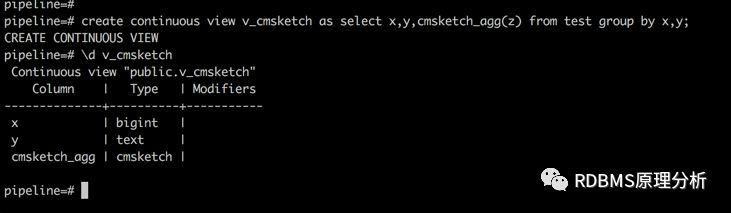   
   
插入测试数据：   
   
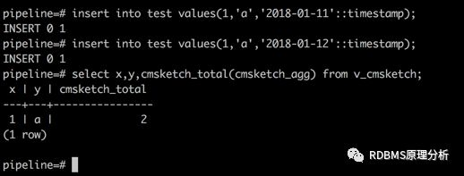   
   
官方说明：http://docs.pipelinedb.com/aggregates.html#count-min-sketch-aggregates   
   
   
   
   
   
   
   
## Filtered-Space Saving Top-K (FSS)   
   
   
   
PipelineDB中FSS的具体实现:src/backend/pipeline/fss.c   
   
FSS在具体的使用是计算Top-K,官方的具体实现是根据论文：   
   
http://www.l2f.inesc-id.pt/~fmmb/wiki/uploads/Work/dict.refd.pdf   
   
有兴趣的同学可以看看。   
   
   
   
在实际环境中，例如计算最近5分钟的top-10，并且非常的节省空间和内存，我们来看看pp是如何使用的。   
   
例子：   
   
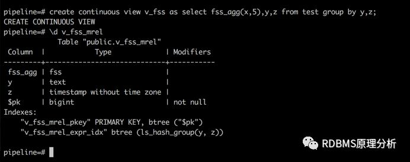   
   
插入测试数据：   
   
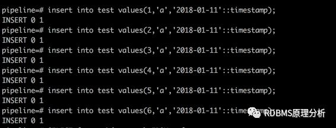   
   
插入6条数据   
   
   
   
查询v_fss   
   
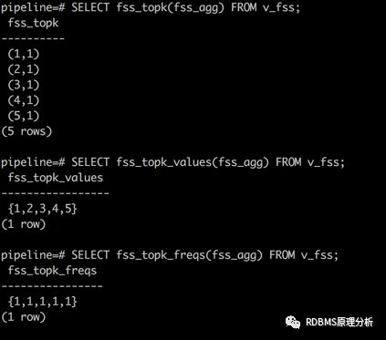   
   
通过fss_topk只查询出5条，每个都显示value为1   
   
插入的6不见了   
   
   
   
fss_topk_values输出每个value   
   
fss_topk_freqs是每个element的个数   
   
   
   
再插入一条：   
   
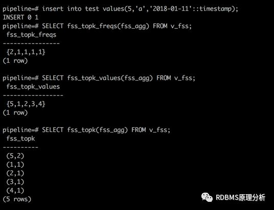   
   
5是2条数据。   
   
   
   
插入6   
   
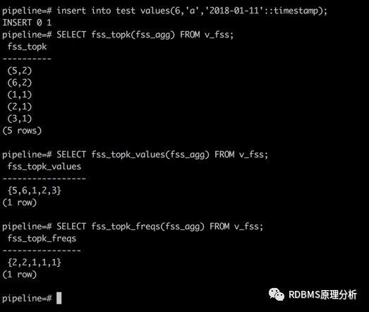   
   
6出现了，并且替换掉了4.   
   
   
   
官方说明：http://docs.pipelinedb.com/builtin.html#filtered-space-saving-functions   
   
   
   
   
   
## T-Digest   
   
   
   
PipelineDB中tdigest的实现：src/backend/pipeline/tdigest.c   
   
   
   
tdigest主要是根据百分位数和中位数来进行估计计算。感觉跟数据库中内置函数percentile_cont有点像。这个功能没怎么用过   
   
具体可以看看https://github.com/tdunning/t-digest/blob/master/docs/t-digest-paper/histo.pdf   
   
我简单的介绍一下如何在PipelineDB中的使用吧。   
   
例子：   
   
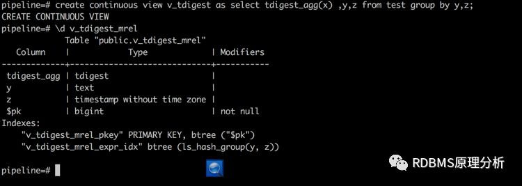   
   
   
   
插入数据：   
   
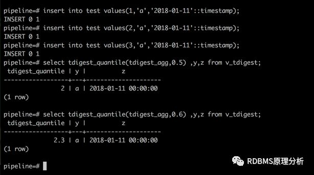   
   
0.5取的中位数2   
   
0.6是2.3   
   
大概就是这样的情况，官方说明：   
   
http://docs.pipelinedb.com/builtin.html#t-digest-functions   
   
   
   
over,差不多介绍了个简单的使用吧，里面的SQL如果想实验可以来github拿一下   
   
https://github.com/sangli00/WeCharOfficialAccounts/blob/master/PipelineDB内置函数介绍.sql   
   
   
   
洗洗睡了。。zzzz   
  
  
  
  
  
  
  
  
## [digoal's 大量PostgreSQL文章入口](https://github.com/digoal/blog/blob/master/README.md "22709685feb7cab07d30f30387f0a9ae")
  
