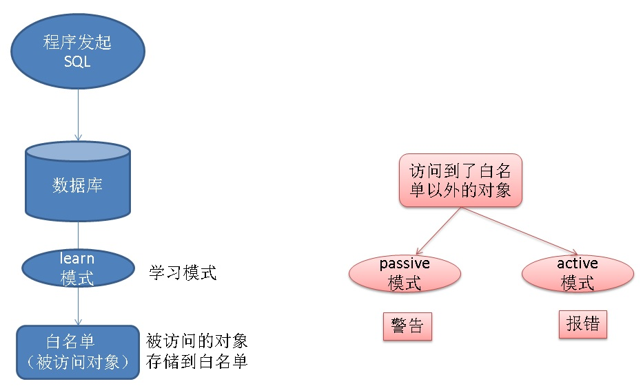

## PostgreSQL 商用版本EPAS(阿里云ppas(Oracle 兼容版)) SQL防火墙使用（白名单管理、防SQL注入、防DDL等）      
                                    
### 作者                                    
digoal                                    
                                    
### 日期                                    
2018-01-16                                   
                                    
### 标签                                    
PostgreSQL , PPAS , enterprisedb , SQL 防火墙 , SQL 注入           
                                    
----                                    
                                    
## 背景          
数据库SQL防火墙是一个安全加强功能，通常被用于防止或减轻数据库被攻击后，泄露数据或者数据被破坏带来的损失。         
         
包括：         
         
1、防止SQL注入。         
         
2、防止业务访问无需访问的对象。         
         
3、防止业务执行DDL。         
         
4、防止业务执行不带WHERE条件的DML。         
         
5、防止业务执行不带WHERE条件或者WHERE条件始终未TRUE的查询。         
         
通常，严格的授权并不能完全杜绝攻击带来的危害。         
         
PostgreSQL的权限体系非常的健全，从连接、库、SCHEMA、对象一直到行这个级别，都支持权限管理。         
         
[《PostgreSQL 逻辑结构 和 权限体系 介绍》](../201605/20160510_01.md)           
         
授权甚至精确到行、列、安全标签 这个层面。         
         
1、列级授权         
         
https://www.postgresql.org/docs/10/static/sql-grant.html         
         
```         
GRANT { { SELECT | INSERT | UPDATE | REFERENCES } ( column_name [, ...] )         
    [, ...] | ALL [ PRIVILEGES ] ( column_name [, ...] ) }         
    ON [ TABLE ] table_name [, ...]         
    TO role_specification [, ...] [ WITH GRANT OPTION ]         
```         
         
2、行级授权，使用的是row security label         
         
https://www.postgresql.org/docs/10/static/ddl-rowsecurity.html         
         
```         
-- 例子         
         
CREATE TABLE accounts (manager text, company text, contact_email text);         
         
ALTER TABLE accounts ENABLE ROW LEVEL SECURITY;         
         
CREATE POLICY account_managers ON accounts TO managers         
    USING (manager = current_user);         
```         
         
[《PostgreSQL 行安全策略 - PostgreSQL 9.5 new feature - can define row security policy for table》](../201504/20150409_01.md)           
         
3、安全标签。结合LINUX的selinux特性，可以更加的精确。         
         
https://wiki.postgresql.org/wiki/SEPostgreSQL_SELinux_Overview         
         
https://www.postgresql.org/docs/10/static/sql-security-label.html         
         
https://www.postgresql.org/docs/10/static/sepgsql.html         
         
虽然PG的权限体系非常的完善，但是依旧无法完全防止攻击者带来的危害，只是减轻而已。         
         
PS: 要注意，SQL防火墙，同样也不能完全避免危害，也只能减轻而已。不要以为有SQL防火墙就万事大吉了。         
         
EDB EPAS发布的商用版本，支持了SQL防火墙的功能，可以用于弥补权限体系上的不足，用于：         
         
1、防止SQL注入。(通过禁止执行 where条件带or 永远是true的 SQL)         
         
2、防止业务访问无需访问的对象。(通过白名单)         
         
3、防止业务执行DDL。(禁止DDL)         
         
4、防止业务执行不带WHERE条件的DML。(通过禁止执行 不带WHERE条件的 DML)         
         
5、防止业务执行不带WHERE条件或者WHERE条件始终未TRUE的查询。(通过禁止执行 where条件带or 永远是true的 SQL)         
         
下面介绍其原理和用法。         
         
## 原理         
         
         
1、当设置为learn模式时，通过学习，得到用户程序正常使用过程中，需要访问的对象(解析SQL得到)。         
         
2、这些对象被设置为白名单。         
         
3、当设置为passive模式时，不在白名单的对象，如果被访问了，发出警告。         
         
4、当设置为active模式时，不在白名单的对象，如果被访问了，报错。也就是不允许访问。         
         
5、其他规则包括（禁止DDL开关，禁止不带WHERE条件的DML开关，禁止WHERE始终为TRUE的查询SQL开关。）         
         
## 配置         
1、将SO拷贝到$PGDATA/lib目录。         
         
```         
-- 安装完PPAS，应该已经存在了         
         
cp sqlprotect.so $PGDATA/lib         
```         
         
2、配置postgresql.conf         
         
```         
shared_preload_libraries='$libdir/sqlprotect'  # 如果有其他so, 逗号隔开         
```         
         
3、在需要使用SQL防火墙功能的DB中创建一些管理表、视图、函数。         
         
```         
psql -d digoal -f $PGHOME/share/contrib/sqlprotect.sql         
```         
         
会在数据库中创建SCHEMA,以及对应的管理函数、视图、表。         
         
4、配置集群、库、用户级参数，是否开启SQL防火墙。         
         
```         
edb_sql_protect.enabled = on         
```         
         
其他的参数包括         
         
- shared_preload_libraries. Add $libdir/sqlprotect to the list of libraries.         
         
- edb_sql_protect.enabled. Controls whether or not SQL/Protect is actively monitoring protected roles by analyzing SQL statements issued by those roles and reacting according to the setting of edb_sql_protect.level. When you are ready to begin monitoring with SQL/Protect set this parameter to on. If this parameter is omitted, the default is off.         
         
- edb_sql_protect.level. Sets the action taken by SQL/Protect when a SQL statement is issued by a protected role. If this parameter is omitted, the default behavior is  passive. Initially, set this parameter to learn. See Section 4.1.2.1.2 for further explanation of this parameter.         
         
- edb_sql_protect.max_protected_roles. Sets the maximum number of roles that can be protected. If this parameter is omitted, the default setting is 64. See Section 3.1.3.12.8 for information on the maximum range of this parameter.         
         
- edb_sql_protect.max_protected_relations. Sets the maximum number of relations that can be protected per role. If this parameter is omitted, the default setting is 1024.         
Please note the total number of protected relations for the server will be the number of protected relations times the number of protected roles. Every protected relation consumes space in shared memory. The space for the maximum possible protected relations is reserved during database server startup.         
See Section 3.1.3.12.7 for information about the maximum range of this parameter.         
         
- edb_sql_protect.max_queries_to_save. Sets the maximum number of offending queries to save in the edb_sql_protect_queries view. If this parameter is omitted, the default setting is 5000. If the number of offending queries reaches the limit, additional queries are not saved in the view, but are accessible in the database server log file. Note: The minimum valid value for this parameter is 100. If a value less than 100 is specified, the database server starts using the default setting of 5000. A warning message is recorded in the database server log file. See Section 3.1.3.12.9 for information on the maximum range of this parameter.         
         
除了shared_preload_libraries参数需要重启数据库，其他的都不需要，只需要reload配置文件即可。         
         
5、将数据库用户添加到防火墙中监管。         
         
```         
edb=# SELECT protect_role('appuser');         
 protect_role         
--------------         
          
(1 row)         
```         
         
查看当前被监控的用户         
         
```         
edb=# \x         
Expanded display is on.         
edb=# SELECT * FROM list_protected_users;  -- 基表edb_sql_protect         
-[ RECORD 1 ]------+--------         
dbname             | edb         
username           | appuser           
protect_relations  | t   -- 是否使用白名单保护对象         
allow_utility_cmds | f   -- 否允许执行DDL         
allow_tautology    | f   -- 是否允许执行包含TRUE条件的SELECT         
allow_empty_dml    | f   -- 是否允许执行包含TRUE条件的DML         
```         
         
update edb_sql_protect 可以设置是否允许执行DDL，是否允许执行包含TRUE条件的SELECT，是否允许执行不带条件的DML。         
         
6、配置学习模式，并开启程序，学习并生成对象白名单。         
         
```         
edb_sql_protect.enabled = on         
edb_sql_protect.level = learn         
         
edb=# SELECT pg_reload_conf();         
 pg_reload_conf         
----------------         
 t         
(1 row)         
```         
         
学习过程举例，执行SQL，对象被学习         
         
```         
edb=> SELECT * FROM dept;         
NOTICE:  SQLPROTECT: Learned relation: 16384         
 deptno |   dname    |   loc             
--------+------------+----------         
     10 | ACCOUNTING | NEW YORK         
     20 | RESEARCH   | DALLAS         
     30 | SALES      | CHICAGO         
     40 | OPERATIONS | BOSTON         
(4 rows)         
          
edb=> SELECT empno, ename, job FROM emp WHERE deptno = 10;         
NOTICE:  SQLPROTECT: Learned relation: 16391         
 empno | ename  |    job             
-------+--------+-----------         
  7782 | CLARK  | MANAGER         
  7839 | KING   | PRESIDENT         
  7934 | MILLER | CLERK         
(3 rows)         
         
edb=> CREATE TABLE appuser_tab (f1 INTEGER);         
NOTICE:  SQLPROTECT: This command type is illegal for this user         
CREATE TABLE         
edb=> DELETE FROM appuser_tab;         
NOTICE:  SQLPROTECT: Learned relation: 16672         
NOTICE:  SQLPROTECT: Illegal Query: empty DML         
DELETE 0         
```         
         
查看已学习到的对象         
         
```         
edb=# SET search_path TO sqlprotect;         
SET         
         
edb=# SELECT * FROM edb_sql_protect_rel;         
 dbid  | roleid | relid          
-------+--------+-------         
 13917 |  16671 | 16384         
 13917 |  16671 | 16391         
 13917 |  16671 | 16672         
(3 rows)         
         
edb=# SELECT * FROM list_protected_rels;         
 Database | Protected User | Schema |    Name     | Type  |    Owner              
----------+----------------+--------+-------------+-------+--------------         
 edb      | appuser        | public | dept        | Table | enterprisedb         
 edb      | appuser        | public | emp         | Table | enterprisedb         
 edb      | appuser        | public | appuser_tab | Table | appuser         
(3 rows)         
```         
         
7、配置为passive或active模式。开启访问对象过滤的安全功能。         
         
```         
edb_sql_protect.enabled = on         
edb_sql_protect.level = passive         
         
-- 只是警告，还是能执行         
edb=> CREATE TABLE appuser_tab_2 (f1 INTEGER);         
WARNING:  SQLPROTECT: This command type is illegal for this user         
CREATE TABLE         
edb=> INSERT INTO appuser_tab_2 VALUES (1);         
WARNING:  SQLPROTECT: Illegal Query: relations         
INSERT 0 1         
edb=> INSERT INTO appuser_tab_2 VALUES (2);         
WARNING:  SQLPROTECT: Illegal Query: relations         
INSERT 0 1         
edb=> SELECT * FROM appuser_tab_2 WHERE 'x' = 'x';         
WARNING:  SQLPROTECT: Illegal Query: relations         
WARNING:  SQLPROTECT: Illegal Query: tautology         
 f1          
----         
  1         
  2         
(2 rows)         
```         
         
查看警告的次数，以及哪些SQL存在风险（即触发警告的SQL）。         
         
```         
edb=# SET search_path TO sqlprotect;         
SET         
edb=# SELECT * FROM edb_sql_protect_stats;         
 username | superusers | relations | commands | tautology | dml          
----------+------------+-----------+----------+-----------+-----         
 appuser  |          0 |         3 |        1 |         1 |   0         
(1 row)         
         
edb=# SELECT * FROM edb_sql_protect_queries;         
-[ RECORD 1 ]+---------------------------------------------         
 username     | appuser                                               
 ip_address   |                                                       
 port         |                                                       
 machine_name |                                                       
 date_time    | 20-JUN-14 13:21:00 -04:00                             
 query        | INSERT INTO appuser_tab_2 VALUES (1);                 
-[ RECORD 2 ]+---------------------------------------------         
 username     | appuser                                               
 ip_address   |                                                       
 port         |                                                       
 machine_name |                                                       
 date_time    | 20-JUN-14 13:21:00 -04:00                             
 query        | CREATE TABLE appuser_tab_2 (f1 INTEGER);              
-[ RECORD 3 ]+---------------------------------------------         
 username     | appuser                                               
 ip_address   |                                                       
 port         |                                                       
 machine_name |                                                       
 date_time    | 20-JUN-14 13:22:00 -04:00                             
 query        | INSERT INTO appuser_tab_2 VALUES (2);                 
-[ RECORD 4 ]+---------------------------------------------         
 username     | appuser                                               
 ip_address   |                                                       
 port         |                                                       
 machine_name |                                                       
 date_time    | 20-JUN-14 13:22:00 -04:00                             
 query        | SELECT * FROM appuser_tab_2 WHERE 'x' = 'x';         
```         
         
采用active模式，警告变成错误，实际起到预防作用。         
         
```         
edb_sql_protect.enabled = on         
edb_sql_protect.level = active         
         
edb=> CREATE TABLE appuser_tab_3 (f1 INTEGER);         
ERROR:  SQLPROTECT: This command type is illegal for this user         
edb=> INSERT INTO appuser_tab_2 VALUES (1);         
ERROR:  SQLPROTECT: Illegal Query: relations         
edb=> SELECT * FROM appuser_tab_2 WHERE 'x' = 'x';         
ERROR:  SQLPROTECT: Illegal Query: relations         
```         
         
8、配置其他规则包括（禁止DDL开关，禁止不带WHERE条件的DML开关，禁止WHERE始终为TRUE的查询SQL开关。）         
         
```         
UPDATE edb_sql_protect SET allow_utility_cmds = TRUE WHERE dbid = 13917 AND roleid = 16671;         
         
edb=# SELECT dbid, roleid, allow_utility_cmds FROM edb_sql_protect;         
 dbid  | roleid | allow_utility_cmds          
-------+--------+--------------------         
 13917 |  16671 | t         
(1 row)         
```         
         
9、规则导出和导入。注意：所有的规则的标记都是基于OID的，例如对象、用户，存储的都是OID。         
         
当使用逻辑导出、导入时，由于目标库的OID与源库可能不一样，所以导入、导出必须使用特殊的方法（PPAS提供了这个导入函数接口，可以在导入时，转换为对应的OID）。         
         
https://www.enterprisedb.com/docs/en/10.0/EPAS_Guide_v10/EDB_Postgres_Advanced_Server_Guide.1.51.html         
         
导出，除了pg_dump之外，还需要使用这个方法导出规则。         
         
```         
pg_dump -U enterprisedb -Fp -f /tmp/edb.dmp edb         
```         
         
```         
edb=# SELECT sqlprotect.export_sqlprotect('/tmp/sqlprotect.dmp');         
 export_sqlprotect         
-------------------         
          
(1 row)         
```         
         
导入，除了导入数据以外，需要额外的操作         
         
首先要删除已有数据         
         
```         
/opt/edb/as10/bin/psql -d newdb -U enterprisedb -f /tmp/edb.dmp         
         
         
DELETE FROM sqlprotect.edb_sql_protect_rel;         
DELETE FROM sqlprotect.edb_sql_protect;         
         
SELECT * FROM sqlprotect.edb_sql_protect_stats;         
....         
SELECT sqlprotect.drop_stats('appuser');         
```         
         
然后使用API导入：         
         
```         
newdb=# SELECT sqlprotect.import_sqlprotect('/tmp/sqlprotect.dmp');         
 import_sqlprotect         
-------------------         
          
(1 row)         
```         
     
10、统计信息表解读     
     
计数表：edb_sql_protect_stats    
   
- username. Name of the protected role.   
   
- superusers. Number of SQL statements issued when the protected role is a superuser. In effect, any SQL statement issued by a protected superuser increases this statistic. See Section 4.1.1.2.1 for information on protected superusers.   
   
- relations. Number of SQL statements issued referencing relations that were not learned by a protected role. (That is, relations that are not in a role’s protected relations list.)   
   
- commands. Number of DDL statements issued by a protected role.   
   
- tautology. Number of SQL statements issued by a protected role that contained a tautological condition.   
   
- dml. Number of UPDATE and DELETE statements issued by a protected role that did not contain a WHERE clause.   
   
   
风险SQL表：edb_sql_protect_queries    
   
- username. Database user name of the attacker used to log into the database server.   
   
- ip_address. IP address of the machine from which the attack was initiated.   
   
- port. Port number from which the attack originated.   
   
- machine_name. Name of the machine, if known, from which the attack originated.   
   
- date_time. Date and time at which the query was received by the database server. The time is stored to the precision of a minute.   
   
- query. The query string sent by the attacker.   
         
## 用法         
         
1、添加被监控的用户         
         
```         
edb=# SELECT protect_role('newuser');         
 protect_role         
--------------         
          
(1 row)         
```         
         
2、删除被监控的用户（即不再监控这个用户）         
         
```         
unprotect_role('rolename')         
unprotect_role(roleoid)         
```         
         
3、设置角色的监控项（白名单保护、DDL保护、SELECT保护、DML保护）         
         
```         
UPDATE edb_sql_protect SET allow_utility_cmds = TRUE WHERE dbid = 13917 AND roleid = 16671;         
         
edb=# \x         
Expanded display is on.         
edb=# SELECT * FROM list_protected_users;  -- 或 基表 edb_sql_protect         
-[ RECORD 1 ]------+--------         
dbname             | edb         
username           | appuser           
protect_relations  | t   -- 是否使用白名单保护对象         
allow_utility_cmds | f   -- 否允许执行DDL         
allow_tautology    | f   -- 是否允许执行包含TRUE条件的SELECT         
allow_empty_dml    | f   -- 是否允许执行包含TRUE条件的DML         
```         
         
4、白名单管理，从白名单移除某个对象         
         
```         
unprotect_rel('rolename', 'relname')         
unprotect_rel('rolename', 'schema', 'relname')         
unprotect_rel(roleoid, reloid)         
         
edb=# SELECT unprotect_rel('appuser', 'public', 'emp');         
 unprotect_rel         
---------------         
          
(1 row)         
```         
         
5、清除计数器（风险计数器）          
         
```         
drop_stats('rolename')         
drop_stats(roleoid)         
         
edb=# SELECT drop_stats('appuser');         
 drop_stats         
------------         
          
(1 row)         
          
edb=# SELECT * FROM edb_sql_protect_stats;         
 username | superusers | relations | commands | tautology | dml         
----------+------------+-----------+----------+-----------+-----         
(0 rows)         
```         
         
如果对象已不存在，使用OID来移除         
         
         
```         
edb=# SELECT * FROM edb_sql_protect_stats;         
      username       | superusers | relations | commands | tautology | dml         
---------------------+------------+-----------+----------+-----------+-----         
 unknown (OID=16693) |          0 |         5 |        3 |         1 |   0         
 appuser             |          0 |         5 |        2 |         1 |   0         
(2 rows)         
          
edb=# SELECT drop_stats(16693);         
 drop_stats         
------------         
          
(1 row)         
          
edb=# SELECT * FROM edb_sql_protect_stats;         
 username | superusers | relations | commands | tautology | dml         
----------+------------+-----------+----------+-----------+-----         
 appuser  |          0 |         5 |        2 |         1 |   0         
(1 row)         
```         
         
6、清除风险SQL日志         
         
```         
drop_queries('rolename')         
drop_queries(roleoid)         
         
         
edb=# SELECT drop_queries('appuser');         
 drop_queries          
--------------         
            5         
(1 row)         
          
edb=# SELECT * FROM edb_sql_protect_queries;         
 username | ip_address | port | machine_name | date_time | query          
----------+------------+------+--------------+-----------+-------         
(0 rows)         
```         
         
如果对象已不存在，使用OID来移除         
         
```         
edb=# SELECT username, query FROM edb_sql_protect_queries;           
      username       |                    query                              
---------------------+----------------------------------------------         
 unknown (OID=16454) | CREATE TABLE appuser_tab_2 (f1 INTEGER);         
 unknown (OID=16454) | INSERT INTO appuser_tab_2 VALUES (2);         
 unknown (OID=16454) | CREATE TABLE appuser_tab_3 (f1 INTEGER);         
 unknown (OID=16454) | INSERT INTO appuser_tab_2 VALUES (1);         
 unknown (OID=16454) | SELECT * FROM appuser_tab_2 WHERE 'x' = 'x';         
(5 rows)         
          
edb=# SELECT drop_queries(16454);         
 drop_queries          
--------------         
            5         
(1 row)         
          
edb=# SELECT * FROM edb_sql_protect_queries;         
 username | ip_address | port | machine_name | date_time | query          
----------+------------+------+--------------+-----------+-------         
(0 rows)         
```         
         
7、启动或禁止SQL防火墙         
         
```         
edb_sql_protect.enabled = off         
edb_sql_protect.enabled = on         
```         
        
## 小结      
PPAS的SQL防火墙实现了以下风险的管理：        
      
1、防止SQL注入。         
         
2、防止业务访问无需访问的对象。         
         
3、防止业务执行DDL。         
         
4、防止业务执行不带WHERE条件的DML。         
         
5、防止业务执行不带WHERE条件或者WHERE条件始终未TRUE的查询。         
         
PostgreSQL的权限体系也非常的健全，从连接、库、SCHEMA、对象一直到行这个级别，都支持权限管理。         
         
[《PostgreSQL 逻辑结构 和 权限体系 介绍》](../201605/20160510_01.md)           
         
授权甚至精确到行、列、安全标签 这个层面。         
         
1、列级授权         
         
https://www.postgresql.org/docs/10/static/sql-grant.html           
         
2、行级授权，使用的是row security label         
         
https://www.postgresql.org/docs/10/static/ddl-rowsecurity.html           
         
[《PostgreSQL 行安全策略 - PostgreSQL 9.5 new feature - can define row security policy for table》](../201504/20150409_01.md)           
         
3、安全标签。结合LINUX的selinux特性，可以更加的精确。         
         
https://wiki.postgresql.org/wiki/SEPostgreSQL_SELinux_Overview         
         
https://www.postgresql.org/docs/10/static/sql-security-label.html         
         
https://www.postgresql.org/docs/10/static/sepgsql.html         
         
虽然PG的权限体系非常的完善，但是依旧无法完全防止攻击者带来的危害，只是减轻而已。         
         
PS: 要注意，SQL防火墙，同样也不能完全避免危害，也只能减轻而已。不要以为有SQL防火墙就万事大吉了。         
         
## 参考         
[《PostgreSQL 逻辑结构 和 权限体系 介绍》](../201605/20160510_01.md)           
         
[《PostgreSQL 转义、UNICODE、与SQL注入》](../201704/20170402_01.md)           
         
[《PostgreSQL SQL防火墙》](../201708/20170807_02.md)           
         
[《PostgreSQL SQL filter (SQL 成本|语义过滤器)》](../201801/20180111_01.md)           
  
<a rel="nofollow" href="http://info.flagcounter.com/h9V1"  ></a>  
  
  
  
  
  
  
## [digoal's 大量PostgreSQL文章入口](https://github.com/digoal/blog/blob/master/README.md "22709685feb7cab07d30f30387f0a9ae")
  
