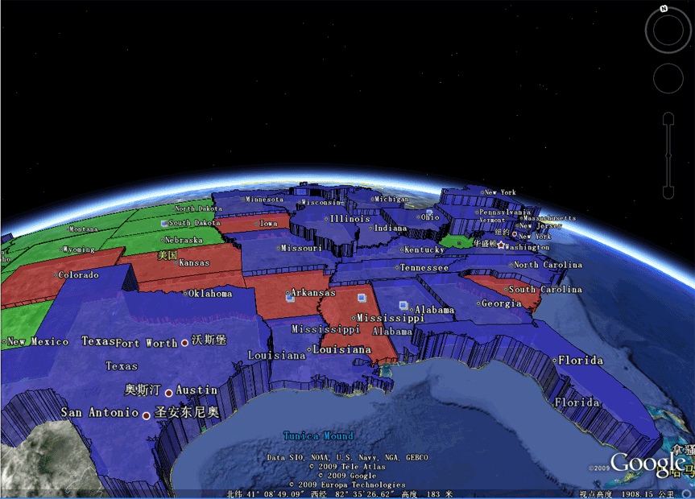
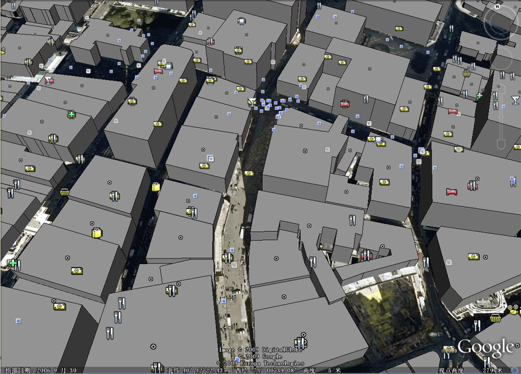
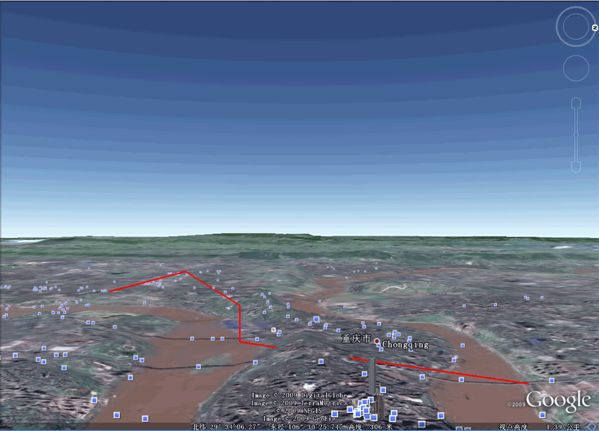

## 如何将谷歌地球(google earth) 的数据导入 PostgreSQL               
                                                
### 作者                                                
digoal                                                
                                                
### 日期                                                
2018-01-18                                              
                                                
### 标签                                                
PostgreSQL , google earth , kml , ogc                 
                                                
----                                                
                                                
## 背景                     
KML(Keyhole Markup Language) 是一种文件格式，用于在地球浏览器（例如 Google 地球、Google 地图和 Google 地图移动版）中显示地理数据。KML 使用包含嵌套的元素和属性的结构（基于标记），并符合 XML 标准。      
      
由于KML已经加入OGC标准，所以作为OGC的成员之一的PostGIS也是会支持KML格式的，通过st_geomfromkml可以将KML中的geometry分段导入到PG数据库中。      
      
```      
geometry ST_GeomFromKML(text geomkml);      
```      
      
例子      
      
```      
SELECT ST_GeomFromKML('      
		<LineString>      
			<coordinates>-71.1663,42.2614      
				-71.1667,42.2616</coordinates>      
		</LineString>');      
```    
     
除此之外，还可以使用ogr2ogr 将kml(kmz，依赖libkml)文件转换为esri格式，再通过shp2pgsql导入到PostgreSQL.    
   
参考：     
   
http://www.bigfastblog.com/landsliding-into-postgis-with-kml-files   
      
## [转]使用Geoserver和Google Earth打造三维GIS展示系统      
原文      
      
http://blog.csdn.net/iwillsw/article/details/4733300      
      
      
给图层添加高度数据，需要根据实体几何类型分别处理。对于面，例如行政区界或建筑物，需要创建一个高度模板文件。      
      
对于线（点），例如架空电缆，高程将直接从图形数据中读取。      
      
GeoServer 1.7.1及以上版本支持输出三维面的KML(KMZ)，1.7.6及以上版本支持输出三维线（点）的KML(KMZ)。      
      
### 发布三维面图层：       
      
用Geoserver发布三维面的过程非常简单，测试中我们使用Geoserver自带的示例图层topp:states。      
      
1、用记事本新建一个文本文件（高度模板文件），命名为height.ftl 。      
      
2、在文件中加入一行脚本，格式为${ATTRIBUTE.value}，ATTRIBUTE是属性字段的名称。      
      
例如states图层有属性字段 PERSONS，记录每个州的人口, 输入 ${PERSONS.value?number/100}，把高度和人口数建立关系。      
      
3、将 height.ftl 复制到Geoserver的/data/featureTypes/states/目录下 。      
      
4、进入Geoserver地图预览页面，找到topp:states，选择KML，打开Google Earth浏览效果。      
      
效果图1      
      
      
      
官方原文见：http://geoserver.org/display/GEOSDOC/04-Height+Templates      
      
作为练习，可以根据官方文档      
      
http://demo.opengeo.org:8080/display/GEOSDOC/05-Super+Overlays+and+Extrudes+with+Building+Data，      
      
发布纽约曼哈顿的建筑物，浏览三维城市效果。      
      
效果图2      
      
      
      
### 发布三维线图层：       
      
三维线不使用height.ftl文件，因为一条线有两个以上的节点，每个节点可能有不同的高度值， 高程直接存放在图形数据（Geometry）的Z坐标中。      
      
Oracle Spatial、PostgreSQL（PostGIS）等数据库都支持存储三维坐标。      
      
Geoserver可以直接发布三维线，测试中使用Oracle Spatial（10g）和PostgreSQL（8.3）作为数据源。      
      
1、在Oracle Spatial（10g）或PostgreSQL（8.3）中存入包含Z坐标的三维线数据，作为测试，可用直接SQL语句插入数据。      
      
2、在Geoserver中发布该图层。      
      
3、进入Geoserver地图预览页面，找到刚才发布的图层，选择KML，打开Google Earth浏览效果。      
      
需要注意的是，默认KML（KMZ）在Google Earth中的实际效果是三维面。      
      
经过查阅KML文档，要实现三维线，需要在KML链接后加上可选参数format_options=extrude:0，例如将      
      
http://192.98.151.200:8080/geoserver/wms/kml?layers=topp:TESTL      
      
改为      
      
http://192.98.151.200:8080/geoserver/wms/kml?layers=topp:TESTL&format_options=extrude:0      
      
效果图3      
      
      
      
Google KML Version 2.2已经获得OGC批准，成为国际标准的数据存储格式。ESRI、INTERGRAPH、MAPINFO在其最新版本软件中提供KML格式输出支持。      
      
Google定义的KML不仅可以包含三维高程数据，还能加入四维时间数据。      
      
本文只涉及三维数据的发布和展示，相关技术文档请参考Google KML和Geoserver KML页面。      
      
Google KML页面：http://code.google.com/apis/kml/documentation/      
      
Geoserver KML页面：http://geoserver.org/display/GEOSDOC/KML+KMZ+Output http://geoserver.org/display/GEOSDOC/Google+Earth+Features      
      
本文涉及的软件环境为：Geoserver 1.7.7、Geoserver 2.0、Google Earth 5.1、Oracle 10.2.0.3、PostgreSQL      
	       
## 参考               
http://www.opengeospatial.org/standards/kml      
      
https://developers.google.com/kml/documentation/kml_tut      
      
http://postgis.net/docs/ST_GeomFromKML.html      
         
  
<a rel="nofollow" href="http://info.flagcounter.com/h9V1"  ></a>  
  
  
  
  
  
  
## [digoal's 大量PostgreSQL文章入口](https://github.com/digoal/blog/blob/master/README.md "22709685feb7cab07d30f30387f0a9ae")
  
