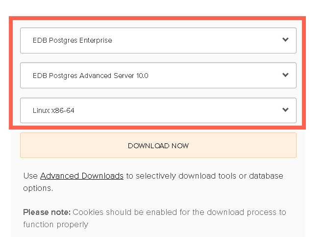
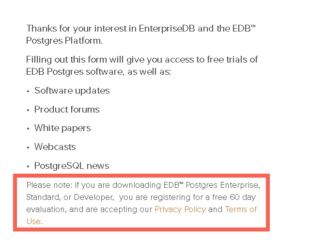
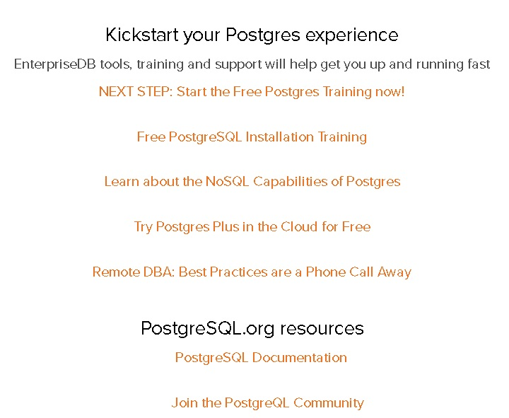
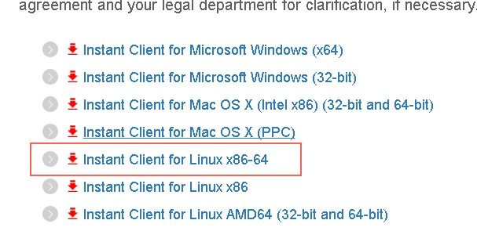
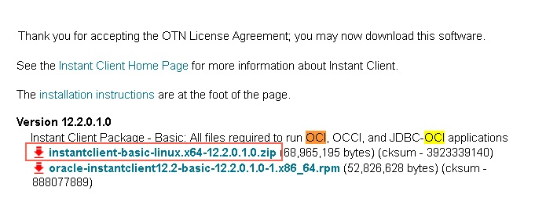

## PostgreSQL 商用版本EPAS(阿里云ppas) - 测试环境部署(EPAS 安装、配置、管理、Oracle DBLINK、外表)     
                             
### 作者                             
digoal                             
                             
### 日期                             
2018-01-19                            
                             
### 标签                             
PostgreSQL , Enterprisedb , EPAS , ppas , 测试      
                             
----                             
                             
## 背景       
PostgreSQL 商用版本EPAS( [阿里云ppas](https://www.aliyun.com/product/rds/ppas) )，如何自己部署一套PPAS数据库在客户端进行测试？      
     
## 部署PPAS数据库     
### 配置操作系统     
（为了更好的性能、稳定性）：     
     
可以参考以下文章中的OS配置部分(主要包括sysctl.conf, limit等配置)：       
     
[《PostgreSQL 10 on ECS 实施 流复制备库镜像+自动快照备份+自动备份验证+自动清理备份与归档》](../201711/20171129_02.md)       
     
[《PostgreSQL 10 + PostGIS + Sharding(pg_pathman) + MySQL(fdw外部表) on ECS 部署指南(适合新用户)》](../201710/20171018_01.md)       
     
[《PostgreSQL on ECS多云盘的部署、快照备份和恢复》](../201708/20170812_01.md)       
     
[《PostgreSQL on Linux 最佳部署手册》](../201611/20161121_01.md)       
     
     
### 下载PPAS安装包     
如果你需要自己挑选工具或组件进行下载，请打开以下链接进行选择。     
     
https://www.enterprisedb.com/advanced-downloads     
     
     
本文选择，傻瓜式打包下载，请打开以下链接，选择对应的产品下载：     
     
https://www.enterprisedb.com/software-downloads-postgres     
     
选择版本：     
     
     
     
点击下载，会给你一个提示，仅用于60天的试用：     
     
     
     
然后你需要输入一个EDB注册的账号（[免费注册链接](https://www.enterprisedb.com/user-login-registration)，比如:   digoal@126.com , 123456 ）：         
     
     
     
开始下载，下载页面会附上EDB的文档等链接，需要的话你可以点进去看一下。     
     
     
     
下载完成后，将安装包拷贝到服务器（建议CentOS 7.4 x64）。     
     
### 安装PPAS软件和初始化数据库     
     
1、解压安装包     
     
```     
[root@digoal ~]# mkdir edb     
[root@digoal ~]# mv edb-as10-server-10.1.5-1-linux-x64.tar.gz  edb/     
[root@digoal ~]# cd edb     
[root@digoal edb]# ll     
total 126224     
-rw-r--r-- 1 root root 129249660 Jan 19 10:17 edb-as10-server-10.1.5-1-linux-x64.tar.gz     
[root@digoal edb]# tar -zxvf edb-as10-server-10.1.5-1-linux-x64.tar.gz      
edb-as10-server-10.1.5-1-linux-x64/     
edb-as10-server-10.1.5-1-linux-x64/README_FIRST_Linux64.txt     
edb-as10-server-10.1.5-1-linux-x64/edb-as10-server-10.1.5-1-linux-x64.run     
[root@digoal edb]# ll     
total 126228     
drwxrwxr-x 2  501  501      4096 Nov  8 12:05 edb-as10-server-10.1.5-1-linux-x64     
-rw-r--r-- 1 root root 129249660 Jan 19 10:17 edb-as10-server-10.1.5-1-linux-x64.tar.gz     
[root@digoal edb]# cd edb-as10-server-10.1.5-1-linux-x64     
[root@digoal edb-as10-server-10.1.5-1-linux-x64]# ll     
total 127604     
-rwxr-xr-x 1 501 501 130656365 Nov  8 12:05 edb-as10-server-10.1.5-1-linux-x64.run     
-rw-rw-r-- 1 501 501      5569 Nov  8 12:05 README_FIRST_Linux64.txt     
```     
     
2、执行安装程序     
     
```     
[root@digoal edb-as10-server-10.1.5-1-linux-x64]# ./edb-as10-server-10.1.5-1-linux-x64.run      
     
```     
     
3、安装过程，会遇到一些需要输入的地方，根据实际情况输入     
     
```     
----------------------------------------------------------------------------     
Welcome to the EDB Postgres Advanced Server Setup Wizard.     
     
----------------------------------------------------------------------------     
Please read the following License Agreement. You must accept the terms of this      
agreement before continuing with the installation.     
```     
     
回车，看完它的license     
     
```     
Press [Enter] to continue:     
```     
     
选择y，同意它的license     
     
```     
Do you accept this license? [y/n]: y     
```     
     
然后又会提示你输入EDB的账号密码     
     
     
```     
User Authentication     
     
This installation requires a registration with EnterpriseDB.com. Please enter      
your credentials below. If you do not have an account, Please create one now on      
https://www.enterprisedb.com/user-login-registration     
     
     
     
Email []: digoal@126.com     
     
Password : 123456     
```     
     
输入安装路径，不输入的话，会使用这里的默认路径     
     
```     
----------------------------------------------------------------------------     
Please specify the directory where EDB Postgres Advanced Server will be      
installed.     
     
Installation Directory [/opt/edb/as10]:      
```     
     
选择安装组件，并确认     
     
```     
----------------------------------------------------------------------------     
Select the components you want to install; clear the components you do not want      
to install. Click Next when you are ready to continue.     
     
EDB Postgres Advanced Server [Y/n] :Y     
     
pgAdmin 4 [Y/n] :n     
     
StackBuilder Plus [Y/n] :n     
     
Command Line Tools [Y/n] :Y     
     
Is the selection above correct? [Y/n]: Y     
```     
     
输入你的数据目录，REDO(wal)目录。建议两者使用不同的块设备分区，并确保使用足够大的空间。wal的目录建议IOPS极好。     
     
```     
----------------------------------------------------------------------------     
Additional Directories     
     
Please select a directory under which to store your data.     
     
Data Directory [/opt/edb/as10/data]: /data01/edb/as10/data      # 不建议使用默认配置     
     
Please select a directory under which to store your Write-Ahead Logs.     
     
Write-Ahead Log (WAL) Directory [/opt/edb/as10/data/pg_wal]: /data02/edb/as10/pg_wal      # 不建议使用默认配置       
     
----------------------------------------------------------------------------     
```     
     
选择你需要兼容Oracle还是PostgreSQL，选择Oracle的话，会安装Oracle的一些兼容类型、包、视图、函数等，同时数据类型的显示会兼容Oracle的风格。     
     
如果不需要Oracle的兼容性，建议选择兼容PostgreSQL。更方便的逃离Oracle。     
     
```     
----------------------------------------------------------------------------     
Advanced Server Dialect     
     
EDB Postgres Advanced Server can be configured in one of two "Dialects" - 1) Compatible with Oracle or 2) Compatible with Postgres.     
     
If you select Compatible with Oracle, Advanced Server will be configured with appropriate data type conversions, time and date formats, Oracle-styled operators,      
dictionary views and more. This makes it easier to migrate or write new applications that are more compatible with the Oracle database.     
     
If you select Compatible with Postgres, Advanced Server will be configured with standard PostgeSQL data types, time/date formats and operators.     
     
Advanced Server Dialect     
     
[1] Compatible with Oracle     
[2] Compatible with Postgres     
Please choose an option [1] :      # 根据实际需要选择     
```     
     
输入数据库初始超级用户enterprisedb的密码，     
     
```     
----------------------------------------------------------------------------     
Please provide a password for the database superuser (enterprisedb). A locked      
Unix user account (enterprisedb) will be created if not present.     
     
Password : IlovePG     
Retype Password : IlovePG     
```     
     
输入数据库的监听端口号：     
     
```     
Please select the port number the server should listen on.     
     
Port [5444]: 1921     
```     
     
输入数据库字符集：     
     
```     
...     
[764] zh_CN.utf8     
...     
     
Please choose an option [1] : 764     
```     
     
是否安装示范表和存储过程，不需要。     
     
     
```     
Install sample tables and procedures. [y/N]: N     
```     
     
EDB具备动态优化的功能，这里会询问你的服务器是不是数据库独占的     
     
```     
----------------------------------------------------------------------------     
Dynatune Dynamic Tuning:     
Server Utilization     
     
Please select the type of server to determine the amount of system resources      
that may be utilized:     
     
     
     
[1] Development (e.g. a developer's laptop)     
[2] General Purpose (e.g. a web or application server)     
[3] Dedicated (a server running only Advanced Server)     
Please choose an option [2] : 2     
```     
     
这里会询问你的数据库用于什么业务场景，oltp, htap, olap 三个选项。     
     
```     
----------------------------------------------------------------------------     
Dynatune Dynamic Tuning:     
Workload Profile     
     
Please select the type of workload this server will be used for:     
     
     
     
[1] Transaction Processing (OLTP systems)     
[2] General Purpose (OLTP and reporting workloads)     
[3] Reporting (Complex queries or OLAP workloads)     
Please choose an option [1] :      
```     
     
准备安装，再次确认你的配置是否正确：     
     
```     
----------------------------------------------------------------------------     
Pre Installation Summary     
     
The following settings will be used for the installation::     
     
Installation Directory: /opt/edb/as10     
Server Installation Directory: /opt/edb/as10     
Data Directory: /data01/edb/as10/data     
WAL Directory: /data02/edb/as10/pg_wal     
Database Port: 1921     
Database Superuser: enterprisedb     
Operating System Account: enterprisedb     
Database Service: edb-as-10     
Command Line Tools Installation Directory: /opt/edb/as10     
```     
     
回车继续     
     
```     
Press [Enter] to continue:     
     
----------------------------------------------------------------------------     
Setup is now ready to begin installing EDB Postgres Advanced Server on your      
computer.     
```     
     
确认开始安装     
     
```     
Do you want to continue? [Y/n]: Y     
     
----------------------------------------------------------------------------     
Please wait while Setup installs EDB Postgres Advanced Server on your computer.     
     
 Installing EDB Postgres Advanced Server      
 0% ______________ 50% ______________ 100%     
 #########################################     
     
----------------------------------------------------------------------------     
Setup has finished installing EDB Postgres Advanced Server on your computer.     
```     
     
4、安装结束后，会新建一个操作系统用户enterprisedb，同时新增一个随操作系统自动启动数据库的服务。     
     
## 安装Oracle OCI     
     
1、安装Oracle OCI。这样才可以在EDB数据库中建立ORACLE的DBLINK。     
     
http://www.oracle.com/technetwork/database/features/instant-client/index-097480.html     
     
选择下载包含OCI的包（ 需要输入Oracle的账号密码。 可以免费注册。  zzz@qware.com , 111111 ）     
     
     
     
     
     
将安装包上传到服务器，解压，放到EDB的PGHOME目录，并建立软链。详情参考     
     
https://www.enterprisedb.com/docs/en/10.0/Ora_Compat_Dev_Guide/Database_Compatibility_for_Oracle_Developers_Guide.1.124.html#     
     
操作如下     
     
```     
[root@digoal ~]# mkdir oci     
[root@digoal ~]# mv instantclient-basic-linux.x64-12.2.0.1.0.zip oci/     
[root@digoal ~]# cd oci     
[root@digoal oci]# ll     
total 67356     
-rw-r--r-- 1 root root 68965195 Jan 19 11:00 instantclient-basic-linux.x64-12.2.0.1.0.zip     
[root@digoal oci]# unzip instantclient-basic-linux.x64-12.2.0.1.0.zip      
Archive:  instantclient-basic-linux.x64-12.2.0.1.0.zip     
  inflating: instantclient_12_2/adrci       
  inflating: instantclient_12_2/BASIC_README       
  inflating: instantclient_12_2/genezi       
  inflating: instantclient_12_2/libclntshcore.so.12.1       
  inflating: instantclient_12_2/libclntsh.so.12.1       
  inflating: instantclient_12_2/libipc1.so       
  inflating: instantclient_12_2/libmql1.so       
  inflating: instantclient_12_2/libnnz12.so       
  inflating: instantclient_12_2/libocci.so.12.1       
  inflating: instantclient_12_2/libociei.so       
  inflating: instantclient_12_2/libocijdbc12.so       
  inflating: instantclient_12_2/libons.so       
  inflating: instantclient_12_2/liboramysql12.so       
  inflating: instantclient_12_2/ojdbc8.jar       
  inflating: instantclient_12_2/uidrvci       
  inflating: instantclient_12_2/xstreams.jar       
[root@digoal oci]# ll     
total 67360     
drwxr-xr-x 2 root root     4096 Jan 19 11:02 instantclient_12_2     
-rw-r--r-- 1 root root 68965195 Jan 19 11:00 instantclient-basic-linux.x64-12.2.0.1.0.zip     
[root@digoal oci]# cd instantclient     
-bash: cd: instantclient: No such file or directory     
[root@digoal oci]# cd instantclient_12_2/     
[root@digoal instantclient_12_2]# ll     
total 216696     
-rwxrwxr-x 1 root root     44220 Jan 26  2017 adrci     
-rw-rw-r-- 1 root root       363 Jan 26  2017 BASIC_README     
-rwxrwxr-x 1 root root     57272 Jan 26  2017 genezi     
-rwxrwxr-x 1 root root   8033199 Jan 26  2017 libclntshcore.so.12.1     
-rwxrwxr-x 1 root root  71638263 Jan 26  2017 libclntsh.so.12.1     
-r-xr-xr-x 1 root root   2981501 Jan 26  2017 libipc1.so     
-r-xr-xr-x 1 root root    539065 Jan 26  2017 libmql1.so     
-r-xr-xr-x 1 root root   6568149 Jan 26  2017 libnnz12.so     
-rwxrwxr-x 1 root root   2218687 Jan 26  2017 libocci.so.12.1     
-rwxrwxr-x 1 root root 124771800 Jan 26  2017 libociei.so     
-r-xr-xr-x 1 root root    158543 Jan 26  2017 libocijdbc12.so     
-r-xr-xr-x 1 root root    380996 Jan 26  2017 libons.so     
-rwxrwxr-x 1 root root    116563 Jan 26  2017 liboramysql12.so     
-r--r--r-- 1 root root   4036257 Jan 26  2017 ojdbc8.jar     
-rwxrwxr-x 1 root root    240476 Jan 26  2017 uidrvci     
-rw-rw-r-- 1 root root     74230 Jan 26  2017 xstreams.jar     
     
[root@digoal instantclient_12_2]# cp libclntsh.so.12.1 /opt/edb/as10/lib/     
[root@digoal instantclient_12_2]# cd /opt/edb/as10/lib     
[root@digoal lib]# ln -s libclntsh.so.12.1 libclntsh.so     
```     
     
## 配置enterprisedb用户环境变量     
     
```     
[root@digoal edb-as10-server-10.1.5-1-linux-x64]# vi /opt/edb/as10/.bash_profile     
     
export PS1="$USER@`/bin/hostname -s`-> "     
export PGPORT=1921     
export PGDATA=/data01/edb/as10/data     
export LANG=en_US.utf8     
export PGHOME=/opt/edb/as10     
export LD_LIBRARY_PATH=$PGHOME/lib:/lib64:/usr/lib64:/usr/local/lib64:/lib:/usr/lib:/usr/local/lib:$LD_LIBRARY_PATH     
export DATE=`date +"%Y%m%d%H%M"`     
export PATH=$PGHOME/bin:$PATH:.     
export MANPATH=$PGHOME/share/man:$MANPATH     
export PGHOST=$PGDATA     
export PGUSER=enterprisedb     
export PGDATABASE=postgres     
alias rm='rm -i'     
alias ll='ls -lh'     
unalias vi     
```     
     
     
     
## 修改数据库参数配置，让数据库运行更爽一点     
连接到enterprisedb用户     
     
```     
[root@digoal edb-as10-server-10.1.5-1-linux-x64]# su - enterprisedb     
```     
     
```     
cd $PGDATA     
     
vi postgresql.conf     
     
     
listen_addresses = '0.0.0.0'     
port = 1921     
max_connections = 2000     
unix_socket_directories = '.'     
tcp_keepalives_idle = 60     
tcp_keepalives_interval = 10     
tcp_keepalives_count = 10     
shared_buffers = 128MB     
#  vm.nr_hugepages = 102352    
#  建议shared buffer设置超过64GB时 使用大页，页大小 /proc/meminfo Hugepagesize
work_mem = 4MB     
maintenance_work_mem = 64MB     
dynamic_shared_memory_type = posix     
shared_preload_libraries = 'pg_stat_statements,auto_explain,$libdir/dbms_pipe,$libdir/edb_gen,$libdir/dbms_aq'     
vacuum_cost_delay = 0     
bgwriter_delay = 10ms     
bgwriter_lru_maxpages = 500     
effective_io_concurrency = 0     
max_worker_processes = 128     
max_parallel_workers_per_gather = 8     
max_parallel_workers = 32     
wal_level = replica     
synchronous_commit = off     
wal_buffers = 64MB     
wal_writer_delay = 10ms     
checkpoint_timeout = 30min     
max_wal_size = 16GB     
min_wal_size = 8GB     
checkpoint_completion_target = 0.1     
archive_mode = on     
archive_command = '/bin/date'     
random_page_cost = 1.1     
log_destination = 'csvlog'     
logging_collector = on     
log_truncate_on_rotation = on     
log_checkpoints = on     
log_connections = on     
log_disconnections = on     
log_error_verbosity = verbose        
log_line_prefix = '%t '     
log_lock_waits = on     
log_statement = 'ddl'     
log_timezone = 'PRC'     
autovacuum = on     
log_autovacuum_min_duration = 0     
autovacuum_max_workers = 5     
autovacuum_freeze_max_age = 800000000     
autovacuum_multixact_freeze_max_age = 900000000     
autovacuum_vacuum_cost_delay = 0     
vacuum_freeze_min_age = 50000000     
vacuum_freeze_table_age = 750000000     
vacuum_multixact_freeze_min_age = 5000000     
vacuum_multixact_freeze_table_age = 750000000     
datestyle = 'redwood,show_time'     
timezone = 'PRC'     
lc_messages = 'en_US.utf8'     
lc_monetary = 'en_US.utf8'     
lc_numeric = 'en_US.utf8'     
lc_time = 'en_US.utf8'     
default_text_search_config = 'pg_catalog.simple'     
edb_redwood_date = on     
edb_redwood_greatest_least = on     
edb_redwood_strings = on     
db_dialect = 'redwood'                   
edb_dynatune = 66     
edb_dynatune_profile = oltp     
timed_statistics = off     
```     
     
修改数据库防火墙，允许外部连接：ACL     
     
```     
vi pg_hba.conf     
     
# TYPE  DATABASE        USER            ADDRESS                 METHOD     
     
# "local" is for Unix domain socket connections only     
local   all             all                                     trust     
# IPv4 local connections:     
host    all             all             127.0.0.1/32            md5     
# IPv6 local connections:     
host    all             all             ::1/128                 md5     
# Allow replication connections from localhost, by a user with the     
# replication privilege.     
local   replication     all                                     md5     
host    replication     all             127.0.0.1/32            md5     
host    replication     all             ::1/128                 md5     
host all all 0.0.0.0/0 md5     
```     
     
重启数据库，     
     
```     
pg_ctl restart -m fast     
```     
     
## 简单使用举例     
1、创建用户，     
     
```  
create role digoal login encrypted password 'pwd';     
```  
     
2、创建数据库，     
     
```  
create database db1 with template template1;     
     
grant all on database db1 to digoal;     
```  
     
3、连接数据库，     
     
```     
psql -h xxx.xxx.xxx.xxx -p 1921 -U digoal db1     
```     
     
4、图形化客户端，pgadmin是一个非常好用的PG图形化管理工具     
     
https://www.pgadmin.org/download/     
     
     
5、创建oracle DBLINK     
     
使用SQL创建     
     
```     
Command:     CREATE DATABASE LINK     
Description: create a new database link     
Syntax:     
CREATE [PUBLIC] DATABASE LINK name     
    CONNECT TO username     
    IDENTIFIED BY password     
    USING [ "oci" | "libpq" ] 'connection_string'     
```     
     
或者可以使用UDF接口创建     
     
     
https://www.enterprisedb.com/docs/en/10.0/Ora_Compat_Dev_Guide/Database_Compatibility_for_Oracle_Developers_Guide.1.124.html#     
     
```     
                                                       List of functions     
   Schema   |                Name                | Result data type  |              Argument data types               |  Type       
------------+------------------------------------+-------------------+------------------------------------------------+--------     
 pg_catalog | dblink_ora_call                    | SETOF record      | text, text, numeric                            | normal     
 pg_catalog | dblink_ora_connect                 | text              | text                                           | normal     
 pg_catalog | dblink_ora_connect                 | text              | text, boolean                                  | normal     
 pg_catalog | dblink_ora_connect                 | text              | text, text, text, text, text, integer          | normal     
 pg_catalog | dblink_ora_connect                 | text              | text, text, text, text, text, integer, boolean | normal     
 pg_catalog | dblink_ora_copy                    | bigint            | text, text, text, text                         | normal     
 pg_catalog | dblink_ora_copy                    | bigint            | text, text, text, text, boolean                | normal     
 pg_catalog | dblink_ora_copy                    | bigint            | text, text, text, text, boolean, integer       | normal     
 pg_catalog | dblink_ora_disconnect              | text              | text                                           | normal     
 pg_catalog | dblink_ora_exec                    | void              | text, text                                     | normal     
 pg_catalog | dblink_ora_record                  | SETOF record      | text, text                                     | normal     
 pg_catalog | dblink_ora_status                  | text              | text                                           | normal     
```     
  
6、例子  
  
基于OCI的DBLINK，访问ORACLE  
  
```  
CREATE DATABASE LINK chicago  
  CONNECT TO admin IDENTIFIED BY 'mypassword'   
  USING oci '//127.0.0.1/acctg';  
```  
  
基于libpq的DBLINK，访问PostgreSQL系列产品  
  
```  
CREATE DATABASE LINK boston  
  CONNECT TO admin IDENTIFIED BY 'mypassword'   
  USING libpq 'host=127.0.0.1 dbname=sales';  
```  
  
基于postgres_fdw的DBLINK，访问PostgreSQL系列产品  
  
```  
CREATE DATABASE LINK bedford  
  CONNECT TO admin IDENTIFIED BY 'mypassword'   
  USING postgres_fdw 'host=127.0.0.1 port=5444 dbname=marketing';  
```  
     
7、创建公共DBLINK  
  
```  
CREATE PUBLIC DATABASE LINK oralink CONNECT TO edb IDENTIFIED BY 'password' USING '//127.0.0.1:1521/xe';  
```  
  
8、创建私有DBLINK  
  
```  
CREATE DATABASE LINK edblink CONNECT TO enterprisedb IDENTIFIED BY 'password' USING libpq 'host=localhost port=5443 dbname=edb';  
  
CREATE DATABASE LINK fdwlink CONNECT TO enterprisedb IDENTIFIED BY 'password' USING postgres_fdw 'host=192.168.2.22 port=5444 dbname=edb';  
```  
  
9、查询已有的DBLINK（私有DBLINK查不到具体的内容，隐藏私密性）  
  
```  
SELECT lnkname, lnkuser, lnkconnstr FROM pg_catalog.edb_dblink;  
   
 lnkname |   lnkuser    |             lnkconnstr  
---------+--------------+-------------------------------------  
 oralink | edb          | //127.0.0.1:1521/xe  
 edblink | enterprisedb | host=localhost port=5443 dbname=edb  
(2 rows)  
  
SELECT lnkname, lnkuser, lnkconnstr FROM pg_catalog.edb_dblink;  
   
 lnkname |   lnkuser    |               lnkconnstr  
---------+--------------+----------------------------------------  
 oralink | edb          | //127.0.0.1:1521/xe  
 fdwlink | enterprisedb |  
(2 rows)  
```  
  
10、基于DBLINK创建外部表  
  
```  
CREATE FOREIGN TABLE emp_ora (  
    empno           NUMERIC(4),  
    ename           VARCHAR(10),  
    job             VARCHAR(9),  
    mgr             NUMERIC(4),  
    hiredate        TIMESTAMP WITHOUT TIME ZONE,  
    sal             NUMERIC(7,2),  
    comm            NUMERIC(7,2),  
    deptno          NUMERIC(2)  
)  
  SERVER oralink  
  OPTIONS (table_name 'emp', schema_name 'edb'  
);  
```  
  
查询外表  
  
```  
SELECT * FROM emp_ora;  
   
 empno | ename  |    job    | mgr  |      hiredate      |   sal   |  comm   | deptno  
-------+--------+-----------+------+--------------------+---------+---------+--------  
  7369 | SMITH  | CLERK     | 7902 | 17-DEC-80 00:00:00 |  800.00 |         |     20  
  7499 | ALLEN  | SALESMAN  | 7698 | 20-FEB-81 00:00:00 | 1600.00 |  300.00 |     30  
  7521 | WARD   | SALESMAN  | 7698 | 22-FEB-81 00:00:00 | 1250.00 |  500.00 |     30  
  7566 | JONES  | MANAGER   | 7839 | 02-APR-81 00:00:00 | 2975.00 |         |     20  
  7654 | MARTIN | SALESMAN  | 7698 | 28-SEP-81 00:00:00 | 1250.00 | 1400.00 |     30  
  7698 | BLAKE  | MANAGER   | 7839 | 01-MAY-81 00:00:00 | 2850.00 |         |     30  
  7782 | CLARK  | MANAGER   | 7839 | 09-JUN-81 00:00:00 | 2450.00 |         |     10  
  7788 | SCOTT  | ANALYST   | 7566 | 19-APR-87 00:00:00 | 3000.00 |         |     20  
  7839 | KING   | PRESIDENT |      | 17-NOV-81 00:00:00 | 5000.00 |         |     10  
  7844 | TURNER | SALESMAN  | 7698 | 08-SEP-81 00:00:00 | 1500.00 |    0.00 |     30  
  7876 | ADAMS  | CLERK     | 7788 | 23-MAY-87 00:00:00 | 1100.00 |         |     20  
  7900 | JAMES  | CLERK     | 7698 | 03-DEC-81 00:00:00 |  950.00 |         |     30  
  7902 | FORD   | ANALYST   | 7566 | 03-DEC-81 00:00:00 | 3000.00 |         |     20  
  7934 | MILLER | CLERK     | 7782 | 23-JAN-82 00:00:00 | 1300.00 |         |     10  
(14 rows)  
```  
  
查询远程表，用法一样，类似匿名  
  
```  
SELECT * FROM emp@oralink;  
   
 empno | ename  |    job    | mgr  |      hiredate      | sal  | comm | deptno  
-------+--------+-----------+------+--------------------+------+------+--------  
  7369 | SMITH  | CLERK     | 7902 | 17-DEC-80 00:00:00 |  800 |      |     20  
  7499 | ALLEN  | SALESMAN  | 7698 | 20-FEB-81 00:00:00 | 1600 |  300 |     30  
  7521 | WARD   | SALESMAN  | 7698 | 22-FEB-81 00:00:00 | 1250 |  500 |     30  
  7566 | JONES  | MANAGER   | 7839 | 02-APR-81 00:00:00 | 2975 |      |     20  
  7654 | MARTIN | SALESMAN  | 7698 | 28-SEP-81 00:00:00 | 1250 | 1400 |     30  
  7698 | BLAKE  | MANAGER   | 7839 | 01-MAY-81 00:00:00 | 2850 |      |     30  
  7782 | CLARK  | MANAGER   | 7839 | 09-JUN-81 00:00:00 | 2450 |      |     10  
  7788 | SCOTT  | ANALYST   | 7566 | 19-APR-87 00:00:00 | 3000 |      |     20  
  7839 | KING   | PRESIDENT |      | 17-NOV-81 00:00:00 | 5000 |      |     10  
  7844 | TURNER | SALESMAN  | 7698 | 08-SEP-81 00:00:00 | 1500 |    0 |     30  
  7876 | ADAMS  | CLERK     | 7788 | 23-MAY-87 00:00:00 | 1100 |      |     20  
  7900 | JAMES  | CLERK     | 7698 | 03-DEC-81 00:00:00 |  950 |      |     30  
  7902 | FORD   | ANALYST   | 7566 | 03-DEC-81 00:00:00 | 3000 |      |     20  
  7934 | MILLER | CLERK     | 7782 | 23-JAN-82 00:00:00 | 1300 |      |     10  
(14 rows)  
```  
  
11、查询远程数据（自动PUSHDOWN）  
  
```  
SELECT * FROM emp@oralink;  
   
 empno | ename  |    job    | mgr  |      hiredate      | sal  | comm | deptno  
-------+--------+-----------+------+--------------------+------+------+--------  
  7369 | SMITH  | CLERK     | 7902 | 17-DEC-80 00:00:00 |  800 |      |     20  
  7499 | ALLEN  | SALESMAN  | 7698 | 20-FEB-81 00:00:00 | 1600 |  300 |     30  
  7521 | WARD   | SALESMAN  | 7698 | 22-FEB-81 00:00:00 | 1250 |  500 |     30  
  7566 | JONES  | MANAGER   | 7839 | 02-APR-81 00:00:00 | 2975 |      |     20  
  7654 | MARTIN | SALESMAN  | 7698 | 28-SEP-81 00:00:00 | 1250 | 1400 |     30  
  7698 | BLAKE  | MANAGER   | 7839 | 01-MAY-81 00:00:00 | 2850 |      |     30  
  7782 | CLARK  | MANAGER   | 7839 | 09-JUN-81 00:00:00 | 2450 |      |     10  
  7788 | SCOTT  | ANALYST   | 7566 | 19-APR-87 00:00:00 | 3000 |      |     20  
  7839 | KING   | PRESIDENT |      | 17-NOV-81 00:00:00 | 5000 |      |     10  
  7844 | TURNER | SALESMAN  | 7698 | 08-SEP-81 00:00:00 | 1500 |    0 |     30  
  7876 | ADAMS  | CLERK     | 7788 | 23-MAY-87 00:00:00 | 1100 |      |     20  
  7900 | JAMES  | CLERK     | 7698 | 03-DEC-81 00:00:00 |  950 |      |     30  
  7902 | FORD   | ANALYST   | 7566 | 03-DEC-81 00:00:00 | 3000 |      |     20  
  7934 | MILLER | CLERK     | 7782 | 23-JAN-82 00:00:00 | 1300 |      |     10  
(14 rows)  
  
SELECT d.deptno, d.dname, e.empno, e.ename, e.job, e.sal, e.comm FROM emp@oralink e, dept@fdwlink d WHERE e.deptno = d.deptno ORDER BY 1, 3;  
   
 deptno |   dname    | empno | ename  |    job    | sal  | comm  
--------+------------+-------+--------+-----------+------+------  
     10 | ACCOUNTING |  7782 | CLARK  | MANAGER   | 2450 |  
     10 | ACCOUNTING |  7839 | KING   | PRESIDENT | 5000 |  
     10 | ACCOUNTING |  7934 | MILLER | CLERK     | 1300 |  
     20 | RESEARCH   |  7369 | SMITH  | CLERK     |  800 |  
     20 | RESEARCH   |  7566 | JONES  | MANAGER   | 2975 |  
     20 | RESEARCH   |  7788 | SCOTT  | ANALYST   | 3000 |  
     20 | RESEARCH   |  7876 | ADAMS  | CLERK     | 1100 |  
     20 | RESEARCH   |  7902 | FORD   | ANALYST   | 3000 |  
     30 | SALES      |  7499 | ALLEN  | SALESMAN  | 1600 |  300  
     30 | SALES      |  7521 | WARD   | SALESMAN  | 1250 |  500  
     30 | SALES      |  7654 | MARTIN | SALESMAN  | 1250 | 1400  
     30 | SALES      |  7698 | BLAKE  | MANAGER   | 2850 |  
     30 | SALES      |  7844 | TURNER | SALESMAN  | 1500 |    0  
     30 | SALES      |  7900 | JAMES  | CLERK     |  950 |  
(14 rows)  
  
EXPLAIN (verbose,costs off) SELECT d.deptno, d.dname, e.empno, e.ename FROM dept@oralink d LEFT OUTER JOIN emp@oralink e ON d.deptno = e.deptno ORDER BY 1, 3;  
   
                                        QUERY PLAN                                                                                          
--------------------------------------------------------------------------------  
 Foreign Scan  
   Output: d.deptno, d.dname, e.empno, e.ename  
   Relations: (_dblink_dept_1 d) LEFT JOIN (_dblink_emp_2 e)  
   Remote Query: SELECT r1.deptno, r1.dname, r2.empno, r2.ename FROM (dept r1 LEFT JOIN emp r2 ON ((r1.deptno = r2.deptno))) ORDER BY r1.deptno ASC NULLS LAST, r2.empno ASC NULLS LAST  
(4 rows)  
```  
  
## 其他资料     
     
[《PostgreSQL 商用版本EPAS(阿里云ppas) 自定义custom plan次数》](../201801/20180118_04.md)       
     
[《PostgreSQL 模糊查询 与 正则匹配 性能差异与SQL优化建议》](../201801/20180118_03.md)       
     
[《PostgreSQL 商用版本EPAS(阿里云ppas) SQL防火墙使用（白名单管理、防SQL注入、防DDL等）》](../201801/20180116_02.md)       
     
[《PostgreSQL 商用版本EPAS(阿里云ppas) NUMA 架构spin锁等待优化》](../201801/20180113_04.md)       
     
[《PostgreSQL 商用版本EPAS(阿里云ppas) 自动(postgresql.conf)参数计算与适配功能》](../201801/20180113_03.md)       
     
[《PostgreSQL 商用版本EPAS(阿里云ppas) 索引推荐功能使用》](../201801/20180113_02.md)       
     
[《PostgreSQL 商用版本EPAS(阿里云ppas) HTAP功能之资源隔离管理 - CPU与刷脏资源组管理》](../201801/20180113_01.md)       
     
     
     
## 参考     
     
[《PostgreSQL 10 on ECS 实施 流复制备库镜像+自动快照备份+自动备份验证+自动清理备份与归档》](../201711/20171129_02.md)       
     
[《PostgreSQL 10 + PostGIS + Sharding(pg_pathman) + MySQL(fdw外部表) on ECS 部署指南(适合新用户)》](../201710/20171018_01.md)       
     
[《PostgreSQL on ECS多云盘的部署、快照备份和恢复》](../201708/20170812_01.md)       
     
[《PostgreSQL on Linux 最佳部署手册》](../201611/20161121_01.md)       
    
https://www.enterprisedb.com/docs/en/10.0/Ora_Reference_Guide_v10/Database_Compatibility_for_Oracle_Developers_Reference_Guide.1.035.html     
     
  
<a rel="nofollow" href="http://info.flagcounter.com/h9V1"  ></a>  
  
  
  
  
  
  
## [digoal's 大量PostgreSQL文章入口](https://github.com/digoal/blog/blob/master/README.md "22709685feb7cab07d30f30387f0a9ae")
  
