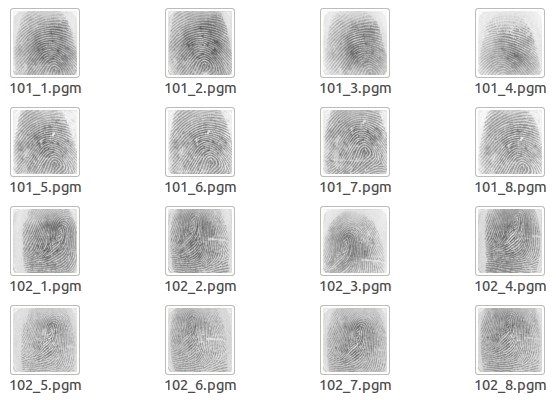

## 用PostgreSQL 处理 指纹 数据
                           
### 作者                           
digoal                           
                           
### 日期                           
2018-01-19                          
                           
### 标签                           
PostgreSQL , 指纹 , printfinger , pgafis , 特征值 , 索引 
                           
----                           
                           
## 背景 
pgafis是一个插件，支持存储指纹特征值，同时将指纹特征比对算法作为UDF编写到了数据库中，安装这个插件依赖指纹比对算法库。   
  
https://www.nist.gov/services-resources/software/nist-biometric-image-software-nbis  
  
https://github.com/lessandro/nbis  
    
pgafis插件代码地址  
  
https://github.com/hjort/pgafis  
  
pgafis
======

pgAFIS - Automated Fingerprint Identification System support for PostgreSQL



## Sample fingerprints data

```sql
    Table "public.fingerprints"
 Column |     Type     | Modifiers 
--------+--------------+-----------
 id     | character(5) | not null
 pgm    | bytea        | 
 wsq    | bytea        | 
 mdt    | bytea        | 
 xyt    | text         | 
Indexes:
    "fingerprints_pkey" PRIMARY KEY, btree (id)
```
- "pgm" stores original raw fingerprint images (PGM)
- "wsq" stores compressed fingerprint images (WSQ)
- "mdt" stores fingerprint templates in XYTQ own binary format (MDT)
- "xyt" stores fingerprint minutiae data in text format

```sql
afis=>
SELECT id,
  length(pgm) AS raw_bytes,
  length(wsq) AS wsq_bytes,
  length(mdt) AS mdt_bytes,
  length(xyt) AS xyt_chars
FROM fingerprints
LIMIT 5;

  id   | pgm_bytes | wsq_bytes | mdt_bytes | xyt_chars 
-------+-----------+-----------+-----------+-----------
 101_1 |     90015 |     27895 |       162 |       274
 101_2 |     90015 |     27602 |       186 |       312
 101_3 |     90015 |     27856 |       146 |       237
 101_4 |     90015 |     28784 |       154 |       262
 101_5 |     90015 |     27653 |       194 |       324
(5 rows)
```

## Acquisition

### Image Compression (WSQ)

```sql
afis=>
UPDATE fingerprints
SET wsq = cwsq(pgm, 2.25, 300, 300, 8, null)
WHERE wsq IS NULL;
```
- compressed image in WSQ format can be generated from original fingerprint raw image (PGM format)

### Feature Extraction (XYT)

```sql
afis=>
UPDATE fingerprints
SET mdt = mindt(wsq, true)
WHERE mdt IS NULL;
```
- minutiae data (features) can be extracted from compressed WSQ image and stored in own binary format (MDT)

## Verification (1:1)

```sql
afis=>
SELECT (bz_match(a.mdt, b.mdt) >= 20) AS match
FROM fingerprints a, fingerprints b
WHERE a.id = '101_1' AND b.id = '101_6';

 match 
-------
 t
(1 row)
```
- given two fingerprint templates, they can be considered the same according to a threshold value (e.g., 20) defined by the application


## Identification (1:N)

```sql
afis=>
SELECT a.id AS probe, b.id AS sample,
  bz_match(a.mdt, b.mdt) AS score
FROM fingerprints a, fingerprints b
WHERE a.id = '101_1' AND b.id != a.id
  AND bz_match(a.mdt, b.mdt) >= 23
LIMIT 3;

 probe | sample | score 
-------+--------+-------
 101_1 | 101_2  |    23
 101_1 | 101_4  |    24
 101_1 | 101_5  |    27
(3 rows)
```
- sequential scan is performed on the table, but so far as a given number of templates (e.g., 3) having a match score above the defined threshold (e.g., 23)

```sql
afis=>
SELECT a.id AS probe, b.id AS sample,
  bz_match(a.xyt, b.xyt) AS score
FROM fingerprints a, fingerprints b
WHERE a.id = '101_1' AND b.id != a.id
  AND bz_match(a.mdt, b.mdt) >= 20
ORDER BY score DESC;

 probe | sample | score 
-------+--------+-------
 101_1 | 101_6  |    28
 101_1 | 101_5  |    27
 101_1 | 101_8  |    26
 101_1 | 101_2  |    23
 101_1 | 101_4  |    23
(5 rows)
```
- "xyt" text field can be used for matching as well
  
<a rel="nofollow" href="http://info.flagcounter.com/h9V1"  ></a>  
  
  
  
  
  
  
## [digoal's 大量PostgreSQL文章入口](https://github.com/digoal/blog/blob/master/README.md "22709685feb7cab07d30f30387f0a9ae")
  
