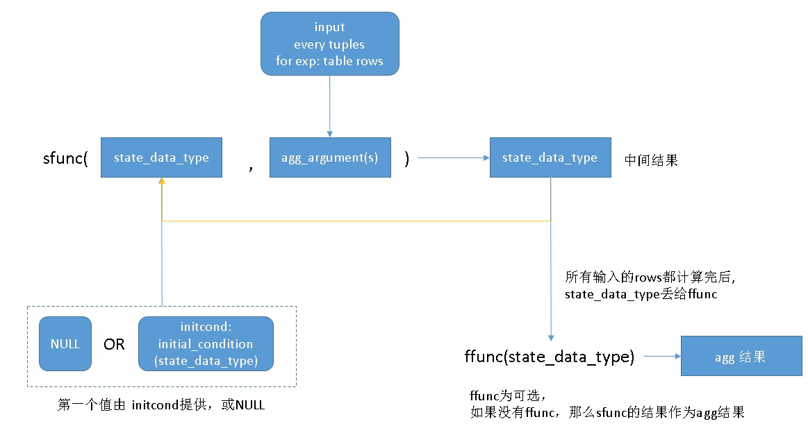
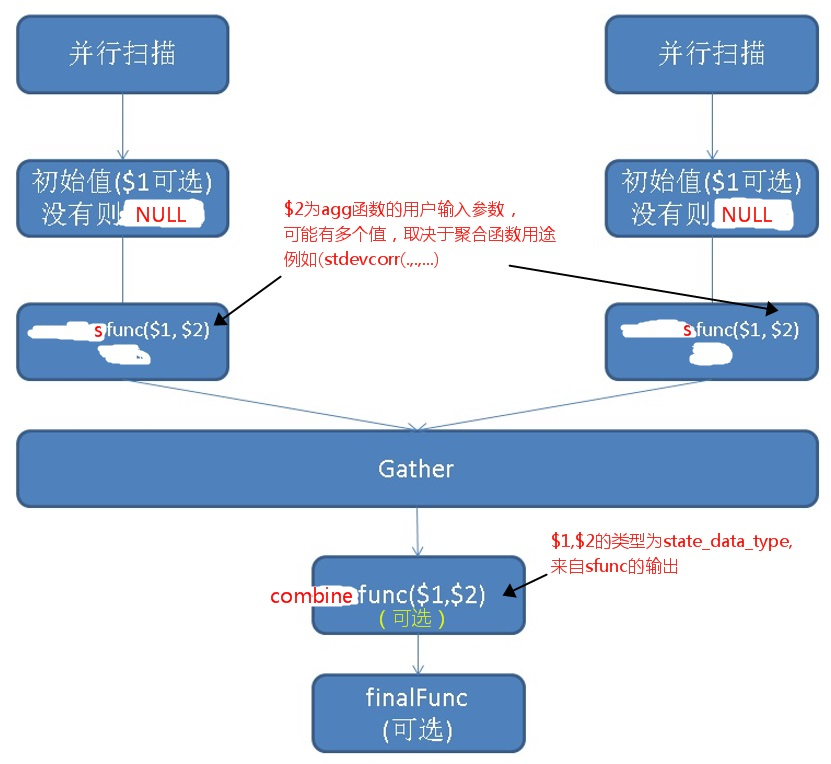

## PostgreSQL 10 自定义并行计算聚合函数的原理与实践 - (含array_agg合并多个数组为单个一元数组的例子) 
                          
### 作者                          
digoal                          
                          
### 日期                          
2018-01-19                         
                          
### 标签                          
PostgreSQL , 聚合函数 , 自定义 , AGGREGATE , 并行 , COMBINEFUNC    
                          
----                          
                          
## 背景    
PostgreSQL 9.6开始就支持并行计算了，意味着聚合、扫描、排序、JOIN等都开始支持并行计算。对于聚合操作来说，并行计算与非并行计算是有差异的。  
  
例如avg聚合，对一张表进行计算时，一个任务中操作和多个并行任务操作，算法是不一样的。  
  
PostgreSQL提供了一套标准的接口，可以支持聚合函数的并行操作。  
  
## 自定义并行聚合的原理和例子  
创建聚合函数的语法如下：  
  
```  
CREATE AGGREGATE name ( [ argmode ] [ argname ] arg_data_type [ , ... ] ) (  
    SFUNC = sfunc,  
    STYPE = state_data_type  
    [ , SSPACE = state_data_size ]  
    [ , FINALFUNC = ffunc ]  
    [ , FINALFUNC_EXTRA ]  
    [ , COMBINEFUNC = combinefunc ]  
    [ , SERIALFUNC = serialfunc ]  
    [ , DESERIALFUNC = deserialfunc ]  
    [ , INITCOND = initial_condition ]  
    [ , MSFUNC = msfunc ]  
    [ , MINVFUNC = minvfunc ]  
    [ , MSTYPE = mstate_data_type ]  
    [ , MSSPACE = mstate_data_size ]  
    [ , MFINALFUNC = mffunc ]  
    [ , MFINALFUNC_EXTRA ]  
    [ , MINITCOND = minitial_condition ]  
    [ , SORTOP = sort_operator ]  
    [ , PARALLEL = { SAFE | RESTRICTED | UNSAFE } ]  
)  
```  
  
相比非并行，多了一个过程，那就是combinefunc的过程(也叫partial agg)。  
  
非并行模式的聚合流程大致如下：  
  
```  
循环  
sfunc( internal-state, next-data-values ) ---> next-internal-state  
  
最后调用一次(可选)  
ffunc( internal-state ) ---> aggregate-value  
```  
  
  
  
并行模式的聚合流程大致如下，如果没有写combinefunc，那么实际上聚合过程并没有实现并行而只是扫描并行：  
  
  
  
下面这个例子，我们可以观察到一个COUNT操作的并行聚合。  
  
```  
postgres=# set max_parallel_workers=4;  
SET  
postgres=# set max_parallel_workers_per_gather =4;  
SET  
postgres=# set parallel_setup_cost =0;  
SET  
postgres=# set parallel_tuple_cost =0;  
SET  
postgres=# alter table test set (parallel_workers =4);  
ALTER TABLE  
postgres=# explain (analyze,verbose,timing,costs,buffers) select count(*) from test;  
                                                                  QUERY PLAN                                                                     
-----------------------------------------------------------------------------------------------------------------------------------------------  
 -- final并行，可有可无，看具体的聚合算法  
 Finalize Aggregate  (cost=15837.02..15837.03 rows=1 width=8) (actual time=57.296..57.296 rows=1 loops=1)  
   Output: count(*)  
   Buffers: shared hit=3060  
   ->  Gather  (cost=15837.00..15837.01 rows=4 width=8) (actual time=57.287..57.292 rows=5 loops=1)  
         Output: (PARTIAL count(*))  
         Workers Planned: 4  
         Workers Launched: 4  
         Buffers: shared hit=3060  
           
	 -- 一下就是combinefunc完成的聚合并行(显示为PARTIAL agg)  
	 ->  Partial Aggregate  (cost=15837.00..15837.01 rows=1 width=8) (actual time=52.333..52.333 rows=1 loops=5)  
               Output: PARTIAL count(*)  
               Buffers: shared hit=12712  
               Worker 0: actual time=50.917..50.918 rows=1 loops=1  
                 Buffers: shared hit=2397  
               Worker 1: actual time=51.293..51.294 rows=1 loops=1  
                 Buffers: shared hit=2423  
               Worker 2: actual time=51.062..51.063 rows=1 loops=1  
                 Buffers: shared hit=2400  
               Worker 3: actual time=51.436..51.436 rows=1 loops=1  
                 Buffers: shared hit=2432  
               ->  Parallel Seq Scan on public.test  (cost=0.00..15212.00 rows=250000 width=0) (actual time=0.010..30.499 rows=200000 loops=5)  
                     Buffers: shared hit=12712  
                     Worker 0: actual time=0.013..30.343 rows=190269 loops=1  
                       Buffers: shared hit=2397  
                     Worker 1: actual time=0.010..30.401 rows=192268 loops=1  
                       Buffers: shared hit=2423  
                     Worker 2: actual time=0.013..30.467 rows=190350 loops=1  
                       Buffers: shared hit=2400  
                     Worker 3: actual time=0.009..30.221 rows=192861 loops=1  
                       Buffers: shared hit=2432  
 Planning time: 0.074 ms  
 Execution time: 60.169 ms  
(31 rows)  
```  
  
了解了并行聚合的原理后，我们就可以写自定义聚合函数的并行计算了。  
  
### 例子  
  
例如我们要支持一个数组的聚合，并且在聚合过程中我们要实现对元素去重。  
  
  
1、创建测试表  
  
```  
create table test(id int, col int[]);  
```  
  
2、生成测试数据  
  
```  
CREATE OR REPLACE FUNCTION public.gen_arr(integer, integer)  
 RETURNS integer[]  
 LANGUAGE sql  
 STRICT  
AS $function$  
  select array(select ($1*random())::int from generate_series(1,$2));  
$function$;  
  
insert into test select random()*1000, gen_arr(500,10) from generate_series(1,10000);  
```  
  
3、创建聚合函数  
  
### 例子1，没有combinefunc，只支持扫描并行。  
  
数组去重函数  
  
```  
postgres=# create or replace function uniq(int[]) returns int[] as $$  
  select array( select unnest($1) group by 1);  
$$ language sql strict parallel safe;  
CREATE FUNCTION  
```  
  
数组合并与去重函数  
  
```  
postgres=# create or replace function array_uniq_cat(anyarray,anyarray) returns anyarray as $$  
  select uniq(array_cat($1,$2));   
$$ language sql strict parallel safe;  
CREATE FUNCTION  
```  
  
聚合函数(不带COMBINEFUNC)  
  
```  
create aggregate arragg (anyarray) (sfunc = array_uniq_cat, stype=anyarray, PARALLEL=safe);  
```  
  
并行查询例子：  
  
```  
postgres=# set max_parallel_workers=4;  
SET  
postgres=# set max_parallel_workers_per_gather =4;  
SET  
postgres=# set parallel_setup_cost =0;  
SET  
postgres=# set parallel_tuple_cost =0;  
SET  
postgres=# alter table test set (parallel_workers =4);  
ALTER TABLE  
postgres=# explain (analyze,verbose,timing,costs,buffers) select id, arragg(col) from test group by id ;  
```  
  
很明显没有设置COMBINEFUNC时，未使用并行聚合。  
  
```  
postgres=# explain (analyze,verbose,timing,costs,buffers) select id, arragg(col) from test group by id ;  
                                                            QUERY PLAN                                                               
-----------------------------------------------------------------------------------------------------------------------------------  
 HashAggregate  (cost=4139.74..4141.74 rows=200 width=36) (actual time=602.957..603.195 rows=1001 loops=1)  
   Output: id, arragg(col)  
   Group Key: test.id  
   Buffers: shared hit=6  
   ->  Gather  (cost=0.00..163.37 rows=15748 width=36) (actual time=0.328..43.734 rows=10000 loops=1)  
         Output: id, col  
         Workers Planned: 4  
         Workers Launched: 4  
         Buffers: shared hit=6  
         -- 只有并行扫描，没有并行聚合。  
	 ->  Parallel Seq Scan on public.test  (cost=0.00..163.37 rows=3937 width=36) (actual time=0.017..0.891 rows=2000 loops=5)  
               Output: id, col  
               Buffers: shared hit=124  
               Worker 0: actual time=0.019..0.177 rows=648 loops=1  
                 Buffers: shared hit=8  
               Worker 1: actual time=0.022..0.180 rows=648 loops=1  
                 Buffers: shared hit=8  
               Worker 2: actual time=0.017..3.772 rows=7570 loops=1  
                 Buffers: shared hit=94  
               Worker 3: actual time=0.015..0.189 rows=648 loops=1  
                 Buffers: shared hit=8  
 Planning time: 0.084 ms  
 Execution time: 603.450 ms  
(22 rows)  
```  
  
### 例子2，有combinefunc，支持并行聚合。  
  
```  
drop aggregate arragg(anyarray);  
  
create aggregate arragg (anyarray) (sfunc = array_uniq_cat, stype=anyarray, COMBINEFUNC = array_uniq_cat, PARALLEL=safe);   
```  
  
使用了并行聚合。  
  
```  
postgres=# explain (analyze,verbose,timing,costs,buffers) select id, arragg(col) from test group by id ;  
                                                               QUERY PLAN                                                                  
-----------------------------------------------------------------------------------------------------------------------------------------  
 Finalize HashAggregate  (cost=1361.46..1363.46 rows=200 width=36) (actual time=285.489..285.732 rows=1001 loops=1)  
   Output: id, arragg(col)  
   Group Key: test.id  
   Buffers: shared hit=36  
   ->  Gather  (cost=1157.46..1159.46 rows=800 width=36) (actual time=63.654..74.163 rows=4297 loops=1)  
         Output: id, (PARTIAL arragg(col))  
         Workers Planned: 4  
         Workers Launched: 4  
         Buffers: shared hit=36  
         -- 并行聚合  
	 ->  Partial HashAggregate  (cost=1157.46..1159.46 rows=200 width=36) (actual time=57.367..57.727 rows=859 loops=5)  
               Output: id, PARTIAL arragg(col)  
               Group Key: test.id  
               Buffers: shared hit=886  
               Worker 0: actual time=54.788..54.997 rows=857 loops=1  
                 Buffers: shared hit=213  
               Worker 1: actual time=56.881..57.255 rows=861 loops=1  
                 Buffers: shared hit=213  
               Worker 2: actual time=55.415..55.813 rows=856 loops=1  
                 Buffers: shared hit=212  
               Worker 3: actual time=56.453..56.854 rows=838 loops=1  
                 Buffers: shared hit=212  
               ->  Parallel Seq Scan on public.test  (cost=0.00..163.37 rows=3937 width=36) (actual time=0.011..0.736 rows=2000 loops=5)  
                     Output: id, col  
                     Buffers: shared hit=124  
                     Worker 0: actual time=0.009..0.730 rows=1981 loops=1  
                       Buffers: shared hit=25  
                     Worker 1: actual time=0.012..0.773 rows=2025 loops=1  
                       Buffers: shared hit=25  
                     Worker 2: actual time=0.015..0.741 rows=1944 loops=1  
                       Buffers: shared hit=24  
                     Worker 3: actual time=0.012..0.751 rows=1944 loops=1  
                       Buffers: shared hit=24  
 Planning time: 0.073 ms  
 Execution time: 285.949 ms  
(34 rows)  
```  
  
实际上并行聚合与分布式数据库聚合阶段原理是一样的，分布式数据库自定义聚合可以参考末尾的文章。  
   
### 例子3，将多个一元数组聚合为一个一元数组
PostgreSQL内置的array_agg会将数组聚合为多元数组，有些场景无法满足需求。   
    
```
                                    List of functions
   Schema   |          Name           | Result data type |  Argument data types  |  Type  
------------+-------------------------+------------------+-----------------------+--------
 pg_catalog | array_agg               | anyarray         | anyarray              | agg
 pg_catalog | array_agg               | anyarray         | anynonarray           | agg
```
   
```
postgres=# \set VERBOSITY verbose
postgres=# select array_agg(info) from (values(array[1,2,3]),(array[2,3,4,5])) t(info);
ERROR:  2202E: cannot accumulate arrays of different dimensionality
LOCATION:  accumArrayResultArr, arrayfuncs.c:5270
postgres=# select array_agg(info) from (values(array[1,2,3]),(array[3,4,5])) t(info);
     array_agg     
-------------------
 {{1,2,3},{3,4,5}}
(1 row)
```
  
如果要将数组合并为一元数组，可以自定义一个聚合函数如下：   
  
```
postgres=# create aggregate arragg (anyarray) (sfunc = array_cat, stype=anyarray, PARALLEL=safe);  
CREATE AGGREGATE

postgres=# select arragg(info) from (values(array[1,2,3]),(array[3,4,5])) t(info);
    arragg     
---------------
 {1,2,3,3,4,5}
(1 row)

postgres=# select arragg(info) from (values(array[1,2,3]),(array[2,3,4,5])) t(info);
     arragg      
-----------------
 {1,2,3,2,3,4,5}
(1 row)
```
  
## 参考  
  
https://www.postgresql.org/docs/10/static/sql-createaggregate.html  
  
https://www.postgresql.org/docs/10/static/xaggr.html#XAGGR-PARTIAL-AGGREGATES  
  
[《PostgreSQL aggregate function customize》](../201212/20121218_02.md)    
  
[《Greenplum 最佳实践 - 估值插件hll的使用(以及hll分式聚合函数优化)》](../201608/20160825_02.md)    
  
[《Postgres-XC customized aggregate introduction》](../201305/20130502_01.md)    
  
  
  
  
<a rel="nofollow" href="http://info.flagcounter.com/h9V1"  ></a>  
  
  
  
  
  
  
## [digoal's 大量PostgreSQL文章入口](https://github.com/digoal/blog/blob/master/README.md "22709685feb7cab07d30f30387f0a9ae")
  
