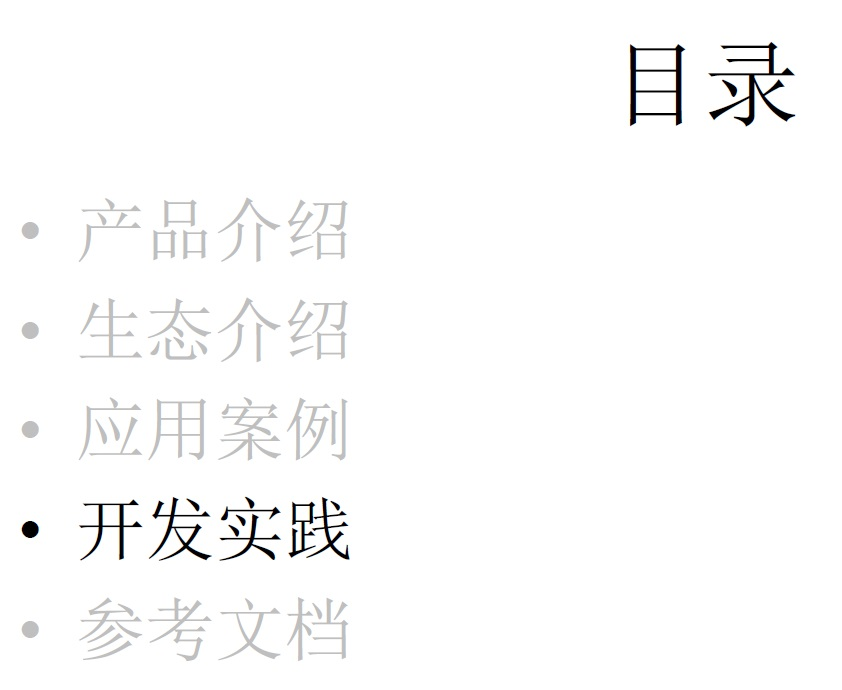

## 阿里云 PostgreSQL 产品生态；案例、开发实践、管理实践  
                            
### 作者                            
digoal                            
                            
### 日期                            
2018-01-21                           
                            
### 标签                            
PostgreSQL , 阿里云 , 产品介绍 , 生态 , 案例 , 开发实践 , 管理实践   
                            
----                            
                            
## 背景   
[<阿里云 PostgreSQL 产品生态；案例、开发实践、管理实践 PDF>](20180121_01_pdf_001.pdf)  
  
  
  
  
  
  
  
  
  
  
  
  
  
## 活动圆满  
感谢娃哈哈支持。  
  
http://postgres2018.eventdove.com/  
  
活动地点：杭州秋涛北路128-1号，娃哈哈集团公司医药保健品基地  
  
时间：2018-01-21 10:00:00 - 17:00:00  
  
费用：免费  
  
分享嘉宾：digoal  
  
  
  
分享内容分为5个部分：  
  
1、PostgreSQL, GPDB 阿里云生态介绍。  
  
2、PostgreSQL, GPDB 在OLTP\OLAP、空间数据管理、图式搜索、全文检索、文本搜索、特征搜索、时序应用、流式数据处理、用户画像等场景的Benchmark设计和性能指标。  
  
3、PostgreSQL与GPDB的应用案例。  
  
  
  
4、开发与管理实践。  
  
5、开放式交流，畅所欲言。  
  
https://github.com/digoal/blog/blob/master/README.md   
