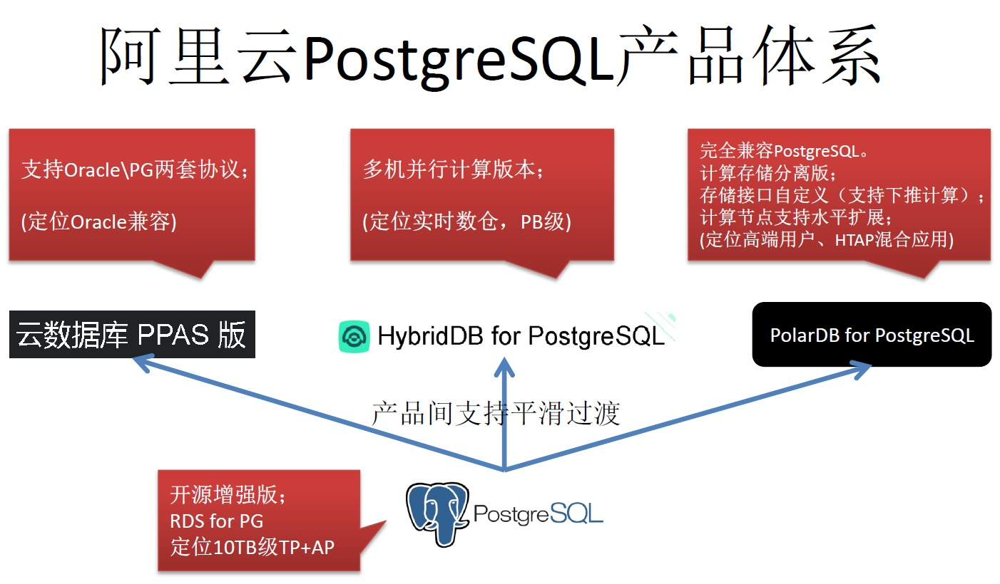
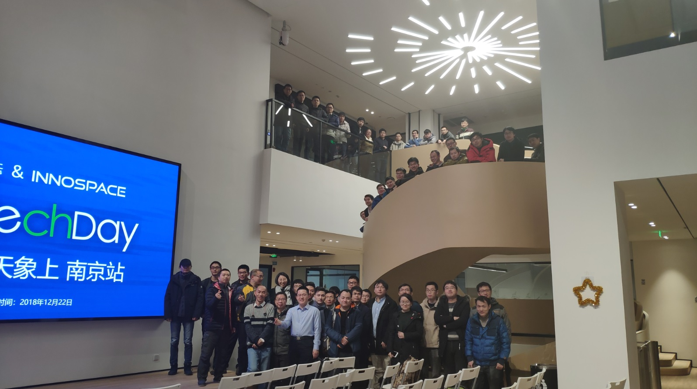

## 阿里巴巴 PostgreSQL、社区生态；PG开发者指南、原理、案例、管理优化实践《学习资料、视频》；《PG天天象上》沙龙纪录 - 珍藏级  
  
### 作者  
digoal  
  
### 日期  
2018-01-21  
  
### 标签  
PostgreSQL , 阿里云 , 产品介绍 , 生态 , 案例 , 开发实践 , 管理实践  
  
----  
  
## 背景  
PG是一个纯社区化的企业级开源数据库，没有任何一个国家和公司控制PG。开源许可非常友好，在遵循许可(COPY 2段话)的情况下可以任意使用和分发。功能、稳定性、性能和ORACLE对齐，是去O的首选数据库。  
  
其他大多数的开源数据库背后都有商业公司控制，开源许可通常不是特别友好，使用不当可能踩坑。  
  
[《PostgreSQL 社区分析 - 为什么PostgreSQL社区几乎不可能被任何一个商业公司、国家所控制？》](../201906/20190608_02.md)  
  
## 1、PG天天象上沙龙回顾，视频。  
  
天天象上活动，每个月一场，全国巡回。旨在建立各地企业生态圈子，建立各地企业与PG数据库社区的联系，切实的帮助企业解决技术、商业、生态层面的问题。  
  
贸易摩擦、中兴事件、以及近期某银行收到Oracle6亿罚单等等的热点事件，引发了企业对核心技术安全合规、自主可控的深度思考。对于数据库来说，安全合规、自主可控，成本等也已经成为绝大多数企业迫在眉睫要解决的问题。  
  
什么数据库最适合替代Oracle，同时在技术架构上领先于传统数据库，并且可以支持企业的蓬勃发展？除了需要考虑Oracle兼容性、企业特性（可靠、可用、安全、可扩展、性能、稳定、功能）还需要考虑产品的开源许可，多模特性，混合场景能力等等。  
  
PostgreSQL作为最先进的企业级开源数据库(BSD like开源许可，自用和分发都不需要担心法律风险，不需要担心PG被收购，不用担心PG被一家独大的公司控制。)，覆盖OLTP,OLAP,NoSQL,搜索,时空,流,图,图像等应用场景。应用场景丰富，并且在稳定性、性能、可用性、可靠性、容灾、安全性、扩展性等方面不亚于商用数据库Oracle，被业界称为“开源界的Oracle”。在企业数据库自主可控、安全合规、成本几个方面，PG毫无疑问的成为了企业的最佳选择。  
  
为帮助企业掌握去O能力。阿里云数据库团队、PG社区、云栖社区、云栖技术日、阿里云技术创新中心共同推出《PG天天象上》活动，涵盖《PostgreSQL 应用案例、原理、最佳实践》、《PPAS + ADAM Oracle 迁移上云》、《企业数据库安全、自主可控》、《各行业的TOP软件开发商分享》、《数据库服务提供商、集成商的分享》、《企业圆桌深入研讨》等系列主题。  
  
2018年9月开始，《PG天天象上》活动陆续在“杭州，北京，郑州、广州、深圳、上海、南京、合肥、长沙、成都、温州、武汉”等多地开展，活动在线上与线下覆盖人数已达数万人次，出席活动的参会者汇聚了银行，证券，互联网，人工智能，高校，医疗，新制造，电商，游戏，政府，电力，物流等行业的开发者，DBA，架构师，CTO，CIO。  
  
欢迎就近选择参加。  
  
## 2、(阿里巴巴 PostgreSQL、社区生态；PG开发者指南、原理、案例、管理优化实践《学习资料、视频》)。  
  
[《PostgreSQL 2~3 天培训PDF和视频》](../201901/20190105_01.md)  
  
  
  
  
  
  
  
  
  
  
  
# 一、PG天天象上  
  
## 1 PG天天象上活动内容简介
1、PostgreSQL 社区工作汇报。  
  
2、阿里云ADAM+PPAS(POLARDB for Oracle)的企业去O实践  
  
3、PostgreSQL 数据库架构、原理(物理架构、进程结构、逻辑架构、流复制架构、HA架构、多副本架构；权限体系、存储引擎原理、索引结构等)。  
  
4、PostgreSQL 理论基础，管理、开发实践，优化方法，PG学习参考资料  
  
5、PostgreSQL在OLTP|OLAP、空间数据管理、图式搜索、全文检索、文本搜索、特征搜索、时序应用、流式数据处理、用户画像分析等场景的应用案例。  
  
案例横跨 物联网、电商、生物科技、游戏、传统企业、CRM、ERP、ZF、GA、物流、音视频、BI、社交、金融、证券、手机、天文等行业。  
  
6、PostgreSQL 大型行业TOP企业用户分享  
  
7、PostgreSQL 行业软件开发商、服务提供商、中间件厂商用户分享  
  
8、企业深入圆桌研讨会议，企业数据库辩论赛  
  
涉及内容较多，案例涉及到详细的架构设计、代码、原理等内容，请参阅本视频提供的PDF内的URL链接。  
  
## 2 PG 天天象上 往期讲师介绍  
### digoal @ 阿里云  
中国开源软件推进联盟PostgreSQL分会，特聘资深领域专家。  
  
PostgreSQL 中国社区发起人之一、常委、兼任社区大学校长。  
  
[中国信息通信研究院主办、中国通信标准化协会支持的"OSCAR云计算开源产业大会"评选：2018届OSCAR开源尖峰人物之一](../201803/20180322_12.md)  
  
阿里云数据库首席专家团队[成员](../me/aliyun_shouxi_db_service.png)，提供[数据库首席专家服务](https://www.aliyun.com/service/chiefexpert/database)。  
  
30项数据库专利。（截至2018-01）  
  
致力于PostgreSQL数据库在中国的技术落地与推广、人才培养。  
  
[About digoal](../me/readme.md)  
  
### 唐修 @ 阿里云  
  
### 赵振平 @ PG社区 主席  
  
### 唐成 @ PG社区 副主席  
  
### 周飞 @ HELLOBIKE  
  
### 赵志强 @ 天数智芯  
  
### 陈河堆 @ 中兴  
  
### 陈华军 @ 苏宁  
  
### 董红禹 @ 乘数科技  
  
### 张勤建 @ 云贝  
  
### 梅白帆 @ 北京国网富达  
  
### 杨栋 @ 神州飞象  
  
## 3 PG天天象上活动往期回顾  
  
### 1 20180121期天天象上(杭州-娃哈哈赞助)  
报名人数：80  
  
重要议题：阿里云PG产品线生态介绍，PG案例，PG的原理、应用场景、优化、管理等内容等。  
  
  
  
### 2 20180901期天天象上(杭州-skymobi赞助)  
报名人数：80  
  
重要议题：阿里云PG产品线生态介绍，PG案例，PG的原理、应用场景、优化、管理等内容等。  
  
参会企业：阿里巴巴、海康威视、亚信、乘数科技、天宇、浙江大学、斯凯网络、大树金科、点我达、中国电信、民生银行、网易、火树医疗、同花顺、等。  
  
  
  
### 3 20180909期天天象上(北京-纳什空间赞助)  
报名人数：80  
  
重要议题：阿里云PG产品线生态介绍，PG案例，PG的原理、应用场景、优化、管理等内容等。  
  
参会企业：阿里巴巴、北京联通、邮储银行、华胜天成、优炫软件、炫果壳、四维图新、海康威视、金风科技、中国人寿、国交信通、EnjoyIT、京东、海量数据、智联招聘、神州飞象、万达、南天软件、超图、去哪儿、汽车之家、英泰伟业、华为、九天气象、东方龙马、CETC、云能服、Ylink、等。  
  
  
  
### 4 20181013期天天象上(郑州-大象圈社区赞助)  
报名人数：36  
  
重要议题：阿里云PG产品线生态介绍，PG案例，PG的原理、应用场景、优化、管理等内容等。  
  
参会企业：阿里巴巴、上海新炬、中原银行、郑州大学、华三、博茂、北京国源、中盟股份、富士康、中移在线、北京许继、华中科技大学、众合景轩、税友、亚信、北京辰安、河南优蓓教育、新天科技股份、郑州商旅、等。  
  
  
  
  
  
### 5 20181027期天天象上(广州-阿里巴巴创新中心赞助)  
报名人数：69  
  
重要议题1：阿里云PG产品线生态介绍，PG案例，PG的原理、应用场景、优化、管理等内容等。  
  
重要议题2：阿里ADAM+PPAS 去O方法论，Oracle迁移上云实践。  
  
重要议题3：企业深入圆桌研讨会议。  
  
参会企业：阿里巴巴、广州云图、网易、玄武、鼎信、广州彩讯科技股份、诺基亚、广东粤铁天福、广州人瑞、万科、广东三维家、北京中亦、等。  
  
  
  
### 6 20181028期天天象上(深圳-清华大学深圳研究生院赞助)  
报名人数：103  
  
重要议题1：阿里云PG产品线生态介绍，PG案例，PG的原理、应用场景、优化、管理等内容等。  
  
重要议题2：阿里ADAM+PPAS 去O方法论，实践。  
  
重要议题3：企业深入圆桌研讨会议。  
  
参会企业：阿里巴巴、人民银行、穆迪信息咨询、华润电力、Morningstar、白骑士、海量、库博商务、金智、亚信、万科、华海乐盈、平安科技、中兴、招商金融、富璟、深圳证券交易所、中国移动、华润银行、人寿保险、大疆、顺丰科技、华为、金蝶、TCL、IBM、恒大等。  
  
  
  
### 7 20181124期天天象上(上海-阿里巴巴创新中心赞助)  
报名人数：88  
  
重要议题1：阿里云PG产品线生态介绍，PG案例，PG的原理、应用场景、优化、管理等内容等。  
  
重要议题2：阿里ADAM+PPAS 去O方法论，Oracle迁移上云实践。  
  
重要议题3：HELLOBIKE，周飞，PG在HELLOBIKE的应用实践。  
  
重要议题4：上海云贝网络科技有限公司，张勤建，PG在电商平台运营决策系统中的应用实践。  
  
重要议题5：乘数科技，董红禹，医疗行业从MSSQL到PG的迁移实践。  
  
重要议题6：企业深入圆桌研讨会议。  
  
参会企业：阿里巴巴、迪卡侬、HELLOBIKE、上海云贝、乘数科技、同花顺、宝胜科技、爱用宝、人保、东方航空、聚水潭、爱树、华东师范、上交所、嘉银金融、银嘉金服、MBB、松鼠AI、易鲸捷、润和、新炬、航信、真旅、小红书、兴业银行、汇信、美味、FP等。  
  
线上线下2200余人次参加。  
  
直播回顾地址-上午：https://yq.aliyun.com/live/613  
  
直播回顾地址-下午：https://yunqivedio.alicdn.com/od/rZB8C1543470615706.mp4  
  
  
  
### 8 20181222期天天象上(南京-阿里巴巴创新中心赞助)  
报名人数：330  
  
重要议题1：PostgreSQL 社区生态建设、工作汇报  
  
重要议题2：阿里云PG产品线生态介绍，PG案例，PG的原理、应用场景、优化、管理等内容等。  
  
重要议题3：阿里ADAM+PPAS 去O方法论，Oracle迁移上云实践。  
  
重要议题4：天数智芯，赵志强，工业时序数据平台的设计与应用实践。  
  
重要议题5：PG中国社区主席，赵振平，双活数据中心实践分享和探讨。  
  
重要议题6：苏宁，陈华军，PG citus 分库分表架构在苏宁的大规模应用。  
  
重要议题7：中兴，陈河堆，PostgreSQL基于PaaS平台的高可用集群方案。  
  
重要议题8：北京国网富达科技，梅白帆，PostGIS在地理信息行业中的应用。  
  
重要议题9：企业深入圆桌研讨会议。  
  
参会企业：阿里巴巴、中兴、苏宁、亚信、华米科技、三只松鼠、中软、veritas、科大讯飞、新蛋、中石化、南京大学、中科大、南京邮电、南京信息学院、南京理工、南京师范、南京财经、南京工业大学、南京航空航天大学、汉得、神州数码、江苏电信、国家电网、南瑞、IBM、中国电科研究院、百度、云和恩墨、远景、天数智芯、中车、恒舜金融、润和、苏宁银行、等。  
  
线上线下700余人次参加。  
  
直播回顾地址1：https://yq.aliyun.com/live/776  
  
直播回顾地址2：https://yq.aliyun.com/live/777  
  
直播回顾地址3：https://yq.aliyun.com/live/778  
  
  
  
### 9 20190112期天天象上(合肥-阿里巴巴创新中心赞助)  
报名人数：147  
  
重要议题1：PostgreSQL 社区生态建设、工作汇报  
  
重要议题2：阿里云PG产品线生态介绍，PG案例，PG的原理、应用场景、优化、管理等内容等。  
  
重要议题3：阿里ADAM+PPAS 去O方法论，Oracle迁移上云实践。  
  
重要议题4：杭州乘数科技，唐成 《为什么PostgreSQL是最适合去O的数据库》  
  
重要议题5：广州云图，黄晓涛《数据库迁移案例分享》  
  
重要议题6：PG中国社区主席，赵振平 《数据泄露事件与PostgreSQL安全防护》  
  
重要议题7：企业深入圆桌研讨会议。  
  
参会企业：阿里巴巴、邮储银行、农业银行、科大讯飞、惠而浦、思科、国科量子通信、汉和智能物流、云易智能、鸿数科技、CXMT、中国科技大学、省交通运输厅、美林数据、海量、碧桂园、瀚高基础软件、阳光电源、上海大智慧、长鑫存储、上海博辕、神州数码、南瑞、财汇资讯、华米科技、华胜天成、新炬、广博量子、等。  
  
线上线下1000余人次参加。  
  
企业深入圆桌研讨会议小结：  
  
1、企业交流中关注到的几个方向：  
  
1\.1、数据库免维护（软件开发商关心这个问题，可以低成本大批量部署，维护成本低）、  
  
1\.2、业界标准的HA方案（企业通用问题，PG可选的HA方案太多，什么好？个人建议用patroni，成熟可靠），  
  
1\.3、RAC架构产品（大型企业，核心业务，同城rpo=0，同时减少rto、 PG核心场景部署建议：两地三中心，同IDC两节点，同城异机房1节点，异地1节点，quorum based replication，patroni作为HA软件，切换时间可以控制在30秒以内，全球RPO=0），  
  
1\.4、大数据量（30TB 级）场景是否可用PG，可以，PG本身就是HTAP企业级数据库（能同时满足oltp, olap），只要硬件满足即可能存，能跑得很好。（未来在xid，zheap两个方向改进后会更进一步）  
  
[《PostgreSQL 11 1万亿 tpcb 性能测试 on 阿里云ECS + ESSD + zfs/lvm2条带 + block_size=32K》](../201809/20180919_01.md)  
  
[《PostgreSQL 11 tpcc 测试(103万tpmC on ECS) - use sysbench-tpcc by Percona-Lab》](../201809/20180913_01.md)  
  
[《(TPC-H测试 SF=10,SF=200) PostgreSQL 11 vs 10 vs Deepgreen》](../201808/20180823_01.md)  
  
1\.5、已有很多中小企业拿PG用于分析业务，  
  
1\.6、企业越来越关注开源需求的差异，在选择传染性的开源许可软件时会更加慎重，但对于社区来说依旧需要多暴露这里问题。  
  
2、成立合肥PG分会，选拔来自邮储、长鑫存储（三星量级芯片生产商）的6位志愿者。由到京带领。  
  
直播回顾地址1：https://yq.aliyun.com/live/804  
  
直播回顾地址2：https://yunqivedio.alicdn.com/od/CEdEG1547357007712.mp4  
  
  
  
### 10 20190323期天天象上(长沙-阿里巴巴创新中心赞助)  
报名人数：1xx  
  
重要议题1：PostgreSQL 社区生态建设、工作汇报  
  
重要议题2：阿里云PG产品线生态介绍，PG案例，PG的原理、应用场景、优化、管理等内容等。  
  
重要议题3：阿里云ADAM+PPAS 去O方法论，Oracle迁移上云实践。  
  
重要议题4：神州飞象，杨栋 《PostgreSQL HA方案patroni》  
  
重要议题5：PG中国社区主席，太阳塔科技，赵振平 《Oracle与PostgreSQL对比学习》  
  
重要议题6：企业辩论赛。  
  
参会企业：阿里巴巴、三一重工、飞象科技、太阳塔、天闻数媒、隆平高科、创友数码、郑州大学、华中科技大学、高阳、上海屹恒、科创医疗、京柏医疗、果壳信息、。。。等。  
  
企业辩论赛回顾：  
  
现场将参会者分为两组，进行了激烈的辩论赛，两位来自郑州大学、华中科技大学的小伙伴担任队长，给对方提若干个PG相关的题目，对方作答。双方展开了激烈的辩论。  
  
1、PostgreSQL 的count如何加速？  
  
方法1：通过pg_stat_all_tables.n_live_tup可以直接得到当前表的记录数。适合高速全表count()  
  
```  
postgres=# show track_counts ;  
 track_counts  
--------------  
 on  
(1 row)  
  
select n_live_tup from pg_stat_all_tables where relname='a';  
```  
  
方法2：通过流计算，实时COUNT。例如pipelinedb插件，适合任意count，支持条件过滤、分组等预计算。  
  
[《PostgreSQL pipelinedb 流计算插件 - IoT应用 - 实时轨迹聚合》](../201811/20181101_02.md)  
  
方法3：通过并行计算，适合任意count，条件过滤、分组。并行后提速非常明显。  
  
[《PostgreSQL 并行计算解说 汇总》](../201903/20190319_01.md)  
  
讨论中也提到了MySQL，MySQL并没有并行计算，但是myisam引擎支持较快COUNT全表，不过要注意的是：myisam不支持并行计算，不支持流计算，不支持带FILTER、带GROUP、带DISTINCT的快速count。不支持hashagg, hashjoin等。已经基本上被MYSQL废弃，现在推荐使用innodb引擎。 (注意不能因为count快就选择对应的存储引擎，要全盘考虑，包括并发能力，事务能力等。)  
  
```  
摘自互联网：  
  
1. myisam保存表的总行数, 因此count(*)并且无where子句,很快会返回表的总行数  
2. myisam保存表的总行数, 利用count(column)并且无where子句,并且此column不为null,很快会返回表的总行数  
3. myisam保存表的总行数, 利用count(column)并且无where子句,并且此column可以为null,mysql会对表进行全表或全索引扫描来确定行数  
4. innodb查询count(*),count(column(not null)),count(column(may be null))并且无where子句,mysql会对表进行全表或全索引扫描来确定行数  
5. myisam和innodb查询count(*),count(column(not null)),count(column(may be null))并且存在where子句,mysql会对表进行索引扫描(如果列上有索引)  
```  
  
2、大数据，实时计算。适合用什么产品解决？  
  
citus, gpdb都可以.  
  
3、undo , 多版本的优劣势。  
  
undo 问题：回滚慢，并发较多版本略差，老版本多时访问老版本链条较长，UNDO文件膨胀。  
  
MVCC 问题：数据文件可能会膨胀(当表的更新非常多时)，索引膨胀（通过HOT技术解决）。  
  
[《为PostgreSQL讨说法 - 浅析《UBER ENGINEERING SWITCHED FROM POSTGRES TO MYSQL》》](../201607/20160728_01.md)  
  
[《PostgreSQL Heap Only Tuple - HOT (降低UPDATE引入的索引写IO放大)》](../201809/20180925_02.md)  
  
[《PostgreSQL 10.0 preview 性能增强 - 间接索引(secondary index)、二级索引》](../201703/20170312_21.md)  
  
[《PostgreSQL 收缩膨胀表或索引 - pg_squeeze or pg_repack》](../201610/20161030_02.md)  
  
[《PostgreSQL snapshot too old补丁, 防止数据库膨胀》](../201511/20151109_01.md)  
  
[《PostgreSQL 垃圾回收原理以及如何预防膨胀 - How to prevent object bloat in PostgreSQL》](../201504/20150429_02.md)  
  
4、PG集群、分片、容灾技术  
  
HA，(patroni)  
  
分片，citus  
  
容灾，流复制  
  
读写分离，pgpool-II  
  
多副本，quorum based replication  
  
5、现场演示了杀掉oracle进程，ORACLE会崩溃。杀掉PG 非守护进程，PG数据库会自动启动。如果杀死PG守护进程，如何让PG自动恢复？  
  
```  
首先杀掉PG 非守护进程，PG数据库会自动启动。实际上是守护进程的自动恢复功能。  
postgres=# show restart_after_crash ;  
-[ RECORD 1 ]-------+---  
restart_after_crash | on  
```  
  
可以使用守护进程的守护进程，例如 CRON。解决守护进程被杀后不会自动恢复的问题。  
  
6、OOM的问题。当发生OOM时，如何防止由于资源紧张使用时，数据库恢复后，由于资源紧张，进程被不断反复OOM。  
  
cgroup, docker隔离。  
  
HUGE PAGE，解决hash table问题.  
  
oom adj ，设置为不被OOM ： PG进程。  
  
如何防止不发生OOM（或尽量避免OOM）：  
  
连接池，减少连接数  
  
分区表，减少分区数，访问分区表时，可以减少syscache  
  
内核，使用更多的共享对象（例如syscache, relcache）  
  
7、主从断开时间太长后，从库可能因为主库的WAL被擦写后，从库要的WAL已不存在，再连接主库时已经没有需要的WAL。需要重搭从库。如何解决：  
  
设置wal_keep_segments参数，  
  
使用replication slot  
  
使用归档，都可以。  
  
  
  
  
  
### 11 20190419期天天象上(成都-阿里巴巴创新中心赞助)  
报名人数：41  
  
重要议题1：PostgreSQL 社区生态建设、工作汇报  
  
重要议题2：阿里云POLARDB Oracle兼容版介绍  
  
重要议题3：阿里云PG产品线生态介绍，PG案例，PG的原理、应用场景、优化、管理等内容等。  
  
重要议题4：阿里云ADAM+PPAS 去O方法论，Oracle迁移上云实践。  
  
重要议题5：企业辩论赛。  
  
参会企业：阿里巴巴、平安科技、中国人寿保险、成都达测（EDB中国总代）、新华传媒、测绘院、达州广播电视大学、成都派沃特科技股份有限公司、人大金仓、四川融科智联科技、、。。。等。  
  
企业辩论赛回顾：  
  
1、用户的某个业务系统，开放了公网以及0.0.0.0的链路权限，在运行一段时间后，发现数据库的几个进程CPU 100%，如何排查这种问题？  
  
找到造成CPU 100%的进程号，以及对应的父进程，发现父进程为数据库postmaster进程，所以断定是PG发起的进程。  
  
排查pg_stat_activity没有发现对应会话，开启连接审计，排查pg_log的日志，找到了诡异的连接记录，同时发现数据库被创建了几个非业务用户，同时通过大对象植入了C代码到PG实例中，创建了一些异常函数（死循环，一直耗费CPU）。  
  
显然数据库可能被黑。  
  
[《Hacking PostgreSQL》](../201610/20161018_02.md)  
  
升级PG版本解决，同时建议pg_hba.conf（数据库ACL配置）不要开放0.0.0.0即使需要开放0.0.0.0也不要开放所有用户，建议限定普通用户通过远程连接。  
  
2、用户使用MYSQL时，发现跑group by，即使数据量只有百万级别，也要跑很久很久。而换到PG后，即使数据表有千万甚至亿级别，也可以秒出结果。为什么？  
  
PG支持更好的聚合方法，HASHAGG, GROUPAGG，同时支持更好的并行计算能力，使得PG在处理大量数据的时候，比MYSQL占优很多，与ORACLE并肩。  
  
3、PG的SQL执行过程？  
  
解析用户协议包  
  
parser sql  
  
判断是否为DML，DSL的请求，如果是则  
  
rewrite query  
  
generate path  
  
generate plan  
  
jit (可选)  
  
execute plan  
  
如果是绑定变量的请求：  
  
bind parameter  
  
execute prepared statement  
  
4、如何查看SQL的执行计划。  
  
对于历史SQL，使用auto_explain插件，记录超过指定执行时间的SQL的执行计划，通过查看LOG日志可以看到历史SQL的执行计划。  
  
使用explain，可以查看当前SQL的执行计划。  
  
5、如何在plpgsql存储过程或函数中创建函数。  
  
使用execute 'SQL string'动态调用的方法，可以在函数中创建函数。例如  
  
```  
postgres=# create or replace function f_test() returns void as $$  
declare  
begin  
  execute format($_$create or replace function f_test1() returns void as $__$ declare begin raise notice 'test'; end; $__$ language plpgsql strict;$_$);  
end;  
$$ language plpgsql strict;  
CREATE FUNCTION  
postgres=# \df f_test1  
                       List of functions  
 Schema | Name | Result data type | Argument data types | Type  
--------+------+------------------+---------------------+------  
(0 rows)  
  
postgres=# select f_test();  
 f_test  
--------  
  
(1 row)  
  
postgres=# \df f_test1  
                        List of functions  
 Schema |  Name   | Result data type | Argument data types | Type  
--------+---------+------------------+---------------------+------  
 public | f_test1 | void             |                     | func  
(1 row)  
  
postgres=# \sf+ f_test1  
        CREATE OR REPLACE FUNCTION public.f_test1()  
         RETURNS void  
         LANGUAGE plpgsql  
         STRICT  
1       AS $function$ declare begin raise notice 'test'; end; $function$  
postgres=# select f_test1();  
NOTICE:  test  
 f_test1  
---------  
  
(1 row)  
```  
  
6、如何修改数据库ACL  
  
通过数据库pg_hba.conf配置文件，配置数据库访问链路ACL。  
  
7、postgresql.auto.conf与postgresql.conf的区别？  
  
postgresql.auto.conf是数据库alter system动态修改数据库参数的配置文件，alter system配置的参数会写入postgresql.auto.conf，优先级高于postgresql.conf  
  
扩展问题  
  
为什么postgresql.auto.conf优先级高于?  
  
因为先加载postgresql.conf后加载postgresql.auto.conf，后加载的覆盖了先加载的参数。  
  
如何配置了多个重名的参数，哪个为准？  
  
后加载的覆盖先加载的参数。  
  
参数配置的地方，以及优先级：  
  
[《PostgreSQL 参数优先级讲解》](../201901/20190130_03.md)  
  
8、PostgreSQL如何防止绑定变量的执行计划倾斜。  
  
数据库前5次执行计划都是custom plan，即每一次都要generate path，generate plan，并记录下custom plan的平均成本，以及customplan发生的次数。第五次后会生成generic plan，当有新的bind时，先使用generic plan计算新的bind 的cost，如果cost比custom plan的平均成本相差较大（代码内写死相差的比例），则会发起新的custom plan，并且统计到custom plan的平均COST和计数中。  
  
如果成本相差不大，则继续使用generic plan.  
  
通过以上方法防止倾斜。  
  
[《PostgreSQL 11 preview - 增加强制custom plan GUC开关(plancache_mode)，对付倾斜》](../201803/20180325_06.md)  
  
[《PostgreSQL plan cache 源码浅析 - 如何确保不会计划倾斜》](../201606/20160617_01.md)  
  
  
  
### 12 20190515期天天象上(温州-索易软件提供赞助)  
报名人数：50  
  
重要议题1：PostgreSQL 社区生态建设、工作汇报  
  
重要议题2：PostgreSQL 常用架构介绍  
  
重要议题3：阿里云PG产品线生态介绍  
  
重要议题4：阿里云POLARDB V2.0 for PostgreSQL、Oracle介绍  
  
重要议题5：阿里云ADAM+PPAS 去O方法论，Oracle迁移上云实践。  
  
重要议题6：PostgreSQL 原理  
  
重要议题7：PostgreSQL 优化技巧  
  
重要议题8：企业辩论赛。  
  
参会企业：索易软件、温州大学、温州联通、文章数勘察测绘研究院、温州科技学院、温州易天、温州达古科技有限公司、温州老年病医院、。。。等。  
  
  
  
### 13 20190525期天天象上(杭州-阿里巴巴创新中心，神鲸空间)  
报名人数：80  
  
重要议题1：《PostgreSQL 生态与社区工作汇报》  
  
重要议题2：《PPAS + ADAM Oracle 迁移上云》  
  
重要议题3：《PostgreSQL 数据库优化实践》  
  
重要议题4：《阿里云POLARDB for PostgreSQL|Oracle 产品演进》  
  
重要议题5：《阿里云自研数据库POLARDB内核技术解读》  
  
重要议题6：《POLARDB 的DBA法宝 - AAS性能洞察》  
  
重要议题7：《云数据库时空引擎Ganos》  
  
重要议题8：企业数据库辩论赛。  
  
参会企业：电信、海康、武汉商学院、浪沙、海量、支付宝、阿里、壹网、vastdata、微软、大搜车、正泰、点我达、软通动力、朗新、曹操专车、杭州地铁、亚信、悠可、佰安、同花顺、博彦、数蜂、。。。等。  
  
企业辩论赛回顾：  
  
1、Q PostgreSQL有哪些锁  
  
A  
  
https://www.postgresql.org/docs/12/explicit-locking.html  
  
2、Q PostgreSQL 有哪几种改参数的方法  
  
A  
  
```  
alter system|user|role|database ...  
  
postgresql.conf  
  
postmaster启动参数  
  
set local 事务级参数  
  
set 会话级参数  
  
client 连接时带的客户端参数  
```  
  
3、Q PostgreSQL 如何强制设置SQL并行度  
  
A  
  
[《PostgreSQL 11 并行计算算法，参数，强制并行度设置》](../201812/20181218_01.md)  
  
4、Q PG 还有哪些改进点  
  
A  
  
MVCC 机制，PG 12 已支持AM接口，可以支持更多存储引擎，例如ZHEAP（垃圾版本记录在UNDO文件中，但是事务信息还是在CLOG中，所以还是需要修改hintbit或freeze释放CLOG，否则CLOG会很大）。  
  
分区表很多时性能会下降，PG 12已经改进，1000个分区时，QPS依旧可以达到50万以上。  
  
目前存储引擎支持较少，PG 12 已支持AM接口，接口化之后，会支持更多存储引擎。  
  
5、Q REDO文件突然暴涨，可能有哪些原因  
  
A  
  
产生了大小写操作  
  
使用了SLOT，并且这个SLOT对应的接收端（比如从节点）挂了，SLOT位点不动，或者动的慢，导致REDO堆积  
  
VACUUM FREEZE大表  
  
max wal size设置很大，CHECKPOINT周期设置很长  
  
wal_keep_segments设置很大  
  
archive归档由外部程序完成，但是未及时修改archive_status的archive_name.ready为done，导致不清理  
  
6、Q 表膨胀，可能有哪些原因  
  
A  
  
频繁修改，并且关闭了自动垃圾回收  
  
频繁修改，并且hot_standby开启了feedback，并且hot_standby有慢事务，这些事务后产生的垃圾（老版本）无法被回收，因为可能这些更早的事务要访问这些老版本。  
  
频繁修改，并且有长事务，很久未结束的2PC事务，慢SQL等。  
  
频繁修改，并且关闭了自动垃圾回收参数。  
  
频繁修改，并且这个表关闭了自动垃圾回收，或者垃圾回收的阈值设置的较大。  
  
7、Q PG连接池有哪些改进点  
  
A  
  
pgbouncer 连接池，暂时只支持单CPU  
  
pgbouncer 连接池，连接复用的前提是USER\DBNAME相同，无法跨user,dbname复用。  
  
pgbouncer 连接池，如果有会话级变量，无法在不同的连接池连接之间切换，例如绑定变量。  
  
https://github.com/postgrespro/postgresql.builtin_pool  
  
[《PostgresPro buildin pool(内置连接池)版本 原理与测试》](../201805/20180521_03.md)  
  
8、Q MySQL与PG的事务隔离级别区别  
  
A  
  
RU，脏读，MySQL支持，PG不支持。实际使用中脏读几乎不使用，未提交事务对数据库的修改为什么要被访问？  
  
RC，读已提交  
  
RR(金融行业通常会使用)，可重复度，MySQL使用悲观锁实现，并发性差。PG使用快照实现（乐观），高并发性能损耗极小。  
  
SI(金融行业通常会使用)，串行事务隔离级别，MySQL使用悲观锁实现，并发性差。PG使用快照实现（乐观），高并发性能损耗极小。  
  
SSI(金融行业通常会使用)，严格串行事务隔离级别，MySQL不支持，PG支持。  
  
9、Q PG临时文件如何清理，为什么会有大量临时文件  
  
A  
  
PG临时文件是自动清理的。例如会话退出，自动清理，事务结束自动清理等。看临时文件的属性。如果有某些原因导致了临时文件未及时清理，数据库在启动是会自动进行清理。  
  
为什么会有大量临时文件，例如跑了很复杂的SQL，包含大量数据JOIN，GROUP BY，聚合，排序，可能用到外部临时文件。又或者临时表。  
  
又或者递归查询（数据有问题，导致死循环），会产生临时文件。  
  
对于排序，可以加大WORK_MEM，使用quick sort，不使用临时文件。  
  
10、POLARDB为什么限制100TB， 16个计算节点。  
  
产品设置，权衡了市场需求，以及当前架构下，提供一个安全可靠的集群规模。  
  
  

### 14 20190622期天天象上(武汉-阿里巴巴创新中心，Dream咖啡厅)  
报名人数：54  
  
重要议题1：《PostgreSQL 生态与社区工作汇报》  
  
重要议题2：《Oracle 迁移上云》  
  
重要议题3：《PostgreSQL 数据库优化实践》  
  
重要议题4：《阿里云POLARDB for PostgreSQL|Oracle 产品演进》  
  
重要议题5：《POLARDB 的DBA法宝 - AAS性能洞察》  
  
重要议题6：《云数据库时空引擎Ganos》  
  
重要议题7：企业数据库辩论赛。  
  
参会企业：斑马快跑(出行)、中移智行、武汉斗鱼、湖南图为、北京华宇信息、武汉商学院、浩星科技、唯晟商贸、爱可生、携宁计算机、海康威视、烽火通信、恒生、武汉数趣信息、武汉达梦、DXc、湖北楚天、武汉国为、太平金融、德安、传神语联网、linktime、湖北省图书馆、武汉易瑞特科技、易起飞科技、宁美国度、南京中软软件、企易共创、天玑科技、武汉通威、Farfetch、湖北电视台、今天梦想、湖北工业大学、天源迪科、。。。等。  
  
企业辩论赛回顾：  
  
PG plus 队与 PG pro 队进行了激烈的角逐。问题汇总如下：  
  
1、Q mysql 如何准实时同步到 PG  
  
A 使用阿里开源的Otter，解析BINLOG，使用PG语法封装SQL，在PG中回放。  
  
https://github.com/alibaba/otter  
  
https://github.com/alibaba/canal  
  
2、Q 用户智能电力业务，很多电力终端上报数据，数据库中按时间、电力设备等维度，范围搜索，一次查询出多条记录。效率不高  
  
用户使用cluster后，效率可以改善，有没有其他办法。  
  
A 本质的原因是用户查询的多条记录分布在HEAP表的不同PAGE里面，使得一次查询要扫描很多数据块。并发高，IO开销大，内存带宽高。  
  
include index，或使用 聚合存储  
  
[《PostgreSQL index include - 类聚簇表与应用(append only, IoT时空轨迹, 离散多行扫描与返回)》](../201905/20190503_03.md)    
  
[《PostgreSQL IoT，车联网 - 实时轨迹、行程实践 2 - (含index only scan类聚簇表效果)》](../201812/20181209_01.md)    
  
[《PostgreSQL IoT，车联网 - 实时轨迹、行程实践 1》](../201812/20181207_01.md)    
  
3、Q 企业中如何权衡开发者和DBA的权限和关系，遇到开发写得烂的SQL，领导叫DBA去又不愿意。如何权衡。  
  
A 明确DBA和开发者职责和KPI，有奖有罚  
  
定义操作规范、  
  
定义业务上线、下线标准  
  
定义商业化规范  
  
附能开发者，提高开发者能力  
  
DBA能力产品化  
  
建立SQL审核标准  
  
建立测试环境  
  
建立预发环境  
  
灰度上线  
  
建立线上真实数据测试环境（例如备库）  
  
4、Q PostgreSQL 相比其他开源数据库有什么优势  
  
A PG有GIN倒排索引，可以支持全文检索、模糊查询、相似搜索、JSON高速检索等  
  
PG的处理能力更强，支持并行计算，高并发。支持更丰富的JOIN、聚合算法。  
  
PG的扩展能力更强，支持专业的GIS、机器学习、全文检索、图像搜索等等。  
  
PG是纯社区的数据库，没有被商业公司控制。  
  
PG的开源许可更加的友好，使用无风险。有些公司的产品也开源，但是被商业公司控制，需要注意开源协议。使用需要注意法律风险。  
  
5、Q 被SQL注入了怎么办？  
  
A 尽快通知DBA，保留备份，防止扩大影响  
  
报警，通知领导  
  
下业务，防止扩大影响  
  
修BUG:   
  
应用开发使用绑定变量，不要用SIMPLE QUERY  
  
使用WAF，应用防火墙  
  
6、Q ORACLE 的ASM存储，在其他生态中有没有替代产品？  
ASM 支持块设备管理，任意损坏都不会影响可用性、可靠性。  
例如坏一块盘之后，数据会自动重分布，只是容量变少。  
1、块设备shard(extent)化  
2、每个shard(extent)在多个BLOCK设备之间冗余，例如3副本。  
3、坏盘后，自动重分布shard(extent)，依旧有3副本  
4、对于整个ASM存储集群来说，只是容量变小，但是冗余度不变。  
5、加盘后，自动重分布，容量又回来了。  
达到的效果：不管怎么坏盘，保持 rto=0, rpo=0   
  
A 分布式存储  
  
POLARDB  
  
polarstore  
  
阿里云盘古  
  
7、Q PG对文本挖掘有没有好的支持？  
  
A 分词、情感词、归类，PLPYTHON，MADLib   
  
8、Q 为什么有的书籍不建议使用PG自定义函数、存储过程，建议直接写SQL，不建议用存储过程？  
  
A 首先要分清楚应用场景，千万不要断章取义。  
  
存储过程支持自动的绑定变量，所以存储过程内的SQL执行5次后会自动缓存通用执行计划。  
  
如果是高并发查询，建议用绑定变量。减少硬解析的开销。  
  
如果是低并发（AP）应用，建议用SIMPLE QUERY。  
  
[《执行计划选择算法 与 绑定变量 - PostgreSQL prepared statement: SPI_prepare, prepare|execute COMMAND, PL/pgsql STYLE: custom & generic plan cache》](../201212/20121224_01.md)    
  
存储过程里面也支持动态SQL，使用动态SQL时强制用硬解析  
  
或者使用plan_cache_mode参数  
  
[《PostgreSQL 12 preview - plan_cache_mode GUC，用户可设置plan cache模式. (每次生成plan OR 使用重复plan OR 自动选择plan cache mode)》](../201903/20190331_15.md)    
  
9、Q 对于数据库使用过程中，如果出现BLOCK损坏怎么办？  
  
A   
  
1、跳过损耗数据块，可以继续查询  
  
2、通过备份修复。  
  
没有备份的话，在REDO中找到这个数据块最近一个FULL PAGE，从FULL PAGE拷贝，加上之后这个PAGE的所有REDO进行恢复。  
  
[《PostgreSQL 恢复大法 - 恢复部分数据库、跳过坏块、修复无法启动的数据库》](../201803/20180329_02.md)    
  
[《[转] PostgreSQL 轻量级周边工具 pg_lightool》](../201902/20190211_02.md)    
  
[《[转] PG wal/xlog/redo日志解析工具功能增强并更名为WalMiner / logminer / xlogminer》](../201902/20190211_01.md)    
  
10、Q 数据库使用过程中，经常发现“表没了”，在pgadmin查询表没了。但是在应用程序中能INSERT进去，应用是 ```insert into table values ()```  
  
A   
  
1、如果真的被删了，开启SQL审计，检查是谁干的.  
  
2、search_path 可能不对。在pgadmin中查看的SCHEMA下没有这个表，可能在其他SCHEMA里面。  
  
可以在pg_class或pg_tables里面找一下，是不是在其他SCHEMA里面  
  
11、Q 深圳中电的业务，很多智能电表上传数据，由于数据量太大，使用了按天分区，但是表分区太多了，查询慢。  
  
A PG 12原生分区表，性能已经基本无损。  
  
老版本使用pg_pathman，性能也基本无损。  
  
[《如何修改PostgreSQL分区表分区范围 - detach attach - 拆分、合并、非平衡分区表、深度不一致分区表》](../201906/20190621_02.md)    
  
[《PostgreSQL 12 preview - 分区表性能提升百倍》](../201905/20190521_01.md)    
  
[《分区表锁粒度差异 - pg_pathman VS native partition table》](../201802/20180206_01.md)    
  
[《PostgreSQL 商用版本EPAS(阿里云ppas(Oracle 兼容版)) - 分区表性能优化 (堪比pg_pathman)》](../201801/20180122_03.md)    
  
  
最后 PG plus 队胜出。    
  
  
  
### PG天天象上活动影响力(截至201906)  
线下、云栖线上直播、官方微信、官方微博、个人微信、微博转发、PG社区官方网站等渠道。  
  
企业圆桌深入研讨，相比传统IT峰会，对企业来说可以摄取更多信息量。  
  
长远影响预计：1万+人次  
  
  
# 二、PG体系化培训 NEW  
[《PostgreSQL 2~4 天体系化培训、视频》](../201901/20190105_01.md)  
  
每周在PG钉钉群直播，欢迎加群。  
  
  
  
# 三、PG体系化培训 OLD  
## 1 章节介绍
### 1、阿里云PostgreSQL产品线生态介绍，时长：90分钟  
  
PostgreSQL, GPDB 技术发展与云生态。  
  
### 2、阿里云PostgreSQL案例分享，时长：180分钟  
  
PostgreSQL与GPDB在OLTP|OLAP、空间数据管理、图式搜索、全文检索、文本搜索、特征搜索、时序应用、流式数据处理、用户画像分析等场景的应用案例。  
  
案例横跨 物联网、电商、生物科技、游戏、传统企业、CRM、ERP、ZF、GA、物流、音视频、BI、社交、金融、证券、手机、天文等行业。  
  
“新零售、共享单车、生物科技、网站、企业CRM、新零售、医疗、GA”等行业应用案例，业务痛点以及数据库“多值类型、UDF、全文检索、模糊搜索、相似搜索、多字段任意搜索、sharding、异步并行”等技术的应用。  
  
“电商、导购、新零售、搜索、数据分析、数据运营、金融、物流、物联网、LBS、导航、智能配送、稽侦、旅游、舆情、风控、医疗”等行业应用案例，业务痛点以及数据库“数组、文本特征、图片特征搜索，多值标签搜索、BITMAP搜索、时序数据搜索、时序数据实时统计、空间数据管理、电子围栏、KNN搜索、实时位置更新、路径规划、点云，文本情感词挖掘，Python UDF，图式搜索、递归查询”等技术的应用。  
  
“共享充电宝实时经营分析、电商秒杀、实时用户画像、实时业务监测与聚合、流式预警、多机房业务部署”等行业应用案例，业务痛点以及数据库“容灾、逻辑订阅、物理订阅、单元化、sharding，外部表，DBLINK，批量流计算、实时流计算、HLL估值计算，秒杀，ltree，RTREE”等技术的应用。  
  
### 3、阿里云HybridDB for PostgreSQL案例分享，时长：30分钟  
  
“音视频智能广告与数据挖掘、游戏数据运营、时空数据运营、物流、CDN、电商双十一”等行业应用案例，业务痛点以及数据库“流计算、机器学习、JSON与ETL、空间数据分区与METASCAN、数据聚集与海量导出、数据清洗、海量数据实时分析”等技术的应用。  
  
### 4、阿里云PostgreSQL开发与管理实践，时长：240分钟  
  
阿里云PostgreSQL，PPAS产品开发、管理实践，包含“SQL防火墙、资源隔离、AWR、VPD、物化视图、分页、数据清洗与转换、数据采样、加密、约束、去重、模糊查询、并行计算、批量DML、索引接口的选择与原理、ADhoc查询优化、函数稳定性原理、并发索引”等内容。  
  
阿里云PostgreSQL，PPAS产品开发、管理实践，包含“SQL HINT，TOP SQL，慢SQL诊断，执行计划，plpgsql函数诊断与DEBUG，判断有无，事务可靠性与性能设置，RDS PG资源管理，防雪崩，DDL操作建议，锁等待，限制慢SQL并发，杀会话和SQL，防DDoS和暴力破解”等内容。  
  
阿里云PostgreSQL，PPAS产品开发、管理实践，包含“数据同步，数据订阅，跨库访问，外部表，分区表，定时任务，执行计划，CBO成本因子，优化器，JOIN优化，遗传算法，递归查询，图式搜索，空间查询优化，空间索引，空间数据库使用建议”等内容。  
  
阿里云PostgreSQL，PPAS产品开发、管理实践，包含“数据老化实践、多级存储、冷热分离、数据库逻辑架构、数据库权限体系、服务端编程、行级、列级权限、数据膨胀的原理、监测、预防、处理，FREEZE原理、FREEZE风暴、预防FREEZE风暴，分区建议，可定义SLA的备份与恢复设计，跨版本升级，数据库监控指标与监控手段，多实例管理，海量测试数据的构造，压测数据库，从其他产品迁移到PostgreSQL”等内容。  
  
### 5、阿里云HybridDB for PostgreSQL开发与管理实践，时长：60分钟  
  
阿里云HybridDB for PostgreSQL产品开发、管理实践，包含“实时、批量ETL，数据写入性能优化，分布键、分区键的原理和选择，行存与列存的原理和选择，数据重分布原理与多阶段计算介绍”等内容。  
  
阿里云HybridDB for PostgreSQL产品开发、管理实践，包含“分级存储，索引接口的原理和选择，统计信息调度，队列管理，执行计划阅读，METASCAN，大吞吐数据导入导出，滑窗分析，数据倾斜的查看和预防，锁等待，数据膨胀和清理，行存列存格式转换，数据类型的选择建议，连接池”等内容。  
  
### 6、学习路径与资料分享，时长：30分钟  
  
参考文档、视频、软件等，包含“开发规约、产品选择文档、产品文档，图形化管理软件，开发驱动，社区文档，开发者指南，开发者手册，GIS文档，可视化分析软件，认证与培训资料，最佳实践，机器学习，日志维护与性能诊断，Oracle兼容性，培训视频集合”等内容。  
  
总时长：约12小时  
  
## 2 面向对象：  
开发者、DBA、架构师。  
  
## 3 收益  
通过学习本课程：  
  
架构师，可以了解到“物联网、电商、生物科技、游戏、传统企业、CRM、ERP、ZF、GA、物流、音视频、BI、社交、金融、证券、手机、天文”等行业在“OLTP|OLAP、空间数据管理、图式搜索、全文检索、文本搜索、特征搜索、时序应用、流式数据处理、用户画像分析”等场景对数据库的需求和业务痛点，了解如何使用阿里云PostgreSQL与HDB PG解决业务的需求和痛点。  
  
开发者和DBA，可以了解数据库的“多值类型、搜索、ADHOC查询、横向扩展、异步并行、特征搜索、画像搜索、时序数据实时处理、空间数据管理、电子围栏、KNN搜索、实时位置更新、路径规划、点云，文本情感词挖掘，Python UDF，图式搜索、递归查询，容灾、逻辑订阅、物理订阅、单元化，外部表，dblink，流计算、HLL估值计算，秒杀，ltree”等特性，以及“开发、管理”等最佳实践。  
  
## 4 在线视频  
https://edu.aliyun.com/course/836/lesson/list  
  
https://yq.aliyun.com/live/582  
   
## 5 视频下载地址  
敬请期待  
  
# 四、PG 天天象上 沙龙模板  
## 活动介绍  
贸易摩擦、中兴事件、以及近期某银行收到Oracle 6亿罚单等等的热点事件，引发了企业对核心技术安全合规、自主可控的深度思考。安全合规、自主可控，成本等也已经成为企业迫在眉睫要解决的问题。  
  
Oracle中国研发中心解散，什么数据库最适合替代Oracle，并且在技术架构上领先于传统数据库，支持企业的长期发展？  
  
PostgreSQL作为最先进的企业级开源数据库(类似BSD的开源许可，可以自用、分发无法律风险，不用担心PG被收购，不用担心PG被一家独大的公司控制。)，在稳定性、性能、可用性、可靠性、容灾、安全性、扩展性等方面比肩Oracle，被业界称为“开源界的Oracle”。我们熟知的平安集团、邮储银行、中国人寿、苏宁、中兴、华为、阿里巴巴、亚信、富士康、探探、去哪儿 ... ... 等众多大型企业、互联网公司已纷纷将PG应用于企业业务系统。  
  
为帮助企业掌握去O能力。阿里云数据库团队、PG社区、云栖社区、云栖TechDay、阿里云技术创新中心共同推出《PG天天象上》活动，涵盖《PostgreSQL 案例、原理、最佳实践》、《Oracle 迁移上云》、《客户案例》、《企业数据库辩论赛》等系列主题。  
  
2018年9月开始，《PG天天象上》活动在杭州，北京，郑州、广州、深圳、上海、南京、合肥、长沙、成都、温州多地开展，覆盖数万人次，参会者汇聚了银行，证券，互联网，人工智能，高校，医疗，新制造，电商，游戏，政府，电力等行业的开发者，DBA，架构师，CTO，CIO。  
  
欢迎参加。  
  
## 背景  
  
  
  
### 活动特色  
1、嘉宾分享：PG的社区生态工作汇报，PG原理与实践，ADAM去O方法论与成功案例，云原生数据库POLARDB的架构和最佳实践，客户案例等主题分享  
  
2、激烈辩论：帮助企业深度梳理企业IT架构，就企业数据库安全合规、自主可控、成本、架构演进等问题进行深度研讨。  
  
## 适合人群  
学生、开发者、数据库管理员、架构师，CTO，CIO，技术总监。  
  
## 免费参会  
  
## 活动地点  
地点：武汉市东湖高新区关山大道465号光谷创意B座一楼dream+咖啡厅  
  
## 主要议程  
**上午**  
1、08:45 ~ 09:10 签到： (扫二维码加钉钉群)  
2、09:10 ~ 09:25 开场 - 生态合作伙伴介绍  
3、09:25 ~ 09:55 阿里云 - digoal 《PostgreSQL 生态与社区工作汇报》 30 min  
4、09:55 ~ 10:40 阿里云 - 唐修 《Oracle 迁移上云》  45 min  
5、10:40 ~ 12:10 阿里云 - digoal 《数据库优化与实践》 90 min  
6、12:10 ~ 12:15 合影  
  
**下午**  
1、13:30 ~ 14:00 阿里云 - digoal 《阿里云 POLARDB for Oracle|PG 演进》 30 min  
2、待定议题库  
- PG数据库服务提供商 《数据库应用、管理、架构、优化、迁移类实践》  
- 垂直行业软件开发商 《行业应用实践》  
- 用户 《PG用户案例分享》  
- 阿里云 《POLARDB 内核技术解读》  
- 阿里云 《POLARDB DBA法宝 - 性能洞察》  
- 阿里云 《专业时空引擎 Ganos》  
  
3、16:15 ~ 17:15 企业深度数据库 研讨、辩论大赛  
颁奖(PG相关数据、文化衫小礼品)  
  
## 分享获奖方法  
1、现场微信分享活动照片(需包含PostgreSQL钉钉群二维码)，点赞数超过24个，将截图发送到“PostgreSQL 技术进阶钉钉群”(二维码如下)，现场抽取中奖名单，赠送(PG社区的文化衫、书籍等纪念品)。  
  
2、微信分享本报名链接，点赞数超过24个，将截图发送到“PostgreSQL 技术进阶钉钉群”(二维码如下)并at 德哥记录，活动开始前一天抽取中奖名单，赠送(PG社区的文化衫或书籍等纪念品)，快来分享报名链接吧。  
  
### PostgreSQL 技术进阶钉钉群二维码  
  
  
## 历届演讲嘉宾  
### 阿里云，digoal。  
中国开源软件推进联盟PostgreSQL分会，特聘资深领域专家。  
PostgreSQL 中国社区大学校长，负责PostgreSQL人才培养与技术推广。  
[嘉宾技术BLOG](https://github.com/digoal/blog/blob/master/README.md)  
  
分享议题，《PostgreSQL 生态与社区工作汇报》  
分享议题，《数据库优化与实践》  
分享议题，《阿里云POLARDB for Oracle|PG 演进》  
  
### 阿里云，唐修。  
阿里云ADAM产品经理。  
  
分享议题，《Oracle 迁移上云》  
  
企业去O源动力到底在哪里？为何屡试屡败？  
  
阿里去O成功经验到底能不能复制？  
  
去O的三大痛点，如何各个击破？  
  
### 阿里云，康贤  
阿里云数据库专家  
  
分享议题，《POLARDB内核技术解读》  
  
带你了解POLARDB的研发历程，如何在POLARDB的计算存储分离架构中，支持PostgreSQL和Oracle兼容引擎。  
  
### 阿里云，林翳  
阿里云数据库专家  
  
分享议题，《POLARDB DBA法宝 - 性能洞察》  
  
通过性能洞察功能，可以分析任何时间点发生的性能异常的根源。不再为过去的问题排查而烦恼。  
  
### 阿里云，图贲  
阿里云数据库专家  
  
分享议题，《专业时空引擎 Ganos》  
  
Ganos的总体介绍，与PostGIS的区别，在专业时空场景中，如何将移动对象数据库（MOD）做到比开源50倍的性能提升。  
  
## 注意事项  
请保持安静、卫生，文明参会，谢谢。  
  
## 合作伙伴  
##### 1 PostgreSQL中国用户会  
##### 2 中国开源软件推进联盟PostgreSQL分会  
##### 3 云栖社区  
##### 4 云栖TechDay  
### 寻合作伙伴（媒体、软件开发商、ToB类企业）  
有意请联系digoal  
  
## 鸣谢  
[francs (赠书《PostgreSQL 实战》)](https://item.jd.com/12405774.html)  
  
digoal (赠书《PostgreSQL 指南(内幕探索)》)  
  
## 招聘传输门  
[Oracle DBA 转型PG 定制学习宝典](https://github.com/digoal/blog/blob/master/201804/20180425_01.md)  
  
## [往期回顾](https://github.com/digoal/blog/blob/master/201801/20180121_01.md)  
   
# 五、课件下载链接  
[《PostgreSQL 案例、开发、管理实践、架构、原理、诊断、调优 PDF》](20180121_01_pdf_001.pdf)  
  
[《PG 生态与社区工作汇报》](20180121_01_pdf_002.pdf)  
  
# 六、阿里云数据库DBA、内核研发、服务端研发岗位传输门  
  
[《Oracle DBA 增值 PostgreSQL,Greenplum 学习计划 - 珍藏级》](../201804/20180425_01.md)  
  
# 寻《PG天天象上》合作伙伴（媒体、软件开发商、PG培训公司、PG服务提供商、ToB类企业。欢迎联系，议题分享）  
有意请联系digoal  
  
  
  
<a rel="nofollow" href="http://info.flagcounter.com/h9V1"  ></a>  
  
## [digoal's 大量PostgreSQL文章入口](https://github.com/digoal/blog/blob/master/README.md "22709685feb7cab07d30f30387f0a9ae")  
  
  
## [免费领取阿里云RDS PostgreSQL实例、ECS虚拟机](https://free.aliyun.com/ "57258f76c37864c6e6d23383d05714ea")  
  
