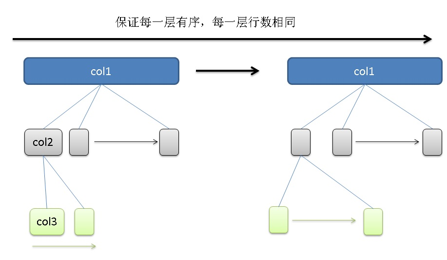

## PostgreSQL 范围过滤 + 其他字段排序OFFSET LIMIT(多字段区间过滤)的优化与加速    
                                 
### 作者                                 
digoal                                 
                                 
### 日期                                 
2018-01-22                                
                                 
### 标签                                 
PostgreSQL , 范围过滤 , 其他字段排序 , 索引 , offset , limit    
       
----     
       
## 背景        
在索引扫描中，如果两个字段扫描都是区间扫描，那么只能用到某个字段的过滤条件，另一个字段需要全扫描。  
  
例如  
  
```  
create table t(id int, c1 int, c2 int);  
  
insert into t select generate_series(1,6000000), random()*10000, random()*10000;  
  
create index idx_t_1 on t(c1, c2);  
  
explain (analyze,verbose,timing,costs,buffers) select * from t where c1 between 1 and 10000 order by c2 limit 1;  
  
                                                                   QUERY PLAN                                                                     
------------------------------------------------------------------------------------------------------------------------------------------------  
 Limit  (cost=25496.76..25496.76 rows=1 width=12) (actual time=5330.577..5330.578 rows=1 loops=1)  
   Output: id, c1, c2  
   Buffers: shared hit=6021360  
   ->  Sort  (cost=25496.76..25571.75 rows=29997 width=12) (actual time=5330.576..5330.576 rows=1 loops=1)  
         Output: id, c1, c2  
         Sort Key: t.c2  
         Sort Method: top-N heapsort  Memory: 25kB  
         Buffers: shared hit=6021360  
         ->  Index Scan using idx_t_1 on public.t  (cost=0.43..25346.77 rows=29997 width=12) (actual time=0.032..4526.864 rows=5999724 loops=1)  
               Output: id, c1, c2  
               Index Cond: ((t.c1 >= 1) AND (t.c1 <= 10000))  
               Buffers: shared hit=6021360  
 Planning time: 0.100 ms  
 Execution time: 5330.734 ms  
(14 rows)  
  
explain (analyze,verbose,timing,costs,buffers) select * from t where c1 between 1 and 10000 and c2 between 100000 and 1111110 limit 1;  
                                                           QUERY PLAN                                                              
---------------------------------------------------------------------------------------------------------------------------------  
 Limit  (cost=0.43..5.52 rows=1 width=12) (actual time=248.439..248.439 rows=0 loops=1)  
   Output: id, c1, c2  
   Buffers: shared hit=21828  
   ->  Index Scan using idx_t_1 on public.t  (cost=0.43..763.89 rows=150 width=12) (actual time=248.437..248.437 rows=0 loops=1)  
         Output: id, c1, c2  
         Index Cond: ((t.c1 >= 1) AND (t.c1 <= 10000) AND (t.c2 >= 100000) AND (t.c2 <= 1111110))  
         Buffers: shared hit=21828  
 Planning time: 0.120 ms  
 Execution time: 248.578 ms  
(9 rows)  
```  
  
原因是在复合索引中，每一个复合KEY是有序的，但是多级下来，每一层并不是有序的。例如:  
  
  
  
那么前面的例子SQL2 实际上是层1用到了索引过滤，而层二则需要过滤。  
  
例子SQL2 实际上是层1用到了索引过滤，并取出所有满足条件的行（因为用到了索引外的字段，所以不能用INDEX ONLY SCAN），再按层2排序。  
  
索引结构可以参考：  
  
[《深入浅出PostgreSQL B-Tree索引结构》](../201605/20160528_01.md)    
  
那么如何优化这类SQL呢？  
  
## 优化与场景  
某个业务，数据包含了：  
  
1、订单支付时间  
  
2、订单号  
  
3、唯一键 = 订单支付时间+订单号  （因为一个时间点，可能有多个订单）  
  
业务需要取出大于某个支付时间，并按唯一键排序，偏移N条后，取一条。  
  
DEMO表如下：  
  
```  
create table test(id int, c1 text, c2 timestamp);  
```  
  
写入6000万订单  
  
```  
insert into test select id, c1::text||id, c1 from (select generate_series(1,10000000) id, clock_timestamp()::timestamp(1) c1) t;  
```  
  
创建后期优化需要用到的索引  
  
```  
create index idx1 on test (c1);  
create index idx2 on test (c2);  
create index idx3 on test (c3);  
```  
  
查询语句如下:  
  
```  
select * from test where c2 >= '2018-01-22 16:13:25.4'::timestamp order by c1 limit 1 offset 50000;  
  
LOG:  duration: 943.851 ms  plan:  
Query Text: select * from test where c2 >= '2018-01-22 16:13:25.4'::timestamp order by c1 limit 1 offset 50000;  
Limit  (cost=4714.82..4714.92 rows=1 width=40) (actual time=943.822..943.823 rows=1 loops=1)  
  Output: id, c1, c2  
  Buffers: shared hit=141577  
  ->  Index Scan using idx1 on public.test  (cost=0.56..339427.36 rows=3600000 width=40) (actual time=928.122..939.856 rows=50001 loops=1)  
        Output: id, c1, c2  
        Filter: (test.c2 >= '2018-01-22 16:13:25.4'::timestamp without time zone)  
        Rows Removed by Filter: 6281766  
        Buffers: shared hit=141577  
   id    |              c1              |          c2             
---------+------------------------------+-----------------------  
 6414521 | 2018-01-22 16:13:25.46414521 | 2018-01-22 16:13:25.4  
(1 row)  
  
Time: 944.485 ms  
```  
  
性能并不理想。耗费了1秒左右的时间。原因是满足条件1的数据量太大，需要完全取出后排序再OFFSET。   
  
### 优化方法  
由于C1由C2+订单号组成，所以C1的最小值一定出现在C2中的最小值的区间中。那么可以这么优化  
  
  
```  
create or replace function get_test1(timestamp, int) returns test as $$  
declare  
  v1 timestamp;  
  v2 text;  
  res text;  
begin  
  set enable_seqscan=off;  
  
  -- 从输入的C2的条件，得到最小的C2  
  -- 索引精确定位  
  select c2 into v1 from test where c2 >= $1 order by c2 limit 1;  
    
  -- 在最小的C2中，求最小的C1  
  -- 索引精确定位  
  select min(c1) into v2 from test where c2 = v1;  
  
  -- 大于最小的C1，排序返回  
  -- 索引offset定位  
  select t into res from test t where c1 >= v2 order by c1 limit 1 offset $2 ;  
  return res::test;  
end;  
$$ language plpgsql strict;  
```  
  
使用以上优化，每一步的开销都是最小的。效果如下：  
  
```  
postgres=# \timing  
postgres=# load 'auto_explain';  
LOAD  
postgres=# set auto_explain.log_nested_statements =on;  
SET  
Time: 0.165 ms  
postgres=# set auto_explain.log_analyze =on;  
SET  
Time: 0.168 ms  
postgres=# set auto_explain.log_buffers =on;  
SET  
Time: 0.144 ms  
postgres=# set auto_explain.log_min_duration =0;  
SET  
Time: 0.161 ms  
postgres=# set auto_explain.log_timing =on;  
SET  
Time: 0.147 ms  
postgres=# set auto_explain.log_verbose =on;  
SET  
Time: 0.173 ms  
  
  
postgres=# select * from get_test1('2018-01-22 16:13:25.4'::timestamp, 50000);  
LOG:  duration: 0.045 ms  plan:  
Query Text: select c2         from test where c2 >= $1 order by c2 limit 1  
Limit  (cost=0.43..0.46 rows=1 width=8) (actual time=0.043..0.043 rows=1 loops=1)  
  Output: c2  
  Buffers: shared hit=4  
  ->  Index Only Scan using idx2 on public.test  (cost=0.43..99814.16 rows=3333333 width=8) (actual time=0.041..0.041 rows=1 loops=1)  
        Output: c2  
        Index Cond: (test.c2 >= $1)  
        Heap Fetches: 1  
        Buffers: shared hit=4  
LOG:  duration: 0.024 ms  plan:  
Query Text: select min(c1)         from test where c2 = v1  
Result  (cost=0.96..0.97 rows=1 width=32) (actual time=0.023..0.023 rows=1 loops=1)  
  Output: $0  
  Buffers: shared hit=5  
  InitPlan 1 (returns $0)  
    ->  Limit  (cost=0.56..0.96 rows=1 width=28) (actual time=0.020..0.020 rows=1 loops=1)  
          Output: test.c1  
          Buffers: shared hit=5  
          ->  Index Only Scan using idx3 on public.test  (cost=0.56..31750.61 rows=79365 width=28) (actual time=0.020..0.020 rows=1 loops=1)  
                Output: test.c1  
                Index Cond: ((test.c2 = $4) AND (test.c1 IS NOT NULL))  
                Heap Fetches: 1  
                Buffers: shared hit=5  
LOG:  duration: 57.454 ms  plan:  
Query Text: select t          from test t where c1 >= v2 order by c1 limit 1 offset $2  
Limit  (cost=1699.64..1699.67 rows=1 width=92) (actual time=57.451..57.451 rows=1 loops=1)  
  Output: t.*, c1  
  Buffers: shared hit=774  
  ->  Index Scan using idx1 on public.test t  (cost=0.56..125732.85 rows=3700012 width=92) (actual time=0.048..53.365 rows=50001 loops=1)  
        Output: t.*, c1  
        Index Cond: (t.c1 >= '2018-01-22 16:13:25.46364521'::text)  
        Buffers: shared hit=774  
LOG:  duration: 58.163 ms  plan:  
Query Text: select * from get_test1('2018-01-22 16:13:25.4'::timestamp, 50000);  
Function Scan on public.get_test1  (cost=0.25..0.26 rows=1 width=44) (actual time=58.155..58.156 rows=1 loops=1)  
  Output: id, c1, c2  
  Function Call: get_test1('2018-01-22 16:13:25.4'::timestamp without time zone, 50000)  
  Buffers: shared hit=783  
   id    |              c1              |          c2             
---------+------------------------------+-----------------------  
 6414521 | 2018-01-22 16:13:25.46414521 | 2018-01-22 16:13:25.4  
(1 row)  
  
Time: 58.503 ms  
```  
  
性能提升非常明显。  
  
### 业务逻辑优化  
实际上业务方要的是c2的值（支付时间），因此完全没必要按UK（c2+订单号）来排序，也就是说，SQL可以改写成这样。  
  
```  
postgres=# select * from test where c2 >= '2018-01-22 16:13:25.4'::timestamp order by c2 limit 1 offset 50000;  
LOG:  duration: 14.945 ms  plan:  
Query Text: select * from test where c2 >= '2018-01-22 16:13:25.4'::timestamp order by c2 limit 1 offset 50000;  
Limit  (cost=1497.64..1497.67 rows=1 width=40) (actual time=14.932..14.933 rows=1 loops=1)  
  Output: id, c1, c2  
  Buffers: shared hit=608  
  ->  Index Scan using idx2 on public.test  (cost=0.43..107799.04 rows=3600000 width=40) (actual time=0.030..10.541 rows=50001 loops=1)  
        Output: id, c1, c2  
        Index Cond: (test.c2 >= '2018-01-22 16:13:25.4'::timestamp without time zone)  
        Buffers: shared hit=608  
   id    |              c1              |          c2             
---------+------------------------------+-----------------------  
 6414521 | 2018-01-22 16:13:25.46414521 | 2018-01-22 16:13:25.4  
(1 row)  
  
Time: 15.442 ms  
```  
  
从业务层出发，改一条SQL，达到了最佳的效果。(而且最后只需要一个索引即可。)  
    
    
从另一个层面来看这个优化，多个字段都是范围的查询，复合索引并不是最好的选择，更好的选择可能是：分区表+单索引，或者分区索引。需要内核的功能加强。     
  
<a rel="nofollow" href="http://info.flagcounter.com/h9V1"  ></a>  
  
  
  
  
  
  
## [digoal's 大量PostgreSQL文章入口](https://github.com/digoal/blog/blob/master/README.md "22709685feb7cab07d30f30387f0a9ae")
  
