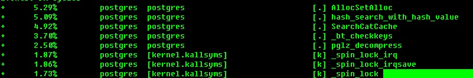

## PostgreSQL 查询涉及分区表过多导致的性能问题 - 性能诊断与优化(大量BIND, spin lock, SLEEP进程)     
                                         
### 作者                                         
digoal                                         
                                         
### 日期                                         
2018-01-24                                        
                                         
### 标签                                         
PostgreSQL , 分区表 , bind , spin lock , 性能分析 , sleep 进程 , CPU空转 , cache         
               
----             
               
## 背景        
实际上我写过很多文档，关于分区表的优化：    
    
[《PostgreSQL 商用版本EPAS(阿里云ppas) - 分区表性能优化 (堪比pg_pathman)》](../201801/20180122_03.md)      
    
[《PostgreSQL 传统 hash 分区方法和性能》](../201711/20171122_02.md)      
    
[《PostgreSQL 10 内置分区 vs pg_pathman perf profiling》](../201710/20171015_01.md)      
    
实际上native分区表的性能问题主要还是在于分区表过多的时候，执行计划需要耗时很久。    
    
因此有了    
    
1、PPAS的edb_enable_pruning参数，可以在生成执行计划前，使用简单SQL的话，直接过滤到目标分区，从而不需要的分区不需要进入执行计划的环节。    
    
2、pg_pathman则支持的更全面，除了简单SQL，复杂的表达式，immutable都可以进行过滤，过滤到目标分区，从而不需要的分区不需要进入执行计划的环节。    
    
因分区表过多引发的问题通常出现在OLTP系统（主要是OLTP系统的并发高，更容易把这种小问题放大），本来一次请求只需要1毫秒的，但是执行计划可能需要上百毫秒，也就是说执行耗时变成了小头，而执行计划（SPIN LOCK）变成了大头。    
    
下面这个例子也是OLTP系统相关的，有具体的原因分析。    
    
## SQL访问的分区表过多，并发高时CPU负载高，但是大量的是SLEEP状态的BIND进程。    
某个业务系统，单次SQL请求很快，几十毫秒，但是并发一高，QPS并没有线性的增长。    
    
而且大量的进程处于BIND，SLEEP的状态。    
    
    
    
    
经过诊断，    
    
[《PostgreSQL 源码性能诊断(perf profiling)指南》](../201611/20161129_01.md)      
    
[《Linux 性能诊断 perf使用指南》](../201611/20161127_01.md)      
    
主要的原因是大量的SPIN LOCK，导致CPU空转。    
    
```    
perf record -ag    
    
perf report -g    
```    
    
    
    
比如某个进程BIND时的pstack     
    
```    
#pstack  18423    
#0  0x00002ad051f3ef67 in semop () from /lib64/libc.so.6  -- 这边到了内核，上spin lock    
#1  0x0000000000656117 in PGSemaphoreLock ()    
#2  0x00000000006c274a in LWLockAcquire ()      
#3  0x00000000006bd136 in LockAcquireExtended ()      
#4  0x00000000006b8768 in LockRelationOid ()  -- 对所有的子表都会调用这个函数，导致spinlock    
#5  0x000000000050c10a in find_inheritance_children ()      
#6  0x000000000050c212 in find_all_inheritors ()  -- 找到所有子表    
#7  0x0000000000645e4e in expand_inherited_tables ()    
#8  0x000000000063a6e8 in subquery_planner ()    
#9  0x0000000000618c4f in set_rel_size ()    
#10 0x0000000000618e7c in set_rel_size ()    
#11 0x0000000000619587 in make_one_rel ()    
#12 0x0000000000636bd1 in query_planner ()    
#13 0x000000000063862c in grouping_planner ()    
#14 0x000000000063a9c4 in subquery_planner ()    
#15 0x0000000000618c4f in set_rel_size ()    
#16 0x0000000000619587 in make_one_rel ()    
#17 0x0000000000636bd1 in query_planner ()    
#18 0x000000000063862c in grouping_planner ()    
#19 0x000000000063a9c4 in subquery_planner ()    
#20 0x0000000000618c4f in set_rel_size ()    
#21 0x0000000000619587 in make_one_rel ()    
#22 0x0000000000636bd1 in query_planner ()    
#23 0x000000000063862c in grouping_planner ()    
#24 0x000000000063b0d0 in standard_planner ()    
#25 0x00000000006d1597 in pg_plan_queries ()    
#26 0x00000000007ca156 in BuildCachedPlan ()    
#27 0x00000000007ca525 in GetCachedPlan ()    
#28 0x00000000006d1d07 in exec_bind_message ()    
#29 0x00000000006d44de in PostgresMain ()    
#30 0x000000000066bd5f in PostmasterMain ()    
#31 0x00000000005f474c in main ()    
```    
    
由于业务使用了prepared statement，所以过程会变成bind 过程    
    
1、prepare statement    
    
2、bind parameters    
    
3、代入参数、(设置了constraint_exclusion时)判断哪些分区需要被过滤    
    
4、execute prepared statement    
    
在find_all_inheritors过程中，涉及的分区表过多，最后每个分区都要取LOCK（后面加载了系统的spin lock），所以我们会看到CPU很高，同时大量的BIND，进程处于SLEEP状态，也就是CPU空转，CPU时间片被独占的状态。    
    
### spinlock (自旋锁)      
自旋锁是专为防止多处理器并发而引入的一种锁，它在内核中大量应用于中断处理等部分(对于单处理器来说，防止中断处理中的并发可简单采用关闭中断的方式，不需要自旋锁)。          
          
自旋锁最多只能被一个内核任务持有，如果一个内核任务试图请求一个已被争用(已经被持有)的自旋锁，那么这个任务就会一直进行忙循环——旋转——等待锁重新可用。         
          
要是锁未被争用，请求它的内核任务便能立刻得到它并且继续进行。自旋锁可以在任何时刻防止多于一个的内核任务同时进入临界区，因此这种锁可有效地避免多处理器上并发运行的内核任务竞争共享资源。        
        
事实上，自旋锁的初衷就是：        
      
在短期间内进行轻量级的锁定。一个进程去获取被争用的自旋锁时，请求它的线程在等待锁重新可用的期间进行自旋(特别浪费处理器时间)，所以自旋锁不应该被持有时间过长（等待时CPU被独占）。如果需要长时间锁定的话, 最好使用信号量（睡眠，CPU资源可出让）    
。        
        
简单的说，自旋锁在内核中主要用来防止多处理器中并发访问临界区，防止内核抢占造成的竞争。另外自旋锁不允许任务睡眠(持有自旋锁的任务睡眠会造成自死锁——因为睡眠有可能造成持有锁的内核任务被重新调度，而再次申请自己已持有的锁)，它能够在中断上下文使用。        
        
死锁：假设有一个或多个内核任务和一个或多个资源，每个内核都在等待其中的一个资源，但所有的资源都已经被占用了。这便会发生所有内核任务都在相互等待，但它们永远不会释放已经占有的资源，于是任何内核任务都无法获得所需要的资源，无法继续运行，这便    
意味着死锁发生了。自死琐是说自己占有了某个资源，然后自己又申请自己已占有的资源，显然不可能再获得该资源，因此就自缚手脚了。        
        
spinlock特性：        
        
防止多处理器并发访问临界区，        
        
1、非睡眠（该进程/LWP(Light Weight Process)始终处于Running的状态）        
        
2、忙等 （cpu一直检测锁是否已经被其他cpu释放）      
      
3、短期（低开销）加锁      
      
4、适合中断上下文锁定      
      
5、多cpu的机器才有意义（需要等待其他cpu释放锁）      
    
以下截取自    
    
http://blog.sina.com.cn/s/blog_458d6ed5010110hv.html    
    
Spinlock的目的是用来同步SMP中会被多个CPU同时存取的变量。在Linux中，普通的spinlock由于不带额外的语义，是用起来反而要非 常小心。 在Linux kernel中执行的代码大体分normal和interrupt context两种。tasklet/softirq可以归为normal因为他们可以进入等待  
  
Spinlock的目的是用来同步SMP中会被多个CPU同时存取的变量。在Linux中，普通的spinlock由于不带额外的语义，是用起来反而要非常小心。  
  
在Linux kernel中执行的代码大体分normal和interrupt context两种。tasklet/softirq可以归为normal因为他们可以进入等待；nested interrupt是interrupt context的一种特殊情况，当然也是interrupt context。Normal级别可以被interrupt抢断，interrupt会被另一个interrupt抢断，但不会被normal中断。各个 interrupt之间没有优先级关系，只要有可能，每个interrupt都会被其他interrupt中断。  
  
我们先考虑单CPU的情况。在这样情况下，不管在什么执行级别，我们只要简单地把CPU的中断关掉就可以达到独占处理的目的。从这个角度来说，spinlock的实现简单地令人乍舌：cli/sti。只要这样，我们就关闭了preemption带来的复杂之门。  
  
单CPU的情况很简单，多CPU就不那么简单了。单纯地关掉当前CPU的中断并不会给我们带来好运。当我们的代码存取一个shared variable时，另一颗CPU随时会把数据改得面目全非。我们需要有手段通知它(或它们，你知道我的意思)——spinlock正为此设。这个例子是 我们的第一次尝试：  
  
```  
extern spinlock_t lock;  
// ...  
spin_lock(&lock);  
// do something  
spin_unlock(&lock);  
```  
  
他能正常工作吗？答案是有可能。在某些情况下，这段代码可以正常工作，但想一想会不会发生这样的事：  
  
```  
// in normal run level  
extern spinlock_t lock;  
// ...  
spin_lock(&lock);  
// do something  
// interrupted by IRQ ...  
  
// in IRQ  
extern spinlock_t lock;  
spin_lock(&lock);  
```  
  
喔，我们在normal级别下获得了一个spinlock，正当我们想做什么的时候，我们被interrupt打断了，CPU转而执行interrupt level的代码，它也想获得这个lock，于是“死锁”发生了！解决方法很简单，看看我们第二次尝试：  
  
```  
extern spinlock_t lock;  
// ...  
cli; // disable interrupt on current CPU  
spin_lock(&lock);  
// do something  
spin_unlock(&lock);  
sti; // enable interrupt on current CPU  
```  
  
在获得spinlock之前，我们先把当前CPU的中断禁止掉，然后获得一个lock;在释放lock之后再把中断打开。这样，我们就防止了死锁。事实上，Linux提供了一个更为快捷的方式来实现这个功能:  
  
```  
extern spinlock_t lock;  
// ...  
spin_lock_irq(&lock);  
// do something  
spin_unlock_irq(&lock);  
```  
  
如果没有nested interrupt，所有这一切都很好。加上nested interrupt，我们再来看看这个例子:  
  
```  
// code 1  
extern spinlock_t lock;  
// ...  
spin_lock_irq(&lock);  
// do something  
spin_unlock_irq(&lock);  
   
  
// code 2  
extern spinlock_t lock;  
// ...  
spin_lock_irq(&lock);  
// do something  
spin_unlock_irq(&lock);  
```  
  
Code 1和code 2都运行在interrupt context下，由于中断可以嵌套执行，我们很容易就可以想到这样的运行次序：  
  
```  
Code 1  
extern spinlock_t lock;  
// ...  
spin_lock_irq(&lock);	   
  
Code 2  
extern spinlock_t lock;  
// ...  
spin_lock_irq(&lock);  
// do something  
spin_unlock_irq(&lock);  
  
Code 1  
// do something  
spin_unlock_irq(&lock);	   
```  
  
问题是在第一个spin_unlock_irq后这个CPU的中断已经被打开，“死锁”的问题又会回到我们身边！  
  
解决方法是我们在每次关闭中断前纪录当前中断的状态，然后恢复它而不是直接把中断打开。  
  
  
```  
unsigned long flags;  
local_irq_save(flags);  
spin_lock(&lock);  
// do something  
spin_unlock(&lock);  
local_irq_restore(flags);  
```  
  
Linux同样提供了更为简便的方式:  
  
```  
unsigned long flags;  
spin_lock_irqsave(&lock, flags);  
// do something  
spin_unlock_irqrestore(&lock, flags);  
```  
    
## 复现    
使用这篇文档提到的方法，创建几千个分区的分区表，然后使用pgbench压测就可以复现这个问题。    
    
[《PostgreSQL 商用版本EPAS(阿里云ppas) - 分区表性能优化 (堪比pg_pathman)》](../201801/20180122_03.md)      
    
不再赘述。    
    
## 小结    
优化方法：    
    
1、假设我们的QUERY进程要查询多个分区（指很多个分区），那么建议把分区的粒度降低，尽量让QUERY减少真正被访问的分区数，从而减少LWLockAcquire次数。    
    
2、如果我们的分区很多，但是通过QUERY的WHERE条件过滤后实际被访问的分区不多，那么分区表的选择就非常重要。（目前尽量不要使用NATIVE分区）。尽量使用PPAS的edb_enable_pruning。对于PostgreSQL社区版本用户，在社区优化这部分代码前，请尽量使用pg_pathman分区功能。    
  
3、使用数据库UDF，根据输入条件，自动拼接子表，从而避免访问主表导致的本文提到的问题。   
  
4、使用程序自动实现数据路由，直接访问子表，从而避免访问主表导致的本文提到的问题。   
  
5、DBA可以做的：把不需要访问到的分区，临时从主表no inherit，这样访问主表时访问的子表数目减少，也能够降低BIND带来的问题。（比如一些很老的分区，实际上业务程序已经不需要访问，但是还挂载在主表上，带来性能问题）  
      
这里还可以给一个建议，对于单张子表，可以inherit多个父表，所以业务上保持少量子表，而分析层面（需要访问多个子表时）可以挂载多个子表。这样的话用起来也不会不舒服，只是DBA辛苦一点了。  
  
例子  
  
t_p_current  -- 业务表,访问较高频率，但是仅需访问最近2个月的数据。  

```
t_c_201802
t_c_201803
```
    
t_p_all  -- 分析表, 访问较少，但是需要访问所有子表  
  
```
t_c_201601
t_c_201602
....
t_c_201802  -- 它有两个主表
t_c_201803  -- 它有两个主表
....
t_c_201812
```
  
操作语法：   
   
```
alter table tbl1 inherit tbl_p_all;

alter table tbl1 no inherit tbl_p_current;
```
   
  
6、  
  
对于PPAS用户，建议能常量输入的，就使用常量输入，这样能够用到分区过滤的优化特性。（特别是在分区表非常多的情况下，优化效果非常明显）。

对于PG用户，使用pg_pathman作为分区组件，在分区很多的情况下，性能比native的分区好很多很多。

PostgreSQL 社区正在改进这块的代码，PATCH如下(PostgreSQL 11可能会包含这部分优化)：

https://www.postgresql.org/message-id/flat/098b9c71-1915-1a2a-8d52-1a7a50ce79e8@lab.ntt.co.jp#098b9c71-1915-1a2a-8d52-1a7a50ce79e8@lab.ntt.co.jp

https://commitfest.postgresql.org/17/1272/

## 参考    
[《Linux中的spinlock和mutex》](../201611/20161109_02.md)      
    
[《PostgreSQL 商用版本EPAS(阿里云ppas) - 分区表性能优化 (堪比pg_pathman)》](../201801/20180122_03.md)      
    
[《PostgreSQL 商用版本EPAS(阿里云ppas) NUMA 架构spin锁等待优化》](../201801/20180113_04.md)      
    
[《PostgreSQL 传统 hash 分区方法和性能》](../201711/20171122_02.md)      
    
[《PostgreSQL 10 内置分区 vs pg_pathman perf profiling》](../201710/20171015_01.md)      
     
  
<a rel="nofollow" href="http://info.flagcounter.com/h9V1"  ></a>  
  
  
  
  
  
  
## [digoal's 大量PostgreSQL文章入口](https://github.com/digoal/blog/blob/master/README.md "22709685feb7cab07d30f30387f0a9ae")
  
