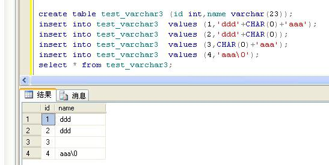

## [转] SqlServe到PG迁移错误:无效的编码序列"UTF8": 0x00  
          
### 作者          
digoal          
          
### 日期          
2018-01-28          
          
### 标签          
PostgreSQL , Greenplum , 0x00 , 空字符 , NUL , 数据清洗 , 规则 , 过滤 , 非法字符          
          
----          
          
## 背景       
## 原文
  
http://www.codeweblog.com/sqlserve%E5%88%B0pg%E8%BF%81%E7%A7%BB%E9%94%99%E8%AF%AF-%E6%97%A0%E6%95%88%E7%9A%84%E7%BC%96%E7%A0%81%E5%BA%8F%E5%88%97-utf8-0x00/  
  
环境：  
  
```  
sqlserver2008 R2 （winXP）  
  
postgresql9.3.4 （win7-64bit）  
```  
  
1\. 通过java像PostgreSQL提交批量 insert（或者普通insert或者执行copy）：  
  
错误：  
  
```java.sql.BatchUpdateException:``` 批次处理 被中止，呼叫 ```getNextException``` 以取得原因。  
  
解决：在catch模块打印出```getNextException```的内容，就能知道具体的原因是什么了。  
  
```  
catch (ClassNotFoundException | SQLException ex)  
{  
       System.out.println("Error: " + ex.getMessage());  
       ex.printStackTrace(System.out);  
       if (ex instanceof BatchUpdateException)  
       {  
             BatchUpdateException bex = (BatchUpdateException) ex;  
             bex.getNextException().printStackTrace(System.out);  
       }  
}  
```  
  
2\. getNextException抓到的具体错误信息是：```org.postgresql.util.PSQLException: ERROR: invalid byte sequence for encoding "UTF8": 0x00```  
  
```  
org.postgresql.util.PSQLException: ERROR: invalid byte sequence for encoding "UTF8": 0x00  
 at org.postgresql.core.v3.QueryExecutorImpl.receiveErrorResponse(QueryExecutorImpl.java:2198)  
 at org.postgresql.core.v3.QueryExecutorImpl.processResults(QueryExecutorImpl.java:1927)  
 at org.postgresql.core.v3.QueryExecutorImpl.execute(QueryExecutorImpl.java:405)  
 at org.postgresql.jdbc2.AbstractJdbc2Statement.executeBatch(AbstractJdbc2Statement.java:2892)  
 at JDBCTest.ConnTest.main(ConnTest.java:154)  
```  
  
3\. 经查看sqlsever和PG的字符编码:  
  
sql server的字符集编码是GBK（对于sqlserver查看encoding很复杂，我看参考了这个方法 http://bbs.csdn.net/topics/190034619 ）  
  
PostgreSQL的字符集编码是UTF8（对于PG来说很容易查看encoding，看一下属性中的encoding就可以）  
  
这样看来两个数据库的字符集编码不同，但是PG的服务器端不支持字符集GBK，也就是创建数据库时不能指定encoding=GBK，PG中可替代GBK的字符集EUC_CN也无法使用。只有客户端可以支持GBK，但该设置只在一个连接中有效，故在插入数据之前执行 ppstmt =conn.prepareStatement("set client_encoding=GBK;");，此时又产生了如下错误：  
  
```  
org.postgresql.util.PSQLException: The server's client_encoding parameter was changed to GBK. The JDBC driver requires client_encoding to be UTF8 for correct operation.  
    at org.postgresql.core.v3.QueryExecutorImpl.processResults(QueryExecutorImpl.java:1966)  
    at org.postgresql.core.v3.QueryExecutorImpl.execute(QueryExecutorImpl.java:255)  
    at org.postgresql.jdbc2.AbstractJdbc2Statement.execute(AbstractJdbc2Statement.java:561)  
    at org.postgresql.jdbc2.AbstractJdbc2Statement.executeWithFlags(AbstractJdbc2Statement.java:419)  
    at org.postgresql.jdbc2.AbstractJdbc2Statement.executeUpdate(AbstractJdbc2Statement.java:365)  
    at JDBCTest.ConnTest.main(ConnTest.java:56)  
```  
  
这样看来，sqlserver和PG的字符集没法实现完全统一。  
  
4\. 重新回到invalid byte sequence for encoding "UTF8": 0x00。  
  
我在postgresql的社区邮件列表里找到了这个问题：http://postgresql.1045698.n5.nabble.com/invalid-byte-sequence-for-encoding-quot-UTF8-quot-0x00-td2172080.html  
  
http://postgresql.1045698.n5.nabble.com/supporting-0x00-from-client-Unicode-JDBC-td1969492.html#a1969493  
  
通过邮件列表中提到的内容以及个人多次测试报错表的字段，发现导致问题的原因就是字符类型字段值中含有空字符，这是一个结束符。（Unicode 查询工具 http://www.scarfboy.com/coding/unicode-tool?s=U%2B2323）。  
  
5\. 问题重现：  
  
在sqlserver中：  
  
```  
create table test_varchar3 (id int,name varchar(23));  
insert into test_varchar3  values (1,'ddd'+CHAR(0)+'aaa');  
insert into test_varchar3  values (2,'ddd'+CHAR(0));  
insert into test_varchar3  values (3,CHAR(0)+'aaa');  
insert into test_varchar3  values (4,'aaa'); ---注意此种的仅仅是字符串并不是空字符''  
select * from test_varchar3;  
```  
  
将该表从sqlserver迁移到pg：  
  
通过jdbc取到的(其中空字符无法表示，此处用空格替代)：  
  
```  
id,name,name_length  
  
1,ddd aaa,length=7  
  
2,ddd ,length =4  
  
3, aaa,length=4  
  
4,aaa,length=5  
```  
  
错误重现：```invalid byte sequence for encoding "UTF8": 0x00。```  
  
解决方法：在向pg中copy或者insert数据提交之前，现将其中的字符类型字段值中的空字符取掉即可成功执行。  
  
比如：```str.replaceAll("", "");``` 或者```str.replace("", "");```  
  
6\. 扩展问题：  
  
sqlserver中字符类型字段值，当插入的字符值中带有空字符的时候，sqlserver客户端显示时会去掉空字符之后的字符，但是在查询中要查到该条数据还需要匹配之后的内容：  
  
  
  
```  
create table test_varchar3 (id int,name varchar(23));  
insert into test_varchar3  values (1,'ddd'+CHAR(0)+'aaa');  
insert into test_varchar3  values (2,'ddd'+CHAR(0));  
insert into test_varchar3  values (3,CHAR(0)+'aaa');  
insert into test_varchar3  values (4,'aaa');  
select * from test_varchar3;  
select * from test_varchar3 where name='ddd';  
id | name  
-------------  
2  |  ddd  
select * from test_varchar3 where name='ddd'+CHAR(0);  
id | name  
-------------  
2  |  ddd  
select * from test_varchar3 where name='ddd'+CHAR(0)+'aaa';  
id | name  
-------------  
1  |  ddd  
select * from test_varchar3 where name=CHAR(0);  
id | name  
------------  
  
select * from test_varchar3 where name=CHAR(0)+'aaa';  
id | name  
-------------  
3  |     
```  
  
关于如何从sqlsever数据库中去掉子赋值中的空值结束符，可以参考（待补充）：  
  
http://stackoverflow.com/questions/3533320/sql-server-remove-end-string-character-0-from-data  
  
所以说尽管空值终止符''是空的不显示的，但是他会对字符类型字段值及其查询等造成影响，所以使用sqlsever最好不要向字符类型字段中插入带有空值终止符''的字符或字符串。  
  
关于空值终止符''或者其他控制符的详细介绍，请参考MS SQL Server官方文档：  
  
http://msdn.microsoft.com/en-us/library/ms191485.aspx  
   
如果是从ORACLE迁移过来，可以使用Oracle的empty_clob()处理一下0x00字符。   
  
<a rel="nofollow" href="http://info.flagcounter.com/h9V1"  ></a>  
  
  
  
  
  
  
## [digoal's 大量PostgreSQL文章入口](https://github.com/digoal/blog/blob/master/README.md "22709685feb7cab07d30f30387f0a9ae")
  
