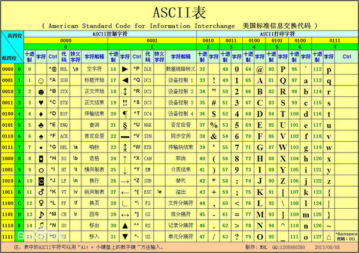
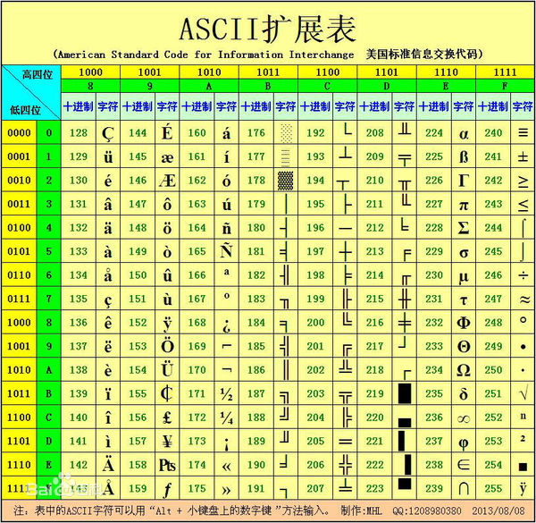

## [转] java - 过滤ASCII码中的不可见字符, ASCII三部分, 各控制字符详解    
              
### 作者              
digoal              
              
### 日期              
2018-01-28              
              
### 标签              
PostgreSQL , java , Greenplum , 0x00 , 空字符 , NUL , 数据清洗 , 规则 , 过滤 , 非法字符              
              
----              
              
## 背景           
## 原文    
      
http://www.codeweblog.com/sqlserve%E5%88%B0pg%E8%BF%81%E7%A7%BB%E9%94%99%E8%AF%AF-%E6%97%A0%E6%95%88%E7%9A%84%E7%BC%96%E7%A0%81%E5%BA%8F%E5%88%97-utf8-0x00/      
      
今天产品部同事报告了一个BUG，经过调试发现，由于用户输入的字符串中，包含字符0x1E, 也就是”记录分隔符”(Record Separator, Notepad++ 显示为[RS])，导致JavaScript XML解析遭遇错误。于是就想在字符串中过滤掉这些没多大用途的字符，同时又要保留部分常用的字符，例如换行，回车和水平制表符。于是写了下面一个 PHP 函数：    
    
```    
/**    
* 清理字符串中的部分不可见控制字符    
*    
* @param string $string 待处理字符串    
* @return string 处理后的字符串    
* @author fising(at)qq.com    
*/    
public static function clearInvisibleCharacter($string = '')    
{    
/* 排除 tab, \n, \r 三个字符 */    
$do_not_searches = array(chr(9), chr(10), chr(13));    
/* 需清理的字符列表 */    
$searches = array();    
for ($i = 0; $i <= 31; $i++)    
{    
if (!in_array(chr($i), $do_not_searches))    
{    
$searches[] = chr($i);    
}    
}    
$searches[] = chr(127);    
return str_replace($searches, '', $string);    
}    
```    
     
### 过滤ASCII码中的不可见字符    
上面所说的“不可见字符”，其实属于ascii码中的控制字符，它们是0到31、以及127，分别代表什么可查询ascii码表。    
    
在展示页面前，将文字中的控制字符改为空格(ascii 32)      
    
```    
public static String filter(String content){    
if (content != null && content.length() > 0) {    
char[] contentCharArr = content.toCharArray();    
for (int i = 0; i < contentCharArr.length; i++) {    
if (contentCharArr[i] < 0x20 || contentCharArr[i] == 0x7F) {    
contentCharArr[i] = 0x20;    
}    
}    
return new String(contentCharArr);    
}    
return "";    
}    
```    
    
其具体每个控制字符的含义，详解介绍如下：    
    
### ASCII中的Function/Control Code功能字符的详细含义    
    
0 – NUL – NULl 字符/空字符    
    
ASCII字符集中的空字符，NULL，起初本意可以看作为NOP（中文意为空操作，就是啥都不做的意思），此位置可以忽略一个字符。    
    
之所以有这个空字符，主要是用于计算机早期的记录信息的纸带，此处留个NUL字符，意思是先占这个位置，以待后用，比如你哪天想起来了，在这个位置在放一个别的啥字符之类的。    
    
后来呢，NUL字符被用于C语言中，字符串的终结符，当一个字符串中间出现NUL / NULL，代码里面表现为\0，的时候，就意味着这个是一个字符串的结尾了。这样就方便按照自己需求去定义字符串，多长都行，当然只要你内存放得下，然后最后加一个\0, 即空字符，意思是当前字符串到此结束。    
    
1 – SOH – Start    
Of Heading 标题开始    
    
如果信息沟通交流主要以命令和消息的形式的话，SOH就可以用于标记每个消息的开始。    
    
1963年，最开始ASCII标准中，把此字符定义为Start of Message，后来又改为现在的Start Of Heading。    
    
现在，这个SOH常见于主从（master-slave）模式的RS232的通信中，一个主设备，以SOH开头，和从设备进行通信。这样方便从设备在数据传输出现错误的时候，在下一次通信之前，去实现重新同步（resynchronize）。如果没有一个清晰的类似于SOH这样的标记，去标记每个命令的起始或开头的话，那么重新同步，就很难实现了。    
    
2 – STX – Start Of Text 文本开始    
    
3 – ETX – End Of Text 文本结束    
    
通过某种通讯协议去传输的一个数据（包），称为一帧的话，常会包含一个帧头，包含了寻址信息，即你是要发给谁，要发送到目的地是哪里，其后跟着真正要发送的数据内容。    
    
而STX，就用于标记这个数据内容的开始。接下来是要传输的数据，最后是ETX，表明数据的结束。    
    
其中，中间具体传输的数据内容，ASCII规范并没有去定义，其和你所用的传输协议，具体自己要传什么数据有关。    
    
帧头    
    
数据或文本内容    
    
SOH（表明帧头开始）    
    
。。。。（帧头信息，比如包含了目的地址，表明你发送给谁等等）    
    
STX（表明数据开始）    
    
。。。（真正要传输的数据）    
    
ETX（表明数据结束）    
    
 	 	 	 	     
不过其中有趣的是，1963年，ASCII标准最初版本的时候，把现在的STX叫做EOA（End Of Address），ETX叫做（End Of Message）。这是因为，最早的时候，一个消息中，总是包含一个开始符和一个终止符。现在的新的定义，使得可以去发送一个固定长度的命令，而只用一个SOH表明帧头开始即可，而不需要再加上一个命令终止符或帧头结束符。    
    
总结一下：    
    
一般发送一个消息，包含了一个帧头和后面真正要传的数据。    
    
而对于帧头，属于控制类的信息，这部分之前属于命令，后面的真实要传的数据属于数据。即消息=帧头+数据。    
    
而之前的命令都要有个开始符和结束符，这样就是：    
    
```    
消息    
= 帧头    
+ 要传的数据    
    
= 帧头开始+帧头信息+帧头结束     
+ 要传的数据    
    
而现在新的定义，使得只需要：    
    
消息    
= 帧头 +要传的数据    
    
= SOH（表明帧头开始）+帧头信息     
+ 要传的数据    
    
= SOH（表明帧头开始）+帧头信息     
+ STX + 数据内容+ETX    
```    
    
就可以少用一个帧头结束符。    
    
而如今，在很多协议中，也常见到，一个固定长度的帧头，后面紧接着就是数据了，而没有所谓的帧头结束符之类的东西去区分帧头和数据。    
    
4 – EOT – End Of Transmission 传输结束    
    
5 – ENQ – ENQuiry 请求    
    
6 – ACK – ACKnowledgment 回应/响应    
    
7 – BEL – [audible] BELl    
    
在ASCII字符集中，BEL，是个比较有意思的东东。因为其原先本意不是用来数据编码的，于此相反，ASCII中的其他字符，都是用于字符编码（即用什么字符，代表什么含义）或者起到控制设备的作用。BEL用一个可以听得见的声音，来吸引人们的注意，其原打算即用于计算机也用于一些设备，比如打印机等。C语言里面也支持此BEL，用\a来实现这个响铃。    
    
8 – BS – BackSpace 退格键    
    
退格键的功能，随着时间变化，意义也变得不同了。    
    
起初，意思是，在打印机和电传打字机上，往回移动一格光标，以起到强调该字符的作用。比如你想要打印一个a，然后加上退格键后，就成了aBS^。在机械类打字机上，此方法能够起到实际的强调字符的作用，但是对于后来的CTR下时期来说，就无法起到对应效果了。    
    
而现代所用的退格键，不仅仅表示光标往回移动了一格，同时也删除了移动后该位置的字符。在C语言中，退格键可以用\b表示。    
    
9 – HT – Horizontal Tab 水平制表符    
    
ASCII中的HT控制符的作用是用于布局的。    
    
其控制输出设备前进到下一个表格去处理。而制表符Table/Tab的宽度也是灵活不固定的，只不过，多数设备上，制表符Tab的宽度都预定义为8。水平制表符HT不仅能减少数据输入者的工作量，对于格式化好的文字来说，还能够减少存储空间，因为一个Tab键，就代替了8个空格，所以说省空间。    
    
对于省空间的优点，我们现在来看，可能会觉得可笑，因为现在存储空间已足够大，一般来说根本不会需要去省那么点可怜的存储空间，但是实际上在计算机刚发明的时候，存储空间（主要指的是内存）极其有限也极其昂贵，而且像ZIP等压缩方法也还没发明呢，所以对于当时来说，对于存储空间，那是能够省一点是一点，省任何一点，都是好的，也都是不容易的，省空间就是省钱啊。    
    
C语言中，用\t表示制表符。    
    
10 – LF – Line Feed 换行    
    
LF，直译为（给打印机等）喂一行，意思就是所说的，换行。    
    
换行字符，是ASCII字符集中，被误用的字符中的其中一个。    
    
LF的最原始的含义是，移动打印机的头到下一行。而另外一个ASCII字符，CR（Carriage Return）才是将打印机的头，移到最左边即一行的开始，行首。很多串口协议和MS-DOS及Windows操作系统，也都是这么实现的。    
    
而于此不同，对于C语言和Unix操作系统，其重新定义了LF字符的含义为新行，即LF和CR的组合才能表达出的，回车且换行的意思。    
    
虽然你可以争论哪种用法是错的，但是，不可否认，是从程序的角度出发，C语言和Unix对此LF的含义实现显得就很自然，而MS-DOS的实现更接近于LF的本意。    
    
如果最开始ASCII标准中，及定义 CF也定义newline，那样意思会清楚，会更好理理解：    
    
LF表示物理上的，设备控制方面的移动到下一行（并没有移动到行首）；    
    
新行（newline）表示逻辑上文本分隔符，即回车换行。    
    
不过呢，现在人们常将LF用做newline新行的功能，而大多数文本编辑软件也都可以处理单个LF或者CR/LF的组合了。    
    
LF在C语言中，用\n表示。    
    
11 – VT – Vertical Tab 垂直制表符    
    
垂直制表符，类似于水平制表符Tab，目的是为了减少布局中的工作，同时也减少了格式化字符时所需要存储字符的空间。VT控制码用于跳到下一个标记行。说实话，还真没看到有些地方需要用这个VT呢，因为一般在换行的时候，都是用LF代替VT了。    
    
12 – FF – Form Feed    
换页    
    
设计换页键，是用来控制打印机行为的。当打印机收到此键码的时候，打印机移动到下一页。不同的设备的终端对此控制码所表现的行为各不同。有些会去清除屏幕，而其他有的只是显示^L字符或者是只是新换一行而已。Shell脚本程序Bash和Tcsh的实现方式是，把FF看作是一个清除屏幕的命令。C语言程序中用\f表示FF（换页）。    
    
13 – CR – Carriage return 机器的滑动部分/底座    
返回 -> 回车    
    
CR回车的原意是让打印头回到左边界，并没有移动到下一行。    
    
随着时间流逝，后来人把CR的意思弄成了Enter键，用于示意输入完毕。在数据以屏幕显示的情况下，人们在Enter的同时，也希望把光标移动到下一行。因此C语言和Unix操作系统，重新定义了LF的意思，使其表示为移动到下一行。当输入CR去存储数据的时候，软件也常常隐式地将其转换为LF。    
    
14 – SO – Shift Out 不用切换    
    
15 – SI – Shift In    
启用切换    
    
早在1960s年代，定义ASCII字符集的人，就已经懂得了，设计字符集不单单可以用于英文字符集，也要能应用于外文字符集，是很重要的。    
    
定义Shift In 和Shift Out的含义，即考虑到了此点。    
    
最开始，其意为在西里尔语和拉丁语之间切换。西里尔ASCII定义中，KOI-7用到了Shift字符。拉丁语用Shift去改变打印机的字体。在此种用途中，SO用于产生双倍宽度的字符，而用SI打印压缩的字体。    
    
16 – DLE – Data Link Escape 数据链路转义    
    
有时候，我们需要在正在进行的通信过程中去发送一些控制字符。但是，总有一些情况下，这些控制字符却被看成了普通的数据流，而没有起到对应的控制效果。而ASCII标准中，定义DLE来解决这类问题。    
    
如果数据流中检测到了DLE，数据接收端则对其后面接下来的数据流中的字符，另作处理。而关于具体如何处理这些字符，ASCII规范中则没有具体定义，而只是弄了个DLE去打断正常数据的处理，告诉接下来的数据，要特殊对待。根据Modem中的Hayes通信协议DLE定义为“无声+++无声”。以我的观点，这样可能会更好：如果Hayes协议没有把DLE处理为嵌入通讯的无声状态，那样就符合现存的标准了。然而Hayes的开发者却觉得+++用的频率要远高于原始的DLE，所以才这么定义了。    
    
17 – DC1 – Device Control 1 / XON – Transmission on    
    
这个ASCII控制字符尽管原先定义为DC1，    
但是现在常表示为XON，用于串行通信中的软件流控制。其主要作用为，在通信被控制码XOFF中断之后，重新开始信息传输。用过串行终端的人应该还记得，当有时候数据出错了，按Ctrl+Q（等价于XON）有时候可以起到重新传输的效果。这是因为，此Ctrl+Q键盘序列实际上就是产生XON控制码，其可以将那些由于终端或者主机方面，由于偶尔出现的错误的XOFF控制码而中断的通信解锁，使其正常通信。    
    
18 – DC2 – Device Control 2    
    
19 – DC3 – Device Control 3 / XOFF – Transmission off 传输中断    
    
20 – DC4 – Device Control 4    
    
21 – NAK – Negative AcKnowledgment 负面响应-> 无响应, 非正常响应    
    
22 – SYN – SYNchronous idle    
    
23 – ETB – End of Transmission Block 块传输中止    
    
24 – CAN – CANcel 取消    
    
25 – EM – End of Medium    
已到介质末端，介质存储已满    
    
EM用于，当数据存储到达串行存储介质末尾的时候，就像磁带或磁头滚动到介质末尾一样。其用于表述数据的逻辑终点，即不必非要是物理上的达到数据载体的末尾。    
    
26 – SUB – SUBstitute character替补/替换    
    
27 – ESC – ESCape 逃离/取消    
    
字符Escape，是ASCII标准的首创的，由Bob Bemer提议的。用于开始一段控制码的扩展字符。如此，即可以不必将所有可能想得到的字符都放到ASCII标准中了。因为，新的技术可能需要新的控制命令，而ESC可以用作这些字符命令的起始标志。ESC广泛用于打印机和终端，去控制设备设置，比如字体，字符位置和颜色等等。如果最开始的ASCII标准中，没有定义ESC，估计ASCII标准早就被其他标准所替代了，因为其没有包含这些新出现的字符，所以肯定会有其他新的标准出现，用于表示这些字符的。即，ESC给开发者提供了，可以根据需要而定义新含义的字符的可能。    
    
28 – FS – File Separator 文件分隔符    
    
文件分隔符是个很有意思的控制字符，因为其可以让我们看到1960s年代的时候，计算机技术是如何组织的。我们现在，习惯于随即访问一些存储介质，比如RAM，磁盘，但是在定义ASCII标准的那个年代，大部分数据还是顺序的，串行的，而不是随机访问的。此处所说的串行的，不仅仅指的是串行通信，还指的是顺序存储介质，比如穿孔卡片，纸带，磁带等。在串行通信的时代，设计这么一个用于表示文件分隔符的控制字符，用于分割两个单独的文件，是一件很明智的事情。而FS的原因就在于此。    
    
29 – GS – Group Separator分组符    
    
ASCII定义控制字符的原因中，其中一条就是考虑到了数据存储方面的情况。大部分情况下，数据库的建立，都和表有关，包含了对应的记录。同一个表中的所有的记录，属于同一类型。不同的表中的记录，属于对应的不同的类型。而分组符GS就是用来分隔串行数据存储系统中的不同的组。值得注意的是，当时还没有使用word的表格，当时ASCII时代的人，把他叫做组。    
    
30 – RS – Record Separator记录分隔符    
    
记录分隔符RS用于分隔在一个组或表内的多个记录。    
    
31 – US – Unit Separator 单元分隔符    
    
在ASCII定义中，在数据库中所存储的，最小的数据项，叫做Unit单元。而现在我们称其field域。单元分隔符US用于分割串行数据存储环境下的不同的域。    
    
现在大部分的数据库实现，要求大部分类型都拥有固定的长度。    
    
尽管大部分时候可能用不到，但是对于每一个域，却都要分配足够大的空间，用于存放最大可能的成员变量。这样的做法，占用了大量的存储空间，而US控制码允许域具有可变的长度。在1960s年代，数据存储空间很有限，用US这个单元分隔符，将不同单元分隔开，这样就可以实现更高效地存储那些宝贵的数据。另一方面，串行存储的存储效率，远低于RAM和磁盘中所实现的表格存储。我个人无法想象，如果现在的数据，还是存储在自带或者带滚轮的磁带上，会是何种景象。    
    
32 – SP – White SPace 空格键    
    
也许你会争论说，空格键是否真的能算是一个控制字符？因为现在在普通文字中使用空格键是如此常见。    
    
但是，既然水平制表符和退格键在ASCII中，都被叫做控制字符了，那么我觉得也很自然地，可以把空格键（向前的空格）也叫做控制字符，毕竟，其本身并不代表一个真正的可见的字符，而仅仅只是很常用于输出设备，用于处理位置前向移动一格，清除当前位置的内容而已。在很多程序中，比如字符处理程序，白空格同样可能从导致行尾转到下一行行首，而网络浏览器将多个空格组合成单个空格输出。    
    
所以，这更加坚定了我的想法，觉得完全可以把空格看成是一个控制字符，而不仅仅是一个很独特的普通字符。    
    
127 – DEL – DELete    
删除    
    
有人也许会问，为何ASCII字符集中的控制字符的值都是很小的，即0-32，而DEL控制字符的值却很大，是127。这是由于这个特殊的字符是为纸带而定义的。而在那个时候，绝大多数的纸带，都是用7个孔洞去编码数据的。而127这个值所对应的二进制值为111 1111b，表示所有7个比特位都是高，所以，将DEL用在现存的纸带上时，所有的洞就都被穿孔了，就把已经存在的数据都擦出掉了，就起到了对应的删除的作用了。    
    
【各种字符的标准的读法/叫法】    
    
常见ASCII字符，以及其他非常见的字符，Unicode中的字符，其他特殊字符等等，这些字符的英文叫法，可以去Unicode官方找到：    
    
http://www.unicode.org/charts/#symbols    
    
比如：    
    
ASCII字符/字母的叫法/读法    
如何读    
：    
    
1. C0 Control and Basic Latin Range：0000-007F    
    
http://www.unicode.org/charts/PDF/U0000.pdf    
    
2.Alphabetic Presentation Forms Range：FB00-FB4F    
http://www.unicode.org/charts/PDF/UFB00.pdf    
    
3. CJK Compatibility Forms    
    
http://www.unicode.org/charts/PDF/UFE30.pdf    
    
4.Fullwidth ASCII Punctuation    
    
http://www.unicode.org/charts/PDF/UFF00.pdf    
    
【引用】    
    
1.C0 and C1 control codes    
    
http://en.wikipedia.org/wiki/C0_and_C1_control_codes    
    
2. Control Character    
    
http://en.wikipedia.org/wiki/Control_character    
    
3．    
ASCII character map    
    
http://www.lammertbies.nl/comm/info/ascii-characters.html    
    
4．    
百度百科：ASCII    
    
http://baike.baidu.com/view/15482.htm    
    
5. ASCII编码表    
    
http://www.dreamdu.com/xhtml/ascii/    
    
ASCII码大致可以分作三部分组成。    
    
### 第一部分：ASCII非打印控制字符表    
    
ASCII表上的数字0–31分配给了控制字符，用于控制像打印机等一些外围设备。例如，12代表换页/新页功能。此命令指示打印机跳到下一页的开头。（参详ASCII码表中0-31）    
    
### 第二部分：ASCII打印字符    
    
数字 32–126 分配给了能在键盘上找到的字符，当您查看或打印文档时就会出现。数字127代表 DELETE 命令。（参详ASCII码表中32-127）    
    
ASCII码表 0-127    
    
    
    
### 第三部分：扩展ASCII打印字符    
    
扩展的ASCII字符满足了对更多字符的需求。扩展的ASCII包含ASCII中已有的128个字符（数字0–32显示在下图中），又增加了128个字符，总共是256个。即使有了这些更多的字符，许多语言还是包含无法压缩到256个字符中的符号。因此，出现了一些ASCII的变体来囊括地区性字符和符号。例如，许多软件程序把ASCII表（又称作ISO8859-1）用于北美、西欧、澳大利亚和非洲的语言。    
    
    
    
Vim里常见的几个不可见字符：    
    
```    
^@ = 0x00 Null值    
^H = 0x08 退格    
^I = 0x09 水平制表    
^J = 0x0A 换行    
^M = 0x0D 回车    
    
    
去掉^M回车:    
    
    
:%s/^M//g #  vi中将^M替换成回车。     
$ sed -e 's/^M//g' myfile.txt  #直接操作文件    
注意：这里的“^M”要使用“CTRL-V CTRL-M”生成，而不是直接键入“^M”。    
    
去掉^@:    
    
sed -r 's/\x0//g' file>file1    
```    
    
### 什么是Function Code功能码或 Function Character功能字符    
    
ASCII字符集，大家都知道吧，最基本的包含了128个字符。其中前32个，0-31，即0x00-0x1F，都是不可见字符。这些字符，就叫做控制字符。    
    
这些字符没法打印出来，但是每个字符，都对应着一个特殊的控制功能的字符，简称功能字符或功能码Function Code。    
    
简言之：ASCII中前32个字符，统称为Function Code功能字符。    
    
此外，由于ASCII中的127对应的是Delete，也是不可见的，所以，此处根据笔者的理解，也可以归为Function Code。    
    
此类字符，对应不同的“功能”，起到一定的“控制作用”，所以，称为控制字符。    
  
  
<a rel="nofollow" href="http://info.flagcounter.com/h9V1"  ></a>  
  
  
  
  
  
  
## [digoal's 大量PostgreSQL文章入口](https://github.com/digoal/blog/blob/master/README.md "22709685feb7cab07d30f30387f0a9ae")
  
