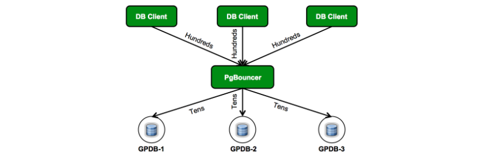
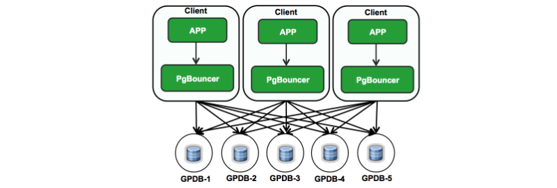
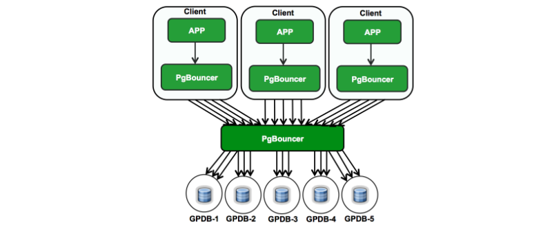
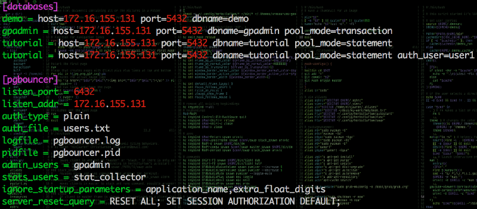

## Greenplum 连接池实践       
                
### 作者                
digoal                
                
### 日期                
2018-01-28                
                
### 标签                
PostgreSQL , Greenplum , pgbouncer , pgpool-II , 连接池               
                
----                
                
## 背景       
连接池在数据库应用中是非常重要的一种组件。     
    
虽然空闲连接不干什么，但是由于每个连接有自己的relcache缓存空间，被访问过的对象，都会占用一定的缓存空间（访问的对象越多，内存占用越多）。因此即使连接空闲，实际上依旧占用了SOCKET，以及一定的内存空间。  
  
某个业务长连接的问题（也是relcache的霸占问题）：  
  
[《PostgreSQL relcache在长连接应用中的内存霸占"坑"》](../201607/20160709_01.md)    
  
Greenplum是一个数据仓库，通常数据仓库会用到大量的分区表，临时表，通常表也可能很多。而且被访问到的表（包括分区）也可能比较多。因此对于Greenplum来说，会话backend process占用的relcache内存更多。  
  
那么对于Greenplum用户来说，长连接（以及大量的空闲连接）就需要注意了。  
   
另一个使用连接池的理由，当连接很多时，很有可能把OS的会话跟踪表打满，导致SQL报错(Greenplum Error: "Interconnect Error writing an Outgoing Packet: Operation not Permitted")：   
  
[《轻松打爆netfilter conntrack table的Greenplum SQL》](../201612/20161229_05.md)  
  
使用连接池（事务级连接池），就非常有必要。  
  
## pgbouncer连接池+Greenplum的几种部署模式  
### Connection Pooling  
连接池部署在客户端与数据库之间，一个连接池，多个客户端连接。  
  
这种模式无法实现pg_hba.conf来识别客户端，进行ACL控制。因为数据库端看到的连接是来自这个pgbouncer的，而pgbouncer与客户端不在一起。所以只能在pgbouncer这里配置ACL。  
  
  
  
### Local Pooling  
连接池部署在客户端一起，每个客户端服务器都部署一个pgbouncer。  
  
  
  
### Local Pooling with extra layer of PgBouncer  
多级模式，客户端也有pgbouncer，数据库与客户端之间还有一个集中的pgbouncer。  
  
  
  
### 配置例子  
  
  
## pgbouncer连接复用模式  
  
1、会话模式。不会主动复用连接，只有当占用连接的会话结束后，这个连接才能被其他新建的会话复用。适合短连接业务。  
  
2、事务模式。当事务结束后，连接就可以被其他会话复用。适合长连接业务。但是不能支持绑定变量。  
  
3、语句模式。语句模式复用最宽松，语句结束后，连接就可以被其他会话复用。适合长连接业务，不支持事务，不支持绑定变量。  
  
  
### 重置连接状态  
对于需要复用的连接，需要重置一下会话状态。  
  
例如  
  
```  
postgres=# discard all;  
DISCARD ALL  
  
postgres=# RESET all;  
RESET  
```  
  
  
## 参考  
[《PostgreSQL relcache在长连接应用中的内存霸占"坑"》](../201607/20160709_01.md)    
  
https://www.linkedin.com/pulse/scaling-greenplum-pgbouncer-sandeep-katta-/?articleId=6128769027482402816  
  
https://pgbouncer.github.io/  
  
http://pgpool.net/mediawiki/index.php/Main_Page  
  
<a rel="nofollow" href="http://info.flagcounter.com/h9V1"  ></a>  
  
  
  
  
  
  
## [digoal's 大量PostgreSQL文章入口](https://github.com/digoal/blog/blob/master/README.md "22709685feb7cab07d30f30387f0a9ae")
  
