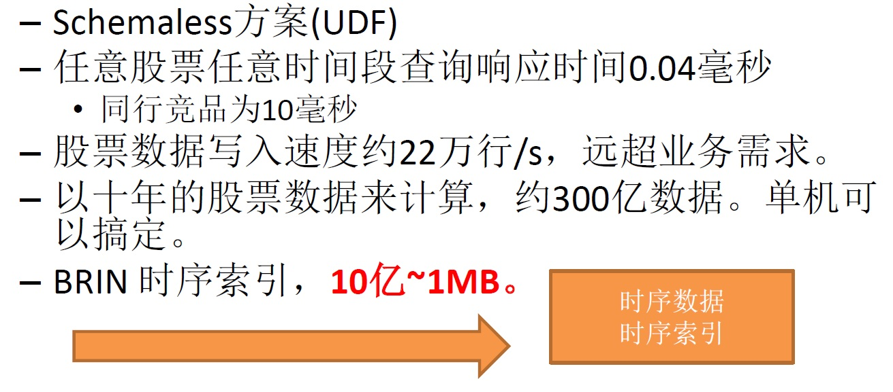
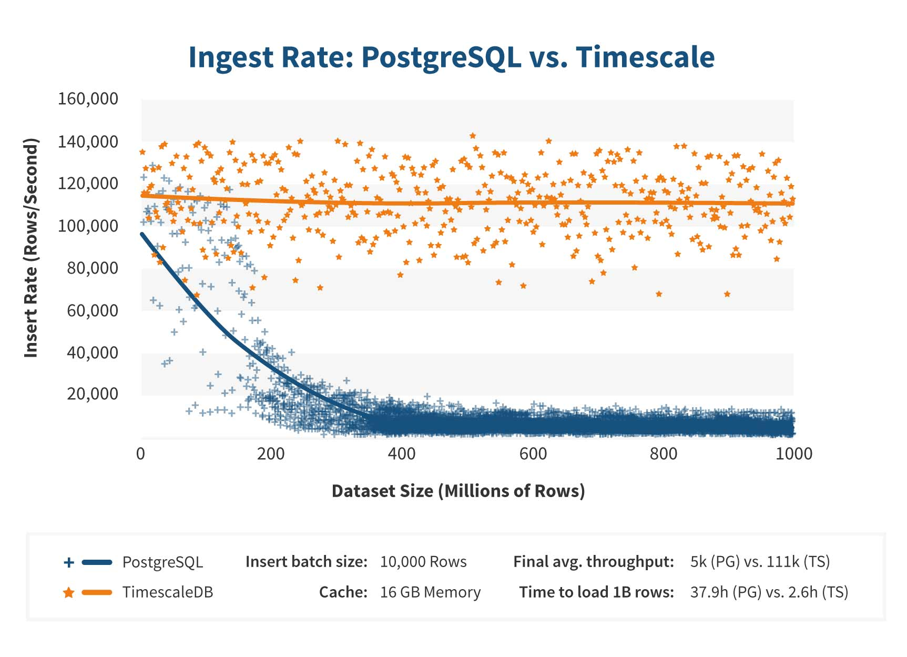

## PostgreSQL 时序数据库插件 timescaleDB 部署实践(含例子 纽约TAXI数据透视分析) - PostGIS + timescaleDB => PG时空数据库  
                  
### 作者                  
digoal                  
                  
### 日期                  
2018-01-29                  
                  
### 标签                  
PostgreSQL , 时空数据库 , 时序数据库 , 空间数据库 , timescaleDB , PostGIS             
                  
----                  
                  
## 背景    
现实社会中，很多业务产生的数据具有时序数据属性（在时间维度上顺序写入，同时包括大量时间区间查询统计的需求）。  
  
例如业务的FEED数据，物联网产生的时序数据（如气象传感器、车辆轨迹、等），金融行业的实时数据等等。  
  
PostgreSQL的UDF和BRIN（块级索引）很适合时序数据的处理。具体有以下的两个例子  
  
[《PostgreSQL 按需切片的实现(TimescaleDB插件自动切片功能的plpgsql schemaless实现)》](../201711/20171102_02.md)    
  
[《PostgreSQL 时序最佳实践 - 证券交易系统数据库设计 - 阿里云RDS PostgreSQL最佳实践》](../201704/20170417_01.md)    
  
  
  
实际上PostgreSQL生态中，衍生了一个时序插件：timescaleDB。专门用于处理时序数据。（timescale的改进，包括SQL优化器的改进(支持merge append，时间片聚合非常高效)，rotate接口，自动分片等）  
  
同时timescaleDB也非常受投资者的关注，已获5000万美金的投资，也间接说明时序数据库在未来是非常受用户欢迎的。  
  
## timescaleDB的优势  
首先，timescaleDB是自动切片的，对用户无感知，在数据量非常庞大的时候，写入性能不衰减。（主要指IOPS较低的磁盘，如果IOPS较好的磁盘PG在写入大量数据后性能也是OK的。）  
  
  
  
其次，timescale改进了SQL优化器，增加了merge append的执行节点，同时在对小时间片进行group by时，可以不用HASH或GROUP整个数据范围，而是分片计算，使得效率非常高。  
  
最后，timescale增加了一些API，使得用户在时序数据的写入、维护、查询都非常的高效、同时易于维护。  
  
API如下  
  
http://docs.timescale.com/v0.8/api  
  
## 部署timescaleDB  
以CentOS 7.x x64为例。  
  
1、首先要安装好PostgreSQL  
  
参考 [《PostgreSQL on Linux 最佳部署手册》](../201611/20161121_01.md)    
  
```  
export USE_NAMED_POSIX_SEMAPHORES=1  
LIBS=-lpthread CFLAGS="-O3" ./configure --prefix=/home/digoal/pgsql10 --with-segsize=8 --with-wal-segsize=256  
LIBS=-lpthread CFLAGS="-O3" make world -j 64  
LIBS=-lpthread CFLAGS="-O3" make install-world  
```  
  
2、其次需要安装cmake3  
  
```  
epel  
  
yum install -y cmake3  
  
ln -s /usr/bin/cmake3 /usr/bin/cmake  
```  
  
3、编译timescaleDB  
  
```  
git clone https://github.com/timescale/timescaledb/  
  
cd timescaledb  
git checkout release-0.8.0  
  
或  
  
wget https://github.com/timescale/timescaledb/archive/0.8.0.tar.gz  
  
  
  
export PATH=/home/digoal/pgsql10/bin:$PATH  
export LD_LIBRARY_PATH=/home/digoal/pgsql10/lib:$LD_LIBRARY_PATH  
  
# Bootstrap the build system  
./bootstrap  
  
cd ./build && make  
  
make install  
  
  
[  2%] Built target sqlupdatefile  
[  4%] Built target sqlfile  
[100%] Built target timescaledb  
Install the project...  
-- Install configuration: "Release"  
-- Installing: /home/dege.zzz/pgsql10/share/extension/timescaledb.control  
-- Installing: /home/dege.zzz/pgsql10/share/extension/timescaledb--0.8.0.sql  
-- Installing: /home/dege.zzz/pgsql10/share/extension/timescaledb--0.7.1--0.8.0.sql  
-- Installing: /home/dege.zzz/pgsql10/share/extension/timescaledb--0.1.0--0.2.0.sql  
-- Installing: /home/dege.zzz/pgsql10/share/extension/timescaledb--0.2.0--0.3.0.sql  
-- Installing: /home/dege.zzz/pgsql10/share/extension/timescaledb--0.3.0--0.4.0.sql  
-- Installing: /home/dege.zzz/pgsql10/share/extension/timescaledb--0.4.0--0.4.1.sql  
-- Installing: /home/dege.zzz/pgsql10/share/extension/timescaledb--0.4.1--0.4.2.sql  
-- Installing: /home/dege.zzz/pgsql10/share/extension/timescaledb--0.4.2--0.5.0.sql  
-- Installing: /home/dege.zzz/pgsql10/share/extension/timescaledb--0.5.0--0.6.0.sql  
-- Installing: /home/dege.zzz/pgsql10/share/extension/timescaledb--0.6.0--0.6.1.sql  
-- Installing: /home/dege.zzz/pgsql10/share/extension/timescaledb--0.6.1--0.7.0.sql  
-- Installing: /home/dege.zzz/pgsql10/share/extension/timescaledb--0.6.1--0.7.1.sql  
-- Installing: /home/dege.zzz/pgsql10/share/extension/timescaledb--0.7.0--0.7.1.sql  
-- Installing: /home/dege.zzz/pgsql10/lib/timescaledb.so  
```  
  
4、配置postgresql.conf，在数据库启动时自动加载timescale lib库。  
  
```  
vi $PGDATA/postgresql.conf  
shared_preload_libraries = 'timescaledb'  
  
pg_ctl restart -m fast  
```  
  
5、对需要使用timescaledb的数据库，创建插件.  
  
  
```  
psql  
psql (10.1)  
Type "help" for help.  
  
postgres=# create extension timescaledb ;  
```  
  
6、timescaledb的相关参数  
  
  
```  
timescaledb.constraint_aware_append     
timescaledb.disable_optimizations       
timescaledb.optimize_non_hypertables    
timescaledb.restoring    
  
postgres=# show timescaledb.constraint_aware_append ;  
 timescaledb.constraint_aware_append   
-------------------------------------  
 on  
(1 row)  
  
postgres=# show timescaledb.disable_optimizations ;  
 timescaledb.disable_optimizations   
-----------------------------------  
 off  
(1 row)  
  
postgres=# show timescaledb.optimize_non_hypertables ;  
 timescaledb.optimize_non_hypertables   
--------------------------------------  
 off  
(1 row)  
  
postgres=# show timescaledb.restoring ;  
 timescaledb.restoring   
-----------------------  
 off  
(1 row)  
```  
  
## timescaleDB使用例子1 - 纽约TAXI数据透视分析  
第一个例子是real-life New York City taxicab data ，  
  
http://docs.timescale.com/v0.8/tutorials/tutorial-hello-nyc  
  
数据为真实的数据，来自  
  
http://www.nyc.gov/html/tlc/html/about/trip_record_data.shtml  
  
  
1、下载样本数据  
  
```  
wget https://timescaledata.blob.core.windows.net/datasets/nyc_data.tar.gz  
```  
  
2、解压  
  
```  
tar -zxvf nyc_data.tar.gz   
```  
  
3、建表，其中包括将普通表转换为时序存储表的API create_hypertable 的使用。  
  
```  
psql -f nyc_data.sql  
```  
  
截取一些nyc_data.sql的内容如下：  
  
```  
cat nyc_data.sql  
  
-- 打车数据: 包括时长、计费、路程、上车、下车经纬度、时间、人数等等。  
  
CREATE TABLE "rides"(  
    vendor_id TEXT,  
    pickup_datetime TIMESTAMP WITHOUT TIME ZONE NOT NULL,  
    dropoff_datetime TIMESTAMP WITHOUT TIME ZONE NOT NULL,  
    passenger_count NUMERIC,  
    trip_distance NUMERIC,  
    pickup_longitude  NUMERIC,  
    pickup_latitude   NUMERIC,  
    rate_code         INTEGER,  
    dropoff_longitude NUMERIC,  
    dropoff_latitude  NUMERIC,  
    payment_type INTEGER,  
    fare_amount NUMERIC,  
    extra NUMERIC,  
    mta_tax NUMERIC,  
    tip_amount NUMERIC,  
    tolls_amount NUMERIC,  
    improvement_surcharge NUMERIC,  
    total_amount NUMERIC  
);  
```  
  
这句话，将rides转换为时序表存储  
  
```  
SELECT create_hypertable('rides', 'pickup_datetime', 'payment_type', 2, create_default_indexes=>FALSE);  
```  
  
创建索引  
  
```  
CREATE INDEX ON rides (vendor_id, pickup_datetime desc);  
CREATE INDEX ON rides (pickup_datetime desc, vendor_id);  
CREATE INDEX ON rides (rate_code, pickup_datetime DESC);  
CREATE INDEX ON rides (passenger_count, pickup_datetime desc);  
```  
  
4、导入测试数据  
  
```  
psql -c "\COPY rides FROM nyc_data_rides.csv CSV"  
COPY 10906858  
```  
  
5、对已转换为时序存储表的rides执行一些测试SQL，性能比PostgreSQL普通表要好。  
  
每天同车超过2人的交易，平均计费多少？  
  
```  
-- Average fare amount of rides with 2+ passengers by day  
  
SELECT date_trunc('day', pickup_datetime) as day, avg(fare_amount)  
  FROM rides  
  WHERE passenger_count > 1 AND pickup_datetime < '2016-01-08'  
  GROUP BY day ORDER BY day;  
  
        day         |         avg  
--------------------+---------------------  
2016-01-01 00:00:00 | 13.3990821679715529  
2016-01-02 00:00:00 | 13.0224687415181399  
2016-01-03 00:00:00 | 13.5382068607068607  
2016-01-04 00:00:00 | 12.9618895561740149  
2016-01-05 00:00:00 | 12.6614611935518309  
2016-01-06 00:00:00 | 12.5775245695086098  
2016-01-07 00:00:00 | 12.5868802584437019  
(7 rows)  
```  
  
6、某些查询的性能甚至超过20倍  
  
每天有多少笔交易。  
  
```  
-- Total number of rides by day for first 5 days  
  
SELECT date_trunc('day', pickup_datetime) as day, COUNT(*) FROM rides  
  GROUP BY day ORDER BY day  
  LIMIT 5;  
  
        day         | count  
--------------------+--------  
2016-01-01 00:00:00 | 345037  
2016-01-02 00:00:00 | 312831  
2016-01-03 00:00:00 | 302878  
2016-01-04 00:00:00 | 316171  
2016-01-05 00:00:00 | 343251  
(5 rows)  
```  
  
timescale增加了merge append的执行优化，因此在时间片上按小粒度聚合，效率非常高，数据量越大，性能提升的效果越明显。  
  
For example, TimescaleDB introduces a time-based "merge append" optimization to minimize the number of   
groups which must be processed to execute the following (given its knowledge that time is already ordered).   
  
For our 100M row table, this results in query latency that is 396x faster than PostgreSQL (82ms vs. 32566ms).  
  
```  
SELECT date_trunc('minute', time) AS minute, max(usage_user)  
  FROM cpu  
  WHERE time < '2017-01-01'  
  GROUP BY minute  
  ORDER BY minute DESC  
  LIMIT 5;  
```  
  
7、执行一些timescaleDB特有的功能函数，例如time_bucket，这里同样会用到timescaleDB内置的一些加速算法。  
  
每5分钟间隔为一个BUCKET，输出每个间隔产生了多少笔订单。  
  
```  
-- Number of rides by 5 minute intervals  
--   (using the TimescaleDB "time_bucket" function)  
  
SELECT time_bucket('5 minute', pickup_datetime) as five_min, count(*)  
  FROM rides  
  WHERE pickup_datetime < '2016-01-01 02:00'  
  GROUP BY five_min ORDER BY five_min;  
  
      five_min       | count  
---------------------+-------  
 2016-01-01 00:00:00 |   703  
 2016-01-01 00:05:00 |  1482  
 2016-01-01 00:10:00 |  1959  
 2016-01-01 00:15:00 |  2200  
 2016-01-01 00:20:00 |  2285  
 2016-01-01 00:25:00 |  2291  
 2016-01-01 00:30:00 |  2349  
 2016-01-01 00:35:00 |  2328  
 2016-01-01 00:40:00 |  2440  
 2016-01-01 00:45:00 |  2372  
 2016-01-01 00:50:00 |  2388  
 2016-01-01 00:55:00 |  2473  
 2016-01-01 01:00:00 |  2395  
 2016-01-01 01:05:00 |  2510  
 2016-01-01 01:10:00 |  2412  
 2016-01-01 01:15:00 |  2482  
 2016-01-01 01:20:00 |  2428  
 2016-01-01 01:25:00 |  2433  
 2016-01-01 01:30:00 |  2337  
 2016-01-01 01:35:00 |  2366  
 2016-01-01 01:40:00 |  2325  
 2016-01-01 01:45:00 |  2257  
 2016-01-01 01:50:00 |  2316  
 2016-01-01 01:55:00 |  2250  
(24 rows)  
```  
  
8、执行一些统计分析SQL  
  
每个城市的打车交易量。  
  
```  
-- Join rides with rates to get more information on rate_code  
  
SELECT rates.description, COUNT(vendor_id) as num_trips FROM rides  
  JOIN rates on rides.rate_code = rates.rate_code  
  WHERE pickup_datetime < '2016-01-08'  
  GROUP BY rates.description ORDER BY rates.description;  
  
      description      | num_trips  
-----------------------+-----------  
 JFK                   |     54832  
 Nassau or Westchester |       967  
 Newark                |      4126  
 group ride            |        17  
 negotiated fare       |      7193  
 standard rate         |   2266401  
(6 rows)  
```  
  
某些城市2016年1月的打车统计（最长、短距离、平均人数、时长等）  
  
```  
-- Analysis of all JFK and EWR rides in Jan 2016  
  
SELECT rates.description, COUNT(vendor_id) as num_trips,  
    AVG(dropoff_datetime - pickup_datetime) as avg_trip_duration, AVG(total_amount) as avg_total,  
    AVG(tip_amount) as avg_tip, MIN(trip_distance) as min_distance, AVG(trip_distance) as avg_distance, MAX(trip_distance) as max_distance,  
    AVG(passenger_count) as avg_passengers  
  FROM rides  
  JOIN rates on rides.rate_code = rates.rate_code  
  WHERE rides.rate_code in (2,3) AND pickup_datetime < '2016-02-01'  
  GROUP BY rates.description ORDER BY rates.description;  
  
 description | num_trips | avg_trip_duration |      avg_total      |      avg_tip       | min_distance |    avg_distance     | max_distance |   avg_passengers  
-------------+-----------+-------------------+---------------------+--------------------+--------------+---------------------+--------------+--------------------  
 JFK         |    225019 | 00:45:46.822517   | 64.3278115181384683 | 7.3334228220728027 |         0.00 | 17.2602816651038357 |       221.00 | 1.7333869584346211  
 Newark      |     16822 | 00:35:16.157472   | 86.4633688027582927 | 9.5461657353465700 |         0.00 | 16.2706122934252764 |       177.23 | 1.7435501129473309  
(2 rows)  
```  
  
  
9、数据自动分片与执行计划  
  
```  
postgres=# \d+ rides  
                                                     Table "public.rides"  
        Column         |            Type             | Collation | Nullable | Default | Storage  | Stats target | Description   
-----------------------+-----------------------------+-----------+----------+---------+----------+--------------+-------------  
 vendor_id             | text                        |           |          |         | extended |              |   
 pickup_datetime       | timestamp without time zone |           | not null |         | plain    |              |   
 dropoff_datetime      | timestamp without time zone |           | not null |         | plain    |              |   
 passenger_count       | numeric                     |           |          |         | main     |              |   
 trip_distance         | numeric                     |           |          |         | main     |              |   
 pickup_longitude      | numeric                     |           |          |         | main     |              |   
 pickup_latitude       | numeric                     |           |          |         | main     |              |   
 rate_code             | integer                     |           |          |         | plain    |              |   
 dropoff_longitude     | numeric                     |           |          |         | main     |              |   
 dropoff_latitude      | numeric                     |           |          |         | main     |              |   
 payment_type          | integer                     |           |          |         | plain    |              |   
 fare_amount           | numeric                     |           |          |         | main     |              |   
 extra                 | numeric                     |           |          |         | main     |              |   
 mta_tax               | numeric                     |           |          |         | main     |              |   
 tip_amount            | numeric                     |           |          |         | main     |              |   
 tolls_amount          | numeric                     |           |          |         | main     |              |   
 improvement_surcharge | numeric                     |           |          |         | main     |              |   
 total_amount          | numeric                     |           |          |         | main     |              |   
Indexes:  
    "rides_passenger_count_pickup_datetime_idx" btree (passenger_count, pickup_datetime DESC)  
    "rides_pickup_datetime_vendor_id_idx" btree (pickup_datetime DESC, vendor_id)  
    "rides_rate_code_pickup_datetime_idx" btree (rate_code, pickup_datetime DESC)  
    "rides_vendor_id_pickup_datetime_idx" btree (vendor_id, pickup_datetime DESC)  
Child tables: _timescaledb_internal._hyper_1_1_chunk,  
              _timescaledb_internal._hyper_1_2_chunk,  
              _timescaledb_internal._hyper_1_3_chunk,  
              _timescaledb_internal._hyper_1_4_chunk  
  
其中一个分片的约束如下  
Check constraints:  
    "constraint_1" CHECK (pickup_datetime >= '2015-12-31 00:00:00'::timestamp without time zone AND pickup_datetime < '2016-01-30 00:00:00'::timestamp without time zone)  
    "constraint_2" CHECK (_timescaledb_internal.get_partition_hash(payment_type) >= 1073741823)  
Inherits: rides  
```  
  
```  
-- Peek behind the scenes  
  
postgres=#  select count(*) from rides;  
  count     
----------  
 10906858  
(1 row)  
  
Time: 376.247 ms  
postgres=# explain select count(*) from rides;  
                                                 QUERY PLAN                                                   
------------------------------------------------------------------------------------------------------------  
 Finalize Aggregate  (cost=254662.23..254662.24 rows=1 width=8)  
   ->  Gather  (cost=254661.71..254662.22 rows=5 width=8)  
         Workers Planned: 5  
         ->  Partial Aggregate  (cost=253661.71..253661.72 rows=1 width=8)  
               ->  Append  (cost=0.00..247468.57 rows=2477258 width=0)  
                     ->  Parallel Seq Scan on rides  (cost=0.00..0.00 rows=1 width=0)  
                     ->  Parallel Seq Scan on _hyper_1_1_chunk  (cost=0.00..77989.57 rows=863657 width=0)  
                     ->  Parallel Seq Scan on _hyper_1_2_chunk  (cost=0.00..150399.01 rows=1331101 width=0)  
                     ->  Parallel Seq Scan on _hyper_1_3_chunk  (cost=0.00..6549.75 rows=112675 width=0)  
                     ->  Parallel Seq Scan on _hyper_1_4_chunk  (cost=0.00..12530.24 rows=169824 width=0)  
(10 rows)  
```  
  
  
10、也可以直接查分片  
  
```  
postgres=# select count(*) from  _timescaledb_internal._hyper_1_1_chunk;  
  count    
---------  
 3454961  
(1 row)  
```  
  
  
### 分片对用户完全透明  
分片元数据：  
  
```  
postgres=# \dn  
         List of schemas  
         Name          |  Owner     
-----------------------+----------  
 _timescaledb_cache    | postgres  
 _timescaledb_catalog  | postgres  
 _timescaledb_internal | postgres  
 public                | postgres  
(4 rows)  
```  
  
## timescaleDB + PostGIS 双剑合璧 - 时空数据库  
结合时序数据库timescaleDB插件，空间数据库PostGIS插件。PostgreSQL可以很好的处理空间数据。  
  
1、创建空间数据库PostGIS创建  
  
```  
create extension postgis;  
```  
  
2、添加空间类型字段  
  
http://postgis.net/docs/manual-2.4/AddGeometryColumn.html  
  
```  
postgres=# SELECT AddGeometryColumn ('public','rides','pickup_geom',2163,'POINT',2);  
                   addgeometrycolumn                      
--------------------------------------------------------  
 public.rides.pickup_geom  SRID:2163 TYPE:POINT DIMS:2   
(1 row)  
  
postgres=# SELECT AddGeometryColumn ('public','rides','dropoff_geom',2163,'POINT',2);  
                    addgeometrycolumn                      
---------------------------------------------------------  
 public.rides.dropoff_geom  SRID:2163 TYPE:POINT DIMS:2   
(1 row)  
  
postgres=#   
postgres=# \d+ rides  
                                                     Table "public.rides"  
        Column         |            Type             | Collation | Nullable | Default | Storage  | Stats target | Description   
-----------------------+-----------------------------+-----------+----------+---------+----------+--------------+-------------  
 vendor_id             | text                        |           |          |         | extended |              |   
 pickup_datetime       | timestamp without time zone |           | not null |         | plain    |              |   
 dropoff_datetime      | timestamp without time zone |           | not null |         | plain    |              |   
 passenger_count       | numeric                     |           |          |         | main     |              |   
 trip_distance         | numeric                     |           |          |         | main     |              |   
 pickup_longitude      | numeric                     |           |          |         | main     |              |   
 pickup_latitude       | numeric                     |           |          |         | main     |              |   
 rate_code             | integer                     |           |          |         | plain    |              |   
 dropoff_longitude     | numeric                     |           |          |         | main     |              |   
 dropoff_latitude      | numeric                     |           |          |         | main     |              |   
 payment_type          | integer                     |           |          |         | plain    |              |   
 fare_amount           | numeric                     |           |          |         | main     |              |   
 extra                 | numeric                     |           |          |         | main     |              |   
 mta_tax               | numeric                     |           |          |         | main     |              |   
 tip_amount            | numeric                     |           |          |         | main     |              |   
 tolls_amount          | numeric                     |           |          |         | main     |              |   
 improvement_surcharge | numeric                     |           |          |         | main     |              |   
 total_amount          | numeric                     |           |          |         | main     |              |   
 pickup_geom           | geometry(Point,2163)        |           |          |         | main     |              |   
 dropoff_geom          | geometry(Point,2163)        |           |          |         | main     |              |   
Indexes:  
    "rides_passenger_count_pickup_datetime_idx" btree (passenger_count, pickup_datetime DESC)  
    "rides_pickup_datetime_vendor_id_idx" btree (pickup_datetime DESC, vendor_id)  
    "rides_rate_code_pickup_datetime_idx" btree (rate_code, pickup_datetime DESC)  
    "rides_vendor_id_pickup_datetime_idx" btree (vendor_id, pickup_datetime DESC)  
Child tables: _timescaledb_internal._hyper_1_1_chunk,  
              _timescaledb_internal._hyper_1_2_chunk,  
              _timescaledb_internal._hyper_1_3_chunk,  
              _timescaledb_internal._hyper_1_4_chunk  
```  
  
3、将数据更新到geometry字段（实际存储为两个自动，分别表示经度和纬度。实际上不更新也没关系，因为PG支持表达式索引，完全可以使用这两个字段，创建表达式空间索引）。  
  
```  
-- Generate the geometry points and write to table  
--   (Note: These calculations might take a few mins)  
  
UPDATE rides SET pickup_geom = ST_Transform(ST_SetSRID(ST_MakePoint(pickup_longitude,pickup_latitude),4326),2163);  
UPDATE rides SET dropoff_geom = ST_Transform(ST_SetSRID(ST_MakePoint(dropoff_longitude,dropoff_latitude),4326),2163);  
  
  
vacuum full rides;  
```  
  
4、时空分析举例。  
  
在(lat, long) (40.7589,-73.9851)附近400米范围内，每30分钟有多少辆车被叫（以上车位置来计算）。  
  
```  
-- Number of rides on New Years Eve originating within  
--   400m of Times Square, by 30 min buckets  
--   Note: Times Square is at (lat, long) (40.7589,-73.9851)  
  
SELECT time_bucket('30 minutes', pickup_datetime) AS thirty_min, COUNT(*) AS near_times_sq  
  FROM rides  
  WHERE ST_Distance(pickup_geom, ST_Transform(ST_SetSRID(ST_MakePoint(-73.9851,40.7589),4326),2163)) < 400  
    AND pickup_datetime < '2016-01-01 14:00'  
  GROUP BY thirty_min ORDER BY thirty_min;  
  
     thirty_min      | near_times_sq  
---------------------+--------------  
 2016-01-01 00:00:00 |      74  
 2016-01-01 00:30:00 |     102  
 2016-01-01 01:00:00 |     120  
 2016-01-01 01:30:00 |      98  
 2016-01-01 02:00:00 |     112  
 2016-01-01 02:30:00 |     109  
 2016-01-01 03:00:00 |     163  
 2016-01-01 03:30:00 |     181  
 2016-01-01 04:00:00 |     214  
 2016-01-01 04:30:00 |     185  
 2016-01-01 05:00:00 |     158  
 2016-01-01 05:30:00 |     113  
 2016-01-01 06:00:00 |     102  
 2016-01-01 06:30:00 |      91  
 2016-01-01 07:00:00 |      88  
 2016-01-01 07:30:00 |      58  
 2016-01-01 08:00:00 |      72  
 2016-01-01 08:30:00 |      94  
 2016-01-01 09:00:00 |     115  
 2016-01-01 09:30:00 |     118  
 2016-01-01 10:00:00 |     135  
 2016-01-01 10:30:00 |     160  
 2016-01-01 11:00:00 |     212  
 2016-01-01 11:30:00 |     229  
 2016-01-01 12:00:00 |     244  
 2016-01-01 12:30:00 |     230  
 2016-01-01 13:00:00 |     235  
 2016-01-01 13:30:00 |     238  
```  
  
## 实例2 - 传感器数据、天气数据  
  
http://docs.timescale.com/v0.8/tutorials/other-sample-datasets  
  
不再赘述。  
  
## timescaleDB 常用API  
http://docs.timescale.com/v0.8/api  
  
### 1、创建时序表  
  
create_hypertable()  
  
Required Arguments  
  
Name|	Description  
---|---  
main_table	|Identifier of table to convert to hypertable  
time_column_name	|Name of the column containing time values  
  
Optional Arguments  
  
Name	|Description  
---|---  
partitioning_column	|Name of an additional column to partition by. If provided, number_partitions must be set.  
number_partitions	|Number of hash partitions to use for partitioning_column when this optional argument is supplied. Must be > 0.  
chunk_time_interval	|Interval in event time that each chunk covers. Must be > 0. Default is 1 month.  
create_default_indexes	|Boolean whether to create default indexes on time/partitioning columns. Default is TRUE.  
if_not_exists	|Boolean whether to print warning if table already converted to hypertable or raise exception. Default is FALSE.  
partitioning_func	|The function to use for calculating a value's partition.  
  
### 2、添加多级分片字段  
  
支持hash和interval分片  
  
add_dimension()  
  
Required Arguments  
  
Name	|Description  
---|---  
main_table	|Identifier of hypertable to add the dimension to.  
column_name	|Name of the column to partition by.  
  
Optional Arguments  
  
Name	|Description  
---|---  
number_partitions	|Number of hash partitions to use on column_name. Must be > 0.  
interval_length	|Interval that each chunk covers. Must be > 0.  
partitioning_func	|The function to use for calculating a value's partition (see create_hypertable instructions).  
  
### 3、删除分片  
  
删除指定 时间点、多久 之前的分片  
  
drop_chunks()  
  
Required Arguments  
  
Name	|Description  
---|---  
older_than	|Timestamp of cut-off point for data to be dropped, i.e., anything older than this should be removed.  
  
Optional Arguments  
  
Name	|Description  
---|---  
table_name	|Hypertable name from which to drop chunks. If not supplied, all hypertables are affected.  
schema_name	|Schema name of the hypertable from which to drop chunks. Defaults to public.  
cascade	|Boolean on whether to CASCADE the drop on chunks, therefore removing dependent objects on chunks to be removed. Defaults to FALSE.  
  
### 4、设置分片时间区间  
  
set_chunk_time_interval()  
  
Required Arguments  
  
Name	|Description  
---|---  
main_table	|Identifier of hypertable to update interval for.  
chunk_time_interval	|Interval in event time that each new chunk covers. Must be > 0.  
  
  
### 5、分析函数 - 第一条  
  
first()  
  
Required Arguments  
  
Name	|Description  
---|---  
value	|The value to return (anyelement)  
time	|The timestamp to use for comparison (TIMESTAMP/TIMESTAMPTZ or integer type)  
  
例如，查找所有传感器的最早上传的温度值。  
  
```  
SELECT device_id, first(temp, time)  
  FROM metrics  
  GROUP BY device_id;  
```  
  
使用递归亦可实现：  
  
[《PostgrSQL 递归SQL的几个应用 - 极客与正常人的思维》](../201705/20170519_01.md)    
  
### 6、分析函数 - 最后一条  
  
last()  
  
Required Arguments  
  
Name	|Description  
---|---  
value	|The value to return (anyelement)  
time	|The timestamp to use for comparison (TIMESTAMP/TIMESTAMPTZ or integer type)  
  
例如，查找每5分钟时间区间内，每个传感器的最新温度值  
  
```  
SELECT device_id, time_bucket('5 minutes', time) as interval,  
  last(temp, time)  
  FROM metrics  
  WHERE time > now () - interval '1 day'  
  GROUP BY device_id, interval  
  ORDER BY interval DESC;  
```  
  
使用递归亦可实现：  
  
[《PostgrSQL 递归SQL的几个应用 - 极客与正常人的思维》](../201705/20170519_01.md)    
  
### 7、分析函数 - 柱状图  
  
histogram()  
  
Required Arguments  
  
Name	|Description  
---|---  
value	|A set of values to partition into a histogram  
min	|The histogram’s lower bound used in bucketing  
max	|The histogram’s upper bound used in bucketing  
nbuckets	|The integer value for the number of histogram buckets (partitions)  
  
例如，  
  
电池电量20到60，均分为5个BUCKET区间，返回5+2个值的数组（表示每个bucket区间的记录数），头尾分为别为边界外的记录数有多少。  
  
```  
SELECT device_id, histogram(battery_level, 20, 60, 5)  
  FROM readings  
  GROUP BY device_id  
  LIMIT 10;  
  
 device_id  |          histogram  
------------+------------------------------  
 demo000000 | {0,0,0,7,215,206,572}  
 demo000001 | {0,12,173,112,99,145,459}  
 demo000002 | {0,0,187,167,68,229,349}  
 demo000003 | {197,209,127,221,106,112,28}  
 demo000004 | {0,0,0,0,0,39,961}  
 demo000005 | {12,225,171,122,233,80,157}  
 demo000006 | {0,78,176,170,8,40,528}  
 demo000007 | {0,0,0,126,239,245,390}  
 demo000008 | {0,0,311,345,116,228,0}  
 demo000009 | {295,92,105,50,8,8,442}  
```  
  
### 8、分析函数 - 时间区间  
  
类似date_trunc，但是更强大，可以用任意interval进行时间截断。方便用户使用。  
  
time_bucket()  
  
Required Arguments  
  
Name	|Description  
---|---  
bucket_width	|A PostgreSQL time interval for how long each bucket is (interval)  
time	|The timestamp to bucket (timestamp/timestamptz/date)  
  
Optional Arguments  
  
Name	|Description  
---|---  
offset	|The time interval to offset all buckets by (interval)  
  
### 9、数据概貌查看函数 - 时序表概貌  
  
hypertable_relation_size_pretty()  
  
```  
SELECT * FROM hypertable_relation_size_pretty('conditions');  
  
 table_size | index_size | toast_size | total_size  
------------+------------+------------+------------  
 1171 MB    | 1608 MB    | 176 kB     | 2779 MB  
```  
  
### 10、数据概貌查看函数 - 分片大小  
  
chunk_relation_size_pretty()  
  
```  
SELECT * FROM chunk_relation_size_pretty('conditions');  
  
                chunk_table                 | table_size | index_size | total_size  
---------------------------------------------+------------+------------+------------  
 "_timescaledb_internal"."_hyper_1_1_chunk"  | 28 MB      | 36 MB      | 64 MB  
 "_timescaledb_internal"."_hyper_1_2_chunk"  | 57 MB      | 78 MB      | 134 MB  
 ...  
```  
  
### 11、数据概貌查看函数 - 索引大小  
  
indexes_relation_size_pretty()  
  
```  
SELECT * FROM indexes_relation_size_pretty('conditions');  
  
             index_name_              | total_size  
--------------------------------------+------------  
 public.conditions_device_id_time_idx | 1143 MB  
 public.conditions_time_idx           | 465 MB  
```  
  
### 12、导出时序元数据  
  
https://raw.githubusercontent.com/timescale/timescaledb/master/scripts/dump_meta_data.sql  
  
```  
psql [your connect flags] -d your_timescale_db < dump_meta_data.sql > dumpfile.txt  
```  
  
## 小结  
timescaleDB是一个非常好用的时序数据处理插件，隐藏了分片逻辑（对用户透明），同时提供了大量的API函数接口，以及性能优化。在时序场景使用很赞。  
  
结合PostGIS插件，PostgreSQL在时空处理这块，如虎添翼。  
  
  
## 参考  
[《PostgreSQL 按需切片的实现(TimescaleDB插件自动切片功能的plpgsql schemaless实现)》](../201711/20171102_02.md)    
  
[《时序数据库有哪些特点? TimescaleDB时序数据库介绍》](../201704/20170409_05.md)    
  
[《PostgreSQL on Linux 最佳部署手册》](../201611/20161121_01.md)    
  
http://docs.timescale.com/v0.8/tutorials/tutorial-hello-nyc  
  
http://docs.timescale.com/v0.8/introduction  
  
[《PostgrSQL 递归SQL的几个应用 - 极客与正常人的思维》](../201705/20170519_01.md)    
  
  
<a rel="nofollow" href="http://info.flagcounter.com/h9V1"  ></a>  
  
  
  
  
  
  
## [digoal's 大量PostgreSQL文章入口](https://github.com/digoal/blog/blob/master/README.md "22709685feb7cab07d30f30387f0a9ae")
  
