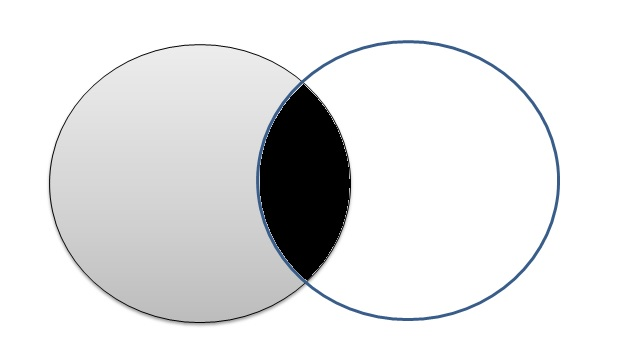
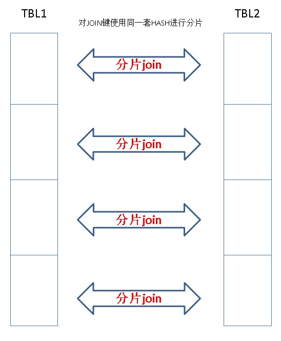

## PostgreSQL dblink异步调用实现 并行hash分片JOIN - 含数据交、并、差 提速案例 - 含dblink VS pg 11 parallel hash join VS pg 11 智能分区JOIN    
                                                                   
### 作者                                                                   
digoal                                                                   
                                                                   
### 日期                                                                   
2018-02-01                                                                 
                                                                   
### 标签                                                                   
PostgreSQL , 并行哈希join , parall hash join , dblink , 异步调用 , hash          
                                                                   
----                                                                   
                                                                   
## 背景       
数据交、并、差是分析型场景常见的需求。例如用来筛选目标用户、店铺等。    
    
    
    
PostgreSQL中交、并、差可以使用SQL语法来实现（union , union all , except , intersect）。其中只有union all是不去重的，其他都会去重。    
    
例子    
    
```    
select generate_series(1,10) except select generate_series(5,12);    
    
select generate_series(1,10) union select generate_series(5,12);    
    
select generate_series(1,10) union all select generate_series(5,12);    
    
select generate_series(1,10) intersect select generate_series(5,12);    
```    
    
当数据量非常庞大时，求交集、差集的话这种方法的效果可能会不够理想。    
    
那么有什么好方法呢？    
    
1、我们自己对数据进行hash切片，然后使用dblink的异步调用接口，一对一的并行操作（求交、差）。    
    
    
    
2、PostgreSQL 11 已经支持了parallel hash join，可以解决大数据量求交、差的性能问题。    
    
[《PostgreSQL 11 preview - parallel hash join(并行哈希JOIN) 性能极大提升》](../201802/20180201_01.md)      
    
## 原生求交、差性能    
测试结构和数据  
  
```  
postgres=# create table tbl(id int, c1 int);  
CREATE TABLE  
postgres=# insert into tbl select generate_series(1,10000000), random()*99;  
INSERT 0 10000000  
```  
    
1、1千万 交 1千万    
    
耗时，31.7秒。    
    
```    
postgres=# explain analyze select * from tbl intersect select * from tbl;    
                                                                      QUERY PLAN                                                                          
------------------------------------------------------------------------------------------------------------------------------------------------------    
 HashSetOp Intersect  (cost=0.00..413495.25 rows=9999977 width=12) (actual time=27730.818..30412.898 rows=10000000 loops=1)    
   ->  Append  (cost=0.00..313495.48 rows=19999954 width=12) (actual time=0.402..18889.746 rows=20000000 loops=1)    
         ->  Subquery Scan on "*SELECT* 1"  (cost=0.00..156747.74 rows=9999977 width=12) (actual time=0.401..7744.308 rows=10000000 loops=1)    
               ->  Gather  (cost=0.00..56747.97 rows=9999977 width=8) (actual time=0.397..5947.082 rows=10000000 loops=1)    
                     Workers Planned: 8    
                     Workers Launched: 8    
                     ->  Parallel Seq Scan on tbl  (cost=0.00..56747.97 rows=1249997 width=8) (actual time=0.015..248.653 rows=1111111 loops=9)    
         ->  Subquery Scan on "*SELECT* 2"  (cost=0.00..156747.74 rows=9999977 width=12) (actual time=0.329..8366.856 rows=10000000 loops=1)    
               ->  Gather  (cost=0.00..56747.97 rows=9999977 width=8) (actual time=0.326..6567.651 rows=10000000 loops=1)    
                     Workers Planned: 8    
                     Workers Launched: 8    
                     ->  Parallel Seq Scan on tbl tbl_1  (cost=0.00..56747.97 rows=1249997 width=8) (actual time=0.013..195.661 rows=1111111 loops=9)    
 Planning time: 0.098 ms    
 Execution time: 31691.115 ms    
(14 rows)    
```    
    
2、1千万 差 1千万    
    
耗时，30秒。    
    
```    
postgres=# explain analyze select * from tbl except select * from tbl;    
                                                                      QUERY PLAN                                                                          
------------------------------------------------------------------------------------------------------------------------------------------------------    
 HashSetOp Except  (cost=0.00..413495.25 rows=9999977 width=12) (actual time=30021.111..30021.111 rows=0 loops=1)    
   ->  Append  (cost=0.00..313495.48 rows=19999954 width=12) (actual time=0.415..20454.584 rows=20000000 loops=1)    
         ->  Subquery Scan on "*SELECT* 1"  (cost=0.00..156747.74 rows=9999977 width=12) (actual time=0.414..8500.176 rows=10000000 loops=1)    
               ->  Gather  (cost=0.00..56747.97 rows=9999977 width=8) (actual time=0.409..6696.932 rows=10000000 loops=1)    
                     Workers Planned: 8    
                     Workers Launched: 8    
                     ->  Parallel Seq Scan on tbl  (cost=0.00..56747.97 rows=1249997 width=8) (actual time=0.019..233.999 rows=1111111 loops=9)    
         ->  Subquery Scan on "*SELECT* 2"  (cost=0.00..156747.74 rows=9999977 width=12) (actual time=0.341..9162.134 rows=10000000 loops=1)    
               ->  Gather  (cost=0.00..56747.97 rows=9999977 width=8) (actual time=0.337..7358.837 rows=10000000 loops=1)    
                     Workers Planned: 8    
                     Workers Launched: 8    
                     ->  Parallel Seq Scan on tbl tbl_1  (cost=0.00..56747.97 rows=1249997 width=8) (actual time=0.015..196.848 rows=1111111 loops=9)    
 Planning time: 0.080 ms    
 Execution time: 30358.560 ms    
(14 rows)    
```    
    
    
## 优化手段1 - 使用hash切片，然后使用dblink的异步调用接口，求交、差性能    
    
dblink异步调用的例子，参考    
    
[《惊天性能！单RDS PostgreSQL实例 支撑 2000亿 - 实时标签透视案例》](../201712/20171223_01.md)      
     
[《阿里云RDS PostgreSQL OSS 外部表 - (dblink异步调用封装)并行写提速案例》](../201709/20170906_01.md)      
    
这个方法纯属个人高级玩法。建议咱们还是直接用PG 11。    
    
参与计算相交、差的字段中的任意一个或多个，作为HASH切片字段即可。PostgreSQL内置了好多类型转HASH值得到函数：    
    
```    
postgres=# \df *.hash*    
                                    List of functions    
   Schema   |         Name          | Result data type |   Argument data types    | Type     
------------+-----------------------+------------------+--------------------------+------    
 pg_catalog | hash_aclitem          | integer          | aclitem                  | func    
 pg_catalog | hash_aclitem_extended | bigint           | aclitem, bigint          | func    
 pg_catalog | hash_array            | integer          | anyarray                 | func    
 pg_catalog | hash_array_extended   | bigint           | anyarray, bigint         | func    
 pg_catalog | hash_numeric          | integer          | numeric                  | func    
 pg_catalog | hash_numeric_extended | bigint           | numeric, bigint          | func    
 pg_catalog | hash_range            | integer          | anyrange                 | func    
 pg_catalog | hash_range_extended   | bigint           | anyrange, bigint         | func    
 pg_catalog | hashbpchar            | integer          | character                | func    
 pg_catalog | hashbpcharextended    | bigint           | character, bigint        | func    
 pg_catalog | hashchar              | integer          | "char"                   | func    
 pg_catalog | hashcharextended      | bigint           | "char", bigint           | func    
 pg_catalog | hashenum              | integer          | anyenum                  | func    
 pg_catalog | hashenumextended      | bigint           | anyenum, bigint          | func    
 pg_catalog | hashfloat4            | integer          | real                     | func    
 pg_catalog | hashfloat4extended    | bigint           | real, bigint             | func    
 pg_catalog | hashfloat8            | integer          | double precision         | func    
 pg_catalog | hashfloat8extended    | bigint           | double precision, bigint | func    
 pg_catalog | hashhandler           | index_am_handler | internal                 | func    
 pg_catalog | hashinet              | integer          | inet                     | func    
 pg_catalog | hashinetextended      | bigint           | inet, bigint             | func    
 pg_catalog | hashint2              | integer          | smallint                 | func    
 pg_catalog | hashint2extended      | bigint           | smallint, bigint         | func    
 pg_catalog | hashint4              | integer          | integer                  | func    
 pg_catalog | hashint4extended      | bigint           | integer, bigint          | func    
 pg_catalog | hashint8              | integer          | bigint                   | func    
 pg_catalog | hashint8extended      | bigint           | bigint, bigint           | func    
 pg_catalog | hashmacaddr           | integer          | macaddr                  | func    
 pg_catalog | hashmacaddr8          | integer          | macaddr8                 | func    
 pg_catalog | hashmacaddr8extended  | bigint           | macaddr8, bigint         | func    
 pg_catalog | hashmacaddrextended   | bigint           | macaddr, bigint          | func    
 pg_catalog | hashname              | integer          | name                     | func    
 pg_catalog | hashnameextended      | bigint           | name, bigint             | func    
 pg_catalog | hashoid               | integer          | oid                      | func    
 pg_catalog | hashoidextended       | bigint           | oid, bigint              | func    
 pg_catalog | hashoidvector         | integer          | oidvector                | func    
 pg_catalog | hashoidvectorextended | bigint           | oidvector, bigint        | func    
 pg_catalog | hashtext              | integer          | text                     | func    
 pg_catalog | hashtextextended      | bigint           | text, bigint             | func    
 pg_catalog | hashvarlena           | integer          | internal                 | func    
 pg_catalog | hashvarlenaextended   | bigint           | internal, bigint         | func    
(41 rows)    
```    
    
首先看看切成小片后，求交、差执行时间需要多久：    
    
不开并行，切成48份，每份的intersect时间，大概是1.9秒。    
    
```    
postgres=# explain analyze select t1.* from tbl t1 where mod(abs(hashint4(id)), 48)=0 intersect select t1.* from tbl t1 where mod(abs(hashint4(id)), 48)=0;    
                                                               QUERY PLAN                                                                   
----------------------------------------------------------------------------------------------------------------------------------------    
 HashSetOp Intersect  (cost=0.00..489995.08 rows=50000 width=12) (actual time=1822.887..1867.381 rows=208902 loops=1)    
   ->  Append  (cost=0.00..489495.08 rows=100000 width=12) (actual time=0.021..1679.633 rows=417804 loops=1)    
         ->  Subquery Scan on "*SELECT* 1"  (cost=0.00..244747.54 rows=50000 width=12) (actual time=0.020..811.669 rows=208902 loops=1)    
               ->  Seq Scan on tbl t1  (cost=0.00..244247.54 rows=50000 width=8) (actual time=0.019..774.864 rows=208902 loops=1)    
                     Filter: (mod(abs(hashint4(id)), 48) = 0)    
                     Rows Removed by Filter: 9791098    
         ->  Subquery Scan on "*SELECT* 2"  (cost=0.00..244747.54 rows=50000 width=12) (actual time=0.027..807.215 rows=208902 loops=1)    
               ->  Seq Scan on tbl t1_1  (cost=0.00..244247.54 rows=50000 width=8) (actual time=0.026..770.958 rows=208902 loops=1)    
                     Filter: (mod(abs(hashint4(id)), 48) = 0)    
                     Rows Removed by Filter: 9791098    
 Planning time: 0.116 ms    
 Execution time: 1887.638 ms    
(12 rows)    
```    
    
也就是说，开48个并行切片的话，最理想的性能是1.9秒。    
      
#### 注意  
因为这里面的HASH分片是扫全表得到的，所以开的并发越多，扫描次数越多。最好是扫一次，并均分到N个临时空间，然后再从临时空间中扫，这样就只需要扫一遍。当然会增加复杂度，如果表不大，实际上多扫几次也无所谓。     
    
### hash并行切片+异步dblink    
    
1、创建生成dblink连接的函数，重复创建不报错。      
      
```      
create or replace function conn(      
  name,   -- dblink名字      
  text    -- 连接串,URL      
) returns void as $$        
declare        
begin        
  perform dblink_connect($1, $2);       
  return;        
exception when others then        
  return;        
end;        
$$ language plpgsql strict;        
```      
    
2、创建一个函数，用于跑并行求交    
    
```    
create or replace function get_intersect(    
  conn text,         -- 连接串    
  OUT id int,    
  OUT c1 int    
) returns setof record as $$       
declare      
begin      
for i in 0..47 loop       
  perform conn('link'||i,  conn);       
  perform 1 from dblink_get_result('link'||i) as t(id int, c1 int);      
  perform dblink_send_query('link'||i, format('select * from tbl t1 where mod(abs(hashint4(id)), 48)=%s intersect select * from tbl t1 where mod(abs(hashint4(id)), 48)=%s', i, i));      
end loop;      
      
for i in 0..47 loop      
  return query SELECT * FROM dblink_get_result('link'||i) as t(id int, c1 int);      
end loop;      
end;      
$$ language plpgsql strict;      
```    
    
使用这个方法，可以看到执行时间大概3秒。但是耗费了很多时间在将1000万条记录从所有的远端返回给调用端。总共差不多8秒。    
    
如果改成返回游标，响应速度就快得不得了了，比如在图计算中，用游标流式返回：  
  
[《金融风控、公安刑侦、社会关系、人脉分析等需求分析与数据库实现 - PostgreSQL图数据库场景应用》](../201612/20161213_01.md)    
    
```    
create or replace function get_intersect1()   
  returns setof refcursor as $$       
declare   
  ref refcursor[];    
  res refcursor;  
begin      
for i in 0..47 loop       
  ref[i] := 'cur'||i;  
  res := ref[i];  
  open res for execute format('select * from tbl t1 where mod(abs(hashint4(id)), 48)=%s intersect select * from tbl t1 where mod(abs(hashint4(id)), 48)=%s', i, i);    
  return next res;  
end loop;      
  return;    
end;      
$$ language plpgsql strict;      
```    
    
用法    
    
```    
postgres=# begin;  
BEGIN  
postgres=# select * from get_intersect1();  
 get_intersect1   
----------------  
 cur0  
 cur1  
 cur2  
 cur3  
 cur4  
 cur5  
 cur6  
 cur7  
 cur8  
 cur9  
 cur10  
 cur11  
 cur12  
 cur13  
 cur14  
 cur15  
 cur16  
 cur17  
 cur18  
 cur19  
 cur20  
 cur21  
 cur22  
 cur23  
 cur24  
 cur25  
 cur26  
 cur27  
 cur28  
 cur29  
 cur30  
 cur31  
 cur32  
 cur33  
 cur34  
 cur35  
 cur36  
 cur37  
 cur38  
 cur39  
 cur40  
 cur41  
 cur42  
 cur43  
 cur44  
 cur45  
 cur46  
 cur47  
(48 rows)  
  
Time: 46.471 ms  
  
-- 第一页比较慢  
  
postgres=# fetch 10 from cur1;  
   id    | c1   
---------+----  
 3591658 | 70  
 6100015 | 17  
 3222328 | 90  
 5500150 | 23  
 9087335 | 45  
 2463228 | 86  
  870261 | 51  
 9276428 | 85  
 7672240 | 32  
 6828314 | 41  
(10 rows)  
  
Time: 1645.906 ms (00:01.646)  
  
-- 后面就飞快了。  
  
postgres=# fetch 10 from cur1;  
   id    | c1   
---------+----  
 7335851 |  5  
 8007430 | 10  
 6230301 | 27  
 9111491 | 91  
 1400805 | 65  
 3651088 | 33  
 3292697 | 65  
 1431682 | 66  
 2959698 | 66  
 4580225 | 39  
(10 rows)  
  
Time: 0.187 ms  
```    
    
是不是飞快了呢，使用游标，从用户发出请求，到获取数据，大概的延迟是1.7秒。.    
    
求差与之类似，只是改一下SQL。      
    
```    
create or replace function get_except1()   
  returns setof refcursor as $$       
declare   
  ref refcursor[];    
  res refcursor;  
begin      
for i in 0..47 loop       
  ref[i] := 'cur'||i;  
  res := ref[i];  
  open res for execute format('select * from tbl t1 where mod(abs(hashint4(id)), 48)=%s except select * from tbl t1 where mod(abs(hashint4(id)), 48)=%s', i, i);    
  return next res;  
end loop;      
  return;    
end;      
$$ language plpgsql strict;     
```    
    
```    
postgres=# begin;  
BEGIN  
Time: 0.169 ms  
postgres=# select * from get_except1();  
 get_except1   
-------------  
 cur0  
 cur1  
 ..........  
 cur44  
 cur45  
 cur46  
 cur47  
(48 rows)  
  
Time: 46.482 ms  
  
postgres=# fetch 10 from cur1;  
 id | c1   
----+----  
(0 rows)  
  
Time: 1681.922 ms (00:01.682)  
```    
    
## 优化手段2 - PostgreSQL 11 求交、差性能    
使用PostgreSQL 11，JOIN的手法来求交、差。语义相同。    
    
1、求交    
    
```    
select * from tbl intersect select * from tbl;    
```    
    
相当于    
    
```    
select t1.* from tbl t1 join tbl t2 on (t1.id=t2.id and t1.c1=t2.c1);  -- 所有参与求交的字段都加到JOIN ON里面    
```    
    
2、求差    
    
```    
select * from tbl except select * from tbl;    
```    
    
相当于    
    
```    
select * from tbl t1 where not exists     
  ( select 1 from      
      (select t1.id,t1.c1 from tbl t1 join tbl t2 on (t1.id=t2.id and t1.c1=t2.c1) ) t   -- 所有参与求交的字段都加到JOIN ON里面    
    where t.id=t1.id and t.c1=t1.c1    
  );    
```    
    
### PostgreSQL 11 求交、差性能如下    
    
1、求交集，3.3秒。    
    
```    
postgres=# explain analyze select t1.* from tbl t1 join tbl t2 on (t1.id = t2.id and t1.c1 = t2.c1);    
                                                                QUERY PLAN                                                                     
-------------------------------------------------------------------------------------------------------------------------------------------    
 Gather  (cost=52060.48..101778.20 rows=100921 width=8) (actual time=407.118..2395.421 rows=10000000 loops=1)    
   Workers Planned: 32    
   Workers Launched: 32    
   ->  Parallel Hash Join  (cost=52060.48..101778.20 rows=3154 width=8) (actual time=378.294..691.692 rows=303030 loops=33)    
         Hash Cond: ((t1.id = t2.id) AND (t1.c1 = t2.c1))    
         ->  Parallel Seq Scan on tbl t1  (cost=0.00..47372.99 rows=312499 width=8) (actual time=0.014..41.780 rows=303030 loops=33)    
         ->  Parallel Hash  (cost=47372.99..47372.99 rows=312499 width=8) (actual time=374.931..374.931 rows=303030 loops=33)    
               Buckets: 16777216  Batches: 1  Memory Usage: 522848kB    
               ->  Parallel Seq Scan on tbl t2  (cost=0.00..47372.99 rows=312499 width=8) (actual time=0.022..48.013 rows=303030 loops=33)    
 Planning time: 0.137 ms    
 Execution time: 3316.010 ms    
(11 rows)    
```    
    
2、求差集，1.9秒    
    
```    
postgres=# explain analyze select * from tbl t1 where not exists     
  ( select 1 from      
      (select t1.id,t1.c1 from tbl t1 join tbl t2 on (t1.id=t2.id and t1.c1=t2.c1) ) t   -- 所有参与求交的字段都加到JOIN ON里面    
    where t.id=t1.id and t.c1=t1.c1    
  );    
                                                                      QUERY PLAN                                                                           
-------------------------------------------------------------------------------------------------------------------------------------------------------    
 Gather  (cost=101825.51..153939.67 rows=9899056 width=8) (actual time=1557.867..1557.867 rows=0 loops=1)    
   Workers Planned: 32    
   Workers Launched: 32    
   ->  Parallel Hash Anti Join  (cost=101825.51..153939.67 rows=309346 width=8) (actual time=1495.529..1495.529 rows=0 loops=33)    
         Hash Cond: ((t1.id = t1_1.id) AND (t1.c1 = t1_1.c1))    
         ->  Parallel Seq Scan on tbl t1  (cost=0.00..47372.99 rows=312499 width=8) (actual time=0.013..44.749 rows=303030 loops=33)    
         ->  Parallel Hash  (cost=101778.20..101778.20 rows=3154 width=8) (actual time=1260.916..1260.916 rows=303030 loops=33)    
               Buckets: 16777216 (originally 131072)  Batches: 1 (originally 1)  Memory Usage: 652800kB    
               ->  Parallel Hash Join  (cost=52060.48..101778.20 rows=3154 width=8) (actual time=387.651..740.551 rows=303030 loops=33)    
                     Hash Cond: ((t1_1.id = t2.id) AND (t1_1.c1 = t2.c1))    
                     ->  Parallel Seq Scan on tbl t1_1  (cost=0.00..47372.99 rows=312499 width=8) (actual time=0.013..46.111 rows=303030 loops=33)    
                     ->  Parallel Hash  (cost=47372.99..47372.99 rows=312499 width=8) (actual time=384.666..384.666 rows=303030 loops=33)    
                           Buckets: 16777216  Batches: 1  Memory Usage: 522784kB    
                           ->  Parallel Seq Scan on tbl t2  (cost=0.00..47372.99 rows=312499 width=8) (actual time=0.024..47.326 rows=303030 loops=33)    
 Planning time: 0.251 ms    
 Execution time: 1939.745 ms    
(16 rows)    
```    
  
## 附加 - 分表+DBLINK异步并行 VS PG 11 HASH JOIN并行
1、创建生成dblink连接的函数，重复创建不报错。  
  
```  
create or replace function conn(        
  name,   -- dblink名字        
  text    -- 连接串,URL        
) returns void as $$          
declare          
begin          
  perform dblink_connect($1, $2);         
  return;          
exception when others then          
  return;          
end;          
$$ language plpgsql strict;      
```  
  
2、生成10亿条数据，并按哈希分成128份（如果是多张表的话，请都按被JOIN的字段进行HASH分区）。  
  
为了测试方便，这里将数据按同样的RANGE分成了128份，实际上使用HASH效果一样。  
  
```  
create unlogged table a(id int, c1 int);  
  
do language plpgsql $$  
declare  
begin  
  for i in 0..127 loop  
    execute format('create unlogged table a%s (like a)', i);  
  end loop;  
end;  
$$;  
  
-- 写入10亿测试数据  
  
do language plpgsql $$  
declare  
begin  
  for i in 0..127 loop         
    perform conn('link'||i,  'hostaddr=127.0.0.1 port=9999 user=postgres dbname=postgres');         
    perform dblink_send_query('link'||i, format('insert into a%s select generate_series(%s, %s), random()*99', i, i*7812500+1, (i+1)*7812500));        
  end loop;     
end;  
$$;  
```  
  
3、分片并行JOIN的函数如下  
  
```  
create or replace function get_cnt() returns setof record as $$  
declare  
begin  
  for i in 0..127 loop         
    perform conn('link'||i,  'hostaddr=127.0.0.1 port=9999 user=postgres dbname=postgres');         
    perform 1 from dblink_get_result('link'||i) as t(c1 int, cnt int8);        
    perform dblink_send_query('link'||i, format('select t1.c1,count(*) from a%s t1 join a%s t2 using (id) group by t1.c1', i, i));        
  end loop;     
  for i in 0..127 loop  
    return query select * from dblink_get_result('link'||i) as t(c1 int, cnt int8);  
  end loop;  
end;  
$$ language plpgsql strict;  
```  
  
使用以上函数将采用DBLINK异步调用并行JOIN，然后我们将结果再合并一遍。  
  
耗时：28秒。  
  
  
  
```  
set work_mem ='1GB';  
select c1, sum(cnt) from get_cnt() as t(c1 int, cnt int8) group by c1;  
  
  
postgres=# select c1, sum(cnt) from get_cnt() as t(c1 int, cnt int8) group by c1;  
 c1 |   sum      
----+----------  
 87 | 10100809  
 71 | 10101080  
 68 | 10099606  
 51 | 10099793  
 70 | 10109225  
 80 | 10100325  
 52 | 10099895  
 84 | 10100478  
 92 | 10097575  
 69 | 10107443  
 60 | 10097840  
 97 | 10096389  
 22 | 10100561  
 59 | 10100344  
 65 | 10103391  
 98 | 10099394  
 73 | 10092200  
 44 | 10103140  
 11 | 10103393  
 42 | 10099439  
 88 | 10099237  
 82 | 10099155  
 40 | 10096921  
 43 | 10104420  
  9 | 10098674  
 15 | 10101089  
 79 | 10098950  
 48 | 10102135  
 26 | 10101603  
 85 | 10095875  
 72 | 10099213  
 95 | 10098356  
 57 | 10104362  
 81 | 10110911  
 19 | 10099394  
 61 | 10098885  
 77 | 10095828  
 30 | 10098553  
 21 | 10099126  
  3 | 10100072  
 17 | 10098163  
 28 | 10097030  
 37 | 10105601  
  5 | 10103695  
 56 | 10097786  
 91 | 10099258  
 74 | 10100289  
 29 | 10100451  
 54 | 10094753  
  4 | 10106395  
 34 | 10098193  
  0 |  5051349  
 96 | 10104673  
 83 | 10100830  
 67 | 10102245  
 63 | 10100960  
 10 | 10102902  
 90 | 10100002  
 35 | 10104661  
 45 | 10101868  
  6 | 10104899  
 86 | 10101989  
 39 | 10100000  
 93 | 10105890  
 89 | 10100522  
 36 | 10109730  
 31 | 10102795  
 50 | 10096268  
 14 | 10099182  
 66 | 10101121  
 13 | 10099546  
  2 | 10103957  
 16 | 10100221  
 62 | 10102741  
 75 | 10104968  
 99 |  5048952  
 41 | 10102728  
 46 | 10098892  
 32 | 10102419  
 53 | 10097987  
  7 | 10102711  
 38 | 10105077  
 12 | 10104542  
 78 | 10100782  
 24 | 10100036  
 25 | 10100035  
 94 | 10099586  
 49 | 10099737  
 47 | 10102668  
 20 | 10101551  
 33 | 10099637  
  1 | 10097499  
 76 | 10102961  
 18 | 10106307  
 64 | 10104492  
 55 | 10100018  
 27 | 10101503  
 23 | 10098148  
 58 | 10098593  
  8 | 10103127  
(100 rows)  
  
Time: 27911.868 ms (00:27.912)  
```  
  
4、PG 11 并行HASH JOIN（10亿不过滤 JOIN 10亿）  
  
耗时：109秒。  
  
```  
create unlogged table b (like a );

insert into b select * from a;

postgres=# explain analyze select t1.c1,count(*) from b t1 join b t2 using (id) group by t1.c1;  
                                                                              QUERY PLAN                                                                                
----------------------------------------------------------------------------------------------------------------------------------------------------------------------  
 Finalize GroupAggregate  (cost=433359296530.36..433359296628.36 rows=200 width=12) (actual time=106183.949..106186.496 rows=100 loops=1)  
   Group Key: t1.c1  
   ->  Sort  (cost=433359296530.36..433359296562.36 rows=12800 width=12) (actual time=106183.905..106185.006 rows=6500 loops=1)  
         Sort Key: t1.c1  
         Sort Method: quicksort  Memory: 497kB  
         ->  Gather  (cost=433359295655.16..433359295657.16 rows=12800 width=12) (actual time=105102.267..106182.433 rows=6500 loops=1)  
               Workers Planned: 64  
               Workers Launched: 64  
               ->  Partial HashAggregate  (cost=433359295655.16..433359295657.16 rows=200 width=12) (actual time=105132.243..105132.331 rows=100 loops=65)  
                     Group Key: t1.c1  
                     ->  Parallel Hash Join  (cost=4837377.52..42734253467.66 rows=78125008437500 width=4) (actual time=47567.418..100415.264 rows=15384615 loops=65)  
                           Hash Cond: (t1.id = t2.id)  
                           ->  Parallel Seq Scan on b t1  (cost=0.00..4581029.01 rows=15625001 width=8) (actual time=0.024..4849.451 rows=15384615 loops=65)  
                           ->  Parallel Hash  (cost=4581029.01..4581029.01 rows=15625001 width=4) (actual time=19059.992..19059.992 rows=15384615 loops=65)  
                                 Buckets: 8388608  Batches: 256  Memory Usage: 219264kB  
                                 ->  Parallel Seq Scan on b t2  (cost=0.00..4581029.01 rows=15625001 width=4) (actual time=0.036..4966.944 rows=15384615 loops=65)  
 Planning time: 0.089 ms  
 Execution time: 123809.025 ms  
(18 rows)  
```  
  
```  
postgres=# select t1.c1,count(*) from b t1 join b t2 using (id) group by t1.c1;  
 c1 |  count     
----+----------  
  0 |  5051349  
  1 | 10097499  
  2 | 10103957  
  3 | 10100072  
  4 | 10106395  
  5 | 10103695  
  6 | 10104899  
  7 | 10102711  
  8 | 10103127  
  9 | 10098674  
 10 | 10102902  
 11 | 10103393  
 12 | 10104542  
 13 | 10099546  
 14 | 10099182  
 15 | 10101089  
 16 | 10100221  
 17 | 10098163  
 18 | 10106307  
 19 | 10099394  
 20 | 10101551  
 21 | 10099126  
 22 | 10100561  
 23 | 10098148  
 24 | 10100036  
 25 | 10100035  
 26 | 10101603  
 27 | 10101503  
 28 | 10097030  
 29 | 10100451  
 30 | 10098553  
 31 | 10102795  
 32 | 10102419  
 33 | 10099637  
 34 | 10098193  
 35 | 10104661  
 36 | 10109730  
 37 | 10105601  
 38 | 10105077  
 39 | 10100000  
 40 | 10096921  
 41 | 10102728  
 42 | 10099439  
 43 | 10104420  
 44 | 10103140  
 45 | 10101868  
 46 | 10098892  
 47 | 10102668  
 48 | 10102135  
 49 | 10099737  
 50 | 10096268  
 51 | 10099793  
 52 | 10099895  
 53 | 10097987  
 54 | 10094753  
 55 | 10100018  
 56 | 10097786  
 57 | 10104362  
 58 | 10098593  
 59 | 10100344  
 60 | 10097840  
 61 | 10098885  
 62 | 10102741  
 63 | 10100960  
 64 | 10104492  
 65 | 10103391  
 66 | 10101121  
 67 | 10102245  
 68 | 10099606  
 69 | 10107443  
 70 | 10109225  
 71 | 10101080  
 72 | 10099213  
 73 | 10092200  
 74 | 10100289  
 75 | 10104968  
 76 | 10102961  
 77 | 10095828  
 78 | 10100782  
 79 | 10098950  
 80 | 10100325  
 81 | 10110911  
 82 | 10099155  
 83 | 10100830  
 84 | 10100478  
 85 | 10095875  
 86 | 10101989  
 87 | 10100809  
 88 | 10099237  
 89 | 10100522  
 90 | 10100002  
 91 | 10099258  
 92 | 10097575  
 93 | 10105890  
 94 | 10099586  
 95 | 10098356  
 96 | 10104673  
 97 | 10096389  
 98 | 10099394  
 99 |  5048952  
(100 rows)  
  
Time: 108907.886 ms (01:48.908)  
```  
  
  
执行过程与效果类似于PostgreSQL 11的分区表智能并行join，也类似Greenplum的多分区并行JOIN。  
  
并行聚合的原理可以参考一下文章。  
  
[《PostgreSQL 11 preview - 分区表智能并行JOIN (已类似MPP架构，性能暴增)》](../201802/20180202_02.md)    
  
[《HybridDB PostgreSQL "Sort、Group、distinct 聚合、JOIN" 不惧怕数据倾斜的黑科技和原理 - 多阶段聚合》](../201711/20171123_01.md)    
  
[《PostgreSQL 10 自定义并行计算聚合函数的原理与实践 - (含array_agg合并多个数组为单个一元数组的例子)》](../201801/20180119_04.md)    
  
[《Postgres-XC customized aggregate introduction》](../201305/20130502_01.md)    
  
[《PostgreSQL aggregate function customize》](../201212/20121218_02.md)    
  
5、PostgreSQL 11 智能分区表并行JOIN，耗时57秒。   
  
```
create unlogged table c(like a) partition by range(id);  

do language plpgsql $$  
declare  
begin  
  for i in 0..127 loop  
    execute format('create unlogged table c%s partition of c for values from (%s) to (%s)', i, i*7812500+1, (i+1)*7812500+1);  
  end loop;  
end;  
$$;  

insert into c select * from b;

set enable_parallel_append =on;
set enable_partition_wise_join =on;
set min_parallel_table_scan_size =0;
set min_parallel_index_scan_size =0;
set parallel_tuple_cost =0;
set parallel_setup_cost =0;
set work_mem ='512MB';
set max_parallel_workers_per_gather =64;

alter table c1 set (parallel_workers =128);

explain select t1.c1,count(*) from c t1 join c t2 using (id) group by t1.c1; 


postgres=# explain select t1.c1,count(*) from c t1 join c t2 using (id) group by t1.c1; 
                                                      QUERY PLAN                                                       
-----------------------------------------------------------------------------------------------------------------------
 Finalize GroupAggregate  (cost=16632154923.74..16632155021.74 rows=200 width=12)
   Group Key: t1.c1
   ->  Sort  (cost=16632154923.74..16632154955.74 rows=12800 width=12)
         Sort Key: t1.c1
         ->  Gather  (cost=16632154048.53..16632154050.53 rows=12800 width=12)
               Workers Planned: 64
               ->  Partial HashAggregate  (cost=16632154048.53..16632154050.53 rows=200 width=12)
                     Group Key: t1.c1
                     ->  Parallel Append  (cost=52147.33..13580322797.97 rows=610366250112 width=4)
                           ->  Parallel Hash Join  (cost=52147.33..106910564.12 rows=30518312504 width=4)
                                 Hash Cond: (t1.id = t2.id)
                                 ->  Parallel Seq Scan on c0 t1  (cost=0.00..42381.59 rows=781259 width=8)
                                 ->  Parallel Hash  (cost=42381.59..42381.59 rows=781259 width=4)
                                       ->  Parallel Seq Scan on c0 t2  (cost=0.00..42381.59 rows=781259 width=4)
                           ->  Parallel Hash Join  (cost=52147.33..106910564.12 rows=30518312504 width=4)
                                 Hash Cond: (t1_2.id = t2_2.id)
                                 ->  Parallel Seq Scan on c2 t1_2  (cost=0.00..42381.59 rows=781259 width=8)
                                 ->  Parallel Hash  (cost=42381.59..42381.59 rows=781259 width=4)
                                       ->  Parallel Seq Scan on c2 t2_2  (cost=0.00..42381.59 rows=781259 width=4)
                           ->  Parallel Hash Join  (cost=52147.33..106910564.12 rows=30518312504 width=4)
                                 Hash Cond: (t1_3.id = t2_3.id)
                                 ->  Parallel Seq Scan on c3 t1_3  (cost=0.00..42381.59 rows=781259 width=8)
                                 ->  Parallel Hash  (cost=42381.59..42381.59 rows=781259 width=4)
                                       ->  Parallel Seq Scan on c3 t2_3  (cost=0.00..42381.59 rows=781259 width=4)
.....................
                           ->  Parallel Hash Join  (cost=52147.33..106910564.12 rows=30518312504 width=4)
                                 Hash Cond: (t1_126.id = t2_126.id)
                                 ->  Parallel Seq Scan on c126 t1_126  (cost=0.00..42381.59 rows=781259 width=8)
                                 ->  Parallel Hash  (cost=42381.59..42381.59 rows=781259 width=4)
                                       ->  Parallel Seq Scan on c126 t2_126  (cost=0.00..42381.59 rows=781259 width=4)
                           ->  Parallel Hash Join  (cost=52147.33..106910564.12 rows=30518312504 width=4)
                                 Hash Cond: (t1_127.id = t2_127.id)
                                 ->  Parallel Seq Scan on c127 t1_127  (cost=0.00..42381.59 rows=781259 width=8)
                                 ->  Parallel Hash  (cost=42381.59..42381.59 rows=781259 width=4)
                                       ->  Parallel Seq Scan on c127 t2_127  (cost=0.00..42381.59 rows=781259 width=4)
                           ->  Parallel Hash Join  (cost=37315.62..2681155.31 rows=4768486329 width=4)
                                 Hash Cond: (t1_1.id = t2_1.id)
                                 ->  Parallel Seq Scan on c1 t1_1  (cost=0.00..35789.72 rows=122072 width=8)
                                 ->  Parallel Hash  (cost=35789.72..35789.72 rows=122072 width=4)
                                       ->  Parallel Seq Scan on c1 t2_1  (cost=0.00..35789.72 rows=122072 width=4)
(649 rows)

Time: 11.169 ms


postgres=# select t1.c1,count(*) from c t1 join c t2 using (id) group by t1.c1; 
 c1 |  count   
----+----------
  0 |  5051349
  1 | 10097499
  2 | 10103957
  3 | 10100072
  4 | 10106395
  5 | 10103695
  6 | 10104899
.............
 94 | 10099586
 95 | 10098356
 96 | 10104673
 97 | 10096389
 98 | 10099394
 99 |  5048952
(100 rows)

Time: 56974.933 ms (00:56.975)
```
    
## 小结    
    
### 1000万 与 1000万 求交、差的性能指标：    
    
方法 | 求交 | 求差    
---|---|---    
原生intersect, except | 31.7秒 | 30秒     
自定义切片+dblink异步调用 | 1.7秒 | 1.7秒    
PostgreSQL 11 并行hashjoin | 3.3秒 | 1.9秒    
    
通过改写SQL，PostgreSQL 11可以利用并行计算，更好的支撑求数据交、差的性能。(但是需要注意，NULL值在except, intersect中会视为相同，而join时取等的话，是匹配不到的。这个特别需要注意。（所以语义上不完全一样）)    
    
```    
postgres=# select 1,null except select 1,null;    
 ?column? | ?column?     
----------+----------    
(0 rows)    
    
postgres=# select 1,null intersect select 1,null;    
 ?column? | ?column?     
----------+----------    
        1 |     
(1 row)    
```    
    
如果要让语义完全一样，可以用这种写法，但是就用不到hashjoin了。    
    
```    
即:  等号改成 is not distinct from    
    
select t1.* from tbl t1 join tbl t2 on ((t1.id is not distinct from t2.id) and (t1.c1 is not distinct from t2.c1));    
```    
     
而使用dblink异步的方式，需要注意:     
     
因为我们使用dblink的方法进行HASH分片是扫全表得到的，所以开的并发越多，扫描次数越多。最好是扫一次，并均分到N个临时空间，然后再从临时空间中扫，这样就只需要扫一遍。当然会增加复杂度，如果表不大，实际上多扫几次也无所谓。     
    
### 10亿 一对一JOIN  10亿（不带过滤条件）   
  
方法 | 耗时
---|---
dblink + 分区并行JOIN | 28 秒
PostgreSQL 11 分区并行JOIN | 57 秒
PostgreSQL 11 单表HASH并行JOIN | 109 秒
  
## 参考    
[《惊天性能！单RDS PostgreSQL实例 支撑 2000亿 - 实时标签透视案例》](../201712/20171223_01.md)      
    
[《PostgreSQL 11 preview - parallel hash join(并行哈希JOIN) 性能极大提升》](../201802/20180201_01.md)      
    
https://www.postgresql.org/docs/10/static/dblink.html     
     
[《阿里云RDS PostgreSQL OSS 外部表 - (dblink异步调用封装)并行写提速案例》](../201709/20170906_01.md)     
  
[《金融风控、公安刑侦、社会关系、人脉分析等需求分析与数据库实现 - PostgreSQL图数据库场景应用》](../201612/20161213_01.md)    
  
[《PostgreSQL 11 preview - parallel hash (含hash JOIN , hash agg等) 性能极大提升》](../201802/20180201_01.md)    
  
<a rel="nofollow" href="http://info.flagcounter.com/h9V1"  ></a>  
  
  
  
  
  
  
## [digoal's 大量PostgreSQL文章入口](https://github.com/digoal/blog/blob/master/README.md "22709685feb7cab07d30f30387f0a9ae")
  
