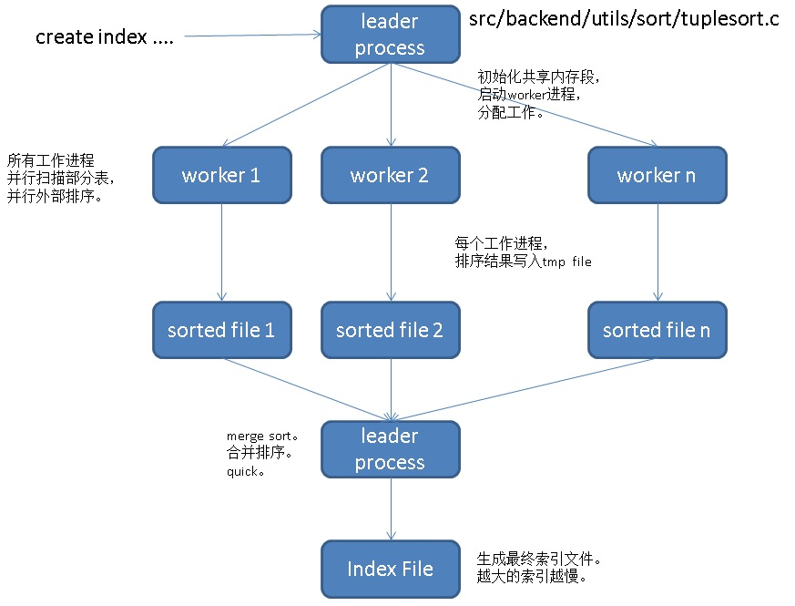

## PostgreSQL 11 preview - 并行排序、并行索引 (性能线性暴增) 单实例100亿TOP-K仅40秒   
     
### 作者      
digoal         
         
### 日期      
2018-02-04      
     
### 标签      
PostgreSQL , 并行排序 , 外排 , merge sort , TOP-K , 并行创建索引 , 分区并行 , ranking , percent , midean , 数据分布      
         
----        
        
## 背景     
在OLAP场景，排序是一个非常重要的功能。也是衡量数据库是否适合OLAP场景的一个重要指标。例如这些场景：  
  
1、求TOP-K，例如在对数据进行分组后，取出每个分组的TOP-K。  
  
2、求中位数，要求对数据排序，并取出处于中间水位的值。  
  
3、数据柱状图，需要对数据进行排序，并按记录均匀分割成若干BUCKET，获得bucket边界。  
  
4、ranking排序，对数据进行排序，取出TOP-K。  
  
5、数据按窗口分组，求数据分布，或groupAGG等。  
  
https://www.postgresql.org/docs/devel/static/functions-window.html   
  
6、海量数据，取percent value，例如每一天的网站访问延迟水位数（99%, 95%, ......）。  
  
7、创建索引(在TP场景，如果数据频繁更新删除，索引可能会逐渐膨胀，PG 11并行创建索引功能推出，索引维护性能杠杠的了(不堵塞DML的语法也支持并行, create index concurrently))。  
  
排序能力真的很重要对吧，怪不得那么多企业参加计算机排序性能大赛呢。  
  
PostgreSQL 11 在排序上有了长足的进步，支持了并行排序。  
  
并行排序, 创建索引流程如下（并行扫描 -> 并行排序(阶段性quicksort+external sort) -> 合并排序并写索引文件），如果是求TOP-K，采用top-n heapsort并且不需要合并落盘的过程，爆快：  
  
  
  
下面有一组测试数据，以及如何操纵并行排序的并行度，以及一些简单的原理介绍。有两个数字值得关注（也说明了PostgreSQL 进步飞速）：  
  
```  
单实例 100亿排序求TOP-K，40秒。  
  
单实例 100亿创建索引，26分钟。  
```  
  
## 环境介绍  
64线程，512G，NVME SSD  
  
CentOS 7.x x64   
  
PostgreSQL 11  
  
一些预设参数，帮助控制并行度。  
  
```  
max_worker_processes = 128  
max_parallel_workers = 64  
max_parallel_workers_per_gather = 64  
max_parallel_maintenance_workers = 64  
  
# 并行建索引使用了external sort，和work_mem关系不大  
#   （当串行排序，如果要使用quick sort的话需要够大的work_mem；  
#     或者使用hash agg , hash join时需要够大的work_mem）。  
work_mem='128MB'   
  
# 至少满足每个worker有最少32MB的可用内存。否则可能并行度会低于预期。  
maintenance_work_mem='16GB'    
```  
  
测试数据量1亿、10亿、100亿。排序字段为INT8类型。  
  
## 准备测试数据  
1、表结构  
  
```  
-- 1亿  
create unlogged table ttt(id int8, info text);  
  
-- 10亿  
create unlogged table t(id int8, info text);  
  
-- 100亿  
create unlogged table tbl(id int8, info text);  
```  
  
2、使用dblink异步调用，并行加载数据。  
  
```  
postgres=# create extension dblink;  
CREATE EXTENSION  
```  
  
3、创建生成dblink连接的函数，重复创建不报错。        
        
```        
create or replace function conn(        
  name,   -- dblink名字        
  text    -- 连接串,URL        
) returns void as $$          
declare          
begin          
  perform dblink_connect($1, $2);         
  return;          
exception when others then          
  return;          
end;          
$$ language plpgsql strict;          
```        
      
4、并行加载1亿    
      
```      
do language plpgsql $$     
declare        
begin        
for i in 0..99 loop         
  perform conn('link'||i,  'hostaddr=127.0.0.1 port=9999 user=postgres dbname=postgres');         
  perform 1 from dblink_get_result('link'||i) as t(id int, c1 int);        
  perform dblink_send_query('link'||i, format('insert into tbl select generate_series(%s::int8, %s::int8), ''test''', i*1000000::int8+1, (i+1)*1000000::int8));        
end loop;           
end;        
$$;        
```      
  
5、并行加载10亿    
      
```      
do language plpgsql $$     
declare        
begin        
for i in 0..99 loop         
  perform conn('link'||i,  'hostaddr=127.0.0.1 port=9999 user=postgres dbname=postgres');         
  perform 1 from dblink_get_result('link'||i) as t(id int, c1 int);        
  perform dblink_send_query('link'||i, format('insert into tbl select generate_series(%s::int8, %s::int8), ''test''', i*10000000::int8+1, (i+1)*10000000::int8));        
end loop;           
end;        
$$;        
```      
  
6、并行加载100亿    
      
```      
do language plpgsql $$     
declare        
begin        
for i in 0..99 loop         
  perform conn('link'||i,  'hostaddr=127.0.0.1 port=9999 user=postgres dbname=postgres');         
  perform 1 from dblink_get_result('link'||i) as t(id int, c1 int);        
  perform dblink_send_query('link'||i, format('insert into tbl select generate_series(%s::int8, %s::int8), ''test''', i*100000000::int8+1, (i+1)*100000000::int8));        
end loop;           
end;        
$$;        
```      
  
## 并行求TOP-K  
### 1、1亿  
  
非并行  
  
```  
postgres=# select * from ttt order by id limit 10;  
 id | info   
----+------  
  1 | test  
  2 | test  
  3 | test  
  4 | test  
  5 | test  
  6 | test  
  7 | test  
  8 | test  
  9 | test  
 10 | test  
(10 rows)  
  
Time: 9374.943 ms (00:09.375)  
```  
  
并行(强制N个并行)  
  
```  
alter table ttt set (parallel_workers =64);  
set min_parallel_index_scan_size =0;  
set min_parallel_table_scan_size =0;  
set parallel_tuple_cost =0;  
set parallel_setup_cost =0;  
  
postgres=# select * from ttt order by id limit 10;  
 id | info   
----+------  
  1 | test  
  2 | test  
  3 | test  
  4 | test  
  5 | test  
  6 | test  
  7 | test  
  8 | test  
  9 | test  
 10 | test  
(10 rows)  
  
Time: 501.723 ms  
```  
  
看一个执行计划，这个不涉及索引落盘，所以不受max_parallel_maintenance_workers参数控制，仅与其他几个并行参数相关。  
  
```  
postgres=# show max_parallel_maintenance_workers ;  
 max_parallel_maintenance_workers   
----------------------------------  
 0  
(1 row)  
  
postgres=# explain select * from ttt order by id limit 10;  
                                        QUERY PLAN                                          
------------------------------------------------------------------------------------------  
 Limit  (cost=589933.02..589933.35 rows=10 width=13)  
   ->  Gather Merge  (cost=589933.02..3855023.18 rows=100000000 width=13)  
         Workers Planned: 64  
         ->  Sort  (cost=589931.06..593837.31 rows=1562500 width=13)  
               Sort Key: id  
               ->  Parallel Seq Scan on ttt  (cost=0.00..556166.00 rows=1562500 width=13)  
(6 rows)  
```  
  
### 2、10亿  
  
非并行  
  
```  
postgres=# select * from t order by id limit 10;  
 id | info   
----+------  
  1 | test  
  2 | test  
  3 | test  
  4 | test  
  5 | test  
  6 | test  
  7 | test  
  8 | test  
  9 | test  
 10 | test  
(10 rows)  
  
Time: 95162.659 ms (01:35.163)  
```  
  
并行(强制N个并行)  
  
```  
alter table t set (parallel_workers =64);  
set min_parallel_index_scan_size =0;  
set min_parallel_table_scan_size =0;  
set parallel_tuple_cost =0;  
set parallel_setup_cost =0;  
  
postgres=# select * from t order by id limit 10;  
 id | info   
----+------  
  1 | test  
  2 | test  
  3 | test  
  4 | test  
  5 | test  
  6 | test  
  7 | test  
  8 | test  
  9 | test  
 10 | test  
(10 rows)  
  
Time: 5112.469 ms (00:05.112)  
```  
  
  
### 3、100亿  
  
非并行  
  
```  
postgres=# select * from tbl order by id limit 10;  
 id | info   
----+------  
  1 | test  
  2 | test  
  3 | test  
  4 | test  
  5 | test  
  6 | test  
  7 | test  
  8 | test  
  9 | test  
 10 | test  
(10 rows)  
  
Time: 1107549.801 ms (18:27.550)  
```  
  
并行(强制N个并行)  
  
```  
alter table tbl set (parallel_workers =64);  
set min_parallel_index_scan_size =0;  
set min_parallel_table_scan_size =0;  
set parallel_tuple_cost =0;  
set parallel_setup_cost =0;  
  
postgres=# select * from tbl order by id limit 10;  
 id | info   
----+------  
  1 | test  
  2 | test  
  3 | test  
  4 | test  
  5 | test  
  6 | test  
  7 | test  
  8 | test  
  9 | test  
 10 | test  
(10 rows)  
  
Time: 40033.507 ms (00:40.034)  
```  
  
## 并行创建索引  
为了保证每个Worker至少有32MB的内存用于并行排序，需要设置足够大的maintenance_work_mem（64个WORKER + 1 leader，至少需要2080MB内存）。  
  
```  
postgres=# select 65*32||' MB';  
 ?column?   
----------  
 2080 MB  
(1 row)  
```  
  
### 1、1亿  
非并行  
  
```  
alter table ttt reset ( parallel_workers );  
set max_parallel_maintenance_workers =0;  
  
postgres=# create index idx_ttt on ttt (id);  
CREATE INDEX  
Time: 26244.362 ms (00:26.244)  
```  
  
并行  
  
```  
alter table ttt set ( parallel_workers=64 );  
set max_parallel_maintenance_workers =64;  
  
postgres=# create index idx_ttt on ttt (id);  
CREATE INDEX  
Time: 15550.082 ms (00:15.550)  
```  
  
### 2、10亿  
非并行  
  
```  
alter table t reset ( parallel_workers );  
set max_parallel_maintenance_workers =0;  
  
postgres=# create index idx_t on t(id);  
CREATE INDEX  
Time: 1442771.066 ms (24:02.771)  
```  
  
并行  
  
```  
alter table t set ( parallel_workers=64 );  
set max_parallel_maintenance_workers =64;  
  
postgres=# create index idx_t on t(id);  
CREATE INDEX  
Time: 160773.885 ms (02:40.774)  
```  
  
### 3、100亿  
非并行  
  
```  
alter table tbl reset ( parallel_workers );  
set max_parallel_maintenance_workers =0;  
  
postgres=# create index idx_tbl on tbl(id);  
CREATE INDEX  
Time: 7456891.022 ms (02:04:16.891)  
```  
  
并行  
  
```  
alter table tbl set ( parallel_workers=64 );  
set max_parallel_maintenance_workers =64;  
  
postgres=# create index idx on tbl(id) ;  
CREATE INDEX  
Time: 1869483.741 ms (31:09.484)  
```  
  
## 附加 - 分区表创建索引  
PostgreSQL对分区表创建索引时，并不是所有分区同时并行开始创建（至少目前没有在内核中实现所有分区同时开始创建索引）。  
  
但是，我们可以通过并行创建索引，控制每个分区的并行度。  
  
```  
create unlogged table p(id int8, info text) partition by hash(id);   
  
CREATE unlogged TABLE p0 PARTITION OF p FOR VALUES WITH (MODULUS 4, REMAINDER 0);    
CREATE unlogged TABLE p1 PARTITION OF p FOR VALUES WITH (MODULUS 4, REMAINDER 1);    
CREATE unlogged TABLE p2 PARTITION OF p FOR VALUES WITH (MODULUS 4, REMAINDER 2);    
CREATE unlogged TABLE p3 PARTITION OF p FOR VALUES WITH (MODULUS 4, REMAINDER 3);    
  
insert into p select generate_series(1,100000000), 'test';  
```  
  
让每个分区以16个并行度并行创建索引。  
  
```  
set max_parallel_maintenance_workers =16;  
alter table p0 set ( parallel_workers=16 );  
alter table p1 set ( parallel_workers=16 );  
alter table p2 set ( parallel_workers=16 );  
alter table p3 set ( parallel_workers=16 );  
  
create index idx_p on p(id);  
CREATE INDEX  
Time: 15786.299 ms (00:15.786)  
```  
  
耗时与单表开64个并行差不多。（为什么不开64个并行，这里主要是因为分了4个分区，单分区数据量已经不大，16个并行度足矣。）  
  
**按照前面的测试，我们将100亿的表，分成100个分区，那么每个分区1亿数据，创建索引应该仅需1555秒(26分钟)。**  
  
## 如何操纵并行排序的并行度  
  
并行排序，仅与这些参数有关：  
  
```  
# 全局可使用WORKER进程数  
max_worker_processes = 128  
  
# 全局可开并行计算的WORKER进程数  
max_parallel_workers = 64  
  
# 单个gather可开并行计算的WORKER进程数  
max_parallel_workers_per_gather = 64  
  
# 并行计算COST计算依赖的几个参数  
set parallel_tuple_cost =0;  
set parallel_setup_cost =0;  
  
# 最小多大的表才会使用并行计算  
set min_parallel_index_scan_size =0;  
set min_parallel_table_scan_size =0;  
  
# 表大小，用于自动计算并行度  
  
# 表上参数，覆盖根据成本模型计算得到的并行度  
  
alter table p1 set ( parallel_workers=16 );  
```  
  
具体并行度算法，参考：  
  
[《PostgreSQL 9.6 并行计算 优化器算法浅析 - 以及如何强制并行度》](../201610/20161002_01.md)    
  
## 如何操纵并行创建索引的并行度  
1、基本参数，保证可以开足够多的并行计算worker进程数  
  
```  
# 全局可使用WORKER进程数  
max_worker_processes = 128  
  
# 全局可开并行计算的WORKER进程数  
max_parallel_workers = 64  
```  
  
2、成本模型，自动计算并行度  
  
```  
# 并行计算COST计算依赖的几个参数  
set parallel_tuple_cost =0;  
set parallel_setup_cost =0;  
  
# 最小多大的表才会使用并行计算  
set min_parallel_index_scan_size =0;  
set min_parallel_table_scan_size =0;  
  
# 表大小，用于自动计算并行度  
```  
  
3、限定基于成本模型计算得到的并行度，单条创建索引SQL最大开多少个并行度  
  
```  
max_parallel_maintenance_workers  
```  
  
4、表上parallel_workers参数，覆盖根据成本模型计算得到的并行度（忽略max_parallel_maintenance_workers）  
  
```  
alter table p1 set ( parallel_workers=16 );  
```  
  
5、共享内存大小，每个创建索引的worker进程至少需要32MB，（注意还有一个leader process，因此为了保证开N个并行，那么需要 (N+1)*32MB ）.   
  
```  
maintenance_work_mem  
```  
  
那么，要强制开N个并行创建索引，在满足条件1的情况下，只需要控制这两个参数maintenance_work_mem，以及表级parallel_workers。  
  
### 文档  
用户可以自己去看文档  
  
1、  
  
https://www.postgresql.org/docs/devel/static/runtime-config-resource.html#GUC-MAX-PARALLEL-WORKERS-MAINTENANCE  
  
```  
max_parallel_maintenance_workers (integer)  
  
Sets the maximum number of parallel workers that can be started by a single utility command.   
  
Currently, the only parallel utility command that supports the use of parallel workers is CREATE INDEX,   
and only when building a B-tree index.   
  
Parallel workers are taken from the pool of processes established by max_worker_processes,   
limited by max_parallel_workers.   
  
Note that the requested number of workers may not actually be available at runtime.   
  
If this occurs, the utility operation will run with fewer workers than expected.   
  
The default value is 2.   
  
Setting this value to 0 disables the use of parallel workers by utility commands.  
  
Note that parallel utility commands should not consume substantially more memory   
than equivalent non-parallel operations.   
  
This strategy differs from that of parallel query,   
where resource limits generally apply per worker process.   
  
Parallel utility commands treat the resource limit maintenance_work_mem   
as a limit to be applied to the entire utility command,   
regardless of the number of parallel worker processes.   
  
However, parallel utility commands may still consume substantially   
more CPU resources and I/O bandwidth.  
```  
  
2、  
  
https://www.postgresql.org/docs/devel/static/sql-createindex.html  
  
```  
PostgreSQL can build indexes while leveraging multiple CPUs in order to process the table rows faster.   
  
This feature is known as parallel index build.   
  
For index methods that support building indexes in parallel (currently, only B-tree),   
maintenance_work_mem specifies the maximum amount of memory that can be used by each   
index build operation as a whole, regardless of how many worker processes were started.   
  
Generally, a cost model automatically determines how many worker processes should be requested, if any.  
  
Parallel index builds may benefit from increasing maintenance_work_mem where an   
equivalent serial index build will see little or no benefit.   
  
Note that maintenance_work_mem may influence the number of worker processes requested,   
since parallel workers must have at least a 32MB share of the total maintenance_work_mem budget.   
  
There must also be a remaining 32MB share for the leader process.   
  
Increasing max_parallel_maintenance_workers may allow more workers to be used,   
which will reduce the time needed for index creation,   
so long as the index build is not already I/O bound.   
  
Of course, there should also be sufficient CPU capacity that would otherwise lie idle.  
  
Setting a value for parallel_workers via ALTER TABLE directly controls how many   
parallel worker processes will be requested by a CREATE INDEX against the table.   
  
This bypasses the cost model completely, and prevents maintenance_work_mem from affecting   
how many parallel workers are requested.   
  
Setting parallel_workers to 0 via ALTER TABLE will disable parallel index builds on the table in all cases.  
```  
  
## 跟踪输出排序过程日志  
  
开启trace_sort可以跟踪排序过程。例子：  
  
```  
postgres=# set trace_sort =on;  
SET  
postgres=# set client_min_messages =log;  
SET  
  
set maintenance_work_mem='8GB';  
alter table ttt set ( parallel_workers=4 );  
  
postgres=# drop index idx_ttt;  
DROP INDEX  
postgres=# create index idx_ttt on ttt(id);  
LOG:  begin index sort: unique = f, workMem = 1677721, randomAccess = f  
LOG:  begin index sort: unique = f, workMem = 1677721, randomAccess = f  
LOG:  begin index sort: unique = f, workMem = 1677721, randomAccess = f  
LOG:  begin index sort: unique = f, workMem = 1677721, randomAccess = f  
LOG:  begin index sort: unique = f, workMem = 1677721, randomAccess = f  
LOG:  performsort of 0 starting: CPU: user: 3.90 s, system: 0.51 s, elapsed: 4.41 s  
LOG:  performsort of 4 starting: CPU: user: 3.74 s, system: 0.66 s, elapsed: 4.40 s  
LOG:  4 switching to external sort with 7 tapes: CPU: user: 3.74 s, system: 0.66 s, elapsed: 4.40 s  
LOG:  performsort of 3 starting: CPU: user: 3.78 s, system: 0.62 s, elapsed: 4.40 s  
LOG:  3 switching to external sort with 7 tapes: CPU: user: 3.78 s, system: 0.62 s, elapsed: 4.40 s  
LOG:  performsort of 2 starting: CPU: user: 3.74 s, system: 0.66 s, elapsed: 4.41 s  
LOG:  2 switching to external sort with 7 tapes: CPU: user: 3.74 s, system: 0.66 s, elapsed: 4.41 s  
LOG:  performsort of 1 starting: CPU: user: 3.76 s, system: 0.64 s, elapsed: 4.41 s  
LOG:  1 switching to external sort with 7 tapes: CPU: user: 3.76 s, system: 0.64 s, elapsed: 4.41 s  
LOG:  1 starting quicksort of run 1: CPU: user: 3.76 s, system: 0.65 s, elapsed: 4.41 s  
LOG:  0 switching to external sort with 7 tapes: CPU: user: 3.90 s, system: 0.51 s, elapsed: 4.41 s  
LOG:  3 starting quicksort of run 1: CPU: user: 3.78 s, system: 0.62 s, elapsed: 4.40 s  
LOG:  2 starting quicksort of run 1: CPU: user: 3.74 s, system: 0.66 s, elapsed: 4.41 s  
LOG:  0 starting quicksort of run 1: CPU: user: 3.90 s, system: 0.51 s, elapsed: 4.41 s  
LOG:  4 starting quicksort of run 1: CPU: user: 3.74 s, system: 0.66 s, elapsed: 4.40 s  
LOG:  1 finished quicksort of run 1: CPU: user: 3.90 s, system: 0.65 s, elapsed: 4.55 s  
LOG:  3 finished quicksort of run 1: CPU: user: 3.92 s, system: 0.62 s, elapsed: 4.55 s  
LOG:  2 finished quicksort of run 1: CPU: user: 3.88 s, system: 0.66 s, elapsed: 4.55 s  
LOG:  4 finished quicksort of run 1: CPU: user: 3.88 s, system: 0.66 s, elapsed: 4.55 s  
LOG:  0 finished quicksort of run 1: CPU: user: 4.05 s, system: 0.51 s, elapsed: 4.56 s  
LOG:  0 finished writing run 1 to tape 0: CPU: user: 5.04 s, system: 1.88 s, elapsed: 6.91 s  
LOG:  4 finished writing run 1 to tape 0: CPU: user: 4.57 s, system: 1.81 s, elapsed: 6.38 s  
LOG:  performsort of 4 done: CPU: user: 4.57 s, system: 1.85 s, elapsed: 6.43 s  
LOG:  parallel external sort of 4 ended, 48940 disk blocks used: CPU: user: 4.57 s, system: 1.85 s, elapsed: 6.43 s  
LOG:  3 finished writing run 1 to tape 0: CPU: user: 4.61 s, system: 1.79 s, elapsed: 6.41 s  
LOG:  performsort of 3 done: CPU: user: 4.61 s, system: 1.83 s, elapsed: 6.45 s  
LOG:  parallel external sort of 3 ended, 48363 disk blocks used: CPU: user: 4.61 s, system: 1.83 s, elapsed: 6.45 s  
LOG:  2 finished writing run 1 to tape 0: CPU: user: 4.58 s, system: 1.78 s, elapsed: 6.37 s  
LOG:  performsort of 2 done: CPU: user: 4.58 s, system: 1.82 s, elapsed: 6.41 s  
LOG:  parallel external sort of 2 ended, 48558 disk blocks used: CPU: user: 4.58 s, system: 1.82 s, elapsed: 6.41 s  
LOG:  1 finished writing run 1 to tape 0: CPU: user: 4.58 s, system: 1.82 s, elapsed: 6.41 s  
LOG:  performsort of 1 done: CPU: user: 4.58 s, system: 1.86 s, elapsed: 6.44 s  
LOG:  parallel external sort of 1 ended, 48234 disk blocks used: CPU: user: 4.58 s, system: 1.86 s, elapsed: 6.44 s  
LOG:  performsort of 0 done: CPU: user: 5.04 s, system: 1.91 s, elapsed: 6.95 s  
LOG:  parallel external sort of 0 ended, 50526 disk blocks used: CPU: user: 5.04 s, system: 1.91 s, elapsed: 6.95 s  
LOG:  begin index sort: unique = f, workMem = 8388608, randomAccess = f  
LOG:  performsort of -1 starting: CPU: user: 0.00 s, system: 0.00 s, elapsed: 0.00 s  
LOG:  -1 using 8388553 KB of memory for read buffers among 5 input tapes  
LOG:  performsort of -1 done (except 5-way final merge): CPU: user: 0.11 s, system: 1.08 s, elapsed: 1.20 s  
LOG:  parallel external sort of -1 ended, 244621 disk blocks used: CPU: user: 8.52 s, system: 3.98 s, elapsed: 12.49 s  
CREATE INDEX  
```  
  
注意，以上提到的workMem，都是maintenance_work_mem决定的，除以(并行度+1)。  
  
```  
postgres=# select 8*1024*1024/5||' KB';  
  ?column?    
------------  
 1677721 KB  
(1 row)  
```  
  
maintenance_work_mem的大小对并行创建索引的性能影响非常大。  
  
## 查看索引页内部结构 - pageinspect  
想了解索引的内部构造、统计信息，可以使用pageinspect插件。  
  
[《深入浅出PostgreSQL B-Tree索引结构》](../201605/20160528_01.md)    
  
https://www.postgresql.org/docs/devel/static/pageinspect.html  
  
[《Use pageinspect EXTENSION view PostgreSQL Page's raw infomation》](../201105/20110527_02.md)    
  
```  
postgres=# create extension pageinspect ;  
CREATE EXTENSION  
```  
  
用法这里不再赘述，可以看上面几篇文档。  
  
## 排序方法介绍  
PostgreSQL 11 内置了4种排序方法。  
  
src/backend/utils/sort/tuplesort.c  
  
```  
/*  
 * Convert TuplesortMethod to a string.  
 */  
const char *  
tuplesort_method_name(TuplesortMethod m)  
{  
        switch (m)  
        {  
                case SORT_TYPE_STILL_IN_PROGRESS:  
                        return "still in progress";  
                case SORT_TYPE_TOP_N_HEAPSORT:  
                        return "top-N heapsort";  
                case SORT_TYPE_QUICKSORT:  
                        return "quicksort";  
                case SORT_TYPE_EXTERNAL_SORT:  
                        return "external sort";  
                case SORT_TYPE_EXTERNAL_MERGE:  
                        return "external merge";  
        }  
  
        return "unknown";  
}  
```  
  
## 小结  
  
### 1、空间占用  
数据量 | 结构 | 表占用空间 | 并行建索引占用空间  
---|---|---|---  
1亿 | INT8+TEXT | 4.2 GB | 2.1 GB  
10亿 | INT8+TEXT | 41 GB | 21 GB  
100亿 | INT8+TEXT | 413 GB | 209 GB  
  
  
### 2、TOP-K  
硬件 | 数据量 | 非并行求TOP-K耗时 | 64并行度求TOP-K耗时 | N倍性能  
---|---|---|---|---  
64线程机器 | 1亿 | 9.375 秒 | 0.5 秒 | 18.75 倍  
64线程机器 | 10亿 | 95.16 秒 | 5.112 秒 | 18.615 倍  
64线程机器 | 100亿 | 1107.55 秒 | 40 秒 | 27.69 倍  
  
TOP-K用到的是top-N heapsort排序方法。  
  
```  
Sort Method: top-N heapsort  Memory: 25kB  
```  
  
### 3、索引创建  
```  
maintenance_work_mem='16GB';  
```  
  
硬件 | 数据量 | 非并行创建索引耗时 | 64并行度创建索引耗时 | 性能提升倍数  
---|---|---|---|---  
64线程机器 | 1亿 | 26.244 秒 | 15.55 秒 | 1.69 倍  
64线程机器 | 10亿 | 1442.7 秒 | 160.77 秒 | 8.97 倍  
64线程机器 | 100亿 | 7456.9 秒 | 1869.5 秒 | 4 倍  
  
并行创建索引用到的是external sorting algorithm 排序方法(external sort + external merge)。  
  
```  
Sort Method: external sort  
```  
  
由于并行创建索引分为并行扫描 -> 并行排序 -> merge的过程(merge阶段只有leader process在干活)。所以时间上并不是1亿（单进程）等于64亿（64并行）。  
  
非并行的情况下，排序会随着记录数增多，非线性的增加耗时（26 -> 1442 -> 7456）。  
  
并行的情况下，随着记录数增多，耗时基本是线性增加的，创建索引的基本时间可以预期（16 -> 161 -> 1870）。  
  
值得注意的是，100亿时(创建索引耗时31分钟)，并行过程IO已经开始有压力了（所有进程加起来写的文件已经超过400 GB），但是MERGE过程依旧是时间占比的大头。  
  
PostgreSQL 每一个大版本都有令人非常惊喜的进步。单实例可以在26分钟（分区表）、31分钟（单表）左右创建一个100亿的索引。  
  
maintenance_work_mem参数的大小对并行创建索引的性能影响较大。  
  
目前PG暂时只支持BTREE索引的并行创建。期待后面加入另外N种（gin, hash, gist, sp-gist, brin, bloom）索引接口的并行创建。  
  
[《PostgreSQL 9种索引的原理和应用场景》](../201706/20170627_01.md)    
  
## 参考  
1、src/backend/utils/sort/tuplesort.c  
  
```  
 * This module supports parallel sorting.  Parallel sorts involve coordination  
 * among one or more worker processes, and a leader process, each with its own  
 * tuplesort state.  The leader process (or, more accurately, the  
 * Tuplesortstate associated with a leader process) creates a full tapeset  
 * consisting of worker tapes with one run to merge; a run for every  
 * worker process.  This is then merged.  Worker processes are guaranteed to  
 * produce exactly one output run from their partial input.  
```  
  
2、src/include/utils/tuplesort.h  
  
并行创建索引动作分解介绍：   
  
```  
 * Callers must do the following to perform a sort in parallel using multiple  
 * worker processes:  
 *  
 * 1. Request tuplesort-private shared memory for n workers.  Use  
 *    tuplesort_estimate_shared() to get the required size.  
 * 2. Have leader process initialize allocated shared memory using  
 *    tuplesort_initialize_shared().  Launch workers.  
 * 3. Initialize a coordinate argument within both the leader process, and  
 *    for each worker process.  This has a pointer to the shared  
 *    tuplesort-private structure, as well as some caller-initialized fields.  
 *    Leader's coordinate argument reliably indicates number of workers  
 *    launched (this is unused by workers).  
 * 4. Begin a tuplesort using some appropriate tuplesort_begin* routine,  
 *    (passing the coordinate argument) within each worker.  The workMem  
 *    arguments need not be identical.  All other arguments should match  
 *    exactly, though.  
 * 5. tuplesort_attach_shared() should be called by all workers.  Feed tuples  
 *    to each worker, and call tuplesort_performsort() within each when input  
 *    is exhausted.  
 * 6. Call tuplesort_end() in each worker process.  Worker processes can shut  
 *    down once tuplesort_end() returns.  
 * 7. Begin a tuplesort in the leader using the same tuplesort_begin*  
 *    routine, passing a leader-appropriate coordinate argument (this can  
 *    happen as early as during step 3, actually, since we only need to know  
 *    the number of workers successfully launched).  The leader must now wait  
 *    for workers to finish.  Caller must use own mechanism for ensuring that  
 *    next step isn't reached until all workers have called and returned from  
 *    tuplesort_performsort().  (Note that it's okay if workers have already  
 *    also called tuplesort_end() by then.)  
 * 8. Call tuplesort_performsort() in leader.  Consume output using the  
 *    appropriate tuplesort_get* routine.  Leader can skip this step if  
 *    tuplesort turns out to be unnecessary.  
 * 9. Call tuplesort_end() in leader.  
```  
  
3、[《PostgreSQL 9.6 并行计算 优化器算法浅析 - 以及如何强制并行度》](../201610/20161002_01.md)    
  
4、https://commitfest.postgresql.org/16/690/   
   
  
<a rel="nofollow" href="http://info.flagcounter.com/h9V1"  ></a>  
  
  
  
  
  
  
## [digoal's 大量PostgreSQL文章入口](https://github.com/digoal/blog/blob/master/README.md "22709685feb7cab07d30f30387f0a9ae")
  
