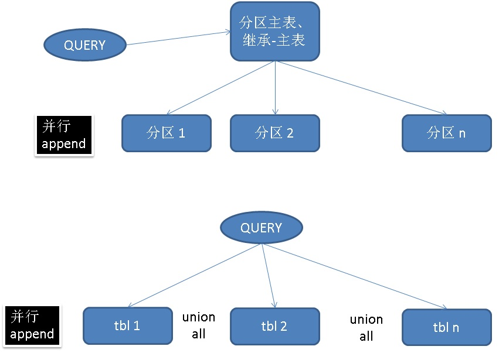
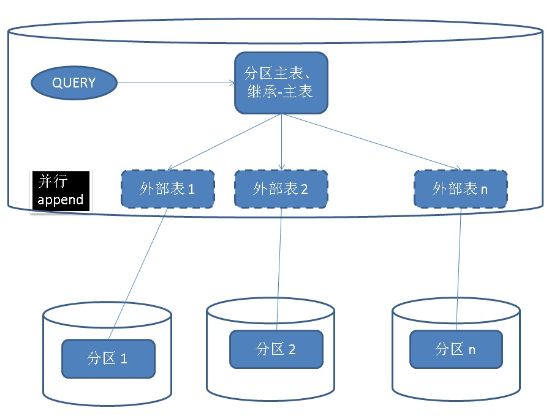

## PostgreSQL 11 preview - Parallel Append(包括 union all\分区查询) (多表并行计算) sharding架构并行计算核心功能之一     
         
### 作者          
digoal             
             
### 日期          
2018-02-04          
         
### 标签          
PostgreSQL , 多表并行 , parallel append , sharding , 外部表 , 继承 , 分区表 , union , pg_pathman , inherit           
             
----            
            
## 背景    
append是数据库执行计划中很场景的一个NODE，数据来自扫描多个对象的集合时，都需要APPEND。比如：  
  
1、扫描分区表   
  
2、扫描主表（包含若干继承表时）  
  
3、UNION ALL语句。(union 暂时不支持)  
  
     
  
使用parallel append的功能，可以设计出非常灵活的架构，例如sharding可以在数据库内核层面并行，不需要依赖中间件例如plproxy了。(暂时还不支持直接用foreign table+inherit的模式，不过可以用pg_pathman)  
  
     
  
## parallel append 参数开关  
  
```  
enable_parallel_append (boolean)  
  
Enables or disables the query planner's use of parallel-aware append plan types.   
  
The default is on.  
```  
  
## 测试  
  
```    
# 全局可使用WORKER进程数    
max_worker_processes = 128    
    
# 全局可开并行计算的WORKER进程数    
max_parallel_workers = 128     
     
# 并行计算COST计算依赖的几个参数    
set parallel_tuple_cost =0;    
set parallel_setup_cost =0;    
    
# 最小多大的表才会使用并行计算    
set min_parallel_index_scan_size =0;    
set min_parallel_table_scan_size =0;    
  
# 每个gather可以创建多个worker process  
set max_parallel_workers_per_gather =32;  
```  
  
### 生成测试数据  
  
1、创建本地分区表  
  
```  
create unlogged table p(id int8, info text) partition by hash(id);     
    
CREATE unlogged TABLE p0 PARTITION OF p FOR VALUES WITH (MODULUS 4, REMAINDER 0);      
CREATE unlogged TABLE p1 PARTITION OF p FOR VALUES WITH (MODULUS 4, REMAINDER 1);      
CREATE unlogged TABLE p2 PARTITION OF p FOR VALUES WITH (MODULUS 4, REMAINDER 2);      
CREATE unlogged TABLE p3 PARTITION OF p FOR VALUES WITH (MODULUS 4, REMAINDER 3);      
```  
  
2、写入1亿测试数据  
  
```  
insert into p select generate_series(1,100000000), 'test';    
```  
  
3、设置分区并行度为0，防止单个分区并行扫描太快，看不出性能差异。  
  
```  
alter table p0 set ( parallel_workers=0 );    
alter table p1 set ( parallel_workers=0 );    
alter table p2 set ( parallel_workers=0 );    
alter table p3 set ( parallel_workers=0 );    
```  
  
  
  
### 当每个分区都返回大量数据时  
  
这里测试了两个CASE，一个含并行聚合，一个不含并行计算（全量返回）。实际上parallel append适合一路并行，而不适合上层没什么计算，串行接收大量APPEND数据的场景。  
  
1、含并行聚合（上层直接对接partial agg worker，所以流式处理掉了），并行append  
  
```  
postgres=# set enable_parallel_append =on;  
SET  
  
postgres=# explain (analyze,verbose) select count(*) from p;  
                                                                   QUERY PLAN                                                                      
-------------------------------------------------------------------------------------------------------------------------------------------------  
 Finalize Aggregate  (cost=850840.80..850840.81 rows=1 width=8) (actual time=6400.860..6400.861 rows=1 loops=1)  
   Output: count(*)  
   ->  Gather  (cost=850840.78..850840.79 rows=3 width=8) (actual time=5630.195..6400.849 rows=4 loops=1)  
         Output: (PARTIAL count(*))  
         Workers Planned: 3  
         Workers Launched: 3  
         ->  Partial Aggregate  (cost=850840.78..850840.79 rows=1 width=8) (actual time=6133.146..6133.147 rows=1 loops=4)  
               Output: PARTIAL count(*)  
               Worker 0: actual time=6253.609..6253.609 rows=1 loops=1  
               Worker 1: actual time=6395.587..6395.588 rows=1 loops=1  
               Worker 2: actual time=6253.407..6253.407 rows=1 loops=1  
               ->  Parallel Append  (cost=0.00..770195.40 rows=32258152 width=0) (actual time=0.027..4772.225 rows=25000000 loops=4)  
                     Worker 0: actual time=0.030..4882.573 rows=24999575 loops=1  
                     Worker 1: actual time=0.030..5025.288 rows=25002155 loops=1  
                     Worker 2: actual time=0.035..4906.483 rows=25002850 loops=1  
                     ->  Seq Scan on public.p3  (cost=0.00..385180.36 rows=25002936 width=0) (actual time=0.033..3137.362 rows=25002850 loops=1)  
                           Worker 2: actual time=0.033..3137.362 rows=25002850 loops=1  
                     ->  Seq Scan on public.p1  (cost=0.00..385168.96 rows=25002196 width=0) (actual time=0.030..3253.775 rows=25002155 loops=1)  
                           Worker 1: actual time=0.030..3253.775 rows=25002155 loops=1  
                     ->  Seq Scan on public.p0  (cost=0.00..385129.04 rows=24999604 width=0) (actual time=0.029..3110.662 rows=24999575 loops=1)  
                           Worker 0: actual time=0.029..3110.662 rows=24999575 loops=1  
                     ->  Seq Scan on public.p2  (cost=0.00..385066.36 rows=24995536 width=0) (actual time=0.011..2512.500 rows=24995420 loops=1)  
 Planning time: 0.261 ms  
 Execution time: 6463.125 ms  
(24 rows)  
```  
  
2、串行APPEND  
  
```  
postgres=# set enable_parallel_append =off;  
SET  
  
postgres=# explain (analyze,verbose) select count(*) from p;  
                                                             QUERY PLAN                                                                
-------------------------------------------------------------------------------------------------------------------------------------  
 Aggregate  (cost=1790545.40..1790545.41 rows=1 width=8) (actual time=21705.971..21705.972 rows=1 loops=1)  
   Output: count(*)  
   ->  Append  (cost=0.00..1540544.72 rows=100000272 width=0) (actual time=0.010..16055.808 rows=100000000 loops=1)  
         ->  Seq Scan on public.p0  (cost=0.00..385129.04 rows=24999604 width=0) (actual time=0.010..2214.981 rows=24999575 loops=1)  
         ->  Seq Scan on public.p1  (cost=0.00..385168.96 rows=25002196 width=0) (actual time=0.011..2225.458 rows=25002155 loops=1)  
         ->  Seq Scan on public.p2  (cost=0.00..385066.36 rows=24995536 width=0) (actual time=0.013..2264.015 rows=24995420 loops=1)  
         ->  Seq Scan on public.p3  (cost=0.00..385180.36 rows=25002936 width=0) (actual time=0.013..2214.180 rows=25002850 loops=1)  
 Planning time: 0.111 ms  
 Execution time: 21706.010 ms  
(9 rows)  
```  
  
3、不含并行聚合（上层返回所有数据，性能反而下降），并行append  
  
```  
postgres=# explain (analyze,verbose)   
select * from p;  
                                                              QUERY PLAN                                                                
--------------------------------------------------------------------------------------------------------------------------------------  
 Gather  (cost=0.00..770195.40 rows=100000272 width=13) (actual time=0.238..72791.861 rows=100000000 loops=1)  
   Output: p3.id, p3.info  
   Workers Planned: 3  
   Workers Launched: 3  
   ->  Parallel Append  (cost=0.00..770195.40 rows=32258152 width=13) (actual time=0.019..4450.007 rows=25000000 loops=4)  
         Worker 0: actual time=0.021..4713.479 rows=24999575 loops=1  
         Worker 1: actual time=0.021..4705.110 rows=25002155 loops=1  
         Worker 2: actual time=0.023..4710.256 rows=25002850 loops=1  
         ->  Seq Scan on public.p3  (cost=0.00..385180.36 rows=25002936 width=13) (actual time=0.022..2955.118 rows=25002850 loops=1)  
               Output: p3.id, p3.info  
               Worker 2: actual time=0.022..2955.118 rows=25002850 loops=1  
         ->  Seq Scan on public.p1  (cost=0.00..385168.96 rows=25002196 width=13) (actual time=0.020..2949.203 rows=25002155 loops=1)  
               Output: p1.id, p1.info  
               Worker 1: actual time=0.020..2949.203 rows=25002155 loops=1  
         ->  Seq Scan on public.p0  (cost=0.00..385129.04 rows=24999604 width=13) (actual time=0.021..2957.799 rows=24999575 loops=1)  
               Output: p0.id, p0.info  
               Worker 0: actual time=0.021..2957.799 rows=24999575 loops=1  
         ->  Seq Scan on public.p2  (cost=0.00..385066.36 rows=24995536 width=13) (actual time=0.009..1919.412 rows=24995420 loops=1)  
               Output: p2.id, p2.info  
 Planning time: 0.156 ms  
 Execution time: 76464.568 ms  
(21 rows)  
```  
  
4、串行APPEND  
  
```  
postgres=# set enable_parallel_append =off;  
SET  
postgres=# explain (analyze,verbose)         
select * from p;  
                                                           QUERY PLAN                                                             
--------------------------------------------------------------------------------------------------------------------------------  
 Append  (cost=0.00..1540544.72 rows=100000272 width=13) (actual time=0.009..14691.301 rows=100000000 loops=1)  
   ->  Seq Scan on public.p0  (cost=0.00..385129.04 rows=24999604 width=13) (actual time=0.008..1930.118 rows=24999575 loops=1)  
         Output: p0.id, p0.info  
   ->  Seq Scan on public.p1  (cost=0.00..385168.96 rows=25002196 width=13) (actual time=0.012..1946.220 rows=25002155 loops=1)  
         Output: p1.id, p1.info  
   ->  Seq Scan on public.p2  (cost=0.00..385066.36 rows=24995536 width=13) (actual time=0.011..1911.555 rows=24995420 loops=1)  
         Output: p2.id, p2.info  
   ->  Seq Scan on public.p3  (cost=0.00..385180.36 rows=25002936 width=13) (actual time=0.013..1933.505 rows=25002850 loops=1)  
         Output: p3.id, p3.info  
 Planning time: 0.111 ms  
 Execution time: 18336.654 ms  
(11 rows)  
```  
  
### 当每个分区仅返回少量数据时  
  
1、并行append  
  
```  
postgres=# set enable_parallel_append =on;  
SET  
  
postgres=# explain (analyze,verbose) select count(*) from p where id=1;  
                                                           QUERY PLAN                                                             
--------------------------------------------------------------------------------------------------------------------------------  
 Aggregate  (cost=895183.26..895183.27 rows=1 width=8) (actual time=2315.544..2315.545 rows=1 loops=1)  
   Output: count(*)  
   ->  Gather  (cost=0.00..895183.25 rows=4 width=0) (actual time=1769.974..2315.536 rows=1 loops=1)  
         Workers Planned: 3  
         Workers Launched: 3  
         ->  Parallel Append  (cost=0.00..895183.25 rows=1 width=0) (actual time=1591.915..2169.437 rows=0 loops=4)  
               Worker 0: actual time=0.025..2310.110 rows=1 loops=1  
               Worker 1: actual time=2286.699..2286.699 rows=0 loops=1  
               Worker 2: actual time=2311.206..2311.206 rows=0 loops=1  
               ->  Seq Scan on public.p3  (cost=0.00..447687.70 rows=1 width=0) (actual time=2311.205..2311.205 rows=0 loops=1)  
                     Filter: (p3.id = 1)  
                     Rows Removed by Filter: 25002850  
                     Worker 2: actual time=2311.205..2311.205 rows=0 loops=1  
               ->  Seq Scan on public.p1  (cost=0.00..447674.45 rows=1 width=0) (actual time=2286.697..2286.697 rows=0 loops=1)  
                     Filter: (p1.id = 1)  
                     Rows Removed by Filter: 25002155  
                     Worker 1: actual time=2286.697..2286.697 rows=0 loops=1  
               ->  Seq Scan on public.p0  (cost=0.00..447628.05 rows=1 width=0) (actual time=0.024..2310.109 rows=1 loops=1)  
                     Filter: (p0.id = 1)  
                     Rows Removed by Filter: 24999574  
                     Worker 0: actual time=0.024..2310.109 rows=1 loops=1  
               ->  Seq Scan on public.p2  (cost=0.00..447555.20 rows=1 width=0) (actual time=1769.730..1769.730 rows=0 loops=1)  
                     Filter: (p2.id = 1)  
                     Rows Removed by Filter: 24995420  
 Planning time: 0.138 ms  
 Execution time: 2365.247 ms  
(26 rows)  
```  
  
2、串行APPEND  
  
```  
postgres=# set enable_parallel_append =off;  
SET  
  
postgres=# explain (analyze,verbose) select count(*) from p where id=1;  
                                                        QUERY PLAN                                                          
--------------------------------------------------------------------------------------------------------------------------  
 Aggregate  (cost=1790545.41..1790545.42 rows=1 width=8) (actual time=6989.018..6989.018 rows=1 loops=1)  
   Output: count(*)  
   ->  Append  (cost=0.00..1790545.40 rows=4 width=0) (actual time=0.011..6989.011 rows=1 loops=1)  
         ->  Seq Scan on public.p0  (cost=0.00..447628.05 rows=1 width=0) (actual time=0.011..1788.032 rows=1 loops=1)  
               Filter: (p0.id = 1)  
               Rows Removed by Filter: 24999574  
         ->  Seq Scan on public.p1  (cost=0.00..447674.45 rows=1 width=0) (actual time=1732.249..1732.249 rows=0 loops=1)  
               Filter: (p1.id = 1)  
               Rows Removed by Filter: 25002155  
         ->  Seq Scan on public.p2  (cost=0.00..447555.20 rows=1 width=0) (actual time=1731.916..1731.916 rows=0 loops=1)  
               Filter: (p2.id = 1)  
               Rows Removed by Filter: 24995420  
         ->  Seq Scan on public.p3  (cost=0.00..447687.70 rows=1 width=0) (actual time=1736.809..1736.809 rows=0 loops=1)  
               Filter: (p3.id = 1)  
               Rows Removed by Filter: 25002850  
 Planning time: 0.259 ms  
 Execution time: 6989.060 ms  
(17 rows)  
```  
  
## 测试union all的parallel append  
  
```  
postgres=# set enable_parallel_append =on;  
SET  
  
postgres=#   
explain (analyze,verbose)   
select count(*) from p0 where id=1   
union all   
select count(*) from p1 where id=1   
union all   
select count(*) from p2 where id=1   
union all   
select count(*) from p3 where id=1;  
                                                           QUERY PLAN                                                             
--------------------------------------------------------------------------------------------------------------------------------  
 Gather  (cost=447627.70..895181.50 rows=4 width=8) (actual time=1855.298..2363.268 rows=4 loops=1)  
   Output: (count(*))  
   Workers Planned: 3  
   Workers Launched: 3  
   ->  Parallel Append  (cost=447627.70..895181.50 rows=1 width=8) (actual time=2215.816..2215.817 rows=1 loops=4)  
         Worker 0: actual time=2356.711..2356.712 rows=1 loops=1  
         Worker 1: actual time=2336.656..2336.657 rows=1 loops=1  
         Worker 2: actual time=2314.918..2314.919 rows=1 loops=1  
         ->  Aggregate  (cost=447686.63..447686.64 rows=1 width=8) (actual time=2314.917..2314.918 rows=1 loops=1)  
               Output: count(*)  
               Worker 2: actual time=2314.917..2314.918 rows=1 loops=1  
               ->  Seq Scan on public.p3  (cost=0.00..447686.62 rows=1 width=0) (actual time=2314.906..2314.906 rows=0 loops=1)  
                     Output: p3.id, p3.info  
                     Filter: (p3.id = 1)  
                     Rows Removed by Filter: 25002850  
                     Worker 2: actual time=2314.906..2314.906 rows=0 loops=1  
         ->  Aggregate  (cost=447673.95..447673.96 rows=1 width=8) (actual time=2336.655..2336.655 rows=1 loops=1)  
               Output: count(*)  
               Worker 1: actual time=2336.655..2336.655 rows=1 loops=1  
               ->  Seq Scan on public.p1  (cost=0.00..447673.95 rows=1 width=0) (actual time=2336.646..2336.646 rows=0 loops=1)  
                     Output: p1.id, p1.info  
                     Filter: (p1.id = 1)  
                     Rows Removed by Filter: 25002155  
                     Worker 1: actual time=2336.646..2336.646 rows=0 loops=1  
         ->  Aggregate  (cost=447627.70..447627.71 rows=1 width=8) (actual time=2356.710..2356.710 rows=1 loops=1)  
               Output: count(*)  
               Worker 0: actual time=2356.710..2356.710 rows=1 loops=1  
               ->  Seq Scan on public.p0  (cost=0.00..447627.70 rows=1 width=0) (actual time=0.027..2356.702 rows=1 loops=1)  
                     Output: p0.id, p0.info  
                     Filter: (p0.id = 1)  
                     Rows Removed by Filter: 24999574  
                     Worker 0: actual time=0.027..2356.702 rows=1 loops=1  
         ->  Aggregate  (cost=447553.75..447553.76 rows=1 width=8) (actual time=1854.978..1854.979 rows=1 loops=1)  
               Output: count(*)  
               ->  Seq Scan on public.p2  (cost=0.00..447553.75 rows=1 width=0) (actual time=1854.973..1854.973 rows=0 loops=1)  
                     Output: p2.id, p2.info  
                     Filter: (p2.id = 1)  
                     Rows Removed by Filter: 24995420  
 Planning time: 0.160 ms  
 Execution time: 2413.145 ms  
(40 rows)  
```  
  
## 测试本地继承表的parallel append  
1、准备数据  
  
```  
create table pp (like p);  
create table pp0 (like p) inherits(pp);  
create table pp1 (like p) inherits(pp);  
create table pp2 (like p) inherits(pp);  
create table pp3 (like p) inherits(pp);  
insert into pp0 select * from p0;  
insert into pp1 select * from p1;  
insert into pp2 select * from p2;  
insert into pp3 select * from p3;  
alter table pp set (parallel_workers =0);  
alter table pp0 set (parallel_workers =0);  
alter table pp1 set (parallel_workers =0);  
alter table pp2 set (parallel_workers =0);  
alter table pp3 set (parallel_workers =0);  
```  
  
2、parallel append  
  
```  
postgres=# set enable_parallel_append =on;  
SET  
  
postgres=# explain (analyze,verbose) select count(*) from pp where id=1;  
                                                              QUERY PLAN                                                                 
---------------------------------------------------------------------------------------------------------------------------------------  
 Finalize Aggregate  (cost=896183.57..896183.58 rows=1 width=8) (actual time=2726.483..2726.483 rows=1 loops=1)  
   Output: count(*)  
   ->  Gather  (cost=896183.25..896183.56 rows=3 width=8) (actual time=2644.834..2726.474 rows=4 loops=1)  
         Output: (PARTIAL count(*))  
         Workers Planned: 3  
         Workers Launched: 3  
         ->  Partial Aggregate  (cost=895183.25..895183.26 rows=1 width=8) (actual time=2617.010..2617.010 rows=1 loops=4)  
               Output: PARTIAL count(*)  
               Worker 0: actual time=2469.011..2469.011 rows=1 loops=1  
               Worker 1: actual time=2721.059..2721.059 rows=1 loops=1  
               Worker 2: actual time=2633.534..2633.534 rows=1 loops=1  
               ->  Parallel Append  (cost=0.00..895183.25 rows=1 width=0) (actual time=1999.759..2617.002 rows=0 loops=4)  
                     Worker 0: actual time=0.034..2469.004 rows=1 loops=1  
                     Worker 1: actual time=2721.048..2721.048 rows=0 loops=1  
                     Worker 2: actual time=2633.525..2633.525 rows=0 loops=1  
                     ->  Seq Scan on public.pp3  (cost=0.00..447687.70 rows=1 width=0) (actual time=2633.523..2633.523 rows=0 loops=1)  
                           Filter: (pp3.id = 1)  
                           Rows Removed by Filter: 25002850  
                           Worker 2: actual time=2633.523..2633.523 rows=0 loops=1  
                     ->  Seq Scan on public.pp1  (cost=0.00..447674.45 rows=1 width=0) (actual time=2721.047..2721.047 rows=0 loops=1)  
                           Filter: (pp1.id = 1)  
                           Rows Removed by Filter: 25002155  
                           Worker 1: actual time=2721.047..2721.047 rows=0 loops=1  
                     ->  Seq Scan on public.pp0  (cost=0.00..447628.05 rows=1 width=0) (actual time=0.034..2469.002 rows=1 loops=1)  
                           Filter: (pp0.id = 1)  
                           Rows Removed by Filter: 24999574  
                           Worker 0: actual time=0.034..2469.002 rows=1 loops=1  
                     ->  Seq Scan on public.pp2  (cost=0.00..447555.20 rows=1 width=0) (actual time=2644.426..2644.426 rows=0 loops=1)  
                           Filter: (pp2.id = 1)  
                           Rows Removed by Filter: 24995420  
                     ->  Seq Scan on public.pp  (cost=0.00..0.00 rows=1 width=0) (actual time=0.002..0.002 rows=0 loops=1)  
                           Filter: (pp.id = 1)  
 Planning time: 0.080 ms  
 Execution time: 2777.958 ms  
(34 rows)  
```  
  
3、串行append  
  
```  
postgres=# set enable_parallel_append =off;  
SET  
postgres=# explain (analyze,verbose) select count(*) from pp where id=1;  
                                                        QUERY PLAN                                                           
---------------------------------------------------------------------------------------------------------------------------  
 Aggregate  (cost=1790545.41..1790545.42 rows=1 width=8) (actual time=7619.788..7619.788 rows=1 loops=1)  
   Output: count(*)  
   ->  Append  (cost=0.00..1790545.40 rows=5 width=0) (actual time=0.015..7619.783 rows=1 loops=1)  
         ->  Seq Scan on public.pp  (cost=0.00..0.00 rows=1 width=0) (actual time=0.002..0.002 rows=0 loops=1)  
               Filter: (pp.id = 1)  
         ->  Seq Scan on public.pp0  (cost=0.00..447628.05 rows=1 width=0) (actual time=0.013..1999.372 rows=1 loops=1)  
               Filter: (pp0.id = 1)  
               Rows Removed by Filter: 24999574  
         ->  Seq Scan on public.pp1  (cost=0.00..447674.45 rows=1 width=0) (actual time=1984.480..1984.480 rows=0 loops=1)  
               Filter: (pp1.id = 1)  
               Rows Removed by Filter: 25002155  
         ->  Seq Scan on public.pp2  (cost=0.00..447555.20 rows=1 width=0) (actual time=1713.703..1713.703 rows=0 loops=1)  
               Filter: (pp2.id = 1)  
               Rows Removed by Filter: 24995420  
         ->  Seq Scan on public.pp3  (cost=0.00..447687.70 rows=1 width=0) (actual time=1922.221..1922.221 rows=0 loops=1)  
               Filter: (pp3.id = 1)  
               Rows Removed by Filter: 25002850  
 Planning time: 0.079 ms  
 Execution time: 7619.821 ms  
(19 rows)  
```  
  
## 外部表并行append？  
  
1、创建postgres_fdw  
  
```  
CREATE EXTENSION postgres_fdw;  
```  
  
2、创建外部数据源  
  
```  
CREATE SERVER foreign_server  
        FOREIGN DATA WRAPPER postgres_fdw  
        OPTIONS (host '127.0.0.1', port '9999', dbname 'postgres');  
```  
  
3、设置外部数据源访问秘钥  
  
```  
CREATE USER MAPPING FOR postgres  
        SERVER foreign_server  
        OPTIONS (user 'postgres', password 'password');  
```  
  
4、创建外部表  
  
```  
CREATE FOREIGN TABLE f0 (  
        id int8,  
        info text  
)  
        SERVER foreign_server  
        OPTIONS (schema_name 'public', table_name 'p0');    
  
CREATE FOREIGN TABLE f1 (  
        id int8,  
        info text  
)  
        SERVER foreign_server  
        OPTIONS (schema_name 'public', table_name 'p1');    
  
CREATE FOREIGN TABLE f2 (  
        id int8,  
        info text  
)  
        SERVER foreign_server  
        OPTIONS (schema_name 'public', table_name 'p2');    
  
CREATE FOREIGN TABLE f3 (  
        id int8,  
        info text  
)  
        SERVER foreign_server  
        OPTIONS (schema_name 'public', table_name 'p3');    
```  
  
5、创建外部表继承关系  
  
```  
create table f(id int8, info text);  
  
alter foreign table f0 inherit f;  
  
alter foreign table f1 inherit f;  
  
alter foreign table f2 inherit f;  
  
alter foreign table f3 inherit f;  
```  
  
## 64个分区的分区表测试
1、创建本地分区表    
    
```    
create unlogged table ppp(id int8, info text) partition by hash(id);       
      
do language plpgsql $$  
declare  
begin  
  for i in 0..63 loop  
    execute format('CREATE unlogged TABLE ppp%s PARTITION OF ppp FOR VALUES WITH (MODULUS 64, REMAINDER %s)', i, i);      
    execute format('alter table ppp%s set ( parallel_workers=0 )', i);  
  end loop;  
end;  
$$;  
```    
    
2、写入2亿测试数据    
    
```    
insert into ppp select generate_series(1,100000000), 'test';      
insert into ppp select generate_series(1,100000000), 'test';     
```    
    
3、串行append测试  
  
```  
set enable_parallel_append =off;    
  
explain (analyze,verbose) select count(*) from ppp where id=1;    
  
postgres=# explain (analyze,verbose) select count(*) from ppp where id=1;    
                                                        QUERY PLAN                                                          
--------------------------------------------------------------------------------------------------------------------------  
 Aggregate  (cost=3581110.32..3581110.33 rows=1 width=8) (actual time=14179.260..14179.260 rows=1 loops=1)  
   Output: count(*)  
   ->  Append  (cost=0.00..3581110.00 rows=128 width=0) (actual time=12412.108..14179.251 rows=2 loops=1)  
         ->  Seq Scan on public.ppp0  (cost=0.00..55939.20 rows=2 width=0) (actual time=220.643..220.643 rows=0 loops=1)  
               Filter: (ppp0.id = 1)  
               Rows Removed by Filter: 3124096  
         ->  Seq Scan on public.ppp1  (cost=0.00..55926.80 rows=2 width=0) (actual time=218.816..218.816 rows=0 loops=1)  
               Filter: (ppp1.id = 1)  
               Rows Removed by Filter: 3123424  
.......  
         ->  Seq Scan on public.ppp62  (cost=0.00..55997.28 rows=2 width=0) (actual time=218.784..218.784 rows=0 loops=1)  
               Filter: (ppp62.id = 1)  
               Rows Removed by Filter: 3127382  
         ->  Seq Scan on public.ppp63  (cost=0.00..55895.03 rows=2 width=0) (actual time=218.490..218.490 rows=0 loops=1)  
               Filter: (ppp63.id = 1)  
               Rows Removed by Filter: 3121682  
 Planning time: 0.753 ms  
 Execution time: 14179.495 ms  
(197 rows)  
```  
  
4、并行append测试  
  
```  
set enable_parallel_append =on;    
  
alter table ppp0 set (parallel_workers =64);  
  
  
postgres=# explain (analyze,verbose) select count(*) from ppp where id=1;    
                                                                     QUERY PLAN                                                                    
----------------------------------------------------------------------------------------------------------------------------------------------  
 Finalize Aggregate  (cost=73565.00..73565.01 rows=1 width=8) (actual time=685.176..685.176 rows=1 loops=1)  
   Output: count(*)  
   ->  Gather  (cost=73564.83..73564.84 rows=64 width=8) (actual time=293.716..685.121 rows=65 loops=1)  
         Output: (PARTIAL count(*))  
         Workers Planned: 64  
         Workers Launched: 64  
         ->  Partial Aggregate  (cost=73564.83..73564.84 rows=1 width=8) (actual time=523.155..523.155 rows=1 loops=65)  
               Output: PARTIAL count(*)  
               Worker 0: actual time=532.810..532.810 rows=1 loops=1  
               Worker 1: actual time=507.106..507.106 rows=1 loops=1  
               Worker 2: actual time=584.379..584.380 rows=1 loops=1  
               Worker 3: actual time=506.344..506.344 rows=1 loops=1  
.........  
               Worker 61: actual time=539.029..539.029 rows=1 loops=1  
               Worker 62: actual time=536.463..536.463 rows=1 loops=1  
               Worker 63: actual time=533.323..533.323 rows=1 loops=1  
               ->  Parallel Append  (cost=0.00..73564.82 rows=2 width=0) (actual time=514.156..523.146 rows=0 loops=65)  
                     Worker 0: actual time=532.802..532.802 rows=0 loops=1  
                     Worker 1: actual time=507.098..507.098 rows=0 loops=1  
                     Worker 2: actual time=0.025..584.367 rows=2 loops=1  
                     Worker 3: actual time=506.334..506.334 rows=0 loops=1  
...............  
                     Worker 60: actual time=528.767..528.767 rows=0 loops=1  
                     Worker 61: actual time=539.020..539.020 rows=0 loops=1  
                     Worker 62: actual time=536.454..536.454 rows=0 loops=1  
                     Worker 63: actual time=533.313..533.313 rows=0 loops=1  
                     ->  Seq Scan on public.ppp13  (cost=0.00..56066.65 rows=2 width=0) (actual time=533.312..533.312 rows=0 loops=1)  
                           Filter: (ppp13.id = 1)  
                           Rows Removed by Filter: 3131252  
                           Worker 63: actual time=533.312..533.312 rows=0 loops=1  
                     ->  Seq Scan on public.ppp6  (cost=0.00..56056.88 rows=2 width=0) (actual time=536.452..536.452 rows=0 loops=1)  
                           Filter: (ppp6.id = 1)  
                           Rows Removed by Filter: 3130710  
                           Worker 62: actual time=536.452..536.452 rows=0 loops=1  
....................  
                     ->  Seq Scan on public.ppp58  (cost=0.00..55880.68 rows=2 width=0) (actual time=292.269..292.269 rows=0 loops=1)  
                           Filter: (ppp58.id = 1)  
                           Rows Removed by Filter: 3120854  
                           Worker 5: actual time=292.269..292.269 rows=0 loops=1  
                     ->  Seq Scan on public.ppp56  (cost=0.00..55874.90 rows=2 width=0) (actual time=0.016..224.329 rows=2 loops=1)  
                           Filter: (ppp56.id = 1)  
                           Rows Removed by Filter: 3120550  
                     ->  Parallel Seq Scan on public.ppp0  (cost=0.00..18108.35 rows=1 width=0) (actual time=225.194..225.194 rows=0 loops=1)  
                           Filter: (ppp0.id = 1)  
                           Rows Removed by Filter: 3124096  
 Planning time: 0.807 ms  
 Execution time: 655.200 ms  
(329 rows)  
.........  
```  
  
### 测试外部表是否可以使用parallel append  
  
```  
postgres=# set enable_parallel_append =on;  
SET  
```  
  
1、测试外部表的继承表主表  
  
```  
postgres=#   
explain (analyze,verbose)   
select count(*) from f where id=1;  
                                                          QUERY PLAN                                                            
------------------------------------------------------------------------------------------------------------------------------  
 Aggregate  (cost=612.18..612.19 rows=1 width=8) (actual time=7071.067..7071.068 rows=1 loops=1)  
   Output: count(*)  
   ->  Append  (cost=0.00..612.01 rows=69 width=0) (actual time=1740.313..7071.060 rows=1 loops=1)  
         ->  Seq Scan on public.f  (cost=0.00..0.00 rows=1 width=0) (actual time=0.002..0.002 rows=0 loops=1)  
               Filter: (f.id = 1)  
         ->  Foreign Scan on public.f0  (cost=100.00..153.00 rows=17 width=0) (actual time=1740.310..1740.311 rows=1 loops=1)  
               Remote SQL: SELECT NULL FROM public.p0 WHERE ((id = 1))  
         ->  Foreign Scan on public.f1  (cost=100.00..153.00 rows=17 width=0) (actual time=1860.924..1860.924 rows=0 loops=1)  
               Remote SQL: SELECT NULL FROM public.p1 WHERE ((id = 1))  
         ->  Foreign Scan on public.f2  (cost=100.00..153.00 rows=17 width=0) (actual time=1733.198..1733.198 rows=0 loops=1)  
               Remote SQL: SELECT NULL FROM public.p2 WHERE ((id = 1))  
         ->  Foreign Scan on public.f3  (cost=100.00..153.00 rows=17 width=0) (actual time=1736.619..1736.619 rows=0 loops=1)  
               Remote SQL: SELECT NULL FROM public.p3 WHERE ((id = 1))  
 Planning time: 0.192 ms  
 Execution time: 7071.329 ms  
(15 rows)  
```  
  
2、使用union all查询多个外部表  
  
```  
postgres=#   
explain (analyze,verbose)   
select count(*) from f0 where id=1   
union all   
select count(*) from f1 where id=1   
union all   
select count(*) from f2 where id=1   
union all   
select count(*) from f3 where id=1;  
                                                QUERY PLAN                                                  
----------------------------------------------------------------------------------------------------------  
 Append  (cost=100.04..610.98 rows=4 width=8) (actual time=1731.125..6926.563 rows=4 loops=1)  
   ->  Foreign Scan  (cost=100.04..152.73 rows=1 width=8) (actual time=1731.125..1731.125 rows=1 loops=1)  
         Output: (count(*))  
         Relations: Aggregate on (public.f0)  
         Remote SQL: SELECT count(*) FROM public.p0 WHERE ((id = 1))  
   ->  Foreign Scan  (cost=100.04..152.73 rows=1 width=8) (actual time=1732.174..1732.175 rows=1 loops=1)  
         Output: (count(*))  
         Relations: Aggregate on (public.f1)  
         Remote SQL: SELECT count(*) FROM public.p1 WHERE ((id = 1))  
   ->  Foreign Scan  (cost=100.04..152.73 rows=1 width=8) (actual time=1731.794..1731.795 rows=1 loops=1)  
         Output: (count(*))  
         Relations: Aggregate on (public.f2)  
         Remote SQL: SELECT count(*) FROM public.p2 WHERE ((id = 1))  
   ->  Foreign Scan  (cost=100.04..152.73 rows=1 width=8) (actual time=1731.465..1731.465 rows=1 loops=1)  
         Output: (count(*))  
         Relations: Aggregate on (public.f3)  
         Remote SQL: SELECT count(*) FROM public.p3 WHERE ((id = 1))  
 Planning time: 0.205 ms  
 Execution time: 6926.909 ms  
(19 rows)  
```  
  
## 小结  
1、parallel append功能，在每个参与append的数据分片计算并返回的记录数比较少时，性能提升几乎是线性的。  
  
2、当每个参与append的数据分片都要返回大量数据时，需要注意是否有用到支持并行的聚合，如果没有，那么上层还需要处理大量数据量PARALLEL APPEND效果就不明显。否则不要使用parallel append。(实际上parallel append适合一路并行，而不适合上层没什么计算，串行接收大量APPEND数据的场景。)  
  
3、parallel append + 外部表 + pushdown，可以实现sharding 架构下的并发计算。（例如求SUM,AVG,COUNG,MIN,MAX等，不过针对外部表的parallel append内核层面还没有支持好，需要CUSTOM SCAN）  
  
4、parallel append VS append 性能  
  
  
case | parallel append耗时 | 串行 append耗时 | parallel append性能提升 | 点评  
---|---|---|---|---  
1亿，4个并行分片，每个分片返回少量数据 | 2.37 秒 | 6.99 秒 | 2.95 倍 | 几乎线性提升  
1亿，4个并行分片，每个分片返回大量数据（但是下一个NODE包括并行聚合） | 6.46 秒 | 21.7 秒 | 3.36 倍 | 几乎线性提升  
1亿，4个并行分片，每个分片返回大量数据（下一个NODE需要串行返回大量数据） | 76.5 秒 | 18.3 秒 | - 4.18 倍 | append的下一个NODE需要返回大量数据时不适合使用并行append  
2亿，64个并行分片，每个分片返回少量数据 | 0.655 秒 | 14.18 秒 | 21.65 倍 | 并行越大，提升越明显，这里还需要考虑内存带宽瓶颈（20多倍时，处理速度为 12.9 GB/s）
  
## 参考    
    
https://commitfest.postgresql.org/16/987/  
  
[《PostgreSQL 9.6 sharding based on FDW & pg_pathman》](../201610/20161027_01.md)    
  
[《PostgreSQL 9.5+ 高效分区表实现 - pg_pathman》](../201610/20161024_01.md)    
  
    
  
<a rel="nofollow" href="http://info.flagcounter.com/h9V1"  ></a>  
  
  
  
  
  
  
## [digoal's 大量PostgreSQL文章入口](https://github.com/digoal/blog/blob/master/README.md "22709685feb7cab07d30f30387f0a9ae")
  
