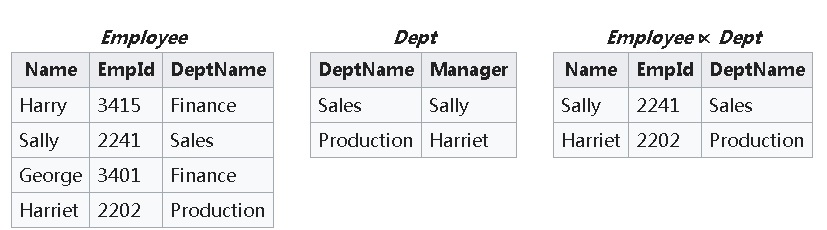
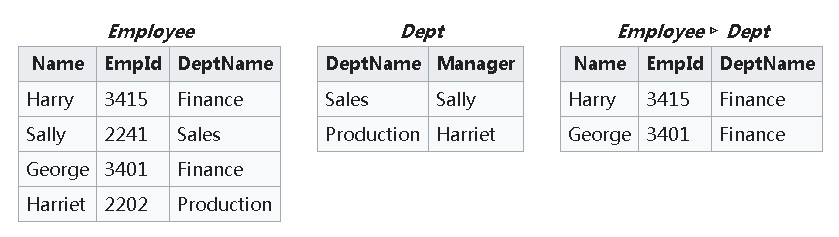
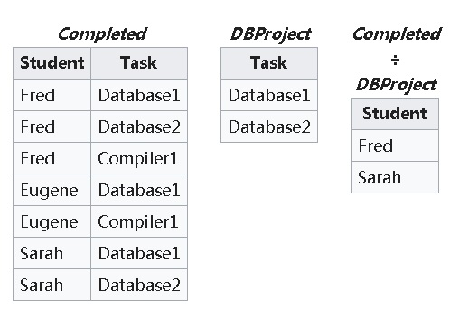
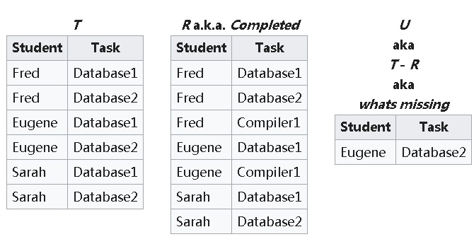
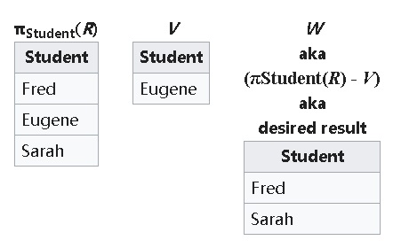

## PostgreSQL 与关系代数 (Equi-Join , Semi-Join , Anti-Join , Division)  
           
### 作者            
digoal               
               
### 日期            
2018-02-05            
           
### 标签            
PostgreSQL , 关系代数 , EquiJoin , SemiJoin , AntiJoin , Division    
               
----              
              
## 背景  
关系数据库中很多操作来自关系代数中的一些概念。例如常见的JOIN操作，下面是关系代数中的一些概念。  
  
https://en.wikipedia.org/wiki/Relational_algebra  
  
JOIN本身也分好多种比如EquiJoin , SemiJoin , AntiJoin , Division。  
  
## EquiJoin   
这种JOIN最为常见。例如：  
  
```  
select a.* from a join b on (a.xx = b.xx);  
```  
  
实际上关系代数中为θ-join，包括(<, ≤, =, >, ≥)，当使用=时，对应的就是equijoin.  
  
只要操作符（JOIN条件）返回TRUE，就输出对应的JOIN记录。（也可以理解为笛卡尔乘积中，仅返回JOIN条件为TRUE的那些）  
  
## SemiJoin   
返回在Employee中的记录，同时这条记录与Dept中的所有记录一对多操作时，有一个返回TRUE的操作即可。  
  
例如  
  
```  
select * from Employee where exists   
  (select 1 from Dept where Employee.DeptName = Dept.DeptName);  -- 现实中操作符可以随意替代，代表不同语义  
```  
  
  
  
由于semiJoin的操作在EXISTS中只要有一条符合TRUE即可，所以很大概率下并不需要扫描全量Dept。  
  
semiJOIN支持hash, merge, nestloop几种JOIN方法。  
  
Employee很小，并且Dept有索引时，NESTLOOP就会比较快。  
  
Employee很大时，使用hash就很快。  
  
PostgreSQL 11在hash操作上有了极大的性能提升：    
  
[《PostgreSQL 11 preview - parallel hash (含hash JOIN , hash agg等) 性能极大提升》](../201802/20180201_01.md)    
  
[《PostgreSQL dblink异步调用实现 并行hash分片JOIN - 含数据交、并、差 提速案例》](../201802/20180201_02.md)    
    
## AntiJoin   
AntiJoin与SemiJoin表达的意思有点相反，要求Employee中的每一条记录，与Dept中所有记录进行操作后，Dept中没有任何一条能满足。返回在Employee中的这样的记录。  
  
例如  
  
```  
select * from Employee where not exists   
  (select 1 from Dept where Employee.DeptName = Dept.DeptName);   -- 现实中操作符可以随意替代，代表不同语义  
```  
  
  
  
AntiJoin要求Employee中每一条记录与Dept所有记录进行操作，并且所有操作都不满足条件，这条算作有效记录，返回该Employee的记录。  
  
对于JOIN操作符为=号的，不管是semijoin还是antijoin，都可以用HASH join，达到非常好的加速效果。  
  
## Division   
JOIN中的除法运算，没有对应的SQL，需要写多条SQL或者使用CTE语法写一条SQL来实现。  
  
  
  
  
  
1、补齐  
  
tmp1:  
  
```  
select Student, Task from  
(  
  select distinct Student from Completed  
) t1   
,  
(  
  select Task from DBProject  
) t2;  
```  
  
2、使用AntiJoin计算余数  
  
tmp2:  
  
```  
select Student from Completed where not exists   
  (select 1 from tmp1 where tmp1.Student=Completed.Student and tmp1.Task=Completed.Task);  
```  
  
3、去重，并使用except求差，得到最终结果  
  
```  
select distinct Student from Completed   
except  
select Student from tmp2;  
```  
  
  
  
### CTE实现Division  
  
```  
with   
  t1 as (select distinct Student as Student from Completed),  
  tmp1 as (select Student, Task from t1, (select Task from DBProject) t2),  
  tmp2 as (select Student from Completed where not exists   
              (select 1 from tmp1 where tmp1.Student=Completed.Student and tmp1.Task=Completed.Task)  
	  )  
select Student from t1  
except  
select Student from tmp2;  
```  
  
### 除法求余  
  
outerjoin不再赘述。  
  
## Paralle HASH JOIN (equijoin, semijoin, antijoin)性能指标  
PostgreSQL 11  
  
64线程机器，使用HASH并行。  
  
测试数据：  
  
```  
postgres=# create table a(id int);  
CREATE TABLE  
  
postgres=# create table b(id int);  
CREATE TABLE  
  
postgres=# insert into a select generate_series(1,100000000);  
INSERT 0 100000000  
  
postgres=# insert into b select generate_series(1,1000000);  
INSERT 0 1000000  
```  
  
### 1 Equi-Join  
  
```  
postgres=# explain analyze select count(*) from a join b using (id);  
                                                                   QUERY PLAN                                                                     
------------------------------------------------------------------------------------------------------------------------------------------------  
 Finalize Aggregate  (cost=469787.02..469787.03 rows=1 width=8) (actual time=902.399..902.399 rows=1 loops=1)  
   ->  Gather  (cost=469780.45..469786.86 rows=64 width=8) (actual time=901.209..902.383 rows=65 loops=1)  
         Workers Planned: 64  
         Workers Launched: 64  
         ->  Partial Aggregate  (cost=468780.45..468780.46 rows=1 width=8) (actual time=843.689..843.690 rows=1 loops=65)  
               ->  Parallel Hash Join  (cost=4776.56..468741.38 rows=15625 width=0) (actual time=38.430..842.222 rows=15385 loops=65)  
                     Hash Cond: (a.id = b.id)  
                     ->  Parallel Seq Scan on a  (cost=0.00..458103.01 rows=1562500 width=4) (actual time=0.023..296.974 rows=1538462 loops=65)  
                     ->  Parallel Hash  (cost=4581.25..4581.25 rows=15625 width=4) (actual time=36.133..36.133 rows=15385 loops=65)  
                           Buckets: 1048576  Batches: 1  Memory Usage: 48832kB  
                           ->  Parallel Seq Scan on b  (cost=0.00..4581.25 rows=15625 width=4) (actual time=0.022..2.093 rows=15385 loops=65)  
 Planning time: 0.117 ms  
 Execution time: 990.915 ms  
(13 rows)  
```  
  
### 2 Semi-join  
  
```  
postgres=# explain analyze select count(*) from a where exists (select 1 from b where a.id=b.id);  
                                                                   QUERY PLAN                                                                     
------------------------------------------------------------------------------------------------------------------------------------------------  
 Finalize Aggregate  (cost=468200.59..468200.60 rows=1 width=8) (actual time=890.449..890.449 rows=1 loops=1)  
   ->  Gather  (cost=468194.02..468200.43 rows=64 width=8) (actual time=889.040..890.434 rows=65 loops=1)  
         Workers Planned: 64  
         Workers Launched: 64  
         ->  Partial Aggregate  (cost=467194.02..467194.03 rows=1 width=8) (actual time=831.249..831.249 rows=1 loops=65)  
               ->  Parallel Hash Semi Join  (cost=4776.56..467154.96 rows=15625 width=0) (actual time=37.204..829.763 rows=15385 loops=65)  
                     Hash Cond: (a.id = b.id)  
                     ->  Parallel Seq Scan on a  (cost=0.00..458103.01 rows=1562500 width=4) (actual time=0.024..289.738 rows=1538462 loops=65)  
                     ->  Parallel Hash  (cost=4581.25..4581.25 rows=15625 width=4) (actual time=35.672..35.672 rows=15385 loops=65)  
                           Buckets: 1048576  Batches: 1  Memory Usage: 48896kB  
                           ->  Parallel Seq Scan on b  (cost=0.00..4581.25 rows=15625 width=4) (actual time=0.023..2.090 rows=15385 loops=65)  
 Planning time: 0.132 ms  
 Execution time: 980.261 ms  
(13 rows)  
```  
  
### 3 Anti-Join  
  
```  
postgres=# explain analyze select count(*) from a where not exists (select 1 from b where a.id=b.id);  
                                                                   QUERY PLAN                                                                     
------------------------------------------------------------------------------------------------------------------------------------------------  
 Finalize Aggregate  (cost=487341.22..487341.23 rows=1 width=8) (actual time=1171.201..1171.201 rows=1 loops=1)  
   ->  Gather  (cost=487334.65..487341.06 rows=64 width=8) (actual time=1169.676..1171.185 rows=65 loops=1)  
         Workers Planned: 64  
         Workers Launched: 64  
         ->  Partial Aggregate  (cost=486334.65..486334.66 rows=1 width=8) (actual time=1110.487..1110.487 rows=1 loops=65)  
               ->  Parallel Hash Anti Join  (cost=4776.56..482467.46 rows=1546876 width=0) (actual time=53.768..964.692 rows=1523077 loops=65)  
                     Hash Cond: (a.id = b.id)  
                     ->  Parallel Seq Scan on a  (cost=0.00..458103.01 rows=1562500 width=4) (actual time=0.023..288.519 rows=1538462 loops=65)  
                     ->  Parallel Hash  (cost=4581.25..4581.25 rows=15625 width=4) (actual time=35.322..35.322 rows=15385 loops=65)  
                           Buckets: 1048576  Batches: 1  Memory Usage: 48864kB  
                           ->  Parallel Seq Scan on b  (cost=0.00..4581.25 rows=15625 width=4) (actual time=0.022..2.010 rows=15385 loops=65)  
 Planning time: 0.129 ms  
 Execution time: 1259.454 ms  
(13 rows)  
```  
  
## 小结
PostgreSQL的JOIN算法可圈可点，在版本11后，引入了parallel hash join，支持equijoin, semijoin, antijoin等各种关系计算。    
   
性能杠杠的。   
    
## 参考  
https://en.wikipedia.org/wiki/Relational_algebra  
  
https://www.postgresql.org/message-id/flat/CAEepm=270ze2hVxWkJw-5eKzc3AB4C9KpH3L2kih75R5pdSogg@mail.gmail.com#CAEepm=270ze2hVxWkJw-5eKzc3AB4C9KpH3L2kih75R5pdSogg@mail.gmail.com  
  
http://blog.itpub.net/15480802/viewspace-703260/  
  
[《PostgreSQL 11 preview - parallel hash (含hash JOIN , hash agg等) 性能极大提升》](../201802/20180201_01.md)   
    
[《PostgreSQL dblink异步调用实现 并行hash分片JOIN - 含数据交、并、差 提速案例》](../201802/20180201_02.md)  
  
  
<a rel="nofollow" href="http://info.flagcounter.com/h9V1"  ></a>  
  
  
  
  
  
  
## [digoal's 大量PostgreSQL文章入口](https://github.com/digoal/blog/blob/master/README.md "22709685feb7cab07d30f30387f0a9ae")
  
