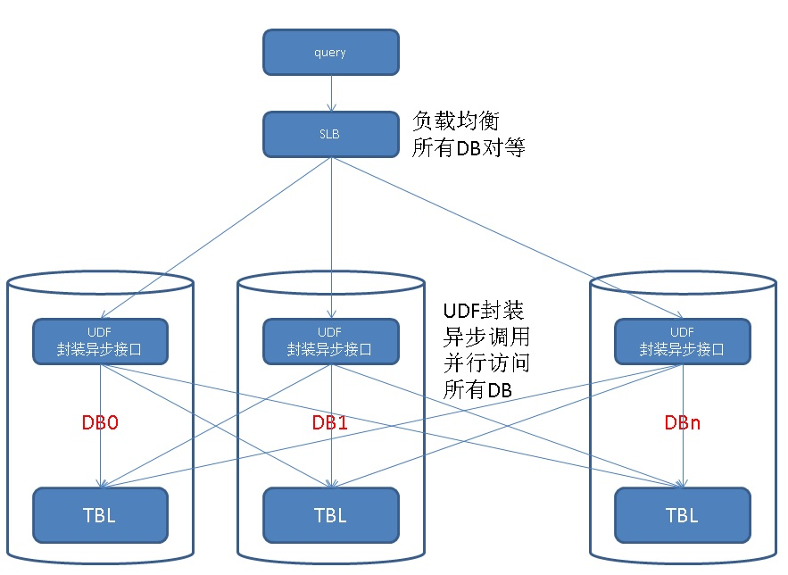

## PostgreSQL 相似搜索分布式架构设计与实践 - dblink异步调用与多机并行(远程 游标+记录 UDF实例)
           
### 作者            
digoal               
               
### 日期            
2018-02-05           
           
### 标签            
PostgreSQL , 多表并行 , 多机并行 , dblink , 异步调用 , 相似搜索        
               
----              
              
## 背景      
背景请参考如下：  
  
[《PostgreSQL 相似搜索设计与性能 - 地址、QA、POI等文本 毫秒级相似搜索实践》](../201802/20180202_01.md)    
  
当需要进行相似搜索的数据量大于单机处理能力时，我们需要水平拆分来提高搜索能力。  
  
或者可以使用阿里云的PolarDB for PG的产品（类似ORACLE RAC，支持增加计算节点）。比水平分库的好处是数据是共享存储的，不需要拆分。  
  
  
回到水平分库的场景，如果我们把数据库拆成了多个，那么，如何让查询并行起来呢？  
  
用DBLINK异步调用，可以让查询并行起来。架构设计如下：  
  
  
  
实际上采用DBLINK异步调用实现并行的例子很多：  
  
[《PostgreSQL dblink异步调用实现 并行hash分片JOIN - 含数据交、并、差 提速案例》](../201802/20180201_02.md)    
  
进入正题，下面是一个DEMO，按部就班的演示如何使用异步调用实现多库并行相似搜索。  
  
## DEMO  
1、我们这里使用本地的4个DB来代表远程数据库，这4个DB完全可以安装到远程。这里只是为了测试方便。  
  
本地库名：  
  
```  
postgres  
```  
  
远程库名：  
  
```  
db0  
db1  
db2  
db3  
```  
  
2、首先需要创建用户和测试DB  
  
```  
create role test login encrypted password 'secret';  
create database db0 with owner test;  
create database db1 with owner test;  
create database db2 with owner test;  
create database db3 with owner test;  
```  
  
3、在本地某个库中创建dblink插件  
  
```  
create extension dblink;  
```  
  
4、创建连接远程库的SERVER  
  
```  
CREATE SERVER db0 FOREIGN DATA WRAPPER dblink_fdw OPTIONS (hostaddr '127.0.0.1', dbname 'db0');  
CREATE SERVER db1 FOREIGN DATA WRAPPER dblink_fdw OPTIONS (hostaddr '127.0.0.1', dbname 'db1');  
CREATE SERVER db2 FOREIGN DATA WRAPPER dblink_fdw OPTIONS (hostaddr '127.0.0.1', dbname 'db2');  
CREATE SERVER db3 FOREIGN DATA WRAPPER dblink_fdw OPTIONS (hostaddr '127.0.0.1', dbname 'db3');  
```  
  
5、配置连接远程库的用户密码（用户密码都是远程库的，可不是本地的哦，你想用本地用户连远程库，没门）  
  
```  
CREATE USER MAPPING FOR postgres SERVER db0 OPTIONS (user 'test', password 'secret');  
CREATE USER MAPPING FOR postgres SERVER db1 OPTIONS (user 'test', password 'secret');  
CREATE USER MAPPING FOR postgres SERVER db2 OPTIONS (user 'test', password 'secret');  
CREATE USER MAPPING FOR postgres SERVER db3 OPTIONS (user 'test', password 'secret');  
```  
  
### 远程库操作  
  
在所有远程库上创建测试表，灌入测试数据，创建相似搜索函数。（注意下面的脚本需要调整好对应调度dbname）  
  
1、必要的插件（注意下面的脚本需要调整好对应调度dbname）  
  
```  
\c db3 postgres  
create extension pg_trgm;    
create extension dblink;  
```  
  
2、主表和相似搜索依赖的索引（注意下面的脚本需要调整好对应调度dbname）  
  
```  
\c db3 test  
create unlogged table tbl(id int primary key, info text);    
create index idx_tbl_info on tbl using gin (info gin_trgm_ops);  
    
-- alter table tbl set (parallel_workers =64);    
```  
  
3、创建分区（本文仅做测试，真正的分区表用法请参考： [《PostgreSQL 11 分区表用法及增强 - 增加HASH分区支持 (hash, range, list)》](../201802/20180205_02.md)   ）  
  
```  
do language plpgsql $$    
declare    
begin    
  for i in 0..63    
  loop    
    execute format('drop table if exists tbl%s ', i);    
    execute format('create unlogged table tbl%s (like tbl including all) inherits(tbl)', i);    
    -- 提前设置好表级并行度，方便后面做并行测试    
    -- execute format('alter table tbl%s set (parallel_workers =64)', i);    
  end loop;    
end;    
$$;    
```  
  
4、创建连接函数  
  
```  
create or replace function conn(      
  name,   -- dblink名字      
  text    -- 连接串,URL      
) returns void as $$        
declare        
begin        
  perform dblink_connect($1, $2);       
  return;        
exception when others then        
  return;        
end;        
$$ language plpgsql strict;     
```  
  
5、创建生成随机函数的函数  
  
```  
-- 生成随机汉字符串      
create or replace function gen_hanzi(int) returns text as $$      
declare      
  res text;      
begin      
  if $1 >=1 then      
    select string_agg(chr(19968+(random()*20901)::int), '') into res from generate_series(1,$1);      
    return res;      
  end if;      
  return null;      
end;      
$$ language plpgsql strict;      
```  
  
6、写入测试数据，随机文本（注意下面的脚本需要调整好对应调度dbname）  
  
```  
do language plpgsql $$    
declare    
  dbname name := 'db3';  
begin    
  for i in 0..63    
  loop    
    perform conn('link'||i,  'hostaddr=127.0.0.1 user=test password=secret dbname='||dbname);     
    perform dblink_send_query('link'||i, format('insert into tbl%s select generate_series(1, 15625), gen_hanzi(64); analyze tbl%s;', i, i));    
  end loop;    
end;    
$$;    
```  
  
7、创建相似搜索用到的UDF  
  
```    
create or replace function get_res(  
  text,     -- 要按相似搜的文本  
  int8,     -- 限制返回多少条  
  float4 default 0.3,   -- 相似度阈值，低于这个值不再搜搜  
  float4 default 0.1    -- 相似度递减步长，直至阈值  
) returns setof record as $$    
declare    
  lim float4 := 1;    
begin    
  -- 判定  
  if not ($3 <= 1 and $3 > 0) then   
    raise notice '$3 must >0 and <=1';  
    return;  
  end if;  
    
  if not ($4 > 0 and $4 < 1) then  
    raise notice '$4 must >0 and <=1';  
    return;  
  end if;  
  loop    
    -- 设置相似度阈值    
    perform set_limit(lim);    
        
    -- 查看当前阈值下，有没有相似记录    
    perform similarity(info, $1) as sml, * from tbl where info % $1 limit 1;    
        
    -- 如果有，则返回N条    
    if found then    
      return query select similarity(info, $1) as sml, * from tbl where info % $1 order by sml desc limit $2;    
      return;    
    end if;    
    
    -- 否则继续，降低阈值    
    -- 当阈值小于0.3时，不再降阈值搜索，认为没有相似。    
    if lim < $3 then    
      return;    
    else    
      lim := lim - $4;    
    end if;    
  end loop;    
end;    
$$ language plpgsql strict;    
```    
  
### 本地库操作  
  
创建建立远程连接的函数  
  
```  
create or replace function conn(        
  name,   -- dblink名字        
  text    -- 连接串,URL        
) returns void as $$          
declare          
begin          
  perform dblink_connect($1, $2);         
  return;          
exception when others then          
  return;          
end;          
$$ language plpgsql strict;        
```  
  
#### 返回游标  
1、定义UDF1 - 返回游标（如果返回记录数很多，建议使用游标，因为PLPGSQL是需要等所有记录都拿到才会开始返回，返回记录的话RT会较高）  
  
例子    
    
```  
create or replace function get_res_cursor(  
  text,     -- 要按相似搜的文本  
  int8,     -- 限制返回多少条  
  float4 default 0.3,   -- 相似度阈值，低于这个值不再搜搜  
  float4 default 0.1    -- 相似度递减步长，直至阈值  
) returns setof refcursor as $$    
declare    
  i int := 1;  
  ref refcursor[];    
  res refcursor;   
  dbname name[] := array['db0', 'db1', 'db2', 'db3'];  -- 定义集群  
  db name;  
begin  
  foreach db in array dbname  
  loop   
    ref[i] := 'link'||i;  
    res := ref[i];  
    perform conn('link'||i,  db);         
    perform dblink_open('link'||i, 'link'||i, format('select * from get_res(%L, %s, %s, %s) as t(sml real, id int, info text)', $1, $2, $3, $4));    
    return next res;  
    i := i+1;  
  end loop;  
end;  
$$ language plpgsql strict;  
```  
    
使用例子  
  
```  
postgres=# begin;  
BEGIN  
Time: 0.045 ms  
postgres=# select * from get_res_cursor('怮媕苸淏倍椡帪暀虻爴荡巒讉輶魂馜虑范噞蠭鲧烳渃麠钸趥剘偣瑴鑪颭蚢佚簀哌內霡擷槧緸褫齈跊甏軙襧漆疅泅睤帍槇驗縐棂', 10, 0.1, 0.05);  
 get_res_cursor   
----------------  
 link1  
 link2  
 link3  
 link4  
(4 rows)  
  
Time: 18.624 ms  
postgres=# select * from dblink_fetch('link1','link1',10) as t(sml real, id int, info text);  
 sml | id | info   
-----+----+------  
(0 rows)  
  
Time: 219.972 ms  
postgres=# select * from dblink_fetch('link1','link1',10) as t(sml real, id int, info text);  
 sml | id | info   
-----+----+------  
(0 rows)  
  
Time: 0.252 ms  
postgres=# select * from dblink_fetch('link2','link2',10) as t(sml real, id int, info text);  
 sml | id | info   
-----+----+------  
(0 rows)  
  
Time: 215.891 ms  
postgres=# select * from dblink_fetch('link3','link3',10) as t(sml real, id int, info text);  
 sml | id | info   
-----+----+------  
(0 rows)  
  
Time: 215.188 ms  
postgres=# select * from dblink_fetch('link4','link4',10) as t(sml real, id int, info text);  
   sml    | id |                                                               info                                                                 
----------+----+----------------------------------------------------------------------------------------------------------------------------------  
 0.779412 |  1 | 递陊怮媕苸淏倍椡帪暀虻爴荡巒讉輶魂馜虑范噞蠭鲧烳渃麠钸趥剘偣瑴鑪颭蚢佚簀哌內霡擷槧緸褫齈跊甏軙襧漆疅泅睤帍槇驗縐棂轪氐洚重銄懟諔  
(1 row)  
  
Time: 106.692 ms  
```  
  
#### 返回记录  
1、定义UDF2 - 返回记录(注意，建议限制返回的条数，因为PLPGSQL是需要等所有记录都拿到才会开始返回)  
  
例子    
    
```  
create or replace function get_res_record(  
  text,     -- 要按相似搜的文本  
  int8,     -- 限制返回多少条  
  float4 default 0.3,   -- 相似度阈值，低于这个值不再搜搜  
  float4 default 0.1    -- 相似度递减步长，直至阈值  
) returns setof record as $$    
declare    
  i int;  
  ref refcursor[];    
  res refcursor;   
  dbname name[] := array['db0', 'db1', 'db2', 'db3'];  -- 定义集群  
  db name;  
begin  
  i := 1;  
  foreach db in array dbname  
  loop   
    perform conn('link'||i,  db);     
    perform 1 from dblink_get_result('link'||i) as t(sml real, id int, info text);       
    perform dblink_send_query('link'||i, format('select * from get_res(%L, %s, %s, %s) as t(sml real, id int, info text)', $1, $2, $3, $4));    
    i := i+1;  
  end loop;  
  
  i := 1;  
  foreach db in array dbname  
  loop   
    return query SELECT * FROM dblink_get_result('link'||i) as t(sml real, id int, info text);     
    i := i+1;  
  end loop;  
end;  
$$ language plpgsql strict;  
```  
    
使用例子  
  
  
```  
postgres=# select * from get_res_record('怮媕苸淏倍椡帪暀虻爴荡巒讉輶魂馜虑范噞蠭鲧烳渃麠钸趥剘偣瑴鑪颭蚢佚簀哌內霡擷槧緸褫齈跊甏軙襧漆疅泅睤帍槇驗縐棂', 10, 0.77, 0.4) as (sml real, id int, info text);  
   sml    | id |                                                               info                                                                 
----------+----+----------------------------------------------------------------------------------------------------------------------------------  
 0.779412 |  1 | 递陊怮媕苸淏倍椡帪暀虻爴荡巒讉輶魂馜虑范噞蠭鲧烳渃麠钸趥剘偣瑴鑪颭蚢佚簀哌內霡擷槧緸褫齈跊甏軙襧漆疅泅睤帍槇驗縐棂轪氐洚重銄懟諔  
(1 row)  
  
Time: 32.329 ms  
```  
  
## 小结  
使用本文提到的方法，你就可以将多个PostgreSQL当成一个PostgreSQL来使用，实现并行相似搜索的线性扩容。  
  
  
性能指标，详见：  
  
[《PostgreSQL 相似搜索设计与性能 - 地址、QA、POI等文本 毫秒级相似搜索实践》](../201802/20180202_01.md)    
  
使用dblink异步调用，实现相似文本搜索的横向线性扩展，性能不衰减。  
  
## 参考  
  
  
[《PostgreSQL 相似搜索设计与性能 - 地址、QA、POI等文本 毫秒级相似搜索实践》](../201802/20180202_01.md)    
  
[《PostgreSQL dblink异步调用实现 并行hash分片JOIN - 含数据交、并、差 提速案例》](../201802/20180201_02.md)    
  
https://www.postgresql.org/docs/10/static/dblink.html  
  
   
  
<a rel="nofollow" href="http://info.flagcounter.com/h9V1"  ></a>  
  
  
  
  
  
  
## [digoal's 大量PostgreSQL文章入口](https://github.com/digoal/blog/blob/master/README.md "22709685feb7cab07d30f30387f0a9ae")
  
