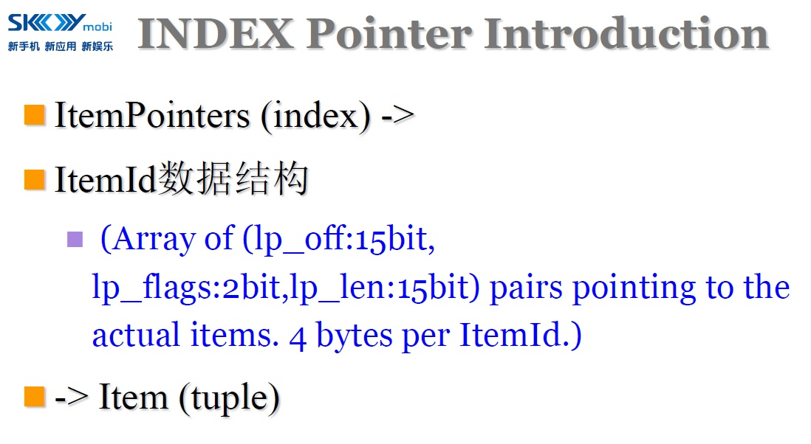
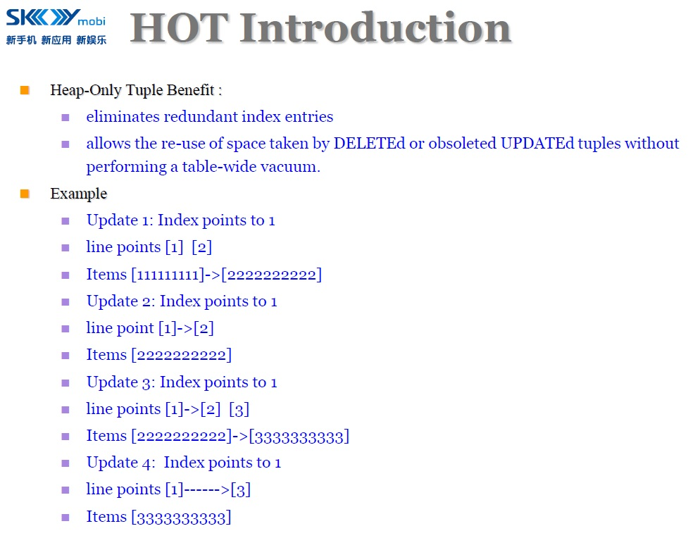
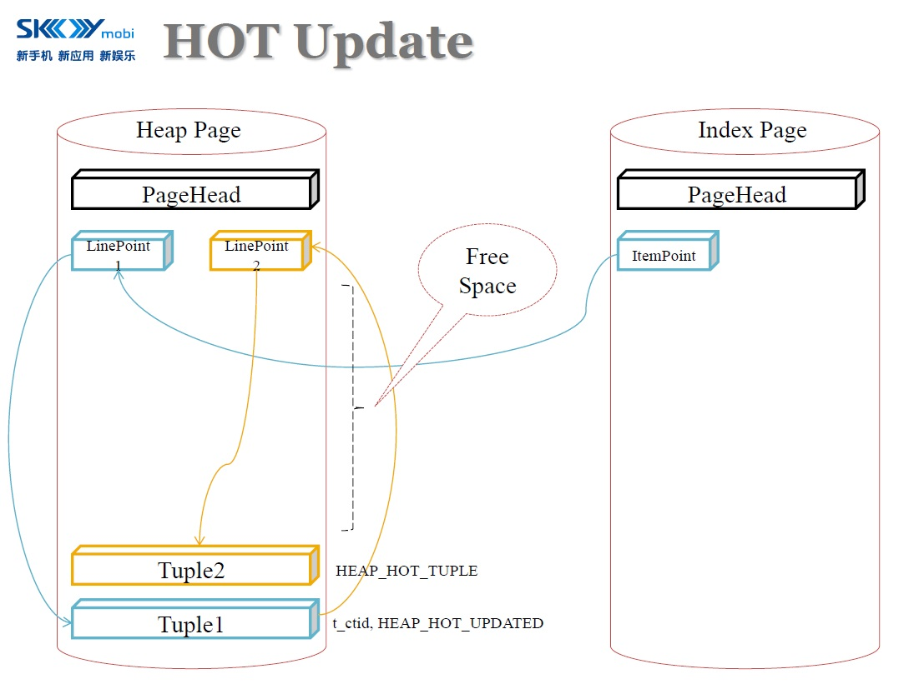
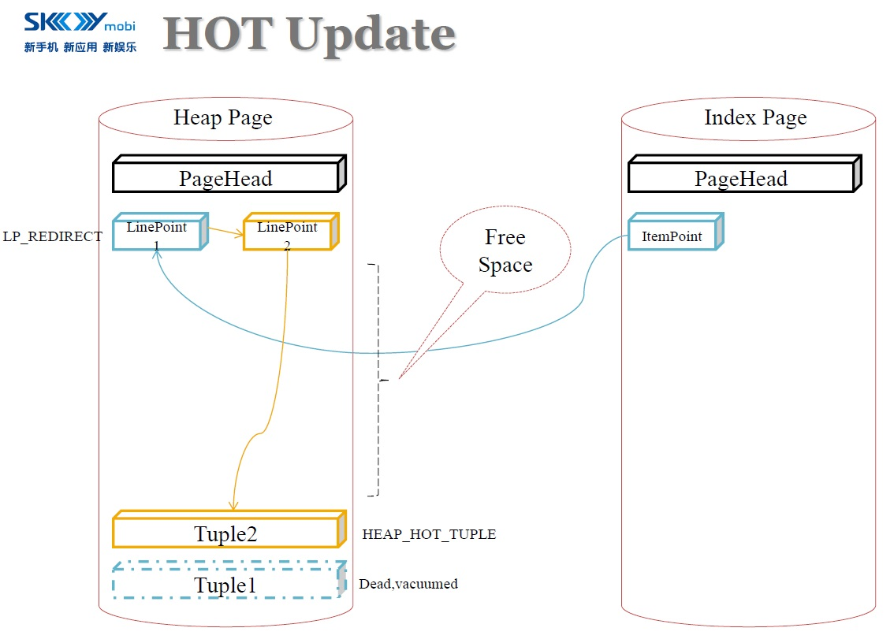
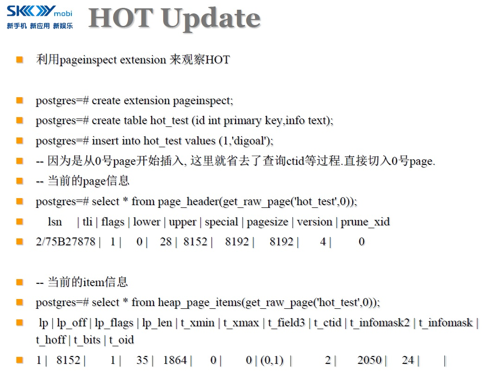
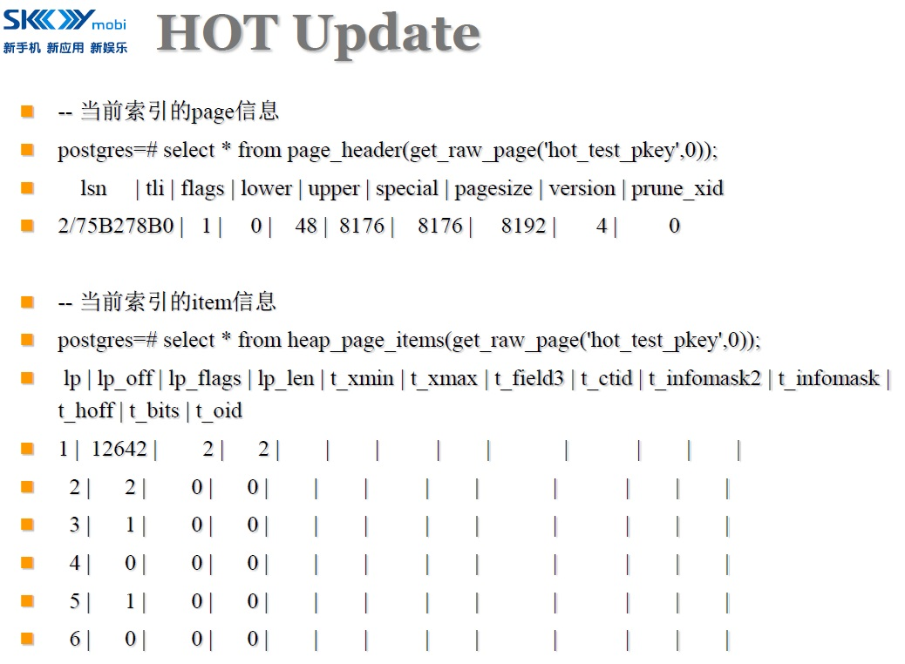
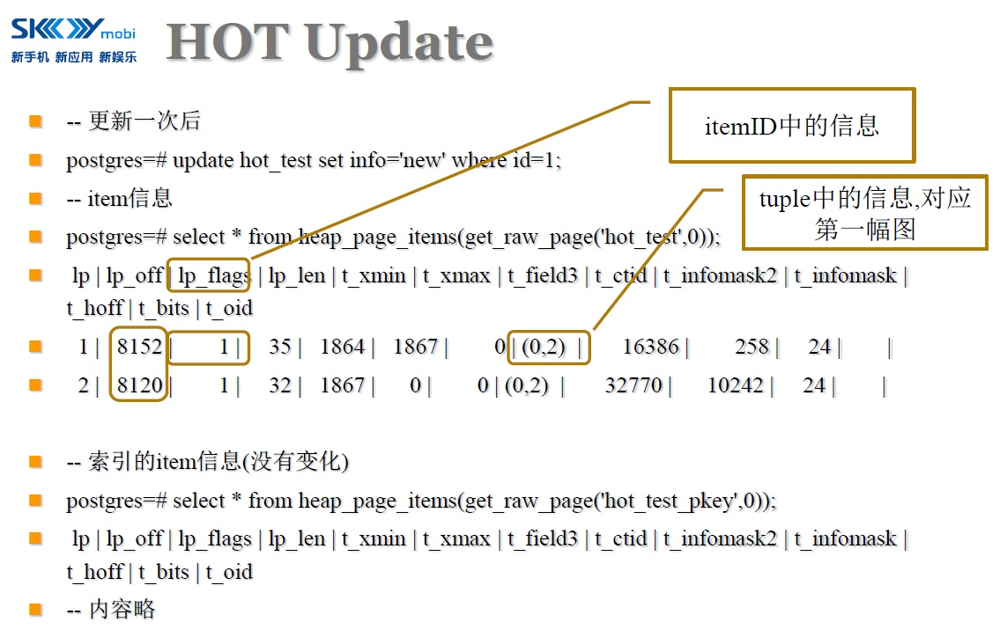
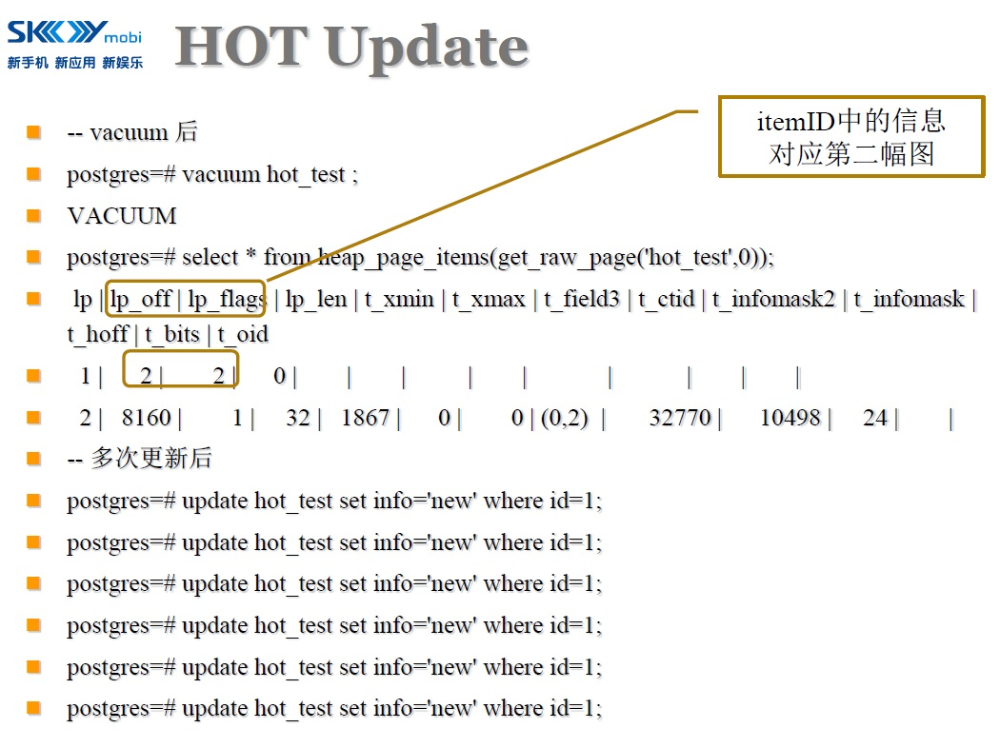
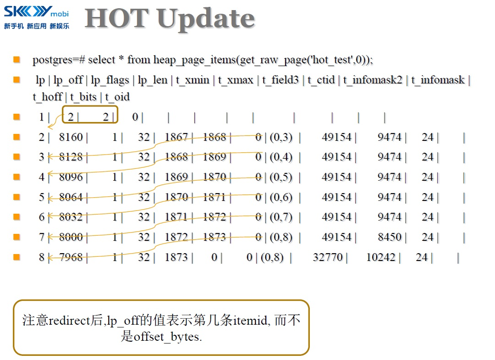
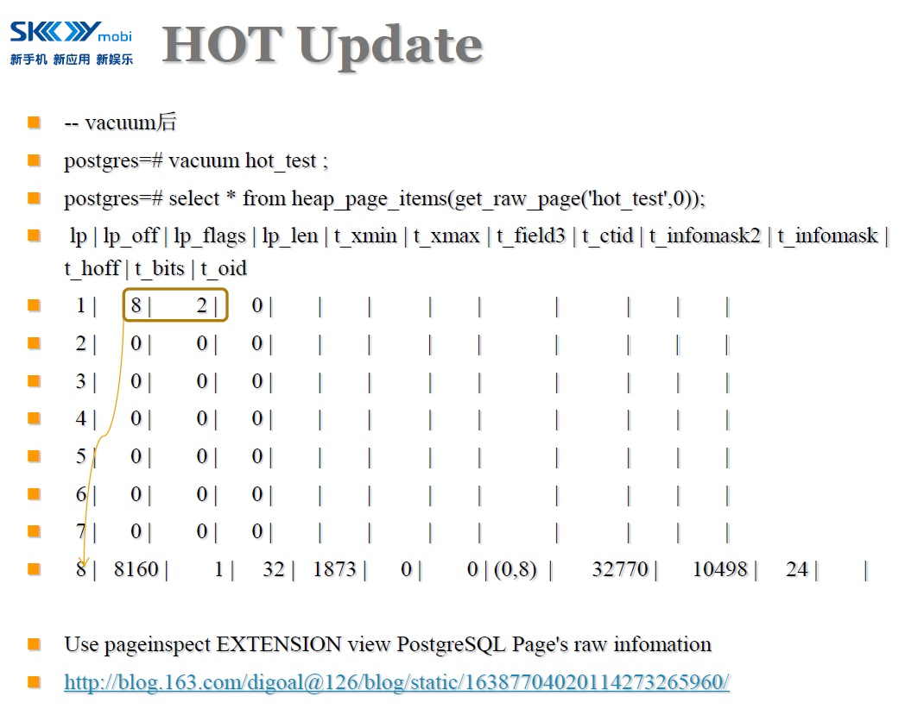

## PostgreSQL 11 preview - Surjective indexes - 索引HOT增强（表达式）update评估  
                                                           
### 作者                                                           
digoal                                                           
                                                           
### 日期                                                           
2018-02-15                                                         
                                                           
### 标签                                                           
PostgreSQL , 表达式索引 , 表达式结果变化评估 , projection function , 多值索引 , GIN , 多值元素变化         
                                                           
----                                                           
                                                           
## 背景     
PostgreSQL 11马上要提交的一个PATCH，可以更亲和的使用HOT，大幅增强表达式索引的更新性能。  
  
背景技术是HOT，当更新某一条记录时，如果被索引的字段值没有变化，同时被更新记录的新版本与老版本在同一个HEAP PAGE中，那么索引不需要增加冗余ENTRY。从而发生HOT更新。  
  
  
  
  
  
  
  
  
  
  
  
  
  
  
  
  
  
  
  
  
  
但是，我们想一下，表达式索引和普通字段索引的区别，实际上表达式索引并不一定随字段值的变化而变化。  
  
### 例1  
  
bookinfo是一个JSONB类型，我们对isbn这个KEY建了索引。  
  
  
```  
(bookinfo->>'isbn')  
```  
  
仅仅当isbn的值发生变化时，这个表达式的结果才会变化。而bookinfo的其他部分变化，实际上索引都不需要变化。  
  
  
### 例2  
又比如这样一个表达式索引，当mod_time的时间变更后，如果新值在同一个小时内，那么这个表达式的结果也没有变化  
  
```  
to_char(mod_time, 'yyyymmddhh24')  
```  
  
如  
  
```  
'2018-02-15 10:11:10'  
  
'2018-02-15 10:30:15'  
```  
  
以往PostgreSQL HOT的判断只针对字段值是否变化，而不判断表达式的结果是否变化。所以表达式索引实际上是有可能出现更高几率的HOT的。  
  
## recheck_on_update参数，决定是否在更新后评估表达式的值是否变化  
PostgreSQL 11新增了一个索引OPTION：  
  
```  
recheck_on_update   
  
Functional index is based on on projection function:   
function which extract subset of its argument.  
In mathematic such functions are called non-injective.   
  
injective函数随参数变化，返回结果也会变化。  
  
For injective function if any attribute used in the indexed   
expression is changed, then value of index expression is also changed.   
So to check that index is affected by the update,   
it is enough to check the set of changed fields.   
  
non-injective函数，参数值变化，返回结果不一定变化。  
  
recheck_on_update默认为true，并认为表达式为non-injective函数  
  
By default this parameters is assigned true value and function is considered  
as non-injective.  
  
In this case change of any of indexed key doesn't mean that value of the function is changed.   
For example, for the expression (bookinfo->>'isbn') defined  
for column of JSON type is changed only when ISBN is changed, which rarely happen.   
The same is true for most functional indexes.   
  
开启recheck_on_update时，需要用到old tuple和new tuple对表达式索引的表达式结果评估，并判断结果是否不一致。不一致则不发生HOT。  
  
For non-injective functions,   
Postgres compares values of indexed expression for old and updated tuple and updates   
index only when function results are different.   
It allows to eliminate index update and use HOT update.   
But there are extra evaluations of the functions.   
  
So if function is expensive or probability that change of indexed column will not   
effect the function value is small,   
then marking index as recheck_on_update may increase update speed.  
```  
  
recheck_on_update默认为true，表示UPDATE时，如果表达式涉及字段值发生了变化，那么一定会重新评估表达式的值是否变化，如果表达式值没有变化，会更大程度的使用HOT。减少索引更新。  
  
recheck_on_update设置为false，表示UPDATE时不一定评估表达式的值，取决于表达式的成本，成本很高，则不评估，只要表达式涉及字段变化，就需要更新索引。表达式成本低于阈值则可能评估。(参考```IsProjectionFunctionalIndex```, (```index_expr_cost.startup + index_expr_cost.per_tuple > MAX_HOT_INDEX_EXPR_COST)```)  
  
```  
typedef enum IndexAttrBitmapKind  
{  
	INDEX_ATTR_BITMAP_HOT,  
	INDEX_ATTR_BITMAP_PROJ,  
	INDEX_ATTR_BITMAP_KEY,  
	INDEX_ATTR_BITMAP_PRIMARY_KEY,  
	INDEX_ATTR_BITMAP_IDENTITY_KEY  
  
  
+#define MAX_HOT_INDEX_EXPR_COST 1000  
+  
+/*  
+ * Check if functional index is projection: index expression returns some subset of  
+ * its argument values. During hot update check projection indexes are handled in special way:  
+ * instead of checking if any of attributes used in indexed expression was updated,  
+ * we should calculate and compare values of index expression for old and new tuple values.  
+ *  
+ * Decision made by this function is based on two sources:  
+ * 1. Calculated cost of index expression: if it is higher than some threshold (1000) then  
+ *    extra comparison of index expression values is expected to be too expensive.  
+ * 2. "projection" index option explicitly set by user. This setting overrides 1) and 2)  
+ */  
+static bool IsProjectionFunctionalIndex(Relation index, IndexInfo* ii)  
+{  
+	bool is_projection = false;  
+  
+	if (ii->ii_Expressions)  
+	{  
+		HeapTuple       tuple;  
+		Datum           reloptions;  
+		bool            isnull;  
+		QualCost index_expr_cost;  
+  
+		is_projection = true; /* by default functional index is considered as non-injective */  
+  
+		cost_qual_eval(&index_expr_cost, ii->ii_Expressions, NULL);  
+		/*  
+		 * If index expression is too expensive, then disable projection optimization, because  
+		 * extra evaluation of index expression is expected to be more expensive than index update.  
+		 * Current implementation of projection optimization has to calculate index expression twice  
+		 * in case of hit (value of index expression is not changed) and three times if values are different.  
+		 */  
+		if (index_expr_cost.startup + index_expr_cost.per_tuple > MAX_HOT_INDEX_EXPR_COST)  
+		{  
+			is_projection = false;  
+		}  
+  
+		tuple = SearchSysCache1(RELOID, ObjectIdGetDatum(RelationGetRelid(index)));  
+		if (!HeapTupleIsValid(tuple))  
+			elog(ERROR, "cache lookup failed for relation %u", RelationGetRelid(index));  
+  
+		reloptions = SysCacheGetAttr(RELOID, tuple,  
+									 Anum_pg_class_reloptions, &isnull);  
+		if (!isnull)  
+		{  
+			GenericIndexOpts *idxopts = (GenericIndexOpts *)index_generic_reloptions(reloptions, false);  
+			if (idxopts != NULL)  
+			{  
+				is_projection = idxopts->recheck_on_update;  
+				pfree(idxopts);  
+			}  
+		}  
+		ReleaseSysCache(tuple);  
+	}  
+	return is_projection;  
+}  
```  
  
## 使用举例  
  
1、设置recheck_on_update=false，则表达式索引无法使用HOT。  
  
```  
create table keyvalue(id integer primary key, info jsonb);  
  
create index nameindex on keyvalue((info->>'name')) with (recheck_on_update=false);  
  
insert into keyvalue values (1, '{"name": "john", "data": "some data"}');  
  
update keyvalue set info='{"name": "john", "data": "some other data"}' where id=1;  
  
select pg_stat_get_xact_tuples_hot_updated('keyvalue'::regclass);  
  
 pg_stat_get_xact_tuples_hot_updated   
-------------------------------------  
                                   0  
(1 row)  
```  
  
  
2、设置recheck_on_update=true，则表达式索引可以使用HOT。并且强制要求每次UPDATE后，如果表达式涉及的字段发生变化，那么评估表达式的值。  
  
```  
drop table keyvalue;  
  
create table keyvalue(id integer primary key, info jsonb);  
  
create index nameindex on keyvalue((info->>'name')) with (recheck_on_update=true);  
  
insert into keyvalue values (1, '{"name": "john", "data": "some data"}');  
  
-- 表达式结果不变  
update keyvalue set info='{"name": "john", "data": "some other data"}' where id=1;  
  
select pg_stat_get_xact_tuples_hot_updated('keyvalue'::regclass);  
  
 pg_stat_get_xact_tuples_hot_updated   
-------------------------------------  
                                   1  
(1 row)  
  
-- 表达式结果变化  
update keyvalue set info='{"name": "smith", "data": "some other data"}' where id=1;  
  
select pg_stat_get_xact_tuples_hot_updated('keyvalue'::regclass);  
 pg_stat_get_xact_tuples_hot_updated   
-------------------------------------  
                                   1  
(1 row)  
  
-- 表达式结果不变  
update keyvalue set info='{"name": "smith", "data": "some more data"}' where id=1;  
  
select pg_stat_get_xact_tuples_hot_updated('keyvalue'::regclass);  
 pg_stat_get_xact_tuples_hot_updated   
-------------------------------------  
                                   2  
(1 row)  
```  
  
3、不设置recheck_on_update，则表达式索引可以使用HOT。并且是否评估表达式的值，还取决于表达式的成本与阈值，成本很高，则不评估，只要表达式涉及字段变化，就需要更新索引。表达式成本低于阈值则可能评估。  
  
```  
drop table keyvalue;  
  
create table keyvalue(id integer primary key, info jsonb);  
  
create index nameindex on keyvalue((info->>'name'));  
  
insert into keyvalue values (1, '{"name": "john", "data": "some data"}');  
  
-- 表达式结果不变  
update keyvalue set info='{"name": "john", "data": "some other data"}' where id=1;  
  
select pg_stat_get_xact_tuples_hot_updated('keyvalue'::regclass);  
 pg_stat_get_xact_tuples_hot_updated   
-------------------------------------  
                                   1  
(1 row)  
  
-- 表达式结果变化  
update keyvalue set info='{"name": "smith", "data": "some other data"}' where id=1;  
  
select pg_stat_get_xact_tuples_hot_updated('keyvalue'::regclass);  
 pg_stat_get_xact_tuples_hot_updated   
-------------------------------------  
                                   1  
(1 row)  
  
-- 表达式结果不变  
update keyvalue set info='{"name": "smith", "data": "some more data"}' where id=1;  
  
select pg_stat_get_xact_tuples_hot_updated('keyvalue'::regclass);  
 pg_stat_get_xact_tuples_hot_updated   
-------------------------------------  
                                   2  
(1 row)  
  
drop table keyvalue;  
```  
  
## 多值类型索引  
  
以此类推，多值类型的索引，实际上元素可能有变化，也可能没有变化，也可以借鉴同样的思路，提高多值类型的HOT概率。  
  
```  
array  
  
hstore  
  
json  
  
jsonb  
```  
  
索引是否需要变化，取决于元素是否变化，NEW TUPLE是否还在同一个HEAP PAGE。  
  
## 小结
PostgreSQL 11 Surjective indexes功能，新增recheck_on_update索引选项，使得表达式索引也能用上HOT特性（降低索引冗余概率）。对于non-injective函数、表达式索引，参数值变化，返回结果不一定变化。特别适用。    
    
## 参考  
  
https://www.postgresql.org/message-id/attachment/57692/projection-7.patch  
  
https://commitfest.postgresql.org/17/1152/  
  
src/backend/access/heap/README.HOT  
  
[《Use pageinspect EXTENSION view PostgreSQL Page's raw infomation》](../201105/20110527_02.md)    
  
<a rel="nofollow" href="http://info.flagcounter.com/h9V1"  ></a>  
  
  
  
  
  
  
## [digoal's 大量PostgreSQL文章入口](https://github.com/digoal/blog/blob/master/README.md "22709685feb7cab07d30f30387f0a9ae")
  
