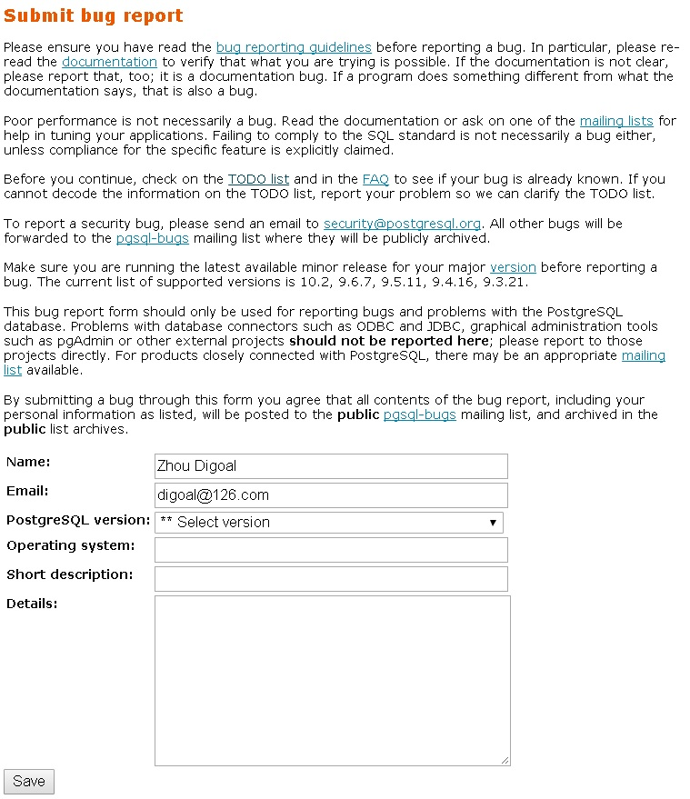

## PostgreSQL 11 preview - SQL:2011 window frame clause全面支持 及 窗口、帧用法和业务场景介绍    
                                                             
### 作者                                                             
digoal                                                             
                                                             
### 日期                                                             
2018-02-24                                                           
                                                             
### 标签                                                             
PostgreSQL , window , frame , 窗口 , 帧 , 窗口函数 , 聚合函数 , range , rows , groups           
                                                             
----                                                             
                                                             
## 背景    
PostgreSQL 在2009年发布的8.4版本中，就已经支持了window语法，frame clause有部分未支持。    
    
PostgreSQL 11将全面覆盖SQL:2011的窗口语法。    
    
提交的PATCH介绍如下：    
    
    
https://git.postgresql.org/gitweb/?p=postgresql.git;a=commit;h=0a459cec96d3856f476c2db298c6b52f592894e8    
    
```    
Support all SQL:2011 options for window frame clauses.    
    
This patch adds the ability to use "RANGE offset PRECEDING/FOLLOWING"    
frame boundaries in window functions.  We'd punted on that back in the    
original patch to add window functions, because it was not clear how to    
do it in a reasonably data-type-extensible fashion.  That problem is    
resolved here by adding the ability for btree operator classes to provide    
an "in_range" support function that defines how to add or subtract the    
RANGE offset value.  Factoring it this way also allows the operator class    
to avoid overflow problems near the ends of the datatype's range, if it    
wishes to expend effort on that.  (In the committed patch, the integer    
opclasses handle that issue, but it did not seem worth the trouble to    
avoid overflow failures for datetime types.)    
    
The patch includes in_range support for the integer_ops opfamily    
(int2/int4/int8) as well as the standard datetime types.  Support for    
other numeric types has been requested, but that seems like suitable    
material for a follow-on patch.    
    
In addition, the patch adds GROUPS mode which counts the offset in    
ORDER-BY peer groups rather than rows, and it adds the frame_exclusion    
options specified by SQL:2011.  As far as I can see, we are now fully    
up to spec on window framing options.    
    
Existing behaviors remain unchanged, except that I changed the errcode    
for a couple of existing error reports to meet the SQL spec's expectation    
that negative "offset" values should be reported as SQLSTATE 22013.    
    
Internally and in relevant parts of the documentation, we now consistently    
use the terminology "offset PRECEDING/FOLLOWING" rather than "value    
PRECEDING/FOLLOWING", since the term "value" is confusingly vague.    
    
Oliver Ford, reviewed and whacked around some by me    
    
Discussion: https://postgr.es/m/CAGMVOdu9sivPAxbNN0X+q19Sfv9edEPv=HibOJhB14TJv_RCQg@mail.gmail.com    
```    
    
## 部署PG 11并测试新增的功能    
1、下载PG 11    
    
https://www.postgresql.org/ftp/snapshot/dev/    
    
2、安装、初始化、启动数据库（略）    
    
3、测试新增功能用到的SQL如下（回归测试SQL）    
    
https://git.postgresql.org/gitweb/?p=postgresql.git;a=blobdiff;f=src/test/regress/expected/window.out;h=b675487729b7a51ac2f668fc4668c9d6817d2856;hp=19f909f3d105087c2babcfa62ff3a77d442a3b03;hb=0a459cec96d3856f476c2db298c6b52f592894e8;hpb=23209457314f6fd89fcd251a8173b0129aaa95a2    
    
我们也可以自己测试，新增一张测试表    
    
```    
create table t(    
  sid int,     -- 学号    
  sub int2,    -- 科目    
  des text,    -- 科目描述    
  score float4    -- 分数    
);    
```    
    
写入测试数据    
    
```    
insert into t values     
  (1, 1, '语文', 81),    
  (2, 1, '语文', 71),    
  (3, 1, '语文', 99),    
  (4, 1, '语文', 100),    
  (5, 1, '语文', 32),    
  (6, 1, '语文', 89),    
  (7, 1, '语文', 90.5),    
  (1, 2, '数学', 81),    
  (2, 2, '数学', 96),    
  (3, 2, '数学', 78),    
  (4, 2, '数学', 90),    
  (5, 2, '数学', 12),    
  (6, 2, '数学', 97),    
  (7, 2, '数学', 99.5),    
  (1, 3, '英语', 100),    
  (2, 3, '英语', 95),    
  (3, 3, '英语', 95),    
  (4, 3, '英语', 95),    
  (5, 3, '英语', 56),    
  (6, 3, '英语', 87),    
  (7, 3, '英语', 93),    
  (1, 4, '物理', 60),    
  (2, 4, '物理', 60),    
  (3, 4, '物理', 65),    
  (4, 4, '物理', 65),    
  (5, 4, '物理', 65),    
  (6, 4, '物理', 71),    
  (7, 4, '物理', 71)    
;    
```    
    
发现一例BUG，已上报。(5小时后，社区修复了这个BUG)。当使用range between and时，如果同时使用了partition by, range好像没有起作用(而是使用了整个window)。    
    
正常情况下，应该是在window的分组内，range会控制对应的frame。    
   
以下为BUG版的输出。  
  
```    
select     
  *,     
  sum(score) over w1,     
  avg(score) over w1,     
  first_value(score) over w1,     
  last_value(score) over w1     
from t     
  window w1 as (partition by sub order by score::int range between 1 preceding and 6 following)     
order by sub, score;    
    
    
 sid | sub | des  | score | sum |         avg         | first_value | last_value     
-----+-----+------+-------+-----+---------------------+-------------+------------    
   5 |   1 | 语文 |    32 | 562 | 80.2857142857142857 |          32 |        100    
   2 |   1 | 语文 |    71 | 562 | 80.2857142857142857 |          32 |        100    
   1 |   1 | 语文 |    81 | 562 | 80.2857142857142857 |          32 |        100    
   6 |   1 | 语文 |    89 | 562 | 80.2857142857142857 |          32 |        100    
   7 |   1 | 语文 |    90 | 562 | 80.2857142857142857 |          32 |        100    
   3 |   1 | 语文 |    99 | 562 | 80.2857142857142857 |          32 |        100    
   4 |   1 | 语文 |   100 | 562 | 80.2857142857142857 |          32 |        100    
   5 |   2 | 数学 |    12 | 554 | 79.1428571428571429 |          12 |        100    
   3 |   2 | 数学 |    78 | 554 | 79.1428571428571429 |          12 |        100    
   1 |   2 | 数学 |    81 | 554 | 79.1428571428571429 |          12 |        100    
   4 |   2 | 数学 |    90 | 554 | 79.1428571428571429 |          12 |        100    
   2 |   2 | 数学 |    96 | 554 | 79.1428571428571429 |          12 |        100    
   6 |   2 | 数学 |    97 | 554 | 79.1428571428571429 |          12 |        100    
   7 |   2 | 数学 |   100 | 554 | 79.1428571428571429 |          12 |        100    
   5 |   3 | 英语 |    56 | 621 | 88.7142857142857143 |          56 |        100    
   6 |   3 | 英语 |    87 | 621 | 88.7142857142857143 |          56 |        100    
   7 |   3 | 英语 |    93 | 621 | 88.7142857142857143 |          56 |        100    
   3 |   3 | 英语 |    95 | 621 | 88.7142857142857143 |          56 |        100    
   4 |   3 | 英语 |    95 | 621 | 88.7142857142857143 |          56 |        100    
   2 |   3 | 英语 |    95 | 621 | 88.7142857142857143 |          56 |        100    
   1 |   3 | 英语 |   100 | 621 | 88.7142857142857143 |          56 |        100    
   1 |   4 | 物理 |    60 | 457 | 65.2857142857142857 |          60 |         71    
   2 |   4 | 物理 |    60 | 457 | 65.2857142857142857 |          60 |         71    
   3 |   4 | 物理 |    65 | 457 | 65.2857142857142857 |          60 |         71    
   4 |   4 | 物理 |    65 | 457 | 65.2857142857142857 |          60 |         71    
   5 |   4 | 物理 |    65 | 457 | 65.2857142857142857 |          60 |         71    
   6 |   4 | 物理 |    71 | 457 | 65.2857142857142857 |          60 |         71    
   7 |   4 | 物理 |    71 | 457 | 65.2857142857142857 |          60 |         71    
(28 rows)    
```    
  
正确结果如下：  
  
```  
 sid | sub | des  | score | sum |         avg          | first_value | last_value   
-----+-----+------+-------+-----+----------------------+-------------+------------  
   5 |   1 | 语文 |    32 |  32 |  32.0000000000000000 |          32 |         32  
   2 |   1 | 语文 |    71 |  71 |  71.0000000000000000 |          71 |         71  
   1 |   1 | 语文 |    81 |  81 |  81.0000000000000000 |          81 |         81  
   6 |   1 | 语文 |    89 | 179 |  89.5000000000000000 |          89 |         90  -- 帧框到了多条记录  
   7 |   1 | 语文 |    90 | 179 |  89.5000000000000000 |          89 |         90  
   3 |   1 | 语文 |    99 | 199 |  99.5000000000000000 |          99 |        100  
   4 |   1 | 语文 |   100 | 199 |  99.5000000000000000 |          99 |        100  
   5 |   2 | 数学 |    12 |  12 |  12.0000000000000000 |          12 |         12  
   3 |   2 | 数学 |    78 | 159 |  79.5000000000000000 |          78 |         81  
   1 |   2 | 数学 |    81 |  81 |  81.0000000000000000 |          81 |         81  
   4 |   2 | 数学 |    90 | 186 |  93.0000000000000000 |          90 |         96  
   2 |   2 | 数学 |    96 | 293 |  97.6666666666666667 |          96 |        100  
   6 |   2 | 数学 |    97 | 293 |  97.6666666666666667 |          96 |        100  
   7 |   2 | 数学 |   100 | 100 | 100.0000000000000000 |         100 |        100  
   5 |   3 | 英语 |    56 |  56 |  56.0000000000000000 |          56 |         56  
   6 |   3 | 英语 |    87 | 180 |  90.0000000000000000 |          87 |         93  
   7 |   3 | 英语 |    93 | 378 |  94.5000000000000000 |          93 |         95  
   3 |   3 | 英语 |    95 | 385 |  96.2500000000000000 |          95 |        100  
   4 |   3 | 英语 |    95 | 385 |  96.2500000000000000 |          95 |        100  
   2 |   3 | 英语 |    95 | 385 |  96.2500000000000000 |          95 |        100  
   1 |   3 | 英语 |   100 | 100 | 100.0000000000000000 |         100 |        100  
   1 |   4 | 物理 |    60 | 315 |  63.0000000000000000 |          60 |         65 -- range以peer group最大边界为帧范围  
   2 |   4 | 物理 |    60 | 315 |  63.0000000000000000 |          60 |         65 -- (60*2+65*3)/5 = 63  
   3 |   4 | 物理 |    65 | 337 |  67.4000000000000000 |          65 |         71  
   4 |   4 | 物理 |    65 | 337 |  67.4000000000000000 |          65 |         71  
   5 |   4 | 物理 |    65 | 337 |  67.4000000000000000 |          65 |         71  
   6 |   4 | 物理 |    71 | 142 |  71.0000000000000000 |          71 |         71  
   7 |   4 | 物理 |    71 | 142 |  71.0000000000000000 |          71 |         71  
(28 rows)  
```  
    
当不使用partition by时，range控制的frame范围起作用了。    
    
```    
select     
  *,     
  sum(score) over w1,     
  avg(score) over w1,     
  first_value(score) over w1,     
  last_value(score) over w1     
from t     
  window w1 as (order by score::int range between 1 preceding and 6 following)     
order by score;    
    
 sid | sub | des  | score | sum |         avg         | first_value | last_value     
-----+-----+------+-------+-----+---------------------+-------------+------------    
   5 |   2 | 数学 |    12 |  12 | 12.0000000000000000 |          12 |         12    
   5 |   1 | 语文 |    32 |  32 | 32.0000000000000000 |          32 |         32    
   5 |   3 | 英语 |    56 | 176 | 58.6666666666666667 |          56 |         60    
   1 |   4 | 物理 |    60 | 315 | 63.0000000000000000 |          60 |         65    
   2 |   4 | 物理 |    60 | 315 | 63.0000000000000000 |          60 |         65    
   3 |   4 | 物理 |    65 | 408 | 68.0000000000000000 |          65 |         71    
   4 |   4 | 物理 |    65 | 408 | 68.0000000000000000 |          65 |         71    
   5 |   4 | 物理 |    65 | 408 | 68.0000000000000000 |          65 |         71    
   6 |   4 | 物理 |    71 | 213 | 71.0000000000000000 |          71 |         71    
   7 |   4 | 物理 |    71 | 213 | 71.0000000000000000 |          71 |         71    
   2 |   1 | 语文 |    71 | 213 | 71.0000000000000000 |          71 |         71    
   3 |   2 | 数学 |    78 | 240 | 80.0000000000000000 |          78 |         81    
   1 |   1 | 语文 |    81 | 249 | 83.0000000000000000 |          81 |         87    
   1 |   2 | 数学 |    81 | 249 | 83.0000000000000000 |          81 |         87    
   6 |   3 | 英语 |    87 | 449 | 89.8000000000000000 |          87 |         93    
   6 |   1 | 语文 |    89 | 647 | 92.4285714285714286 |          89 |         95    
   7 |   1 | 语文 |    90 | 743 | 92.8750000000000000 |          89 |         96    
   4 |   2 | 数学 |    90 | 743 | 92.8750000000000000 |          89 |         96    
   7 |   3 | 英语 |    93 | 670 | 95.7142857142857143 |          93 |         99    
   3 |   3 | 英语 |    95 | 877 | 97.4444444444444444 |          95 |        100    
   2 |   3 | 英语 |    95 | 877 | 97.4444444444444444 |          95 |        100    
   4 |   3 | 英语 |    95 | 877 | 97.4444444444444444 |          95 |        100    
   2 |   2 | 数学 |    96 | 877 | 97.4444444444444444 |          95 |        100    
   6 |   2 | 数学 |    97 | 592 | 98.6666666666666667 |          96 |        100    
   3 |   1 | 语文 |    99 | 399 | 99.7500000000000000 |          99 |        100    
   7 |   2 | 数学 |   100 | 399 | 99.7500000000000000 |          99 |        100    
   4 |   1 | 语文 |   100 | 399 | 99.7500000000000000 |          99 |        100    
   1 |   3 | 英语 |   100 | 399 | 99.7500000000000000 |          99 |        100    
(28 rows)    
```    
  
### 社区力量，用户福音，5小时修复BUG  
社区响应用户提交BUG，修复BUG的速度很给力，PostgreSQL社区给予用户强大的信心。  
  
如Bruce momjian说的，一个用户提交的BUG一般在12小时内社区会响应。  
  
附上提交BUG的方法：  
  
https://www.postgresql.org/support/  
  
https://www.postgresql.org/account/submitbug/  
  
  
  
```  
提交BUG：  
From:	PG Bug reporting form <noreply(at)postgresql(dot)org>  
To:	pgsql-bugs(at)lists(dot)postgresql(dot)org  
Cc:	digoal(at)126(dot)com  
Subject:	BUG #15082: PostgreSQL 11 dev bug with window range partition by QUERY  
Date:	2018-02-23 15:16:39  
  
修复：  
From:	Tom Lane <tgl(at)sss(dot)pgh(dot)pa(dot)us>  
To:	digoal(at)126(dot)com  
Cc:	pgsql-bugs(at)lists(dot)postgresql(dot)org  
Subject:	Re: BUG #15082: PostgreSQL 11 dev bug with window range partition by QUERY  
Date:	2018-02-23 20:12:31  
Message-ID:	22042.1519416751@sss.pgh.pa.us (view raw or download thread mbox)  
=?utf-8?q?PG_Bug_reporting_form?= <noreply(at)postgresql(dot)org> writes:  
> when i use frame clause(range), it's only right when don't use partition by,  
> and use the whole rows as one partition.  
> is it a bug?  
  
Yup.  Fixed, thanks.  
  
			regards, tom lane  
```  
  
patch如下  
  
https://git.postgresql.org/gitweb/?p=postgresql.git;a=commit;h=9fe802c8185e9a53158b6797d0f6fd8bfbb01af1  
  
```  
  
author	Tom Lane <tgl@sss.pgh.pa.us>	  
Sat, 24 Feb 2018 04:11:40 +0800 (15:11 -0500)  
committer	Tom Lane <tgl@sss.pgh.pa.us>	  
Sat, 24 Feb 2018 04:11:40 +0800 (15:11 -0500)  
commit	9fe802c8185e9a53158b6797d0f6fd8bfbb01af1  
tree	493273a7076eb287b6b00803346f93e47a3a7e55	tree | snapshot  
parent	8af87f411c151537b6e3315c2a191110c3fec494	commit | diff  
Fix brown-paper-bag bug in commit 0a459cec96d3856f476c2db298c6b52f592894e8.  
  
RANGE_OFFSET comparisons need to examine the first ORDER BY column,  
which isn't necessarily the first column in the incoming tuples.  
No idea how this slipped through initial testing.  
  
Per bug #15082 from Zhou Digoal.  
  
Discussion: https://postgr.es/m/151939899974.1461.9411971793110285476@wrigleys.postgresql.org  
```  
  
建议在提交BUG的时候，尽量的描述详细，能复现的问题写清楚复现方法，能引用的commit尽量引用，减少committer排查问题的时间。  
    
下面详细介绍窗口查询的语法。    
    
## 窗口查询语法介绍    
https://www.postgresql.org/docs/devel/static/sql-expressions.html#SYNTAX-WINDOW-FUNCTIONS    
    
https://www.postgresql.org/docs/devel/static/sql-select.html    
    
大括号表示必选，中括号可选。    
    
1、仅window聚合函数，允许使用FILTER子句，表示只处理filter中WHERE TRUE的记录。    
    
```    
function_name ([expression [, expression ... ]]) [ FILTER ( WHERE filter_clause ) ] OVER window_name    
function_name ([expression [, expression ... ]]) [ FILTER ( WHERE filter_clause ) ] OVER ( window_definition )    
function_name ( * ) [ FILTER ( WHERE filter_clause ) ] OVER window_name    
function_name ( * ) [ FILTER ( WHERE filter_clause ) ] OVER ( window_definition )    
```    
    
2、窗口定义，where window_definition has the syntax    
    
```    
[ existing_window_name ]    
[ PARTITION BY expression [, ...] ]    
[ ORDER BY expression [ ASC | DESC | USING operator ] [ NULLS { FIRST | LAST } ] [, ...] ]    
[ frame_clause ]    
```    
    
3、帧定义，The optional frame_clause can be one of    
    
rows 表示前后多少行。    
    
groups 表示前后多少组。    
    
**例如1,1,1,2,2,3,3,3,4,5,6的顺序值。当前记录=3的任意一条时，前后1组表示2,2,3,3,3,4；当前记录=2的任意一条时，前1组以及current row表示1,1,1,2,2。**    
    
range, groups的边界都是以peer的最外围作为边界，例如字段值 1,1,1,2,3,3，边界是1或者3时，包含所有的1以及所有的3。    
    
如果order by是一个表达式，那么边界以表达式的值来计算，如果多行表达式的值一致，那么这些行就是一组PEER。    
    
groups，相同表达式或列值作为一个peer簇，边界输入为前后N个簇。current_row表示包含当前行所在簇的最大范围。    
    
range，当前值的差值作为判断边界的条件。current_row表示包含当前行所在簇的最大范围。    
    
**目前range的offset仅支持int2,int4,int8,interval类型，对应类型int,date,time,timestamp,timestamptz，即类似数据库range类型的描述，order by表达式的类型决定了offset用到的类型**    
    
```    
{ RANGE | ROWS | GROUPS } frame_start [ frame_exclusion ]    
{ RANGE | ROWS | GROUPS } BETWEEN frame_start AND frame_end [ frame_exclusion ]    
```    
    
4、帧的开始和结束定义，where frame_start and frame_end can be one of    
    
```    
UNBOUNDED PRECEDING    
offset PRECEDING    
CURRENT ROW    
offset FOLLOWING    
UNBOUNDED FOLLOWING    
```    
    
默认为 between UNBOUNDED PRECEDING and CURRENT ROW。    
    
**注意：如果window中未定义order by，那么整个window就是一个group，或者整个window就是一个frame。**    
    
5、帧的不包含定义，and frame_exclusion can be one of    
    
```    
EXCLUDE CURRENT ROW，不包含当前行    
EXCLUDE GROUP，不包含当前行的所有peer行(当前行也不包含)，即order by表达式得到的值等值的行s。    
EXCLUDE TIES，不包含当前行的所有peer行，但是包含当前行。    
EXCLUDE NO OTHERS，不排除任何行。默认值。    
```    
    
## 窗口查询用法和业务场景举例    
### 窗口查询SQL用法    
1、查询与每门成绩第一名相差几分    
    
```    
select     
  *,     
  first_value(score) over w1 - score    
from t     
  window w1 as (partition by sub order by score desc)     
order by sub,score desc;    
    
 sid | sub | des  | score | ?column?     
-----+-----+------+-------+----------    
   4 |   1 | 语文 |   100 |        0    
   3 |   1 | 语文 |    99 |        1    
   7 |   1 | 语文 |    90 |       10    
   6 |   1 | 语文 |    89 |       11    
   1 |   1 | 语文 |    81 |       19    
   2 |   1 | 语文 |    71 |       29    
   5 |   1 | 语文 |    32 |       68    
   7 |   2 | 数学 |   100 |        0    
   6 |   2 | 数学 |    97 |        3    
   2 |   2 | 数学 |    96 |        4    
   4 |   2 | 数学 |    90 |       10    
   1 |   2 | 数学 |    81 |       19    
   3 |   2 | 数学 |    78 |       22    
   5 |   2 | 数学 |    12 |       88    
   1 |   3 | 英语 |   100 |        0    
   2 |   3 | 英语 |    95 |        5    
   3 |   3 | 英语 |    95 |        5    
   4 |   3 | 英语 |    95 |        5    
   7 |   3 | 英语 |    93 |        7    
   6 |   3 | 英语 |    87 |       13    
   5 |   3 | 英语 |    56 |       44    
   7 |   4 | 物理 |    71 |        0    
   6 |   4 | 物理 |    71 |        0    
   3 |   4 | 物理 |    65 |        6    
   4 |   4 | 物理 |    65 |        6    
   5 |   4 | 物理 |    65 |        6    
   1 |   4 | 物理 |    60 |       11    
   2 |   4 | 物理 |    60 |       11    
(28 rows)    
```    
    
2、查询每门成绩排行，并列时，消耗计数    
    
```    
select     
  *,     
  rank() over w1     
from t     
  window w1 as (partition by sub order by score desc)     
order by sub,score desc;    
    
 sid | sub | des  | score | rank     
-----+-----+------+-------+------    
   4 |   1 | 语文 |   100 |    1    
   3 |   1 | 语文 |    99 |    2    
   7 |   1 | 语文 |    90 |    3    
   6 |   1 | 语文 |    89 |    4    
   1 |   1 | 语文 |    81 |    5    
   2 |   1 | 语文 |    71 |    6    
   5 |   1 | 语文 |    32 |    7    
   7 |   2 | 数学 |   100 |    1    
   6 |   2 | 数学 |    97 |    2    
   2 |   2 | 数学 |    96 |    3    
   4 |   2 | 数学 |    90 |    4    
   1 |   2 | 数学 |    81 |    5    
   3 |   2 | 数学 |    78 |    6    
   5 |   2 | 数学 |    12 |    7    
   1 |   3 | 英语 |   100 |    1    
   2 |   3 | 英语 |    95 |    2    
   3 |   3 | 英语 |    95 |    2    
   4 |   3 | 英语 |    95 |    2    
   7 |   3 | 英语 |    93 |    5    
   6 |   3 | 英语 |    87 |    6    
   5 |   3 | 英语 |    56 |    7    
   7 |   4 | 物理 |    71 |    1    
   6 |   4 | 物理 |    71 |    1    
   3 |   4 | 物理 |    65 |    3    
   4 |   4 | 物理 |    65 |    3    
   5 |   4 | 物理 |    65 |    3    
   1 |   4 | 物理 |    60 |    6    
   2 |   4 | 物理 |    60 |    6    
(28 rows)    
```    
    
3、查询与总分前一名的同学的单门分差    
    
```    
select     
  *,     
  coalesce(lag(score) over w1, score) - score    
from     
(    
select t.*,t1.rn from t join    
(    
  select sid, row_number() over(order by sum desc) as rn from (select sid,sum(score) from t group by sid) t    
) t1     
using (sid)    
) t     
  window w1 as (partition by sub order by rn)     
order by sub,rn;    
    
    
 sid | sub | des  | score | rn | ?column?     
-----+-----+------+-------+----+----------    
   7 |   1 | 语文 |    90 |  1 |        0    
   4 |   1 | 语文 |   100 |  2 |      -10    
   6 |   1 | 语文 |    89 |  3 |       11    
   3 |   1 | 语文 |    99 |  4 |      -10    
   2 |   1 | 语文 |    71 |  5 |       28    
   1 |   1 | 语文 |    81 |  6 |      -10    
   5 |   1 | 语文 |    32 |  7 |       49    
   7 |   2 | 数学 |   100 |  1 |        0    
   4 |   2 | 数学 |    90 |  2 |       10    
   6 |   2 | 数学 |    97 |  3 |       -7    
   3 |   2 | 数学 |    78 |  4 |       19    
   2 |   2 | 数学 |    96 |  5 |      -18    
   1 |   2 | 数学 |    81 |  6 |       15    
   5 |   2 | 数学 |    12 |  7 |       69    
   7 |   3 | 英语 |    93 |  1 |        0    
   4 |   3 | 英语 |    95 |  2 |       -2    
   6 |   3 | 英语 |    87 |  3 |        8    
   3 |   3 | 英语 |    95 |  4 |       -8    
   2 |   3 | 英语 |    95 |  5 |        0    
   1 |   3 | 英语 |   100 |  6 |       -5    
   5 |   3 | 英语 |    56 |  7 |       44    
   7 |   4 | 物理 |    71 |  1 |        0    
   4 |   4 | 物理 |    65 |  2 |        6    
   6 |   4 | 物理 |    71 |  3 |       -6    
   3 |   4 | 物理 |    65 |  4 |        6    
   2 |   4 | 物理 |    60 |  5 |        5    
   1 |   4 | 物理 |    60 |  6 |        0    
   5 |   4 | 物理 |    65 |  7 |       -5    
(28 rows)    
```    
    
4、查询每3个相邻分组的分数平均值，SUM值，COUNT值。    
    
需要使用group的帧语法，order by中每簇相同表达式的值，或者列的值，表示一个peer group。    
    
```    
select     
  *,     
  avg(score) over w1,    
  sum(score) over w1,    
  count(score) over w1,    
  first_value(score) over w1,    
  last_value(score) over w1    
from t     
  window w1 as (partition by sub order by score desc groups between 1 preceding and 1 following)     
order by sub,score desc;    
    
    
 sid | sub | des  | score |         avg         | sum | count | first_value | last_value     
-----+-----+------+-------+---------------------+-----+-------+-------------+------------    
   4 |   1 | 语文 |   100 | 99.5000000000000000 | 199 |     2 |         100 |         99    
   3 |   1 | 语文 |    99 | 96.3333333333333333 | 289 |     3 |         100 |         90    
   7 |   1 | 语文 |    90 | 92.6666666666666667 | 278 |     3 |          99 |         89    
   6 |   1 | 语文 |    89 | 86.6666666666666667 | 260 |     3 |          90 |         81    
   1 |   1 | 语文 |    81 | 80.3333333333333333 | 241 |     3 |          89 |         71    
   2 |   1 | 语文 |    71 | 61.3333333333333333 | 184 |     3 |          81 |         32    
   5 |   1 | 语文 |    32 | 51.5000000000000000 | 103 |     2 |          71 |         32    
   7 |   2 | 数学 |   100 | 98.5000000000000000 | 197 |     2 |         100 |         97    
   6 |   2 | 数学 |    97 | 97.6666666666666667 | 293 |     3 |         100 |         96    
   2 |   2 | 数学 |    96 | 94.3333333333333333 | 283 |     3 |          97 |         90    
   4 |   2 | 数学 |    90 | 89.0000000000000000 | 267 |     3 |          96 |         81    
   1 |   2 | 数学 |    81 | 83.0000000000000000 | 249 |     3 |          90 |         78    
   3 |   2 | 数学 |    78 | 57.0000000000000000 | 171 |     3 |          81 |         12    
   5 |   2 | 数学 |    12 | 45.0000000000000000 |  90 |     2 |          78 |         12    
   1 |   3 | 英语 |   100 | 96.2500000000000000 | 385 |     4 |         100 |         95    
   2 |   3 | 英语 |    95 | 95.6000000000000000 | 478 |     5 |         100 |         93    
   3 |   3 | 英语 |    95 | 95.6000000000000000 | 478 |     5 |         100 |         93    
   4 |   3 | 英语 |    95 | 95.6000000000000000 | 478 |     5 |         100 |         93    
   7 |   3 | 英语 |    93 | 93.0000000000000000 | 465 |     5 |          95 |         87    
   6 |   3 | 英语 |    87 | 78.6666666666666667 | 236 |     3 |          93 |         56    
   5 |   3 | 英语 |    56 | 71.5000000000000000 | 143 |     2 |          87 |         56    
   7 |   4 | 物理 |    71 | 67.4000000000000000 | 337 |     5 |          71 |         65  -- 物理的分数分布的边界最好理解    
   6 |   4 | 物理 |    71 | 67.4000000000000000 | 337 |     5 |          71 |         65    
   3 |   4 | 物理 |    65 | 65.2857142857142857 | 457 |     7 |          71 |         60    
   4 |   4 | 物理 |    65 | 65.2857142857142857 | 457 |     7 |          71 |         60    
   5 |   4 | 物理 |    65 | 65.2857142857142857 | 457 |     7 |          71 |         60    
   1 |   4 | 物理 |    60 | 63.0000000000000000 | 315 |     5 |          65 |         60    
   2 |   4 | 物理 |    60 | 63.0000000000000000 | 315 |     5 |          65 |         60    
(28 rows)    
```    
    
### 业务场景举例    
1、数据去重    
    
c1,c2字段重复时，保留crt_time最大的一条，其余删除。    
    
```    
delete from test1 where ctid = any(array(    
  select ctid from     
    (select row_number() over (partition by c1,c2 order by crt_time desc) as rn, ctid from test1) t     
  where t.rn<>1    
));      
```    
    
2、辐射统计    
    
每个学生，与它前后相差10分的学生，作为一个帧，计算他们的总分，平均值，学生数，最高分和最低分。    
    
```    
select     
  *,     
  sum(score) over w1,     
  avg(score) over w1,     
  count(*) over w1,    
  first_value(score) over w1,     
  last_value(score) over w1     
from t     
  window w1 as (partition by sub order by score::int range between 10 preceding and 10 following)     
order by sub, score;    
```    
    
3、滑窗分析    
    
```    
估值滑窗(最近7天UV)    
SELECT   
  date,   
  # hll_union_agg(users) OVER seven_days   
FROM daily_uniques   
  WINDOW seven_days AS (ORDER BY date ASC ROWS 6 PRECEDING);    
    
日UV     
select   
  count(distinct uid)   
from t where dt='2017-11-11';   
  
select # hll_uid from t where dt='2017-11-11';     
    
滑动分析：最近N天UV     
SELECT date,   
  # hll_union_agg(users) OVER seven_days   
FROM daily_uniques   
  WINDOW seven_days AS (ORDER BY date ASC ROWS 6 PRECEDING);     
    
每日流失UV     
SELECT   
  date,   
  (# hll_union_agg(users) OVER two_days) - # users AS lost_uniques   
FROM daily_uniques   
  WINDOW two_days AS (ORDER BY date ASC ROWS 1 PRECEDING);    
  
每日新增UV  
SELECT   
  date,   
  (# hll_union_agg(users) OVER two_days) -   
    (# lag(users) over (ORDER BY date ASC)) AS new_uniques   
FROM daily_uniques   
  WINDOW two_days AS (ORDER BY date ASC ROWS 1 PRECEDING);  
```    
   
## 小结
1、本文介绍了PostgreSQL窗口查询的用法。   
  
2、PostgreSQL 11完全兼容SQL:2011的window frame clause标准。   
  
3、目前range offset支持了numeric, float4, float8, int2, int4, int8, datetime, interval等类型，可以进行花式滑动分析。    
    
https://git.postgresql.org/gitweb/?p=postgresql.git;a=commit;h=8b29e88cdce17705f0b2c43e50219ce1d7d2f603   
    
## 参考    
https://www.postgresql.org/docs/devel/static/sql-expressions.html#SYNTAX-WINDOW-FUNCTIONS    
    
[《PostgreSQL、Greenplum 滑动窗口 分析SQL 实践》](../201711/20171129_01.md)      
    
[《车联网案例，轨迹清洗 - 阿里云RDS PostgreSQL最佳实践 - 窗口函数》](../201707/20170722_02.md)      
    
[《PostgreSQL 海量时序数据(任意滑动窗口实时统计分析) - 传感器、人群、物体等对象跟踪》](../201707/20170705_01.md)      
    
[《PostgreSQL 聚合表达式 FILTER , order , within group, over window 用法》](../201705/20170504_04.md)      
    
[《用PostgreSQL描绘人生的高潮、尿点、低谷 - 窗口/帧 or 斜率/导数/曲率/微积分?》](../201612/20161203_01.md)      
    
[《时序数据合并场景加速分析和实现 - 复合索引，窗口分组查询加速，变态递归加速》](../201611/20161128_01.md)      
    
[《PostgreSQL 数据去重方法大全》](../201706/20170602_01.md)      
  
<a rel="nofollow" href="http://info.flagcounter.com/h9V1"  ></a>  
  
  
  
  
  
  
## [digoal's 大量PostgreSQL文章入口](https://github.com/digoal/blog/blob/master/README.md "22709685feb7cab07d30f30387f0a9ae")
  
