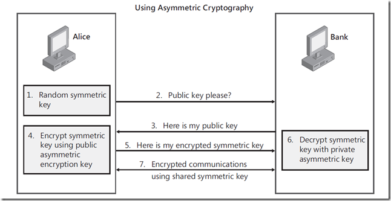
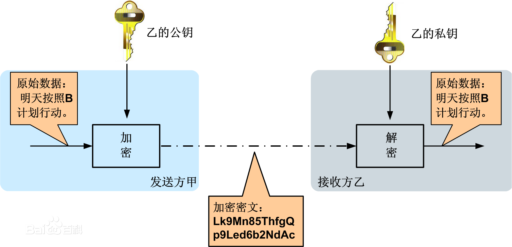

## [转载] 对称加密与非对称加密       
                                                                 
### 作者                                                                 
digoal                                                                 
                                                                 
### 日期                                                                 
2018-02-26                                                               
                                                                 
### 标签                                                                 
PostgreSQL , 对称加密 , 非对称加密 , Symmetric , ASymmetric , public , private , pgcrypto , 区块链                  
                                                                 
----                                                                 
                                                                 
## 背景     
转载:     
    
http://www.cnblogs.com/jfzhu/p/4020928.html    
    
## 原文    
### （一）对称加密（Symmetric Cryptography）    
对称加密是最快速、最简单的一种加密方式，加密（encryption）与解密（decryption）用的是同样的密钥（secret key）。对称加密有很多种算法，由于它效率很高，所以被广泛使用在很多加密协议的核心当中。    
    
对称加密通常使用的是相对较小的密钥，一般小于256 bit。因为密钥越大，加密越强，但加密与解密的过程越慢。如果你只用1 bit来做这个密钥，那黑客们可以先试着用0来解密，不行的话就再用1解；但如果你的密钥有1 MB大，黑客们可能永远也无法破解，但加密和解密的过程要花费很长的时间。密钥的大小既要照顾到安全性，也要照顾到效率，是一个trade-off。    
    
2000年10月2日，美国国家标准与技术研究所（NIST--American National Institute of Standards and Technology）选择了Rijndael算法作为新的高级加密标准（AES--Advanced Encryption Standard）。.NET中包含了Rijndael算法，类名叫RijndaelManaged，下面举个例子。    
    
加密过程：    
    
```    
private string myData = "hello";    
        private string myPassword = "OpenSesame";    
        private byte[] cipherText;    
        private byte[] salt = { 0x0, 0x1, 0x2, 0x3, 0x4, 0x5, 0x6, 0x5, 0x4, 0x3, 0x2, 0x1, 0x0 };    
                
    
        private void mnuSymmetricEncryption_Click(object sender, RoutedEventArgs e)    
        {    
            var key = new Rfc2898DeriveBytes(myPassword, salt);    
            // Encrypt the data.    
            var algorithm = new RijndaelManaged();    
            algorithm.Key = key.GetBytes(16);    
            algorithm.IV = key.GetBytes(16);    
            var sourceBytes = new System.Text.UnicodeEncoding().GetBytes(myData);    
            using (var sourceStream = new MemoryStream(sourceBytes))    
            using (var destinationStream = new MemoryStream())    
            using (var crypto = new CryptoStream(sourceStream, algorithm.CreateEncryptor(), CryptoStreamMode.Read))    
            {    
                moveBytes(crypto, destinationStream);    
                cipherText = destinationStream.ToArray();    
            }    
            MessageBox.Show(String.Format("Data:{0}{1}Encrypted and Encoded:{2}", myData, Environment.NewLine, Convert.ToBase64String(cipherText)));    
        }    
        private void moveBytes(Stream source, Stream dest)    
        {    
            byte[] bytes = new byte[2048];    
            var count = source.Read(bytes, 0, bytes.Length);    
            while (0 != count)    
            {    
                dest.Write(bytes, 0, count);    
                count = source.Read(bytes, 0, bytes.Length);    
            }    
        }    
```    
    
解密过程：    
    
```    
private void mnuSymmetricDecryption_Click(object sender, RoutedEventArgs e)    
        {    
            if (cipherText == null)    
            {    
                MessageBox.Show("Encrypt Data First!");    
                return;    
            }    
            var key = new Rfc2898DeriveBytes(myPassword, salt);    
            // Try to decrypt, thus showing it can be round-tripped.    
            var algorithm = new RijndaelManaged();    
            algorithm.Key = key.GetBytes(16);    
            algorithm.IV = key.GetBytes(16);    
            using (var sourceStream = new MemoryStream(cipherText))    
            using (var destinationStream = new MemoryStream())    
            using (var crypto = new CryptoStream(sourceStream, algorithm.CreateDecryptor(), CryptoStreamMode.Read))    
            {    
                moveBytes(crypto, destinationStream);    
                var decryptedBytes = destinationStream.ToArray();    
                var decryptedMessage = new UnicodeEncoding().GetString(    
                decryptedBytes);    
                MessageBox.Show(decryptedMessage);    
            }    
        }    
```    
    
对称加密的一大缺点是密钥的管理与分配，换句话说，如何把密钥发送到需要解密你的消息的人的手里是一个问题。在发送密钥的过程中，密钥有很大的风险会被黑客们拦截。现实中通常的做法是将对称加密的密钥进行非对称加密，然后传送给需要它的人。    
    
### （二）非对称加密（Asymmetric Cryptography）    
非对称加密为数据的加密与解密提供了一个非常安全的方法，它使用了一对密钥，公钥（public key）和私钥（private key）。私钥只能由一方安全保管，不能外泄，而公钥则可以发给任何请求它的人。非对称加密使用这对密钥中的一个进行加密，而解密则需要另一个密钥。比如，你向银行请求公钥，银行将公钥发给你，你使用公钥对消息加密，那么只有私钥的持有人 -- 银行才能对你的消息解密。与对称加密不同的是，银行不需要将私钥通过网络发送出去，因此安全性大大提高。        
    
目前最常用的非对称加密算法是RSA算法，是Rivest, Shamir, 和Adleman于1978年发明，他们那时都是在MIT。.NET中也有RSA算法，请看下面的例子：    
    
加密过程：    
    
```    
private byte[] rsaCipherText;    
        private void mnuAsymmetricEncryption_Click(object sender, RoutedEventArgs e)    
        {    
            var rsa = 1;    
            // Encrypt the data.    
            var cspParms = new CspParameters(rsa);    
            cspParms.Flags = CspProviderFlags.UseMachineKeyStore;    
            cspParms.KeyContainerName = "My Keys";    
            var algorithm = new RSACryptoServiceProvider(cspParms);    
            var sourceBytes = new UnicodeEncoding().GetBytes(myData);    
            rsaCipherText = algorithm.Encrypt(sourceBytes, true);    
            MessageBox.Show(String.Format("Data: {0}{1}Encrypted and Encoded: {2}",    
                myData, Environment.NewLine,    
                Convert.ToBase64String(rsaCipherText)));    
        }    
```    
    
解密过程：    
    
```    
private void mnuAsymmetricDecryption_Click(object sender, RoutedEventArgs e)    
        {    
            if(rsaCipherText==null)    
            {    
                MessageBox.Show("Encrypt First!");    
                return;    
            }    
            var rsa = 1;    
            // decrypt the data.    
            var cspParms = new CspParameters(rsa);    
            cspParms.Flags = CspProviderFlags.UseMachineKeyStore;    
            cspParms.KeyContainerName = "My Keys";    
            var algorithm = new RSACryptoServiceProvider(cspParms);    
            var unencrypted = algorithm.Decrypt(rsaCipherText, true);    
            MessageBox.Show(new UnicodeEncoding().GetString(unencrypted));    
        }    
```    
    
虽然非对称加密很安全，但是和对称加密比起来，它非常的慢，所以我们还是要用对称加密来传送消息，但对称加密所使用的密钥我们可以通过非对称加密的方式发送出去。为了解释这个过程，请看下面的例子：    
    
（1） Alice需要在银行的网站做一笔交易，她的浏览器首先生成了一个随机数作为对称密钥。    
    
（2） Alice的浏览器向银行的网站请求公钥。    
    
（3） 银行将公钥发送给Alice。    
    
（4） Alice的浏览器使用银行的公钥将自己的对称密钥加密。    
    
（5） Alice的浏览器将加密后的对称密钥发送给银行。    
    
（6） 银行使用私钥解密得到Alice浏览器的对称密钥。    
    
（7） Alice与银行可以使用对称密钥来对沟通的内容进行加密与解密了。    
    
    
    
### （三）总结    
（1） 对称加密加密与解密使用的是同样的密钥，所以速度快，但由于需要将密钥在网络传输，所以安全性不高。    
    
（2） 非对称加密使用了一对密钥，公钥与私钥，所以安全性高，但加密与解密速度慢。    
    
（3） 解决的办法是将对称加密的密钥使用非对称加密的公钥进行加密，然后发送出去，接收方使用私钥进行解密得到对称加密的密钥，然后双方可以使用对称加密来进行沟通。    
        
（4） PostgreSQL pgcrypto插件支持了对称和非对称加密。    
    
https://www.postgresql.org/docs/devel/static/pgcrypto.html    
    
对称加密函数: pgp_sym_encrypt()    
    
对称解密函数: pgp_sym_decrypt()    
    
非对称加密函数(使用公钥加密): pgp_pub_encrypt()    
    
非对称解密函数(使用私钥解密): pgp_pub_decrypt()    
    
pgcrypto的加解密过程参考:    
    
The functions here implement the encryption part of the OpenPGP (RFC 4880) standard. Supported are both symmetric-key and public-key encryption.    
    
An encrypted PGP message consists of 2 parts, or packets:    
    
- Packet containing a session key - either symmetric-key or public-key encrypted.    
    
- Packet containing data encrypted with the session key.    
    
When encrypting with a symmetric key (i.e., a password):    
    
1\. The given password is hashed using a String2Key (S2K) algorithm. This is rather similar to crypt() algorithms - purposefully slow and with random salt - but it produces a full-length binary key.    
    
2\. If a separate session key is requested, a new random key will be generated. Otherwise the S2K key will be used directly as the session key.    
    
3\. If the S2K key is to be used directly, then only S2K settings will be put into the session key packet. Otherwise the session key will be encrypted with the S2K key and put into the session key packet.    
    
When encrypting with a public key:    
    
1\. A new random session key is generated.    
    
2\. It is encrypted using the public key and put into the session key packet.    
    
In either case the data to be encrypted is processed as follows:    
    
1\. Optional data-manipulation: compression, conversion to UTF-8, and/or conversion of line-endings.    
    
2\. The data is prefixed with a block of random bytes. This is equivalent to using a random IV.    
    
3\. An SHA1 hash of the random prefix and data is appended.    
    
4\. All this is encrypted with the session key and placed in the data packet.    
    
### 百度百科  
### 非对称加密  
对称加密算法在加密和解密时使用的是同一个秘钥；而非对称加密算法需要两个密钥来进行加密和解密，这两个秘钥是公开密钥（public key，简称公钥）和私有密钥（private key，简称私钥）。  
  
### 定义  
1976年，美国学者Dime和Henman为解决信息公开传送和密钥管理问题，提出一种新的密钥交换协议，允许在不安全的媒体上的通讯双方交换信息，安全地达成一致的密钥，这就是“公开密钥系统”。  
  
与对称加密算法不同，非对称加密算法需要两个密钥：公开密钥（publickey）和私有密钥（privatekey）。公开密钥与私有密钥是一对，如果用公开密钥对数据进行加密，只有用对应的私有密钥才能解密；如果用私有密钥对数据进行加密，那么只有用对应的公开密钥才能解密。因为加密和解密使用的是两个不同的密钥，所以这种算法叫作非对称加密算法。  
  
### 工作过程  
如下图所示，甲乙之间使用非对称加密的方式完成了重要信息的安全传输。  
  
  
  
1、乙方生成一对密钥（公钥和私钥）并将公钥向其它方公开。  
  
2、得到该公钥的甲方使用该密钥对机密信息进行加密后再发送给乙方。  
  
3、乙方再用自己保存的另一把专用密钥（私钥）对加密后的信息进行解密。乙方只能用其专用密钥（私钥）解密由对应的公钥加密后的信息。  
  
在传输过程中，即使攻击者截获了传输的密文，并得到了乙的公钥，也无法破解密文，因为只有乙的私钥才能解密密文。  
  
同样，如果乙要回复加密信息给甲，那么需要甲先公布甲的公钥给乙用于加密，甲自己保存甲的私钥用于解密。  
  
### 优缺点  
非对称加密与对称加密相比，其安全性更好：对称加密的通信双方使用相同的秘钥，如果一方的秘钥遭泄露，那么整个通信就会被破解。而非对称加密使用一对秘钥，一个用来加密，一个用来解密，而且公钥是公开的，秘钥是自己保存的，不需要像对称加密那样在通信之前要先同步秘钥。  
  
非对称加密的缺点是加密和解密花费时间长、速度慢，只适合对少量数据进行加密。  
  
在非对称加密中使用的主要算法有：RSA、Elgamal、背包算法、Rabin、D-H、ECC（椭圆曲线加密算法）等。  
  
不同算法的实现机制不同，可参考对应算法的详细资料。  
  
## 参考        
http://www.cnblogs.com/jfzhu/p/4020928.html    
    
https://www.postgresql.org/docs/devel/static/pgcrypto.html     
  
https://baike.baidu.com/item/%E9%9D%9E%E5%AF%B9%E7%A7%B0%E5%8A%A0%E5%AF%86  
  
<a rel="nofollow" href="http://info.flagcounter.com/h9V1"  ></a>  
  
  
  
  
  
  
## [digoal's 大量PostgreSQL文章入口](https://github.com/digoal/blog/blob/master/README.md "22709685feb7cab07d30f30387f0a9ae")
  
