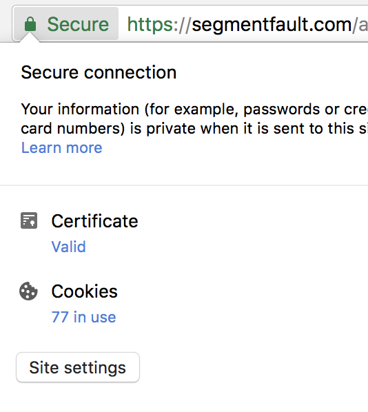
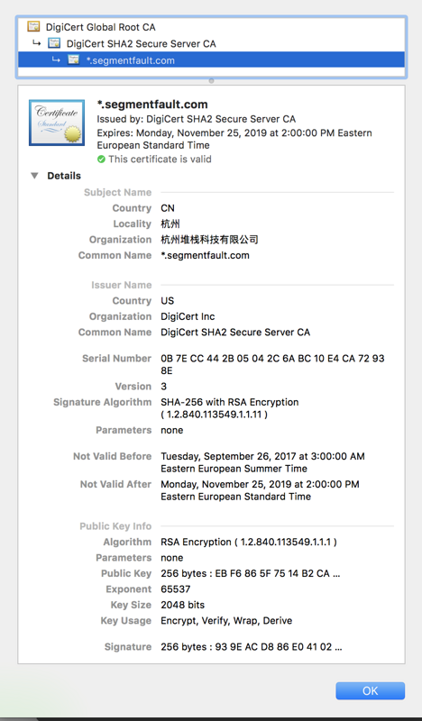

## [转载] 白话解释 非对称加密，电子签名，电子证书，根证书，HTTPS，PKI 到底是什么           
                                                                       
### 作者                                                                       
digoal                                                                       
                                                                       
### 日期                                                                       
2018-02-26                                                                     
                                                                       
### 标签                                                                       
PostgreSQL , 对称加密 , 非对称加密 , Symmetric , ASymmetric , public , private , pgcrypto , 区块链                        
                                                                       
----                                                                       
                                                                       
## 背景           
转载:           
          
https://segmentfault.com/a/1190000012466003         
          
## 原文          
上回我白话了一下：“对称加密”和“非对称加密”的来龙去脉，收到了不错的反馈，今天接着上一次白话留下的伏笔，说一说“对称加密”和“非对称加密”的实际应用：电子签名(digital signature)，电子证书(digital certificate)的来历。      
      
因为“对称加密”以及“非对称加密”是两种不同的“技术”，“技术“嘛，研究出来要“应用”到实际生活中的，当然同一种技术的“应用场景”可以是千差万别的，正如有人发明了“充气轮胎”，然后被运用在了汽车上，飞机上还有自行车上。电子签名和电子证书就是“应用”(正如汽车，飞机，自行车)，但是它们的诞生离不开“对称加密”和“非对称加密”这些底层技术(充气轮胎)，同样，对于你来说，如果你想明白我接下来白话的“电子签名”和“电子证书”这些“应用”，你需要先读懂我之前白话的“技术”[《白话解释 对称加密算法 VS 非对称加密算法》](https://segmentfault.com/a/1190000004461428)。      
      
### 电子签名 和 电子证书      
ok，上回我们说到，李四给张三发消息，先拿到“张三的公钥”，然后使用张三的公钥加密自己的信息，然后把加密后的密文发送给张三，这样可以保证发送的密文只能被“李四得到的公钥”所对应的“密钥”解密(没有黑客的情况下，也就是张三的密钥)。细心地同学可能发现了，我上面对“张三的公钥”加了引号！！！      
      
为什么？？？因为李四怎么确认他收到的“公钥”就是张三本人的呢？为了更好地继续白话，咱们这里做一个很大胆的假设，比如黑客小刘正在监听李四和张三的对话，我们也假设黑客小刘可以轻易的修改中间传输的信息。那么如果你是李四，你想一下怎么才能把“机密信息”安全的传送给张三？      
      
好，我们分析一下，为了能把“机密信息”安全的传给张三，李四需要：      
      
1，加密的密文不能被破解，更严谨说，是不能被“轻易”破解（因为黑客小刘能截获任何对话）      
      
2，我们用来加密的“公钥”必须确实来在于“张三”本人（不然如果用了黑客小刘的公钥，那么即使李四加密了信息，也会被小刘秒破解）      
      
至于第一点，非对称加密已经替我们解决了密文不会被轻易破解的问题，那么我们现在只要确定所得到的公钥是来自于“张三”本人就可以放心大胆的加密信息，并且发送加密后的密文啦！      
      
那么李四怎么确定“公钥”确实来自于张三本人呢？好办！      
      
```      
张三：四儿，接好了，这是我的公钥：fewfeef#￥#@#@#R###。      
李四：三哥，别急嘛，12345？      
张三：上山打老虎！      
李四：欧了，这是我想对你说的话：$IJ4#(##(#(！      
张三：好，讲究！      
```      
      
也就是说李四为了确认张三是不是张三本人，李四先和张三对了一下“暗号”，如果暗号不对，李四就不相信发过来的公钥。      
      
“我怎么感觉哪里有点不对呢？”，嗯，我也觉得哪里不对，因为上面说，黑客小刘正在监听李四和张三的对话，这么明显的，弱智的，坑爹坑队友的暗号，黑客小刘立马就怒了：“把老子当白痴么？！这点小伎俩我都看不出？！”，于是，黑客小刘就学会了这个暗号，当下次李四再想对暗号的时候，黑客小刘可以截断张三和李四的信号，假装是张三：      
      
```      
黑客小刘：四儿，上次那个公钥我不用了，这是我的新公钥：#￥#@#3@223#53R2#5##。      
李四：哦.......12345?      
黑客小刘：哎，你还不相信你三哥？上山打老虎！      
李四：哈哈，三哥你看看这个计划如何？2g3n&&$@#(#@)      
黑客小刘：很好（邪恶的笑)      
李四：...      
```      
      
这样的话，李四还是被骗了，hmmm，那怎么办呢？李四想了一招，于是有了下面的对话：      
      
```      
黑客小刘：四儿，最近有什么新计划没？。      
李四：没。。。有。。。。      
黑客小刘：没有？我是你三哥，你说吧。      
李四：那你先把你的证书给我看看？      
黑客小刘：....神马证...书..？上山打老虎！      
--- 李四已下线 ---      
```      
      
哈哈，原来，李四自从上次被坑了之后私下里去找了一个叫“王五”的大哥，想寻求帮助，王五说这个事不难，王五对李四说：“如果你相信我，那么我就来作证人证明张三是张三”。      
      
李四说：“那没问题，那你怎么证明张三是他本人？”。      
“我可以给张三颁发一个证书！只要他给你看到这个证书，你就相信他是张三”，王五说。      
李四思考了片刻又问道：“那我怎么证明这个证书不是伪造的呢？”      
王五说：“因为我可以给你一个神器，这个神器能够让你分辨这个证书确实是我颁发的！”。      
“哇！这么吊！那快给我！”，李四渴望的眼神中又闪烁着对王五的崇拜！      
      
其实，这个神奇呢，很简单，你想到了吗？嗯，于是，王五就把这个神器交给了李四，这个神器是：“王五的公钥”！。      
      
哈哈哈哈哈哈。。。      
      
“王五的公钥”！      
“王五的公钥”！      
“王五的公钥”！      
      
明白了么？明白了么？明白了么？重要的事情说三遍。      
      
来，我们先来整理一下整个过程，李四苦恼于无法分辨出张三是不是他本人，于是去求助于“王五”大哥，希望王五大哥能够帮助证明“张三”是张三，然后王五大哥找到张三，亲自拿到了张三的公钥，检查完毕之后，准备了一份证书，同时签上了自己的”王五“大名，交给了张三，从此以后张三再和李四聊天的时候，就可以出示自己的“证书”，证明他是张三本人了。      
      
其实到这里，整个过程和现实生活中的“公证”过程类似，比如你辛苦努力的学习，终于得到了自己的大学毕业证，但是在现实生活中也有很多投机分子通过非法机构办假证，这样对像你一样努力学习的同学就不公平，所以用人单位为了证明你给他们的毕业证确实是你的，他们怎么办呢？他们要求你去“公证处”去公证一下你的毕业证！公证处这里就是大哥“王五”的角色，用人单位很信任“公证处”，所以只要你拿着“公证处”公证好的文件，用人单位（李四）也就相信了，这个毕业证（公钥）确实是你的。      
      
等一下，公证处的“公证文书”也可以造假啊。      
      
我。。。。      
      
嗯，是的，我还没说完，上面王五给李四说了：      
      
>“因为我可以给你一个神器，这个神器能够让你分辨这个证书确实是我颁发的！”。      
      
我们也知道了，这个神器就是王五的一个公钥，那么怎么才能做到证书没有被修改或者伪造呢？      
      
原来，王五的签名不是普通的签名，也不是像公证处那种普通的盖章，而是“电子签名”！因为王五他也有自己的一对“私/公钥”，所以他把张三的“个人信息”以及“公钥信息”用他的私钥加密成“密文”，把这个密文当做“电子签名”签在了证书上，然后这个证书就被称为“电子证书”，最后再把自己的公钥送给了李四，那么李四收到张三给的证书之后，就可以利用王五给的公钥进行解密证书上面的签名，因为证书上的签名是用王五私钥加的密，所以相应的，也只能用王五的公钥进行解密，李四最后将解密出来的公钥信息和收到的公钥信息进行比对，如果信息一致，就证明了两个问题：      
      
- 张三确实是张三      
- 张三的公钥确实来自张三且没被修改过      
      
最后的最后，因为在这里“王五”的神器(公钥)太关键，它能够决定其他人的证书是否真实有效，所以我们把“王五”的公钥叫做**“根证书”**！      
      
ok，问题顺利解决！    
  
### 公开密钥基础建设 PKI  
上概念时间。。  
  
>公开密钥基础建设（英语：Public Key Infrastructure，缩写：PKI），又称公开密钥基础架构、公钥基础建设、公钥基础设施、公开密码匙基础建设或公钥基础架构，是一组由硬件、软件、参与者、管理政策与流程组成的基础架构，其目的在于创造、管理、分配、使用、存储以及撤销数字证书。  
>    
>密码学上，公开密钥基础建设借着数字证书认证机构(CA)将用户的个人身份跟公开密钥链接在一起。对每个证书中心用户的身份必须是唯一的。链接关系通过注册和发布过程创建，取决于担保级别，链接关系可能由CA的各种软件或在人为监督下完成。PKI的确定链接关系的这一角色称为注册管理中心（Registration Authority，RA）。RA确保公开密钥和个人身份链接，可以防抵赖。  
  
简单来说，PKI就是利用非对称加密技术为开展安全信息交换提供了一种系统和规范。同时，为了整个系统能运转，一些“特别”的机构也是需要作为“值得信任的第三方”来接受个人或公司提交的“认证申请”。  
  
registration authority (RA)， 注册机构，负责接受来自个人和公司的“认证申请”，RA负责审核证书申请者的真实身份，审核通过之后，将申请送给 certificate authority (CA)证书机构，CA将对这些申请签名，并颁发给申请者电子证书，然后申请者得到这些证书之后可以比如：安装在服务器上。  
  
CA机构比如有：digicert，verisign  
      
### HTTPS 实例分析  
上面我们说到了PKI，我们来看一个具体的例子，以便让大家更直观的理解，我们就拿segmentfault为例。  
  
  
  
我们可以看到这里显示sf安装了证书，并且显示是valid，证明：  
  
- sf是sf，我没有被劫持到其他站点  
  
- 我和sf之前的通信是加密的，安全的，其他人窃取不到  
  
**那么浏览器是怎么验证的sf的证书的呢？还记得上面我提了一句“根证书”么？因为一般我们去申请证书都是通过CA机构，同时大家都信任CA机构比如digicert，verisign，那么我们就可以事先将这些CA机构的“神器”安装到我们的电脑上，也就是这些CA机构的"公钥"，我们也称它们为“根证书”。**这些根证书是预先安装在我们电脑上的，所以每当我们访问segmentfault的时候，如果segmentfault服务器上安装了证书，他想和我们建立安全通信，就好比上面例子中，张三直接把公钥发给李四一样，在这里：  
  
```  
segmentfault说：“hi，我们建立安全通信吧，这是我的公钥”  
你的浏览器：“你怎么证明你的公钥是你的呢？”  
segmentfault说：“这是我的证书，请查看”  
```  
  
然后segmentfault就把安装在服务器上的证书传给你的浏览器，因为你的浏览器已经有一些神器“根证书”的存在，所以这些**根证书（CA机构的公钥）**就可以来“解密”sf发过来的证书上的签名，然后对比一下解密后的信息和sf证书中所呈现的信息(解密签名证书内的公钥 与 直接给你的公钥 是否一致)是否一致，如果一致，就ok拉！  
  
最后上一个截图：  
  
  
  
大家注意，最上面“DigiCert Global Root CA”，说明我们使用digicert这个CA组织的根证书来进行认证sf的证书，然后digicert替我们证明了sf证书的合理性：“This certificate is valid"，同时给我列出来证书中的一些详细信息，比如：证书的持有者，证书的过期时间，证书中所携带的“公钥”信息（用来验证你得到的公钥确实是sf的），然后还有其他一些信息，感兴趣的同学可以深究一下了！  
  
如果大家喜欢我的白话系列，欢迎关注本专栏，接下来我会不定期的更新一些关于数据结构和算法的白话！  
  
谢谢！  
  
## 参考              
https://segmentfault.com/a/1190000012466003  
  
https://segmentfault.com/a/1190000004461428  
  
<a rel="nofollow" href="http://info.flagcounter.com/h9V1"  ></a>  
  
  
  
  
  
  
## [digoal's 大量PostgreSQL文章入口](https://github.com/digoal/blog/blob/master/README.md "22709685feb7cab07d30f30387f0a9ae")
  
