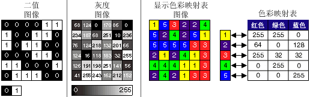

## PostgreSQL raster(栅格数据) st_value 优化举例  
                                                                                                 
### 作者                                                                                                 
digoal                                                                                                  
                                                                                                  
### 日期                                                                                                
2018-02-26                                                                                                  
                                                                                                  
### 标签                                                                                                
PostgreSQL , postgis , 栅格 , 波段 , st_value , raster , 优化 , st_intersects , gist 索引 , arcgis                    
                                    
----                                                                                                
                                        
## 背景     
栅格数据是由点阵组成的图像化数据，点阵具备空间属性（边界）。点阵由像素组成，所以每个像素也具备空间属性，同时每个像素内填充数值，数值可以代表温度、灰度、颜色系数、属性、湿度等等。  
  
  
  
每个栅格中可以有多个波段，每个波段可以代表一个图层，多个波段可以组合叠加计算。  
  
  
  
  
  
  
  
  
  
使用栅格数据，可以实现具备空间、业务属性的数据分析，可视化等。  
  
例如热力图、绿化率图、道路、温度分布等等。  
  
arcgis栅格数据组织形式：  
  
```  
任何有效的栅格格式  
  
像素数组  
  
一个或多个波段  
  
以文件形式存储在磁盘或地理数据库中  
  
70 多种支持的格式  
  
可用作影像服务  
  
可在许多地理处理和分析工具中用作数据源  
  
可在“影像分析”窗口中使用  
```  
  
由于栅格数据可大可小，当提取某个像素的VALUE时，可能会有一定的性能问题。  
  
## 使用st_value提取raster指定像素VALUE  
https://postgis.net/docs/RT_ST_Value.html  
  
当栅格文件非常大时，st_value可能要执行很长时间，虽然只提取一个像素的值。(此性能与栅格文件本身的数据组织，检索方法有关。)  
  
## 使用st_setvalue设置raster指定像素value  
http://postgis.net/docs/RT_ST_SetValue.html  
  
## 栅格背景知识  
可以从arcgis或postgis的手册中，学习栅格的知识。  
  
http://resources.arcgis.com/zh-cn/help/main/10.2/#/na/009t00000004000000/  
  
http://resources.arcgis.com/zh-cn/help/main/10.2/index.html#//009t00000007000000  
  
## 优化方法  
### 业务层优化
1、切割raster，将一个大的raster，切割为若干小的raster  
  
2、边界转geometry, 建立边界的表达式索引  
  
3、判断输入的geometry point是否与被查询raster相交(st_intersects)，相交则求st_value，否则不计算st_value  

### 数据库内核层优化
4、当然，还有一种优化方法是对栅格文件本身建立较好的数据模型，便于快速检索。这种方法对业务透明      
  
## 小结  
优化思路：  
  
1、降低计算量，使用切割的方法。  
  
2、降低计算量或IO放大，使用表达式索引。  
  
3、降低精度，对raster进行分层，类似这样的思路  
  
```  
SELECT   
  ST_AsText(ST_Union(pixpolyg)) As shadow  
FROM   
(  
SELECT         ST_Translate(  
                  ST_MakeEnvelope(  
		        ST_UpperLeftX(rast),   
			ST_UpperLeftY(rast),  
			ST_UpperLeftX(rast) + ST_ScaleX(rast)*2,  
			ST_UpperLeftY(rast) + ST_ScaleY(rast)*2,   
			0  
		  ),   
		  ST_ScaleX(rast)*x,   
		  ST_ScaleY(rast)*y  
	       ) As pixpolyg,   
	       ST_Value(rast, 2, x, y) As b2val  
FROM   
  dummy_rast   
CROSS JOIN  
  generate_series(1,1000,2) As x   
CROSS JOIN   
  generate_series(1,1000,2) As y  
WHERE rid =  2  
  AND x <= ST_Width(rast)    
  AND y <= ST_Height(rast)    
) As foo  
WHERE  
ST_Intersects(   
  pixpolyg,  
  ST_GeomFromText('POLYGON((3427928 5793244,3427927.75 5793243.75,3427928 5793243.75,3427928 5793244))',0)  
)   
AND b2val != 254;  
```  
  
  
  
## 参考  
https://stackoverflow.com/questions/31799824/optimizing-st-intersects-in-postgresqlpostgis  
  
http://postgis.17.x6.nabble.com/raster-loading-and-ST-Value-performance-td4999924.html  
  
http://postgis.net/docs/RT_ST_SetValue.html  
  
https://postgis.net/docs/RT_ST_Value.html  
  
http://postgis.17.x6.nabble.com/ST-value-slow-td5010865.html  
  
http://resources.arcgis.com/zh-cn/help/main/10.2/#/na/009t00000005000000/  
  
http://resources.arcgis.com/zh-cn/help/main/10.2/index.html#//009t00000007000000  
  
http://postgis.net/docs/manual-2.4/RT_reference.html  
  
[《PostgreSQL multipolygon 空间索引查询过滤精简优化 - IO，CPU放大优化》](../201711/20171122_03.md)    
  
[《PostgreSQL 空间切割(st_split, ST_Subdivide)功能扩展 - 空间对象网格化 (多边形GiST优化)》](../201710/20171005_01.md)    
  
[《PostgreSQL 空间st_contains，st_within空间包含搜索优化 - 降IO和降CPU(bound box) (多边形GiST优化)》](../201710/20171004_01.md)    
  
<a rel="nofollow" href="http://info.flagcounter.com/h9V1"  ></a>  
  
  
  
  
  
  
## [digoal's 大量PostgreSQL文章入口](https://github.com/digoal/blog/blob/master/README.md "22709685feb7cab07d30f30387f0a9ae")
  
