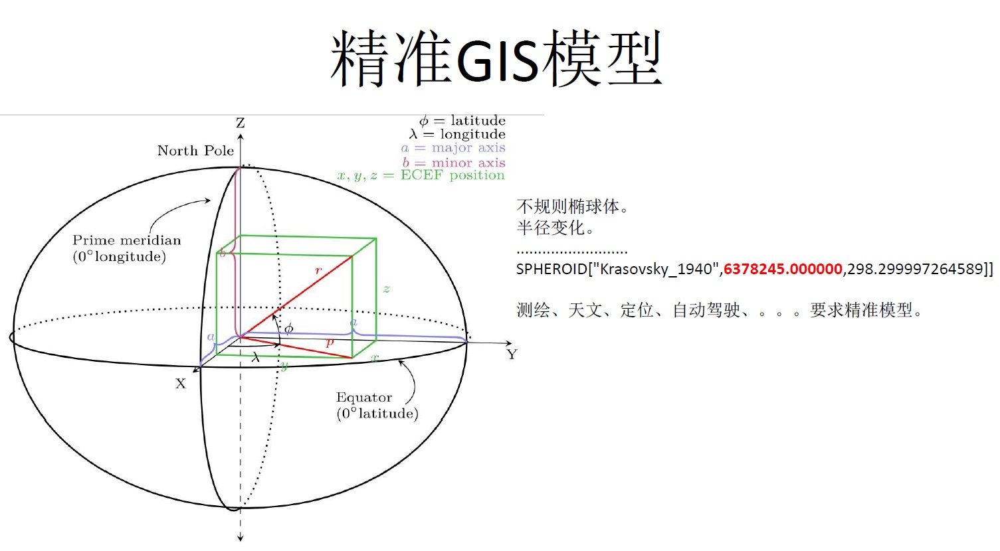
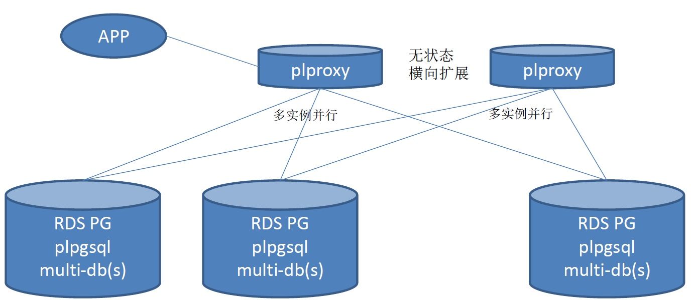
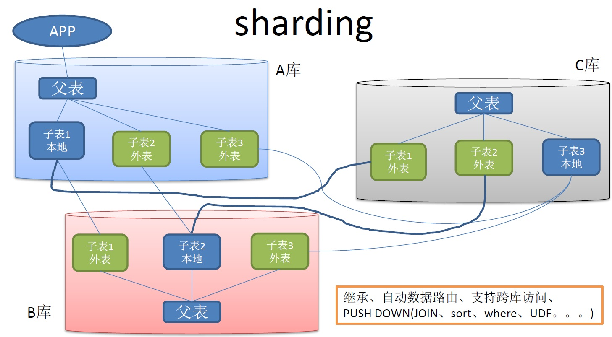
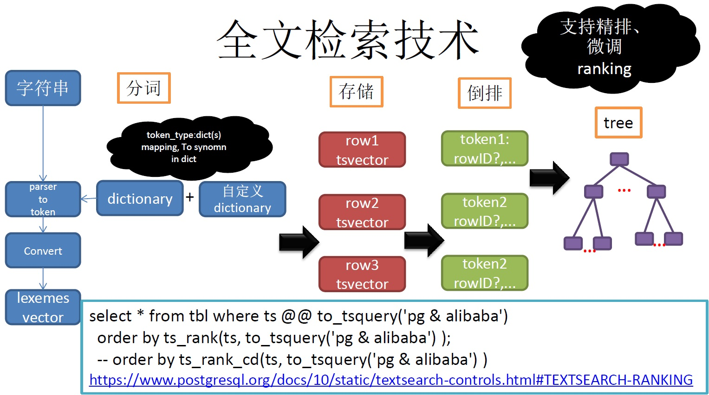
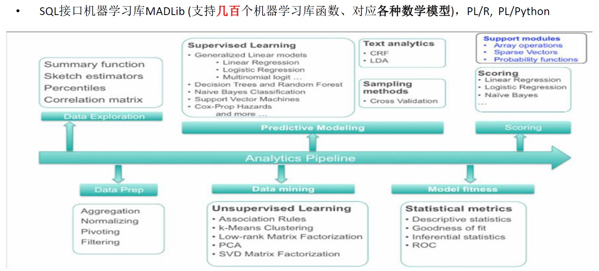
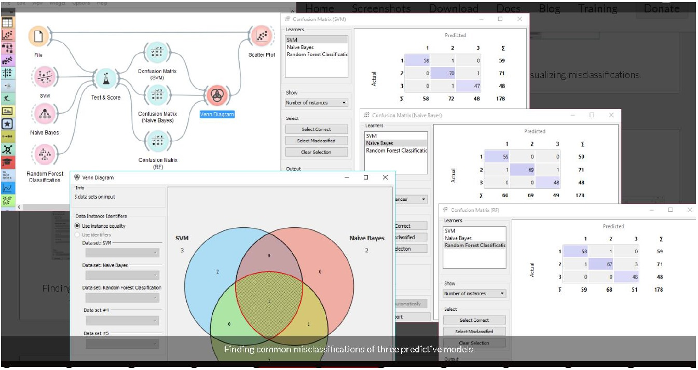
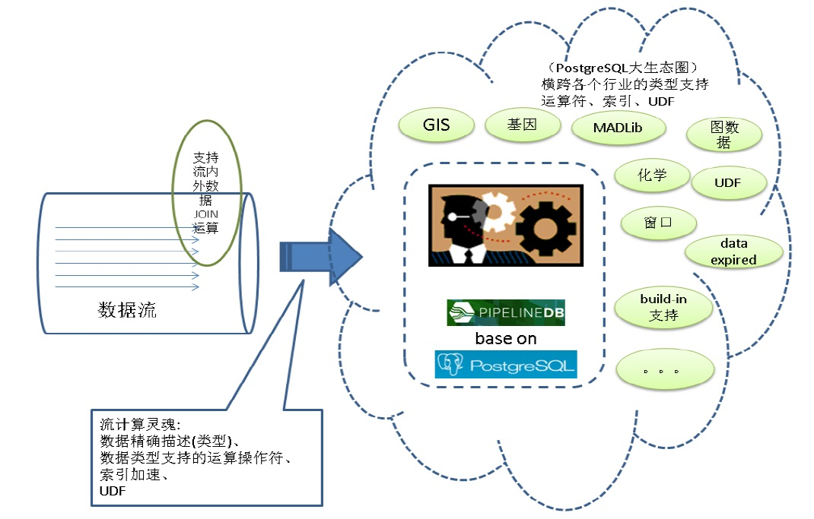
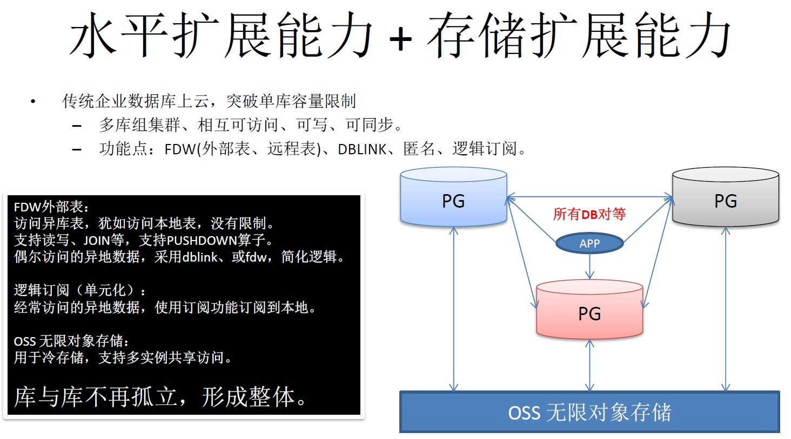
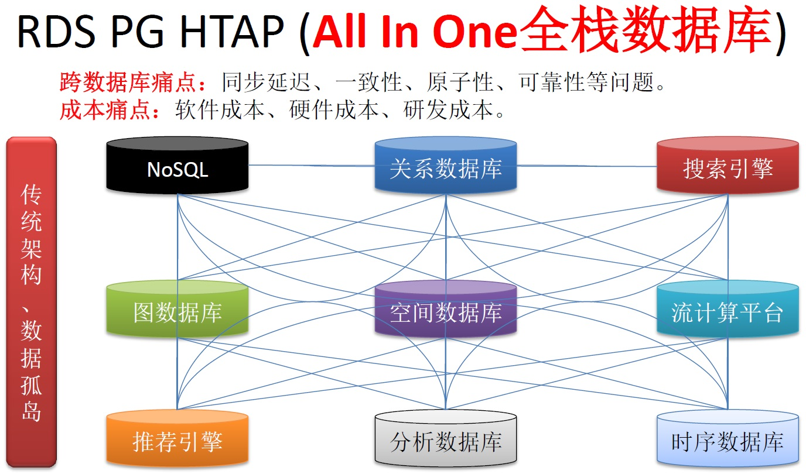

## PostgreSQL 覆盖 Oracle 18c 重大新特性       
                                                           
### 作者                                                           
digoal                                                           
                                                           
### 日期                                                           
2018-02-27                                                         
                                                           
### 标签                                                           
PostgreSQL , Oracle , 兼容性 , 18c      
                                                           
----                                                           
                                                           
## 背景  
Oracle 18c 发布了诸多新特性，其中大部分Oracle 18c的重大特性，在早期版本的PostgreSQL数据库已支持。     
  
如下  
  
## 一、开发特性  
  
### 1 图式搜索  
  
  
#### Oracle 18c  
SQL-Based Property Graph Query and Analytics  
  
https://docs.oracle.com/en/database/oracle/oracle-database/18/spgdg/sql-based-property-graph-query-analytics.html#GUID-C5CC6650-0375-4F32-8317-BAF859C1909C  
  
#### PostgreSQL 8.4+ (2009 year+)  
1、2009年PostgreSQL社区版本8.4，加入CTE递归语法的支持，支持图式搜索。  
  
[《PostgreSQL 图式搜索(graph search)实践 - 百亿级图谱，毫秒响应》](../201801/20180102_04.md)    
  
[《PostgreSQL 实践 - 内容社区(如论坛)图式搜索应用》](../201710/20171009_01.md)    
  
[《小微贷款、天使投资(风控助手)业务数据库设计(图式搜索\图谱分析) - 阿里云RDS PostgreSQL, HybridDB for PostgreSQL最佳实践》](../201708/20170801_01.md)    
  
  
2、2017年3月，基于PostgreSQL的专业图数据库AgensGraph发布1.0，兼容标准SQL和图式搜索语法openCypher。  
  
AgensGraph supports ANSI-SQL and openCypher (http://www.opencypher.org).  
  
https://github.com/bitnine-oss/agensgraph   
  
### 2 JSON 增强  
  
  
#### Oracle 18c  
SQL Enhancements for JSON  
  
支持行转JSON。  
  
https://www.oracle.com/pls/topic/lookup?ctx=en/database/oracle/oracle-database/18/newft&id=ADJSN-GUID-8C9B00DD-45D8-499B-919C-8632E034B664  
  
  
#### PostgreSQL 9.2+ (2012 year+)  
2012年PostgreSQL社区版本9.2，加入JSON的支持。  
  
https://www.postgresql.org/docs/current/static/datatype-json.html  
  
9.2已支持行转JSON  
  
```  
row_to_json(record [, pretty_bool])  
```  
  
除此之外，PostgreSQL还支持嵌套JSON，K-V转JSON，K-V类型。支持数组类型，LTREE，RANGE，XML，TS，IP 等类型，对开发更加的友好。  
  
https://www.postgresql.org/docs/devel/static/functions.html  
  
https://www.postgresql.org/docs/devel/static/hstore.html  
  
https://www.postgresql.org/docs/current/static/ltree.html  
  
### 3 空间数据sharding  
  
  
#### Oracle 18c  
支持空间数据字段作为SHARDING字段  
  
https://www.oracle.com/pls/topic/lookup?ctx=en/database/oracle/oracle-database/18/newft&id=SPATL-GUID-1EFFDD77-9666-4190-ACD2-EE3DCA7B326D  
  
  
#### PostgreSQL 8.2+ (2007 year+)  
  
  
  
1、早在2008年以前，就可以使用plproxy来实现PostgreSQL sharding，在skype内核心数据库用的就是plproxy做的sharding。sharding算法完全由用户控制，不管是空间数据还是什么数据，都可以支持。  
  
https://plproxy.github.io/  
  
[《阿里云ApsaraDB RDS for PostgreSQL 最佳实践 - 4 水平分库 之 节点扩展》](../201512/20151220_04.md)    
  
[《阿里云ApsaraDB RDS for PostgreSQL 最佳实践 - 3 水平分库 vs 单机 性能》](../201512/20151220_03.md)    
  
[《阿里云ApsaraDB RDS for PostgreSQL 最佳实践 - 2 教你RDS PG的水平分库》](../201512/20151220_02.md)    
  
[《PostgreSQL 最佳实践 - 水平分库(基于plproxy)》](../201608/20160824_02.md)    
  
[《A Smart PostgreSQL extension plproxy 2.2 practices》](../201110/20111025_01.md)    
  
[《使用Plproxy设计PostgreSQL分布式数据库》](../201005/20100511_01.md)    
  
2、除了plproxy分库分表以外，PostgreSQL社区还有一些NewSQL或MPP架构的数据库或插件，例如postgres-xl, antdb, citusDB, Greenplum：  
  
https://github.com/ADBSQL/AntDB  
  
http://www.postgres-xl.org/  
  
https://www.citusdata.com/product  
  
http://www.greenplum.org/  
  
https://wiki.postgresql.org/wiki/PostgreSQL_derived_databases  
  
3、2016年发布的PostgreSQL 9.6与pg_pathman插件，支持外部表继承，同时支持外部表的查询下推，支持表达式分区。这些特性决定了用户可以使用PostgreSQL 9.6+, pg_pathman, postgis(st_geohash)来实现空间字段的sharding。  
  
  
  
[《PostgreSQL 11 preview - Parallel Append (多表并行计算) sharding架构并行计算核心功能之一》](../201802/20180204_03.md)    
  
[《PostgreSQL 10 + PostGIS + Sharding(pg_pathman) + MySQL(fdw外部表) on ECS 部署指南(适合新用户)》](../201710/20171018_01.md)    
  
[《PostgreSQL 10.0 preview sharding增强 - 支持分布式事务》](../201703/20170331_03.md)    
  
[《PostgreSQL 10.0 preview sharding增强 - pushdown 增强》](../201703/20170312_20.md)    
  
[《PostgreSQL 10.0 preview sharding增强 - 支持Append节点并行》](../201703/20170312_11.md)    
  
[《PostgreSQL 10.0 preview sharding增强 - postgres_fdw 多节点异步并行执行》](../201703/20170312_07.md)    
  
[《PostgreSQL 9.6 sharding based on FDW & pg_pathman》](../201610/20161027_01.md)    
  
[《PostgreSQL 9.5+ 高效分区表实现 - pg_pathman》](../201610/20161024_01.md)    
  
[《PostgreSQL 9.6 sharding + 单元化 (based on postgres_fdw) 最佳实践 - 通用水平分库场景设计与实践》](../201610/20161005_01.md)    
  
[《PostgreSQL 9.6 单元化,sharding (based on postgres_fdw) - 内核层支持前传》](../201610/20161004_01.md)    
  
### 4 Text: Automatic Background Index Maintenance  
  
#### Oracle 18c  
  
后台自动维护文本索引。  
  
https://www.oracle.com/pls/topic/lookup?ctx=en/database/oracle/oracle-database/18/newft&id=CCAPP-GUID-54F2466B-7D05-45AC-A64E-04717F75C507  
  
#### PostgreSQL 8.2+ (2007 year+)  
PostgreSQL 从8.2 (2007年)开始，支持全文检索，全文检索索引。索引自动维护，不需要人工干预。  
  
  
  
PostgreSQL GIN索引不仅可用于全文检索字段，同时还支持其他多值类型，实时build+pending list(autovacuum)，可调整pending list size合并写入。写入与查询互不堵塞，兼顾了写性能和读性能。  
  
实际上PostgreSQL的设计理念是开放接口，所以索引接口也是开放的，因此我们看到PostgreSQL已支持的索引接口就达9种之多（hash,btree,gin,gist,spgist,brin,bloom,rum,zombdb），覆盖普通类型，多值类型，空间类型，时序数据，多字段任意组合搜索，全文检索，时空搜索等。  
  
[《PostgreSQL 9种索引的原理和应用场景》](../201706/20170627_01.md)    
  
### 5 Text: Wildcard Search  
  
#### Oracle 18c  
支持通配符匹配。  
  
https://www.oracle.com/pls/topic/lookup?ctx=en/database/oracle/oracle-database/18/newft&id=CCAPP-GUID-67A2ACB4-FB50-4EEB-9DC0-58BDA85014BA  
  
#### PostgreSQL 8.3+ (2008 year+)  
严格来说，PostgreSQL 8.2以前的版本已经支持了通配符搜索，(支持正则表达式)。  
  
从8.3 (2008年)开始，支持pg_trgm，因此能够支持通配符搜索的索引检索加速。目前Oracle还做不到模糊查询、正则查询、全文检索的索引加速。PostgreSQL可以做到。  
  
https://www.postgresql.org/docs/current/static/pgtrgm.html  
  
[《PostgreSQL 1000亿数据量 正则匹配 速度与激情》](../201603/20160307_01.md)    
  
[《PostgreSQL UDF实现tsvector(全文检索), array(数组)多值字段与scalar(单值字段)类型的整合索引(类分区索引) - 单值与多值类型复合查询性能提速100倍+ 案例 (含，单值+多值列合成)》](../201802/20180207_02.md)    
  
[《PostgreSQL 相似搜索分布式架构设计与实践 - dblink异步调用与多机并行(远程 游标+记录 UDF实例)》](../201802/20180205_03.md)    
  
[《PostgreSQL 相似搜索设计与性能 - 地址、QA、POI等文本 毫秒级相似搜索实践》](../201802/20180202_01.md)    
  
[《PostgreSQL 全文检索之 - 位置匹配 过滤语法(例如 '速度 <1> 激情')》](../201801/20180123_01.md)    
  
[《PostgreSQL 模糊查询 与 正则匹配 性能差异与SQL优化建议》](../201801/20180118_03.md)    
  
[《PostgreSQL 遗传学应用 - 矩阵相似距离计算 (欧式距离,...XX距离)》](../201712/20171227_01.md)    
  
[《多流实时聚合 - 记录级实时快照 - JSON聚合与json全文检索的功能应用》](../201712/20171209_01.md)    
  
[《PostgreSQL - 全文检索内置及自定义ranking算法介绍 与案例》](../201712/20171206_01.md)    
  
[《用PostgreSQL 做实时高效 搜索引擎 - 全文检索、模糊查询、正则查询、相似查询、ADHOC查询》](../201712/20171205_02.md)    
  
[《HTAP数据库 PostgreSQL 场景与性能测试之 17 - (OLTP) 数组相似查询》](../201711/20171107_18.md)    
  
[《HTAP数据库 PostgreSQL 场景与性能测试之 16 - (OLTP) 文本特征向量 - 相似特征(海明...)查询》](../201711/20171107_17.md)    
  
[《HTAP数据库 PostgreSQL 场景与性能测试之 14 - (OLTP) 字符串搜索 - 全文检索》](../201711/20171107_15.md)    
  
[《HTAP数据库 PostgreSQL 场景与性能测试之 13 - (OLTP) 字符串搜索 - 相似查询》](../201711/20171107_14.md)    
  
[《HTAP数据库 PostgreSQL 场景与性能测试之 12 - (OLTP) 字符串搜索 - 前后模糊查询》](../201711/20171107_13.md)    
  
[《HTAP数据库 PostgreSQL 场景与性能测试之 9 - (OLTP) 字符串模糊查询 - 含索引实时写入》](../201711/20171107_10.md)    
  
[《HTAP数据库 PostgreSQL 场景与性能测试之 7 - (OLTP) 全文检索 - 含索引实时写入》](../201711/20171107_08.md)    
  
[《PostgreSQL 中英文混合分词特殊规则(中文单字、英文单词) - 中英分明》](../201711/20171104_03.md)    
  
[《多国语言字符串的加密、全文检索、模糊查询的支持》](../201710/20171020_01.md)    
  
[《Greenplum 模糊查询 实践》](../201710/20171016_04.md)    
  
[《全文检索 不包含 优化 - 阿里云RDS PostgreSQL最佳实践》](../201707/20170727_01.md)    
  
[《17种文本相似算法与GIN索引 - pg_similarity》](../201705/20170524_01.md)    
  
[《PostgreSQL 模糊查询最佳实践 - (含单字、双字、多字模糊查询方法)》](../201704/20170426_01.md)    
  
[《PostgreSQL 10.0 preview 功能增强 - JSON 内容全文检索》](../201703/20170312_24.md)    
  
[《PostgreSQL结合余弦、线性相关算法 在文本、图片、数组相似 等领域的应用 - 3 rum, smlar应用场景分析》](../201701/20170116_04.md)    
  
[《PostgreSQL结合余弦、线性相关算法 在文本、图片、数组相似 等领域的应用 - 2 smlar插件详解》](../201701/20170116_03.md)    
  
[《PostgreSQL结合余弦、线性相关算法 在文本、图片、数组相似 等领域的应用 - 1 文本(关键词)分析理论基础 - TF(Term Frequency 词频)/IDF(Inverse Document Frequency 逆向文本频率)》](../201701/20170116_02.md)    
  
[《导购系统 - 电商内容去重\内容筛选应用(实时识别转载\盗图\侵权?) - 文本、图片集、商品集、数组相似判定的优化和索引技术》](../201701/20170112_02.md)    
  
[《PostgreSQL 全表 全字段 模糊查询的毫秒级高效实现 - 搜索引擎颤抖了》](../201701/20170106_04.md)    
  
[《从难缠的模糊查询聊开 - PostgreSQL独门绝招之一 GIN , GiST , SP-GiST , RUM 索引原理与技术背景》](../201612/20161231_01.md)    
  
[《从相似度算法谈起 - Effective similarity search in PostgreSQL》](../201612/20161222_02.md)    
  
[《聊一聊双十一背后的技术 - 毫秒分词算啥, 试试正则和相似度》](../201611/20161118_01.md)    
  
[《PostgreSQL 全文检索加速 快到没有朋友 - RUM索引接口(潘多拉魔盒)》](../201610/20161019_01.md)    
  
[《PostgreSQL 文本数据分析实践之 - 相似度分析》](../201608/20160817_01.md)    
  
[《中文模糊查询性能优化 by PostgreSQL trgm》](../201605/20160506_02.md)    
  
[《PostgreSQL 行级 全文检索》](../201604/20160419_01.md)    
  
[《使用阿里云PostgreSQL zhparser中文分词时不可不知的几个参数》](../201603/20160310_01.md)    
  
[《PostgreSQL 百亿数据 秒级响应 正则及模糊查询》](../201603/20160302_01.md)    
  
[《PostgreSQL chinese full text search 中文全文检索》](../201403/20140324_01.md)    
  
[《PostgreSQL 9.3 pg_trgm imporve support multi-bytes char and gist,gin index for reg-exp search》](../201305/20130516_01.md)    
  
[《PostgreSQL 使用 nlpbamboo chinesecfg 中文分词》](../201206/20120621_01.md)    
  
### 6 Text: Concurrent DML Support  
#### Oracle 18c  
  
https://www.oracle.com/pls/topic/lookup?ctx=en/database/oracle/oracle-database/18/newft&id=CCAPP-GUID-67A2ACB4-FB50-4EEB-9DC0-58BDA85014BA  
  
#### PostgreSQL 8.2+ (2007 year+)  
PostgreSQL 从8.2 (2007年)开始，支持全文检索，全文检索索引。索引自动维护，不需要人工干预。  
  
PostgreSQL GIN索引不仅可用于全文检索字段，同时还支持其他多值类型，实时build+pending list(autovacuum)，可调整pending list size合并写入。写入与查询互不堵塞，兼顾了写性能和读性能。  
  
## 二、sharding  
  
### 1 User-Defined Sharding Method  
  
#### Oracle 18c  
  
https://www.oracle.com/pls/topic/lookup?ctx=en/database/oracle/oracle-database/18/newft&id=SHARD-GUID-4FFB5665-B925-4DB6-ACDD-807D6E699365  
  
#### PostgreSQL 8.2+ (2007 year+)  
  
1、早在2008年以前，就可以使用plproxy来实现PostgreSQL sharding，在skype内核心数据库用的就是plproxy做的sharding。sharding算法完全由用户控制，不管是空间数据还是什么数据，都可以支持。  
  
## 三、Big Data and Data Warehousing  
  
### 1 Analytic View FILTER FACT and ADD MEASURE Keywords  
  
聚合前，对输入聚合函数的数据进行过滤，也就是说支持基于条件聚合。并不是WHERE条件，请注意。  
  
Analytic views provide a fast and efficient way to create analytic queries of data stored in existing database tables and views.  
  
Analytic views organize data using a dimensional model. They allow you to easily add aggregations and calculations to data sets and to present data in views that can be queried with relatively simple SQL.   
  
#### Oracle 18c  
  
https://www.oracle.com/pls/topic/lookup?ctx=en/database/oracle/oracle-database/18/newft&id=DWHSG-GUID-BEE5DB77-C00D-46F7-8543-F4EE3356BCE2  
  
#### PostgreSQL 9.4+ (2014 year+)  
  
https://www.postgresql.org/docs/10/static/sql-expressions.html#SYNTAX-AGGREGATES  
  
```  
aggregate_name (expression [ , ... ] [ order_by_clause ] ) [ FILTER ( WHERE filter_clause ) ]  
aggregate_name (ALL expression [ , ... ] [ order_by_clause ] ) [ FILTER ( WHERE filter_clause ) ]  
aggregate_name (DISTINCT expression [ , ... ] [ order_by_clause ] ) [ FILTER ( WHERE filter_clause ) ]  
aggregate_name ( * ) [ FILTER ( WHERE filter_clause ) ]  
aggregate_name ( [ expression [ , ... ] ] ) WITHIN GROUP ( order_by_clause ) [ FILTER ( WHERE filter_clause ) ]  
```  
  
除了FILTER，PostgreSQL聚合还支持ORDER BY，即输入到聚合函数中的记录可以按顺序进入，从而影响聚合结果。  
  
  
PostgreSQL 将开放存储接口、压缩接口，意味着以分析视图为代表的维度组织形式存储将来可以支持。  
  
https://commitfest.postgresql.org/17/1283/  
  
https://commitfest.postgresql.org/17/1294/  
  
### 2 Data Mining  
#### Oracle 18c  
  
Exponential Smoothing  
  
Random Forest  
  
Neural Network  
  
Explicit Semantic Analysis extension to classification  
  
https://www.oracle.com/pls/topic/lookup?ctx=en/database/oracle/oracle-database/18/newft&id=DMCON-GUID-EABE920F-1196-49C0-89CD-F25E062E16EF  
  
#### PostgreSQL 8.4+ (2009 year+)  
  
PostgreSQL 支持语言接口扩展，例如支持 plpython 存储过程语言。因此社区提供了madlib插件，可以用于在PostgreSQL内部使用plpython函数接口实现机器学习。  
  
  
  
1、madlib  
  
https://github.com/apache/madlib  
  
http://madlib.apache.org/index.html  
  
[《[转载]易上手的数据挖掘、可视化与机器学习工具: Orange介绍》](../201801/20180102_01.md)    
  
[《一张图看懂MADlib能干什么》](../201511/20151111_01.md)    
  
[《PostgreSQL 多元线性回归 - 1 MADLib Installed in PostgreSQL 9.2》](../201307/20130731_01.md)    
  
如果你用的是PostgreSQL 9.6+，则支持并行计算，性能更加。而如果你用的是greenplum（基于PostgreSQL的MPP数据库）那么就可以支持多机并行的机器学习。  
  
2、可视化分析软件orange3，同样支持python扩展  
  
  
  
https://orange.biolab.si/  
  
3、流式计算pipeline ，支持流式计算。阅后即焚或insert on conflict实现实时或批量计算。  
  
  
  
[《PostgreSQL APP海量FEED LOG实时质量统计CASE(含percentile_disc)》](../201802/20180205_04.md)    
  
[《Greenplum roaring bitmap与业务场景 (类阿里云RDS PG varbitx, 应用于海量用户 实时画像和圈选、透视)》](../201801/20180127_01.md)    
  
[《SQL流式案例 - 旋转门压缩(前后计算相关滑窗处理例子)》](../201801/20180107_01.md)    
  
[《超时流式处理 - 没有消息流入的数据异常监控》](../201712/20171222_02.md)    
  
[《阿里云RDS PostgreSQL varbitx实践 - 流式标签 (阅后即焚流式批量计算) - 万亿级，任意标签圈人，毫秒响应》](../201712/20171212_01.md)    
  
[《多流实时聚合 - 记录级实时快照 - JSON聚合与json全文检索的功能应用》](../201712/20171209_01.md)    
  
[《人、机客户服务质量 - 实时透视分析 - (多股数据流上下文相关实时分析,窗口保持)》](../201712/20171208_05.md)    
  
[《PostgreSQL 业务数据质量 实时监控 实践》](../201712/20171208_03.md)    
  
[《用PostgreSQL 做实时高效 搜索引擎 - 全文检索、模糊查询、正则查询、相似查询、ADHOC查询》](../201712/20171205_02.md)    
  
[《PostgreSQL手机行业经营分析、决策系统设计 - 实时圈选、透视、估算》](../201711/20171126_01.md)    
  
[《PostgreSQL 流式统计 - insert on conflict 实现 流式 UV(distinct), min, max, avg, sum, count ...》](../201711/20171123_02.md)    
  
[《PostgreSQL 异步消息实践 - Feed系统实时监测与响应(如 电商主动服务) - 分钟级到毫秒级的实现》](../201711/20171111_01.md)    
  
[《HTAP数据库 PostgreSQL 场景与性能测试之 33 - (OLAP) 物联网 - 线性字段区间实时统计》](../201711/20171107_34.md)    
  
[《HTAP数据库 PostgreSQL 场景与性能测试之 32 - (OLTP) 高吞吐数据进出(堆存、行扫、无需索引) - 阅后即焚(JSON + 函数流式计算)》](../201711/20171107_33.md)    
  
[《HTAP数据库 PostgreSQL 场景与性能测试之 31 - (OLTP) 高吞吐数据进出(堆存、行扫、无需索引) - 阅后即焚(读写大吞吐并测)》](../201711/20171107_32.md)    
  
[《HTAP数据库 PostgreSQL 场景与性能测试之 27 - (OLTP) 物联网 - FEED日志, 流式处理 与 阅后即焚 (CTE)》](../201711/20171107_28.md)    
  
[《泛电网系统 海量实时计算+OLTP+OLAP DB设计 - 阿里云(RDS、HybridDB) for PostgreSQL最佳实践》](../201708/20170826_01.md)    
  
[《行为、审计日志 (实时索引/实时搜索)建模 - 最佳实践 2》](../201705/20170522_01.md)    
  
[《(流式、lambda、触发器)实时处理大比拼 - 物联网(IoT)\金融,时序处理最佳实践》](../201705/20170518_01.md)    
  
[《行为、审计日志 (实时索引/实时搜索)建模 - 最佳实践 1》](../201705/20170516_01.md)    
  
[《流计算风云再起 - PostgreSQL携PipelineDB力挺IoT》](../201612/20161220_01.md)    
  
[《在PostgreSQL中实现update | delete limit - CTID扫描实践  (高效阅后即焚)》](../201608/20160827_01.md)    
  
[《旋转门数据压缩算法在PostgreSQL中的实现 - 流式压缩在物联网、监控、传感器等场景的应用》](../201608/20160813_01.md)    
  
[《"物联网"流式处理应用 - 用PostgreSQL实时处理(万亿每天)》](../201512/20151215_01.md)    
  
[《PostgreSQL 流计算指 pipelinedb 实时处理Kafka消息流》](../201510/20151021_02.md)    
  
[《基于PostgreSQL的流式PipelineDB, 1000万/s实时统计不是梦》](../201510/20151015_01.md)    
  
4、估值计算hll插件，实现估值计算  
  
[《PostgreSQL hll (HyperLogLog) extension for "State of The Art Cardinality Estimation Algorithm" - 3》](../201302/20130228_01.md)    
  
[《PostgreSQL hll (HyperLogLog) extension for "State of The Art Cardinality Estimation Algorithm" - 2》](../201302/20130227_01.md)    
  
[《PostgreSQL hll (HyperLogLog) extension for "State of The Art Cardinality Estimation Algorithm" - 1》](../201302/20130226_01.md)    
  
[《[转]流数据库 概率计算概念 - PipelineDB-Probabilistic Data Structures & Algorithms》](../201801/20180116_01.md)    
  
## 四、General  
  
### 1 Manual termination of run-away queries  
#### Oracle 18c  
A SQL query consuming excessive resources, including parallel servers, can be terminated using the ALTER SYSTEM CANCEL SQL statement.  
  
This feature enables the database administrator to terminate a runaway SQL query using a SQL statement. This frees the system resources consumed by the runaway SQL query so that other SQL queries can use them.  
  
https://www.oracle.com/pls/topic/lookup?ctx=en/database/oracle/oracle-database/18/newft&id=ADMIN-GUID-7D8E5E00-515D-4338-8B86-C2044F6D2957  
  
  
#### PostgreSQL 8.0+ (2005 year+)  
  
Name	|Return Type	|Description  
---|---|---  
pg_cancel_backend(pid int)|	boolean|	Cancel a backend's current query  
pg_terminate_backend(pid int)|	boolean|	Terminate a backend  
  
  
重点是runaway sql的检查。这个功能可以结合OS来判定。因为PG是基于进程的模型，只要看进程的资源消耗和统计就可以。可以用cgroup进行统计。  
  
[《Linux cgroup - memory子系统讲解》](../201701/20170111_02.md)    
  
[《为什么cgroup blkio不能限制分区》](../201608/20160811_01.md)    
  
[《Linux cgroup - cpu与cpuset子系统讲解》](../201606/20160613_01.md)    
  
[《xfs logdev 完美解决cgroup iops限制时ext4 data=writeback才能解决的问题》](../201601/20160107_02.md)    
  
[《cgroup告诉你如何计算 PostgreSQL 数据库实例用了多少内存》](../201509/20150926_01.md)    
  
[《PostgreSQL 商用版本EPAS(阿里云ppas) HTAP功能之资源隔离管理 - CPU与刷脏资源组管理》](../201801/20180113_01.md)    
  
### 2 Inline External Tables  
#### Oracle 18c  
https://www.oracle.com/pls/topic/lookup?ctx=en/database/oracle/oracle-database/18/newft&id=ADMIN-GUID-621E5DDE-36D9-4661-9D14-80DE35858C3F  
  
  
#### PostgreSQL 8.4+ (2009 year+)  
PostgreSQL 从8.4开始支持FDW接口，即foreign data wrapper。对目标数据源实现这个接口，就可以访问该数据源。作为PostgreSQL的一张外表来使用。因此在PostgreSQL中访问Oracle的数据是非常轻松的。  
  
目前可访问的数据源不完全列表如下，包括 “普通数据库，NOSQL，文件，网络服务，大数据服务，搜索引擎，操作系统，对象存储，空间数据库” 等，只要有网络接口的数据源，都可以访问。  
  
https://wiki.postgresql.org/wiki/Fdw  
  
- Generic SQL Database Wrappers  
  
- Specific SQL Database Wrappers  
  
- NoSQL Database Wrappers  
  
- File Wrappers  
  
- Geo Wrappers  
  
- LDAP Wrappers  
  
- Generic Web Wrappers  
  
- Specific Web Wrappers  
  
- Big Data Wrappers  
  
- Column-Oriented Wrappers  
  
- Scientific Wrappers  
  
- Operating System Wrappers  
  
- Exotic Wrappers  
  
- RDS PG OSS 外部表文档：https://help.aliyun.com/knowledge_detail/43352.html  
  
- HDB PG OSS 外部表文档：https://help.aliyun.com/document_detail/35457.html  
  
  
  
### 3 Approximate Top-N Query Processing  
#### Oracle 18c  
  
https://www.oracle.com/pls/topic/lookup?ctx=en/database/oracle/oracle-database/18/newft&id=DWHSG-GUID-07B31A40-6AD9-4843-B5B3-D2424ACE39D5  
  
  
#### PostgreSQL 9.0+ (2010 year+)  
  
1、使用hyperloglog插件，PostgreSQL可以实现概率计算，包括count distinct的概率计算。  
  
https://github.com/citusdata/postgresql-hll  
  
[《PostgreSQL hll (HyperLogLog) extension for "State of The Art Cardinality Estimation Algorithm" - 3》](../201302/20130228_01.md)    
  
[《PostgreSQL hll (HyperLogLog) extension for "State of The Art Cardinality Estimation Algorithm" - 2》](../201302/20130227_01.md)    
  
[《PostgreSQL hll (HyperLogLog) extension for "State of The Art Cardinality Estimation Algorithm" - 1》](../201302/20130226_01.md)    
  
[《[转]流数据库 概率计算概念 - PipelineDB-Probabilistic Data Structures & Algorithms》](../201801/20180116_01.md)    
  
2、TOP-N插件   
  
https://github.com/citusdata/cms_topn  
  
## 五、Container Database Architecture  
  
### Container Database Architecture  
  
#### Oracle 18c  
https://docs.oracle.com/en/database/oracle/oracle-database/18/newft/new-features.html#GUID-028D54E7-DEDB-44FD-9C42-75725032B697  
  
#### PostgreSQL 8.0+ (2005 year+)  
PostgreSQL设计之初就是PDB模式，即一个实例，多个数据库。围绕数据库，支持多种操作，如：  
  
1、克隆数据库  
  
```  
CREATE DATABASE name  
    [ [ WITH ] [ OWNER [=] user_name ]  
           [ TEMPLATE [=] template ]  
           [ ENCODING [=] encoding ]  
           [ LC_COLLATE [=] lc_collate ]  
           [ LC_CTYPE [=] lc_ctype ]  
           [ TABLESPACE [=] tablespace_name ]  
           [ ALLOW_CONNECTIONS [=] allowconn ]  
           [ CONNECTION LIMIT [=] connlimit ]  
           [ IS_TEMPLATE [=] istemplate ] ]  
```  
  
例如  
  
```  
create database new_db with template old_db;   
```  
  
2、DUMP 数据库  
  
```  
pg_dump。     采用repeatable read隔离级别导出，库级别一致。  
```  
  
3、IMPORT 数据库  
  
```  
pg_restore  
```  
  
4、快照功能，(9.2+  )  
  
```  
pg_export_snapshot()，支持导出当前快照。  
```  
  
[《PostgreSQL 9.5 new feature - pg_dump use --snapshot taken by another session (exp. slot, pg_export_snapshot())》](../201506/20150616_02.md)    
  
[《PostgreSQL 事务快照功能 - Parallel Export consistent data or Parallel Query use snapshot transaction feature》](../201303/20130306_02.md)    
  
[《PostgreSQL 共享事务快照功能 - PostgreSQL 9.2 can share snapshot between multi transactions》](../201205/20120516_01.md)    
  
5、订阅数据库，(10+ )  
  
通过订阅功能，支持数据库、表级别的逻辑订阅。  
  
[《PostgreSQL 逻辑订阅 - DDL 订阅 实现方法》](../201712/20171204_04.md)    
  
[《使用PostgreSQL逻辑订阅实现multi-master》](../201706/20170624_01.md)    
  
[《PostgreSQL 逻辑订阅 - 给业务架构带来了什么希望？》](../201704/20170413_01.md)    
  
[《PostgreSQL 10.0 preview 逻辑订阅 - 原理与最佳实践》](../201702/20170227_01.md)    
  
6、内核层面理论是也可以实现针对库级的WAL。  
  
  
## 六、Globalization  
  
#### PostgreSQL 10+ (2017 year+)  
  
支持ICU库  
  
The ICU library has versioning that allows detection of collation changes between versions.   
It is enabled via configure option --with-icu.   
The default still uses the operating system's native collation library.  
  
[《PostgreSQL 10.0 preview 功能增强 - 国际化功能增强,支持ICU(International Components for Unicode)》](../201703/20170330_04.md)    
  
## 七、分区  
  
### 1 Parallel Partition-Wise SQL Operations  
  
#### Oracle 18c  
  
https://www.oracle.com/pls/topic/lookup?ctx=en/database/oracle/oracle-database/18/newft&id=DWHSG-GUID-9CEE2551-7E43-472E-9B68-89E738F42C0A  
  
#### PostgreSQL 11+ (2018 year+)  
  
PostgreSQL 11支持分区表的智能JOIN。  
  
[《PostgreSQL 11 preview - 分区表智能并行JOIN (已类似MPP架构，性能暴增)》](../201802/20180202_02.md)    
  
在PostgreSQL 11前，通过dblink异步调用，可以实现同样功能，不过需要用户自己关注分区定义是否一致。  
  
[《PostgreSQL dblink异步调用实现 并行hash分片JOIN - 含数据交、并、差 提速案例 - 含dblink VS pg 11 parallel hash join VS pg 11 智能分区JOIN》](../201802/20180201_02.md)    
  
### 2 Online Merging of Partitions and Subpartitions  
  
#### Oracle 18c  
  
The ONLINE keyword is specified to enable concurrent DML operations while a partition maintenance operation is ongoing.  
  
https://www.oracle.com/pls/topic/lookup?ctx=en/database/oracle/oracle-database/18/newft&id=VLDBG-GUID-0E7793F7-B38A-427E-846B-7A8651F2A523  
  
#### PostgreSQL 9.5+ (2015 year+)  
  
pg_pathman ，通过这个插件，可以实现高效的分区管理。  
  
https://github.com/postgrespro/pg_pathman  
  
```  
自动或手动分区管理  
Both automatic and manual partition management;  
  
自动新增分区，无需人工干预  
Automatic partition creation for new INSERTed data (only for RANGE partitioning);  
  
支持字段或表达式分区  
Partitioning by expression and composite key;  
  
将单表转换为分区表时，不堵塞DML  
Non-blocking concurrent table partitioning;  
  
partition_table_concurrently(relation   REGCLASS,  
                             batch_size INTEGER DEFAULT 1000,  
                             sleep_time FLOAT8 DEFAULT 1.0)  
  
分区表执行计划自动根据分区定义进行优化  
Effective query planning for partitioned tables (JOINs, subselects etc);  
  
分区表支持外部数据源  
FDW support (foreign partitions);  
```  
  
合并和分裂分区接口例子  
  
```  
merge_range_partitions(partitions REGCLASS[])  
  
split_range_partition(partition      REGCLASS,  
                      split_value    ANYELEMENT,  
                      partition_name TEXT DEFAULT NULL)  
```  
  
如果是PostgreSQL 10+，则可以使用SQL语法来绑定和解绑分区，结合订阅，DDL事务功能，可以实现在线合并、分裂分区。  
  
https://www.postgresql.org/docs/devel/static/sql-altertable.html  
  
逻辑订阅, ddl 支持事务, detach, attach  
  
  
### 3 Modifying the Partitioning Strategy  
  
  
https://www.oracle.com/pls/topic/lookup?ctx=en/database/oracle/oracle-database/18/newft&id=VLDBG-GUID-763391C6-44E8-401D-8119-DC12926F5877  
  
#### PostgreSQL 10+ (2018 year+)  
  
通过逻辑订阅来实现，分区定义的修改，不堵塞dml  
  
```  
1、db2创建新表  
  
2、db1创建发布  
  
3、db1将旧表添加到发布  
  
4、db2创建订阅  
  
5、db2创建发布  
  
6、db2将新表添加到发布  
  
7、db1创建新表  
  
8、db1创建订阅  
  
9、db1切换新、旧表  
  
（目前可能需要借助一个临时库绕一圈，同一数据库中无法订阅）  
```  
  
## 八、安全  
  
### 1 Integration of Active Directory Services with Oracle Database  
  
#### Oracle 18c  
  
https://www.oracle.com/pls/topic/lookup?ctx=en/database/oracle/oracle-database/18/newft&id=DBSEG-GUID-9739D541-FA9D-422A-95CA-799A4C6F488D  
  
#### PostgreSQL 8.2+ (2007 year+)  
PostgreSQL 8.2即引入了LDAP的认证。  
  
除了LDAP，PostgreSQL还支持多种认证接口：  
  
https://www.postgresql.org/docs/current/static/auth-methods.html  
  
```  
20.3.1. Trust Authentication  
  
20.3.2. Password Authentication  
  
20.3.3. GSSAPI Authentication  
  
20.3.4. SSPI Authentication  
  
20.3.5. Ident Authentication  
  
20.3.6. Peer Authentication  
  
20.3.7. LDAP Authentication  
  
20.3.8. RADIUS Authentication  
  
20.3.9. Certificate Authentication  
  
20.3.10. PAM Authentication  
  
20.3.11. BSD Authentication  
```  
  
[《PostgreSQL LDAP认证之 search bind配置》](../201406/20140609_01.md)    
  
[《PostgreSQL LDAP认证之 simple bind配置》](../201406/20140606_02.md)    
  
[《PostgreSQL Windows AD认证配置》](../201409/20140924_01.md)    
  
## 小结  
PostgreSQL是一个全栈数据库，不输于现在的商用数据库，有非常弹性的许可协议(like BSD)，有非常广泛的行业群众基础，生态健全。  
  
  
  
下面是一篇较为全面的PostgreSQL数据库介绍：  
  
[《阿里云 PostgreSQL：云生态、企业案例、开发实践、管理实践、学习资料、学习视频》](../201801/20180121_01.md)    
  
## 参考  
https://docs.oracle.com/en/database/oracle/oracle-database/18/whats-new.html  
  
  
  
<a rel="nofollow" href="http://info.flagcounter.com/h9V1"  ></a>  
  
  
  
  
  
  
## [digoal's 大量PostgreSQL文章入口](https://github.com/digoal/blog/blob/master/README.md "22709685feb7cab07d30f30387f0a9ae")
  
