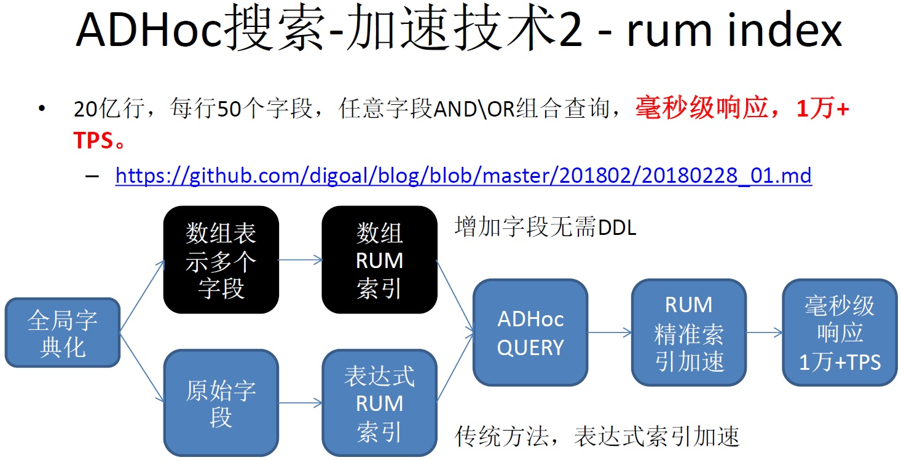

## PostgreSQL ADHoc(任意字段组合)查询 与 字典化 (rum索引加速) - 实践与方案1     
                                                             
### 作者                                                             
digoal                                                             
                                                             
### 日期                                                             
2018-02-28                            
                                                             
### 标签                                                             
PostgreSQL , rum , adhoc , index scan , bitmap scan , gin     
                                                             
----                                                             
                                                             
## 背景      
### 业务背景    
某系统数据量：    
    
20亿行左右，64个字段，原始数据多为字符串类型。（大多数字段的唯一值有限）    
    
需求：    
    
1\. 查询，任意字段组合查询，求聚合值。    
    
2\. 查询并发，1000左右查询并发，每次查询响应时间要求100ms以内。    
    
3\. 写入、更新，要求延迟1秒内。    
    
高峰时写入、更新可达20万行/s。    
    
业务上允许批量写入。    
    
4\. 要求加字段方便。    
    
5\. 要求实时计算（无需建模），或者说要求加统计维度方便，不需要等建模结束。    
    
### PostgreSQL 该场景特性    
使用PostgreSQL可以很好的满足这样的需求，PostgreSQL具备以下特性，适合ADHoc的非建模查询：    
    
1、索引接口：    
    
bloom接口，支持多字段组合索引，任意字段组合的查询，实现lossy的过滤，收敛目标数据到一定的BLOCKs。    
    
gin接口，倒排索引，广泛应用于多值类型(如全文检索类型、数组、JSON、K-V等)，多字段组合索引等。支持多值类型或任意字段组合搜索，bitmap index scan将目标数据收敛到一定的BLOCKs，加速查询。    
    
rum接口，新版本的rum不仅支持tsvector类型，同时还支持了array类型。rum的优势是不需要bitmap scan，因此没有recheck的过程，查询时的CPU消耗比GIN索引接口更低。    
    
[《PostgreSQL bitmap scan的IO放大的原理解释和优化》](../201801/20180119_03.md)      
    
2、索引扫描方法    
    
index scan，索引扫描，直接命中数据。    
    
bitmap index scan，返回包含目标数据的BLOCK，数据库进行CPU RECHECK。这种方法支持多个字段合并扫描。    
    
[《PostgreSQL bitmapAnd, bitmapOr, bitmap index scan, bitmap heap scan》](../201702/20170221_02.md)      
    
3、其他特性，辅助这个业务场景：    
    
并行计算（支持并行扫描、过滤、排序、JOIN、聚合、创建索引等），（例如 100亿数据，并行排序求top-k只要40秒），更多指标参考：    
    
[《阿里云 PostgreSQL 产品生态；案例、开发实践、管理实践、学习资料、学习视频》](../201801/20180121_01.md)      
    
异步调用与聚合，也支持支持DBLINK异步调用，实现并行计算。    
    
分区表。    
    
水平拆库。    
    
序列，可用于字典化。例子：    
    
[《PostgreSQL 全局ID分配(数据字典化)服务 设计实践》](../201802/20180227_02.md)      
    
UDF。可以支持非常复杂的数据库函数编程，实现复杂逻辑。    
    
RULE。实现数据写入、更新时自动对数据进行字典化。    
    
### PostgreSQL 场景优化手段    
1\. 字典化（大多数字段的唯一值有限，唯一值个数100-5000万左右），30个左右字段需要字典化（可做成ETL，实时字典化）。字典化的目的是压缩空间，提高处理效率。如果性能OK可以不做字典化。    
    
2\. 写入自动字典化(可以使用RULE来实现)    
    
3\. 查询时自动翻译    
    
4\. bloom, rum, gin, 数组, tsvector, 多字段BITMAP SCAN      
    
5\. 分库，分表。dblink异步并行调用。    
    
### dblink异步调用加速介绍    
    
[《PostgreSQL 全局ID分配(数据字典化)服务 设计实践》](../201802/20180227_02.md)      
    
[《PostgreSQL VOPS 向量计算 + DBLINK异步并行 - 单实例 10亿 聚合计算跑进2秒》](../201802/20180210_01.md)      
    
[《PostgreSQL 相似搜索分布式架构设计与实践 - dblink异步调用与多机并行(远程 游标+记录 UDF实例)》](../201802/20180205_03.md)      
    
[《PostgreSQL 相似搜索设计与性能 - 地址、QA、POI等文本 毫秒级相似搜索实践》](../201802/20180202_01.md)      
    
[《PostgreSQL dblink异步调用实现 并行hash分片JOIN - 含数据交、并、差 提速案例 - 含dblink VS pg 11 parallel hash join VS pg 11 智能分区JOIN》](../201802/20180201_02.md)      
    
[《惊天性能！单RDS PostgreSQL实例 支撑 2000亿 - 实时标签透视案例 (含dblink异步并行调用)》](../201712/20171223_01.md)      
    
[《阿里云RDS PostgreSQL OSS 外部表 - (dblink异步调用封装)并行写提速案例》](../201709/20170906_01.md)      
    
### 水平分库方法介绍    
1、使用plproxy水平分库    
    
[《PostgreSQL 最佳实践 - 水平分库(基于plproxy)》](../201608/20160824_02.md)      
    
[《阿里云ApsaraDB RDS for PostgreSQL 最佳实践 - 4 水平分库 之 节点扩展》](../201512/20151220_04.md)      
    
[《阿里云ApsaraDB RDS for PostgreSQL 最佳实践 - 3 水平分库 vs 单机 性能》](../201512/20151220_03.md)      
    
[《阿里云ApsaraDB RDS for PostgreSQL 最佳实践 - 2 教你RDS PG的水平分库》](../201512/20151220_02.md)      
    
2、使用postgres_fdw + pg_pathman水平分库    
    
[《PostgreSQL 9.6 sharding based on FDW & pg_pathman》](../201610/20161027_01.md)      
    
3、其他基于PostgreSQL的NewSQL或MPP开源产品    
    
pg-xl    
    
https://www.postgres-xl.org/    
    
citusdb    
    
https://www.citusdata.com/    
    
greenplum    
    
http://www.greenplum.org/    
    
pg_shardman    
    
https://github.com/postgrespro/pg_shardman    
    
## 方案1 - 全局字典化 + 数组类型 + rum索引    
### 全局字典化    
全局字典化的意思是，所有字段的取值空间构成一个大的取值空间，“字段名+字段值”在取值空间内唯一。    
    
字典化后，可以选择INT4或INT8作为字典化后的元素类型。    
    
### 数组    
由于使用了全局字典，所以可以使用一个数组字段，代替所有字段。    
    
```    
create table tbl(    
  id int8 primary key,    
  c1 int,    
  c2 int,    
  ...    
  c50 int    
);    
```    
    
代替为    
    
```    
create table tbl(    
  id int8 primary key,    
  dict int[]    
);    
```    
    
使用数组的好处多多，例如加字段易如反掌，因为你不需要改结果，只需要把新加的字段的内容填充到数组中。    
    
原来的AND查询使用数组包含操作代替，原来的OR查询，使用数组相交操作代替。    
    
### RUM索引    
RUM索引，已经支持数组类型。支持包含、相交查询。    
    
### DEMO    
DEMO将抛开如何将文本转换为字典的部分，你可以参考如下：    
    
[《PostgreSQL 全局ID分配(数据字典化)服务 设计实践》](../201802/20180227_02.md)      
    
#### 1、创建插件    
    
```    
create extension rum;    
```    
    
#### 2、创建生成随机值的函数（即字典值），输入一个范围，返回这个范围内的随机值    
    
```    
create or replace function gen_rand(    
  int,  -- 最小值(包含)    
  int   -- 最大值(包含)    
) returns int as $$    
  select $1+(random()*($2-$1))::int;    
$$ language sql strict;    
```    
    
#### 3、创建一个函数，用于生成长度为50的随机数组，规则是这样的，字典取值空间100万个元素的16个字段，字典取值空间1000万个元素的16个字段，字典取值空间5000万个元素的18个字段。    
    
总共50个字段，消耗10.76亿个字典取值空间。因此可以使用INT4作为字典元素类型。    
    
```    
create or replace function gen_ran_array() returns int[] as $$    
declare    
  res int[] := '{}';  -- 结果    
  x int;         -- 组范围    
  offset1 int;   -- 偏移量    
begin    
  -- 第1段消耗1600万值    
  offset1 := (-2147483648);  -- 第1批段偏移量为int4最小值    
  x := 1000000;    -- 每段取值范围为100万    
  for i in 1..16    
  loop    
    res := res||gen_rand(offset1+(i-1)*x, offset1+i*x-1);    
  end loop;    
      
  -- 第2段消耗1.6亿值    
  offset1 := (-2147483648)+16*1000000;  -- 第2批段偏移量    
  x := 10000000;  -- 每段取值范围为1000万    
  for i in 1..16    
  loop    
    res := res||gen_rand(offset1+(i-1)*x, offset1+i*x-1);    
  end loop;    
    
  -- 第3段消耗9亿值    
  offset1 := (-2147483648)+16*1000000+16*10000000;   -- 第3批段偏移量为    
  x := 50000000;  -- 每段取值范围为5000万    
  for i in 1..18    
  loop    
    res := res||gen_rand(offset1+(i-1)*x, offset1+i*x-1);    
  end loop;    
      
  -- 总共消耗10.76亿值，在INT4的取值空间内    
  return res;    
end;    
$$ language plpgsql strict;    
```    
    
#### 4、数据示例    
    
```    
postgres=# select gen_ran_array();    
                                                                                                                                                                                                                                                 
                                                          gen_ran_array                                                          
--------------------------------------------------------------------------------------------------------    
 {-2146646308,-2145683415,-2145349222,-2143926381,-2143348415,-2141933614,-2141364249,-2140223009,-2138645116,-2138311094,-2137328519,-2136424380,-2134763612,-2134461767,-2132675440,-2131727900,-2125512613,-2117580976,-2108206637,-2093806503,-2084537076,-2072042857,-2071092129,-2060488058,-2043914532,-2039914771,-2025797284,-2021177739,-2004046058,-1997857659,-1988910392,-1975672648,-1963342019,-1901896072,-1864565293,-1806580356,-1724394364,-1708595351,-1643548404,-1582467707,-1549967665,-1485791936,-1429504322,-1413965811,-1334697903,-1289093865,-1226178368,-1204842726,-1169580505,-1109793310}    
(1 row)    
```    
    
#### 5、建表    
    
```    
create table tbl_test(    
  id serial primary key,     
  dict int[]  -- 使用数组代替了50个字段    
);    
```    
    
#### 6、建数组rum索引    
    
```    
create index idx_tbl_test on tbl_test using rum (dict rum_anyarray_ops);    
```    
    
#### 7、单实例，单表写入2亿条测试数据    
    
```    
vi test2.sql    
insert into tbl_test (dict) select gen_ran_array() from generate_series(1,10);    
    
pgbench -M prepared -n -r -P 1 -f ./test2.sql -c 56 -j 56 -t 357143    
```    
    
#### 8、单实例写入速度，约3.3万行/s。    
    
写入约3.3万行/s，10个节点约33万行/s。    
    
CPU 约 20% 空闲。    
    
```    
progress: 2.0 s, 3363.5 tps, lat 16.716 ms stddev 4.362    
progress: 3.0 s, 3568.0 tps, lat 15.707 ms stddev 3.707    
progress: 4.0 s, 3243.0 tps, lat 17.239 ms stddev 4.529    
```    
    
#### 9、2亿数据空间占比    
    
表：49 GB    
    
索引：184 GB    
    
#### 10、创建返回N个有效空间内随机值的函数，用于查询测试    
    
```    
create or replace function gen_test_arr(int) returns int[] as $$    
  select array(select * from unnest(gen_ran_array()) order by random() limit $1);    
$$ language sql strict immutable;    
```    
    
结果举例    
    
```    
postgres=# select gen_test_arr(4);    
                   gen_test_arr                        
---------------------------------------------------    
 {-2012641247,-2133910693,-1626085823,-2136987009}    
(1 row)    
    
postgres=# select gen_test_arr(4);    
                   gen_test_arr                        
---------------------------------------------------    
 {-1664820600,-1321104348,-1410506219,-2116164275}    
(1 row)    
```    
    
#### 11、ADHoc查询压测    
    
关闭bitmap scan    
    
```    
set enable_bitmapscan=off;    
```    
    
1、1个字段查询    
    
```    
select * from tbl_test where dict @> gen_test_arr(1);    
    
postgres=# explain (analyze,verbose,timing,costs,buffers) select * from tbl_test where dict @> gen_test_arr(1);    
                                                                 QUERY PLAN                                                                      
---------------------------------------------------------------------------------------------------------------------------------------------    
 Index Scan using idx_tbl_test on public.tbl_test  (cost=14.40..852142.09 rows=753011 width=228) (actual time=0.410..4.444 rows=132 loops=1)    
   Output: id, dict    
   Index Cond: (tbl_test.dict @> '{-2139078302}'::integer[])    
   Buffers: shared hit=28 read=126 dirtied=10    
 Planning time: 0.616 ms    
 Execution time: 4.492 ms    
(6 rows)    
```    
    
2、2个字段and查询    
    
```    
select * from tbl_test where dict @> gen_test_arr(2);    
    
postgres=# explain (analyze,verbose,timing,costs,buffers) select * from tbl_test where dict @> gen_test_arr(2);    
                                                              QUERY PLAN                                                                   
---------------------------------------------------------------------------------------------------------------------------------------    
 Index Scan using idx_tbl_test on public.tbl_test  (cost=28.80..4627.28 rows=3776 width=228) (actual time=0.084..0.084 rows=0 loops=1)    
   Output: id, dict    
   Index Cond: (tbl_test.dict @> '{-1229103789,-2117549196}'::integer[])    
   Buffers: shared hit=27    
 Planning time: 0.428 ms    
 Execution time: 0.098 ms    
(6 rows)    
```    
    
3、3个字段and查询    
    
```    
select * from tbl_test where dict @> gen_test_arr(3);    
    
postgres=# explain (analyze,verbose,timing,costs,buffers) select * from tbl_test where dict @> gen_test_arr(3);    
                                                            QUERY PLAN                                                                 
-----------------------------------------------------------------------------------------------------------------------------------    
 Index Scan using idx_tbl_test on public.tbl_test  (cost=43.20..67.53 rows=19 width=228) (actual time=0.145..0.145 rows=0 loops=1)    
   Output: id, dict    
   Index Cond: (tbl_test.dict @> '{-1297850230,-1598505025,-1409870549}'::integer[])    
   Buffers: shared hit=32    
 Planning time: 0.621 ms    
 Execution time: 0.165 ms    
(6 rows)    
```    
    
4、4个字段and查询    
    
```    
select * from tbl_test where dict @> gen_test_arr(4);    
    
postgres=# explain (analyze,verbose,timing,costs,buffers) select * from tbl_test where dict @> gen_test_arr(4);    
                                                            QUERY PLAN                                                                
----------------------------------------------------------------------------------------------------------------------------------    
 Index Scan using idx_tbl_test on public.tbl_test  (cost=57.60..60.01 rows=1 width=228) (actual time=0.301..0.301 rows=0 loops=1)    
   Output: id, dict    
   Index Cond: (tbl_test.dict @> '{-2143045247,-1543382864,-2132603589,-2146917034}'::integer[])    
   Buffers: shared hit=37    
 Planning time: 0.651 ms    
 Execution time: 0.321 ms    
(6 rows)    
```    
    
5、2个字段or查询    
    
```    
select * from tbl_test where dict && gen_test_arr(2);    
    
postgres=# explain (analyze,verbose,timing,costs,buffers) select * from tbl_test where dict && gen_test_arr(2);    
                                                                   QUERY PLAN                                                                       
------------------------------------------------------------------------------------------------------------------------------------------------    
 Index Scan using idx_tbl_test on public.tbl_test  (cost=28.80..1626373.60 rows=1538286 width=228) (actual time=0.222..12.367 rows=308 loops=1)    
   Output: id, dict    
   Index Cond: (tbl_test.dict && '{-2141077184,-2146768682}'::integer[])    
   Buffers: shared hit=40 read=295 dirtied=44    
 Planning time: 0.590 ms    
 Execution time: 12.439 ms    
(6 rows)    
```    
    
6、3个字段or查询    
    
```    
select * from tbl_test where dict && gen_test_arr(3);    
    
postgres=# explain (analyze,verbose,timing,costs,buffers) select * from tbl_test where dict && gen_test_arr(3);    
                                                                   QUERY PLAN                                                                       
------------------------------------------------------------------------------------------------------------------------------------------------    
 Index Scan using idx_tbl_test on public.tbl_test  (cost=43.20..2265424.89 rows=2282542 width=228) (actual time=0.254..19.038 rows=174 loops=1)    
   Output: id, dict    
   Index Cond: (tbl_test.dict && '{-1620795514,-1639870542,-2139239663}'::integer[])    
   Buffers: shared hit=40 read=166 dirtied=31    
 Planning time: 0.612 ms    
 Execution time: 19.093 ms    
(6 rows)    
```    
    
7、4个字段or查询    
    
```    
select * from tbl_test where dict && gen_test_arr(4);    
    
postgres=# explain (analyze,verbose,timing,costs,buffers) select * from tbl_test where dict && gen_test_arr(4);    
                                                                   QUERY PLAN                                                                       
------------------------------------------------------------------------------------------------------------------------------------------------    
 Index Scan using idx_tbl_test on public.tbl_test  (cost=57.60..2847470.08 rows=3043456 width=228) (actual time=0.598..17.606 rows=328 loops=1)    
   Output: id, dict    
   Index Cond: (tbl_test.dict && '{-1705307460,-2136144007,-2132774019,-1953195893}'::integer[])    
   Buffers: shared hit=46 read=319 dirtied=54    
 Planning time: 0.652 ms    
 Execution time: 17.690 ms    
(6 rows)    
```    
    
8、更多字段AND查询    
    
```    
postgres=# explain (analyze,verbose,timing,costs,buffers) select * from tbl_test where dict @> gen_test_arr(50);    
                                                                                                                                                                                                                                                 
                                                                                  QUERY PLAN                       
                                                                                                                                                                                   
---------------------------------------------------------------------------------------------------------------------------------------    
 Index Scan using idx_tbl_test on public.tbl_test  (cost=600.00..602.41 rows=1 width=228) (actual time=2.203..2.203 rows=0 loops=1)    
   Output: id, dict    
   Index Cond: (tbl_test.dict @> '{-2132669865,-2137249848,-2042878341,-2088316247,-2143000973,-2143620433,-2133871891,-1209554329,-1528596632,-2134772182,-1897199994,-1104232704,-1704082437,-2141239524,-1968035285,-2131776457,-139302331    
4,-1622173835,-2021025608,-1143009897,-1793901515,-1510483843,-2142162388,-2000639730,-2139063117,-2079775594,-1329895944,-1447777707,-2145106996,-2059425427,-1307088506,-2136236994,-1731136990,-1257663719,-2110797445,-2094280348,-212741    
5326,-1990393443,-2040274978,-2022798000,-2118667926,-2070083767,-2145499074,-1979076804,-2137973932,-2004407692,-2146950560,-2140049095,-1610110401,-1866288627}'::integer[])    
   Buffers: shared hit=217    
 Planning time: 1.124 ms    
 Execution time: 2.230 ms    
(6 rows)    
```    
    
9、更多字段OR查询    
    
```    
postgres=# explain (analyze,verbose,timing,costs,buffers) select * from tbl_test where dict && gen_test_arr(50);    
                                                                                                                                                                                                                                                 
                                                                                  QUERY PLAN                                   
                                                                                                                                                                                   
------------------------------------------------------------------------    
 Index Scan using idx_tbl_test on public.tbl_test  (cost=600.00..1271996.70 rows=6602760 width=228) (actual time=2.338..6.521 rows=547 loops=1)    
   Output: id, dict    
   Index Cond: (tbl_test.dict && '{-1610700436,-1085141127,-2014816431,-1549709010,-2137440391,-1263750440,-1973015812,-1129115246,-2007733110,-2081342072,-1654458135,-2062905475,-1702363876,-2141009261,-1948730625,-2035766373,-214289408    
0,-1502295300,-1732512476,-2131960156,-2053099607,-2140187767,-2117547749,-2133816635,-1875496311,-2139047408,-2145616325,-1177249426,-2135287970,-2123144611,-1298794740,-1389925076,-2138430551,-2144850436,-2084170210,-2132759222,-214442    
2424,-1819252191,-1995606281,-1988618306,-2135969961,-2105761786,-1435016071,-2141623972,-2147011919,-2049887148,-2100968914,-2030470574,-1368944612,-1826083272}'::integer[])    
   Buffers: shared hit=764 dirtied=1    
 Planning time: 0.627 ms    
 Execution time: 6.619 ms    
(6 rows)    
```    
     
压测结果   
  
4个维度AND查询，输入随机条件，压测结果：平均RT 1.3毫秒，TPS 4.3万+        
     
```  
vi test.sql  
select count(*) from tbl_test where dict @> gen_test_arr(4);  
  
由于使用了IMMUTABLE函数来实现走索引，所以不能用prepare statement来测，否则变量就固定了.因此这里用了extended协议

pgbench -M extended -n -r -P 1 -f ./test.sql -c 56 -j 56 -T 120

主要瓶颈在IO上面，如果内存更大一些，或者IO能力再好一些，性能会更好。

----total-cpu-usage---- -dsk/total- -net/total- ---paging-- ---system--
usr sys idl wai hiq siq| read  writ| recv  send|  in   out | int   csw 
 34   5  15  45   0   0| 937M    0 |5540B 5804B|   0     0 | 116k  132k
 33   5  15  46   0   0| 937M    0 |4616B 4976B|   0     0 | 115k  129k

transaction type: ./test.sql
scaling factor: 1
query mode: extended
number of clients: 56
number of threads: 56
duration: 120 s
number of transactions actually processed: 5190552
latency average = 1.295 ms
latency stddev = 0.791 ms
tps = 43242.325550 (including connections establishing)
tps = 43247.431982 (excluding connections establishing)
script statistics:
 - statement latencies in milliseconds:
         1.296  select count(*) from tbl_test where dict @> gen_test_arr(4);
```  
    
4个维度OR查询，输入随机条件，压测结果：平均RT 2.9毫秒，TPS 1.8万+    
    
```  
vi test.sql  
select count(*) from tbl_test where dict && gen_test_arr(4);  
  
由于使用了IMMUTABLE函数来实现走索引，所以不能用prepare statement来测，否则变量就固定了.因此这里用了extended协议

pgbench -M extended -n -r -P 1 -f ./test.sql -c 56 -j 56 -T 120

主要瓶颈在IO上面，如果内存更大一些，或者IO能力再好一些，性能会更好。

transaction type: ./test.sql
scaling factor: 1
query mode: extended
number of clients: 56
number of threads: 56
duration: 120 s
number of transactions actually processed: 2260125
latency average = 2.973 ms
latency stddev = 2.724 ms
tps = 18828.318071 (including connections establishing)
tps = 18830.742359 (excluding connections establishing)
script statistics:
 - statement latencies in milliseconds:
         2.974  select count(*) from tbl_test where dict && gen_test_arr(4);
```  
    
机器，阿里云ECS ，56核，224G内存，本地SSD云盘。(这样规格的RDS PostgreSQL，只要几千/month)          
   
## PostgreSQL 11 hash 分区表结合rum  
PostgreSQL支持了HASH分区表，结合智能并行AGG，性能可能会更好。  
  
1、创建rum  
  
```  
create extension rum;  
```  
  
2、创建分区表  
  
```  
create unlogged table tbl_test(  
  id serial primary key,  
  dict int[]  
) PARTITION BY HASH (id);  
create index idx_tbl_test on tbl_test using rum (dict rum_anyarray_ops);  
```  
  
```  
do language plpgsql $$  
declare  
begin  
  for i in 0..15 loop  
    execute format('create unlogged table tbl_test_%s partition of tbl_test for values with (MODULUS 16, REMAINDER %s)', i, i);  
  end loop;  
end;  
$$;  
```  
  
3、创建随机函数  
  
```  
create or replace function gen_rand(  
  int,  -- 最小值(包含)  
  int   -- 最大值(包含)  
) returns int as $$  
  select $1+(random()*($2-$1))::int;  
$$ language sql strict;  
```  
  
4、创建产生字典的函数  
  
```  
create or replace function gen_ran_array() returns int[] as $$  
declare  
  res int[] := '{}';  -- 结果  
  x int;         -- 组范围  
  offset1 int;   -- 偏移量  
begin  
  -- 第1段消耗1600万值  
  offset1 := (-2147483648);  -- 第1批段偏移量为int4最小值  
  x := 1000000;    -- 每段取值范围为100万  
  for i in 1..16  
  loop  
    res := res||gen_rand(offset1+(i-1)*x, offset1+i*x-1);  
  end loop;  
  
  -- 第2段消耗1.6亿值  
  offset1 := (-2147483648)+16*1000000;  -- 第2批段偏移量  
  x := 10000000;  -- 每段取值范围为1000万  
  for i in 1..16  
  loop  
    res := res||gen_rand(offset1+(i-1)*x, offset1+i*x-1);  
  end loop;  
  
  -- 第3段消耗9亿值  
  offset1 := (-2147483648)+16*1000000+16*10000000;   -- 第3批段偏移量为  
  x := 50000000;  -- 每段取值范围为5000万  
  for i in 1..18  
  loop  
    res := res||gen_rand(offset1+(i-1)*x, offset1+i*x-1);  
  end loop;  
  
  -- 总共消耗10.76亿值，在INT4的取值空间内  
  return res;  
end;  
$$ language plpgsql strict;  
```  
  
5、写入测试数据  
  
```  
vi test2.sql  
insert into tbl_test (dict) select gen_ran_array() from generate_series(1,10);  
  
nohup pgbench -M prepared -n -r -P 10 -f ./test2.sql -c 56 -j 56 -t 3571430 >./ins.log 2>&1 &  
```  
  
使用PostgreSQL 11 hash 分区，写入速度 约5.5万行/s。  
  
6、ADHoc 查询性能，与PostgreSQL 10一致  
  
```  
create or replace function gen_test_arr(int) returns int[] as $$  
  select array(select * from unnest(gen_ran_array()) order by random() limit $1);  
$$ language sql strict immutable;  
```  
  
```  
explain (analyze,verbose,timing,costs,buffers) select * from tbl_test where dict @> gen_test_arr(4);  
  
explain (analyze,verbose,timing,costs,buffers) select * from tbl_test where dict && gen_test_arr(4);  
```  
  
### 聚合计算  
  
目前分区表的聚合操作需要先SCAN，然后append，然后再聚合。还有优化空间，社区已经在做了。  
  
1、分区智能并行聚合  
  
https://commitfest.postgresql.org/17/1250/  
  
2、分区智能并行JOIN  
  
[《PostgreSQL 11 preview - 分区表智能并行JOIN (已类似MPP架构，性能暴增)》](../201802/20180202_02.md)  
  
让每个分区对应worker并行起来，类似MPP架构的处理方式。   
   
[《HybridDB PostgreSQL "Sort、Group、distinct 聚合、JOIN" 不惧怕数据倾斜的黑科技和原理 - 多阶段聚合》](../201711/20171123_01.md)    
  
3、dblink 异步调用并行聚合  
  
[《PostgreSQL dblink异步调用实现 并行hash分片JOIN - 含数据交、并、差 提速案例 - 含dblink VS pg 11 parallel hash join VS pg 11 智能分区JOIN》](../201802/20180201_02.md)  
  
[《PostgreSQL 相似搜索分布式架构设计与实践 - dblink异步调用与多机并行(远程 游标+记录 UDF实例)》](../201802/20180205_03.md)  
  
[《PostgreSQL VOPS 向量计算 + DBLINK异步并行 - 单实例 10亿 聚合计算跑进2秒》](../201802/20180210_01.md)  
  
[《惊天性能！单RDS PostgreSQL实例 支撑 2000亿 - 实时标签透视案例 (含dblink异步并行调用)》](../201712/20171223_01.md)  
  
[《阿里云RDS PostgreSQL OSS 外部表 - (dblink异步调用封装)并行写提速案例》](../201709/20170906_01.md)  
    
## 小结    
《ADHoc(任意字段组合)查询 与 字典化 (rum索引加速) - 实践与方案1》，使用 “全局字典化+数组+RUM索引”，实现了高效的写入和查询性能。    
   
查询特别适合于任意字段都是等值查询条件的场景，如果有非等值条件的情况，建议可以阶梯化，转换为等值查询。否则可以把非等值查询条件的字段剥离出来使用b-tree索引，然后再用多索引扫描的bitmap index scan，同样具备加速效果，只是需要做相应的recheck。    
    
   
    
PG 10单实例单表写入：约3.3万行/s，写入还有巨大的性能提升空间，目前的瓶颈主要在wal writer。       
    
单实例写入同时伴随查询：任意维度查询，20毫秒以内响应。   
  
4个维度AND查询，平均RT 1.3毫秒，TPS 4.3万+，远超业务1000的并发需求。    
   
4个维度OR查询，平均RT 2.9毫秒，TPS 1.8万+，远超业务1000的并发需求。            
    
结合 “全局字典化服务+分库” 可以实现更大体量的adhoc实时查询需求。    
    
得空再介绍PostgreSQL ADHoc实时查询的其他方法。    
  
[《从一维编排到多维编排，从平面存储到3D存储 - 数据存储优化之路》](../201706/20170614_01.md)    
    
## 参考    
1、RUM索引接口     
    
https://github.com/postgrespro/rum    
    
[《PostgreSQL结合余弦、线性相关算法 在文本、图片、数组相似 等领域的应用 - 3 rum, smlar应用场景分析》](../201701/20170116_04.md)      
    
[《从难缠的模糊查询聊开 - PostgreSQL独门绝招之一 GIN , GiST , SP-GiST , RUM 索引原理与技术背景》](../201612/20161231_01.md)      
    
[《PostgreSQL 全文检索加速 快到没有朋友 - RUM索引接口(潘多拉魔盒)》](../201610/20161019_01.md)      
    
[《PostgreSQL bitmapAnd, bitmapOr, bitmap index scan, bitmap heap scan》](../201702/20170221_02.md)      
    
[《PostgreSQL bitmap scan的IO放大的原理解释和优化》](../201801/20180119_03.md)      
  
2、函数稳定性介绍   
   
[《函数稳定性讲解 - retalk PostgreSQL function's [ volatile|stable|immutable ]》](../201212/20121226_01.md)  
  
[《函数稳定性讲解 - 函数索引思考, pay attention to function index used in PostgreSQL》](../201206/20120626_02.md)  
  
[《函数稳定性讲解 - Thinking PostgreSQL Function's Volatility Categories》](../201106/20110610_01.md)  
    
3、jsonbd 一种内置压缩能力的JSON类型，实际上数据库内核也可以在数组、全文检索等其他多值类型上增加类似的压缩功能（相当于内置的数据字典能力），将字典化这个工作转嫁给数据库来实现。   
    
https://github.com/postgrespro/jsonbd  
  
```
CREATE EXTENSION jsonbd;
CREATE TABLE t(a JSONB COMPRESSION jsonbd);
```
   
4、如果你的字段中除了普通字段，还有多值字段，那么就涉及到普通字段和多值字段的复杂条件查询，可以将所有字段转换为一个大的多值字段来进行。（这种方法适合于等值查询，如果是等值+范围查询或+空间查询，需要多颗树来优化）。    
   
例子  
  
[《PostgreSQL UDF实现tsvector(全文检索), array(数组)多值字段与scalar(单值字段)类型的整合索引(类分区索引) - 单值与多值类型复合查询性能提速100倍+ 案例 (含，单值+多值列合成)》](../201802/20180207_02.md)  
  
[《PostgreSQL 店铺运营实践 - JSON[]数组 内部标签数据等值、范围检索100倍+加速示例 (含，单值+多值列合成)》](../201802/20180208_01.md)  
  
  
<a rel="nofollow" href="http://info.flagcounter.com/h9V1"  ></a>  
  
  
  
  
  
  
## [digoal's 大量PostgreSQL文章入口](https://github.com/digoal/blog/blob/master/README.md "22709685feb7cab07d30f30387f0a9ae")
  
