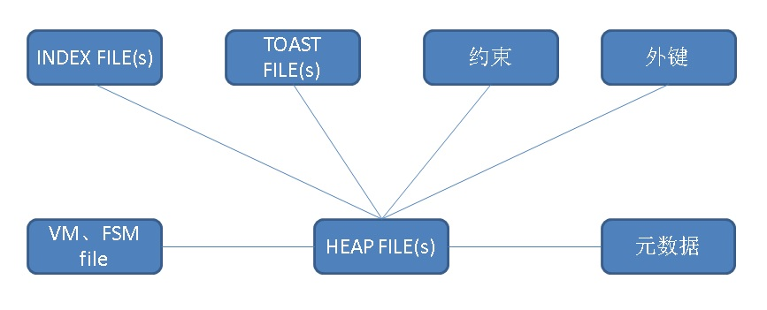

## PostgreSQL 通过分割heap数据文件分拆表的hacking方法  
                                                                 
### 作者                                                                 
digoal                                                                 
                                                                 
### 日期                                                                 
2018-03-01                                
                                                                 
### 标签                                                                 
PostgreSQL , heap file , toast file , 分区 , split , 拆表 , 大表    
                                                                 
----                                                                 
                                                                 
## 背景      
为什么要将一张大表拆成若干张小表？前面的文档给出了原因  
  
[《PostgreSQL 并行vacuum patch - 暨为什么需要并行vacuum或分区表》](../201803/20180301_01.md)     
  
[《HTAP数据库 PostgreSQL 场景与性能测试之 45 - (OLTP) 数据量与性能的线性关系(10亿+无衰减), 暨单表多大需要分区》](../201711/20171107_46.md)    
  
那么如何拆呢？pg_pathman提供了一种平滑将单表拆成多张分区表的方法。这种方法涉及到数据的迁移。  
  
[《PostgreSQL 9.5+ 高效分区表实现 - pg_pathman》](../201610/20161024_01.md)    
  
本文使用一种比较HACKING的方法，将单表拆成多表。(仅供玩耍，请勿用于生产)  
  
方法是直接针对数据文件下手。  
  
## 测试  
  
1、创建一个表，202个字段。（全部是inline存储的字段，没有用到toast）  
  
```  
do language plpgsql $$  
declare  
  sql text;  
begin  
  sql := 'create table aa (id int,';  
  for i in 1..100 loop  
    sql := sql||'c'||i||' int default random()*10000000,';  
  end loop;  
  for i in 101..200 loop  
    sql := sql||'c'||i||' float8 default random()*10000000,';  
  end loop;  
  sql := sql||'ts timestamp default clock_timestamp() )';  
  execute sql;  
end;  
$$;  
```  
  
2、写入若干记录  
  
```  
postgres=# insert into aa (id) select generate_series(1,3000000);  
INSERT 0 3000000  
```  
  
3、查看当前表的文件存储路径  
  
  
```  
postgres=# select pg_relation_filepath('aa');  
 pg_relation_filepath   
----------------------  
 base/20699/66326  
(1 row)  
```  
  
4、在数据文件目录中，找到对应的数据文件。  
  
```  
postgres@host-> cd $PGDATA  
postgres@host-> ll base/20699/66326*  
-rw------- 1 postgres postgres  1.0G Mar  1 11:24 base/20699/66326  
-rw------- 1 postgres postgres  1.0G Mar  1 11:25 base/20699/66326.1  
-rw------- 1 postgres postgres  1.0G Mar  1 11:25 base/20699/66326.2  
-rw------- 1 postgres postgres  835M Mar  1 11:25 base/20699/66326.3  
-rw------- 1 postgres postgres 1000K Mar  1 11:25 base/20699/66326_fsm  
```  
  
简单解释一下带后缀的意思，  
  
4\.1、数字后缀，如果数据文件超过1GB时（根据编译时指定```--with-segsize=SEGSIZE  set table segment size in GB [1]```决定一个文件的大小），会按数字开始命名，扩展更多文件数。  
  
4\.2、fsm后缀，表示这个文件是free space mapping文件，大概意思是每个BLOCK剩余多少空间（实际上是分位数，并不是精确值）。  
  
4\.3、vm后缀，visibility mapping文件，每个BLOCK占用2个BIT位，表示是否有脏数据，是否clean等信息。  
  
4\.4、init后缀，表示它是unlogged table。  
  
5、因为占用了4个文件，所以我们创建4个目标表，使用继承关系关联起来。  
  
```  
postgres=# create table bb (like aa including all);   
  
postgres=# create table bb1 (like bb including all) inherits (bb);   
  
postgres=# create table bb2 (like bb including all) inherits (bb);   
  
postgres=# create table bb3 (like bb including all) inherits (bb);   
  
postgres=# create table bb4 (like bb including all) inherits (bb);   
```  
  
6、查看4个目标表的数据文件路径  
  
```  
postgres=# select pg_relation_filepath('bb1');  
 pg_relation_filepath   
----------------------  
 base/20699/66533  
(1 row)  
  
postgres=# select pg_relation_filepath('bb2');  
 pg_relation_filepath   
----------------------  
 base/20699/66739  
(1 row)  
  
postgres=# select pg_relation_filepath('bb3');  
 pg_relation_filepath   
----------------------  
 base/20699/66945  
(1 row)  
  
postgres=# select pg_relation_filepath('bb4');  
 pg_relation_filepath   
----------------------  
 base/20699/67151  
(1 row)  
```  
  
7、停库，将数据文件一对一的拷贝到4个目标表。每个表占用一个文件。  
  
```  
postgres@host-> cd $PGDATA  
postgres@host-> ll base/20699/66533*  
-rw------- 1 postgres postgres 0 Mar  1 11:26 base/20699/66533  
  
cp base/20699/66326 base/20699/66533  
  
cp base/20699/66326.1 base/20699/66739  
  
cp base/20699/66326.2 base/20699/66945  
  
cp base/20699/66326.3 base/20699/67151  
```  
  
8、启动数据库  
  
```  
pg_ctl start  
```  
  
9、验证数据拆分是否准确  
  
记录级验证  
  
```  
postgres=# select count(*) from bb1;  
 count    
--------  
 786432  
(1 row)  
  
postgres=# select count(*) from bb2;  
 count    
--------  
 786432  
(1 row)  
  
postgres=# select count(*) from bb3;  
 count    
--------  
 786432  
(1 row)  
  
postgres=# select count(*) from bb4;  
 count    
--------  
 640704  
(1 row)  
  
postgres=# select count(*) from aa;  
  count    
---------  
 3000000  
(1 row)  
  
postgres=# select count(*) from bb;  
  count    
---------  
 3000000  
(1 row)  
```  
  
行级验证，验证HASH是否一致  
  
```  
postgres=# select sum(hashtext(aa.*::text)) from aa;  
      sum        
---------------  
 4322646507500  
(1 row)  
  
  
postgres=# select sum(hashtext(bb.*::text)) from bb;  
      sum        
---------------  
 4322646507500  
(1 row)  
```  
  
10、小插曲，vacuum新表时报错，原因是新表的frozenxid比数据文件中XID还小。  
  
```  
postgres=# vacuum bb1;  
ERROR:  found xmin 366891771 from before relfrozenxid 366891776  
```  
  
11、修正pg_class元数据，改成元表xid即可  
  
```  
postgres=# select * from pg_class where relname='bb1';  
-[ RECORD 1 ]-------+----------  
relname             | bb1  
relnamespace        | 35988  
reltype             | 66535  
reloftype           | 0  
relowner            | 10  
relam               | 0  
relfilenode         | 66533  
reltablespace       | 0  
relpages            | 0  
reltuples           | 0  
relallvisible       | 0  
reltoastrelid       | 0  
relhasindex         | f  
relisshared         | f  
relpersistence      | p  
relkind             | r  
relnatts            | 202  
relchecks           | 0  
relhasoids          | f  
relhaspkey          | f  
relhasrules         | f  
relhastriggers      | f  
relhassubclass      | f  
relrowsecurity      | f  
relforcerowsecurity | f  
relispopulated      | t  
relreplident        | d  
relispartition      | f  
relfrozenxid        | 366891776  
relminmxid          | 1  
relacl              |   
reloptions          |   
relpartbound        |   
  
  
postgres=# update pg_class set relfrozenxid='366891771'::xid where relname='bb1';  
UPDATE 1  
postgres=# update pg_class set relfrozenxid='366891771'::xid where relname='bb2';  
UPDATE 1  
postgres=# update pg_class set relfrozenxid='366891771'::xid where relname='bb3';  
UPDATE 1  
postgres=# update pg_class set relfrozenxid='366891771'::xid where relname='bb4';  
UPDATE 1  
```  
  
vacuum准确  
  
```  
postgres=# vacuum freeze bb1;  
VACUUM  
postgres=# vacuum freeze bb2;  
VACUUM  
postgres=# vacuum freeze bb3;  
VACUUM  
postgres=# vacuum freeze bb4;  
VACUUM  
```  
  
### HEAP文件的关联关系  
  
  
  
一张表的数据可能有多个堆存储文件+TOAST文件组成，如果我们要直接用堆存储文件分割表，那么会涉及一些这样的关联关系：  
  
1、索引，索引文件预HEAP文件并不是一一对应，因此分割后，需要重建索引。  
  
2、TOAST，TOAST指那些超过1/4 PAGE SIZE的变长列，会以TOAST形式来进行组织，TOAST记录与HEAP文件并无关系，而是与HEAP文件中的每条记录中的TOAST POINT关联。所以我们在分割后，需要让数据库知道如果从TOAST POINT找到对应的TOAST中的记录（可能会涉及pg_class中TOAST元数据对应关系的修改）。  
  
3、约束，主要指外键，当分割后，其他表REFERRENCE你这张表就可能失效。  
  
4、vm, fsm file，这个和HEAP文件是多对一的关系，可以重建，不影响使用。  
  
5、元数据，指表的FROZENXID（存在pg_class中）与HEAP文件中的记录的XID的前后关系，frozenxid不能大于HEAP文件中的XID。  
  
### 涉及到toast表、索引时，SPLIT更加复杂。  
  
1、TOAST表的组织形式可能和HEAP文件不一一对应，同TOAST对象的关联关系需要修正。  
  
2、索引文件的组织形式和HEAP文件不一一对应。  
  
有索引的话，干掉索引，重建。  
  
## 小结  
本文提供了一种高效SPLIT的思路，方法比较hacking，并且仅适用于没有extended, external存储（变长字段）TOAST外部存储的情况。请勿用于生产。  
  
  
## 参考    
[《PostgreSQL 并行vacuum patch - 暨为什么需要并行vacuum或分区表》](../201803/20180301_01.md)     
  
[《PostgreSQL 9.5+ 高效分区表实现 - pg_pathman》](../201610/20161024_01.md)    
     
       
  
<a rel="nofollow" href="http://info.flagcounter.com/h9V1"  ></a>  
  
  
  
  
  
  
## [digoal's 大量PostgreSQL文章入口](https://github.com/digoal/blog/blob/master/README.md "22709685feb7cab07d30f30387f0a9ae")
  
