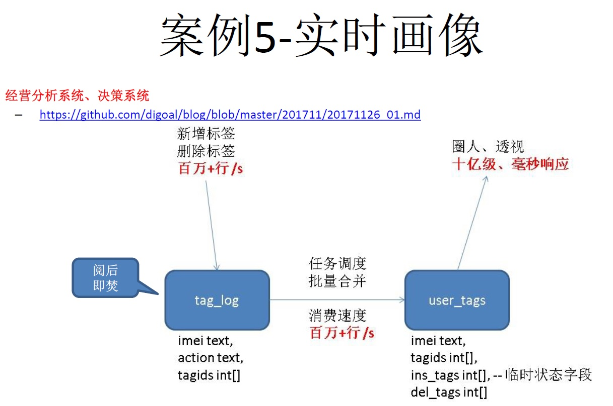

## PostgreSQL 社交类好友关系系统实践 - 正反向关系查询加速  
                                                           
### 作者                                                           
digoal                                                           
                                                           
### 日期                                                           
2018-03-02                                                         
                                                           
### 标签                                                           
PostgreSQL , 好友关系 , 正向关系 , 反向关系     
                                                           
----                                                           
                                                           
## 背景   
关系系统在很多设计类应用中非常常见，例如查询你有哪些好友，你是哪些人的好友。  
  
又比如我LIKE了哪些人，哪些人LIKE了我。  
  
比如在之前的"PCC大赛 - facebook\微博 like场景"，也是类似的场景。  
  
[《三体高可用PCC大赛 - facebook\微博 like场景 - 数据库设计与性能压测》](../201705/20170512_02.md)    
  
那么如何加快正向和反向关系的查询呢？  
  
在数据库中多行查询和单行查询的效率差别是非常大的，原因是多行查询需要运行更多的代码（例如DEFORM，这里有解释 [《PostgreSQL 向量化执行插件(瓦片式实现-vops) 10x提速OLAP》](../201702/20170225_01.md)  ），当然多行查询有多行查询的好处，比如返回少量记录时，多行比单行号。  
  
为了提高返回与某个ID相关所有关系，我们可以采用将多行压缩为一行的方法。  
  
## 1. 实时流式正反向关系生成方案  
使用规则，将明细数据自动转换为多行数据。  
  
好处，实时。  
  
缺陷，每次都要更新合成表的大行，在多版本实现中，产生垃圾较多，并且在热点用户上容易出现瓶颈。（比如某些用户有很多人关注，那么它的关系会很大。）  
  
实施举例：  
  
1、创建原始关系表  
  
```  
create table t(uid1 int, uid2 int, primary key(uid1,uid2));  
```  
  
2、创建正向和反向关系表，使用数组表示一对多的关系  
  
```  
create table t1(uid int primary key, fid int[]);  
  
create table t2(uid int primary key, fid int[]);  
```  
  
3、创建一个intarray插件，用于对数组去重。  
  
```  
create extension intarray;  
```  
  
4、创建规则，当数据写入原始关系表时，自动将关系合并到正向和反向关系表的记录中。  
  
```  
create rule r1 as on insert to t do also insert into t1 values (NEW.uid1, array[NEW.uid2]) on conflict (uid) do update set fid=uniq(sort(t1.fid||NEW.uid2));  
  
create rule r2 as on insert to t do also insert into t2 values (NEW.uid2, array[NEW.uid1]) on conflict (uid) do update set fid=uniq(sort(t2.fid||NEW.uid1));  
```  
  
5、压测函数，即写入用户之间的关系。  
  
```  
create or replace function ins_rel( int, int ) returns void as $$  
declare  
begin  
  insert into t values ($1,$2);  
  return;  
  exception when others then  
    return;  
end;  
$$ language plpgsql strict;  
```  
  
6、压测  
  
```  
vi test.sql  
\set uid1 random(1,100000)  
\set uid2 random(1,2000)  
select ins_rel(:uid1,:uid2);  
  
pgbench -M prepared -n -r -P 1 -f ./test.sql -c 32 -j 32 -T 120  
```  
  
7、查看正向和反向关系记录例子  
  
```  
postgres=# select * from t1 limit 3;  
  uid  |                                                              fid                                                                 
-------+--------------------------------------------------------------------------------------------------------------------------------  
 27627 | {60,77,258,301,412,574,649,651,709,780,805,811,998,1031,1066,1151,1173,1251,1284,1392,1586,1602,1616,1659,1708,1879,1932,1982}  
 78532 | {106,288,416,474,566,765,853,1003,1154,1166,1352,1657,1689,1707,1722}  
 81317 | {14,109,258,275,293,499,586,593,633,716,720,732,766,807,927,1052,1508,1518,1633,1662,1791,1848,1885,1946,1951}  
(3 rows)  
  
postgres=# select * from t2 limit 1;  
uid | 19  
fid | {25,119,224,291,317,421,470,574,637,683,857,905,1131,1451,1474,1573,1606,1950,2039,2077,2297,2464,2693,2716,2722,2832,2871,3062,3158,3167,3217,3265,3288,3428,3602,3644,3660,3799,3850,3899,3906,3966,4134,4177,4268,4308,4411,4477,4509,4517,4522,4709,4736,4781,4892,5142,5214,5235,5363,5429,5473,5485,5491,5535,5752,5778,5828,5851,5950,5965,5988,6042,6071,6190,6238,6254,6343,6483,6555,6743,6820,6917,6980,7006,7032,7075,7205,7289,7410,7434,7618,7936,7987,7995,8102,8281,8370,8439,8463,8509,8622,8731,8786,8866,8899,9020,9033,9082,9142,9308,9406,9413,9829,9876,9976,10116,10360,10396,10428,10680,10710,10950,11170,11187,11197,11200,11243,11370,11395,11500,11506,11594,11695,11878,11963,12055,12077,12196,12211,12261,12332,12333,12341,12486,12627,12843,12864,12976,13037,13206,13267,13353,13354,13359,13383,13411,13633,13637,13778,13837,13860,13928,13968,13976,14036,14058,14150,14196,14284,14435,14724,14743,14774,14831,15086,15138,15367,15376,15407,15692,15755,15820,15870,15925,16057,16129,16288,16292,16388,16397,16426,16482,16812,17006,17013,17025,17159,17165,17402,17489,17494,17539,17883,17977,17991,18173,18180,18249,18253,18306,18487,18557,18730,18777,18881,18914,19102,19125,19245,19273,19448,19477,19534,19578,19751,19951,19973,20037,20043,20182,20244,20248,20388,20423,20588,20625,20727,20851,20884,20911,21300,21345,21401,21416,21442,21456,21465,21564,21747,21826,21841,21844,22051,22154,22168,22208,22215,22315,22322,22374,22400,22476,22617,22621,22626,22666,22786,22853,23014,23142,23539,23565,23580,23586,23620,23658,23976,24013,24014,24046,24059,24377,24546,24688,24723,24905,24951,25129,25192,25255,25445,25592,25723,25779,25814,25863,25880,25886,25963,26006,26020,26117,26273,26298,26318,26344,26347,26378,26399,26494,26561,26600,26607,26700,26721,26754,26755,26841,26849,26863,26884,26954,27071,27073,27140,27176,27237,27246,27256,27270,27315,27323,27434,27469,27510,27547,27565,27799,27918,27921,28045,28055,28168,28181,28310,28425,28531,28628,28769,28796,28924,28993,29009,29098,29145,29180,29238,29301,29542,29581,29625,29879,29953,29958,29994,30005,30029,30203,30276,30358,30423,30445,30472,30518,30581,30587,30593,30800,30855,30860,30885,30927,30946,31033,31256,31329,31416,31445,31554,31663,31762,31768,31807,31831,31845,31890,31891,32257,32329,32384,32864,32866,32942,33161,33299,33395,33437,33492,33828,33870,33876,33936,33989,34114,34236,34386,34752,34835,34847,35125,35402,35479,35492,35503,35543,35575,35756,35924,35987,36044,36191,36210,36212,36235,36313,36315,36341,36508,36568,36640,36676,36705,36800,36911,37002,37074,37075,37080,37084,37127,37149,37237,37248,37424,37445,37486,37547,37573,37625,37699,38083,38150,38254,38255,38297,38339,38436,38486,38500,38507,38563,38616,38750,38768,38790,38931,38946,38948,39079,39117,39141,39271,39400,39788,39802,39813,39853,40096,40122,40162,40225,40245,40256,40298,40329,40430,40452,40496,40556,40604,40631,40770,40794,40913,41017,41051,41435,41490,41523,41596,41699,41841,41844,41870,41969,42020,42056,42152,42190,42214,42279,42356,42376,42432,42623,42731,42810,43055,43107,43167,43221,43276,43389,43498,43505,43542,43549,43651,43802,43979,44033,44057,44167,44326,44378,44536,44611,44646,44816,44895,44901,44996,45076,45114,45148,45208,45227,45470,45482,45521,45565,45609,45728,45811,45894,45955,45989,46106,46424,46468,46500,46564,46577,46745,46792,46840,46945,46963,46965,47057,47172,47236,47503,47510,47541,47726,47752,47792,47856,47864,47966,48003,48169,48267,48282,48409,48436,48455,48505,48507,48964,49111,49221,49235,49364,49577,49701,50183,50270,50591,50727,50949,51014,51174,51284,51287,51350,51358,51426,51435,51533,51534,51606,51647,51757,51823,51830,51939,51949,51970,52262,52668,52684,52766,52926,52968,52982,53009,53054,53262,53370,53420,53526,53530,53573,53612,53687,53757,53854,53993,54047,54079,54093,54234,54236,54255,54259,54379,54397,54434,54545,54583,54595,54612,54636,54643,54678,54887,55034,55345,55378,55381,55428,55442,55510,55547,55750,55937,55947,56030,56067,56098,56172,56174,56330,56337,56438,56503,56610,56622,56825,56844,56881,56883,56976,57098,57292,57353,57551,57587,57588,57636,57662,57672,57685,57693,57787,57794,58064,58069,58122,58314,58318,58588,58663,58912,58990,59090,59095,59162,59311,59342,59431,59534,59536,59579,59760,59819,59865,59868,60099,60229,60242,60338,60342,60354,60373,60374,60415,60512,60513,60518,60531,60589,60757,60803,61104,61197,61201,61215,61253,61439,61446,61513,61553,61686,61696,61874,62062,62274,62348,62449,62471,62490,62584,62654,62671,62763,62766,62808,63018,63044,63142,63282,63295,63363,63375,63419,63427,63431,63577,63590,63636,63642,63646,63678,63706,63816,63862,63915,63978,64039,64104,64131,64143,64323,64365,64394,64397,64449,64502,64535,64671,64849,64855,64971,65004,65039,65165,65228,65239,65330,65407,65446,65567,65691,65709,65741,65768,65874,65876,65882,65955,66068,66178,66410,66423,66425,66488,66493,66540,66770,67017,67284,67360,67509,67537,67579,67663,67691,67750,67821,67855,67932,67964,68023,68031,68076,68195,68301,68525,68618,68684,68779,68789,68815,68833,68876,68955,69075,69145,69160,69187,69244,69500,69541,69585,69599,69691,69698,69747,69766,69782,69864,70039,70105,70151,70225,70238,70248,70256,70325,70378,70392,70495,70540,70699,70913,70919,70957,71047,71093,71149,71349,71489,71583,71639,71702,71841,71893,71922,71970,71971,71983,72071,72074,72184,72229,72343,72404,72429,72446,72536,72660,72662,72675,72714,72718,72858,72903,72986,73042,73069,73097,73102,73160,73174,73313,73417,73426,73464,73601,73778,73867,73966,73978,74057,74189,74253,74257,74270,74357,74441,74450,74484,74574,74590,74863,74896,74903,74970,75024,75048,75076,75161,75251,75285,75287,75427,75488,75638,75704,75999,76077,76117,76169,76252,76456,76745,76810,77058,77109,77110,77194,77401,77411,77427,77530,77565,77610,77634,77663,77765,77776,77852,77861,77929,77954,78007,78320,78326,78348,78365,78419,78441,78588,78663,78733,78745,78838,78887,78896,78964,79140,79142,79569,79772,79834,79846,79855,80089,80169,80297,80521,80535,80655,80753,80793,80890,81039,81065,81114,81225,81397,81408,81461,81463,81560,81575,81607,81644,81673,81686,81702,81756,81762,81772,81866,82090,82200,82247,82273,82320,82432,82589,82615,82659,82680,83078,83100,83127,83249,83578,83607,83609,83714,83792,83817,83894,83952,84016,84086,84088,84182,84299,84469,84487,84529,84544,84574,84607,84701,84721,84764,84775,84832,85044,85098,85334,85547,85574,85740,85809,85824,85875,86070,86078,86277,86342,86445,86536,86628,86651,86775,86801,86961,86967,87021,87242,87316,87318,87480,87498,87543,87683,87700,87759,87780,87839,87883,88053,88187,88198,88322,88533,88535,88752,88765,89034,89053,89115,89168,89191,89401,89624,89692,89771,89851,89896,90051,90056,90072,90077,90079,90180,90187,90499,90500,90616,90627,90717,91002,91075,91279,91295,91314,91343,91365,91498,91502,91550,91561,91587,91671,91857,91912,92085,92106,92342,92372,92501,92717,92967,93063,93084,93092,93113,93244,93320,93433,93541,93680,93684,93719,93809,94049,94077,94139,94221,94277,94309,94530,94555,94686,94690,94920,94936,94996,95219,95258,95333,95465,95614,95640,95753,95755,95779,95906,96158,96183,96225,96339,96347,96577,96648,96870,96894,97030,97121,97152,97162,97174,97237,97542,97599,97607,97686,97705,97708,97718,97728,97817,97990,97997,98172,98246,98313,98452,98521,98581,98636,98831,98870,98926,98962,98976,99055,99112,99260,99419,99462,99470,99546,99573,99720,99777,99906}  
```  
  
8、对比正反向关系是否与原始表一致。对比HASH即可，表示完全一致。  
  
```  
postgres=# select sum(hashtext(t.*::text)) from t;  
      sum        
---------------  
 -137085631634  
(1 row)  
  
postgres=# select sum(hashtext) from (select hashtext((t1.uid, unnest(t1.fid))::text) from t1) t;  
      sum        
---------------  
 -137085631634  
(1 row)  
  
postgres=# select sum(hashtext) from (select hashtext((unnest(t2.fid), t2.uid)::text) from t2) t;  
      sum        
---------------  
 -137085631634  
(1 row)  
```  
  
## 2. 批量异步流式正反向关系生成方案  
由于第一种方法的缺陷，如容易有热点用户，容易导致IO放大，容易导致关系写入RT升高。  
  
我们这里可以使用批量合并的方法，类似我在之前讲的某个手机厂商的手机用户画像系统，贴、删、改标签，使用日志的形式生成数据，然后对FEED数据阅后即焚，合并到标签表。  
  
  
  
[《PostgreSQL手机行业经营分析、决策系统设计 - 实时圈选、透视、估算》](../201711/20171126_01.md)    
  
本例一样，可以使用同样的方法，将like, unlike的动作，写成日志，然后再批量的消费这个日志，并将关系更新到正向、反向关系表。  
  
批量阅后即焚，还有其他的一些例子和性能参考指标。  
  
[《阿里云RDS PostgreSQL varbitx实践 - 流式标签 (阅后即焚流式批量计算) - 万亿级，任意标签圈人，毫秒响应》](../201712/20171212_01.md)    
  
[《HTAP数据库 PostgreSQL 场景与性能测试之 32 - (OLTP) 高吞吐数据进出(堆存、行扫、无需索引) - 阅后即焚(JSON + 函数流式计算)》](../201711/20171107_33.md)    
  
[《HTAP数据库 PostgreSQL 场景与性能测试之 31 - (OLTP) 高吞吐数据进出(堆存、行扫、无需索引) - 阅后即焚(读写大吞吐并测)》](../201711/20171107_32.md)    
  
[《HTAP数据库 PostgreSQL 场景与性能测试之 27 - (OLTP) 物联网 - FEED日志, 流式处理 与 阅后即焚 (CTE)》](../201711/20171107_28.md)    
  
[《在PostgreSQL中实现update | delete limit - CTID扫描实践  (高效阅后即焚)》](../201608/20160827_01.md)    
  
## 正向、反向关系查询性能对比  
对比原始表、正向、反向关系表查询性能对比。  
  
```  
pgbench -M prepared -n -r -P 1 -f ./test.sql -c 56 -j 56 -T 120  
```  
  
1、原始表，增加单字段索引。  
  
```  
postgres=# create index idx_t_1 on t(uid1);  
CREATE INDEX  
postgres=# create index idx_t_2 on t(uid2);  
CREATE INDEX  
```  
  
2、原始表，正向关系查询性能  
  
```  
\set uid1 random(1,100000)  
\set uid2 random(1,2000)  
select * from t where uid1=:uid1;  
  
  
transaction type: ./test.sql  
scaling factor: 1  
query mode: prepared  
number of clients: 56  
number of threads: 56  
duration: 120 s  
number of transactions actually processed: 73916179  
latency average = 0.091 ms  
latency stddev = 0.014 ms  
tps = 615905.000776 (including connections establishing)  
tps = 615979.071532 (excluding connections establishing)  
script statistics:  
 - statement latencies in milliseconds:  
         0.002  \set uid1 random(1,100000)  
         0.001  \set uid2 random(1,2000)  
         0.089  select * from t where uid1=:uid1;  
```  
  
3、原始表，反向关系查询性能  
  
```  
\set uid1 random(1,100000)  
\set uid2 random(1,2000)  
select * from t where uid2=:uid2;  
  
  
  
transaction type: ./test.sql  
scaling factor: 1  
query mode: prepared  
number of clients: 56  
number of threads: 56  
duration: 120 s  
number of transactions actually processed: 2784841  
latency average = 2.413 ms  
latency stddev = 0.116 ms  
tps = 23204.361967 (including connections establishing)  
tps = 23207.284520 (excluding connections establishing)  
script statistics:  
 - statement latencies in milliseconds:  
         0.002  \set uid1 random(1,100000)  
         0.001  \set uid2 random(1,2000)  
         2.411  select * from t where uid2=:uid2;  
```  
  
4、正向关系表，查询性能  
  
```  
\set uid1 random(1,100000)  
\set uid2 random(1,2000)  
select * from t1 where uid=:uid1;  
  
  
  
transaction type: ./test.sql  
scaling factor: 1  
query mode: prepared  
number of clients: 56  
number of threads: 56  
duration: 120 s  
number of transactions actually processed: 85533010  
latency average = 0.079 ms  
latency stddev = 0.012 ms  
tps = 712676.961185 (including connections establishing)  
tps = 712758.158291 (excluding connections establishing)  
script statistics:  
 - statement latencies in milliseconds:  
         0.002  \set uid1 random(1,100000)  
         0.001  \set uid2 random(1,2000)  
         0.077  select * from t1 where uid=:uid1;  
```  
  
5、反向关系表，查询性能  
  
```  
\set uid1 random(1,100000)  
\set uid2 random(1,2000)  
select * from t2 where uid=:uid2;  
  
transaction type: ./test.sql  
scaling factor: 1  
query mode: prepared  
number of clients: 56  
number of threads: 56  
duration: 120 s  
number of transactions actually processed: 25649777  
latency average = 0.262 ms  
latency stddev = 0.037 ms  
tps = 213695.286456 (including connections establishing)  
tps = 213719.115995 (excluding connections establishing)  
script statistics:  
 - statement latencies in milliseconds:  
         0.002  \set uid1 random(1,100000)  
         0.001  \set uid2 random(1,2000)  
         0.260  select * from t2 where uid=:uid2;  
```  
  
对比测试|正向关系TPS|反向关系TPS  
---|---|---  
原始方法 | 61.6万 | 2.3万   
正反向表数组查询 | 71.3万 | 21.4万  
  
关系记录数越多，使用数组存储正反向关系的性能提升越明显。  
  
## 小结  
关系系统在很多设计类应用中非常常见，例如查询你有哪些好友，你是哪些人的好友。  
  
使用原始关系进行查询，如果要批量取出所有相关关系，由于记录数比较多，可能导致整体的RT比较高，TPS吞吐较低。  
  
我们使用实时流计算、批量流量计算的方法，可以将关系整合成正、反向的关系，一个用户一条记录，使用数组存储一对多的关系。  
  
整合后，性能有非常明显的提升。  
  
  
## 参考  
  
[《三体高可用PCC大赛 - facebook\微博 like场景 - 数据库设计与性能压测》](../201705/20170512_02.md)    
  
[《阿里云RDS PostgreSQL varbitx实践 - 流式标签 (阅后即焚流式批量计算) - 万亿级，任意标签圈人，毫秒响应》](../201712/20171212_01.md)    
  
[《HTAP数据库 PostgreSQL 场景与性能测试之 32 - (OLTP) 高吞吐数据进出(堆存、行扫、无需索引) - 阅后即焚(JSON + 函数流式计算)》](../201711/20171107_33.md)    
  
[《HTAP数据库 PostgreSQL 场景与性能测试之 31 - (OLTP) 高吞吐数据进出(堆存、行扫、无需索引) - 阅后即焚(读写大吞吐并测)》](../201711/20171107_32.md)    
  
[《HTAP数据库 PostgreSQL 场景与性能测试之 27 - (OLTP) 物联网 - FEED日志, 流式处理 与 阅后即焚 (CTE)》](../201711/20171107_28.md)    
  
[《在PostgreSQL中实现update | delete limit - CTID扫描实践  (高效阅后即焚)》](../201608/20160827_01.md)    
  
[《PostgreSQL手机行业经营分析、决策系统设计 - 实时圈选、透视、估算》](../201711/20171126_01.md)    
  
  
  
<a rel="nofollow" href="http://info.flagcounter.com/h9V1"  ></a>  
  
  
  
  
  
  
## [digoal's 大量PostgreSQL文章入口](https://github.com/digoal/blog/blob/master/README.md "22709685feb7cab07d30f30387f0a9ae")
  
