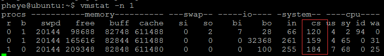
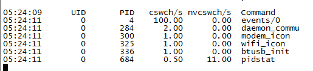
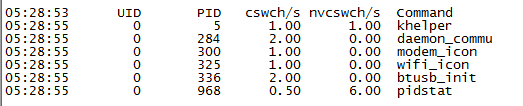

## [转载] [嵌入式开发]Linux性能分析——上下文切换  
      
### 作者      
digoal      
      
### 日期      
2018-03-12     
      
### 标签      
PostgreSQL , Linux , 上下文切换   
      
----      
      
## 背景   
  
## 原文  
http://www.cnblogs.com/pheye/p/4830058.html  
  
  
## 一、从一个问题说起  
相信很多人在玩手机还是PC时，都曾碰到过这样一种情况，安装的软件多了系统性能就变慢了，但是去查看CPU利用率一直都低于10%，内存也很充足。我在近期的开发工作中就碰到了类似的情况，不同的是，系统此时只有一个测试程序和几个睡眠的后台进程，说明是系统，特别是驱动部分可能出现问题导致的。 从操作系统角度上分析，以下是一些比较可能的原因：  
  
- 1. 大量的中断  
可能是在不断磁盘读写，网络通讯， 也可能是模块使用不当或者硬件上出问题导致外设不断给CPU送中断；  
  
- 2. 系统负载高（注意：不是CPU利用率）   
负载高表示有很多程序等待调度运行，它会导致上下文切换频繁。  
  
- 3. 上下文切换过于频繁   
上下文切换是指CPU从一个进程切换到另一个进程，这个过程也是需要消耗一定时间的。如果说上下文切换过于频繁，说明CPU用于执行进程代码的时间少了。第2点有提到负载高会引起上下文切换频繁，但是上下文切换频繁负载不一定就高。  
  
  
在以往的排查经验中，系统性能下降主要由1引起的，在影响系统性能上表现得比较明显；而2,3则比较隐蔽，即使数值已经异常，只要应用对实时性要求不高，最多就是响应稍慢一些，看不出有什么不妥。因此，底层驱动开发人员一般不会去考虑2,3两点，更别说将它作为评价系统性能的测试指标。刚好我要测试的模块对实时性要求很高，而由于系统在空闲时的上下文切换已经很频繁，测试结果自然不佳。  
  
  
## 二、怎么确认上下文切换频繁?  
　　要解决空闲时上下文切换频繁的问题，首先要了解下多频繁才不正常。/proc/stat文件包含了CPU的活动信息，上下文切换就是其中一项，下面命令输出的粗体大号字体所示，以ctxt开头，它表示系统开机到目前为止的上下文切换总数。  
  
```  
~ # cat /proc/stat  
cpu  635 0 2319 90669 72 0 2 0 0  
cpu0 635 0 2319 90669 72 0 2 0 0  
intr 267849 0 0 0 119 0 0 0 0 13 13 0 0 0 0 12 0 0 0 0 0 0 0 0 0 0 0 0 0 196280 0 0 0 0 61242 1614 0 0 4770 0 0 0 0 0 0 0 0 2 0 0 0 0 0 0 0 0 0 0 3779 0 0 0 0 0 0 0 0 0 0 0 0 0 0 0 0 0 0 0 0 0 0 0 0 0 0 0 0 0 0 0 0 0 0 0 0 0 0 0 0 0 0 0 0 0 0 0 0 0 0 0 0 0 0 0 0 0 0 0 0 0 0 0 0 0 0 0 0 0 0 0 0 0 0 0 0 0 0 0 0 0 0 0 0 0 0 0 0 0 0 0 0 0 0 0 0 0 0 0 0 0 0 1 1 0 1 1 1 0 0 0 0 0 0 0 0 0 0 0 0 0 0 0 0 0 0 0 0 0 0 0 0 0 0 0 0 0 0 0 0 0 0 0 0 0 0 0 0 0 0 0 0 0 0 0 0 0 0 0 0 0 0 0 0 0 0 0 0 0 0 0 0 0 0 0 0 0 0 0 0 0 0 0 0 0 0 0 0 0 0 0 0 0 0 0 0 0 0 0 0 0 0 0 0 0 0 0 0 0 0 0 0 0 0 0 0 0 0 0 0 0 0 0 0 0 0 0 0 0 0 0 0 0 0 0 0 0 0 0 0 0 0 0 0 0 0 0 0 0 0 0 0 0 0 0 0 0 0 0 0 0 0 0 0 0 0 0 0 0 0 0 0 0 0 0 0 0 0 0 0 0 0 0 0 0 0 0 0 0 0 0 0 0 0 0 0 0 0 0 0 0 0 0 0 0 0 0 0 0 0 0 0 0 0 0 0 0 0 0 0 0 0 0 0 0 0 0 0 0 0 0 0 0 0 0 0 0 0 0 0 0 0  
ctxt 444616  
btime 1437983701  
processes 514  
procs_running 1  
procs_blocked 0  
softirq 135729 0 93679 2 0 0 1768 0 2 40278  
```  
  
对于分析问题而言，我们更关心每秒钟的上下文切换次数，可通过以下命令计算。  
  
```  
 $cat /proc/stat | grep ctxt && sleep 30 && cat /proc/stat | grep ctxt  
 ctxt 211015  
 ctxt 218128  
```  
  
　　每秒上下文切换次数=两者差值/30。针对本例，每秒有237次切换，对于一个空闲的系统，这是相当不正常的。正常数值范围一般不超过50次/秒。不过这也不是固定的，需要根据不同的系统环境决定，比如本人在嵌入式开发主要从事开发POS产品，它与作为服务器的Linux系统相比，实际运行的服务会少很多，上下文切换自然应该更少。另外，如果要求更高的实时性，则数值范围还应进一步缩小，本人分析的产品所定的数值范围就要求空闲时不超过30次/秒。 上面介绍的方法在所有Linux产品上都能支持，如果系统带 vmstat ,通过vmstat查看是一个更便捷的方法。测试结果如下图红色方框所示。  
  
  
  
## 三、上下文切换频繁时怎么排查?  
　　仅靠总的上下文切换次数无法定位到哪个进程或者哪个驱动出的问题，这时就需要pidstat（在sysstat包里)可以查看具体到每个进程每秒的上下文切换次数，下图是执行 $pidstat -w 1的结果。  
  
  
  
在继续分析上图之前我们先谈一个概念：CPU密集型的进程和IO密集型的进程。CPU密集型的进程时间片总是不够用，CPU使用率必然升高，不需要查看上下文切换；而IO密集型的进程，会被频繁调度，但是每次只处理一小会，从CPU使用率是看不出异常的，这时就需要查看上下文切换。一般来讲IO密集型的进程（内核线程或用户进程）主要是处理读写磁盘，或者网络进来的数据；但是也可能有的进程没有任何IO交互但是表现得像IO密集型进程，比如使用如下方式：  
  
- 1. 创建一个内核线程，一启动就睡眠；然后创建一个10MS的timer，每次都去唤醒这个内核线程。  
  
- 2. 创建一个用户进程，通过系统调用陷入内核就睡眠，然后创建一个10MS的timer，每次都去唤醒这个进程。  
     
当然，我们不会傻到直接干这样的事，但却可能在无意中间接做了这样的事情，特别是对第1条，比如  
  
- 1. 创建一个工作队列，创建一个10MS的timer，每次去schedule_work。  
　　  
  
工作队列也是由一个内核线程在管理，导致的结果就是该内核线程上下文切换将变得极为频繁。 对于上下文切换频繁的进程，我们的关注点就是确认它们是否是IO密集型的，以及在当前系统状态下是否应该表现得像IO密集型进程。 比如一个处理网络数据的进程，如果在没有数据的情况下，也表现得像IO密集型，有很高的切换上下文动作，可能这个进程或者该进程打开的设备驱动设计得不合理。  
  
　　有两个内核线程kswapd和events(新内核改为kworker)，在特定情况下会表现得像IO密集型进程。其中kswapd是用于管理虚拟内存的，当物理内存不足，需要频繁交换虚拟内存，kswapd的上下文切换将明显增多；而events用来处理工作队列，当不断有work进入排队且这些work处理时间很短时，events的上下文切换会明显增多，对于这种情况，需要分析具体是由哪个驱动引起的。  
  
　　回到pidstat的输出，可以看到events/0的上下文切换很高，既然没有什么进程会导致该结果，就只可能是某个驱动文件（ko)在不断地排队work。目前我没有找到比较高效的方法可以迅速定位到每个ko文件对work的使用情况，只能通过lsmod打出已经加载的驱动，并跟以前的系统版本对比哪些做了修改以做对比。最终定位出确实存在某个驱动创建一个10MS的timer，并且每次都schedule_work。在对该驱动优化后，再次输入pidstat -w 1测试，可以看到所有进程的下下文切换都降得很低了。  
  
  
  
四、附录  
1、交叉编译sysstat 一般的板子都不会带pidstat，需要自己下载sysstat的包编译。好在sysstat直接使用工具链就能编译。操作步骤： 进入源码目录  
  
```  
 $mkdir output  
 $export SA_DIR=`pwd`/output/var/log/sa  
 $export conf_dir=`pwd`/output/etc/kksysconfig  
 $./configure --prefix=`pwd`/output --host=arm-none-linux-gnueabi --disable-man-group  
 $make   
 $make install  
```  
  
将output下的bin和lib拷到板子即可。注意交叉编译时要在configure时指名工具链名称，如果你的工具链是arm-none-linux-gnueabi-gcc，那么就传递参数--host=arm-none-linux-gnueabi,如果是arm-eabi-gcc,那么就传递参数--host=arm-eabi，按此规则修改。  
  
2、参考文献  
  
[Linux的各种统计信息](http://blog.csdn.net/plusboy/article/details/1528252)  
  
[CPU-上下文切换，运行队列和使用率](http://blog.itpub.net/24435147/viewspace-694469/)  
  
[进程上下文切换-残酷的性能杀手（上）](http://www.cnblogs.com/zhiranok/archive/2012/08/13/context_switch_1.html)  
  
[使用pidstat查看Context Switch上下文切换](http://www.6san.com/1197/)  
  
<a rel="nofollow" href="http://info.flagcounter.com/h9V1"  ></a>  
  
  
  
  
  
  
## [digoal's 大量PostgreSQL文章入口](https://github.com/digoal/blog/blob/master/README.md "22709685feb7cab07d30f30387f0a9ae")
  
