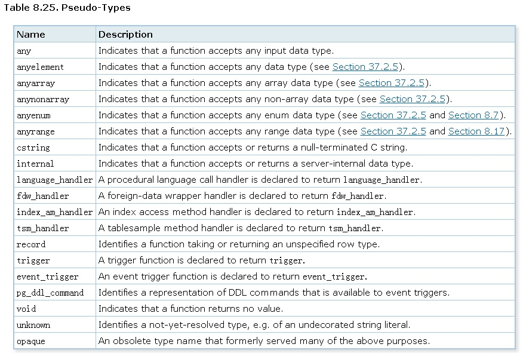

## [未完待续] PostgreSQL Oracle 兼容性之 - sys.anydata  
                                                           
### 作者                                                           
digoal                                                           
                                                           
### 日期                                                           
2018-03-12                                                         
                                                           
### 标签                                                           
PostgreSQL , Oracle 兼容性 , anydata , anytype       
                                                           
----                                                           
                                                           
## 背景     
Oracle里面有一个类型sys.anydata，它可以存任意类型。  
  
这个有点是一个协议的里面包了一层协议。或者说是一个容器，在这个容器里存了任意其他类型。  
  
它有什么好处？实际上数据库是强类型的应用，而且通常也是这么来应用的，一般一个列定义一种类型。  
  
然而sys.anydata允许你存任意类型。  
  
```  
tkyte@TKYTE9I.US.ORACLE.COM> create table t ( x sys.anyData );   
Table created.   
  
tkyte@TKYTE9I.US.ORACLE.COM> insert into t values ( sys.anyData.convertNumber(5) );   
  
1 row created.   
  
tkyte@TKYTE9I.US.ORACLE.COM> insert into t values ( sys.anyData.convertDate(sysdate) );   
  
1 row created.   
  
tkyte@TKYTE9I.US.ORACLE.COM> insert into t values ( sys.anyData.convertVarchar2('hello world') );   
  
1 row created.   
```  
  
  
Use the getTypeName method of the ANYDATA function to see whats   
in there....   
  
```  
tkyte@TKYTE9I.US.ORACLE.COM> select t.x.gettypeName() typeName from t t;   
  
TYPENAME   
--------------------   
SYS.NUMBER   
SYS.DATE   
SYS.VARCHAR2   
```  
  
  
Unfortunately, they don't have a method to display the contents of   
ANYDATA in a query (most useful in programs that will fetch the data,   
figure out what it is and do something with it -- eg: the application   
has some intelligence as to how to handle the data)   
  
Fortunately we can write one tho:   
  
```  
tkyte@TKYTE9I.US.ORACLE.COM>   
1 create or replace function getData( p_x in sys.anyData ) return varchar2   
2 as   
3 l_num number;   
4 l_date date;   
5 l_varchar2 varchar2(4000);   
6 begin   
7 case p_x.gettypeName   
8 when 'SYS.NUMBER' then   
9 if ( p_x.getNumber( l_num ) = dbms_types.success )   
10 then   
11 l_varchar2 := l_num;   
12 end if;   
13 when 'SYS.DATE' then   
14 if ( p_x.getDate( l_date ) = dbms_types.success )   
15 then   
16 l_varchar2 := l_date;   
17 end if;   
18 when 'SYS.VARCHAR2' then   
19 if ( p_x.getVarchar2( l_varchar2 ) = dbms_types.success )   
20 then   
21 null;   
22 end if;   
23 else   
24 l_varchar2 := '** unknown **';   
25 end case;   
26   
27 return l_varchar2;   
28 end;   
29 /   
  
Function created.   
  
tkyte@TKYTE9I.US.ORACLE.COM>   
tkyte@TKYTE9I.US.ORACLE.COM> select getData( x ) getdata from t;   
  
GETDATA   
--------------------   
5   
19-MAR-02   
hello world   
```  
  
PostgreSQL内部也支持非常多虚拟类型，它们能够使用在函数的参数，返回类型中，但是无法作为一个列来使用。  
  
  
https://www.postgresql.org/docs/devel/static/datatype-pseudo.html  
  
  
  
## PostgreSQL anydata实现思路  
为了让一个列能够支持所有数据类型，我们需要重新定义一个类型，以及对应的函数、操作符。  
  
1、新类型anydata的in, out函数  
  
2、新类型anydata的send, recv函数  
  
3、解析anydata里面存了什么类型的函数，有一个函数pg_typeof可以用来识别类型，因为我们使用了两层类型，所以需要再实现一个类型提取函数。  
  
```  
postgres=# select pg_typeof(int4send(123));  
 pg_typeof   
-----------  
 bytea  
(1 row)  
```  
  
4、anydata里面存的内容可以使用容器里面的类型的typesend，转换为bytea，然后塞进去。  
  
```  
postgres=# select int4send(123);  
  int4send    
------------  
 \x0000007b  
(1 row)  
  
postgres=# select textsend('hello你好');  
         textsend           
--------------------------  
 \x68656c6c6fe4bda0e5a5bd  
(1 row)  
  
postgres=# select point_send('(120,99)');  
             point_send               
------------------------------------  
 \x405e0000000000004058c00000000000  
(1 row)  
```  
  
5、将里面的内容解析并返回，可以使用容器里面的对应type的typerecv函数。  
  
## 参考  
https://docs.oracle.com/cd/B19306_01/appdev.102/b14258/t_anydat.htm#BEHGHHFG  
  
https://asktom.oracle.com/pls/asktom/f?p=100:11:0::::P11_QUESTION_ID:3099475696866  
  
https://www.postgresql.org/docs/devel/static/datatype-pseudo.html  
  
  
  
  
  
  
  
  
  
  
  
  
  
  
  
  
  
  
  
  
  
  
  
  
  
  
  
  
  
  
  
  
  
  
  
  
  
  
  
  
  
  
  
  
  
  
  
  
  
  
  
  
  
  
  
  
  
  
  
  
  
  
  
  
  
  
  
  
  
  
  
  
  
#### [PostgreSQL 许愿链接](https://github.com/digoal/blog/issues/76 "269ac3d1c492e938c0191101c7238216")
您的愿望将传达给PG kernel hacker、数据库厂商等, 帮助提高数据库产品质量和功能, 说不定下一个PG版本就有您提出的功能点. 针对非常好的提议，奖励限量版PG文化衫、纪念品、贴纸、PG热门书籍等，奖品丰富，快来许愿。[开不开森](https://github.com/digoal/blog/issues/76 "269ac3d1c492e938c0191101c7238216").  
  
  
#### [9.9元购买3个月阿里云RDS PostgreSQL实例](https://www.aliyun.com/database/postgresqlactivity "57258f76c37864c6e6d23383d05714ea")
  
  
#### [PostgreSQL 解决方案集合](https://yq.aliyun.com/topic/118 "40cff096e9ed7122c512b35d8561d9c8")
  
  
#### [德哥 / digoal's github - 公益是一辈子的事.](https://github.com/digoal/blog/blob/master/README.md "22709685feb7cab07d30f30387f0a9ae")
  
  

  
  
#### [PolarDB 学习图谱: 训练营、培训认证、在线互动实验、解决方案、生态合作、写心得拿奖品](https://www.aliyun.com/database/openpolardb/activity "8642f60e04ed0c814bf9cb9677976bd4")
  
  
#### [购买PolarDB云服务折扣活动进行中, 55元起](https://www.aliyun.com/activity/new/polardb-yunparter?userCode=bsb3t4al "e0495c413bedacabb75ff1e880be465a")
  
  
#### [About 德哥](https://github.com/digoal/blog/blob/master/me/readme.md "a37735981e7704886ffd590565582dd0")
  
